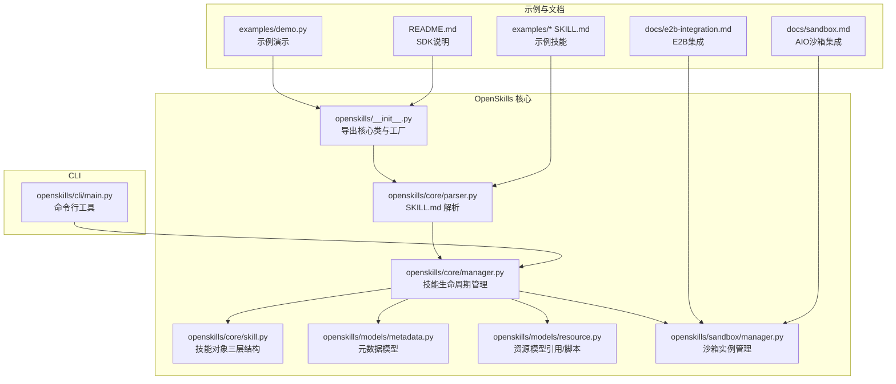
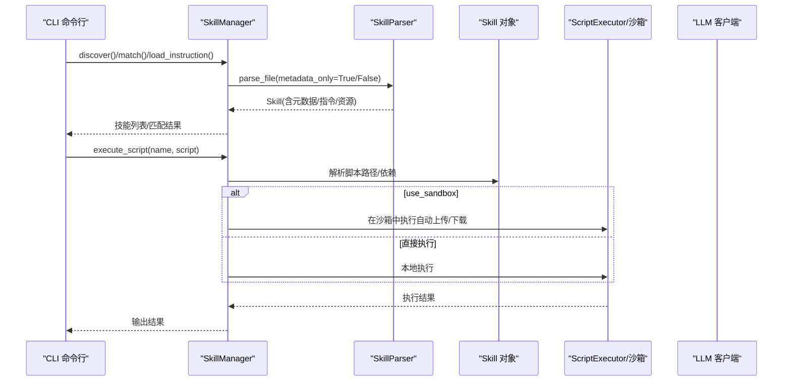
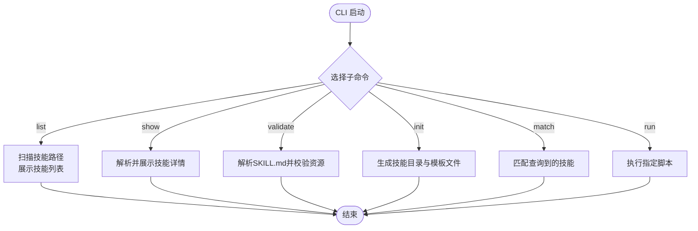
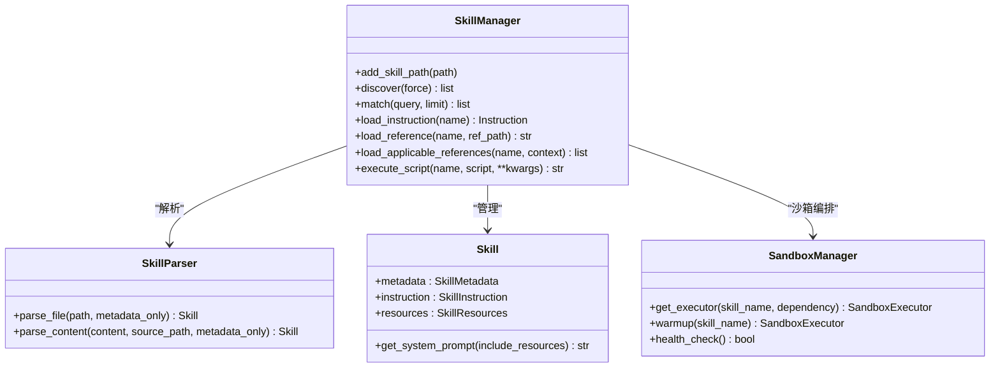
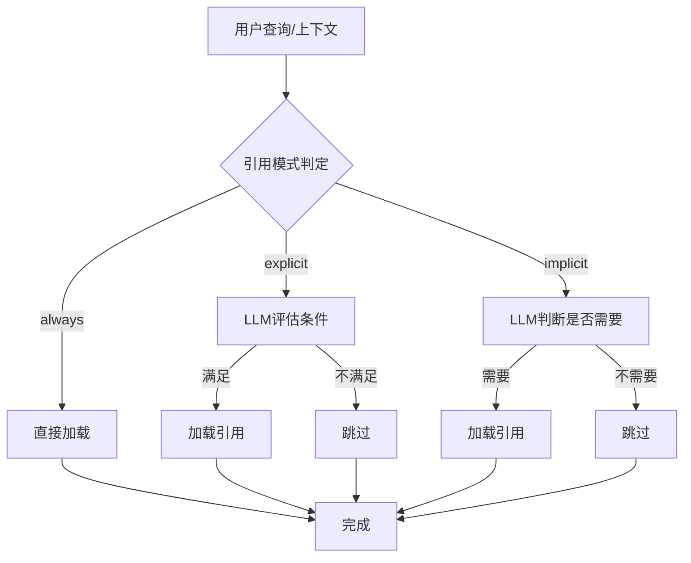
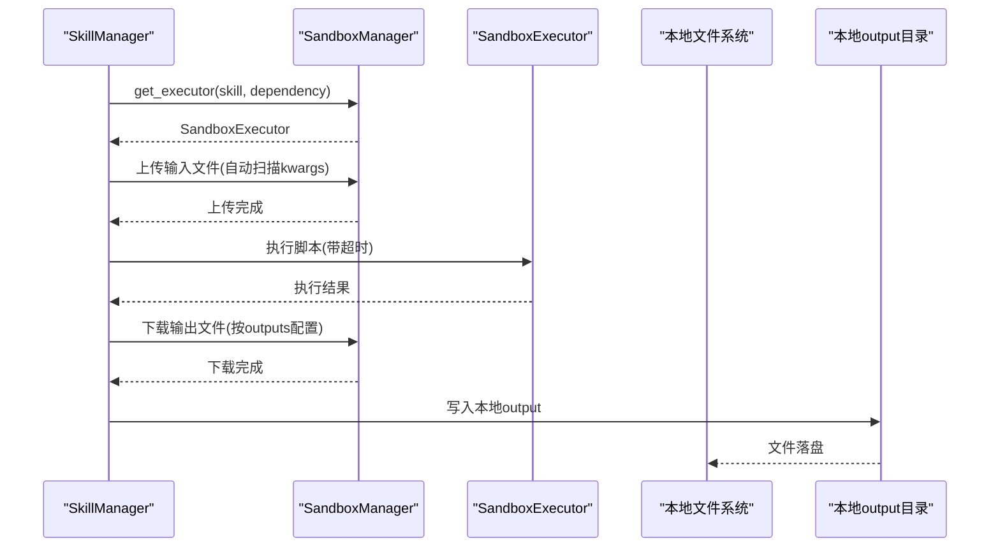
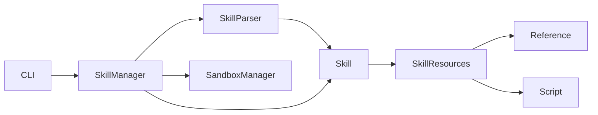

# 技能集成与扩展

<cite>
**本文引用的文件**
- [OpenSkills 主入口](file://OpenSkills-main/openskills/__init__.py)
- [CLI 主程序](file://OpenSkills-main/openskills/cli/main.py)
- [技能管理器](file://OpenSkills-main/openskills/core/manager.py)
- [技能对象](file://OpenSkills-main/openskills/core/skill.py)
- [元数据模型](file://OpenSkills-main/openskills/models/metadata.py)
- [解析器](file://OpenSkills-main/openskills/core/parser.py)
- [资源模型](file://OpenSkills-main/openskills/models/resource.py)
- [沙箱管理器](file://OpenSkills-main/openskills/sandbox/manager.py)
- [SDK 说明文档](file://OpenSkills-main/README.md)
- [示例：演示脚本](file://OpenSkills-main/examples/demo.py)
- [示例：提示词优化 SKILL.md](file://OpenSkills-main/examples/prompt-optimizer/README.md)
- [示例：会议纪要 SKILL.md](file://OpenSkills-main/examples/meeting-summary/SKILL.md)
- [示例：文件转文章 SKILL.md](file://OpenSkills-main/examples/file-to-article-generator/SKILL.md)
- [E2B 沙箱集成指南](file://OpenSkills-main/docs/e2b-integration.md)
- [AIO 沙箱集成指南](file://OpenSkills-main/docs/sandbox.md)
</cite>

## 目录
1. [简介](#简介)
2. [项目结构](#项目结构)
3. [核心组件](#核心组件)
4. [架构总览](#架构总览)
5. [详细组件分析](#详细组件分析)
6. [依赖关系分析](#依赖关系分析)
7. [性能考量](#性能考量)
8. [故障排查指南](#故障排查指南)
9. [结论](#结论)
10. [附录](#附录)

## 简介
本文件面向AutoMate技能集成与扩展场景，系统化阐述OpenSkills框架与AutoMate主系统的集成方式，覆盖API接口、数据交换与状态同步机制；详解CLI命令行工具的安装、更新与管理操作；深入说明.TRAE配置系统的使用方法（文档、规则、技能、规格）；提供第三方技能库集成与自定义扩展开发指南；设计技能市场与共享机制思路；解释技能依赖管理与版本冲突解决策略。

## 项目结构
OpenSkills采用三层渐进披露架构：元数据层（Layer 1，始终加载）、指令层（Layer 2，按需加载）、资源层（Layer 3，条件加载）。核心模块围绕“技能定义文件（SKILL.md）—解析—管理—执行—沙箱”展开，CLI提供技能发现、校验、初始化、匹配与脚本执行等能力。

**图表来源**
- [OpenSkills 主入口](file://OpenSkills-main/openskills/__init__.py#L1-L50)
- [CLI 主程序](file://OpenSkills-main/openskills/cli/main.py#L1-L437)
- [技能管理器](file://OpenSkills-main/openskills/core/manager.py#L1-L523)
- [技能对象](file://OpenSkills-main/openskills/core/skill.py#L1-L150)
- [元数据模型](file://OpenSkills-main/openskills/models/metadata.py#L1-L83)
- [资源模型](file://OpenSkills-main/openskills/models/resource.py#L1-L204)
- [沙箱管理器](file://OpenSkills-main/openskills/sandbox/manager.py#L1-L237)
- [SDK 说明文档](file://OpenSkills-main/README.md#L1-L411)
- [示例：演示脚本](file://OpenSkills-main/examples/demo.py#L1-L290)
- [E2B 沙箱集成指南](file://OpenSkills-main/docs/e2b-integration.md#L1-L219)
- [AIO 沙箱集成指南](file://OpenSkills-main/docs/sandbox.md#L1-L258)

**章节来源**
- [OpenSkills 主入口](file://OpenSkills-main/openskills/__init__.py#L1-L50)
- [SDK 说明文档](file://OpenSkills-main/README.md#L1-L411)

## 核心组件
- 技能定义与解析：SKILL.md作为统一技能契约，解析器负责抽取元数据、指令与资源定义，支持自动发现references目录。
- 技能管理：管理器负责扫描、注册、发现、匹配、按需加载指令与引用、执行脚本与沙箱编排。
- 资源模型：引用（Reference）与脚本（Script）两类资源，支持三种加载模式（显式/隐式/总是）。
- 沙箱执行：通过沙箱管理器统一生命周期与依赖安装，自动文件上传/下载，支持多种策略（按次、按技能、持久）。
- CLI工具：提供list/show/validate/init/match/run等命令，便于技能安装、验证与调试。

**章节来源**
- [解析器](file://OpenSkills-main/openskills/core/parser.py#L1-L225)
- [技能管理器](file://OpenSkills-main/openskills/core/manager.py#L1-L523)
- [资源模型](file://OpenSkills-main/openskills/models/resource.py#L1-L204)
- [沙箱管理器](file://OpenSkills-main/openskills/sandbox/manager.py#L1-L237)
- [CLI 主程序](file://OpenSkills-main/openskills/cli/main.py#L1-L437)

## 架构总览
OpenSkills采用“渐进披露”三层结构，结合LLM的条件加载与脚本执行，实现轻量发现、按需加载与安全执行。CLI与SDK双入口，既可低耦合使用，也可深度集成到AutoMate主系统。

**图表来源**
- [CLI 主程序](file://OpenSkills-main/openskills/cli/main.py#L34-L422)
- [技能管理器](file://OpenSkills-main/openskills/core/manager.py#L116-L360)
- [解析器](file://OpenSkills-main/openskills/core/parser.py#L33-L100)
- [沙箱管理器](file://OpenSkills-main/openskills/sandbox/manager.py#L89-L147)

## 详细组件分析

### 组件A：CLI命令行工具
- 功能概览
  - 列表展示：列出可用技能，支持详细模式。
  - 详情查看：展示技能元数据、触发词、引用、脚本与指令。
  - 校验：校验SKILL.md格式与资源文件存在性。
  - 初始化：基于模板创建新技能目录结构与示例文件。
  - 匹配：基于查询匹配技能。
  - 执行：直接运行指定技能脚本。
- 使用方法
  - 列表：openskills list [--path] [--verbose]
  - 查看：openskills show <name> [--path]
  - 校验：openskills validate <path|dir>
  - 初始化：openskills init <dir> --name --description [--with-example]
  - 匹配：openskills match "<query>" [--path] [--limit]
  - 执行：openskills run <name> <script> [--path]
- 与AutoMate集成建议
  - 将CLI封装为后台服务或进程调用，统一输出结构化结果，便于前端渲染与日志采集。
  - 在AutoMate设置页暴露常用命令入口，支持批量校验与初始化模板。

**图表来源**
- [CLI 主程序](file://OpenSkills-main/openskills/cli/main.py#L40-L422)

**章节来源**
- [CLI 主程序](file://OpenSkills-main/openskills/cli/main.py#L1-L437)

### 组件B：技能管理器与执行管线
- 发现与注册：遍历技能路径，扫描SKILL.md，仅解析元数据，建立索引。
- 加载指令：按需加载SKILL.md正文为指令层。
- 条件加载引用：根据上下文与模式（显式/隐式/总是）决定引用加载。
- 执行脚本：解析脚本路径，支持本地或沙箱执行；自动文件上传/下载。
- 沙箱策略：按次、按技能、持久三种策略，支持依赖安装与缓存。
- 与AutoMate集成建议
  - 在AutoMate启动阶段预热发现，建立技能索引；在对话阶段按需加载指令与引用。
  - 将脚本执行结果映射为AutoMate的消息流，支持状态回传与UI反馈。

**图表来源**
- [技能管理器](file://OpenSkills-main/openskills/core/manager.py#L24-L523)
- [解析器](file://OpenSkills-main/openskills/core/parser.py#L19-L225)
- [技能对象](file://OpenSkills-main/openskills/core/skill.py#L19-L150)
- [沙箱管理器](file://OpenSkills-main/openskills/sandbox/manager.py#L30-L237)

**章节来源**
- [技能管理器](file://OpenSkills-main/openskills/core/manager.py#L1-L523)
- [解析器](file://OpenSkills-main/openskills/core/parser.py#L1-L225)
- [技能对象](file://OpenSkills-main/openskills/core/skill.py#L1-L150)
- [沙箱管理器](file://OpenSkills-main/openskills/sandbox/manager.py#L1-L237)

### 组件C：资源与引用加载策略
- 引用模式
  - 显式（explicit）：由LLM评估条件是否满足。
  - 隐式（implicit）：默认模式，由LLM判断是否需要加载。
  - 总是（always）：始终加载，常用于安全规范或规格。
- 自动发现：references/目录下支持.md/.txt/.json/.yaml等扩展名，递归扫描。
- 脚本执行：支持超时、沙箱开关、输出文件同步路径。
- 与AutoMate集成建议
  - 在AutoMate中为引用加载增加“条件可视化”与“上下文匹配度”展示。
  - 将脚本执行结果映射为消息节点，支持重试与回滚。

**图表来源**
- [资源模型](file://OpenSkills-main/openskills/models/resource.py#L38-L110)

**章节来源**
- [资源模型](file://OpenSkills-main/openskills/models/resource.py#L1-L204)

### 组件D：沙箱执行与文件同步
- 策略选择：按次、按技能、持久；支持依赖安装与缓存。
- 文件同步：自动上传输入文件至沙箱，自动下载输出目录到本地output。
- 健康检查与预热：支持沙箱健康检查与提前初始化。
- 第三方沙箱适配：提供E2B适配器思路，可替换底层客户端。
- 与AutoMate集成建议
  - 在AutoMate中提供沙箱状态面板与日志流；对大文件上传/下载增加进度条。
  - 将沙箱执行结果与AutoMate的文件系统/数据库打通，实现跨会话状态恢复。

**图表来源**
- [技能管理器](file://OpenSkills-main/openskills/core/manager.py#L319-L493)
- [沙箱管理器](file://OpenSkills-main/openskills/sandbox/manager.py#L89-L147)
- [AIO 沙箱集成指南](file://OpenSkills-main/docs/sandbox.md#L148-L220)

**章节来源**
- [技能管理器](file://OpenSkills-main/openskills/core/manager.py#L265-L493)
- [沙箱管理器](file://OpenSkills-main/openskills/sandbox/manager.py#L1-L237)
- [AIO 沙箱集成指南](file://OpenSkills-main/docs/sandbox.md#L1-L258)
- [E2B 沙箱集成指南](file://OpenSkills-main/docs/e2b-integration.md#L84-L159)

### 组件E：示例技能与最佳实践
- 提示词优化：展示引用自动发现与LLM智能加载。
- 会议纪要：演示显式条件引用与脚本触发。
- 文件转文章：展示依赖声明、脚本调用与输出同步。
- 与AutoMate集成建议
  - 将示例技能作为AutoMate内置模板，提供一键导入与参数化配置。
  - 在AutoMate中提供“技能质量评分”与“依赖健康检查”。

**章节来源**
- [示例：演示脚本](file://OpenSkills-main/examples/demo.py#L1-L290)
- [示例：提示词优化 SKILL.md](file://OpenSkills-main/examples/prompt-optimizer/README.md#L1-L131)
- [示例：会议纪要 SKILL.md](file://OpenSkills-main/examples/meeting-summary/SKILL.md#L1-L82)
- [示例：文件转文章 SKILL.md](file://OpenSkills-main/examples/file-to-article-generator/SKILL.md#L1-L179)

## 依赖关系分析
- 模块内聚与耦合
  - SkillManager高内聚于技能生命周期管理，依赖Parser、Matcher、Executor与SandboxManager。
  - Parser专注于SKILL.md解析，与Skill、Resource解耦。
  - Resource模型独立，支持三种加载模式与自动发现。
  - SandboxManager提供策略抽象，便于替换底层沙箱实现。
- 外部依赖
  - LLM客户端：OpenAI兼容、Azure OpenAI等。
  - 沙箱：AIO Sandbox或E2B，通过适配器接入。
- 循环依赖
  - 未发现循环依赖；模块职责清晰，接口边界明确。

**图表来源**
- [解析器](file://OpenSkills-main/openskills/core/parser.py#L19-L225)
- [技能管理器](file://OpenSkills-main/openskills/core/manager.py#L24-L116)
- [资源模型](file://OpenSkills-main/openskills/models/resource.py#L180-L204)
- [CLI 主程序](file://OpenSkills-main/openskills/cli/main.py#L16-L37)

**章节来源**
- [解析器](file://OpenSkills-main/openskills/core/parser.py#L1-L225)
- [技能管理器](file://OpenSkills-main/openskills/core/manager.py#L1-L143)
- [资源模型](file://OpenSkills-main/openskills/models/resource.py#L1-L204)
- [CLI 主程序](file://OpenSkills-main/openskills/cli/main.py#L1-L437)

## 性能考量
- 层次化加载
  - 仅在发现阶段加载元数据，按需加载指令与引用，降低内存占用与启动延迟。
- 缓存与复用
  - 沙箱按技能缓存与持久策略减少重复初始化成本。
- I/O优化
  - 自动文件上传/下载采用增量与目录递归，避免重复传输。
- 并发与超时
  - 脚本执行设置超时，避免阻塞；沙箱任务支持异步状态轮询。
- 建议
  - 在AutoMate中引入“技能预热队列”，在空闲时段预加载高频技能。
  - 对大型引用文件启用压缩与分块传输策略。

[本节为通用指导，无需特定文件来源]

## 故障排查指南
- CLI常见问题
  - 未找到技能：确认技能路径与SKILL.md存在；使用validate检查格式。
  - 执行失败：检查脚本路径、权限与超时；查看沙箱日志。
- 沙箱问题
  - 无法连接：检查沙箱服务健康状态；确认端口与网络。
  - 依赖安装失败：核对依赖声明；切换策略（按次/持久）重试。
- 引用加载异常
  - 条件不生效：确认引用模式与条件表达；必要时改为always。
- 与AutoMate集成问题
  - 状态不同步：检查消息回调与状态回传逻辑；确保输出映射正确。
  - 性能瓶颈：开启缓存与预热；拆分大任务为流水线。

**章节来源**
- [CLI 主程序](file://OpenSkills-main/openskills/cli/main.py#L155-L200)
- [沙箱管理器](file://OpenSkills-main/openskills/sandbox/manager.py#L208-L226)

## 结论
OpenSkills通过三层渐进披露与LLM驱动的条件加载，实现了高效、安全、可扩展的技能体系。CLI与SDK双入口满足从开发调试到生产集成的不同需求。结合AIO/E2B沙箱，OpenSkills可在AutoMate中实现强大的技能市场与共享机制，支持版本化管理、依赖隔离与状态同步。

[本节为总结，无需特定文件来源]

## 附录

### A. 与AutoMate主系统的集成方式
- API接口
  - SDK工厂：通过工厂方法创建Agent或Manager，注入技能路径与LLM客户端。
  - 状态同步：将脚本执行结果与引用加载事件映射为消息，推送至AutoMate消息总线。
- 数据交换
  - 输入：用户消息、文件路径（自动上传）、参数JSON。
  - 输出：结构化响应、引用内容片段、脚本执行结果、输出文件路径。
- 控制流
  - 发现→匹配→指令加载→引用条件评估→脚本执行→结果回传。

**章节来源**
- [OpenSkills 主入口](file://OpenSkills-main/openskills/__init__.py#L21-L49)
- [SDK 说明文档](file://OpenSkills-main/README.md#L32-L100)

### B. CLI命令行工具使用方法
- 列表与详情
  - openskills list [--path ~/.openskills/... --verbose]
  - openskills show <name> [--path]
- 校验与初始化
  - openskills validate <SKILL.md|dir>
  - openskills init <dir> --name --description [--with-example]
- 匹配与执行
  - openskills match "<query>" [--limit N]
  - openskills run <name> <script> [--path]

**章节来源**
- [CLI 主程序](file://OpenSkills-main/openskills/cli/main.py#L40-L422)

### C. .TRAES配置系统使用
- 文档（documents）
  - 用于存放通用知识库与背景材料，支持自动发现与条件加载。
- 规则（rules）
  - 存放业务规则与约束，可设为always模式确保始终加载。
- 技能（skills）
  - 每个技能以SKILL.md为契约，references与scripts目录组织资源。
- 规格（specs）
  - 存放接口/数据/行为规范，建议always模式，保证一致性。
- 与AutoMate集成建议
  - 将.TRAE目录映射为AutoMate的知识中心；提供搜索与分类浏览。
  - 在技能编辑器中可视化引用加载条件与脚本参数。

**章节来源**
- [资源模型](file://OpenSkills-main/openskills/models/resource.py#L1-L204)
- [解析器](file://OpenSkills-main/openskills/core/parser.py#L175-L208)

### D. 第三方技能库集成与自定义扩展
- 集成方法
  - 将第三方技能目录加入技能路径，使用openskills list/show/validate进行验证。
  - 若第三方使用不同沙箱，通过适配器替换底层客户端。
- 自定义扩展
  - 新增LLM客户端：实现统一接口，注入到Agent或Manager。
  - 新增沙箱客户端：遵循CommandResult约定，替换SandboxClient。
  - 新增匹配器：实现自定义匹配逻辑，替换默认匹配器。

**章节来源**
- [E2B 沙箱集成指南](file://OpenSkills-main/docs/e2b-integration.md#L84-L159)
- [AIO 沙箱集成指南](file://OpenSkills-main/docs/sandbox.md#L148-L205)

### E. 技能市场与共享机制设计
- 设计思路
  - 技能商店：提供搜索、评分、评论与版本历史。
  - 共享协议：标准化SKILL.md字段与依赖声明，支持版本语义化。
  - 安全审计：对脚本与依赖进行白名单与沙箱执行。
  - 自动化测试：CI/CD流水线校验技能质量与兼容性。
- 与AutoMate集成
  - 在AutoMate中嵌入技能商店页面；支持一键安装与升级。
  - 提供技能导入向导与依赖冲突检测。

[本节为概念性设计，无需特定文件来源]

### F. 技能依赖管理与版本冲突解决
- 依赖声明
  - 在SKILL.md中声明python/system依赖；沙箱按需安装。
- 版本策略
  - 使用语义化版本；在冲突时优先选择更高版本或提供降级方案。
- 冲突解决
  - 通过沙箱隔离不同依赖集；或在AutoMate中提供依赖矩阵视图。
  - 对于脚本输出文件，采用输出目录同步策略避免覆盖。

**章节来源**
- [SDK 说明文档](file://OpenSkills-main/README.md#L146-L176)
- [沙箱管理器](file://OpenSkills-main/openskills/sandbox/manager.py#L119-L130)