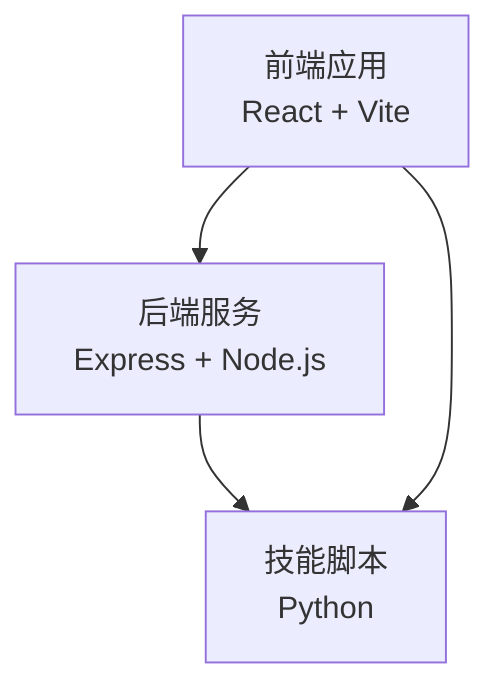
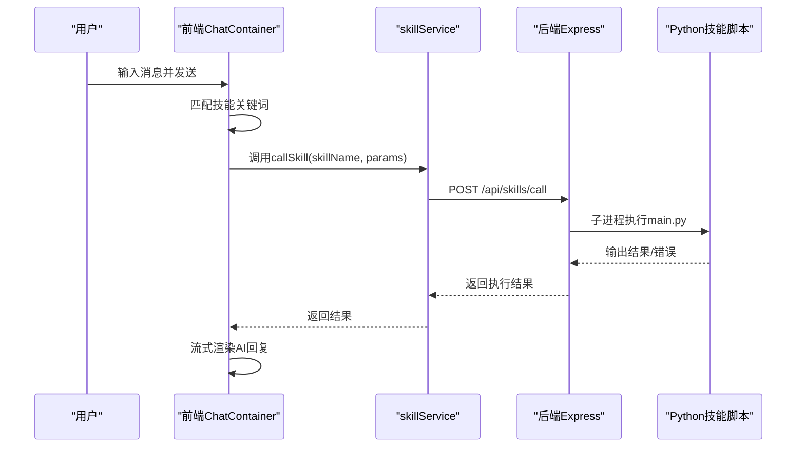
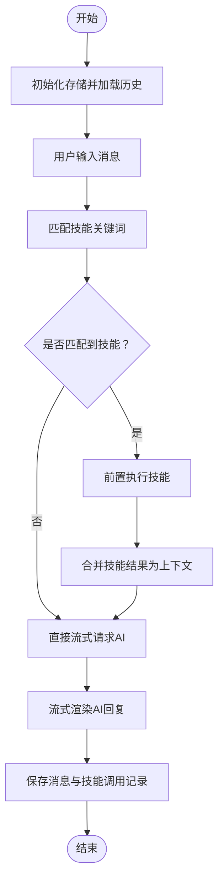
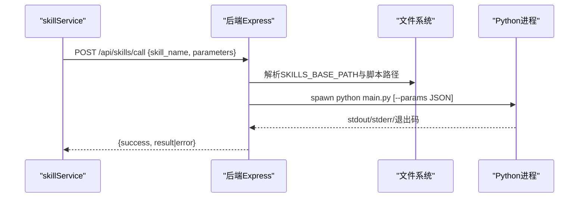
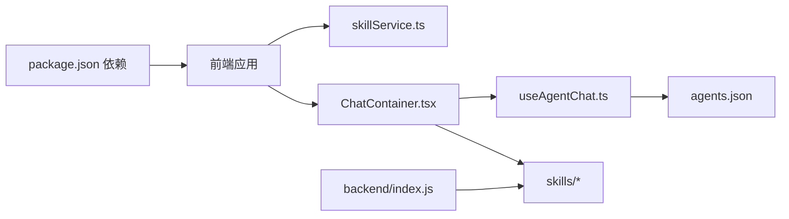

# 常见问题

<cite>
**本文引用的文件**
- [package.json](file://package.json)
- [backend/index.js](file://backend/index.js)
- [src/main.tsx](file://src/main.tsx)
- [config/agents.json](file://config/agents.json)
- [src/services/skillService.ts](file://src/services/skillService.ts)
- [src/components/chat/ChatContainer.tsx](file://src/components/chat/ChatContainer.tsx)
- [src/hooks/useAgentChat.ts](file://src/hooks/useAgentChat.ts)
- [src/store/useAppStore.ts](file://src/store/useAppStore.ts)
- [src/types/chat.ts](file://src/types/chat.ts)
- [skills/weather_query/main.py](file://skills/weather_query/main.py)
- [skills/todo-query/main.py](file://skills/todo-query/main.py)
- [skills/todo-query/SKILL.md](file://skills/todo-query/SKILL.md)
</cite>

## 目录
1. [简介](#简介)
2. [项目结构](#项目结构)
3. [核心组件](#核心组件)
4. [架构总览](#架构总览)
5. [详细组件分析](#详细组件分析)
6. [依赖关系分析](#依赖关系分析)
7. [性能考虑](#性能考虑)
8. [故障排查指南](#故障排查指南)
9. [结论](#结论)
10. [附录](#附录)

## 简介
本FAQ面向AutoMate用户，聚焦应用启动失败、技能调用异常、聊天界面无响应等典型问题，提供症状描述、可能原因、复现步骤与解决步骤，并覆盖安装、配置、权限等常见场景。文档同时给出关键流程的可视化图示，帮助快速定位与解决问题。

## 项目结构
AutoMate采用前后端分离架构：
- 前端基于React + TypeScript，通过Vite构建与开发；入口为main.tsx，路由与页面组件位于src/pages与src/components。
- 后端为Node.js + Express，提供技能调用代理与API，监听本地端口。
- 技能以Python脚本形式组织，位于skills目录下，由后端通过子进程调用。

图表来源
- [src/main.tsx](file://src/main.tsx#L1-L12)
- [backend/index.js](file://backend/index.js#L1-L117)

章节来源
- [package.json](file://package.json#L1-L47)
- [src/main.tsx](file://src/main.tsx#L1-L12)
- [backend/index.js](file://backend/index.js#L1-L117)

## 核心组件
- 前端聊天容器：负责消息渲染、输入处理、技能关键词匹配、流式输出与本地存储初始化。
- 技能服务：封装对后端技能API的调用，统一错误处理与超时控制。
- 后端技能服务：接收前端请求，定位技能脚本，以子进程方式执行Python脚本，捕获标准输出与错误输出并返回结果。
- 智能体与技能配置：agents.json定义智能体分组、配置与可用技能，前端按需加载并注入系统提示。

章节来源
- [src/components/chat/ChatContainer.tsx](file://src/components/chat/ChatContainer.tsx#L1-L756)
- [src/services/skillService.ts](file://src/services/skillService.ts#L1-L73)
- [backend/index.js](file://backend/index.js#L1-L117)
- [config/agents.json](file://config/agents.json#L1-L119)

## 架构总览
前端通过Axios向后端发起技能调用请求，后端根据技能名定位Python脚本并执行，将结果回传给前端。聊天流程支持技能前置执行与流式输出。

图表来源
- [src/components/chat/ChatContainer.tsx](file://src/components/chat/ChatContainer.tsx#L174-L211)
- [src/services/skillService.ts](file://src/services/skillService.ts#L12-L61)
- [backend/index.js](file://backend/index.js#L81-L104)
- [skills/weather_query/main.py](file://skills/weather_query/main.py#L1-L139)

## 详细组件分析

### 组件A：聊天容器与技能匹配
- 功能要点
  - 初始化混合存储，加载最近24小时聊天历史。
  - 基于关键词映射表匹配用户输入与可用技能，支持模糊匹配与清洗后的文本匹配。
  - 技能前置执行：在AI回复前先调用匹配到的技能，将结果拼接为上下文。
  - 流式输出：逐块推送AI回复，支持“思考”标记解析与状态更新。
- 关键流程图

图表来源
- [src/components/chat/ChatContainer.tsx](file://src/components/chat/ChatContainer.tsx#L105-L172)
- [src/components/chat/ChatContainer.tsx](file://src/components/chat/ChatContainer.tsx#L174-L211)
- [src/components/chat/ChatContainer.tsx](file://src/components/chat/ChatContainer.tsx#L240-L392)

章节来源
- [src/components/chat/ChatContainer.tsx](file://src/components/chat/ChatContainer.tsx#L1-L756)

### 组件B：技能服务与后端执行
- 前端技能服务
  - 统一超时时间与错误分类，区分网络错误、超时与后端错误。
  - 自动注入messageId与agentId参数，便于追踪。
- 后端技能服务
  - 校验必填参数，定位技能脚本路径，构造子进程参数，捕获stdout/stderr与退出码。
  - 成功返回结果字符串，失败返回错误信息。

图表来源
- [src/services/skillService.ts](file://src/services/skillService.ts#L12-L61)
- [backend/index.js](file://backend/index.js#L19-L79)

章节来源
- [src/services/skillService.ts](file://src/services/skillService.ts#L1-L73)
- [backend/index.js](file://backend/index.js#L1-L117)

### 组件C：智能体与技能配置
- agents.json定义智能体分组、描述、模型配置与可用技能清单。
- 前端useAgentChat在组件挂载时加载agents.json，构建技能描述映射，供系统提示注入。

章节来源
- [config/agents.json](file://config/agents.json#L1-L119)
- [src/hooks/useAgentChat.ts](file://src/hooks/useAgentChat.ts#L25-L49)
- [src/types/chat.ts](file://src/types/chat.ts#L262-L279)

## 依赖关系分析
- 前端依赖
  - Axios用于HTTP请求；Zustand用于全局状态管理；React Router用于页面路由。
  - 聊天容器依赖技能服务与智能体钩子；智能体钩子依赖agents.json与技能描述加载。
- 后端依赖
  - child_process用于执行Python脚本；CORS允许跨域；Express提供REST接口。
- 技能依赖
  - Python脚本依赖requests（如天气查询）、标准库json与sys。

图表来源
- [package.json](file://package.json#L15-L27)
- [src/services/skillService.ts](file://src/services/skillService.ts#L1-L73)
- [src/components/chat/ChatContainer.tsx](file://src/components/chat/ChatContainer.tsx#L1-L756)
- [src/hooks/useAgentChat.ts](file://src/hooks/useAgentChat.ts#L1-L128)
- [config/agents.json](file://config/agents.json#L1-L119)
- [backend/index.js](file://backend/index.js#L1-L117)

章节来源
- [package.json](file://package.json#L1-L47)
- [backend/index.js](file://backend/index.js#L1-L117)

## 性能考虑
- 流式输出：前端按块渲染，减少首字节延迟；后端/模型侧需保证SSE/流式响应稳定。
- 技能前置执行：在AI生成前完成外部查询，缩短整体等待时间；注意控制技能数量与耗时。
- 超时控制：前端与后端均设置超时，避免长时间阻塞；建议根据网络与技能复杂度调整。
- 存储初始化：首次进入聊天页进行混合存储初始化，建议在应用启动阶段预热以提升体验。

## 故障排查指南

### Q1：应用启动失败（前端或后端）
- 症状
  - npm run dev或npm start后页面无法访问，或后端端口未监听。
- 可能原因
  - 依赖未安装或版本冲突；端口被占用；Node/Python环境不可用。
- 复现步骤
  - 执行 npm install 安装依赖。
  - 执行 npm run start 同时启动前端与后端。
  - 访问 http://localhost:5173（前端），确认后端日志显示“技能服务已启动”。
- 解决步骤
  - 安装依赖：npm install。
  - 检查端口占用：关闭占用5173/3001的进程或修改端口。
  - 确认Node.js与Python可执行文件在PATH中。
  - 查看终端输出的错误堆栈，定位具体模块导入或脚本执行问题。

章节来源
- [package.json](file://package.json#L6-L13)
- [backend/index.js](file://backend/index.js#L113-L116)

### Q2：聊天界面无响应或消息不显示
- 症状
  - 输入消息后无任何反馈，或仅显示“开始与智能体对话吧！”占位。
- 可能原因
  - 智能体配置缺失（url/api_key），导致发送消息时提前返回错误。
  - 后端未正确监听或前端Axios请求失败。
  - 技能关键词未匹配到任何技能，但AI未返回内容。
- 复现步骤
  - 选择一个智能体，检查其config.url与api_key是否完整。
  - 在输入框输入任意内容并按回车。
  - 观察前端是否有错误提示或聊天区域无变化。
- 解决步骤
  - 补充智能体配置：在agents.json中为对应智能体填写正确的url、api_key与model。
  - 确认后端服务已启动且可访问。
  - 若使用代理API，确保代理路径与鉴权头正确。
  - 如仍无响应，检查浏览器控制台网络面板与后端日志。

章节来源
- [src/hooks/useAgentChat.ts](file://src/hooks/useAgentChat.ts#L51-L82)
- [config/agents.json](file://config/agents.json#L1-L119)

### Q3：技能调用异常（返回错误或无输出）
- 症状
  - 调用技能后返回“技能执行失败”、“网络错误”或空结果。
- 可能原因
  - 技能脚本路径不存在或参数传递错误。
  - Python环境不可用或第三方API（如天气查询）不可达。
  - 后端spawn子进程失败或脚本抛出异常。
- 复现步骤
  - 在聊天中输入与技能相关的关键词（如“天气”、“待办”）。
  - 观察技能执行结果或错误信息。
- 解决步骤
  - 检查技能脚本存在性与入口函数：例如天气查询脚本与待办查询脚本均存在。
  - 确认Python解释器可用且网络可达。
  - 查看后端日志中的stderr与退出码，定位具体错误。
  - 对于天气查询，若出现“无法识别城市”，请使用标准城市名称（如“北京”、“深圳”）。

章节来源
- [backend/index.js](file://backend/index.js#L19-L79)
- [skills/weather_query/main.py](file://skills/weather_query/main.py#L1-L139)
- [skills/todo-query/main.py](file://skills/todo-query/main.py#L1-L34)

### Q4：技能未触发或未生效
- 症状
  - 输入与技能相关关键词，但未看到技能执行结果被拼接到AI回复中。
- 可能原因
  - 关键词映射不匹配或输入被清洗后丢失关键字。
  - 技能未在智能体的skills列表中声明。
- 复现步骤
  - 在聊天中输入“查询待办事项数量”或“深圳天气”等关键词。
  - 查看AI回复中是否包含技能执行结果片段。
- 解决步骤
  - 确认智能体skills列表包含对应技能名称。
  - 检查ChatContainer中的关键词映射表是否覆盖该技能。
  - 若使用自定义技能，确保SKILL.md存在且路径正确，以便前端加载技能描述。

章节来源
- [src/components/chat/ChatContainer.tsx](file://src/components/chat/ChatContainer.tsx#L105-L172)
- [config/agents.json](file://config/agents.json#L17-L40)
- [skills/todo-query/SKILL.md](file://skills/todo-query/SKILL.md#L1-L24)

### Q5：网络错误或超时
- 症状
  - 前端提示“网络错误”或“请求超时”，后端未收到技能调用请求。
- 可能原因
  - 后端未启动或端口未监听；代理路径错误；Axios超时过短。
- 复现步骤
  - 执行 npm run backend 启动后端。
  - 在前端发起技能调用，观察网络面板与后端日志。
- 解决步骤
  - 确认后端监听端口与日志输出。
  - 检查代理路径与鉴权头是否正确。
  - 调整前端超时时间或后端处理耗时较长的技能。

章节来源
- [src/services/skillService.ts](file://src/services/skillService.ts#L34-L61)
- [backend/index.js](file://backend/index.js#L113-L116)

### Q6：权限问题（Windows）
- 症状
  - 启动后端时报错“找不到python命令”或“权限不足”。
- 可能原因
  - Python未安装或未加入PATH；以受限账户运行导致文件/端口权限不足。
- 复现步骤
  - 在命令行执行 python --version。
  - 尝试以管理员身份运行命令行或IDE。
- 解决步骤
  - 将Python安装目录加入系统PATH。
  - 使用管理员权限运行npm脚本与后端服务。
  - 确保端口3001未被防火墙拦截。

章节来源
- [backend/index.js](file://backend/index.js#L32-L36)

## 结论
通过上述常见问题的诊断与解决步骤，用户可快速定位AutoMate在启动、聊天与技能调用过程中的问题。建议在日常使用中：
- 保持agents.json配置完整；
- 确保后端与Python环境正常；
- 利用前端日志与后端日志交叉排查；
- 合理设置超时与代理路径，保障流式体验。

## 附录

### A. 快速验证清单
- 前端：npm run dev可访问，路由正常。
- 后端：npm run backend可访问，端口监听正常。
- 技能：对应技能脚本存在，Python可执行。
- 配置：agents.json中智能体url/api_key/model完整。
- 网络：代理路径与鉴权头正确，超时合理。

### B. 相关接口与文件索引
- 技能调用接口：/api/skills/call（后端）
- 技能描述加载：/skills/{skillName}/SKILL.md（前端）
- 智能体配置：/config/agents.json（前端加载）