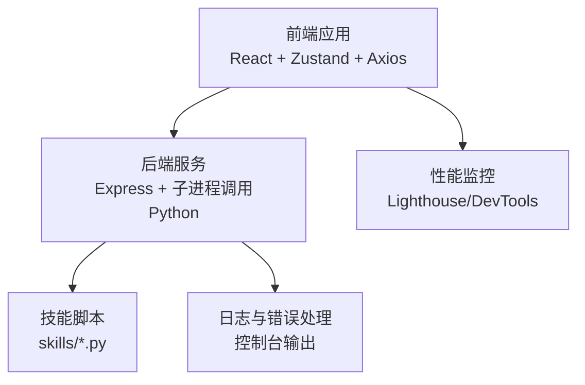
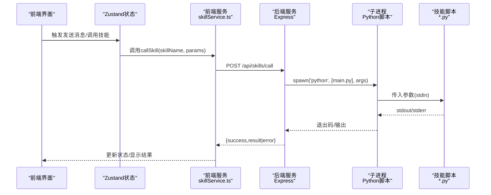
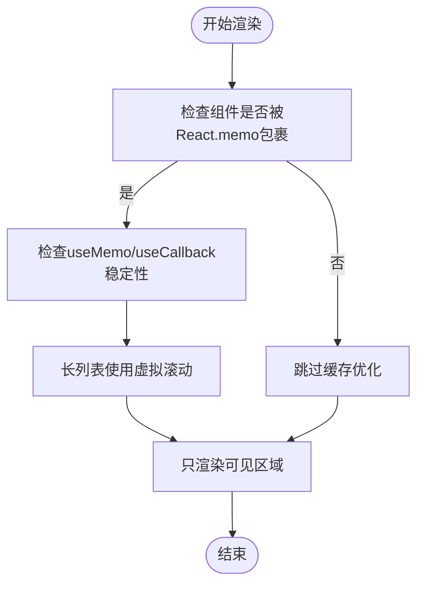
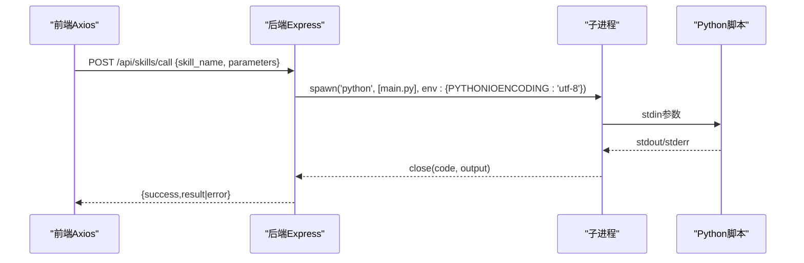
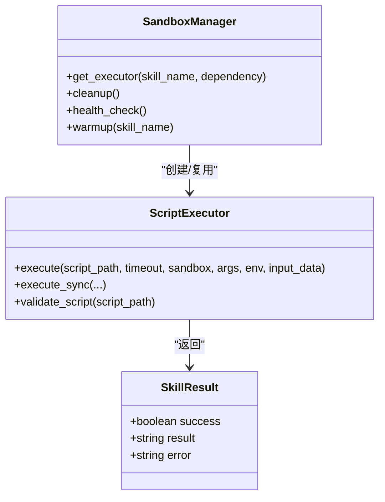
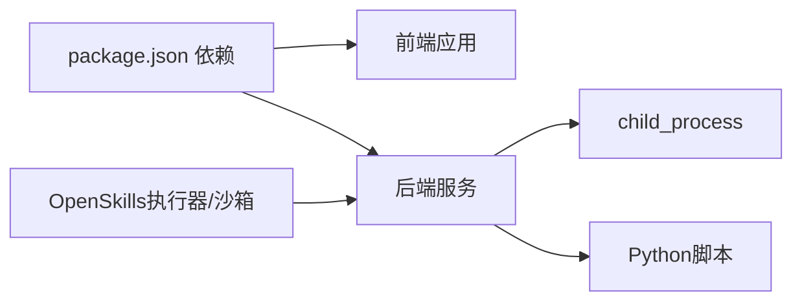

# 性能问题排查

<cite>
**本文引用的文件**
- [package.json](file://package.json)
- [backend/index.js](file://backend/index.js)
- [src/main.tsx](file://src/main.tsx)
- [docs/非功能设计/性能设计.md](file://docs/非功能设计/性能设计.md)
- [src/store/useAppStore.ts](file://src/store/useAppStore.ts)
- [src/services/skillService.ts](file://src/services/skillService.ts)
- [backend/services/skillService.js](file://backend/services/skillService.js)
- [src/hooks/useAgentChat.ts](file://src/hooks/useAgentChat.ts)
- [skills/weather_query/main.py](file://skills/weather_query/main.py)
- [OpenSkills-main/pyproject.toml](file://OpenSkills-main/pyproject.toml)
- [OpenSkills-main/openskills/core/executor.py](file://OpenSkills-main/openskills/core/executor.py)
- [OpenSkills-main/openskills/sandbox/manager.py](file://OpenSkills-main/openskills/sandbox/manager.py)
</cite>

## 目录
1. [简介](#简介)
2. [项目结构](#项目结构)
3. [核心组件](#核心组件)
4. [架构总览](#架构总览)
5. [详细组件分析](#详细组件分析)
6. [依赖关系分析](#依赖关系分析)
7. [性能考量](#性能考量)
8. [故障排查指南](#故障排查指南)
9. [结论](#结论)
10. [附录](#附录)

## 简介
本指南面向AutoMate项目，聚焦于性能问题的诊断与解决，覆盖前端运行卡顿、内存占用高、CPU异常、后端API响应慢、技能执行瓶颈、Python脚本效率与缓存优化、内存泄漏与GC优化、资源清理最佳实践等。文档结合现有代码与设计文档，提供可操作的定位方法、优化策略与排障流程。

## 项目结构
AutoMate采用前后端分离架构：
- 前端基于React + TypeScript，使用Vite构建，状态管理采用Zustand，通过Axios调用后端API。
- 后端基于Express，提供技能调用接口，内部通过子进程调用Python技能脚本。
- 技能以独立Python脚本形式存在，位于skills目录下，部分技能示例已在仓库中提供。
- 性能设计文档提供了明确的性能指标、优化方案与监控建议。

图表来源
- [package.json](file://package.json#L1-L47)
- [backend/index.js](file://backend/index.js#L1-L117)
- [src/services/skillService.ts](file://src/services/skillService.ts#L1-L73)
- [skills/weather_query/main.py](file://skills/weather_query/main.py#L1-L139)

章节来源
- [package.json](file://package.json#L1-L47)
- [backend/index.js](file://backend/index.js#L1-L117)
- [src/main.tsx](file://src/main.tsx#L1-L12)

## 核心组件
- 前端状态与性能
  - Zustand状态管理：集中管理智能体、聊天会话、主题与全局状态，支持消息增删改查、打字态、主题切换等。
  - 组件与渲染优化：使用虚拟滚动、memo、useMemo/useCallback减少重渲染。
  - 请求与超时：Axios封装技能调用，统一超时与错误处理。
- 后端服务与性能
  - Express路由：提供技能调用与健康检查接口。
  - 子进程执行：调用Python脚本，捕获stdout/stderr，处理退出码与错误。
- 技能执行与沙箱
  - Python脚本：示例技能展示网络请求、参数解析与输出格式化。
  - OpenSkills执行器：提供超时、输出截断、环境隔离、脚本校验等能力。
  - 沙箱管理：支持按次执行、按技能复用、持久化三种策略，LRU缓存与清理。

章节来源
- [src/store/useAppStore.ts](file://src/store/useAppStore.ts#L1-L306)
- [src/services/skillService.ts](file://src/services/skillService.ts#L1-L73)
- [backend/index.js](file://backend/index.js#L1-L117)
- [skills/weather_query/main.py](file://skills/weather_query/main.py#L1-L139)
- [OpenSkills-main/openskills/core/executor.py](file://OpenSkills-main/openskills/core/executor.py#L1-L251)
- [OpenSkills-main/openskills/sandbox/manager.py](file://OpenSkills-main/openskills/sandbox/manager.py#L1-L237)

## 架构总览
前端通过Axios向后端发起技能调用请求，后端使用子进程执行对应Python脚本，并将结果返回前端。OpenSkills框架提供了更完善的执行器与沙箱管理能力，可用于进一步优化与安全隔离。

图表来源
- [src/services/skillService.ts](file://src/services/skillService.ts#L1-L73)
- [backend/index.js](file://backend/index.js#L19-L104)
- [skills/weather_query/main.py](file://skills/weather_query/main.py#L116-L139)

## 详细组件分析

### 前端性能监控与状态管理
- 性能监控
  - 使用Performance API采集导航与渲染指标，结合Lighthouse与DevTools进行分析。
  - 关注启动时间、首屏渲染、资源加载、交互响应等关键指标。
- 状态管理优化
  - 使用Zustand集中管理聊天消息、打字态、主题与全局状态，避免跨组件重复渲染。
  - 通过合理拆分状态与更新粒度，降低不必要的重渲染。
- 组件渲染优化
  - 使用虚拟滚动处理长列表。
  - 使用React.memo、useMemo、useCallback稳定引用与缓存计算结果。

图表来源
- [docs/非功能设计/性能设计.md](file://docs/非功能设计/性能设计.md#L69-L95)
- [src/store/useAppStore.ts](file://src/store/useAppStore.ts#L143-L165)

章节来源
- [docs/非功能设计/性能设计.md](file://docs/非功能设计/性能设计.md#L174-L229)
- [src/store/useAppStore.ts](file://src/store/useAppStore.ts#L1-L306)

### 后端API响应时间分析
- 接口职责
  - /api/skills/call：接收技能名称与参数，调用Python脚本并返回结果。
  - /api/skills：健康检查。
- 性能关注点
  - 子进程启动开销、脚本执行时间、stdout/stderr读取与拼接。
  - 参数传递与编码（UTF-8），错误处理与超时控制。
- 优化建议
  - 对热点技能进行预热与缓存（参考OpenSkills沙箱策略）。
  - 合理设置超时与输出截断，避免长时间阻塞。
  - 结合日志与错误码定位失败原因（如权限、参数缺失、脚本异常）。

图表来源
- [backend/index.js](file://backend/index.js#L81-L104)
- [backend/index.js](file://backend/index.js#L19-L79)

章节来源
- [backend/index.js](file://backend/index.js#L1-L117)
- [src/services/skillService.ts](file://src/services/skillService.ts#L1-L73)

### 技能执行性能瓶颈与优化
- Python脚本执行
  - 示例技能展示了网络请求、参数解析与格式化输出，注意超时与异常处理。
  - 对外部API调用应设置合理超时与重试策略，避免阻塞主线程。
- 执行器与沙箱
  - OpenSkills执行器提供超时、输出截断、环境隔离与脚本校验。
  - 沙箱管理支持多种复用策略（按次、按技能、持久化），可降低冷启动成本。
- 缓存机制优化
  - 对频繁调用且结果稳定的技能，可在后端或前端引入缓存。
  - 利用LRU缓存与健康检查，平衡性能与一致性。

图表来源
- [OpenSkills-main/openskills/core/executor.py](file://OpenSkills-main/openskills/core/executor.py#L24-L251)
- [OpenSkills-main/openskills/sandbox/manager.py](file://OpenSkills-main/openskills/sandbox/manager.py#L30-L237)

章节来源
- [skills/weather_query/main.py](file://skills/weather_query/main.py#L1-L139)
- [OpenSkills-main/openskills/core/executor.py](file://OpenSkills-main/openskills/core/executor.py#L1-L251)
- [OpenSkills-main/openskills/sandbox/manager.py](file://OpenSkills-main/openskills/sandbox/manager.py#L1-L237)

### 内存泄漏检测、垃圾回收与资源清理
- 前端
  - 避免闭包持有长生命周期引用；及时清理事件监听、定时器与订阅。
  - 使用WeakMap/WeakSet管理可选关联，防止对象无法被GC回收。
  - 对高频创建的对象使用对象池，减少分配与GC压力。
- 后端
  - 子进程结束后及时关闭stdin/stdout/stderr，避免句柄泄漏。
  - 对错误输出与临时数据进行截断与清理，防止内存累积。
- 资源清理
  - 按需释放缓存与连接，定期检查未释放资源。
  - 对外部依赖（如数据库、网络客户端）进行显式关闭。

章节来源
- [docs/非功能设计/性能设计.md](file://docs/非功能设计/性能设计.md#L136-L153)
- [backend/index.js](file://backend/index.js#L32-L79)

## 依赖关系分析
- 前端依赖
  - React、Zustand、Axios、Tailwind等，构建与开发工具链由Vite与TypeScript提供。
- 后端依赖
  - Express、CORS、child_process用于子进程调用Python脚本。
- 技能与框架
  - Python脚本依赖requests等库；OpenSkills提供执行器与沙箱能力。

图表来源
- [package.json](file://package.json#L15-L44)
- [backend/index.js](file://backend/index.js#L1-L12)
- [OpenSkills-main/pyproject.toml](file://OpenSkills-main/pyproject.toml#L22-L28)

章节来源
- [package.json](file://package.json#L1-L47)
- [OpenSkills-main/pyproject.toml](file://OpenSkills-main/pyproject.toml#L1-L75)

## 性能考量
- 指标与目标
  - 启动时间、首屏渲染、资源加载、界面响应、消息发送延迟、数据库查询/写入、文件处理速度等。
- 优化方向
  - 启动与渲染：预加载、懒加载、代码分割、虚拟滚动、组件缓存。
  - 数据加载：分页、缓存策略（内存/本地/IndexedDB）、请求合并与压缩。
  - 数据库：索引优化、查询限制、连接池。
  - 网络：CDN、HTTP缓存、压缩、WebSocket优化。
  - 内存：对象池、弱引用、垃圾回收策略。
- 工具与报告
  - 前端：Lighthouse、DevTools、React Profiler。
  - 后端：cProfile、Py-Spy、Memory Profiler。
  - 测试：Locust、Apache Bench、JMeter。

章节来源
- [docs/非功能设计/性能设计.md](file://docs/非功能设计/性能设计.md#L1-L292)

## 故障排查指南

### 前端运行缓慢/卡顿
- 症状
  - 首屏渲染慢、滚动卡顿、按钮点击响应慢。
- 排查步骤
  - 使用Lighthouse与DevTools Performance分析关键路径，定位长任务与阻塞。
  - 检查是否存在过度重渲染：确认组件是否正确使用memo与缓存钩子。
  - 长列表是否启用虚拟滚动；是否使用了不必要的大图或字体。
  - 是否存在未清理的定时器/订阅/事件监听。
- 优化建议
  - 启用代码分割与路由懒加载。
  - 使用useMemo/useCallback稳定引用，减少子组件重渲染。
  - 长列表使用虚拟滚动，图片与资源按需加载。

章节来源
- [docs/非功能设计/性能设计.md](file://docs/非功能设计/性能设计.md#L69-L95)
- [src/store/useAppStore.ts](file://src/store/useAppStore.ts#L1-L306)

### 内存占用过高
- 症状
  - 页面内存持续增长，出现频繁GC或白屏。
- 排查步骤
  - 使用DevTools Memory面板快照对比，定位泄漏对象类型与来源。
  - 检查Zustand状态是否无限增长（消息列表未清理）。
  - 是否存在闭包持有历史引用导致无法回收。
- 优化建议
  - 限制消息列表长度，定期清理旧消息。
  - 使用WeakMap/WeakSet管理可选关联。
  - 对高频对象使用对象池，减少频繁分配。

章节来源
- [docs/非功能设计/性能设计.md](file://docs/非功能设计/性能设计.md#L136-L153)
- [src/store/useAppStore.ts](file://src/store/useAppStore.ts#L143-L240)

### CPU使用率异常
- 症状
  - 发送消息或切换页面时CPU飙升。
- 排查步骤
  - 使用DevTools Performance录制，查看长任务与热点函数。
  - 检查是否存在死循环、递归深度过大或密集计算。
  - 确认是否在渲染阶段执行昂贵操作（如字符串拼接、正则替换）。
- 优化建议
  - 将计算移至Web Worker或后台线程。
  - 使用useMemo缓存中间结果，避免重复计算。
  - 分批处理长列表与批量更新。

章节来源
- [docs/非功能设计/性能设计.md](file://docs/非功能设计/性能设计.md#L69-L95)

### 后端API响应慢
- 症状
  - /api/skills/call响应时间长或超时。
- 排查步骤
  - 查看后端日志，确认子进程启动与脚本执行耗时。
  - 检查参数传递、编码设置（UTF-8）与stdout/stderr读取。
  - 对外部API调用设置超时与降级策略。
- 优化建议
  - 对热点技能进行预热与缓存。
  - 合理设置超时与输出截断，避免长时间阻塞。
  - 使用OpenSkills沙箱策略（按技能复用）降低冷启动。

章节来源
- [backend/index.js](file://backend/index.js#L19-L104)
- [OpenSkills-main/openskills/sandbox/manager.py](file://OpenSkills-main/openskills/sandbox/manager.py#L115-L147)

### 技能执行性能瓶颈
- 症状
  - 某些技能执行时间长或失败。
- 排查步骤
  - 检查技能脚本中的网络请求、解析与格式化逻辑。
  - 使用OpenSkills执行器设置超时与输出截断。
  - 对外部依赖（如API密钥、网络）进行健康检查。
- 优化建议
  - 对外部请求设置超时与重试。
  - 将可缓存的结果进行本地缓存。
  - 使用异步与并发控制，避免阻塞主线程。

章节来源
- [skills/weather_query/main.py](file://skills/weather_query/main.py#L60-L97)
- [OpenSkills-main/openskills/core/executor.py](file://OpenSkills-main/openskills/core/executor.py#L114-L159)

### 内存泄漏与资源清理
- 症状
  - 页面停留时间越长，内存占用越高。
- 排查步骤
  - 使用DevTools Memory快照对比，定位泄漏对象。
  - 检查Zustand状态增长、未清理的定时器与订阅。
  - 后端子进程是否正确关闭，错误输出是否截断。
- 优化建议
  - 限制状态规模，定期清理历史消息。
  - 使用WeakMap/WeakSet，避免强引用导致无法回收。
  - 显式关闭外部连接与清理临时资源。

章节来源
- [docs/非功能设计/性能设计.md](file://docs/非功能设计/性能设计.md#L136-L153)
- [backend/index.js](file://backend/index.js#L32-L79)

## 结论
AutoMate的性能问题排查应围绕“前端渲染与状态管理、后端API与子进程执行、技能脚本与外部依赖”三大块展开。结合性能设计文档中的指标与优化方案，利用现有工具链（Lighthouse、DevTools、cProfile、Py-Spy）进行持续监控与迭代，可有效缓解启动慢、渲染卡顿、内存占用高、CPU异常与API响应慢等问题。对技能执行，建议引入缓存与沙箱复用策略，提升整体吞吐与稳定性。

## 附录
- 性能测试流程
  - 确定目标 → 设计场景 → 执行测试 → 收集数据 → 分析结果 → 提出优化建议。
- 常用工具
  - 前端：Lighthouse、WebPageTest、Chrome DevTools、React Profiler。
  - 后端：cProfile、Py-Spy、Memory Profiler、Locust、JMeter。

章节来源
- [docs/非功能设计/性能设计.md](file://docs/非功能设计/性能设计.md#L231-L271)