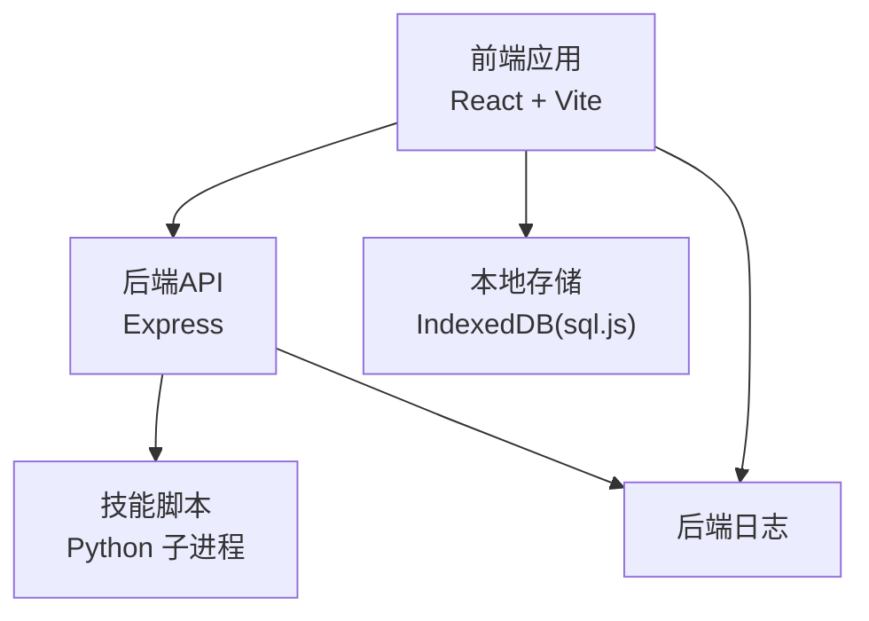
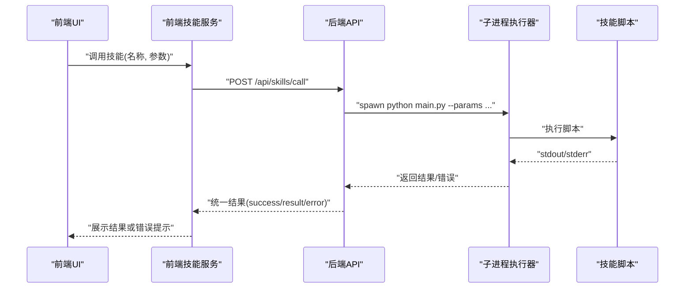
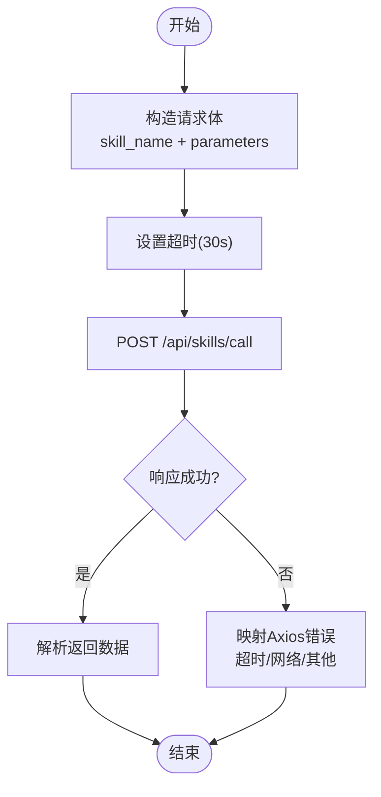
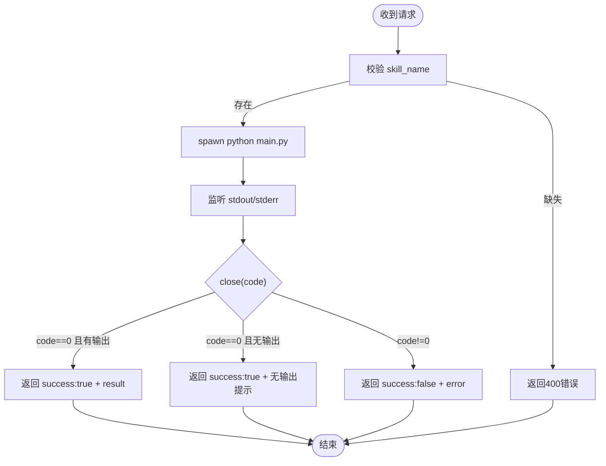
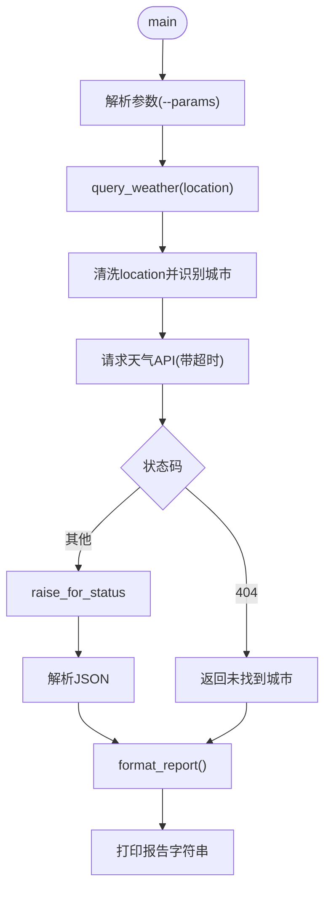
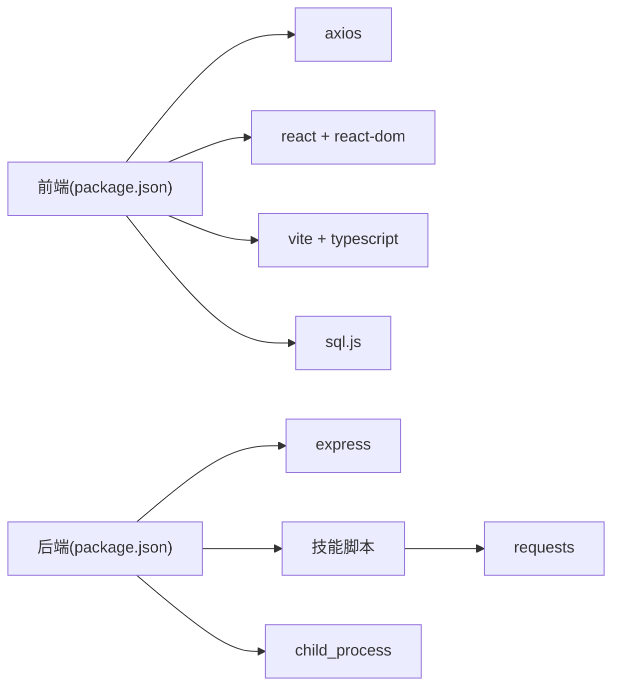

# 故障排除

<cite>
**本文引用的文件**
- [package.json](file://package.json)
- [backend/index.js](file://backend/index.js)
- [src/main.tsx](file://src/main.tsx)
- [src/services/skillService.ts](file://src/services/skillService.ts)
- [src/types/chat.ts](file://src/types/chat.ts)
- [src/services/chatHistoryService.ts](file://src/services/chatHistoryService.ts)
- [skills/weather_query/main.py](file://skills/weather_query/main.py)
- [config/agents.json](file://config/agents.json)
- [docs/基础规范/开发环境配置.md](file://docs/基础规范/开发环境配置.md)
- [docs/非功能设计/可用性设计.md](file://docs/非功能设计/可用性设计.md)
- [docs/非功能设计/可维护性设计.md](file://docs/非功能设计/可维护性设计.md)
- [OpenSkills-main/openskills/sandbox/manager.py](file://OpenSkills-main/openskills/sandbox/manager.py)
- [OpenSkills-main/openskills/models/resource.py](file://OpenSkills-main/openskills/models/resource.py)
- [OpenSkills-main/README.md](file://OpenSkills-main/README.md)
</cite>

## 目录
1. [简介](#简介)
2. [项目结构](#项目结构)
3. [核心组件](#核心组件)
4. [架构总览](#架构总览)
5. [详细组件分析](#详细组件分析)
6. [依赖关系分析](#依赖关系分析)
7. [性能考虑](#性能考虑)
8. [故障排除指南](#故障排除指南)
9. [结论](#结论)
10. [附录](#附录)

## 简介
本指南面向AutoMate项目的使用者与维护者，聚焦于系统运行中的常见问题诊断与解决。内容涵盖：
- 系统性能问题、内存与资源占用分析
- 网络连接问题、API调用失败与技能执行异常排查
- 日志分析方法、调试工具使用与监控指标解读
- 系统崩溃、数据丢失与配置错误的恢复方案
- 第三方依赖问题、版本冲突与兼容性问题的解决思路

## 项目结构
AutoMate采用前后端分离架构：前端基于React + Vite，后端基于Node.js + Express，技能以Python脚本形式在后端通过子进程调用执行。技能清单由配置文件集中管理，前端通过Axios调用后端API，后端再调用对应技能脚本。

图表来源
- [backend/index.js](file://backend/index.js#L1-L117)
- [src/services/skillService.ts](file://src/services/skillService.ts#L1-L73)
- [src/main.tsx](file://src/main.tsx#L1-L12)

章节来源
- [backend/index.js](file://backend/index.js#L1-L117)
- [src/main.tsx](file://src/main.tsx#L1-L12)
- [package.json](file://package.json#L1-L47)

## 核心组件
- 前端技能调用服务：负责向后端发起技能调用请求，并处理超时、网络错误等异常。
- 后端技能服务：接收前端请求，定位并执行对应技能脚本，收集标准输出与错误输出，返回统一结果。
- 技能脚本：具体业务逻辑实现，如天气查询等，遵循约定参数传递与输出格式。
- 配置中心：集中管理代理与技能清单，便于快速定位技能路径与参数。
- 日志与错误处理：前后端均具备基础日志记录与错误提示机制，便于问题定位。

章节来源
- [src/services/skillService.ts](file://src/services/skillService.ts#L1-L73)
- [backend/index.js](file://backend/index.js#L19-L79)
- [skills/weather_query/main.py](file://skills/weather_query/main.py#L1-L139)
- [config/agents.json](file://config/agents.json#L1-L119)
- [docs/非功能设计/可用性设计.md](file://docs/非功能设计/可用性设计.md#L239-L271)
- [docs/非功能设计/可维护性设计.md](file://docs/非功能设计/可维护性设计.md#L197-L292)

## 架构总览
下图展示了从前端到后端再到技能脚本的完整调用链路，以及关键错误点与日志落点。

图表来源
- [src/services/skillService.ts](file://src/services/skillService.ts#L12-L61)
- [backend/index.js](file://backend/index.js#L81-L104)
- [backend/index.js](file://backend/index.js#L19-L79)
- [skills/weather_query/main.py](file://skills/weather_query/main.py#L116-L139)

## 详细组件分析

### 前端技能服务（Axios封装）
- 负责构造请求体、设置超时、捕获Axios错误并映射为用户可理解的错误信息。
- 对超时、网络中断、后端返回错误分别给出明确提示。

图表来源
- [src/services/skillService.ts](file://src/services/skillService.ts#L12-L61)

章节来源
- [src/services/skillService.ts](file://src/services/skillService.ts#L1-L73)

### 后端技能服务（子进程执行）
- 校验必填参数，拼接Python脚本路径与参数，以UTF-8编码启动子进程。
- 捕获标准输出与错误输出，区分成功与失败分支，返回统一结构。
- 对子进程错误与异常进行兜底处理。

图表来源
- [backend/index.js](file://backend/index.js#L81-L104)
- [backend/index.js](file://backend/index.js#L19-L79)

章节来源
- [backend/index.js](file://backend/index.js#L1-L117)

### 技能脚本（以天气查询为例）
- 解析输入参数，进行城市识别与标准化，调用外部天气API获取数据。
- 对HTTP错误、网络异常、数据解析异常进行分类处理，返回结构化结果。
- 主入口支持命令行参数解析，以便后端直接传参。

图表来源
- [skills/weather_query/main.py](file://skills/weather_query/main.py#L116-L139)
- [skills/weather_query/main.py](file://skills/weather_query/main.py#L10-L98)

章节来源
- [skills/weather_query/main.py](file://skills/weather_query/main.py#L1-L139)

### 配置中心（代理与技能清单）
- 统一管理代理地址、模型、API Key与技能清单，便于快速定位技能路径与参数。
- 建议定期校验配置项完整性，避免因缺失导致调用失败。

章节来源
- [config/agents.json](file://config/agents.json#L1-L119)

### OpenSkills沙箱与资源模型（可选集成）
- 沙箱管理策略包括按执行、按技能、持久化三种模式，支持依赖安装与缓存淘汰。
- 资源模型定义了参考文档与脚本的条件加载机制，有助于控制上下文开销。

章节来源
- [OpenSkills-main/openskills/sandbox/manager.py](file://OpenSkills-main/openskills/sandbox/manager.py#L17-L147)
- [OpenSkills-main/openskills/models/resource.py](file://OpenSkills-main/openskills/models/resource.py#L1-L51)
- [OpenSkills-main/README.md](file://OpenSkills-main/README.md#L251-L269)

## 依赖关系分析
- 前端依赖：Axios用于HTTP请求；React/Vite用于构建与开发；sql.js用于本地数据库。
- 后端依赖：Express提供Web服务；CORS允许跨域；child_process用于调用Python脚本。
- 技能依赖：各技能脚本可能引入requests等第三方库，需确保Python环境与依赖一致。

图表来源
- [package.json](file://package.json#L15-L45)
- [backend/index.js](file://backend/index.js#L1-L6)
- [skills/weather_query/main.py](file://skills/weather_query/main.py#L5)

章节来源
- [package.json](file://package.json#L1-L47)
- [backend/index.js](file://backend/index.js#L1-L117)
- [skills/weather_query/main.py](file://skills/weather_query/main.py#L1-L139)

## 性能考虑
- 前端性能：建议启用代码分割、懒加载、缓存与渲染优化，关注启动时间与交互延迟。
- 后端性能：合理设置子进程超时与资源限制，避免长时间阻塞；对外部API调用增加超时与重试策略。
- 技能脚本：减少不必要的网络请求与IO操作，对重复计算进行缓存；注意第三方库的体积与加载时间。
- 数据库：使用IndexedDB时关注事务与索引，避免大事务与频繁写入造成卡顿。

章节来源
- [docs/非功能设计/可用性设计.md](file://docs/非功能设计/可用性设计.md#L205-L247)
- [docs/非功能设计/可维护性设计.md](file://docs/非功能设计/可维护性设计.md#L197-L292)

## 故障排除指南

### 一、网络连接与API调用失败
- 症状
  - 前端提示“网络错误，请确保后端服务正在运行”。
  - 请求超时或返回500错误。
- 诊断步骤
  - 确认后端服务已启动且监听端口为3001。
  - 检查CORS配置与跨域策略。
  - 使用浏览器开发者工具查看网络面板，确认请求是否到达后端。
  - 查看后端日志，确认是否收到请求与执行结果。
- 解决方案
  - 启动后端服务：执行后端脚本命令。
  - 如需跨域，调整CORS策略或代理转发。
  - 前端设置合理超时时间，避免过短导致误判。

章节来源
- [src/services/skillService.ts](file://src/services/skillService.ts#L37-L54)
- [backend/index.js](file://backend/index.js#L14-L16)
- [backend/index.js](file://backend/index.js#L113-L116)

### 二、技能执行异常
- 症状
  - 后端返回“技能执行失败，退出码: N”或空输出。
  - 子进程stderr包含错误信息。
- 诊断步骤
  - 检查技能脚本路径是否存在，参数是否正确传递。
  - 查看后端日志中的stderr输出，定位具体异常类型。
  - 验证Python环境与第三方库是否安装完整。
- 解决方案
  - 修正技能路径与参数；确保脚本可执行。
  - 安装缺失的Python依赖；确保UTF-8编码正确。
  - 为脚本添加更细粒度的异常处理与日志输出。

章节来源
- [backend/index.js](file://backend/index.js#L19-L79)
- [skills/weather_query/main.py](file://skills/weather_query/main.py#L83-L97)

### 三、超时与性能问题
- 症状
  - 前端提示“请求超时”，后端未返回结果。
  - 页面卡顿或响应缓慢。
- 诊断步骤
  - 前端检查超时阈值与网络状况。
  - 后端检查子进程执行耗时与外部API响应时间。
  - 技能脚本检查是否有阻塞式IO或长耗时操作。
- 解决方案
  - 前端适当提高超时阈值；后端为外部调用设置独立超时。
  - 技能脚本拆分长任务、使用异步或缓存；减少重复请求。
  - 前端启用节流与防抖，避免高频触发。

章节来源
- [src/services/skillService.ts](file://src/services/skillService.ts#L28-L30)
- [backend/index.js](file://backend/index.js#L32-L36)

### 四、日志分析与调试工具
- 前端日志
  - 在关键流程处打印调用参数与返回结果，便于定位问题。
  - 使用浏览器开发者工具的Console与Network面板。
- 后端日志
  - 关注请求接收、子进程启动、输出与错误收集、关闭事件与错误事件。
  - 结合技能脚本stderr输出，快速定位异常。
- 调试建议
  - 逐步缩小范围：先验证后端API可达性，再验证技能脚本可执行性。
  - 使用最小化复现：仅保留必要参数与最简脚本逻辑。

章节来源
- [docs/非功能设计/可维护性设计.md](file://docs/非功能设计/可维护性设计.md#L234-L270)
- [backend/index.js](file://backend/index.js#L23-L25)
- [backend/index.js](file://backend/index.js#L41-L47)

### 五、系统崩溃与数据丢失
- 崩溃排查
  - 检查后端进程是否异常退出；查看系统日志与堆栈信息。
  - 前端页面崩溃时，检查错误边界与全局异常处理器。
- 数据丢失与恢复
  - 本地数据库采用IndexedDB，建议定期备份与校验。
  - 若出现数据异常，优先回滚到最近一次有效备份。
- 建议
  - 前端对关键操作增加确认与重试机制。
  - 后端对关键写入操作增加幂等与补偿逻辑。

章节来源
- [src/services/chatHistoryService.ts](file://src/services/chatHistoryService.ts#L168-L208)
- [docs/数据层设计/数据库设计与实现验证报告.md](file://docs/数据层设计/数据库设计与实现验证报告.md#L97-L116)

### 六、配置错误
- 常见问题
  - 缺少必填字段（如代理URL、API Key、模型名）。
  - 技能路径不正确或相对路径解析异常。
- 排查步骤
  - 校验配置文件格式与字段完整性。
  - 在前端与后端分别打印配置项，确认加载顺序与覆盖关系。
- 解决方案
  - 修复配置文件；为缺失项提供默认值或明确报错。
  - 统一配置加载流程，避免运行时动态拼接导致路径错误。

章节来源
- [config/agents.json](file://config/agents.json#L1-L119)
- [docs/基础规范/开发环境配置.md](file://docs/基础规范/开发环境配置.md#L216-L224)

### 七、第三方依赖问题与版本冲突
- Python依赖
  - 确保requests等库已安装；不同技能可能依赖不同版本，建议隔离环境。
- 前端依赖
  - 使用包锁定文件保证版本一致性；避免同时安装多个版本的同一库。
- 兼容性
  - 升级依赖前进行回归测试；关注破坏性变更与废弃API。
- 建议
  - 为技能脚本建立独立虚拟环境；为前端建立依赖锁定策略。

章节来源
- [skills/weather_query/main.py](file://skills/weather_query/main.py#L5)
- [package.json](file://package.json#L15-L45)

### 八、监控指标与告警
- 指标建议
  - 响应时间：后端API与技能脚本执行耗时。
  - 错误率：4xx/5xx错误占比与技能失败率。
  - 资源占用：CPU、内存、磁盘IO与网络带宽。
  - 用户体验：页面首屏时间、交互延迟与错误提示命中率。
- 建议
  - 前端埋点上报关键事件；后端记录请求与错误日志。
  - 使用可视化工具展示趋势与告警阈值。

章节来源
- [docs/非功能设计/可用性设计.md](file://docs/非功能设计/可用性设计.md#L205-L247)
- [docs/非功能设计/可维护性设计.md](file://docs/非功能设计/可维护性设计.md#L197-L292)

## 结论
通过建立完善的日志体系、清晰的错误提示与合理的超时与重试策略，AutoMate可以在复杂环境中保持稳定运行。针对性能瓶颈，建议从前端渲染、后端执行与技能脚本三个层面协同优化。对于配置与依赖问题，应坚持“最小化配置、版本锁定、充分测试”的原则，确保系统可维护与可演进。

## 附录

### A. 常见错误映射表
- 前端Axios错误
  - 超时：映射为“请求超时”
  - 网络错误：提示“网络错误，请确保后端服务正在运行”
  - 其他：返回后端错误或原始消息
- 后端执行错误
  - 退出码非0：返回失败与错误信息
  - 无输出：返回“技能执行完成（无输出）”

章节来源
- [src/services/skillService.ts](file://src/services/skillService.ts#L37-L59)
- [backend/index.js](file://backend/index.js#L53-L77)

### B. 快速检查清单
- 后端服务：已启动、端口开放、CORS允许
- 技能脚本：路径正确、参数传递、依赖安装、编码设置
- 前端调用：超时设置合理、错误提示友好
- 配置文件：字段完整、路径可解析、密钥有效
- 日志：前后端均有输出，便于定位问题

章节来源
- [backend/index.js](file://backend/index.js#L113-L116)
- [skills/weather_query/main.py](file://skills/weather_query/main.py#L132-L138)
- [config/agents.json](file://config/agents.json#L1-L119)
- [docs/基础规范/开发环境配置.md](file://docs/基础规范/开发环境配置.md#L216-L224)