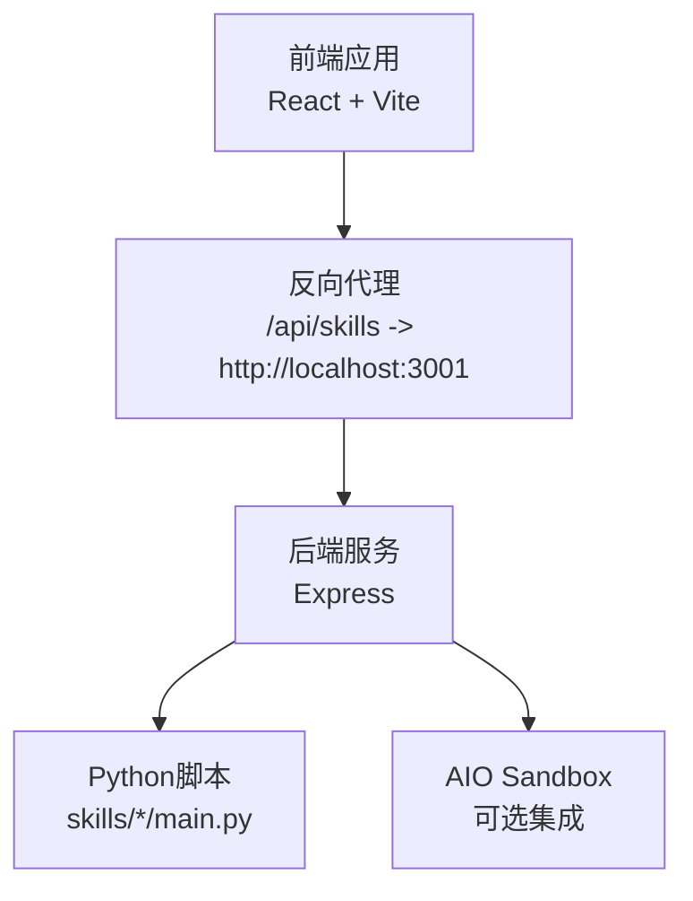
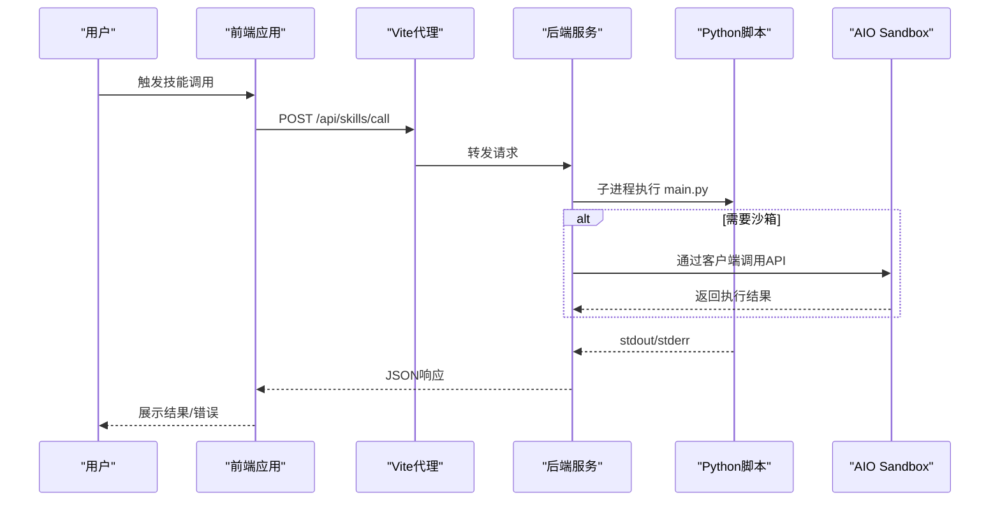
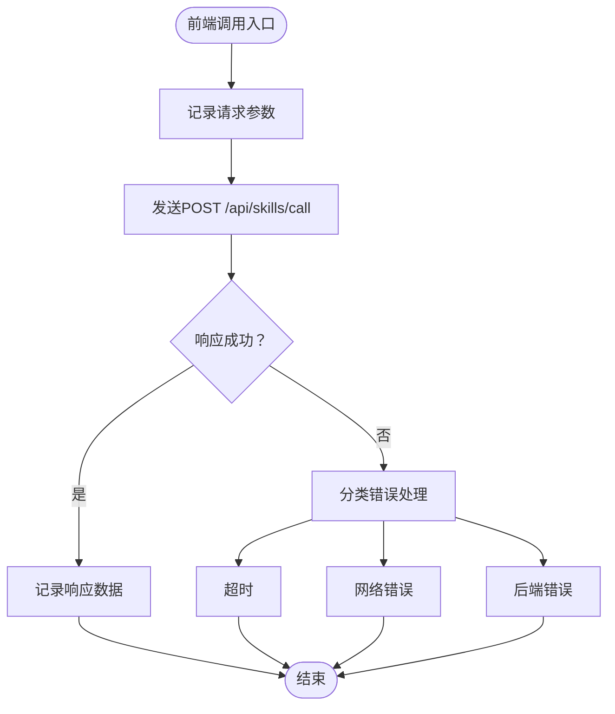
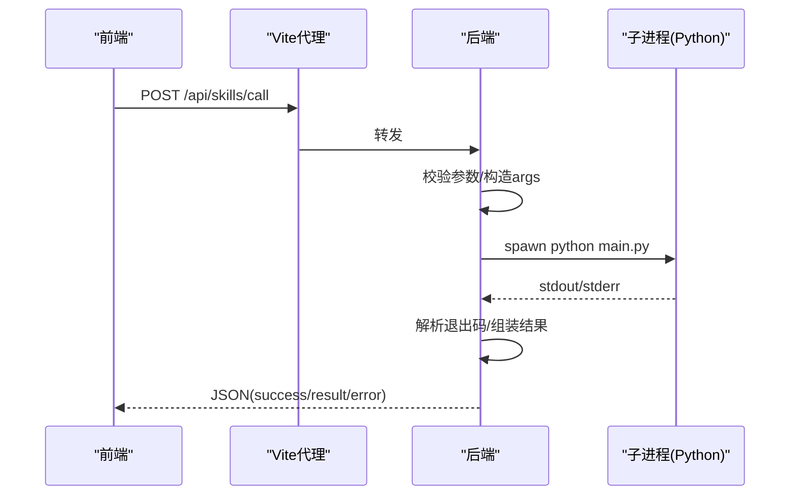
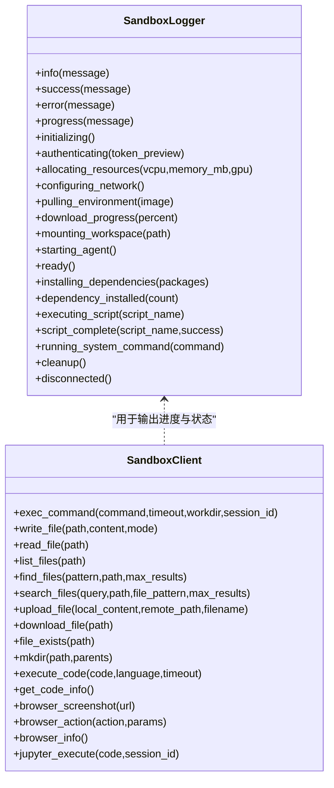
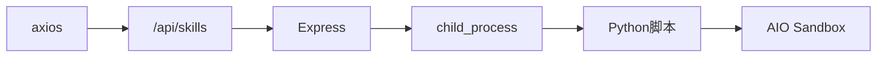

# 日志分析与调试

<cite>
**本文引用的文件**
- [package.json](file://package.json)
- [backend/index.js](file://backend/index.js)
- [vite.config.ts](file://vite.config.ts)
- [src/services/skillService.ts](file://src/services/skillService.ts)
- [src/router/index.tsx](file://src/router/index.tsx)
- [src/main.tsx](file://src/main.tsx)
- [OpenSkills-main/openskills/sandbox/logger.py](file://OpenSkills-main/openskills/sandbox/logger.py)
- [OpenSkills-main/openskills/sandbox/client.py](file://OpenSkills-main/openskills/sandbox/client.py)
- [OpenSkills-main/openskills/sandbox/manager.py](file://OpenSkills-main/openskills/sandbox/manager.py)
- [docs/基础规范/编码规范.md](file://docs/基础规范/编码规范.md)
- [docs/技术架构/后端技术栈.md](file://docs/技术架构/后端技术栈.md)
- [docs/基础规范/开发环境配置.md](file://docs/基础规范/开发环境配置.md)
</cite>

## 目录
1. [简介](#简介)
2. [项目结构](#项目结构)
3. [核心组件](#核心组件)
4. [架构总览](#架构总览)
5. [详细组件分析](#详细组件分析)
6. [依赖分析](#依赖分析)
7. [性能考虑](#性能考虑)
8. [故障排查指南](#故障排查指南)
9. [结论](#结论)
10. [附录](#附录)

## 简介
本指南面向AutoMate项目的开发者与运维人员，提供从浏览器前端控制台日志、后端Node.js服务器日志，到Python脚本日志的查看与分析方法；涵盖日志级别设置、过滤与关键信息提取技巧，并结合浏览器开发者工具、Node.js调试器、Python调试器给出断点设置、变量检查与调用栈分析的实操建议。

## 项目结构
AutoMate采用前后端分离架构：
- 前端基于React + Vite，通过反向代理将/api/skills转发至后端服务
- 后端基于Express，提供技能调用接口，内部以子进程方式调用Python脚本
- Python侧通过OpenSkills沙箱客户端与AIO Sandbox交互，提供丰富的日志与调试能力

图表来源
- [vite.config.ts](file://vite.config.ts#L18-L29)
- [backend/index.js](file://backend/index.js#L1-L117)

章节来源
- [package.json](file://package.json#L6-L13)
- [vite.config.ts](file://vite.config.ts#L1-L47)
- [backend/index.js](file://backend/index.js#L1-L117)

## 核心组件
- 前端技能调用服务：负责构造请求、记录请求与响应日志、处理超时与网络错误
- 后端技能服务：接收前端请求，拼装参数，调用Python脚本，汇总输出与错误
- Python沙箱日志：提供结构化、带时间戳与状态图标的日志输出，便于快速定位阶段问题
- 沙箱客户端：封装HTTP API，支持命令执行、文件操作、代码执行等，便于调试与排障

章节来源
- [src/services/skillService.ts](file://src/services/skillService.ts#L1-L73)
- [backend/index.js](file://backend/index.js#L19-L79)
- [OpenSkills-main/openskills/sandbox/logger.py](file://OpenSkills-main/openskills/sandbox/logger.py#L14-L187)
- [OpenSkills-main/openskills/sandbox/client.py](file://OpenSkills-main/openskills/sandbox/client.py#L119-L986)

## 架构总览
下图展示从前端到后端再到Python脚本的调用链路与日志落点：

图表来源
- [src/services/skillService.ts](file://src/services/skillService.ts#L12-L61)
- [vite.config.ts](file://vite.config.ts#L24-L28)
- [backend/index.js](file://backend/index.js#L81-L104)
- [OpenSkills-main/openskills/sandbox/client.py](file://OpenSkills-main/openskills/sandbox/client.py#L264-L325)

## 详细组件分析

### 前端日志与调试
- 日志位置与内容
  - 技能调用开始与返回：在发起请求前与收到响应后打印技能名称与参数、返回数据
  - 错误分支：区分超时、网络错误、后端返回错误，统一返回结构便于前端展示
- 日志级别与过滤
  - 建议使用浏览器控制台的级别筛选（log/warn/error），结合“按标签过滤”缩小范围
  - 对于频繁调用场景，可在调用前增加唯一标识（如消息ID）以便串联日志
- 关键信息提取
  - 请求URL、请求体、响应体、错误类型与堆栈
  - 使用“复制对象”或“保存为快照”保留现场数据
- 调试工具
  - 浏览器开发者工具：Elements检查DOM、Network观察请求、Console执行表达式、Sources设置断点
  - React DevTools：检查组件状态与渲染路径
- 断点与变量检查
  - 在skillService.ts中设置断点，逐步执行查看参数拼装与错误分支
  - 利用Scope面板查看当前作用域变量，利用Watch添加常用表达式
- 调用栈分析
  - 在断点处查看Call Stack，定位上游调用链（页面组件 -> 服务函数 -> Axios）

图表来源
- [src/services/skillService.ts](file://src/services/skillService.ts#L18-L61)

章节来源
- [src/services/skillService.ts](file://src/services/skillService.ts#L1-L73)
- [src/router/index.tsx](file://src/router/index.tsx#L1-L43)
- [src/main.tsx](file://src/main.tsx#L1-L12)
- [docs/基础规范/编码规范.md](file://docs/基础规范/编码规范.md#L576-L607)
- [docs/技术架构/后端技术栈.md](file://docs/技术架构/后端技术栈.md#L128-L157)
- [docs/基础规范/开发环境配置.md](file://docs/基础规范/开发环境配置.md#L209-L243)

### 后端日志与调试
- 日志位置与内容
  - 接收请求、校验参数、调用Python脚本、汇总输出与错误、异常捕获与返回
  - 子进程标准输出与错误输出会被收集并作为最终结果的一部分
- 日志级别与过滤
  - 使用控制台输出（info/warn/error）配合终端颜色区分
  - 结合系统日志工具（如PM2、systemd）进行集中采集与过滤
- 关键信息提取
  - 技能名称、脚本路径、传入参数、退出码、stdout/stderr
  - 使用结构化日志（JSON）便于机器解析与检索
- 调试工具
  - Node.js内置调试器：node --inspect-brk backend/index.js 或 package.json中脚本
  - Chrome DevTools：附加到Node进程，设置断点、检查变量、查看调用栈
- 断点与变量检查
  - 在路由处理函数与子进程事件回调处设置断点
  - 检查req.body、参数序列化、子进程env与cwd
- 调用栈分析
  - 在错误分支查看调用栈，定位上游中间件与控制器

图表来源
- [backend/index.js](file://backend/index.js#L19-L79)
- [backend/index.js](file://backend/index.js#L81-L104)

章节来源
- [backend/index.js](file://backend/index.js#L1-L117)
- [package.json](file://package.json#L12-L13)
- [vite.config.ts](file://vite.config.ts#L24-L28)

### Python脚本日志与调试
- 日志位置与内容
  - 通过OpenSkills沙箱客户端与logger模块输出结构化日志
  - 包含初始化、认证、资源分配、环境拉取、依赖安装、脚本执行、清理等阶段
- 日志级别与过滤
  - info/success/error/progress等语义化级别，结合前缀与图标快速识别阶段
  - 可通过全局开关启用/禁用日志输出
- 关键信息提取
  - 时间戳、阶段图标、资源规格、命令片段、执行结果摘要
- 调试工具
  - Python内置pdb：在脚本中插入断点，逐步执行、检查变量
  - VS Code/PyCharm：远程调试、条件断点、变量监视
- 断点与变量检查
  - 在脚本关键步骤设置断点，检查输入参数、环境变量、文件路径
  - 利用调用栈定位上游调用（后端 -> 沙箱客户端 -> 脚本）
- 调用栈分析
  - 在异常处查看调用栈，定位具体失败步骤（依赖安装、命令执行、文件读写）

图表来源
- [OpenSkills-main/openskills/sandbox/logger.py](file://OpenSkills-main/openskills/sandbox/logger.py#L14-L187)
- [OpenSkills-main/openskills/sandbox/client.py](file://OpenSkills-main/openskills/sandbox/client.py#L119-L986)

章节来源
- [OpenSkills-main/openskills/sandbox/logger.py](file://OpenSkills-main/openskills/sandbox/logger.py#L1-L188)
- [OpenSkills-main/openskills/sandbox/client.py](file://OpenSkills-main/openskills/sandbox/client.py#L1-L986)
- [OpenSkills-main/openskills/sandbox/manager.py](file://OpenSkills-main/openskills/sandbox/manager.py#L1-L237)

## 依赖分析
- 前端依赖
  - axios：HTTP客户端，用于调用后端API
  - vite：开发服务器与反向代理，将/api/skills转发至后端
- 后端依赖
  - child_process：调用Python脚本，捕获stdout/stderr与退出码
  - express/cors：提供REST接口与跨域支持
- Python侧依赖
  - httpx（沙箱客户端）、rich（结构化日志输出）

图表来源
- [src/services/skillService.ts](file://src/services/skillService.ts#L1-L2)
- [vite.config.ts](file://vite.config.ts#L24-L28)
- [backend/index.js](file://backend/index.js#L1-L6)

章节来源
- [src/services/skillService.ts](file://src/services/skillService.ts#L1-L2)
- [backend/index.js](file://backend/index.js#L1-L6)
- [vite.config.ts](file://vite.config.ts#L1-L47)

## 性能考虑
- 前端
  - 合理使用日志级别，避免在高频路径中输出大量调试信息
  - 使用浏览器性能面板（Performance）观察渲染与网络瓶颈
- 后端
  - 控制子进程生命周期，避免频繁创建销毁导致的开销
  - 对Python脚本输出进行分块处理与超时控制
- Python沙箱
  - 选择合适的策略（按次执行/按技能复用/持久化）以平衡启动成本与资源占用
  - 合理设置超时与重试，避免长时间阻塞

## 故障排查指南
- 常见问题与定位
  - 前端无法连接后端：检查Vite代理配置与后端服务是否启动
  - 技能调用超时：检查后端超时设置与Python脚本执行耗时
  - 网络错误：确认后端服务地址、端口与防火墙设置
  - Python脚本失败：查看后端日志中的退出码与stderr，结合沙箱日志定位阶段
- 日志查看与过滤
  - 前端：打开浏览器控制台，按级别筛选，使用“按标签过滤”缩小范围
  - 后端：查看终端输出，必要时重定向到文件并使用grep/awk过滤
  - Python：启用沙箱日志，关注阶段图标与时间戳
- 调试工具使用
  - 浏览器：Sources设置断点，Console执行表达式，Network观察请求细节
  - Node.js：使用--inspect-brk附加调试器，逐步执行与检查变量
  - Python：使用pdb或IDE远程调试，设置条件断点与变量监视
- 关键信息提取
  - 前端：请求URL、请求体、响应体、错误类型
  - 后端：技能名称、脚本路径、参数、退出码、stdout/stderr
  - Python：阶段描述、命令片段、资源规格、执行耗时

章节来源
- [docs/基础规范/开发环境配置.md](file://docs/基础规范/开发环境配置.md#L209-L243)
- [src/services/skillService.ts](file://src/services/skillService.ts#L34-L61)
- [backend/index.js](file://backend/index.js#L71-L78)
- [OpenSkills-main/openskills/sandbox/logger.py](file://OpenSkills-main/openskills/sandbox/logger.py#L54-L68)

## 结论
通过明确各层日志落点、合理设置日志级别与过滤策略，并结合浏览器、Node.js与Python调试工具，可以高效地定位与解决AutoMate在技能调用过程中的问题。建议在开发与测试阶段开启详细日志，在生产阶段根据需要降级日志级别并引入结构化日志与集中采集。

## 附录
- 快速参考
  - 前端日志：在skillService.ts中查看请求与响应日志
  - 后端日志：在backend/index.js中查看请求处理与子进程事件
  - Python日志：在OpenSkills沙箱客户端与logger模块中查看结构化输出
  - 调试命令：前端使用Vite开发服务器，后端使用Node.js调试器，Python使用pdb或IDE调试器