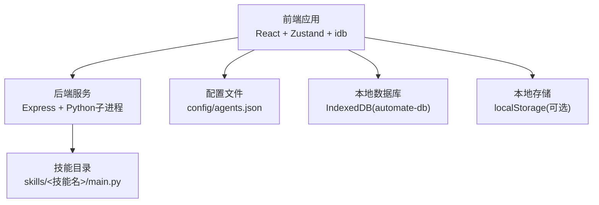
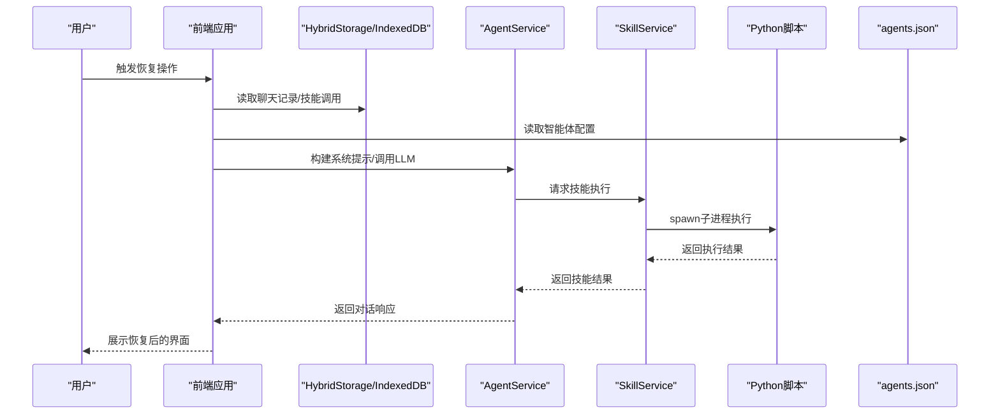
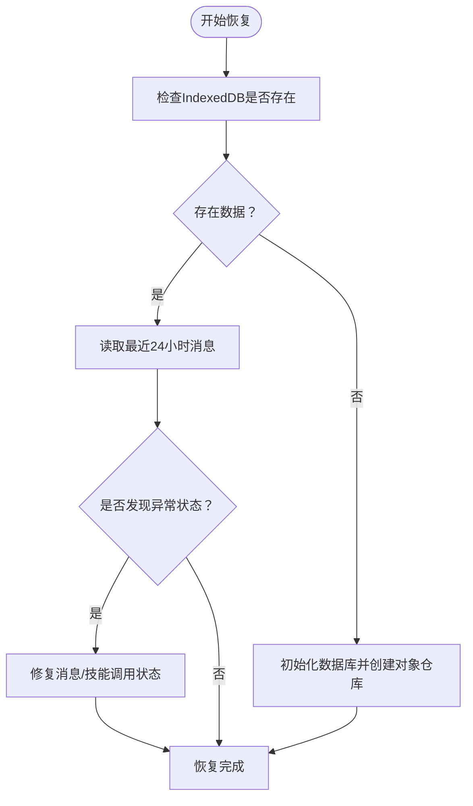
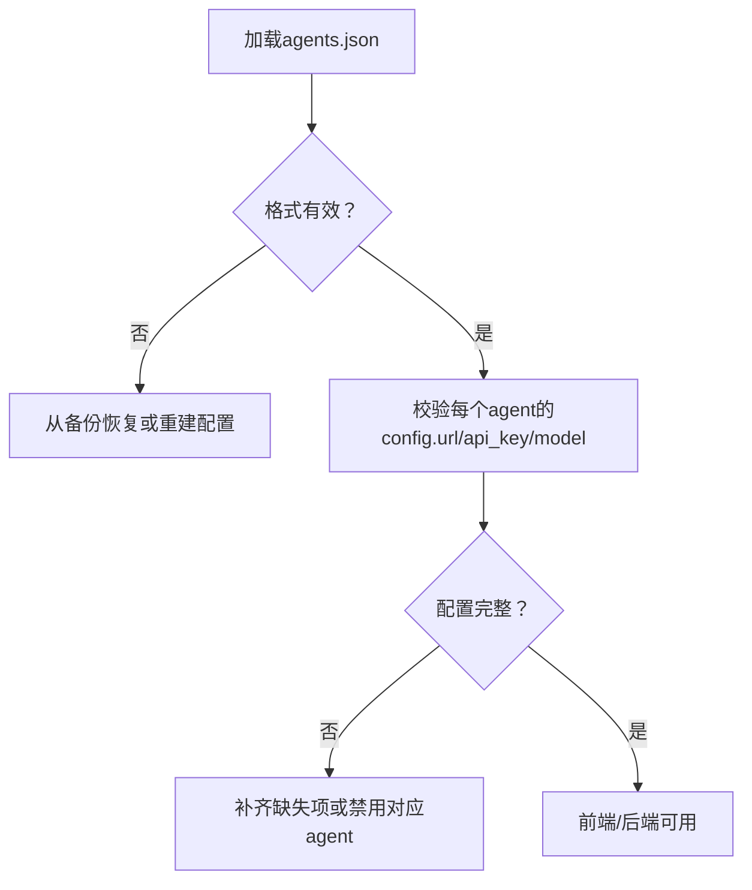
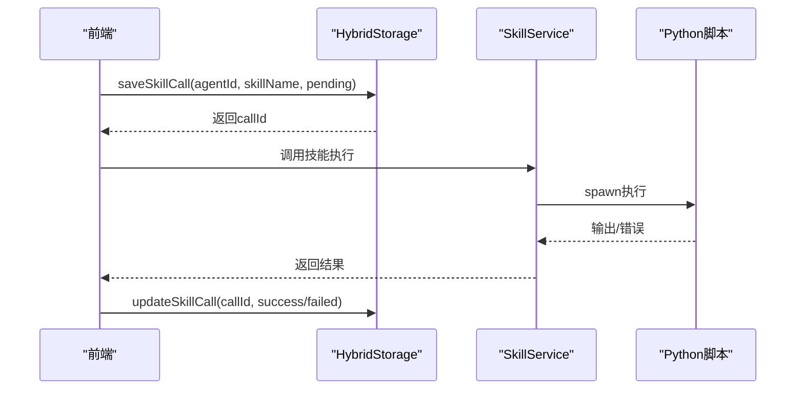
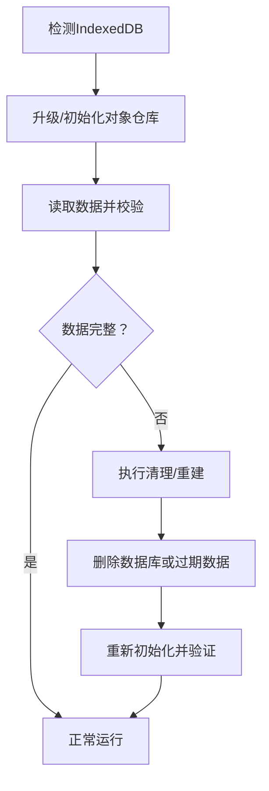
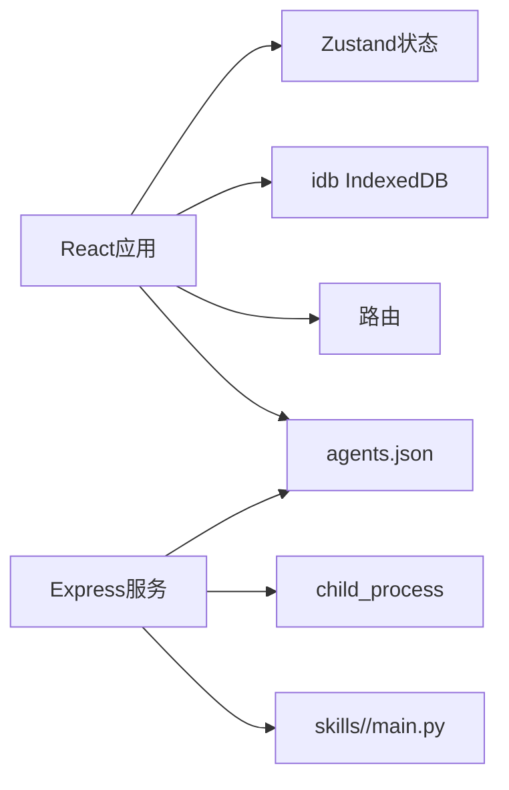

# 系统崩溃与恢复

<cite>
**本文引用的文件**
- [package.json](file://package.json)
- [backend/index.js](file://backend/index.js)
- [backend/services/agentService.ts](file://backend/services/agentService.ts)
- [backend/services/skillService.js](file://backend/services/skillService.js)
- [src/main.tsx](file://src/main.tsx)
- [src/services/chatHistoryService.ts](file://src/services/chatHistoryService.ts)
- [src/services/hybridStorage.ts](file://src/services/hybridStorage.ts)
- [src/scripts/clearDatabase.ts](file://src/scripts/clearDatabase.ts)
- [src/store/useAppStore.ts](file://src/store/useAppStore.ts)
- [src/hooks/useAgentChat.ts](file://src/hooks/useAgentChat.ts)
- [config/agents.json](file://config/agents.json)
- [.trae/documents/修复sql.js加载错误计划.md](file://.trae/documents/修复sql.js加载错误计划.md)
- [docs/数据层设计/数据库设计与实现验证报告.md](file://docs/数据层设计/数据库设计与实现验证报告.md)
- [docs/数据层设计/数据库设计.md](file://docs/数据层设计/数据库设计.md)
- [docs/数据层设计/数据库安全验证报告.md](file://docs/数据层设计/数据库安全验证报告.md)
</cite>

## 目录
1. [简介](#简介)
2. [项目结构](#项目结构)
3. [核心组件](#核心组件)
4. [架构总览](#架构总览)
5. [详细组件分析](#详细组件分析)
6. [依赖关系分析](#依赖关系分析)
7. [性能考量](#性能考量)
8. [故障排查指南](#故障排查指南)
9. [结论](#结论)
10. [附录](#附录)

## 简介
本指南面向AutoMate系统崩溃与恢复场景，提供从聊天记录恢复、智能体配置修复、技能执行状态重置，到数据库损坏检测与修复、配置文件损坏恢复、临时文件清理、安全重启与状态重置、以及预防性备份策略的全流程操作步骤。文档同时结合前端IndexedDB与后端技能服务的实现细节，帮助快速定位问题并恢复到正常工作状态。

## 项目结构
AutoMate采用前后端分离架构：
- 前端基于React + TypeScript，使用Zustand状态管理、idb IndexedDB持久化、Vite构建。
- 后端基于Node.js + Express，提供技能调用API与Python子进程执行能力。
- 配置文件agents.json集中管理智能体与技能清单；系统通过hybridStorage统一管理本地数据。

图表来源
- [src/main.tsx](file://src/main.tsx#L1-L12)
- [backend/index.js](file://backend/index.js#L1-L117)
- [config/agents.json](file://config/agents.json#L1-L119)
- [src/services/hybridStorage.ts](file://src/services/hybridStorage.ts#L1-L262)

章节来源
- [src/main.tsx](file://src/main.tsx#L1-L12)
- [package.json](file://package.json#L1-L47)

## 核心组件
- 前端状态与UI
  - Zustand状态管理：智能体分组、聊天会话、消息、主题与全局状态。
  - Hooks：useAgentChat封装消息发送、流式输出与错误处理。
- 本地数据持久化
  - IndexedDB：chat_messages与skill_calls表结构，索引与事务特性。
  - HybridStorage：过期数据清理、初始化与读写封装。
- 后端技能服务
  - Express路由：/api/skills/call调用Python脚本执行技能。
  - AgentService：加载agents.json、构建系统提示、调用外部LLM。
  - SkillService：封装Python子进程执行与结果返回。
- 配置与恢复
  - agents.json：智能体与技能配置入口。
  - clearDatabase脚本：一键清空IndexedDB与相关标记，便于恢复。

章节来源
- [src/store/useAppStore.ts](file://src/store/useAppStore.ts#L1-L306)
- [src/hooks/useAgentChat.ts](file://src/hooks/useAgentChat.ts#L1-L128)
- [src/services/hybridStorage.ts](file://src/services/hybridStorage.ts#L1-L262)
- [src/services/chatHistoryService.ts](file://src/services/chatHistoryService.ts#L1-L244)
- [backend/index.js](file://backend/index.js#L1-L117)
- [backend/services/agentService.ts](file://backend/services/agentService.ts#L1-L245)
- [backend/services/skillService.js](file://backend/services/skillService.js#L1-L87)
- [config/agents.json](file://config/agents.json#L1-L119)
- [src/scripts/clearDatabase.ts](file://src/scripts/clearDatabase.ts#L1-L41)

## 架构总览
下图展示崩溃后恢复的关键流程：前端本地数据、后端技能执行、配置文件与Python环境之间的关系。

图表来源
- [src/services/hybridStorage.ts](file://src/services/hybridStorage.ts#L1-L262)
- [backend/services/agentService.ts](file://backend/services/agentService.ts#L1-L245)
- [backend/services/skillService.js](file://backend/services/skillService.js#L1-L87)
- [backend/index.js](file://backend/index.js#L1-L117)
- [config/agents.json](file://config/agents.json#L1-L119)

## 详细组件分析

### 前端本地数据与恢复
- IndexedDB表结构
  - chat_messages：消息主表，包含消息类型、时间戳、状态、技能激活等字段，并建立多维索引以支持按agent、时间、技能激活等查询。
  - skill_calls：技能调用记录表，包含调用状态、参数、结果、耗时等字段。
- 过期数据清理
  - HybridStorage在每日首次访问时清理超过HOT_DATA_DAYS（默认3天）的历史数据，避免本地膨胀。
- 恢复要点
  - 若聊天记录缺失，可通过HybridStorage.getLast24HoursChatMessages或getChatMessages按agent检索。
  - 若技能调用状态异常，可使用getSkillCalls按agent检索并结合saveSkillCall/updateSkillCall修正状态。
  - 若本地数据损坏，可使用clearDatabase脚本清空automate-db并清除清理标记，随后刷新页面重新初始化。

图表来源
- [src/services/hybridStorage.ts](file://src/services/hybridStorage.ts#L89-L127)
- [src/services/chatHistoryService.ts](file://src/services/chatHistoryService.ts#L210-L237)
- [src/scripts/clearDatabase.ts](file://src/scripts/clearDatabase.ts#L1-L41)

章节来源
- [src/services/chatHistoryService.ts](file://src/services/chatHistoryService.ts#L1-L244)
- [src/services/hybridStorage.ts](file://src/services/hybridStorage.ts#L1-L262)
- [src/scripts/clearDatabase.ts](file://src/scripts/clearDatabase.ts#L1-L41)

### 智能体配置修复
- agents.json是智能体与技能配置的根文件，包含分组、智能体ID、名称、描述、头像、类型及config（URL、API Key、模型）与skills列表。
- 恢复步骤
  - 若配置损坏，优先核对agents.json格式与必填字段；若仍无法修复，可保留当前配置并逐步替换为备份版本。
  - 前端useAgentChat在挂载时会拉取/config/agents.json并加载技能描述，确保该路径可访问且返回有效JSON。
  - 后端AgentService.loadAgentsConfig负责解析agents.json并提供查找agent的能力。

图表来源
- [config/agents.json](file://config/agents.json#L1-L119)
- [src/hooks/useAgentChat.ts](file://src/hooks/useAgentChat.ts#L25-L49)
- [backend/services/agentService.ts](file://backend/services/agentService.ts#L58-L67)

章节来源
- [config/agents.json](file://config/agents.json#L1-L119)
- [src/hooks/useAgentChat.ts](file://src/hooks/useAgentChat.ts#L1-L128)
- [backend/services/agentService.ts](file://backend/services/agentService.ts#L1-L245)

### 技能执行状态重置
- 后端SkillService通过spawn调用Python脚本执行技能，stdout/stderr收集输出与错误，close事件根据退出码判断成功/失败。
- 前端HybridStorage.saveSkillCall/updateSkillCall记录技能调用状态，支持pending/success/failed/timeout。
- 重置步骤
  - 使用getSkillCalls按agent筛选未完成的技能调用，将其状态更新为failed或timeout以便前端重新触发。
  - 对于无输出但退出码非0的情况，可在后端日志中查看stderr并修正参数或脚本逻辑。

图表来源
- [src/services/hybridStorage.ts](file://src/services/hybridStorage.ts#L202-L228)
- [backend/services/skillService.js](file://backend/services/skillService.js#L16-L71)

章节来源
- [backend/services/skillService.js](file://backend/services/skillService.js#L1-L87)
- [src/services/hybridStorage.ts](file://src/services/hybridStorage.ts#L1-L262)

### 数据库损坏检测与修复
- IndexedDB损坏检测
  - 通过openDB初始化时的upgrade回调观察对象仓库与索引创建是否成功。
  - 使用getAll/getAllFromIndex等API读取数据，若抛出异常或返回空集，需进一步排查。
- 修复策略
  - 清理过期数据：cleanExpiredIndexedDBData按时间阈值删除旧记录。
  - 一键清空：clearDatabase脚本删除automate-db并清除清理标记，随后刷新页面重新初始化。
  - 临时文件清理：删除public目录下的WASM缓存文件（如存在），避免加载错误。

图表来源
- [src/services/hybridStorage.ts](file://src/services/hybridStorage.ts#L63-L87)
- [src/scripts/clearDatabase.ts](file://src/scripts/clearDatabase.ts#L1-L41)
- [.trae/documents/修复sql.js加载错误计划.md](file://.trae/documents/修复sql.js加载错误计划.md#L1-L34)

章节来源
- [src/services/hybridStorage.ts](file://src/services/hybridStorage.ts#L1-L262)
- [src/scripts/clearDatabase.ts](file://src/scripts/clearDatabase.ts#L1-L41)
- [.trae/documents/修复sql.js加载错误计划.md](file://.trae/documents/修复sql.js加载错误计划.md#L1-L34)

### 配置文件损坏恢复
- agents.json损坏恢复
  - 从备份副本恢复；若无备份，参考默认模板重建必要字段（id、name、config.url/api_key/model、skills）。
  - 前端useAgentChat在加载配置时会进行基本校验，若缺失URL或API Key，将提示错误。
- 后端AgentService.loadAgentsConfig解析失败时返回空数组，需检查agents.json编码与语法。

章节来源
- [config/agents.json](file://config/agents.json#L1-L119)
- [src/hooks/useAgentChat.ts](file://src/hooks/useAgentChat.ts#L51-L82)
- [backend/services/agentService.ts](file://backend/services/agentService.ts#L58-L67)

### 临时文件清理
- WASM缓存清理：删除public/sql-wasm.wasm及相关缓存，避免加载错误导致崩溃。
- 本地存储清理：清空automate-sqlite-db对应的localStorage键值，防止残留二进制数据影响。
- 清理脚本：使用clearDatabase脚本统一执行上述操作。

章节来源
- [.trae/documents/修复sql.js加载错误计划.md](file://.trae/documents/修复sql.js加载错误计划.md#L16-L34)
- [src/scripts/clearDatabase.ts](file://src/scripts/clearDatabase.ts#L1-L41)

### 安全重启与状态重置
- 安全重启
  - 停止前端开发服务器与后端服务，确保Python子进程结束。
  - 清理临时文件与本地存储后，重启前端与后端。
- 状态重置
  - 使用clearDatabase清空IndexedDB与清理标记。
  - 重新加载agents.json，初始化HybridStorage。
  - 前端刷新页面，重新渲染聊天界面与智能体列表。

章节来源
- [package.json](file://package.json#L6-L13)
- [backend/index.js](file://backend/index.js#L113-L117)
- [src/scripts/clearDatabase.ts](file://src/scripts/clearDatabase.ts#L1-L41)

## 依赖关系分析
- 前端依赖
  - idb用于IndexedDB访问；zustand用于状态管理；react-router-dom用于路由。
- 后端依赖
  - child_process用于spawn Python脚本；cors/express提供API服务。
- 关键耦合点
  - 前端HybridStorage与后端SkillService通过消息/技能调用状态保持一致。
  - agents.json是前后端共同依赖的配置源。

图表来源
- [package.json](file://package.json#L15-L26)
- [backend/index.js](file://backend/index.js#L1-L117)
- [src/services/hybridStorage.ts](file://src/services/hybridStorage.ts#L1-L262)
- [config/agents.json](file://config/agents.json#L1-L119)

章节来源
- [package.json](file://package.json#L1-L47)
- [backend/index.js](file://backend/index.js#L1-L117)

## 性能考量
- IndexedDB索引与查询
  - chat_messages/skill_calls均建立多维索引，建议按agent、时间、状态等维度查询，避免全表扫描。
- 过期数据清理
  - HOT_DATA_DAYS默认3天，减少存储压力与查询开销。
- 事务与一致性
  - 后端技能调用与消息发送应尽量在事务内完成，保证原子性与一致性。

章节来源
- [docs/数据层设计/数据库设计与实现验证报告.md](file://docs/数据层设计/数据库设计与实现验证报告.md#L1-L159)
- [docs/数据层设计/数据库设计.md](file://docs/数据层设计/数据库设计.md#L418-L496)
- [src/services/hybridStorage.ts](file://src/services/hybridStorage.ts#L89-L127)

## 故障排查指南
- 崩溃症状与定位
  - 聊天记录缺失：检查HybridStorage初始化与索引；使用getLast24HoursChatMessages确认数据范围。
  - 技能执行失败：查看SkillService输出/错误流；核对Python脚本参数与返回。
  - 配置加载失败：检查agents.json格式与必填字段；前端useAgentChat会提示缺失URL/API Key。
  - 数据库异常：通过clearDatabase脚本强制重建；检查WASM缓存与localStorage残留。
- 常见错误与修复
  - sql.js加载错误：采用纯IndexedDB方案，移除WASM依赖并使用localStorage持久化备份。
  - 后端API异常：检查/health与/ready状态；确认Python可执行路径与环境变量。
  - 前端状态异常：重置Zustand状态与本地存储，刷新页面。

章节来源
- [.trae/documents/修复sql.js加载错误计划.md](file://.trae/documents/修复sql.js加载错误计划.md#L1-L34)
- [backend/services/skillService.js](file://backend/services/skillService.js#L16-L71)
- [src/hooks/useAgentChat.ts](file://src/hooks/useAgentChat.ts#L51-L82)
- [src/scripts/clearDatabase.ts](file://src/scripts/clearDatabase.ts#L1-L41)

## 结论
通过结合前端IndexedDB与后端技能服务的实现细节，AutoMate提供了完善的崩溃恢复路径：以agents.json为配置根、以HybridStorage为数据枢纽、以clearDatabase为兜底手段。配合过期数据清理与临时文件管理，可显著降低数据丢失风险并提升系统稳定性。

## 附录
- 预防性措施与备份策略
  - 定期备份agents.json与关键配置。
  - 使用HybridStorage的过期清理策略控制本地数据规模。
  - 对于SQLite方案（如未来启用），参考数据库设计与实现验证报告中的备份/恢复与SQLCipher加密实践。
- 参考文档
  - 数据库设计与实现验证报告
  - 数据库设计
  - 数据库安全验证报告

章节来源
- [docs/数据层设计/数据库设计与实现验证报告.md](file://docs/数据层设计/数据库设计与实现验证报告.md#L1-L159)
- [docs/数据层设计/数据库设计.md](file://docs/数据层设计/数据库设计.md#L418-L496)
- [docs/数据层设计/数据库安全验证报告.md](file://docs/数据层设计/数据库安全验证报告.md#L1-L82)