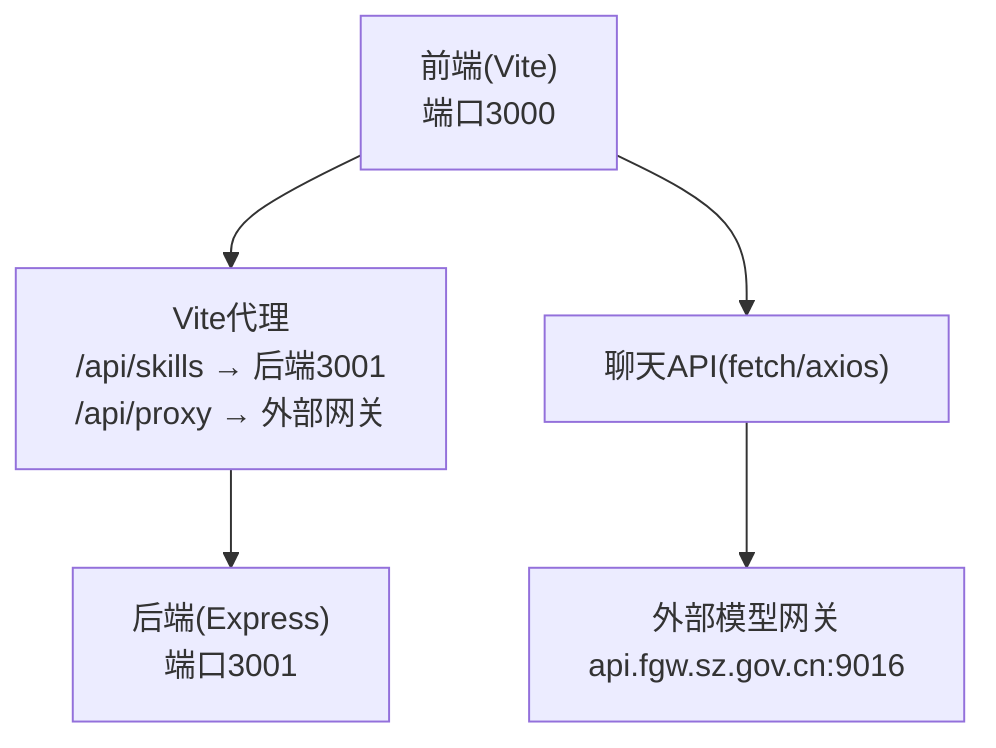
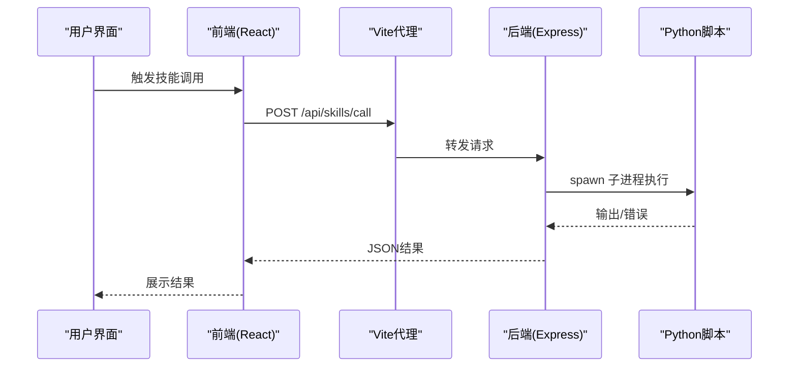
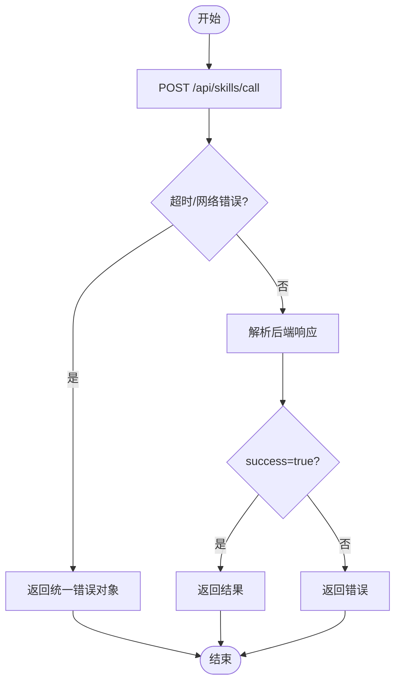
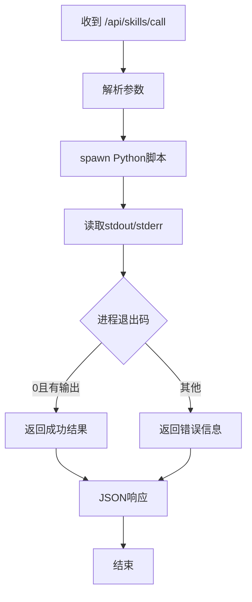
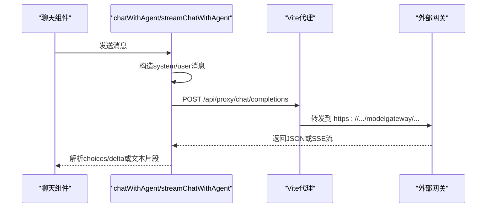
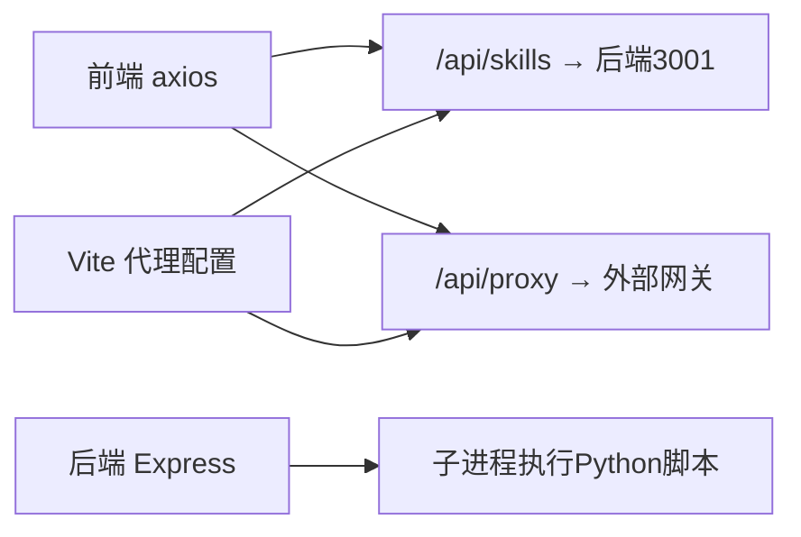

# 网络连接问题

<cite>
**本文引用的文件**
- [backend/index.js](file://backend/index.js)
- [backend/services/skillService.js](file://backend/services/skillService.js)
- [src/services/skillService.ts](file://src/services/skillService.ts)
- [src/types/chat.ts](file://src/types/chat.ts)
- [src/hooks/useAgentChat.ts](file://src/hooks/useAgentChat.ts)
- [vite.config.ts](file://vite.config.ts)
- [package.json](file://package.json)
- [docs/接口层设计/Tauri通信接口.md](file://docs/接口层设计/Tauri通信接口.md)
- [docs/接口层设计/前端组件接口.md](file://docs/接口层设计/前端组件接口.md)
- [config/agents.json](file://config/agents.json)
</cite>

## 目录
1. [简介](#简介)
2. [项目结构](#项目结构)
3. [核心组件](#核心组件)
4. [架构总览](#架构总览)
5. [详细组件分析](#详细组件分析)
6. [依赖关系分析](#依赖关系分析)
7. [性能考量](#性能考量)
8. [故障排查指南](#故障排查指南)
9. [结论](#结论)
10. [附录](#附录)

## 简介
本文件聚焦AutoMate项目中的网络连接问题排查，覆盖API调用失败、Tauri通信中断、技能执行超时等场景；同时提供CORS配置、跨域请求、代理设置的解决方案，并给出网络延迟监控、连接池管理、重连机制的配置与优化建议，以及前后端通信协议调试技巧与网络异常处理策略。

## 项目结构
AutoMate采用前后端分离与代理结合的方式：
- 前端基于Vite + React，开发服务器端口默认3000
- 后端Express服务提供技能调用API，端口3001
- Vite开发服务器通过代理将/api/skills转发至后端，将/api/proxy转发至外部模型网关
- Tauri文档定义了invoke/事件系统，但当前仓库中前端主要通过HTTP代理与后端交互

图表来源
- [vite.config.ts](file://vite.config.ts#L18-L29)
- [backend/index.js](file://backend/index.js#L113-L116)
- [src/types/chat.ts](file://src/types/chat.ts#L107-L129)

章节来源
- [vite.config.ts](file://vite.config.ts#L12-L30)
- [backend/index.js](file://backend/index.js#L1-L16)

## 核心组件
- 前端技能调用服务：封装axios请求，统一超时与错误处理
- 后端技能执行服务：通过子进程调用Python脚本，返回标准结构
- 聊天接口：根据目标URL选择fetch或axios，支持SSE流式输出
- Vite代理：将/api前缀转发到后端或外部网关
- Tauri接口文档：定义invoke/事件通信规范（当前前端以HTTP为主）

章节来源
- [src/services/skillService.ts](file://src/services/skillService.ts#L1-L73)
- [backend/services/skillService.js](file://backend/services/skillService.js#L1-L87)
- [src/types/chat.ts](file://src/types/chat.ts#L96-L260)
- [vite.config.ts](file://vite.config.ts#L18-L29)
- [docs/接口层设计/Tauri通信接口.md](file://docs/接口层设计/Tauri通信接口.md#L1-L100)

## 架构总览
前端通过HTTP与后端交互，后端再通过子进程调用本地Python脚本执行技能；聊天消息可能直接访问外部模型网关，也可能经由代理转发。

图表来源
- [src/services/skillService.ts](file://src/services/skillService.ts#L12-L61)
- [backend/index.js](file://backend/index.js#L81-L104)
- [backend/services/skillService.js](file://backend/services/skillService.js#L16-L71)
- [vite.config.ts](file://vite.config.ts#L24-L28)

## 详细组件分析

### 前端技能调用流程与超时处理
- 基础URL为/api，超时30秒
- axios错误分支区分超时、网络错误、后端返回错误
- 返回结构包含success/result/error，便于上层统一处理

图表来源
- [src/services/skillService.ts](file://src/services/skillService.ts#L12-L61)

章节来源
- [src/services/skillService.ts](file://src/services/skillService.ts#L1-L73)

### 后端技能执行与错误传播
- 后端接收skill_name与parameters，拼接Python脚本路径
- 通过子进程执行，收集stdout/stderr，按退出码判定成功/失败
- 将输出标准化为success/result/error返回给前端

图表来源
- [backend/index.js](file://backend/index.js#L19-L79)
- [backend/services/skillService.js](file://backend/services/skillService.js#L16-L71)

章节来源
- [backend/index.js](file://backend/index.js#L1-L117)
- [backend/services/skillService.js](file://backend/services/skillService.js#L1-L87)

### 聊天接口与跨域/代理
- 根据agent.config.url判断是否直连外部网关
- 若直连api.fgw.sz.gov.cn，则走/api/proxy转发
- fetch/axios两种方式，均设置Authorization与Content-Type
- SSE流式输出通过ReadableStream Reader逐行解析

图表来源
- [src/types/chat.ts](file://src/types/chat.ts#L96-L260)
- [vite.config.ts](file://vite.config.ts#L18-L29)
- [config/agents.json](file://config/agents.json#L12-L16)

章节来源
- [src/types/chat.ts](file://src/types/chat.ts#L96-L260)
- [config/agents.json](file://config/agents.json#L1-L119)
- [vite.config.ts](file://vite.config.ts#L18-L29)

### Tauri通信接口（invoke/事件）
- 文档定义了invoke API、事件系统、错误处理与性能优化要点
- 当前仓库前端以HTTP代理为主，invoke接口未在前端直接使用

章节来源
- [docs/接口层设计/Tauri通信接口.md](file://docs/接口层设计/Tauri通信接口.md#L1-L100)

## 依赖关系分析
- 前端依赖axios进行HTTP请求，依赖Vite代理进行跨域转发
- 后端依赖express与cors中间件，提供技能调用接口
- 代理规则将/api/skills转发到后端3001，/api/proxy转发到外部网关
- 聊天接口根据agent配置动态选择直连或代理

图表来源
- [package.json](file://package.json#L15-L27)
- [vite.config.ts](file://vite.config.ts#L18-L29)
- [backend/index.js](file://backend/index.js#L113-L116)

章节来源
- [package.json](file://package.json#L1-L47)
- [vite.config.ts](file://vite.config.ts#L1-L47)
- [backend/index.js](file://backend/index.js#L1-L16)

## 性能考量
- 请求超时：前端技能调用与聊天接口均设置30秒超时，可根据实际网络状况调整
- 代理转发：Vite代理减少CORS复杂度，但需关注代理链路延迟
- 流式输出：SSE流式解析需注意缓冲与断流重连
- 连接池：当前未见数据库连接池配置，若引入数据库可考虑连接池优化

章节来源
- [src/services/skillService.ts](file://src/services/skillService.ts#L4-L4)
- [src/types/chat.ts](file://src/types/chat.ts#L225-L225)
- [docs/非功能设计/性能设计.md](file://docs/非功能设计/性能设计.md#L130-L134)

## 故障排查指南

### API调用失败
- 检查后端服务是否启动（端口3001），查看控制台日志
- 前端技能调用超时：确认TIMEOUT设置是否合理，网络是否稳定
- 后端执行失败：查看stdout/stderr输出，确认Python脚本路径与参数正确

排查步骤
- 启动后端：npm run backend
- 前端启动：npm run dev
- 在浏览器开发者工具Network面板观察/api/skills/call请求与响应
- 查看后端控制台输出，定位错误来源

章节来源
- [backend/index.js](file://backend/index.js#L113-L116)
- [src/services/skillService.ts](file://src/services/skillService.ts#L18-L61)

### CORS配置问题与跨域请求失败
- 后端已启用CORS中间件，一般无需额外配置
- 前端通过Vite代理访问/api/skills与/api/proxy，避免浏览器同源限制
- 如需从其他域名访问后端，可在后端CORS配置中允许对应源

建议
- 保持代理配置不变，优先通过代理访问
- 如需放开CORS，参考express cors选项进行白名单配置

章节来源
- [backend/index.js](file://backend/index.js#L14-L14)
- [vite.config.ts](file://vite.config.ts#L18-L29)

### 代理设置错误
- /api/skills → http://localhost:3001/api/skills
- /api/proxy → https://api.fgw.sz.gov.cn:9016/modelgateway/compatible-model/v1
- 若外部网关地址变更，需同步修改代理target与rewrite

排查
- 确认代理target与rewrite规则匹配
- 使用curl或浏览器Network面板验证代理是否生效
- 检查外部网关证书与防火墙策略

章节来源
- [vite.config.ts](file://vite.config.ts#L18-L29)
- [config/agents.json](file://config/agents.json#L12-L16)

### 技能执行超时
- 前端超时：30秒；若技能执行时间较长，可适当增大TIMEOUT
- 后端子进程：确认Python脚本执行时间与资源占用
- 建议：对长耗时技能增加进度事件或异步队列

章节来源
- [src/services/skillService.ts](file://src/services/skillService.ts#L4-L4)
- [backend/services/skillService.js](file://backend/services/skillService.js#L16-L71)

### Tauri通信中断
- 当前前端以HTTP代理为主，invoke接口未在前端直接使用
- 若后续接入invoke，需确保Rust侧已注册对应command，并正确处理错误事件

章节来源
- [docs/接口层设计/Tauri通信接口.md](file://docs/接口层设计/Tauri通信接口.md#L1-L100)

### 网络延迟监控与优化
- 建议在前端埋点记录请求开始/结束时间，统计平均延迟与P95
- 代理链路延迟：通过代理转发与外部网关往返时间评估
- 优化手段：合并请求、启用压缩、使用HTTP/2、合理设置超时

章节来源
- [src/types/chat.ts](file://src/types/chat.ts#L211-L227)
- [docs/非功能设计/性能设计.md](file://docs/非功能设计/性能设计.md#L110-L114)

### 连接池管理与重连机制
- 当前未见数据库连接池配置；如引入数据库，建议使用连接池并设置最大连接数与空闲回收
- 重连机制：对外部网关请求失败时，可实现指数退避重试与最大重试次数

章节来源
- [docs/非功能设计/性能设计.md](file://docs/非功能设计/性能设计.md#L130-L134)

### 前后端通信协议调试技巧
- 使用浏览器Network面板查看请求头、响应头、状态码与响应体
- 对SSE流：关注data行与[DONE]终止信号
- 对后端错误：查看stderr输出与退出码，定位脚本异常
- 对CORS问题：确认Access-Control-Allow-Origin与预检请求

章节来源
- [src/types/chat.ts](file://src/types/chat.ts#L139-L188)
- [backend/index.js](file://backend/index.js#L41-L77)

### 网络异常处理策略
- 前端：区分超时、网络错误、后端错误，分别提示用户
- 后端：捕获子进程错误，返回结构化错误信息
- 聊天接口：对API错误与网络错误分别返回可读错误信息

章节来源
- [src/services/skillService.ts](file://src/services/skillService.ts#L37-L60)
- [src/types/chat.ts](file://src/types/chat.ts#L237-L259)

## 结论
AutoMate的网络层以Vite代理为核心，结合后端CORS与子进程执行技能，形成清晰的前后端交互路径。针对API调用失败、跨域与代理问题、超时与Tauri通信中断，可通过日志、代理配置、超时与重试策略快速定位与修复。建议在生产环境中完善连接池、监控与重连机制，并持续优化代理链路与外部网关的稳定性。

## 附录

### 关键配置与文件清单
- 前端技能调用：src/services/skillService.ts
- 后端技能执行：backend/services/skillService.js
- 后端入口与CORS：backend/index.js
- 聊天接口与SSE：src/types/chat.ts
- Vite代理配置：vite.config.ts
- 智能体配置（含外部网关地址）：config/agents.json
- Tauri通信接口文档：docs/接口层设计/Tauri通信接口.md

章节来源
- [src/services/skillService.ts](file://src/services/skillService.ts#L1-L73)
- [backend/services/skillService.js](file://backend/services/skillService.js#L1-L87)
- [backend/index.js](file://backend/index.js#L1-L117)
- [src/types/chat.ts](file://src/types/chat.ts#L1-L280)
- [vite.config.ts](file://vite.config.ts#L1-L47)
- [config/agents.json](file://config/agents.json#L1-L119)
- [docs/接口层设计/Tauri通信接口.md](file://docs/接口层设计/Tauri通信接口.md#L1-L100)