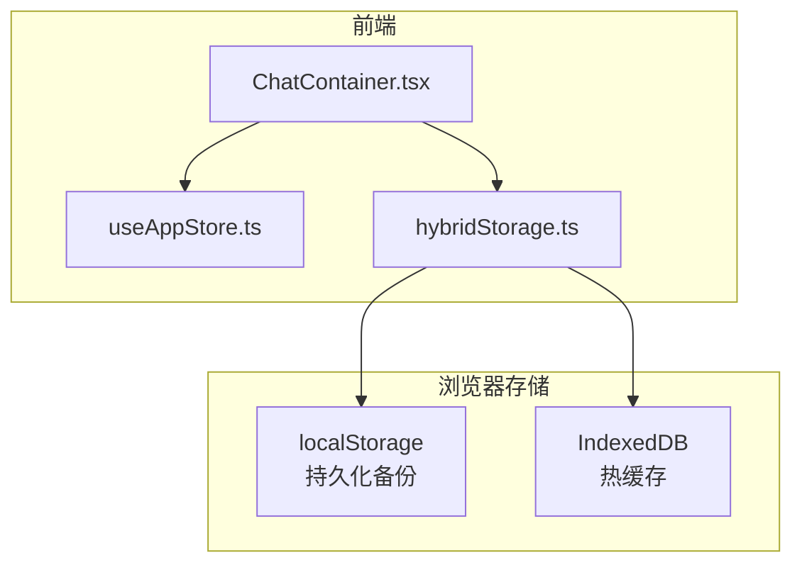
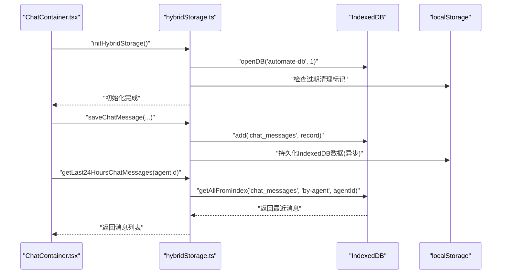
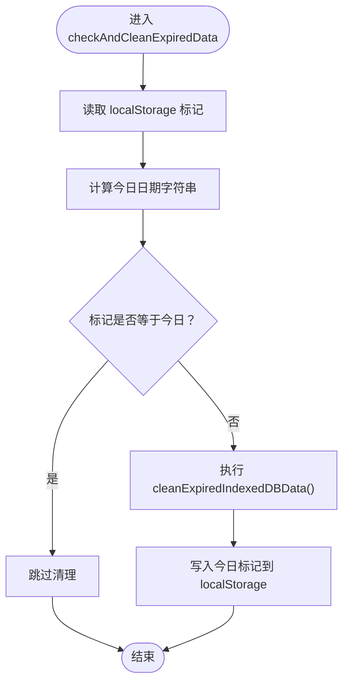
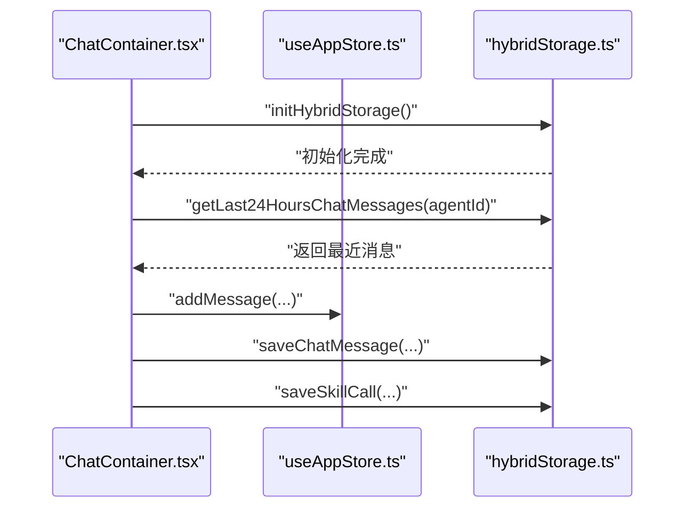
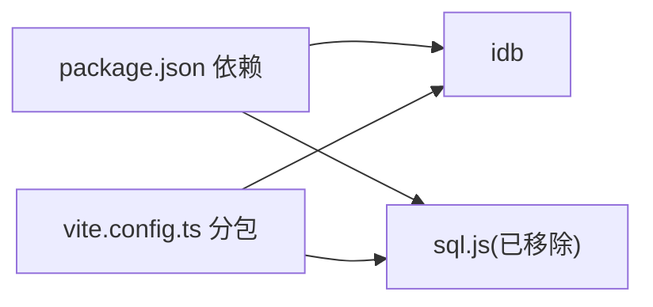

# 存储策略

<cite>
**本文引用的文件**
- [hybridStorage.ts](file://src/services/hybridStorage.ts)
- [ChatContainer.tsx](file://src/components/chat/ChatContainer.tsx)
- [useAppStore.ts](file://src/store/useAppStore.ts)
- [clearDatabase.ts](file://src/scripts/clearDatabase.ts)
- [数据库设计.md](file://docs/数据层设计/数据库设计.md)
- [性能设计.md](file://docs/非功能设计/性能设计.md)
- [修复sql.js加载错误计划.md](file://.trae/documents/修复sql.js加载错误计划.md)
- [package.json](file://package.json)
- [vite.config.ts](file://vite.config.ts)
</cite>

## 目录
1. [简介](#简介)
2. [项目结构](#项目结构)
3. [核心组件](#核心组件)
4. [架构总览](#架构总览)
5. [详细组件分析](#详细组件分析)
6. [依赖关系分析](#依赖关系分析)
7. [性能考量](#性能考量)
8. [故障排查指南](#故障排查指南)
9. [结论](#结论)
10. [附录](#附录)

## 简介
本文件面向AutoMate混合存储策略，系统化阐述localStorage、IndexedDB与SQLite三者的协同工作机制。基于现有代码与文档，AutoMate采用“纯IndexedDB”方案替代早期sql.js（SQLite.js）方案，结合localStorage实现持久化备份与恢复，形成“热缓存（IndexedDB）+ 冷存储（localStorage）”的混合存储架构。本文将从架构设计、数据分层、访问模式、缓存与清理策略、性能优化、一致性与故障恢复等方面进行全面说明。

## 项目结构
围绕存储策略的关键文件与职责如下：
- 存储服务层：hybridStorage.ts 提供IndexedDB数据库初始化、聊天消息与技能调用的增删改查、过期数据清理与初始化入口。
- 前端界面层：ChatContainer.tsx 在组件初始化阶段调用存储初始化，并在加载历史时从IndexedDB读取最近24小时消息。
- 状态管理层：useAppStore.ts 提供前端内存态（聊天消息、打字态等），与IndexedDB持久化形成互补。
- 调试与运维：clearDatabase.ts 提供一键清空localStorage中的SQLite备份与IndexedDB数据库的脚本。
- 设计文档：数据库设计.md 明确了SQLite的表结构、索引与同步策略；性能设计.md 提供通用性能优化建议。
- 构建与依赖：package.json 与 vite.config.ts 展示了项目依赖与打包分包策略，间接影响存储性能与体积。

图表来源
- [ChatContainer.tsx](file://src/components/chat/ChatContainer.tsx#L13-L28)
- [hybridStorage.ts](file://src/services/hybridStorage.ts#L61-L87)
- [useAppStore.ts](file://src/store/useAppStore.ts#L109-L305)

章节来源
- [hybridStorage.ts](file://src/services/hybridStorage.ts#L61-L87)
- [ChatContainer.tsx](file://src/components/chat/ChatContainer.tsx#L13-L28)
- [useAppStore.ts](file://src/store/useAppStore.ts#L109-L305)

## 核心组件
- IndexedDB数据库与模型
  - 数据库名称与版本：数据库名为automate-db，版本号为1。
  - 数据模型：chat_messages与skill_calls两个对象仓库，分别存储聊天消息与技能调用记录。
  - 索引设计：chat_messages包含按agent_id、send_time、复合索引(by-agent-send-time)、by-skill-activated；skill_calls包含按message_id、call_time、agent_id的索引。
- 存储服务API
  - 初始化：getDB()负责打开数据库并按需升级。
  - 写入：saveChatMessage()与saveSkillCall()分别向chat_messages与skill_calls写入记录。
  - 读取：getLast24HoursChatMessages()与getSkillCalls()分别按时间窗口与智能体维度查询。
  - 删除：deleteLastAiMessage()与deleteSkillCallByMessageId()按条件删除记录。
  - 清理：cleanExpiredIndexedDBData()与checkAndCleanExpiredData()按天清理过期数据（默认3天）。
  - 初始化入口：initHybridStorage()统一初始化数据库与过期清理。
- 前端集成
  - ChatContainer.tsx在组件挂载时调用initHybridStorage()，并在加载历史时调用getLast24HoursChatMessages()。
  - useAppStore.ts提供前端内存态，与IndexedDB持久化互补，提升交互流畅度。

章节来源
- [hybridStorage.ts](file://src/services/hybridStorage.ts#L39-L87)
- [hybridStorage.ts](file://src/services/hybridStorage.ts#L129-L261)
- [ChatContainer.tsx](file://src/components/chat/ChatContainer.tsx#L13-L28)
- [ChatContainer.tsx](file://src/components/chat/ChatContainer.tsx#L74-L103)
- [useAppStore.ts](file://src/store/useAppStore.ts#L143-L240)

## 架构总览
AutoMate的混合存储策略采用“纯IndexedDB + localStorage持久化”的方案，替代早期sql.js（SQLite.js）方案。其核心思想是：
- 热缓存：IndexedDB存储最近3天的热数据，提供快速读写与索引支持。
- 冷存储：localStorage持久化IndexedDB数据（Base64编码），用于崩溃恢复与跨标签页共享。
- 同步策略：写入时先写IndexedDB，再异步持久化到localStorage；读取时优先从IndexedDB加载，未命中时回退至localStorage（如需）。

图表来源
- [ChatContainer.tsx](file://src/components/chat/ChatContainer.tsx#L13-L28)
- [ChatContainer.tsx](file://src/components/chat/ChatContainer.tsx#L74-L103)
- [hybridStorage.ts](file://src/services/hybridStorage.ts#L61-L87)
- [hybridStorage.ts](file://src/services/hybridStorage.ts#L129-L184)
- [hybridStorage.ts](file://src/services/hybridStorage.ts#L257-L261)

章节来源
- [修复sql.js加载错误计划.md](file://.trae/documents/修复sql.js加载错误计划.md#L8-L21)
- [hybridStorage.ts](file://src/services/hybridStorage.ts#L117-L127)
- [hybridStorage.ts](file://src/services/hybridStorage.ts#L257-L261)

## 详细组件分析

### 组件A：混合存储服务（hybridStorage.ts）
- 数据库初始化与升级
  - 通过openDB创建数据库，首次运行时执行upgrade回调，创建chat_messages与skill_calls对象仓库并建立索引。
- 过期数据清理
  - 每天首次访问时检查localStorage中的“last-indexeddb-clean”标记，若日期不同则遍历聊天消息与技能调用表，删除早于3天的记录。
- 写入与读取
  - 写入：saveChatMessage()与saveSkillCall()分别构造记录并插入对应对象仓库。
  - 读取：getLast24HoursChatMessages()与getSkillCalls()利用索引查询，返回排序后的结果。
- 删除与初始化
  - 删除：deleteLastAiMessage()与deleteSkillCallByMessageId()按条件删除记录。
  - 初始化：initHybridStorage()统一初始化数据库与过期清理。

图表来源
- [hybridStorage.ts](file://src/services/hybridStorage.ts#L117-L127)
- [hybridStorage.ts](file://src/services/hybridStorage.ts#L89-L115)

章节来源
- [hybridStorage.ts](file://src/services/hybridStorage.ts#L61-L87)
- [hybridStorage.ts](file://src/services/hybridStorage.ts#L89-L127)
- [hybridStorage.ts](file://src/services/hybridStorage.ts#L129-L261)

### 组件B：前端聊天容器（ChatContainer.tsx）
- 初始化与历史加载
  - 组件挂载时调用initHybridStorage()进行存储初始化。
  - 在聊天消息为空且组件已初始化时，调用getLast24HoursChatMessages()加载最近消息并注入到前端状态。
- 消息发送与技能调用
  - 发送用户消息时先保存到IndexedDB，随后流式生成AI回复并保存到IndexedDB，同时记录技能调用。
- 重试与删除
  - 重试时删除最后一条AI消息及其对应的技能调用记录，保证一致性。

图表来源
- [ChatContainer.tsx](file://src/components/chat/ChatContainer.tsx#L13-L28)
- [ChatContainer.tsx](file://src/components/chat/ChatContainer.tsx#L74-L103)
- [ChatContainer.tsx](file://src/components/chat/ChatContainer.tsx#L213-L392)
- [useAppStore.ts](file://src/store/useAppStore.ts#L143-L165)
- [hybridStorage.ts](file://src/services/hybridStorage.ts#L129-L228)

章节来源
- [ChatContainer.tsx](file://src/components/chat/ChatContainer.tsx#L13-L28)
- [ChatContainer.tsx](file://src/components/chat/ChatContainer.tsx#L74-L103)
- [ChatContainer.tsx](file://src/components/chat/ChatContainer.tsx#L213-L392)
- [useAppStore.ts](file://src/store/useAppStore.ts#L143-L165)

### 组件C：状态管理（useAppStore.ts）
- 聊天消息内存态
  - addMessage()生成消息ID并追加到指定智能体的messages数组，updateMessageContent()/updateMessageThinkingContent()用于流式更新。
  - removeLastAiMessage()用于重试时删除最后一条AI消息。
- 与存储的协作
  - 前端内存态提供即时渲染与交互体验；持久化由hybridStorage.ts负责，二者互补。

章节来源
- [useAppStore.ts](file://src/store/useAppStore.ts#L143-L240)

### 组件D：调试与运维（clearDatabase.ts）
- 功能
  - 清空localStorage中的SQLite备份标记。
  - 删除IndexedDB数据库automate-db。
  - 清除混合存储的清理标记。
- 使用场景
  - 开发调试、数据重置、故障恢复。

章节来源
- [clearDatabase.ts](file://src/scripts/clearDatabase.ts#L4-L34)

## 依赖关系分析
- 依赖库
  - idb：IndexedDB的现代封装，提供openDB与类型支持。
  - sql.js：早期依赖，现已移除，避免Vite打包下的默认导出问题。
- 构建与分包
  - vite.config.ts对第三方库进行手动分包，降低首屏体积，间接有利于存储模块的加载与运行时性能。

图表来源
- [package.json](file://package.json#L15-L26)
- [vite.config.ts](file://vite.config.ts#L32-L44)

章节来源
- [package.json](file://package.json#L15-L26)
- [vite.config.ts](file://vite.config.ts#L32-L44)
- [修复sql.js加载错误计划.md](file://.trae/documents/修复sql.js加载错误计划.md#L12-L29)

## 性能考量
- 索引与查询优化
  - chat_messages：by-agent、by-send-time、by-agent-send-time、by-skill-activated索引，支持按智能体、时间范围与技能激活筛选。
  - skill_calls：by-message、by-call-time、by-agent索引，支持按消息、时间与智能体筛选。
- 读写流程
  - 写入：先写IndexedDB，确保本地即时可用；持久化到localStorage异步进行，避免阻塞主线程。
  - 读取：优先从IndexedDB按索引查询，未命中时再回退（如需）。
- 缓存与清理
  - 热数据保留3天，每日清理过期数据，平衡空间占用与查询性能。
- 通用优化建议
  - 虚拟滚动、组件memo化、代码分割等策略可进一步提升渲染与交互性能。

章节来源
- [hybridStorage.ts](file://src/services/hybridStorage.ts#L67-L82)
- [hybridStorage.ts](file://src/services/hybridStorage.ts#L89-L127)
- [性能设计.md](file://docs/非功能设计/性能设计.md#L69-L134)

## 故障排查指南
- 常见问题
  - 聊天记录不显示：确认ChatContainer.tsx在加载历史时调用getLast24HoursChatMessages()，并检查依赖数组是否包含chats。
  - IndexedDB初始化失败：检查initHybridStorage()调用与数据库版本升级逻辑。
  - 数据丢失或损坏：使用clearDatabase.ts一键清空IndexedDB与localStorage标记，然后刷新页面重新初始化。
- 诊断步骤
  - 查看控制台日志：hybridStorage.ts中的保存与清理日志有助于定位问题。
  - 检查localStorage标记：last-indexeddb-clean是否按预期更新。
  - 验证索引与查询：确认按agent_id与send_time的索引是否生效。

章节来源
- [ChatContainer.tsx](file://src/components/chat/ChatContainer.tsx#L74-L103)
- [hybridStorage.ts](file://src/services/hybridStorage.ts#L257-L261)
- [clearDatabase.ts](file://src/scripts/clearDatabase.ts#L4-L34)

## 结论
AutoMate的混合存储策略以“纯IndexedDB + localStorage持久化”为核心，通过合理的索引设计、过期清理与初始化流程，实现了高性能的本地缓存与可靠的持久化保障。前端通过ChatContainer.tsx与useAppStore.ts与存储服务紧密协作，既保证了交互流畅性，又确保了数据一致性与可恢复性。未来可在现有基础上进一步引入数据压缩、增量同步与更细粒度的并发控制，以应对更大规模的使用场景。

## 附录
- 存储配置与环境适配
  - 数据库版本：1
  - 热数据保留周期：3天
  - 过期清理触发：每日首次访问
  - 依赖库：idb（IndexedDB封装），sql.js（已移除）
- 跨浏览器兼容性
  - IndexedDB与localStorage均属现代浏览器标准API，兼容性良好；具体兼容范围可参考浏览器支持矩阵。

章节来源
- [hybridStorage.ts](file://src/services/hybridStorage.ts#L3-L3)
- [hybridStorage.ts](file://src/services/hybridStorage.ts#L61-L87)
- [修复sql.js加载错误计划.md](file://.trae/documents/修复sql.js加载错误计划.md#L10-L14)
- [package.json](file://package.json#L15-L26)