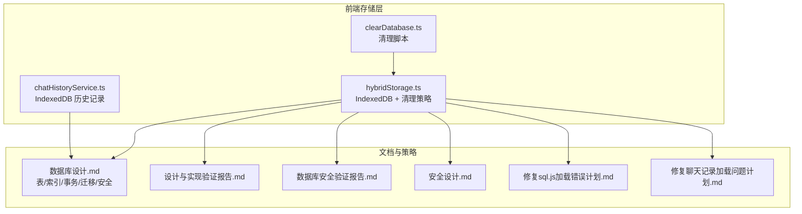
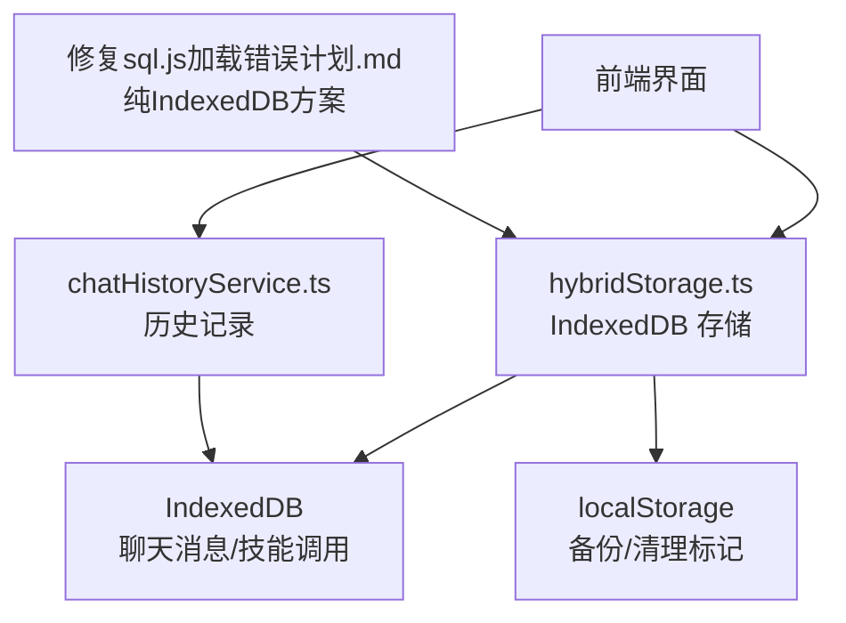
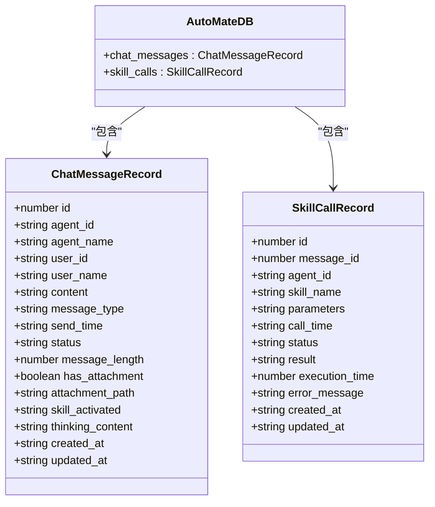
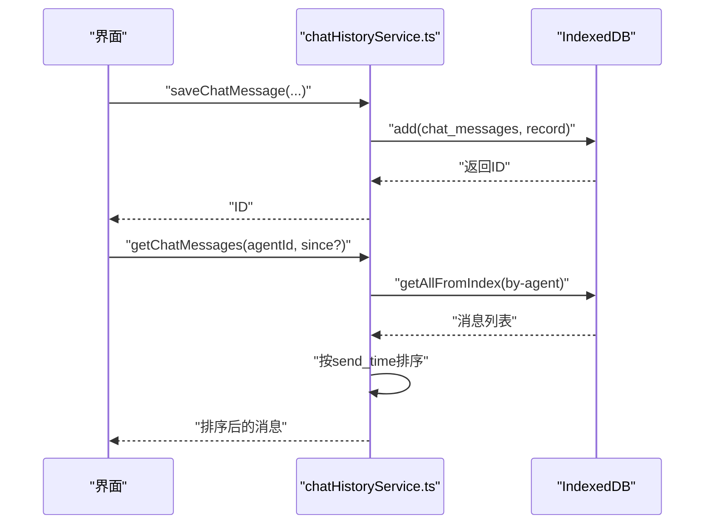
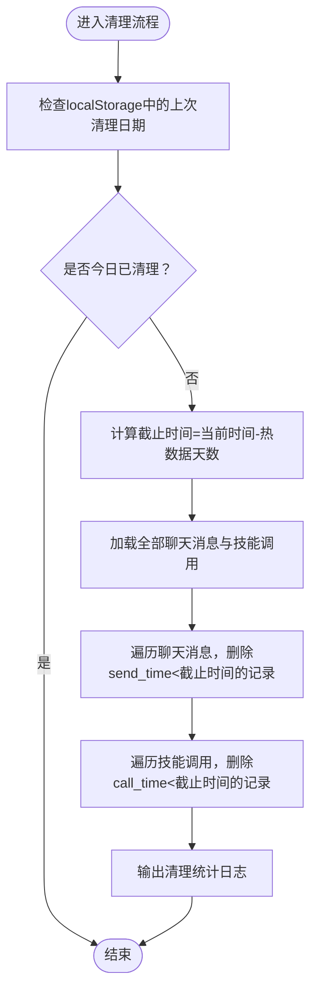
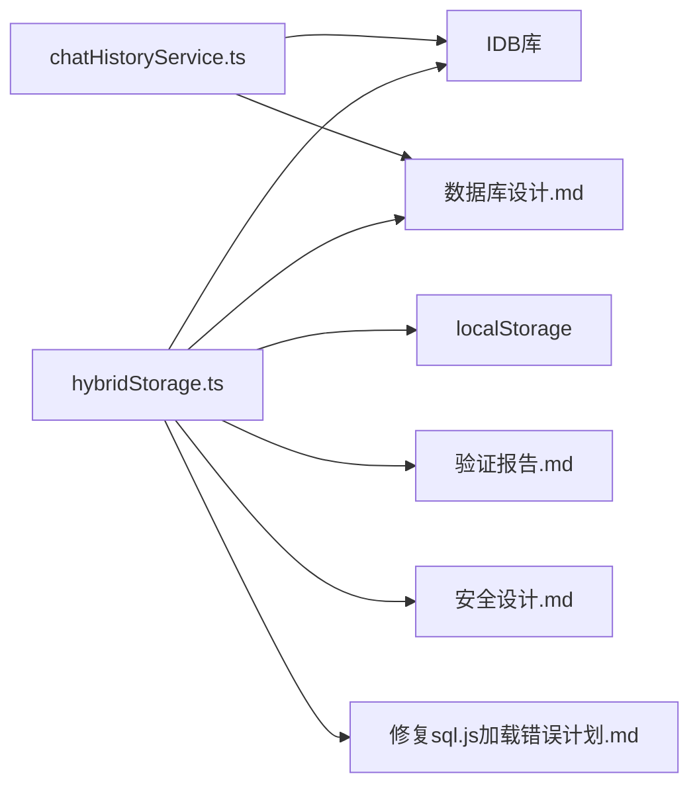

# 数据存储

<cite>
**本文引用的文件**
- [hybridStorage.ts](file://src/services/hybridStorage.ts)
- [chatHistoryService.ts](file://src/services/chatHistoryService.ts)
- [clearDatabase.ts](file://src/scripts/clearDatabase.ts)
- [数据库设计.md](file://docs/数据层设计/数据库设计.md)
- [数据库设计与实现验证报告.md](file://docs/数据层设计/数据库设计与实现验证报告.md)
- [数据库安全验证报告.md](file://docs/数据层设计/数据库安全验证报告.md)
- [安全设计.md](file://docs/非功能设计/安全设计.md)
- [修复sql.js加载错误计划.md](file://.trae/documents/修复sql.js加载错误计划.md)
- [修复聊天记录加载问题计划.md](file://.trae/documents/修复聊天记录加载问题计划.md)
</cite>

## 目录
1. [简介](#简介)
2. [项目结构](#项目结构)
3. [核心组件](#核心组件)
4. [架构总览](#架构总览)
5. [组件详解](#组件详解)
6. [依赖关系分析](#依赖关系分析)
7. [性能考量](#性能考量)
8. [故障排查指南](#故障排查指南)
9. [结论](#结论)
10. [附录](#附录)

## 简介
本文件面向AutoMate数据存储系统，提供从数据库设计、数据模型、存储策略到混合架构、本地缓存与远程同步、访问模式与查询优化、迁移与备份恢复、以及安全与权限控制的全景式技术文档。当前项目采用“纯IndexedDB”方案替代早期的SQL.js+SQLite混合存储思路，并在前端实现中以IndexedDB作为主要存储介质，同时通过localStorage进行轻量持久化备份与清理标记管理。

## 项目结构
与数据存储相关的关键文件分布如下：
- 前端混合存储与历史记录服务：src/services/hybridStorage.ts、src/services/chatHistoryService.ts
- 数据库设计与索引、事务、迁移与安全策略：docs/数据层设计/数据库设计.md
- 设计与实现验证报告：docs/数据层设计/数据库设计与实现验证报告.md、docs/数据层设计/数据库安全验证报告.md
- 安全设计与加密策略：docs/非功能设计/安全设计.md
- 修复与迁移说明：.trae/documents/修复sql.js加载错误计划.md、.trae/documents/修复聊天记录加载问题计划.md
- 数据库清理脚本：src/scripts/clearDatabase.ts

图表来源
- [hybridStorage.ts](file://src/services/hybridStorage.ts#L1-L262)
- [chatHistoryService.ts](file://src/services/chatHistoryService.ts#L1-L244)
- [clearDatabase.ts](file://src/scripts/clearDatabase.ts#L1-L41)
- [数据库设计.md](file://docs/数据层设计/数据库设计.md#L1-L738)
- [数据库设计与实现验证报告.md](file://docs/数据层设计/数据库设计与实现验证报告.md#L1-L159)
- [数据库安全验证报告.md](file://docs/数据层设计/数据库安全验证报告.md#L1-L82)
- [安全设计.md](file://docs/非功能设计/安全设计.md#L1-L78)
- [修复sql.js加载错误计划.md](file://.trae/documents/修复sql.js加载错误计划.md#L1-L34)
- [修复聊天记录加载问题计划.md](file://.trae/documents/修复聊天记录加载问题计划.md#L57-L94)

章节来源
- [hybridStorage.ts](file://src/services/hybridStorage.ts#L1-L262)
- [chatHistoryService.ts](file://src/services/chatHistoryService.ts#L1-L244)
- [clearDatabase.ts](file://src/scripts/clearDatabase.ts#L1-L41)
- [数据库设计.md](file://docs/数据层设计/数据库设计.md#L1-L738)
- [数据库设计与实现验证报告.md](file://docs/数据层设计/数据库设计与实现验证报告.md#L1-L159)
- [数据库安全验证报告.md](file://docs/数据层设计/数据库安全验证报告.md#L1-L82)
- [安全设计.md](file://docs/非功能设计/安全设计.md#L1-L78)
- [修复sql.js加载错误计划.md](file://.trae/documents/修复sql.js加载错误计划.md#L1-L34)
- [修复聊天记录加载问题计划.md](file://.trae/documents/修复聊天记录加载问题计划.md#L57-L94)

## 核心组件
- IndexedDB混合存储服务：负责聊天消息与技能调用的保存、查询、删除与过期数据清理；通过索引加速常用查询；每日检查并清理过期热数据。
- 历史记录服务：提供聊天消息与技能调用的读取、更新、删除与时间范围查询。
- 数据库清理脚本：一键清空IndexedDB与localStorage中的相关数据，辅助开发与测试。
- 文档与策略：提供数据库表结构、索引、事务、迁移、安全与混合存储策略的权威说明。

章节来源
- [hybridStorage.ts](file://src/services/hybridStorage.ts#L39-L87)
- [chatHistoryService.ts](file://src/services/chatHistoryService.ts#L37-L85)
- [clearDatabase.ts](file://src/scripts/clearDatabase.ts#L4-L40)
- [数据库设计.md](file://docs/数据层设计/数据库设计.md#L39-L165)

## 架构总览
AutoMate当前采用“纯IndexedDB”存储策略，替代早期的SQL.js+SQLite混合方案。其核心思想是：
- IndexedDB作为主要存储，承载热数据（近3天），提供快速读写。
- 通过localStorage进行轻量持久化备份与清理标记管理。
- 后端仍可提供SQLite主存储与同步接口，前端在必要时可回退至后端查询。

图表来源
- [hybridStorage.ts](file://src/services/hybridStorage.ts#L61-L87)
- [chatHistoryService.ts](file://src/services/chatHistoryService.ts#L61-L85)
- [修复sql.js加载错误计划.md](file://.trae/documents/修复sql.js加载错误计划.md#L10-L14)

章节来源
- [hybridStorage.ts](file://src/services/hybridStorage.ts#L89-L127)
- [修复sql.js加载错误计划.md](file://.trae/documents/修复sql.js加载错误计划.md#L1-L34)

## 组件详解

### IndexedDB混合存储服务（hybridStorage.ts）
职责与能力
- 数据模型定义：聊天消息与技能调用的结构化记录。
- 数据库初始化：通过IDB打开数据库，升级时创建对象存储与索引。
- 数据写入：保存聊天消息与技能调用，自动填充时间戳与元数据。
- 数据查询：按智能体、时间范围、消息ID等维度查询。
- 数据删除：按ID删除消息或根据消息ID删除技能调用。
- 过期清理：每日检查并清理超过热数据周期（默认3天）的历史记录。

图表来源
- [hybridStorage.ts](file://src/services/hybridStorage.ts#L5-L59)

章节来源
- [hybridStorage.ts](file://src/services/hybridStorage.ts#L5-L59)
- [hybridStorage.ts](file://src/services/hybridStorage.ts#L63-L87)
- [hybridStorage.ts](file://src/services/hybridStorage.ts#L129-L163)
- [hybridStorage.ts](file://src/services/hybridStorage.ts#L165-L184)
- [hybridStorage.ts](file://src/services/hybridStorage.ts#L202-L228)
- [hybridStorage.ts](file://src/services/hybridStorage.ts#L230-L244)
- [hybridStorage.ts](file://src/services/hybridStorage.ts#L246-L255)
- [hybridStorage.ts](file://src/services/hybridStorage.ts#L257-L261)

### 历史记录服务（chatHistoryService.ts）
职责与能力
- 数据模型定义：与混合存储一致的聊天消息与技能调用记录。
- 数据库初始化：同上，创建对象存储与索引。
- 写入与更新：保存消息、更新消息、删除消息。
- 查询与排序：按智能体ID查询，支持时间范围过滤与升序排序。
- 删除：按ID删除消息或根据消息ID删除技能调用。

图表来源
- [chatHistoryService.ts](file://src/services/chatHistoryService.ts#L87-L120)
- [chatHistoryService.ts](file://src/services/chatHistoryService.ts#L210-L229)

章节来源
- [chatHistoryService.ts](file://src/services/chatHistoryService.ts#L87-L120)
- [chatHistoryService.ts](file://src/services/chatHistoryService.ts#L210-L229)

### 过期数据清理流程（hybridStorage.ts）
- 每日检查：基于localStorage中的“上次清理日期”标记，避免重复清理。
- 清理策略：计算截止时间（当前时间减去热数据天数），遍历聊天消息与技能调用，删除过期记录。
- 日志输出：记录清理数量，便于监控。

图表来源
- [hybridStorage.ts](file://src/services/hybridStorage.ts#L89-L127)

章节来源
- [hybridStorage.ts](file://src/services/hybridStorage.ts#L89-L127)

### 数据库设计与模型（文档）
- 表结构：chat_messages、skill_calls、agent_states、file_attachments。
- 索引设计：覆盖常用查询维度（如agent_id、send_time、message_id、skill_name等）。
- 事务设计：支持WAL模式、事务隔离级别与典型事务场景（消息发送、技能调用）。
- 迁移策略：版本化迁移脚本与执行工具。
- 安全策略：SQLCipher加密、文件权限控制、密钥管理与数据加密。

章节来源
- [数据库设计.md](file://docs/数据层设计/数据库设计.md#L39-L165)
- [数据库设计.md](file://docs/数据层设计/数据库设计.md#L266-L379)
- [数据库设计.md](file://docs/数据层设计/数据库设计.md#L380-L449)
- [数据库设计.md](file://docs/数据层设计/数据库设计.md#L518-L566)
- [数据库设计.md](file://docs/数据层设计/数据库设计.md#L568-L595)
- [数据库设计与实现验证报告.md](file://docs/数据层设计/数据库设计与实现验证报告.md#L58-L76)
- [数据库安全验证报告.md](file://docs/数据层设计/数据库安全验证报告.md#L1-L82)

### 数据库清理脚本（clearDatabase.ts）
- 清理内容：移除localStorage中的SQLite数据键、删除IndexedDB数据库、清除清理标记。
- 使用场景：开发调试、测试环境重置、问题复现与验证。

章节来源
- [clearDatabase.ts](file://src/scripts/clearDatabase.ts#L4-L40)

## 依赖关系分析
- 混合存储服务依赖IDB库进行IndexedDB操作，并通过localStorage进行清理标记管理。
- 历史记录服务与混合存储服务共享相同的数据库模式与索引设计，确保查询一致性。
- 文档与验证报告为实现提供权威依据，指导索引、事务、迁移与安全策略落地。
- 修复计划文档明确了从SQL.js到纯IndexedDB的迁移路径与实现步骤。

图表来源
- [hybridStorage.ts](file://src/services/hybridStorage.ts#L1-L10)
- [chatHistoryService.ts](file://src/services/chatHistoryService.ts#L1-L10)
- [数据库设计.md](file://docs/数据层设计/数据库设计.md#L1-L738)
- [数据库设计与实现验证报告.md](file://docs/数据层设计/数据库设计与实现验证报告.md#L1-L159)
- [数据库安全验证报告.md](file://docs/数据层设计/数据库安全验证报告.md#L1-L82)
- [安全设计.md](file://docs/非功能设计/安全设计.md#L1-L78)
- [修复sql.js加载错误计划.md](file://.trae/documents/修复sql.js加载错误计划.md#L1-L34)

章节来源
- [hybridStorage.ts](file://src/services/hybridStorage.ts#L1-L10)
- [chatHistoryService.ts](file://src/services/chatHistoryService.ts#L1-L10)
- [数据库设计.md](file://docs/数据层设计/数据库设计.md#L1-L738)
- [数据库设计与实现验证报告.md](file://docs/数据层设计/数据库设计与实现验证报告.md#L1-L159)
- [数据库安全验证报告.md](file://docs/数据层设计/数据库安全验证报告.md#L1-L82)
- [安全设计.md](file://docs/非功能设计/安全设计.md#L1-L78)
- [修复sql.js加载错误计划.md](file://.trae/documents/修复sql.js加载错误计划.md#L1-L34)

## 性能考量
- 索引优化：针对常用查询维度建立单列与复合索引，减少全表扫描。
- 时间范围查询：利用send_time与agent_id复合索引，提升近24小时数据查询效率。
- 热数据淘汰：通过每日清理机制，控制IndexedDB容量增长，维持查询性能。
- 事务与WAL：在后端场景下启用WAL模式与事务，提升并发与一致性。
- 查询计划与监控：通过EXPLAIN QUERY PLAN与数据库大小监控，持续优化查询与容量。

章节来源
- [数据库设计.md](file://docs/数据层设计/数据库设计.md#L266-L379)
- [数据库设计.md](file://docs/数据层设计/数据库设计.md#L450-L516)
- [hybridStorage.ts](file://src/services/hybridStorage.ts#L89-L127)

## 故障排查指南
常见问题与处理
- IndexedDB查询异常：检查索引是否存在、查询条件是否匹配索引列、是否在内存中进行了不必要的过滤。
- 数据未显示：确认是否处于热数据周期内（默认3天），超出周期需回退到后端或等待同步。
- 清理无效：检查localStorage中的清理标记是否为今日，避免重复清理。
- 开发重置：使用清理脚本一键清空IndexedDB与localStorage相关键值。

章节来源
- [修复sql.js加载错误计划.md](file://.trae/documents/修复sql.js加载错误计划.md#L1-L34)
- [修复聊天记录加载问题计划.md](file://.trae/documents/修复聊天记录加载问题计划.md#L57-L94)
- [clearDatabase.ts](file://src/scripts/clearDatabase.ts#L4-L40)
- [hybridStorage.ts](file://src/services/hybridStorage.ts#L89-L127)

## 结论
AutoMate当前采用“纯IndexedDB”存储方案，结合localStorage进行轻量持久化与清理标记管理，满足前端侧热数据的高性能读写需求。配合完善的数据库设计、索引与事务策略，以及安全与迁移机制，整体数据存储体系具备良好的可维护性与扩展性。后续可在需要时引入后端SQLite主存储与同步接口，进一步完善混合存储架构。

## 附录

### 数据模型与索引概览
- 聊天消息表：包含消息内容、类型、状态、时间戳、附件与技能激活信息等字段，建立多维索引以支撑高频查询。
- 技能调用表：记录技能名称、参数、状态、执行时间与错误信息，建立消息ID与时间维度索引。
- 智能体状态表与文件附件表：分别用于状态跟踪与附件管理，配套索引优化查询。

章节来源
- [数据库设计.md](file://docs/数据层设计/数据库设计.md#L39-L165)
- [数据库设计.md](file://docs/数据层设计/数据库设计.md#L266-L379)

### 事务与迁移
- 事务：在后端场景下使用WAL模式与事务封装，确保消息发送与技能调用的一致性。
- 迁移：版本化迁移脚本与执行工具，支持up/down与状态查询，保障数据库结构演进可控。

章节来源
- [数据库设计.md](file://docs/数据层设计/数据库设计.md#L380-L449)
- [数据库设计与实现验证报告.md](file://docs/数据层设计/数据库设计与实现验证报告.md#L58-L76)

### 安全与权限
- 数据加密：SQLCipher数据库加密与文件权限控制，确保数据静态安全。
- 访问控制：文件系统权限与访问规则管理，结合审计日志，实现细粒度访问控制。

章节来源
- [数据库安全验证报告.md](file://docs/数据层设计/数据库安全验证报告.md#L1-L82)
- [安全设计.md](file://docs/非功能设计/安全设计.md#L24-L78)