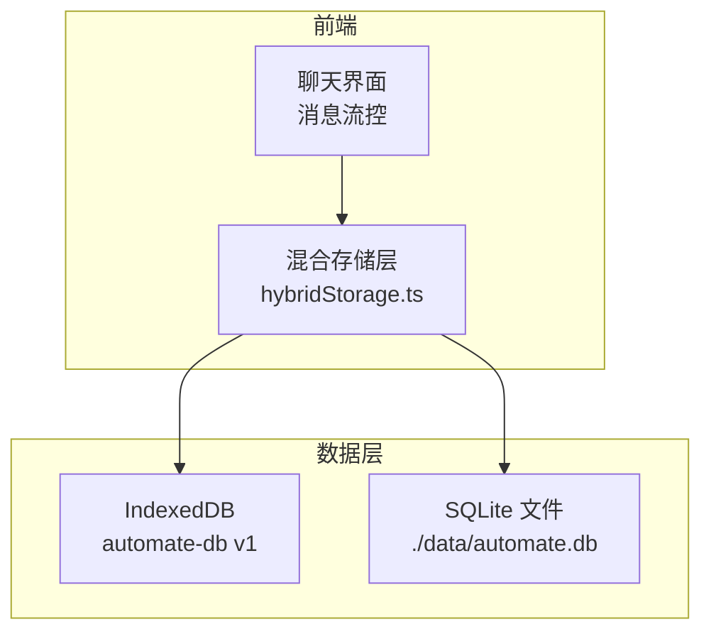
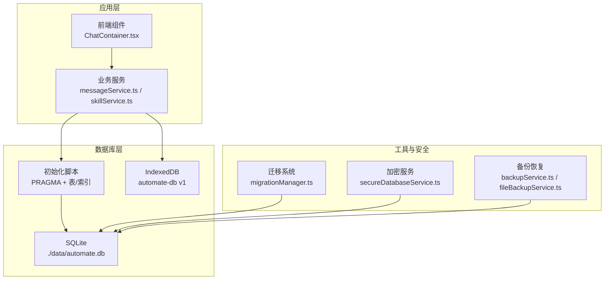
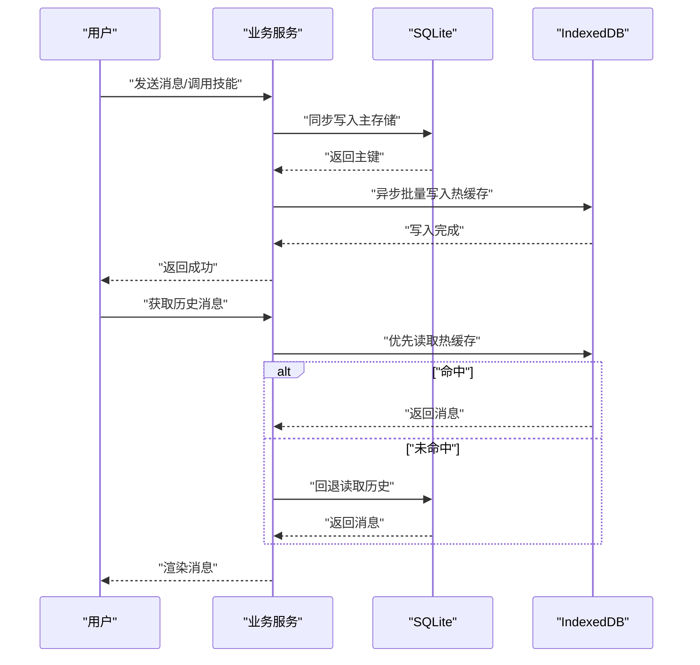
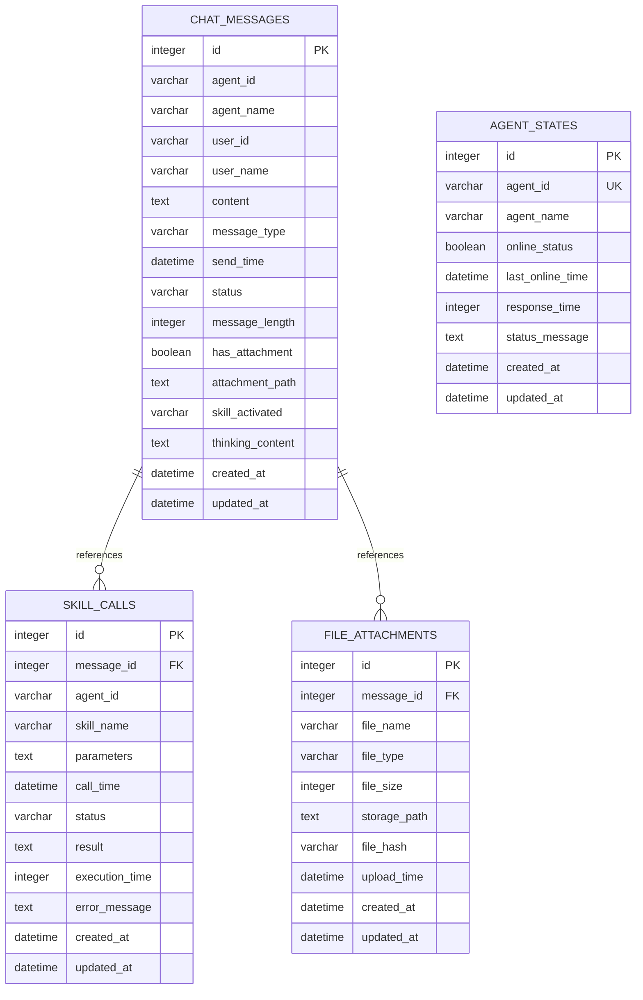
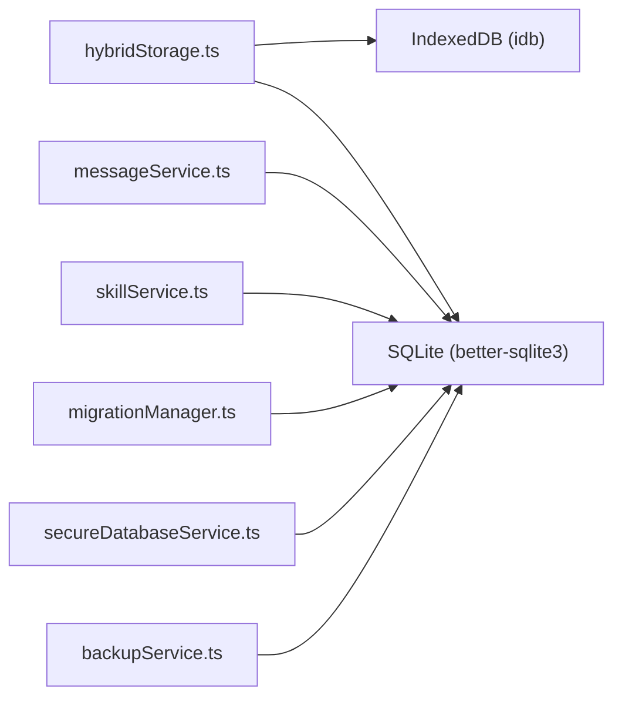

# 数据库设计

<cite>
**本文引用的文件**
- [数据库设计.md](file://docs/数据层设计/数据库设计.md)
- [数据库设计与实现验证报告.md](file://docs/数据层设计/数据库设计与实现验证报告.md)
- [修复sql.js加载错误计划.md](file://.trae/documents/修复sql.js加载错误计划.md)
- [hybridStorage.ts](file://src/services/hybridStorage.ts)
- [clearDatabase.ts](file://src/scripts/clearDatabase.ts)
</cite>

## 目录
1. [简介](#简介)
2. [项目结构](#项目结构)
3. [核心组件](#核心组件)
4. [架构总览](#架构总览)
5. [详细组件分析](#详细组件分析)
6. [依赖分析](#依赖分析)
7. [性能考虑](#性能考虑)
8. [故障排查指南](#故障排查指南)
9. [结论](#结论)
10. [附录](#附录)

## 简介
本文件面向AutoMate项目的数据库设计，围绕SQLite与IndexedDB混合存储策略展开，系统阐述表结构、字段与约束、索引策略、事务与初始化流程、性能优化与查询最佳实践，并提供实体关系图与架构图，帮助开发者与运维人员理解并维护该数据库层。

## 项目结构
AutoMate的数据库层由两部分组成：
- SQLite（主存储/冷数据）：持久化历史数据，提供强一致与可审计性
- IndexedDB（热缓存）：缓存最近3天的热数据，提升高频读取性能

**图表来源**
- [hybridStorage.ts](file://src/services/hybridStorage.ts#L61-L87)
- [数据库设计.md](file://docs/数据层设计/数据库设计.md#L599-L640)

**章节来源**
- [数据库设计.md](file://docs/数据层设计/数据库设计.md#L599-L640)
- [hybridStorage.ts](file://src/services/hybridStorage.ts#L61-L87)

## 核心组件
- 表与索引：chat_messages、skill_calls、agent_states、file_attachments
- 事务：消息发送与技能调用均使用事务保证原子性
- 初始化：PRAGMA配置、表与索引创建、WAL模式
- 混合存储：SQLite主存 + IndexedDB热缓存，支持时间范围查询与淘汰策略
- 安全：SQLCipher加密、文件权限控制、密钥管理与备份恢复

**章节来源**
- [数据库设计.md](file://docs/数据层设计/数据库设计.md#L21-L37)
- [数据库设计与实现验证报告.md](file://docs/数据层设计/数据库设计与实现验证报告.md#L25-L56)

## 架构总览
下图展示了AutoMate数据库层的整体架构与数据流向：

**图表来源**
- [数据库设计与实现验证报告.md](file://docs/数据层设计/数据库设计与实现验证报告.md#L33-L96)
- [数据库设计.md](file://docs/数据层设计/数据库设计.md#L518-L596)

## 详细组件分析

### 表结构与字段定义
- chat_messages：存储消息、状态、附件、思考过程、技能激活等
- skill_calls：记录技能调用、参数、结果、耗时与错误
- agent_states：智能体在线状态与响应时间
- file_attachments：消息附件元数据与存储路径

字段与约束概览（详见文档表格与创建语句）：
- 主键：各表均使用自增主键
- 外键：skill_calls.message_id、file_attachments.message_id 引用 chat_messages.id（级联删除/更新）
- 默认值：CURRENT_TIMESTAMP、布尔默认值、字符串默认值
- 时间戳：send_time、call_time、upload_time等用于排序与范围查询

**章节来源**
- [数据库设计.md](file://docs/数据层设计/数据库设计.md#L41-L108)
- [数据库设计.md](file://docs/数据层设计/数据库设计.md#L110-L165)
- [数据库设计.md](file://docs/数据层设计/数据库设计.md#L167-L213)
- [数据库设计.md](file://docs/数据层设计/数据库设计.md#L215-L264)

### 索引策略
- chat_messages：agent_id、send_time、agent_id+send_time、user_id、message_type、status、skill_activated
- skill_calls：message_id、call_time、message_id+call_time、agent_id、skill_name、status
- agent_states：agent_id（唯一）、online_status、last_online_time
- file_attachments：message_id、file_hash、upload_time

复合索引用于常见查询模式（如按agent+时间范围、按message+时间），减少全表扫描。

**章节来源**
- [数据库设计.md](file://docs/数据层设计/数据库设计.md#L266-L379)

### 事务处理机制
- 事务隔离级别：SERIALIZABLE（read_uncommitted=false）
- 典型事务场景：
  - 消息发送：插入chat_messages后返回最新消息
  - 技能调用：插入skill_calls并返回调用记录
- 最佳实践：保持事务短小、避免在事务中进行IO或用户交互

**章节来源**
- [数据库设计.md](file://docs/数据层设计/数据库设计.md#L380-L449)
- [数据库设计与实现验证报告.md](file://docs/数据层设计/数据库设计与实现验证报告.md#L39-L56)

### 数据库初始化流程
- PRAGMA配置：启用外键、WAL模式、同步级别、缓存大小
- 表与索引：按设计文档创建四张表及全部索引
- 连接管理：DatabaseManager类封装连接、初始化、事务与关闭

**章节来源**
- [数据库设计.md](file://docs/数据层设计/数据库设计.md#L21-L37)
- [数据库设计与实现验证报告.md](file://docs/数据层设计/数据库设计与实现验证报告.md#L25-L37)

### 混合存储策略与实现
- 存储策略：SQLite持久化全部历史；IndexedDB缓存最近3天热数据
- 读写流程：写入先SQLite，再异步批量写入IndexedDB；读取优先IndexedDB，未命中回退SQLite
- 索引设计：为支持时间范围查询与关联查询，创建复合索引
- 同步与一致性：以SQLite为准，定期从SQLite同步最新数据到IndexedDB
- 清理策略：每日检查并删除过期热数据（超过3天）

**图表来源**
- [数据库设计.md](file://docs/数据层设计/数据库设计.md#L615-L640)
- [hybridStorage.ts](file://src/services/hybridStorage.ts#L61-L87)

**章节来源**
- [数据库设计.md](file://docs/数据层设计/数据库设计.md#L597-L680)
- [hybridStorage.ts](file://src/services/hybridStorage.ts#L89-L110)
- [hybridStorage.ts](file://src/services/hybridStorage.ts#L165-L184)
- [hybridStorage.ts](file://src/services/hybridStorage.ts#L230-L244)

### 数据模型关系映射与ER图

**图表来源**
- [数据库设计.md](file://docs/数据层设计/数据库设计.md#L41-L108)
- [数据库设计.md](file://docs/数据层设计/数据库设计.md#L110-L165)
- [数据库设计.md](file://docs/数据层设计/数据库设计.md#L215-L264)
- [数据库设计.md](file://docs/数据层设计/数据库设计.md#L167-L213)

### 数据类型、默认值与完整性约束
- 数据类型：INTEGER、VARCHAR(n)、TEXT、DATETIME、BOOLEAN
- 默认值：CURRENT_TIMESTAMP、布尔默认值、字符串默认值
- 完整性约束：NOT NULL、UNIQUE、PRIMARY KEY、FOREIGN KEY（级联删除/更新）
- 时间字段：用于排序与范围查询，支撑索引优化

**章节来源**
- [数据库设计.md](file://docs/数据层设计/数据库设计.md#L49-L107)
- [数据库设计.md](file://docs/数据层设计/数据库设计.md#L118-L164)
- [数据库设计.md](file://docs/数据层设计/数据库设计.md#L223-L263)
- [数据库设计.md](file://docs/数据层设计/数据库设计.md#L175-L212)

### 数据库安全与加密
- SQLCipher加密：通过PRAGMA key进行数据库加密
- 密钥管理：密钥生成、保存、加载与权限控制
- 文件权限：数据库文件权限设置为0o600
- 备份恢复：数据库与文件备份、解密恢复

**章节来源**
- [数据库设计.md](file://docs/数据层设计/数据库设计.md#L568-L596)
- [数据库设计与实现验证报告.md](file://docs/数据层设计/数据库设计与实现验证报告.md#L77-L131)

## 依赖分析
- 组件耦合
  - hybridStorage.ts 依赖 IndexedDB（idb库）与SQLite（better-sqlite3）
  - 业务服务通过事务封装数据库操作
  - 迁移系统独立于业务层，提供版本管理与回滚
- 外部依赖
  - better-sqlite3（Node.js环境）
  - idb（IndexedDB封装）
  - sql.js（曾尝试，最终采用纯IndexedDB方案）

**图表来源**
- [数据库设计与实现验证报告.md](file://docs/数据层设计/数据库设计与实现验证报告.md#L33-L96)
- [修复sql.js加载错误计划.md](file://.trae/documents/修复sql.js加载错误计划.md#L10-L14)

**章节来源**
- [数据库设计与实现验证报告.md](file://docs/数据层设计/数据库设计与实现验证报告.md#L33-L96)
- [修复sql.js加载错误计划.md](file://.trae/documents/修复sql.js加载错误计划.md#L1-L34)

## 性能考虑
- 查询优化
  - 使用索引：按常用过滤字段建立单列与复合索引
  - 避免在索引列使用函数，优先使用复合索引覆盖多条件
- 数据库维护
  - 定期执行VACUUM与ANALYZE，保持统计信息准确
  - 监控数据库大小与查询计划（EXPLAIN QUERY PLAN）
- 混合存储优化
  - 热数据仅保留3天，降低索引与扫描成本
  - 优先从IndexedDB读取，未命中再回退SQLite
- 事务与并发
  - WAL模式提升并发读写性能
  - 事务尽量短小，避免阻塞

**章节来源**
- [数据库设计.md](file://docs/数据层设计/数据库设计.md#L450-L517)
- [数据库设计.md](file://docs/数据层设计/数据库设计.md#L641-L667)

## 故障排查指南
- 清空混合存储数据库
  - 清空localStorage中的SQLite数据
  - 删除IndexedDB数据库
  - 清除清理标记，重新初始化
- sql.js加载问题
  - 替换为纯IndexedDB方案，移除sql.js相关依赖
- 常见问题定位
  - 检查PRAGMA配置是否生效
  - 确认索引是否存在且被使用
  - 查看事务是否正确提交/回滚

**章节来源**
- [clearDatabase.ts](file://src/scripts/clearDatabase.ts#L1-L40)
- [修复sql.js加载错误计划.md](file://.trae/documents/修复sql.js加载错误计划.md#L1-L34)

## 结论
AutoMate采用SQLite + IndexedDB混合存储策略，在保证历史数据持久化与可审计的同时，通过热缓存显著提升高频读取性能。完善的表结构、索引与事务设计，配合初始化脚本与安全机制，形成了稳定可靠的数据层。建议持续关注查询计划与数据库大小，结合业务增长迭代索引与清理策略。

## 附录
- 初始化脚本与PRAGMA配置
- 迁移脚本与版本管理
- 备份与恢复流程
- 性能监控与慢查询分析

**章节来源**
- [数据库设计.md](file://docs/数据层设计/数据库设计.md#L21-L37)
- [数据库设计与实现验证报告.md](file://docs/数据层设计/数据库设计与实现验证报告.md#L58-L116)