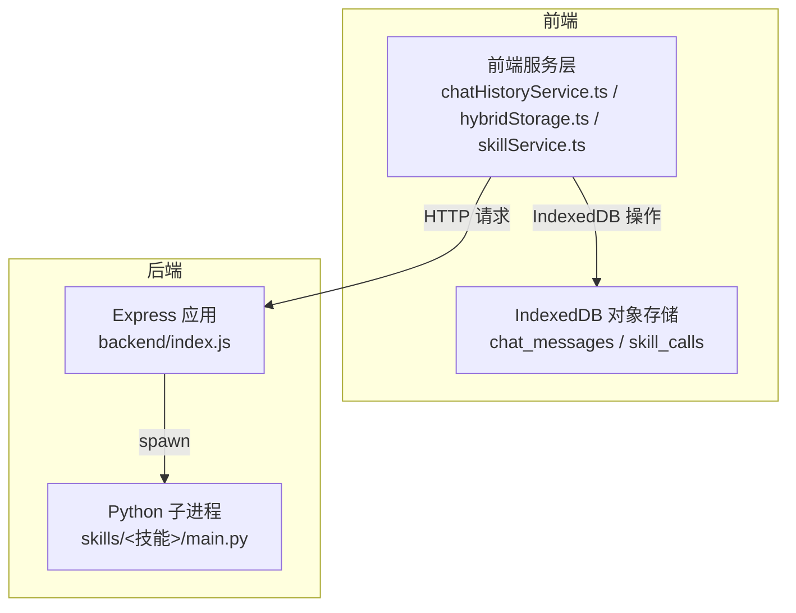
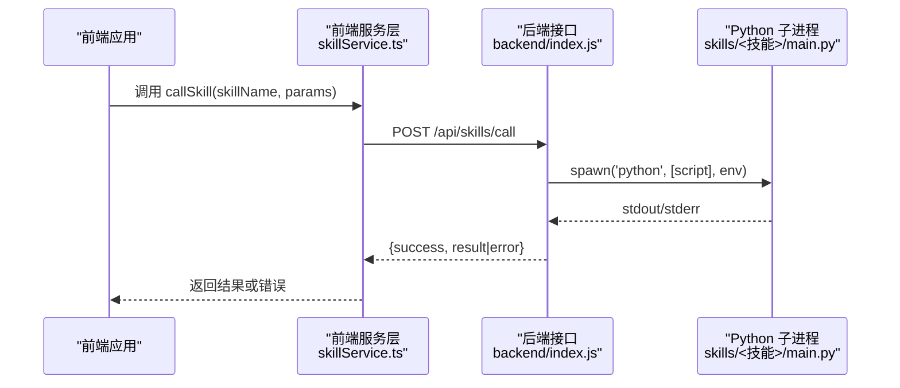
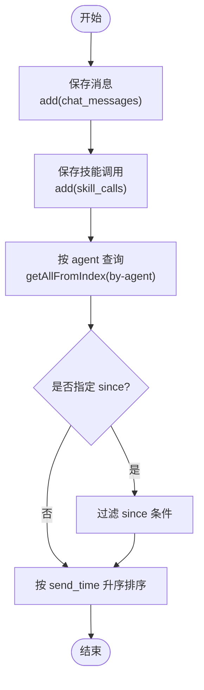
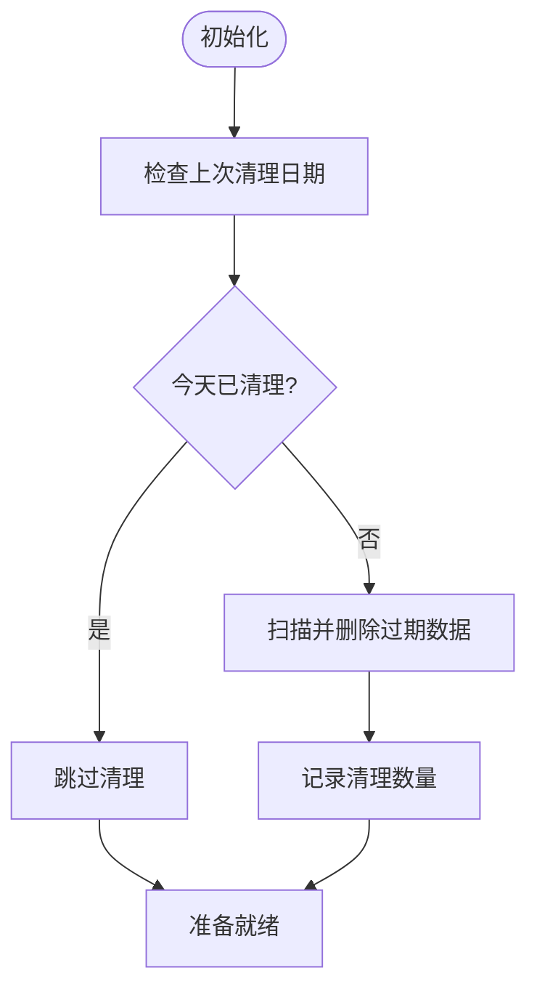
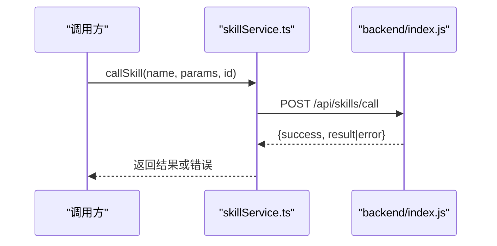
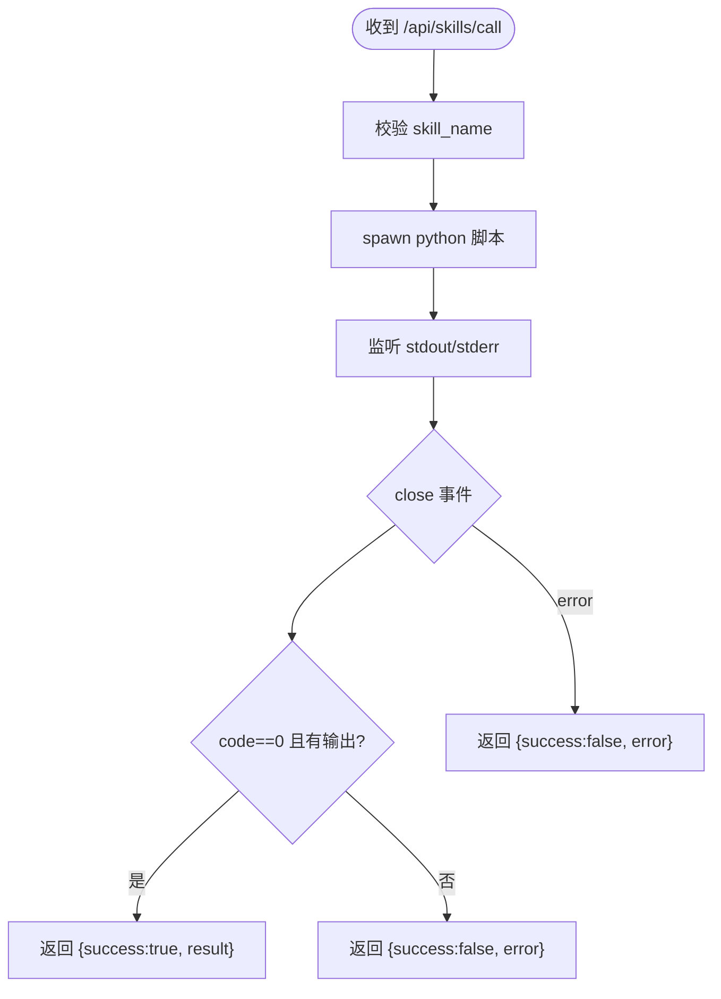
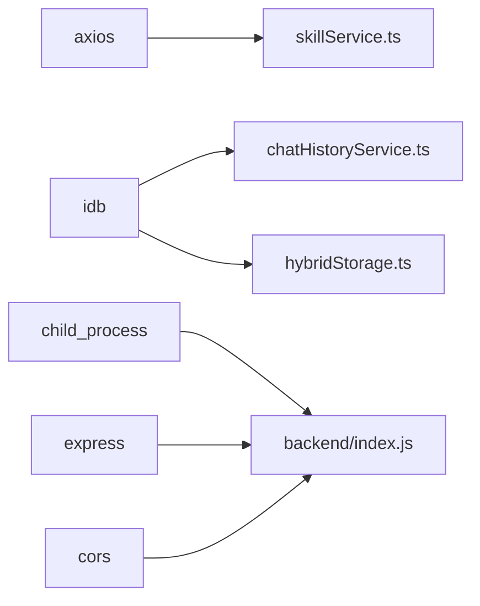

# 数据访问模式

<cite>
**本文引用的文件**
- [package.json](file://package.json)
- [backend/index.js](file://backend/index.js)
- [src/services/chatHistoryService.ts](file://src/services/chatHistoryService.ts)
- [src/services/hybridStorage.ts](file://src/services/hybridStorage.ts)
- [src/services/skillService.ts](file://src/services/skillService.ts)
- [docs/数据层设计/数据库安全验证报告.md](file://docs/数据层设计/数据库安全验证报告.md)
- [docs/数据层设计/数据库设计与实现验证报告.md](file://docs/数据层设计/数据库设计与实现验证报告.md)
</cite>

## 目录
1. [引言](#引言)
2. [项目结构](#项目结构)
3. [核心组件](#核心组件)
4. [架构总览](#架构总览)
5. [组件详解](#组件详解)
6. [依赖关系分析](#依赖关系分析)
7. [性能考量](#性能考量)
8. [故障排查指南](#故障排查指南)
9. [结论](#结论)
10. [附录](#附录)

## 引言
本文件系统化梳理 AutoMate 的数据访问模式，重点覆盖以下方面：
- 数据访问层架构：前端 IndexedDB 本地持久化、后端技能执行接口与 Python 子进程交互。
- ORM 映射与查询构建：基于 idb 的对象存储与索引设计，以及基于索引的查询路径。
- CRUD 与批量处理：消息与技能调用的增删改查，以及过期数据清理的批量策略。
- 事务管理：结合数据库迁移与事务验证文档，说明事务边界与一致性保障。
- 缓存与懒加载：IndexedDB 索引驱动的按需查询与过期清理策略。
- 分页、排序与过滤：基于时间戳索引的范围查询与排序。
- 数据验证、业务封装与错误处理：前端服务层的参数校验与错误分支、后端子进程的输出解析与状态返回。
- 异步操作与并发：Promise 化的调用链、超时控制与并发限制建议。
- 性能监控与优化：查询计划分析、数据库大小监控与缓存命中统计的落地建议。

## 项目结构
AutoMate 的数据访问层由三层组成：
- 前端服务层：通过 idb 访问 IndexedDB，提供聊天消息与技能调用的本地持久化能力。
- 后端接口层：Express 提供技能调用 API，内部以子进程方式执行 Python 脚本。
- 文档与规范：数据库安全、事务、迁移与性能监控等文档提供了数据访问的合规与质量保障。

图表来源
- [backend/index.js](file://backend/index.js#L1-L117)
- [src/services/chatHistoryService.ts](file://src/services/chatHistoryService.ts#L1-L244)
- [src/services/hybridStorage.ts](file://src/services/hybridStorage.ts#L1-L262)
- [src/services/skillService.ts](file://src/services/skillService.ts#L1-L73)

章节来源
- [package.json](file://package.json#L1-L47)
- [backend/index.js](file://backend/index.js#L1-L117)

## 核心组件
- 前端 IndexedDB 服务
  - chatHistoryService.ts：提供消息与技能调用的 CRUD、按索引查询、最近24小时筛选等。
  - hybridStorage.ts：在 chatHistoryService 的基础上增加过期数据清理与每日检查。
- 前端技能调用服务
  - skillService.ts：封装 /api/skills/call 的调用，统一超时与错误处理。
- 后端技能执行服务
  - backend/index.js：接收前端请求，spawn 子进程执行 Python 脚本，解析 stdout/stderr 返回结果。

章节来源
- [src/services/chatHistoryService.ts](file://src/services/chatHistoryService.ts#L1-L244)
- [src/services/hybridStorage.ts](file://src/services/hybridStorage.ts#L1-L262)
- [src/services/skillService.ts](file://src/services/skillService.ts#L1-L73)
- [backend/index.js](file://backend/index.js#L1-L117)

## 架构总览
下图展示从前端到后端的完整数据访问流程，包括技能调用与本地存储的协同。

图表来源
- [src/services/skillService.ts](file://src/services/skillService.ts#L1-L73)
- [backend/index.js](file://backend/index.js#L19-L79)

## 组件详解

### 前端 IndexedDB 服务（chatHistoryService.ts）
- 数据模型与索引
  - chat_messages：主键自增，索引 by-agent、by-send-time、by-agent-send-time、by-skill-activated。
  - skill_calls：主键自增，索引 by-message、by-call-time、by-agent。
- CRUD 与查询
  - 保存消息/技能调用：add。
  - 更新：get 后合并更新并 put。
  - 删除：delete；支持按消息删除关联技能调用。
  - 查询：getAllFromIndex + 过滤/排序；支持最近24小时筛选。
- 时间与排序
  - 以 send_time 和 call_time 作为排序依据，升序排列。
- 过滤与范围
  - 按 agent_id、message_type、skill_activated 等字段过滤。

图表来源
- [src/services/chatHistoryService.ts](file://src/services/chatHistoryService.ts#L87-L243)

章节来源
- [src/services/chatHistoryService.ts](file://src/services/chatHistoryService.ts#L1-L244)

### 前端 IndexedDB 服务（hybridStorage.ts）
- 在 chatHistoryService 的基础上增加“过期数据清理”：
  - 每日检查上次清理日期，若未清理则扫描并删除超过 HOT_DATA_DAYS 的记录。
  - 清理策略：遍历对象存储，比较 send_time/call_time 与截止时间。
- 初始化与幂等
  - initHybridStorage 内部触发数据库初始化与过期清理，保证首次使用即可用且干净。

图表来源
- [src/services/hybridStorage.ts](file://src/services/hybridStorage.ts#L89-L127)

章节来源
- [src/services/hybridStorage.ts](file://src/services/hybridStorage.ts#L1-L262)

### 前端技能调用服务（skillService.ts）
- 接口定义
  - callSkill：POST /api/skills/call，携带 skill_name 与 parameters，并注入 messageId/agentId。
  - executeSkill：基于 callSkill 的高层封装，直接返回结果字符串或抛出错误。
- 错误处理
  - 超时：ECONNABORTED -> 返回超时提示。
  - 网络错误：ERR_NETWORK -> 返回网络提示。
  - 其他 Axios 错误：读取响应中的 error 字段或 message。
  - 非 Axios 异常：统一转为字符串错误。
- 超时控制
  - 设置 TIMEOUT=30000ms，避免长时间阻塞。

图表来源
- [src/services/skillService.ts](file://src/services/skillService.ts#L12-L61)
- [backend/index.js](file://backend/index.js#L81-L104)

章节来源
- [src/services/skillService.ts](file://src/services/skillService.ts#L1-L73)
- [backend/index.js](file://backend/index.js#L1-L117)

### 后端技能执行服务（backend/index.js）
- 路由
  - POST /api/skills/call：执行技能并返回结果。
  - GET /api/skills：健康检查。
- 子进程执行
  - 使用 spawn('python', [script], { cwd, shell, env })。
  - 捕获 stdout/stderr 并在 close 事件中汇总结果。
- 参数传递
  - 将 parameters 以 JSON 字符串形式传入 Python 脚本。
- 错误处理
  - error 事件与异常捕获统一返回 {success:false, error}。
  - 400 缺少 skill_name，500 其他异常。

图表来源
- [backend/index.js](file://backend/index.js#L19-L79)
- [backend/index.js](file://backend/index.js#L81-L104)

章节来源
- [backend/index.js](file://backend/index.js#L1-L117)

### 事务管理与数据一致性（结合文档）
- 事务验证
  - 文档指出消息发送与技能调用均使用事务，所有数据库操作受事务保护。
- 迁移与版本管理
  - 提供迁移管理器与多版本迁移脚本，支持 up/down/status。
- 最佳实践建议
  - 将“保存消息+保存技能调用”的组合操作放入单个事务，确保原子性。
  - 对批量过期清理采用分批删除，避免长事务阻塞。

章节来源
- [docs/数据层设计/数据库设计与实现验证报告.md](file://docs/数据层设计/数据库设计与实现验证报告.md#L46-L76)

### 数据安全与访问控制（结合文档）
- 加密与密钥管理
  - SQLCipher 加密数据库，支持密码更改与备份。
  - 密钥文件权限严格控制（如 0o600），密钥生成与派生。
- 访问控制
  - 文件权限与访问规则管理，支持访问审计日志。
- 建议
  - 对敏感消息内容可考虑在应用层做额外加密（如 AES-256），结合密钥管理服务。

章节来源
- [docs/数据层设计/数据库安全验证报告.md](file://docs/数据层设计/数据库安全验证报告.md#L1-L59)

## 依赖关系分析
- 前端依赖
  - axios：用于向后端发起 HTTP 请求。
  - idb：用于 IndexedDB 的类型化访问与对象存储。
- 后端依赖
  - child_process：用于 spawn Python 子进程。
  - express/cors：提供 REST API 与跨域支持。
- 项目脚本
  - package.json 中的 backend/start 脚本用于前后端联调。

图表来源
- [src/services/skillService.ts](file://src/services/skillService.ts#L1-L73)
- [src/services/chatHistoryService.ts](file://src/services/chatHistoryService.ts#L1-L244)
- [src/services/hybridStorage.ts](file://src/services/hybridStorage.ts#L1-L262)
- [backend/index.js](file://backend/index.js#L1-L117)
- [package.json](file://package.json#L15-L27)

章节来源
- [package.json](file://package.json#L1-L47)
- [backend/index.js](file://backend/index.js#L1-L117)

## 性能考量
- 查询优化
  - 利用已建立的复合索引（如 by-agent-send-time）减少全表扫描。
  - 对高频查询（最近24小时）建议在应用层缓存结果，降低重复查询成本。
- 缓存策略
  - hybridStorage 的过期清理可视为“热数据保留 + 定期冷数据回收”，避免无限增长。
  - 建议引入 LRU 缓存（如 quick-lru）缓存最近 N 条消息，提升热点读取性能。
- 性能监控
  - 结合数据库性能监控文档，定期分析慢查询与数据库大小趋势，必要时调整索引与清理策略。
- 并发控制
  - 建议对同一 agent 的写入操作加队列或互斥锁，避免竞态导致的顺序错乱。
  - 对批量过期清理采用分批删除（如每批 100 条），并设置节流间隔。

## 故障排查指南
- 前端调用失败
  - 网络错误：确认后端服务已启动（npm run backend），并检查 CORS 配置。
  - 超时：适当增大 TIMEOUT 或优化后端脚本执行时间。
  - 参数缺失：确保 skill_name 与 parameters 正确传递。
- 后端执行失败
  - 子进程错误：检查 Python 脚本路径与工作目录，确认脚本可执行且无语法错误。
  - 输出为空：确认脚本正确输出到 stdout，而非仅 stderr。
- 数据库问题
  - IndexedDB 无法打开：检查浏览器兼容性与存储配额。
  - 查询结果异常：确认索引是否存在、键路径是否正确、查询范围是否合理。

章节来源
- [src/services/skillService.ts](file://src/services/skillService.ts#L34-L61)
- [backend/index.js](file://backend/index.js#L71-L78)
- [src/services/chatHistoryService.ts](file://src/services/chatHistoryService.ts#L210-L229)

## 结论
AutoMate 的数据访问模式以“前端 IndexedDB + 后端技能执行”为核心，通过明确的索引设计与服务层封装，实现了高效、可维护的数据持久化与调用链路。结合事务、迁移与安全文档，项目在一致性、可扩展性与安全性方面具备良好基础。后续可在缓存命中统计、慢查询分析与并发控制上进一步完善，以支撑更高负载场景。

## 附录
- 最佳实践清单
  - 将“保存消息+保存技能调用”放入事务，确保原子性。
  - 对高频查询引入 LRU 缓存与分页/排序优化。
  - 定期执行过期数据清理，控制数据库体积。
  - 对敏感数据在应用层做额外加密，配合密钥管理服务。
  - 监控慢查询与数据库大小，持续优化索引与清理策略。