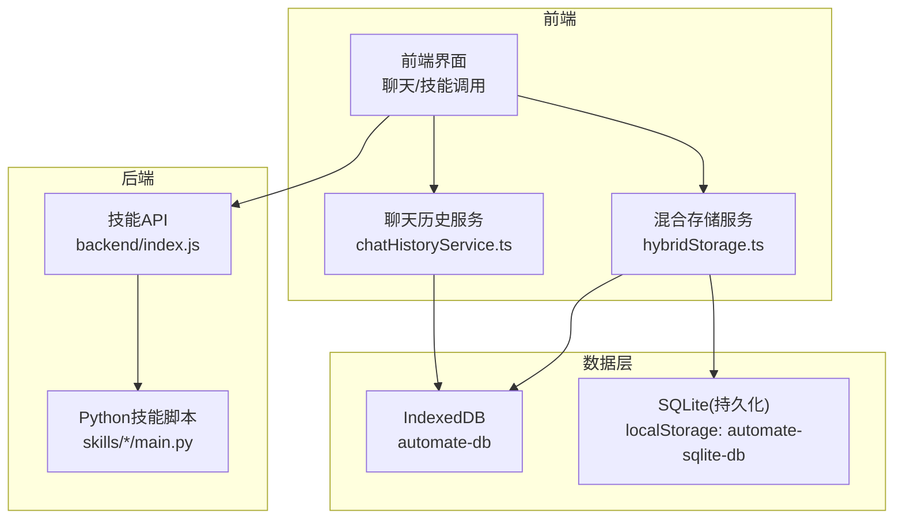
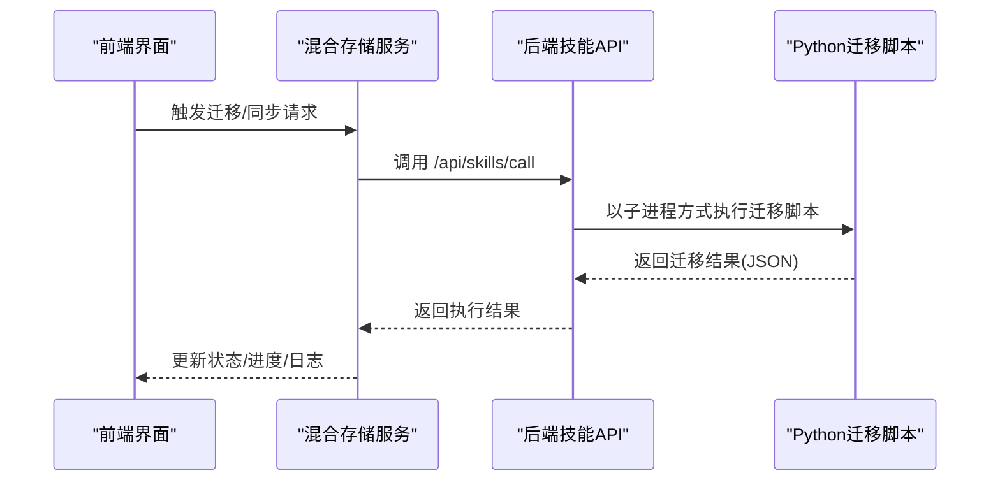
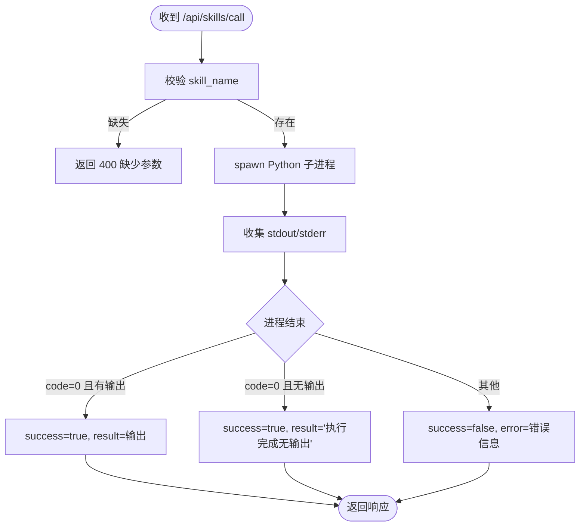
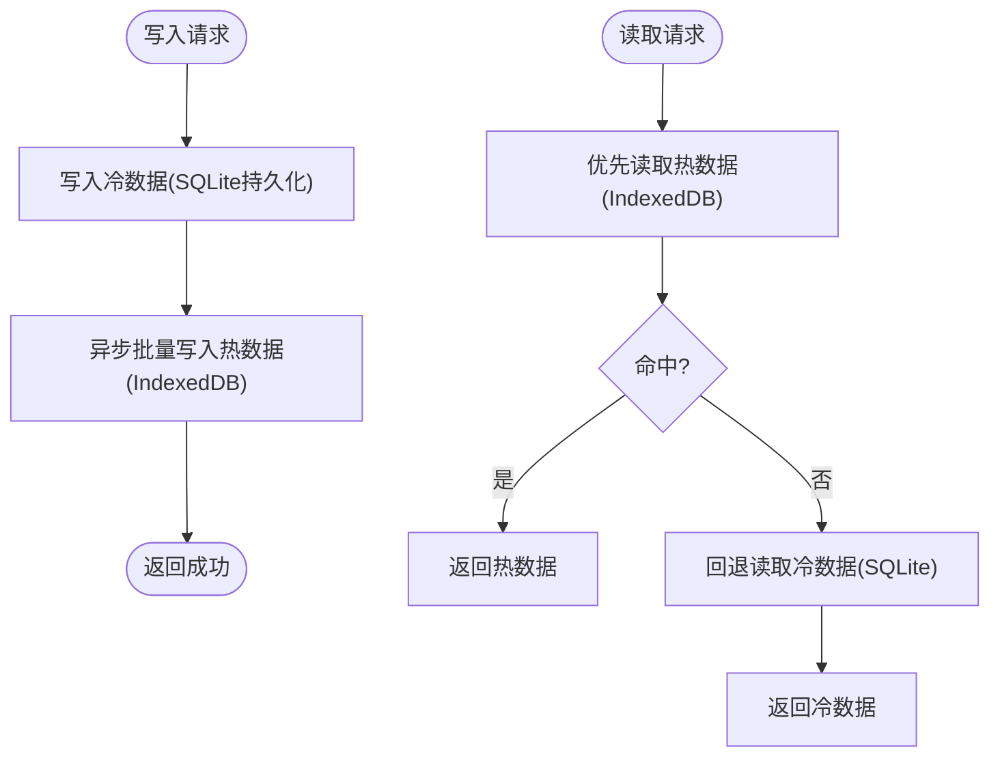
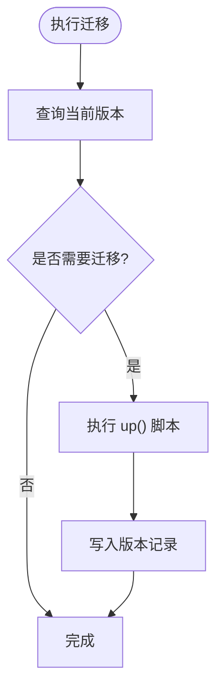
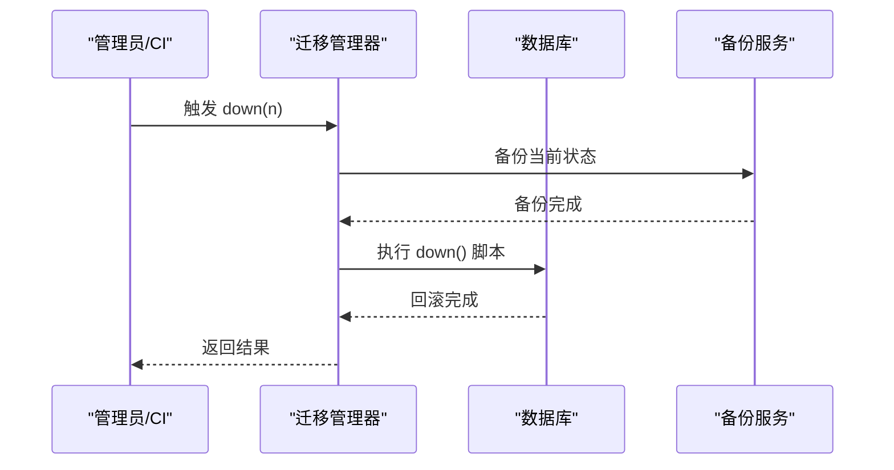
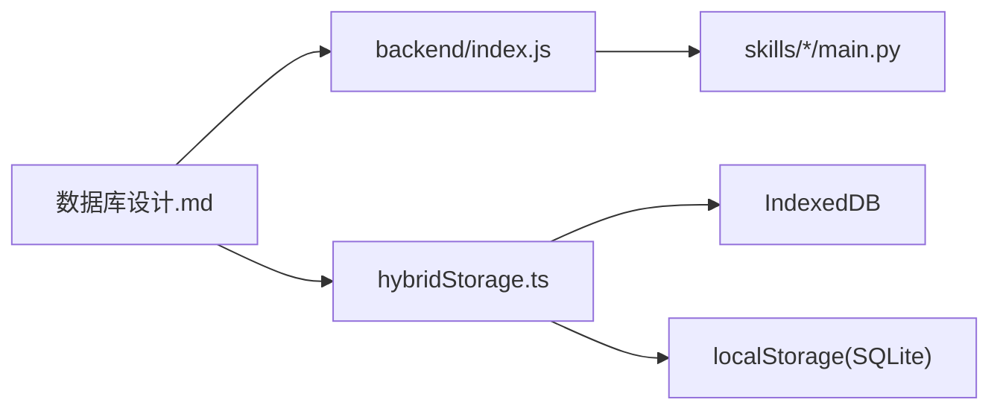

# 数据迁移

<cite>
**本文引用的文件**
- [backend/index.js](file://backend/index.js)
- [src/scripts/clearDatabase.ts](file://src/scripts/clearDatabase.ts)
- [docs/数据层设计/数据库设计.md](file://docs/数据层设计/数据库设计.md)
- [docs/数据层设计/数据库设计与实现验证报告.md](file://docs/数据层设计/数据库设计与实现验证报告.md)
- [docs/数据层设计/数据库安全验证报告.md](file://docs/数据层设计/数据库安全验证报告.md)
- [src/services/hybridStorage.ts](file://src/services/hybridStorage.ts)
- [src/services/chatHistoryService.ts](file://src/services/chatHistoryService.ts)
- [src/services/skillService.ts](file://src/services/skillService.ts)
- [.trae/documents/修复sql.js加载错误计划.md](file://.trae/documents/修复sql.js加载错误计划.md)
</cite>

## 目录
1. [简介](#简介)
2. [项目结构](#项目结构)
3. [核心组件](#核心组件)
4. [架构总览](#架构总览)
5. [组件详解](#组件详解)
6. [依赖关系分析](#依赖关系分析)
7. [性能考量](#性能考量)
8. [故障排查指南](#故障排查指南)
9. [结论](#结论)
10. [附录](#附录)

## 简介
本文件面向AutoMate数据迁移系统，围绕数据库版本管理、Schema变更与数据迁移策略展开，系统性阐述迁移脚本编写、回滚机制、数据备份方案、向后兼容性保证、数据格式转换与字段映射规则，并结合项目现有混合存储（SQLite+IndexedDB）与后端技能调用接口，给出批量迁移、增量更新与断点续传的可行方案。同时提供迁移测试策略、数据完整性验证、性能影响评估、错误处理与异常恢复、用户通知机制、迁移监控与日志记录、最佳实践与应急预案等指导。

## 项目结构
AutoMate采用前后端分离与混合存储架构：
- 前端通过HTTP调用后端技能接口，后端以子进程方式执行Python技能脚本。
- 前端使用IndexedDB作为热数据缓存，SQLite（通过持久化到localStorage）作为冷数据存储；二者构成混合存储体系。
- 文档中提供了基于better-sqlite3的迁移管理思路与示例，以及混合存储下的数据同步策略与索引设计。

图表来源
- [backend/index.js](file://backend/index.js#L1-L117)
- [src/services/hybridStorage.ts](file://src/services/hybridStorage.ts#L1-L262)
- [src/services/chatHistoryService.ts](file://src/services/chatHistoryService.ts#L1-L244)

章节来源
- [backend/index.js](file://backend/index.js#L1-L117)
- [src/services/hybridStorage.ts](file://src/services/hybridStorage.ts#L1-L262)
- [docs/数据层设计/数据库设计.md](file://docs/数据层设计/数据库设计.md#L518-L728)

## 核心组件
- 后端技能服务：负责接收前端调用请求，定位并执行对应Python技能脚本，返回执行结果或错误信息。
- 前端混合存储服务：封装IndexedDB数据库的打开、升级、索引与CRUD操作，提供消息与技能调用的增删改查。
- 聊天历史服务：提供消息与技能调用的查询、更新与删除接口，支撑UI展示与业务逻辑。
- 清库脚本：用于一键清空IndexedDB与SQLite持久化数据，便于迁移测试与环境复位。
- 文档迁移与混合存储策略：提供基于better-sqlite3的迁移管理思路、版本表、迁移脚本示例，以及混合存储下的数据同步与索引设计。

章节来源
- [backend/index.js](file://backend/index.js#L1-L117)
- [src/services/hybridStorage.ts](file://src/services/hybridStorage.ts#L1-L262)
- [src/services/chatHistoryService.ts](file://src/services/chatHistoryService.ts#L1-L244)
- [src/scripts/clearDatabase.ts](file://src/scripts/clearDatabase.ts#L1-L41)
- [docs/数据层设计/数据库设计.md](file://docs/数据层设计/数据库设计.md#L518-L728)

## 架构总览
下图展示了迁移相关的端到端流程：前端发起迁移或数据同步请求，后端技能服务执行具体迁移脚本，前端混合存储服务负责数据落盘与缓存，文档中的迁移管理思路提供版本控制与回滚保障。

图表来源
- [backend/index.js](file://backend/index.js#L81-L104)
- [src/services/hybridStorage.ts](file://src/services/hybridStorage.ts#L1-L262)
- [docs/数据层设计/数据库设计.md](file://docs/数据层设计/数据库设计.md#L518-L566)

## 组件详解

### 后端技能服务与迁移执行
- 请求入口：POST /api/skills/call，参数包含skill_name与parameters。
- 执行机制：根据skill_name定位skills目录下的main.py，以子进程方式执行，捕获stdout/stderr与退出码，组装统一响应。
- 错误处理：对不同退出码与异常进行分类返回，便于前端展示与重试策略。

图表来源
- [backend/index.js](file://backend/index.js#L19-L79)

章节来源
- [backend/index.js](file://backend/index.js#L1-L117)

### 前端混合存储与数据同步
- IndexedDB：定义对象仓库与索引，提供消息与技能调用的CRUD与查询。
- 过期清理：每日检查并清理超出热数据窗口（默认3天）的历史数据。
- 一致性策略：写入先落冷数据（SQLite持久化），再异步写入热数据（IndexedDB）；读取优先热数据，未命中回退冷数据。
- 数据同步接口：文档中提供了后端同步接口示例，可用于将冷数据批量导入热数据或进行跨端同步。

图表来源
- [src/services/hybridStorage.ts](file://src/services/hybridStorage.ts#L89-L127)
- [docs/数据层设计/数据库设计.md](file://docs/数据层设计/数据库设计.md#L668-L728)

章节来源
- [src/services/hybridStorage.ts](file://src/services/hybridStorage.ts#L1-L262)
- [docs/数据层设计/数据库设计.md](file://docs/数据层设计/数据库设计.md#L597-L728)

### 迁移脚本编写与版本管理
- 版本表：建议引入schema_migrations表记录迁移版本与应用时间。
- up/down方法：每个迁移脚本提供向上与向下迁移方法，确保可回滚。
- better-sqlite3示例：文档提供了基于better-sqlite3的迁移脚本示例，包括PRAGMA设置、版本检查与迁移执行。
- 命令行支持：可扩展支持up、down、status等命令，便于自动化与CI/CD集成。

图表来源
- [docs/数据层设计/数据库设计.md](file://docs/数据层设计/数据库设计.md#L518-L566)

章节来源
- [docs/数据层设计/数据库设计.md](file://docs/数据层设计/数据库设计.md#L518-L566)
- [docs/数据层设计/数据库设计与实现验证报告.md](file://docs/数据层设计/数据库设计与实现验证报告.md#L58-L76)

### 回滚机制与数据备份
- 回滚策略：每个迁移脚本提供down方法，按逆序回滚至目标版本。
- 备份方案：文档提供了数据库备份与恢复服务的验证清单，支持数据库与文件备份、备份列表管理与解密恢复。
- 加密与访问控制：数据库使用SQLCipher加密，备份数据可加密，敏感数据使用AES-256加密，具备访问控制与权限管理。

图表来源
- [docs/数据层设计/数据库设计与实现验证报告.md](file://docs/数据层设计/数据库设计与实现验证报告.md#L97-L116)
- [docs/数据层设计/数据库安全验证报告.md](file://docs/数据层设计/数据库安全验证报告.md#L61-L82)

章节来源
- [docs/数据层设计/数据库设计与实现验证报告.md](file://docs/数据层设计/数据库设计与实现验证报告.md#L97-L116)
- [docs/数据层设计/数据库安全验证报告.md](file://docs/数据层设计/数据库安全验证报告.md#L61-L82)

### 向后兼容性、格式转换与字段映射
- 向后兼容：通过版本表与迁移脚本的up/down方法，确保Schema演进过程中旧版本数据可被正确转换。
- 字段映射：迁移脚本中明确新增/删除/重命名字段，必要时提供数据转换逻辑（如JSON字段序列化/反序列化）。
- 索引策略：文档提供了针对聊天消息与技能调用表的复合索引设计，支撑时间范围查询与关联统计。

章节来源
- [docs/数据层设计/数据库设计.md](file://docs/数据层设计/数据库设计.md#L645-L666)

### 批量迁移、增量更新与断点续传
- 批量迁移：利用后端技能服务调用Python迁移脚本，可在离线或低峰时段执行大批量数据迁移。
- 增量更新：结合版本表与时间戳字段，仅迁移新增或变更的数据，减少对在线业务的影响。
- 断点续传：迁移脚本应具备幂等性与原子性，配合版本表记录已完成步骤，失败后可从断点继续。

章节来源
- [backend/index.js](file://backend/index.js#L19-L79)
- [docs/数据层设计/数据库设计.md](file://docs/数据层设计/数据库设计.md#L518-L566)

### 迁移测试策略与数据完整性验证
- 单元测试：针对迁移脚本的up/down方法进行单元测试，覆盖边界条件与异常分支。
- 集成测试：在隔离环境中执行完整迁移流程，验证Schema变更与数据转换正确性。
- 完整性验证：通过查询性能分析与数据库大小监控，确保迁移后查询效率与存储占用符合预期。

章节来源
- [docs/数据层设计/数据库设计与实现验证报告.md](file://docs/数据层设计/数据库设计与实现验证报告.md#L132-L144)

### 错误处理、异常恢复与用户通知
- 后端错误：对子进程退出码与stderr进行解析，统一返回错误信息，前端据此提示用户或触发重试。
- 前端错误：在调用技能接口时区分超时、网络错误与业务错误，提供明确的用户提示。
- 异常恢复：迁移失败时自动备份当前状态，支持回滚至上一版本；必要时触发人工干预流程。

章节来源
- [backend/index.js](file://backend/index.js#L69-L78)
- [src/services/skillService.ts](file://src/services/skillService.ts#L34-L61)

### 迁移监控、进度跟踪与日志记录
- 日志记录：后端技能服务记录技能执行过程、输出与错误；前端混合存储服务记录关键操作（如过期清理、消息保存）。
- 进度跟踪：迁移脚本可输出阶段性日志，结合版本表记录迁移进度；后端可提供状态查询接口。
- 监控指标：结合数据库大小监控与查询性能分析，持续评估迁移对系统性能的影响。

章节来源
- [backend/index.js](file://backend/index.js#L23-L51)
- [src/services/hybridStorage.ts](file://src/services/hybridStorage.ts#L117-L127)
- [docs/数据层设计/数据库设计与实现验证报告.md](file://docs/数据层设计/数据库设计与实现验证报告.md#L132-L144)

### 最佳实践与应急预案
- 最佳实践：迁移前备份、灰度发布、分批执行、回滚预案、变更评审。
- 应急预案：迁移失败时立即回滚至上一版本，启用只读模式，修复后再逐步恢复写入；对关键数据进行二次校验。

章节来源
- [docs/数据层设计/数据库设计与实现验证报告.md](file://docs/数据层设计/数据库设计与实现验证报告.md#L97-L116)

## 依赖关系分析
- 前端混合存储服务依赖IndexedDB与localStorage，承担热数据与冷数据的读写职责。
- 后端技能服务依赖Python运行环境与skills目录结构，负责执行迁移脚本。
- 文档中的迁移管理思路为系统提供版本控制与回滚保障，与实际混合存储策略互补。

图表来源
- [src/services/hybridStorage.ts](file://src/services/hybridStorage.ts#L1-L262)
- [backend/index.js](file://backend/index.js#L1-L117)
- [docs/数据层设计/数据库设计.md](file://docs/数据层设计/数据库设计.md#L518-L566)

章节来源
- [src/services/hybridStorage.ts](file://src/services/hybridStorage.ts#L1-L262)
- [backend/index.js](file://backend/index.js#L1-L117)
- [docs/数据层设计/数据库设计.md](file://docs/数据层设计/数据库设计.md#L518-L566)

## 性能考量
- 索引设计：针对聊天消息与技能调用表建立复合索引，提升时间范围查询与关联统计性能。
- 查询性能分析：使用EXPLAIN QUERY PLAN与慢查询检测，持续优化查询路径。
- 数据库大小监控：定期统计数据库文件大小，评估迁移后的存储增长趋势。
- 混合存储策略：通过热数据窗口与异步批量写入，平衡读写性能与存储成本。

章节来源
- [docs/数据层设计/数据库设计.md](file://docs/数据层设计/数据库设计.md#L645-L666)
- [docs/数据层设计/数据库设计与实现验证报告.md](file://docs/数据层设计/数据库设计与实现验证报告.md#L132-L144)

## 故障排查指南
- 清库操作：使用清库脚本一键清空IndexedDB与SQLite持久化数据，便于迁移测试与环境复位。
- 技能调用失败：检查后端日志与Python脚本输出，确认参数传递与环境变量设置。
- 数据不一致：核对热数据与冷数据的同步策略，必要时触发手动同步或回放。

章节来源
- [src/scripts/clearDatabase.ts](file://src/scripts/clearDatabase.ts#L1-L41)
- [backend/index.js](file://backend/index.js#L69-L78)
- [docs/数据层设计/数据库设计.md](file://docs/数据层设计/数据库设计.md#L668-L728)

## 结论
AutoMate的数据迁移体系以文档化的版本管理与回滚机制为基础，结合后端技能服务与前端混合存储策略，形成可执行、可观测、可恢复的迁移闭环。通过索引优化、性能监控与备份恢复，能够在保障业务连续性的同时，平滑推进Schema演进与数据迁移。

## 附录
- 修复sql.js加载错误计划：项目曾考虑使用sql.js，但最终采用纯IndexedDB方案，移除了相关依赖，简化了部署与运行时复杂度。
- 后端同步接口参考：文档提供了后端同步接口示例，可用于将冷数据批量导入热数据或进行跨端同步。

章节来源
- [.trae/documents/修复sql.js加载错误计划.md](file://.trae/documents/修复sql.js加载错误计划.md#L1-L34)
- [docs/数据层设计/数据库设计.md](file://docs/数据层设计/数据库设计.md#L681-L728)