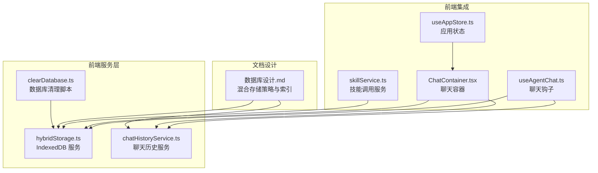
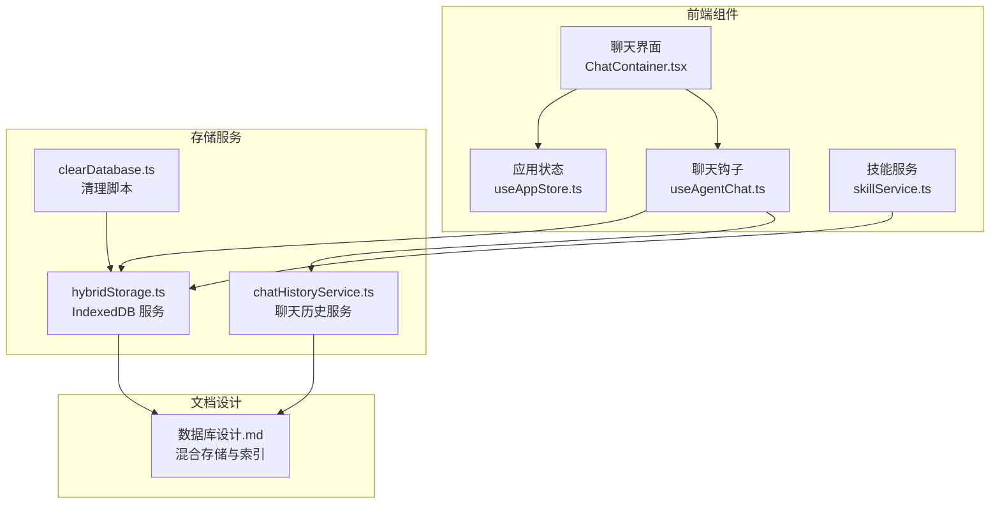
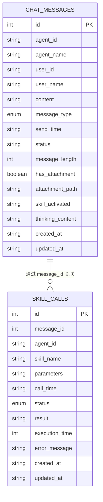
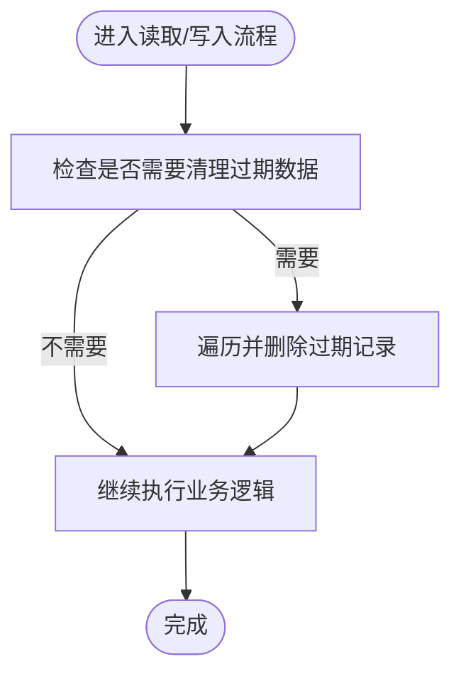
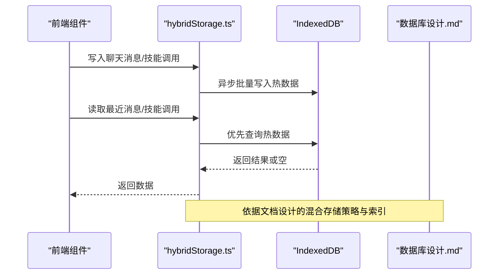
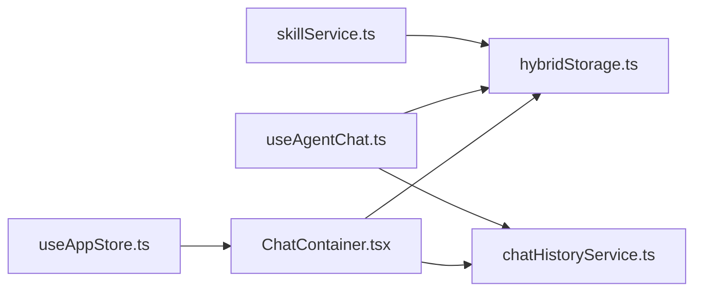

# 存储管理系统

<cite>
**本文引用的文件**   
- [hybridStorage.ts](file://src/services/hybridStorage.ts)
- [chatHistoryService.ts](file://src/services/chatHistoryService.ts)
- [clearDatabase.ts](file://src/scripts/clearDatabase.ts)
- [数据库设计.md](file://docs/数据层设计/数据库设计.md)
- [数据库安全验证报告.md](file://docs/数据层设计/数据库安全验证报告.md)
- [数据库设计与实现验证报告.md](file://docs/数据层设计/数据库设计与实现验证报告.md)
- [chat.ts](file://src/types/chat.ts)
- [useAgentChat.ts](file://src/hooks/useAgentChat.ts)
- [useAppStore.ts](file://src/store/useAppStore.ts)
- [ChatContainer.tsx](file://src/components/chat/ChatContainer.tsx)
- [skillService.ts](file://src/services/skillService.ts)
</cite>

## 目录
1. [简介](#简介)
2. [项目结构](#项目结构)
3. [核心组件](#核心组件)
4. [架构总览](#架构总览)
5. [详细组件分析](#详细组件分析)
6. [依赖分析](#依赖分析)
7. [性能考虑](#性能考虑)
8. [故障排查指南](#故障排查指南)
9. [结论](#结论)
10. [附录](#附录)

## 简介
本文件面向存储管理系统，围绕 IndexedDB 数据库的设计与实现展开，重点覆盖：
- 数据库架构与表结构、索引策略
- 聊天消息与技能调用的数据模型、字段定义、约束与关系映射
- 数据生命周期管理（过期清理、定期维护、垃圾回收）
- 混合存储策略（本地缓存、临时文件与持久化协调）
- 存储性能优化（批量操作、事务处理、并发控制）
- 数据备份与恢复机制及故障恢复策略

## 项目结构
存储系统主要由前端服务层与文档设计两部分组成：
- 前端服务层：基于 IndexedDB 的 hybridStorage.ts 与 chatHistoryService.ts 提供统一的 CRUD、索引查询与过期清理能力
- 文档设计：数据库设计.md 描述了 SQLite + IndexedDB 混合存储策略、索引设计、读写流程与后端接口
- 辅助脚本：clearDatabase.ts 提供一键清空数据库与清理标记的能力
- 前端集成：useAgentChat.ts、useAppStore.ts、ChatContainer.tsx、skillService.ts 等组件与服务共同驱动消息与技能调用的写入与展示

**图表来源**
- [hybridStorage.ts](file://src/services/hybridStorage.ts#L1-L262)
- [chatHistoryService.ts](file://src/services/chatHistoryService.ts#L1-L244)
- [clearDatabase.ts](file://src/scripts/clearDatabase.ts#L1-L41)
- [数据库设计.md](file://docs/数据层设计/数据库设计.md#L597-L738)
- [useAgentChat.ts](file://src/hooks/useAgentChat.ts#L1-L128)
- [useAppStore.ts](file://src/store/useAppStore.ts#L1-L306)
- [ChatContainer.tsx](file://src/components/chat/ChatContainer.tsx#L378-L428)
- [skillService.ts](file://src/services/skillService.ts#L1-L72)

**章节来源**
- [hybridStorage.ts](file://src/services/hybridStorage.ts#L1-L262)
- [chatHistoryService.ts](file://src/services/chatHistoryService.ts#L1-L244)
- [clearDatabase.ts](file://src/scripts/clearDatabase.ts#L1-L41)
- [数据库设计.md](file://docs/数据层设计/数据库设计.md#L597-L738)

## 核心组件
- IndexedDB 数据库与对象存储
  - 对象存储：chat_messages、skill_calls
  - 索引：chat_messages 上的 by-agent、by-send-time、by-agent-send-time、by-skill-activated；skill_calls 上的 by-message、by-call-time、by-agent
- 数据模型
  - ChatMessageRecord：聊天消息字段集合，含消息类型、发送时间、状态、长度、是否含附件、技能激活列表、思考内容等
  - SkillCallRecord：技能调用字段集合，含消息关联、调用时间、状态、执行耗时、错误信息等
- 生命周期管理
  - 过期清理：按 HOT_DATA_DAYS（3 天）清理过期数据
  - 定期维护：每日首次启动检查并清理
  - 垃圾回收：删除最后一条 AI 消息、按消息 ID 删除技能调用等
- 混合存储策略
  - 热数据（最近 3 天）：IndexedDB
  - 冷数据（历史）：SQLite（文档设计中描述，当前实现以 IndexedDB 为主）

**章节来源**
- [hybridStorage.ts](file://src/services/hybridStorage.ts#L39-L87)
- [hybridStorage.ts](file://src/services/hybridStorage.ts#L89-L127)
- [chatHistoryService.ts](file://src/services/chatHistoryService.ts#L37-L85)

## 架构总览
下图展示了前端服务层与文档设计之间的关系，以及与前端组件的集成路径。

**图表来源**
- [ChatContainer.tsx](file://src/components/chat/ChatContainer.tsx#L378-L428)
- [useAppStore.ts](file://src/store/useAppStore.ts#L1-L306)
- [useAgentChat.ts](file://src/hooks/useAgentChat.ts#L1-L128)
- [skillService.ts](file://src/services/skillService.ts#L1-L72)
- [hybridStorage.ts](file://src/services/hybridStorage.ts#L1-L262)
- [chatHistoryService.ts](file://src/services/chatHistoryService.ts#L1-L244)
- [clearDatabase.ts](file://src/scripts/clearDatabase.ts#L1-L41)
- [数据库设计.md](file://docs/数据层设计/数据库设计.md#L597-L738)

## 详细组件分析

### IndexedDB 数据库与对象存储
- 对象存储
  - chat_messages：键为自增整数，值为 ChatMessageRecord
  - skill_calls：键为自增整数，值为 SkillCallRecord
- 索引设计
  - chat_messages：by-agent、by-send-time、by-agent-send-time（复合）、by-skill-activated
  - skill_calls：by-message（数字）、by-call-time、by-agent
- 升级流程
  - 初始化时创建对象存储与索引；后续版本升级可在此处扩展

**图表来源**
- [hybridStorage.ts](file://src/services/hybridStorage.ts#L39-L87)
- [chatHistoryService.ts](file://src/services/chatHistoryService.ts#L37-L85)

**章节来源**
- [hybridStorage.ts](file://src/services/hybridStorage.ts#L39-L87)
- [chatHistoryService.ts](file://src/services/chatHistoryService.ts#L37-L85)

### 数据模型与字段定义
- ChatMessageRecord 字段要点
  - 标识与元数据：id、agent_id、agent_name、user_id、user_name、created_at、updated_at
  - 内容与状态：content、message_type（user/assistant/system）、status、message_length、has_attachment、attachment_path
  - 关联与上下文：skill_activated（逗号分隔）、thinking_content
  - 时间轴：send_time（用于排序与筛选）
- SkillCallRecord 字段要点
  - 关联：message_id（可选），agent_id
  - 行为：skill_name、parameters（JSON 字符串）
  - 时间与状态：call_time、status（pending/success/failed/timeout）
  - 结果与耗时：result、execution_time、error_message
- 约束与关系
  - 外键关系：skill_calls.message_id -> chat_messages.id
  - 索引支撑：按 agent_id、send_time、call_time 等字段高效查询

**章节来源**
- [hybridStorage.ts](file://src/services/hybridStorage.ts#L5-L37)
- [chatHistoryService.ts](file://src/services/chatHistoryService.ts#L3-L35)

### 数据生命周期管理
- 过期清理
  - 清理周期：每日首次启动检查
  - 清理策略：保留最近 HOT_DATA_DAYS（3 天）内的数据，其余删除
  - 触发点：saveChatMessage、getLast24HoursChatMessages、getSkillCalls 等读取前检查
- 定期维护
  - 通过 localStorage 标记 last-indexeddb-clean，避免重复清理
- 垃圾回收
  - 删除最后一条 AI 消息：deleteLastAiMessage
  - 按消息 ID 删除技能调用：deleteSkillCallByMessageId

**图表来源**
- [hybridStorage.ts](file://src/services/hybridStorage.ts#L89-L127)
- [hybridStorage.ts](file://src/services/hybridStorage.ts#L129-L184)
- [hybridStorage.ts](file://src/services/hybridStorage.ts#L202-L255)

**章节来源**
- [hybridStorage.ts](file://src/services/hybridStorage.ts#L89-L127)
- [hybridStorage.ts](file://src/services/hybridStorage.ts#L186-L200)
- [hybridStorage.ts](file://src/services/hybridStorage.ts#L246-L255)

### 混合存储策略实现
- 策略概览
  - 热数据（最近 3 天）：IndexedDB（快速读取）
  - 冷数据（历史）：SQLite（持久化）
- 读写流程
  - 写入：先写入 SQLite（主存储），再异步批量写入 IndexedDB（热缓存）
  - 读取：优先从 IndexedDB 读取，未命中则回退到 SQLite
- 索引设计（SQLite）
  - 聊天消息：agent_id + send_time 复合索引、user_id + send_time 复合索引、skill_activated + send_time 复合索引
  - 技能调用：message_id + call_time 复合索引、agent_id + status + call_time 复合索引
- 后端接口（SQLite）
  - /api/sync：同步数据到 SQLite
  - /api/messages/:agentId：按 agentId 和 days 查询消息

**图表来源**
- [hybridStorage.ts](file://src/services/hybridStorage.ts#L129-L184)
- [hybridStorage.ts](file://src/services/hybridStorage.ts#L202-L255)
- [数据库设计.md](file://docs/数据层设计/数据库设计.md#L615-L728)

**章节来源**
- [数据库设计.md](file://docs/数据层设计/数据库设计.md#L597-L738)
- [数据库设计.md](file://docs/数据层设计/数据库设计.md#L641-L666)
- [数据库设计.md](file://docs/数据层设计/数据库设计.md#L668-L728)

### 存储性能优化
- 批量操作
  - 写入：saveChatMessage/saveSkillCall 使用 add 异步写入，避免阻塞主线程
  - 读取：getAllFromIndex 利用索引减少扫描
- 事务处理
  - IndexedDB 本身支持事务（openDB 升级时创建对象存储与索引即为事务性操作）
  - 建议在批量写入时合并多个操作于单个事务中（当前实现为多次独立写入）
- 并发控制
  - 通过单一 dbPromise 管理数据库连接，避免并发冲突
  - 读取前统一触发过期清理，减少无效查询
- 索引优化
  - 为高频查询字段建立索引（by-agent、by-send-time、by-agent-send-time、by-skill-activated、by-call-time、by-agent）
  - 复合索引优化多条件查询（agent_id + send_time、message_id + call_time）

**章节来源**
- [hybridStorage.ts](file://src/services/hybridStorage.ts#L61-L87)
- [hybridStorage.ts](file://src/services/hybridStorage.ts#L165-L184)
- [hybridStorage.ts](file://src/services/hybridStorage.ts#L230-L244)

### 数据备份与恢复机制
- 备份
  - 文档设计中描述了数据库备份与文件备份的实现（见“数据库设计与实现验证报告.md”）
  - 当前前端实现以 IndexedDB 为主，可通过清理脚本清空数据库并重新初始化
- 恢复
  - 清理脚本 clearDatabase.ts 支持删除 IndexedDB 数据库并清除清理标记，便于重新初始化
- 故障恢复
  - 通过清理脚本与初始化流程，可在数据库异常时快速恢复
  - 建议在生产环境增加 SQLite 备份与恢复流程（文档设计已给出接口与索引建议）

**章节来源**
- [clearDatabase.ts](file://src/scripts/clearDatabase.ts#L1-L41)
- [数据库设计与实现验证报告.md](file://docs/数据层设计/数据库设计与实现验证报告.md#L105-L144)

## 依赖分析
- 组件耦合
  - ChatContainer.tsx 依赖 hybridStorage.ts 与 chatHistoryService.ts 进行消息与技能调用的读写
  - useAgentChat.ts 与 skillService.ts 通过服务层间接依赖 IndexedDB
  - useAppStore.ts 管理 UI 状态，与存储层通过服务层解耦
- 外部依赖
  - idb 库用于 IndexedDB 封装
  - axios 用于技能调用的后端通信（与存储层解耦）

**图表来源**
- [ChatContainer.tsx](file://src/components/chat/ChatContainer.tsx#L378-L428)
- [useAgentChat.ts](file://src/hooks/useAgentChat.ts#L1-L128)
- [skillService.ts](file://src/services/skillService.ts#L1-L72)
- [useAppStore.ts](file://src/store/useAppStore.ts#L1-L306)
- [hybridStorage.ts](file://src/services/hybridStorage.ts#L1-L262)
- [chatHistoryService.ts](file://src/services/chatHistoryService.ts#L1-L244)

**章节来源**
- [ChatContainer.tsx](file://src/components/chat/ChatContainer.tsx#L378-L428)
- [useAgentChat.ts](file://src/hooks/useAgentChat.ts#L1-L128)
- [skillService.ts](file://src/services/skillService.ts#L1-L72)
- [useAppStore.ts](file://src/store/useAppStore.ts#L1-L306)
- [hybridStorage.ts](file://src/services/hybridStorage.ts#L1-L262)
- [chatHistoryService.ts](file://src/services/chatHistoryService.ts#L1-L244)

## 性能考虑
- 查询性能
  - 利用索引：by-agent、by-send-time、by-agent-send-time、by-skill-activated、by-call-time、by-agent
  - 复合索引：agent_id + send_time、message_id + call_time
- 写入性能
  - 异步批量写入：saveChatMessage/saveSkillCall 采用异步写入，避免阻塞
  - 过期清理：每日首次启动清理，减少无效数据
- 维护建议
  - 定期执行 VACUUM 与 ANALYZE（SQLite 环境）
  - 限制单次查询返回数量，避免大结果集导致内存压力

[本节为通用性能指导，无需具体文件引用]

## 故障排查指南
- 数据库无法初始化
  - 检查 IndexedDB 是否可用，确认浏览器兼容性
  - 使用清理脚本清空数据库并重新初始化
- 数据未显示或过期被清理
  - 确认 HOT_DATA_DAYS 设置与当前日期计算
  - 检查 last-indexeddb-clean 标记是否正确更新
- 技能调用未关联消息
  - 确认 saveSkillCall 时传入正确的 message_id
  - 使用 deleteSkillCallByMessageId 清理残留调用记录
- 清理脚本使用
  - 在浏览器控制台执行 clearAllDatabase，清空 IndexedDB 与清理标记
  - 页面刷新后重新初始化数据库

**章节来源**
- [clearDatabase.ts](file://src/scripts/clearDatabase.ts#L1-L41)
- [hybridStorage.ts](file://src/services/hybridStorage.ts#L89-L127)
- [hybridStorage.ts](file://src/services/hybridStorage.ts#L246-L255)

## 结论
本存储系统以 IndexedDB 为核心，结合文档设计中的 SQLite + IndexedDB 混合存储策略，实现了热数据快速读取与历史数据持久化。通过完善的索引设计、过期清理与定期维护机制，系统在性能与可靠性之间取得平衡。建议在生产环境中进一步完善事务批处理、SQLite 备份恢复与安全控制，以满足更高可用性与合规性需求。

[本节为总结性内容，无需具体文件引用]

## 附录
- 相关接口与流程参考
  - 写入流程：消息与技能调用的保存与异步写入
  - 读取流程：优先 IndexedDB，未命中回退 SQLite
  - 清理流程：每日首次启动检查并清理过期数据

**章节来源**
- [hybridStorage.ts](file://src/services/hybridStorage.ts#L129-L184)
- [hybridStorage.ts](file://src/services/hybridStorage.ts#L202-L255)
- [数据库设计.md](file://docs/数据层设计/数据库设计.md#L615-L728)