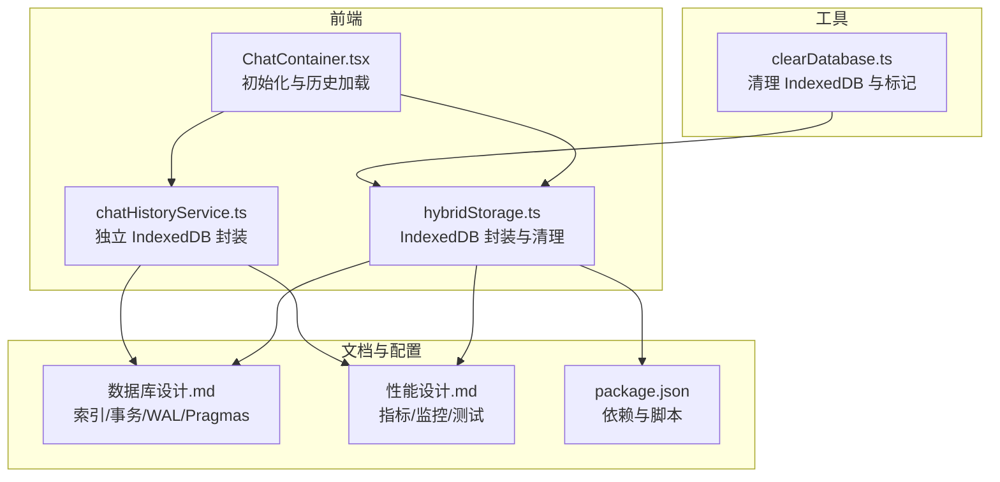
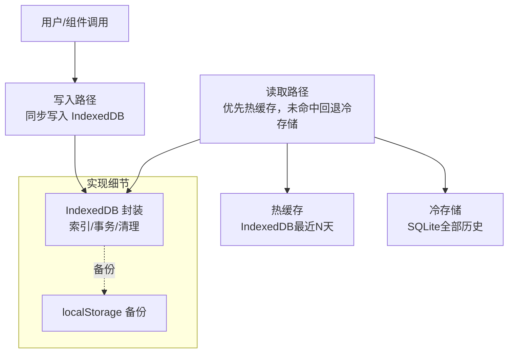
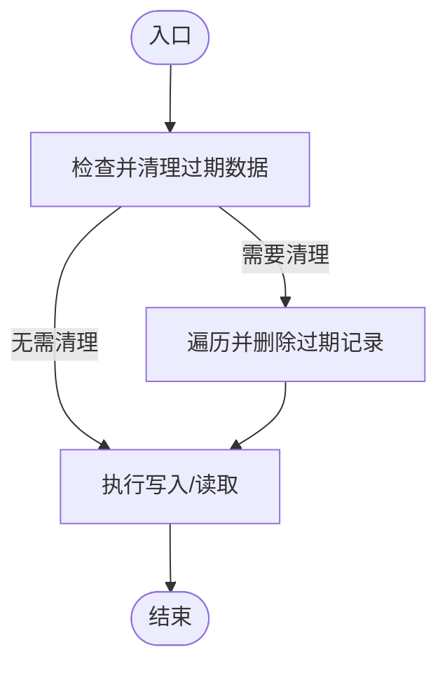
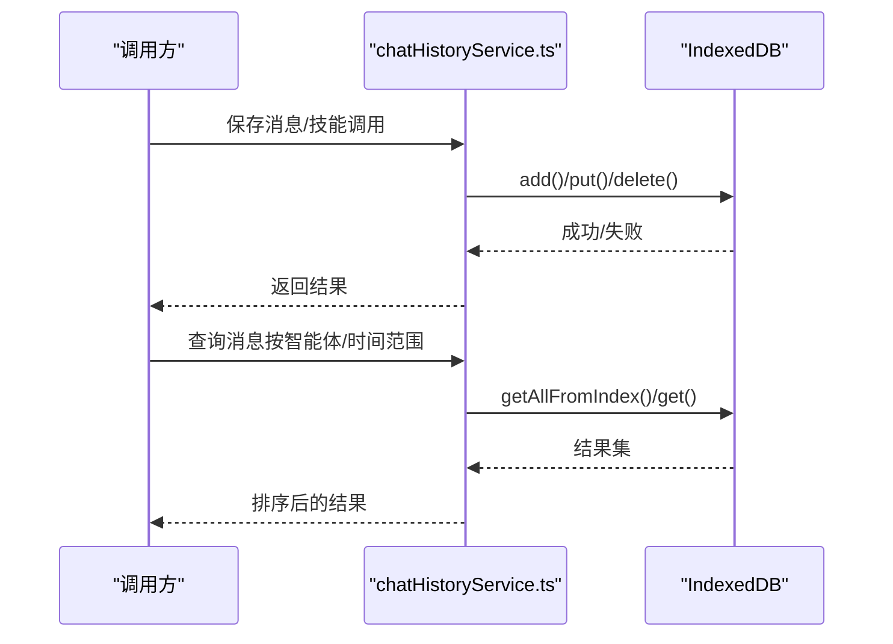
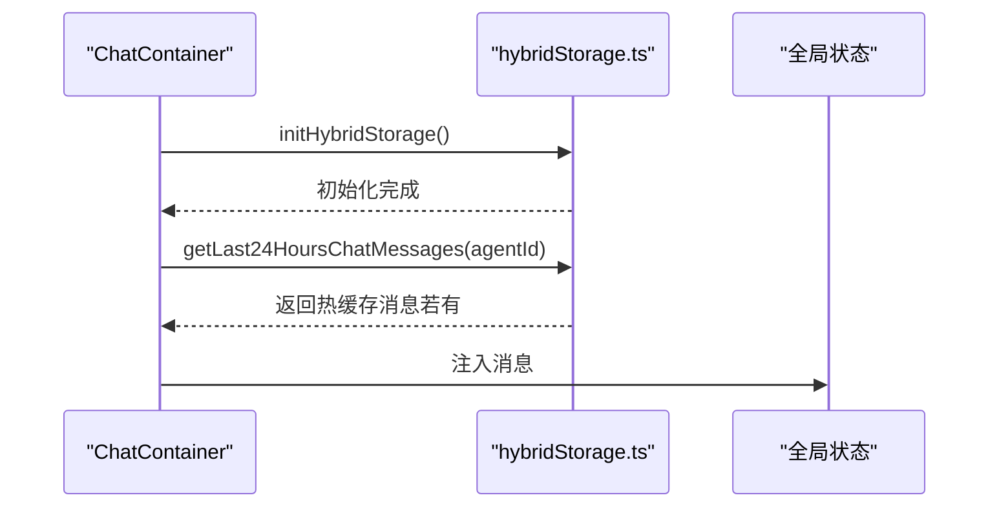
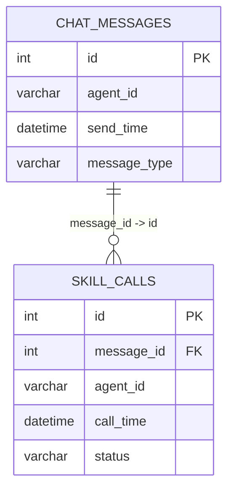
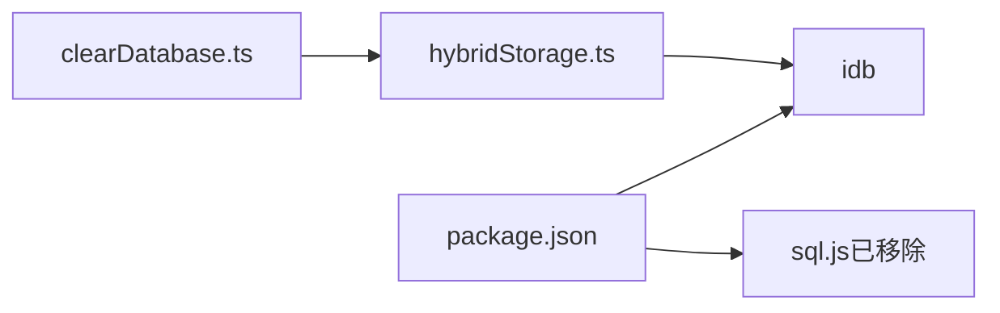

# 性能优化

<cite>
**本文引用的文件**   
- [hybridStorage.ts](file://src/services/hybridStorage.ts)
- [chatHistoryService.ts](file://src/services/chatHistoryService.ts)
- [ChatContainer.tsx](file://src/components/chat/ChatContainer.tsx)
- [clearDatabase.ts](file://src/scripts/clearDatabase.ts)
- [数据库设计.md](file://docs/数据层设计/数据库设计.md)
- [性能设计.md](file://docs/非功能设计/性能设计.md)
- [package.json](file://package.json)
- [修复sql.js加载错误计划.md](file://.trae/documents/修复sql.js加载错误计划.md)
</cite>

## 目录
1. [简介](#简介)
2. [项目结构](#项目结构)
3. [核心组件](#核心组件)
4. [架构总览](#架构总览)
5. [详细组件分析](#详细组件分析)
6. [依赖关系分析](#依赖关系分析)
7. [性能考量](#性能考量)
8. [故障排查指南](#故障排查指南)
9. [结论](#结论)
10. [附录](#附录)

## 简介
本文件聚焦于存储系统的性能优化，围绕前端 IndexedDB 的使用现状与优化策略展开，结合项目中的混合存储设计与现有实现，系统性地给出事务批处理、索引与查询优化、并发控制与队列管理、内存优化、缓存策略、性能监控与基准测试、以及容量限制与扩容策略的建议与落地方法。

## 项目结构
与存储性能相关的关键位置如下：
- 前端服务层：IndexedDB 访问封装与混合存储逻辑
- 前端组件层：聊天容器在初始化与历史加载阶段对存储的调用
- 文档层：数据库设计与性能设计文档，明确索引、事务、WAL 等优化手段
- 工具脚本：数据库清理脚本，辅助定位与恢复问题

**图表来源**
- [ChatContainer.tsx](file://src/components/chat/ChatContainer.tsx#L16-L28)
- [hybridStorage.ts](file://src/services/hybridStorage.ts#L63-L87)
- [chatHistoryService.ts](file://src/services/chatHistoryService.ts#L61-L85)
- [数据库设计.md](file://docs/数据层设计/数据库设计.md#L21-L37)
- [性能设计.md](file://docs/非功能设计/性能设计.md#L1-L292)
- [package.json](file://package.json#L15-L26)
- [clearDatabase.ts](file://src/scripts/clearDatabase.ts#L4-L34)

**章节来源**
- [ChatContainer.tsx](file://src/components/chat/ChatContainer.tsx#L16-L28)
- [hybridStorage.ts](file://src/services/hybridStorage.ts#L63-L87)
- [chatHistoryService.ts](file://src/services/chatHistoryService.ts#L61-L85)
- [数据库设计.md](file://docs/数据层设计/数据库设计.md#L21-L37)
- [性能设计.md](file://docs/非功能设计/性能设计.md#L1-L292)
- [package.json](file://package.json#L15-L26)
- [clearDatabase.ts](file://src/scripts/clearDatabase.ts#L4-L34)

## 核心组件
- IndexedDB 封装与混合存储：提供数据库打开、索引创建、过期数据清理、消息与技能调用的增删改查等能力，并在写入前进行过期清理。
- 历史记录服务：提供更通用的 IndexedDB 访问封装，支持按智能体与时间范围查询。
- 聊天容器：在组件挂载时初始化存储，加载最近 24 小时的历史消息。
- 数据库设计与性能文档：定义索引、事务、WAL、Pragmas 等优化手段，给出性能指标与监控方法。
- 工具脚本：一键清理 IndexedDB 与清理标记，便于问题排查与数据重置。

**章节来源**
- [hybridStorage.ts](file://src/services/hybridStorage.ts#L63-L87)
- [chatHistoryService.ts](file://src/services/chatHistoryService.ts#L61-L85)
- [ChatContainer.tsx](file://src/components/chat/ChatContainer.tsx#L16-L28)
- [数据库设计.md](file://docs/数据层设计/数据库设计.md#L268-L337)
- [性能设计.md](file://docs/非功能设计/性能设计.md#L1-L292)
- [clearDatabase.ts](file://src/scripts/clearDatabase.ts#L4-L34)

## 架构总览
前端采用“纯 IndexedDB”方案，替代原有的 sql.js + SQLite 模式，结合 localStorage 备份，形成热缓存（最近 N 天）与冷存储（全部历史）的混合架构。写入路径为同步写入 IndexedDB，读取优先走热缓存，未命中回退到冷存储。

**图表来源**
- [修复sql.js加载错误计划.md](file://.trae/documents/修复sql.js加载错误计划.md#L10-L21)
- [数据库设计.md](file://docs/数据层设计/数据库设计.md#L599-L640)

**章节来源**
- [修复sql.js加载错误计划.md](file://.trae/documents/修复sql.js加载错误计划.md#L10-L21)
- [数据库设计.md](file://docs/数据层设计/数据库设计.md#L599-L640)

## 详细组件分析

### IndexedDB 封装与混合存储（hybridStorage.ts）
- 数据库打开与升级：统一通过 openDB 初始化，创建消息与技能调用两个对象仓库，并建立多类索引以支撑高频查询。
- 过期数据清理：每日首次访问时清理超出热数据窗口（默认 3 天）的数据，降低热缓存体积，避免无限增长。
- 写入与读取：写入前触发过期清理，读取时优先返回热缓存内的数据，未命中再回退到冷存储（由后端接口提供）。
- 并发与队列：当前实现为单实例数据库 Promise，避免重复打开；未见显式队列管理，建议在批量写入场景引入队列与批处理。

**图表来源**
- [hybridStorage.ts](file://src/services/hybridStorage.ts#L89-L127)

**章节来源**
- [hybridStorage.ts](file://src/services/hybridStorage.ts#L63-L87)
- [hybridStorage.ts](file://src/services/hybridStorage.ts#L89-L127)
- [hybridStorage.ts](file://src/services/hybridStorage.ts#L129-L184)
- [hybridStorage.ts](file://src/services/hybridStorage.ts#L202-L244)

### 历史记录服务（chatHistoryService.ts）
- 独立的 IndexedDB 封装，提供消息与技能调用的 CRUD 能力，查询时基于索引过滤并排序。
- 与混合存储封装互补：前者更通用，后者强调热数据窗口与过期清理。

**图表来源**
- [chatHistoryService.ts](file://src/services/chatHistoryService.ts#L87-L120)
- [chatHistoryService.ts](file://src/services/chatHistoryService.ts#L210-L229)

**章节来源**
- [chatHistoryService.ts](file://src/services/chatHistoryService.ts#L61-L85)
- [chatHistoryService.ts](file://src/services/chatHistoryService.ts#L87-L120)
- [chatHistoryService.ts](file://src/services/chatHistoryService.ts#L210-L229)

### 聊天容器（ChatContainer.tsx）
- 组件挂载时异步初始化存储，随后加载最近 24 小时的历史消息并注入到全局状态。
- 体现“热缓存优先”的读取策略：若热缓存命中则直接使用，未命中再回退到后端接口。

**图表来源**
- [ChatContainer.tsx](file://src/components/chat/ChatContainer.tsx#L16-L28)
- [ChatContainer.tsx](file://src/components/chat/ChatContainer.tsx#L79-L103)
- [hybridStorage.ts](file://src/services/hybridStorage.ts#L165-L184)

**章节来源**
- [ChatContainer.tsx](file://src/components/chat/ChatContainer.tsx#L16-L28)
- [ChatContainer.tsx](file://src/components/chat/ChatContainer.tsx#L79-L103)
- [hybridStorage.ts](file://src/services/hybridStorage.ts#L165-L184)

### 数据库设计与优化要点（数据库设计.md）
- 索引设计：针对聊天消息与技能调用表建立复合索引，覆盖时间范围查询与关联查询，显著提升查询效率。
- 事务与 WAL：启用 WAL 模式与合适的 PRAGMAs，提升并发与写入吞吐。
- 混合存储：热缓存（IndexedDB）+ 冷存储（SQLite），读取优先热缓存，未命中回退冷存储。

**图表来源**
- [数据库设计.md](file://docs/数据层设计/数据库设计.md#L41-L165)

**章节来源**
- [数据库设计.md](file://docs/数据层设计/数据库设计.md#L268-L337)
- [数据库设计.md](file://docs/数据层设计/数据库设计.md#L380-L449)
- [数据库设计.md](file://docs/数据层设计/数据库设计.md#L599-L640)

### 性能设计与监控（性能设计.md）
- 性能指标：应用启动时间、界面响应时间、消息发送延迟、数据库查询/写入/批量操作响应时间等。
- 监控与测试：前端使用 Performance API、Lighthouse、DevTools；后端使用 cProfile、Py-Spy、Memory Profiler；测试方法包括 Lighthouse、WebPageTest、Locust、Apache Bench、JMeter。
- 优化方案：虚拟滚动、React.memo/useMemo/useCallback、代码分割、分页加载、缓存策略、索引优化、查询优化、连接池等。

**章节来源**
- [性能设计.md](file://docs/非功能设计/性能设计.md#L1-L292)

## 依赖关系分析
- 前端依赖：idb 为 IndexedDB 的现代化封装；sql.js 曾用于 sql.js + SQLite 方案，现已移除。
- 脚本与工具：package.json 中的脚本与清理脚本配合使用，便于开发与排障。

**图表来源**
- [package.json](file://package.json#L15-L26)
- [clearDatabase.ts](file://src/scripts/clearDatabase.ts#L4-L34)
- [hybridStorage.ts](file://src/services/hybridStorage.ts#L1-L1)

**章节来源**
- [package.json](file://package.json#L15-L26)
- [clearDatabase.ts](file://src/scripts/clearDatabase.ts#L4-L34)
- [hybridStorage.ts](file://src/services/hybridStorage.ts#L1-L1)

## 性能考量

### 事务批处理与并发控制
- 现状：当前实现未显式使用事务；写入为单条 add/put，读取为索引查询。
- 建议：
  - 批量写入：将多次写入合并为一次事务，减少事务开销与锁竞争。
  - 并发控制：使用队列管理写入请求，避免同时发起大量事务导致阻塞；对只读查询尽量使用快照读或共享事务。
  - 事务粒度：将相关联的多表写入放入同一事务，保证一致性。

**章节来源**
- [数据库设计.md](file://docs/数据层设计/数据库设计.md#L380-L449)

### 索引使用与查询优化
- 现状：已建立多类索引，覆盖 by-agent、by-send-time、by-agent-send-time、by-skill-activated、by-message、by-call-time、by-agent 等。
- 建议：
  - 避免在索引列上使用函数，确保查询条件能命中索引。
  - 对时间范围查询使用复合索引（如 agent_id + send_time），减少排序成本。
  - 控制返回字段数量，避免 SELECT *。

**章节来源**
- [数据库设计.md](file://docs/数据层设计/数据库设计.md#L268-L337)
- [数据库设计.md](file://docs/数据层设计/数据库设计.md#L452-L471)

### 异步操作的并发控制与队列管理
- 现状：未见显式队列实现；写入在调用处直接发起。
- 建议：
  - 引入写入队列：将写入请求入队，按批次提交；对同一批次内的相关写入进行排序，减少冲突。
  - 读取优化：对高频查询（最近 N 天）使用内存缓存，结合失效策略与懒加载。
  - 并发读写：对只读查询使用快照读，写入事务化，避免长时间持有锁。

**章节来源**
- [hybridStorage.ts](file://src/services/hybridStorage.ts#L129-L184)
- [chatHistoryService.ts](file://src/services/chatHistoryService.ts#L210-L229)

### 内存使用优化与大对象处理
- 现状：消息内容为字符串，未见大对象拆分或流式处理。
- 建议：
  - 大文本/附件：采用分块读取与惰性加载，避免一次性占用过多内存。
  - 对象池：对频繁创建/销毁的 DOM/消息节点使用对象池。
  - 垃圾回收：避免强引用循环，及时释放事件监听与定时器；谨慎触发强制 GC。
  - 本地缓存：合理设置 localStorage 的容量阈值，避免溢出。

**章节来源**
- [性能设计.md](file://docs/非功能设计/性能设计.md#L136-L153)

### 缓存策略设计与实现
- 现状：热缓存（IndexedDB 最近 N 天）+ 冷存储（SQLite 全部历史）；localStorage 备份。
- 建议：
  - 热点数据：基于时间窗口与访问频率，对近期高频消息与技能调用进行优先缓存。
  - 预加载：在页面进入或用户即将操作前，预取最近 N 条记录，缩短首屏加载时间。
  - 失效策略：基于 LRU/LFU 或 TTL 的淘汰算法，结合用户行为动态调整缓存大小。

**章节来源**
- [数据库设计.md](file://docs/数据层设计/数据库设计.md#L599-L640)
- [性能设计.md](file://docs/非功能设计/性能设计.md#L104-L115)

### 性能监控指标与基准测试
- 指标：应用启动时间、界面响应时间、消息发送延迟、数据库查询/写入/批量操作响应时间、聊天记录加载时间（100条）。
- 方法：前端使用 Lighthouse、DevTools、Performance API；后端使用 Locust、Apache Bench、JMeter。
- 建议：在 CI 中集成基准测试，对关键路径（写入、查询、批量导入）设定阈值告警。

**章节来源**
- [性能设计.md](file://docs/非功能设计/性能设计.md#L1-L292)

### 存储容量限制与扩容策略
- 现状：热缓存按天数限制（默认 3 天），通过每日清理控制容量。
- 建议：
  - 容量上限：为热缓存设置最大条目数与最大字节数，超过阈值触发清理。
  - 扩容策略：根据业务增长趋势，动态调整热数据窗口与索引策略；对冷存储定期归档与压缩。
  - 备份与迁移：localStorage 备份用于快速恢复，冷存储用于长期保留与迁移。

**章节来源**
- [hybridStorage.ts](file://src/services/hybridStorage.ts#L89-L127)
- [clearDatabase.ts](file://src/scripts/clearDatabase.ts#L4-L34)

## 故障排查指南
- 初始化失败：确认数据库打开与索引创建流程是否成功，检查浏览器对 IndexedDB 的支持与权限。
- 历史记录为空：检查热缓存是否命中，未命中时确认冷存储接口可用；核对时间范围与索引使用。
- 数据异常：使用清理脚本重置热缓存与标记，验证数据一致性；检查过期清理逻辑是否按预期执行。
- 性能异常：使用性能分析工具定位瓶颈，结合索引与查询计划优化；评估是否需要引入队列与批处理。

**章节来源**
- [ChatContainer.tsx](file://src/components/chat/ChatContainer.tsx#L79-L103)
- [hybridStorage.ts](file://src/services/hybridStorage.ts#L89-L127)
- [clearDatabase.ts](file://src/scripts/clearDatabase.ts#L4-L34)

## 结论
本项目已采用“纯 IndexedDB + localStorage 备份”的混合存储方案，具备良好的热缓存与冷存储分离能力。为进一步提升性能，建议在事务批处理、并发队列、索引与查询优化、内存与大对象处理、缓存策略与容量管理等方面进行系统性优化，并配套完善的性能监控与基准测试体系，持续迭代以满足业务增长需求。

## 附录
- 相关实现路径参考：
  - [数据库打开与索引创建](file://src/services/hybridStorage.ts#L63-L87)
  - [过期数据清理](file://src/services/hybridStorage.ts#L89-L127)
  - [消息保存与读取](file://src/services/hybridStorage.ts#L129-L184)
  - [技能调用保存与读取](file://src/services/hybridStorage.ts#L202-L244)
  - [聊天容器初始化与历史加载](file://src/components/chat/ChatContainer.tsx#L16-L28)
  - [聊天记录查询（独立服务）](file://src/services/chatHistoryService.ts#L210-L229)
  - [数据库索引与事务设计](file://docs/数据层设计/数据库设计.md#L268-L337)
  - [性能指标与监控方法](file://docs/非功能设计/性能设计.md#L1-L292)
  - [清理脚本](file://src/scripts/clearDatabase.ts#L4-L34)
  - [依赖与脚本](file://package.json#L15-L26)