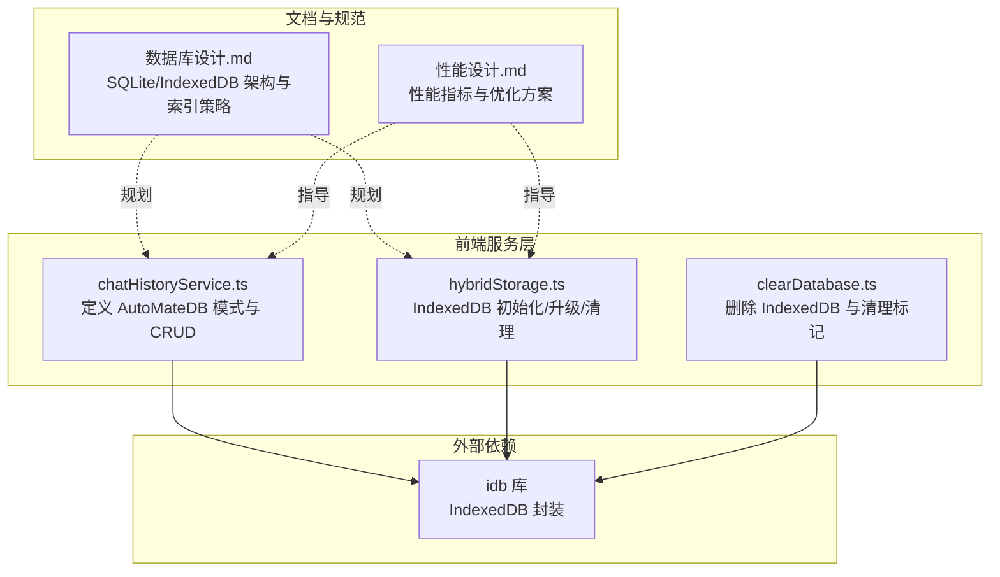
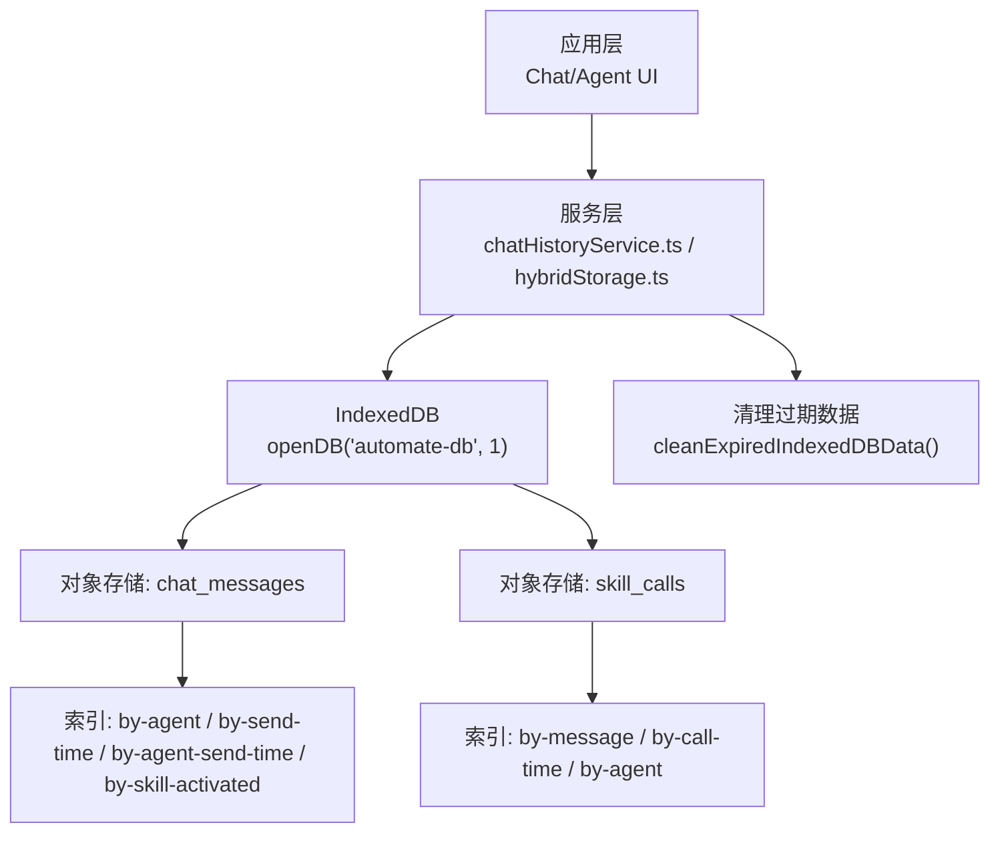
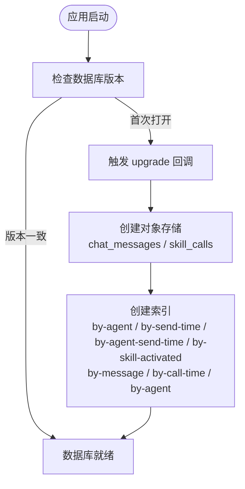
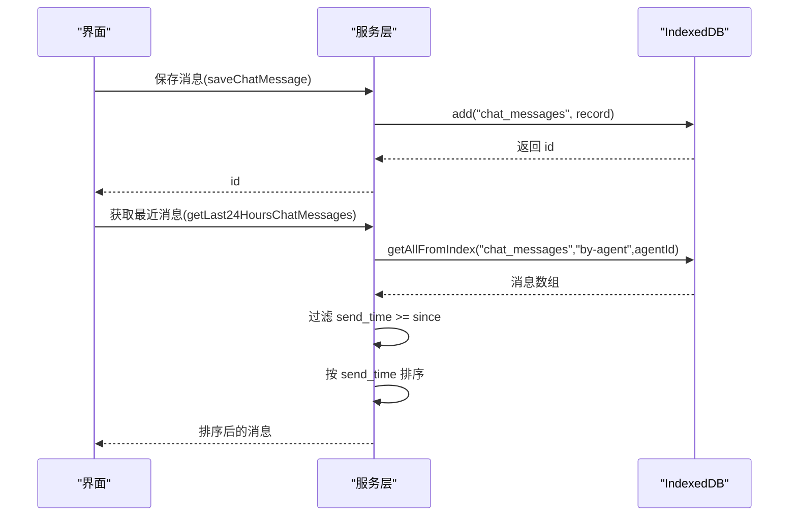
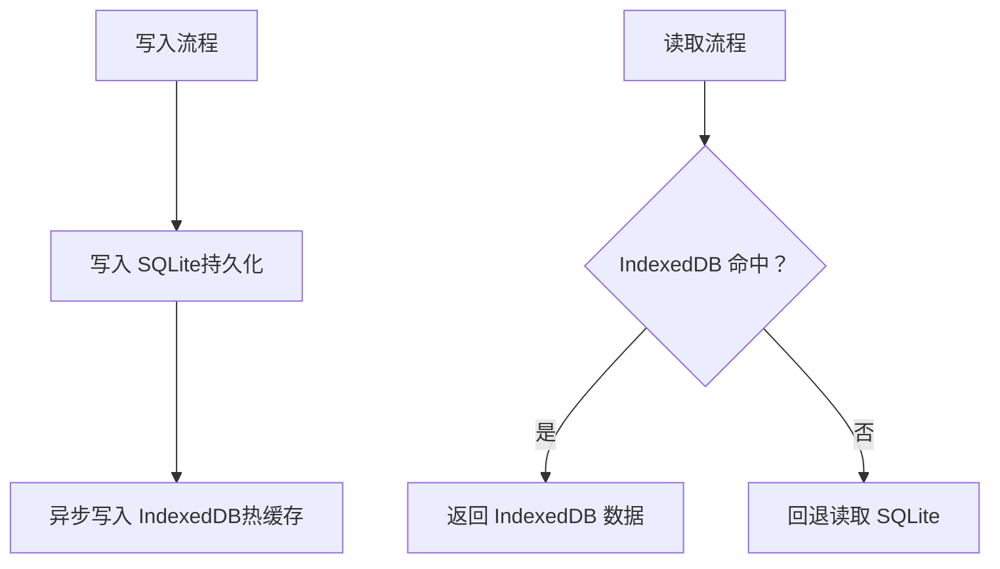
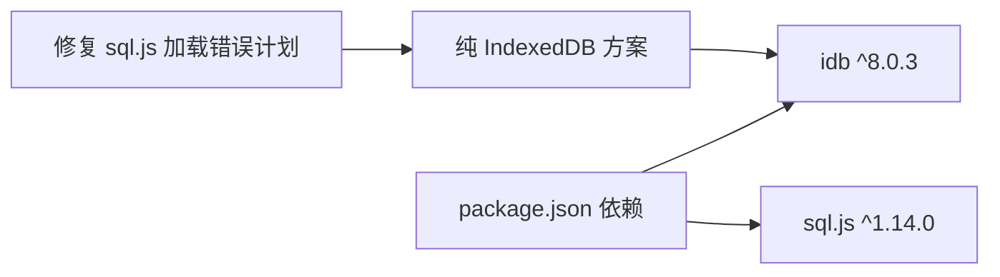

# 数据库设计

<cite>
**本文引用的文件**
- [数据库设计.md](file://docs/数据层设计/数据库设计.md)
- [chatHistoryService.ts](file://src/services/chatHistoryService.ts)
- [hybridStorage.ts](file://src/services/hybridStorage.ts)
- [clearDatabase.ts](file://src/scripts/clearDatabase.ts)
- [性能设计.md](file://docs/非功能设计/性能设计.md)
- [package.json](file://package.json)
</cite>

## 目录
1. [简介](#简介)
2. [项目结构](#项目结构)
3. [核心组件](#核心组件)
4. [架构总览](#架构总览)
5. [详细组件分析](#详细组件分析)
6. [依赖分析](#依赖分析)
7. [性能考量](#性能考量)
8. [故障排查指南](#故障排查指南)
9. [结论](#结论)
10. [附录](#附录)

## 简介
本文件面向数据库设计与实现，聚焦于 IndexedDB 数据库的整体架构、版本管理、对象存储结构与索引策略，并结合项目中的 AutoMateDB 接口定义，系统阐述 chat_messages 与 skill_calls 两大核心对象存储的设计理念与使用方式。同时，文档覆盖数据库升级机制与向后兼容性保障、查询优化与索引策略、以及混合存储（SQLite + IndexedDB）下的性能优化建议与最佳实践。

## 项目结构
本项目在前端侧采用 IndexedDB 作为主要的本地存储介质，并通过 TypeScript 类型定义 AutoMateDB 的数据库模式。核心文件分布如下：
- 数据库模式与服务：src/services/chatHistoryService.ts、src/services/hybridStorage.ts
- 数据库设计文档：docs/数据层设计/数据库设计.md
- 数据库清理脚本：src/scripts/clearDatabase.ts
- 性能设计文档：docs/非功能设计/性能设计.md
- 依赖声明：package.json（包含 idb）

图表来源
- [chatHistoryService.ts](file://src/services/chatHistoryService.ts#L1-L244)
- [hybridStorage.ts](file://src/services/hybridStorage.ts#L1-L262)
- [clearDatabase.ts](file://src/scripts/clearDatabase.ts#L1-L41)
- [数据库设计.md](file://docs/数据层设计/数据库设计.md#L1-L738)
- [性能设计.md](file://docs/非功能设计/性能设计.md#L1-L292)
- [package.json](file://package.json#L15-L26)

章节来源
- [chatHistoryService.ts](file://src/services/chatHistoryService.ts#L1-L244)
- [hybridStorage.ts](file://src/services/hybridStorage.ts#L1-L262)
- [clearDatabase.ts](file://src/scripts/clearDatabase.ts#L1-L41)
- [数据库设计.md](file://docs/数据层设计/数据库设计.md#L1-L738)
- [性能设计.md](file://docs/非功能设计/性能设计.md#L1-L292)
- [package.json](file://package.json#L15-L26)

## 核心组件
- AutoMateDB 数据库模式：通过 DBSchema 接口定义两个对象存储（chat_messages、skill_calls），并声明各索引键名与类型。
- IndexedDB 初始化与升级：通过 openDB 指定数据库名与版本号，首次打开或版本变更时触发 upgrade 回调，创建对象存储与索引。
- CRUD 与查询封装：提供保存、更新、删除、按索引查询等方法，统一处理时间字段与复合索引的使用。
- 混合存储策略：在前端侧以 IndexedDB 作为热缓存（近 N 天），并提供过期清理逻辑；同时文档中规划了 SQLite 作为冷存储的混合架构。

章节来源
- [chatHistoryService.ts](file://src/services/chatHistoryService.ts#L37-L85)
- [hybridStorage.ts](file://src/services/hybridStorage.ts#L39-L87)

## 架构总览
下图展示 AutoMateDB 的整体架构：前端通过 idb 库访问 IndexedDB，数据库版本由 openDB 的版本号控制；对象存储与索引在 upgrade 中创建；服务层封装 CRUD 与查询逻辑。

图表来源
- [chatHistoryService.ts](file://src/services/chatHistoryService.ts#L63-L85)
- [hybridStorage.ts](file://src/services/hybridStorage.ts#L63-L87)
- [hybridStorage.ts](file://src/services/hybridStorage.ts#L89-L115)

## 详细组件分析

### AutoMateDB 接口定义与对象存储
- chat_messages 对象存储
  - 键路径：id（自增）
  - 索引：
    - by-agent：agent_id
    - by-send-time：send_time
    - by-agent-send-time：[agent_id, send_time]（复合索引）
    - by-skill-activated：skill_activated
- skill_calls 对象存储
  - 键路径：id（自增）
  - 索引：
    - by-message：message_id
    - by-call-time：call_time
    - by-agent：agent_id

设计理念
- 以“按智能体维度”和“按时间维度”的查询需求为核心，分别建立单字段与复合索引，提升检索效率。
- 复合索引 by-agent-send-time 与 by-agent-call-time 能够高效支持“某智能体在某时间段内的消息/调用”查询。
- by-skill-activated 用于追踪消息是否触发了技能调用，便于统计与审计。

章节来源
- [chatHistoryService.ts](file://src/services/chatHistoryService.ts#L37-L57)
- [chatHistoryService.ts](file://src/services/chatHistoryService.ts#L63-L85)

### 数据库版本管理与升级机制
- 版本号：openDB 第二个参数为版本号（当前为 1）。
- 升级入口：upgrade 回调在首次打开或版本号变化时触发。
- 升级内容：创建对象存储 chat_messages 与 skill_calls，并为其创建所需索引。
- 向后兼容性：
  - 通过版本号递增与条件性创建索引，避免重复执行导致的错误。
  - 保持键路径与索引命名稳定，新增字段通过后续版本迭代补充。

图表来源
- [chatHistoryService.ts](file://src/services/chatHistoryService.ts#L63-L85)
- [hybridStorage.ts](file://src/services/hybridStorage.ts#L63-L87)

章节来源
- [chatHistoryService.ts](file://src/services/chatHistoryService.ts#L63-L85)
- [hybridStorage.ts](file://src/services/hybridStorage.ts#L63-L87)

### 索引设计策略与查询优化
- 单字段索引
  - by-agent：按智能体过滤消息/调用
  - by-send-time / by-call-time：按时间排序与范围查询
  - by-skill-activated：按技能激活状态过滤
  - by-message：按消息 ID 过滤技能调用
- 复合索引
  - by-agent-send-time：支持“某智能体在某时间范围内”的高效查询
  - by-agent-call-time：支持“某智能体技能调用随时间”的高效查询
- 查询优化建议
  - 优先使用索引键进行过滤与排序，避免在索引列上使用函数
  - 使用范围查询时尽量限定时间窗口，配合复合索引
  - 对高频查询（如按 agent_id + send_time）优先使用复合索引

章节来源
- [chatHistoryService.ts](file://src/services/chatHistoryService.ts#L37-L57)
- [数据库设计.md](file://docs/数据层设计/数据库设计.md#L266-L337)

### CRUD 与查询流程
- 保存消息/技能调用：构造记录对象，调用 add，返回自增 id
- 更新记录：先 get 再 put，统一更新 updated_at
- 删除记录：delete(id)，或按索引批量删除（如按 message_id 删除技能调用）
- 查询记录：
  - getAllFromIndex：按索引获取集合
  - 过滤与排序：在内存中按 send_time 或 call_time 排序

图表来源
- [chatHistoryService.ts](file://src/services/chatHistoryService.ts#L87-L120)
- [chatHistoryService.ts](file://src/services/chatHistoryService.ts#L239-L243)

章节来源
- [chatHistoryService.ts](file://src/services/chatHistoryService.ts#L87-L243)

### 混合存储（SQLite + IndexedDB）与过期清理
- 策略概览
  - SQLite：冷数据（全部历史），持久化存储
  - IndexedDB：热缓存（近 N 天），快速读取
- 过期清理
  - 定义常量 HOT_DATA_DAYS 控制保留天数
  - cleanExpiredIndexedDBData：遍历对象存储，删除早于截止日期的记录
  - checkAndCleanExpiredData：基于 localStorage 标记按日清理，避免重复执行
- 读写流程
  - 写入：先写 SQLite（持久化），再异步写 IndexedDB（热缓存）
  - 读取：优先从 IndexedDB 读取，未命中回退到 SQLite

图表来源
- [数据库设计.md](file://docs/数据层设计/数据库设计.md#L615-L639)
- [hybridStorage.ts](file://src/services/hybridStorage.ts#L89-L127)

章节来源
- [数据库设计.md](file://docs/数据层设计/数据库设计.md#L597-L680)
- [hybridStorage.ts](file://src/services/hybridStorage.ts#L3-L127)

### 数据库清理与重置
- 清理脚本：删除 IndexedDB 数据库 automate-db，并清理本地清理标记
- 适用场景：开发调试、重置本地数据、迁移测试

章节来源
- [clearDatabase.ts](file://src/scripts/clearDatabase.ts#L4-L34)

## 依赖分析
- idb：IndexedDB 的现代封装库，提供 openDB、IDBPDatabase 等类型与 API
- sql.js：项目中存在依赖声明，但根据修复计划文档，已转向纯 IndexedDB 方案

图表来源
- [package.json](file://package.json#L15-L26)
- [.trae 文档/修复 sql.js 加载错误计划.md](file://.trae/documents/修复sql.js加载错误计划.md#L1-L34)

章节来源
- [package.json](file://package.json#L15-L26)
- [.trae 文档/修复 sql.js 加载错误计划.md](file://.trae/documents/修复sql.js加载错误计划.md#L1-L34)

## 性能考量
- 索引使用策略
  - 为高频过滤与排序字段建立单字段索引（agent_id、send_time、call_time 等）
  - 为多条件查询建立复合索引（agent_id+send_time、agent_id+call_time 等）
- 查询最佳实践
  - 避免在索引列上使用函数或表达式
  - 使用范围查询时限定时间窗口，减少扫描
  - 对大数据量的列表使用分页或虚拟滚动（前端层面）
- 混合存储性能
  - 热缓存保留最近 N 天数据，显著降低查询延迟
  - 定期清理过期数据，避免索引膨胀与查询变慢
- 指标参考
  - 数据库查询响应时间 < 100ms，写入响应时间 < 50ms，批量操作 < 500ms

章节来源
- [性能设计.md](file://docs/非功能设计/性能设计.md#L31-L47)
- [数据库设计.md](file://docs/数据层设计/数据库设计.md#L450-L496)

## 故障排查指南
- 数据库无法打开或版本异常
  - 检查 openDB 的版本号是否与预期一致
  - 确认 upgrade 回调中对象存储与索引创建逻辑未被重复执行
- 查询性能差
  - 确认查询条件是否命中索引（尤其是复合索引）
  - 使用范围查询时限定时间窗口
- 热数据过多导致性能下降
  - 检查 HOT_DATA_DAYS 设置是否合理
  - 触发清理逻辑，确认 localStorage 清理标记按日更新
- 清理无效
  - 手动执行清理脚本，确认 IndexedDB 数据库被删除
  - 检查浏览器控制台输出与错误日志

章节来源
- [hybridStorage.ts](file://src/services/hybridStorage.ts#L89-L127)
- [clearDatabase.ts](file://src/scripts/clearDatabase.ts#L4-L34)

## 结论
AutoMateDB 采用 IndexedDB 作为前端本地存储核心，通过明确的对象存储与索引设计，满足按智能体与时间维度的高频查询需求。结合混合存储策略与定期清理机制，既能保证性能，又能维持数据一致性与可维护性。未来可在版本演进中持续优化索引覆盖与查询路径，进一步提升大规模数据场景下的稳定性与性能。

## 附录
- 相关文件路径与职责
  - src/services/chatHistoryService.ts：定义 AutoMateDB 模式、CRUD 与查询
  - src/services/hybridStorage.ts：IndexedDB 初始化、升级、过期清理与混合存储辅助
  - src/scripts/clearDatabase.ts：清理 IndexedDB 与本地标记
  - docs/数据层设计/数据库设计.md：数据库总体设计与混合存储策略
  - docs/非功能设计/性能设计.md：性能指标与优化方案
  - package.json：依赖声明（idb、sql.js 等）