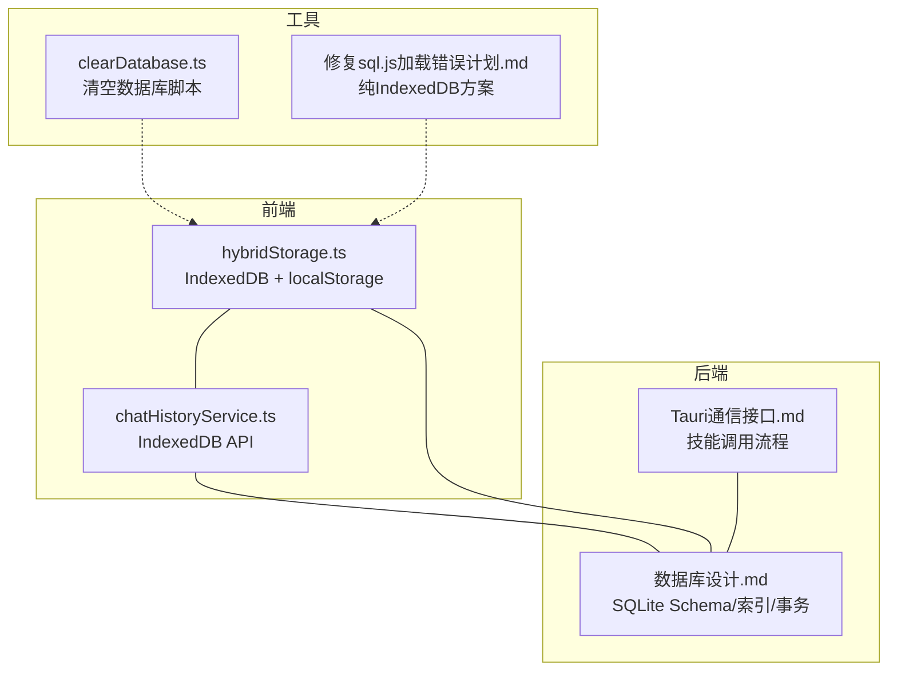
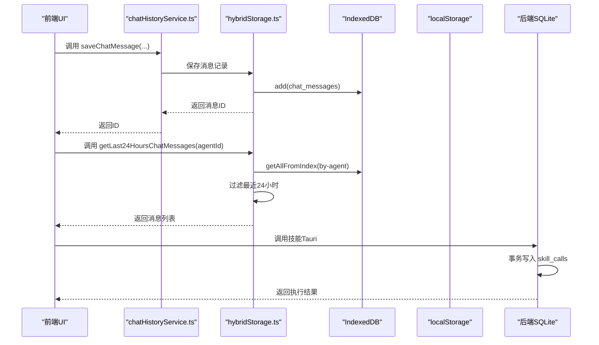
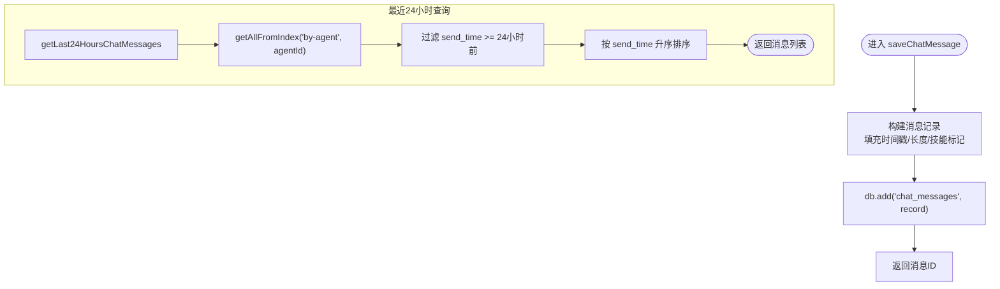
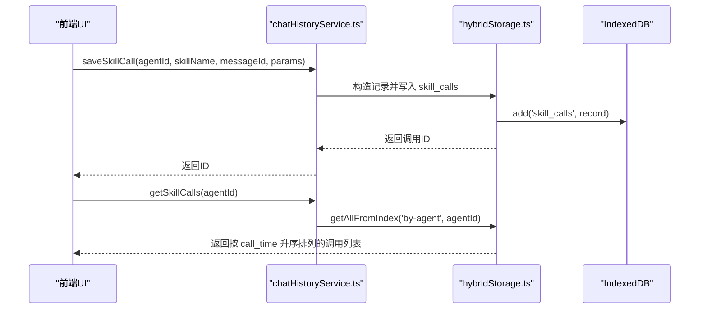
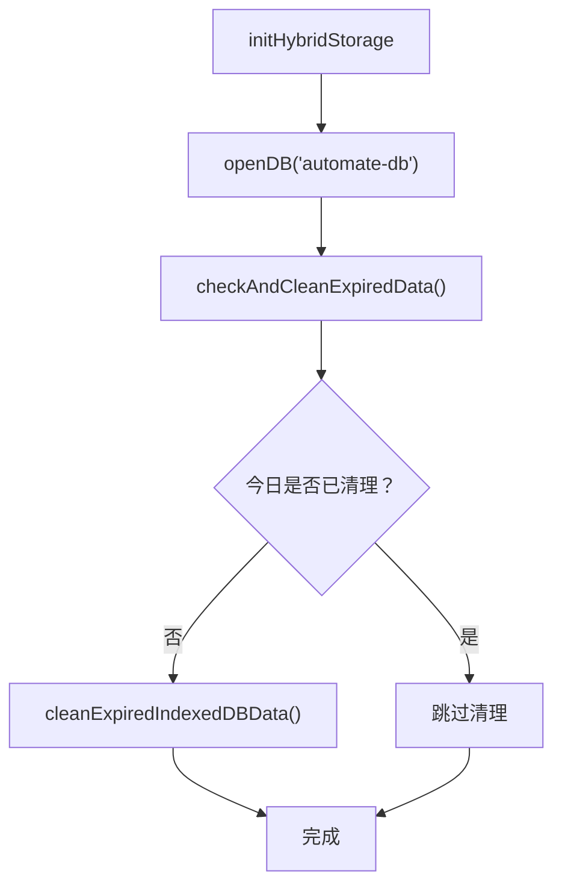
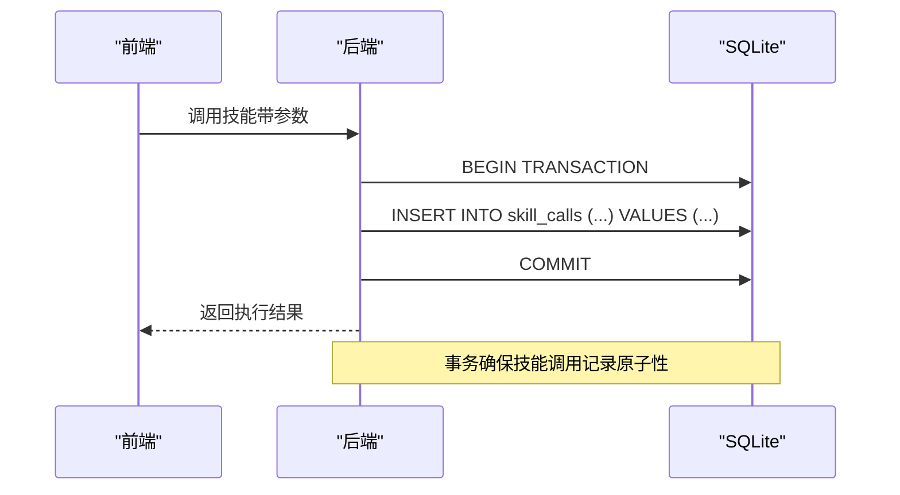
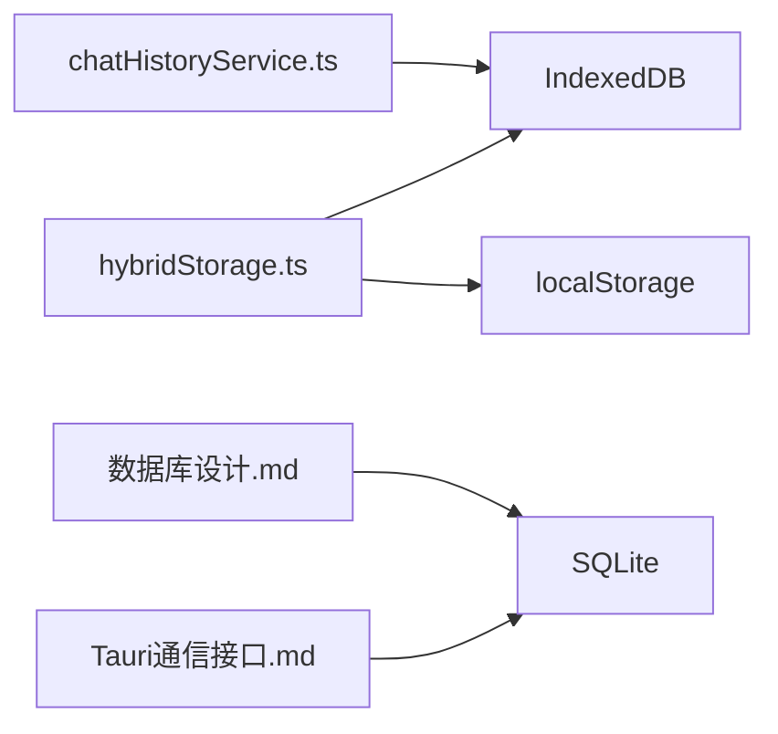

# 数据操作

<cite>
**本文引用的文件**
- [chatHistoryService.ts](file://src/services/chatHistoryService.ts)
- [hybridStorage.ts](file://src/services/hybridStorage.ts)
- [数据库设计.md](file://docs/数据层设计/数据库设计.md)
- [数据库设计与实现验证报告.md](file://docs/数据层设计/数据库设计与实现验证报告.md)
- [Tauri通信接口.md](file://docs/接口层设计/Tauri通信接口.md)
- [clearDatabase.ts](file://src/scripts/clearDatabase.ts)
- [修复sql.js加载错误计划.md](file://.trae/documents/修复sql.js加载错误计划.md)
</cite>

## 目录
1. [简介](#简介)
2. [项目结构](#项目结构)
3. [核心组件](#核心组件)
4. [架构总览](#架构总览)
5. [详细组件分析](#详细组件分析)
6. [依赖关系分析](#依赖关系分析)
7. [性能考量](#性能考量)
8. [故障排查指南](#故障排查指南)
9. [结论](#结论)
10. [附录](#附录)

## 简介
本文件聚焦于AutoMate项目中的数据操作实现，围绕聊天消息与技能调用两大核心实体，系统梳理其增删改查（CRUD）操作、批量与事务处理、数据一致性保障与错误处理策略，并给出性能优化建议与最佳实践，帮助开发者高效、稳定地维护数据层。

## 项目结构
数据层主要由两套实现构成：
- 前端混合存储（IndexedDB + localStorage 备份）
- 后端（Node.js）SQLite（通过better-sqlite3或原生sqlite3）

图表来源
- [hybridStorage.ts](file://src/services/hybridStorage.ts#L1-L262)
- [chatHistoryService.ts](file://src/services/chatHistoryService.ts#L1-L244)
- [数据库设计.md](file://docs/数据层设计/数据库设计.md#L1-L738)
- [Tauri通信接口.md](file://docs/接口层设计/Tauri通信接口.md#L354-L446)
- [clearDatabase.ts](file://src/scripts/clearDatabase.ts#L1-L41)
- [修复sql.js加载错误计划.md](file://.trae/documents/修复sql.js加载错误计划.md#L1-L34)

章节来源
- [hybridStorage.ts](file://src/services/hybridStorage.ts#L1-L262)
- [chatHistoryService.ts](file://src/services/chatHistoryService.ts#L1-L244)
- [数据库设计.md](file://docs/数据层设计/数据库设计.md#L1-L738)

## 核心组件
- IndexedDB 数据模型与索引
  - 聊天消息表：chat_messages
  - 技能调用表：skill_calls
  - 索引：by-agent、by-send-time、by-agent-send-time、by-skill-activated、by-message、by-call-time、by-agent（详见数据库设计）
- 前端数据服务
  - hybridStorage.ts：提供 IndexedDB 操作封装、过期数据清理、初始化
  - chatHistoryService.ts：提供消息与技能调用的 CRUD 操作
- 后端数据服务
  - 数据库设计文档：定义表结构、索引、事务、维护与优化策略
  - Tauri通信接口：演示技能调用的事务式写入与状态更新

章节来源
- [数据库设计.md](file://docs/数据层设计/数据库设计.md#L41-L165)
- [hybridStorage.ts](file://src/services/hybridStorage.ts#L37-L87)
- [chatHistoryService.ts](file://src/services/chatHistoryService.ts#L37-L87)

## 架构总览
前端通过 IndexedDB 存储聊天消息与技能调用，结合 localStorage 备份；后端通过 SQLite 存储相同结构的数据，支持事务与索引优化。两者在数据模型与索引层面保持一致，便于未来迁移或双写。

图表来源
- [chatHistoryService.ts](file://src/services/chatHistoryService.ts#L87-L120)
- [hybridStorage.ts](file://src/services/hybridStorage.ts#L129-L184)
- [Tauri通信接口.md](file://docs/接口层设计/Tauri通信接口.md#L354-L446)

## 详细组件分析

### 聊天消息数据操作（IndexedDB）
- 保存消息：saveChatMessage
  - 功能：构造消息记录，写入 IndexedDB chat_messages
  - 关键点：自动填充时间戳、消息长度、技能激活标记等
  - 返回：消息ID
- 获取最近24小时消息：getLast24HoursChatMessages
  - 功能：基于 by-agent 索引获取全部消息，再过滤 send_time ≥ 24小时前
  - 关键点：先过期清理，再查询，最后按时间排序
- 删除最后一条AI消息：deleteLastAiMessage
  - 功能：按 agent_id 查询，筛选 assistant 类型，按 send_time 倒序取最新一条删除
- 更新消息：updateChatMessage
  - 功能：读取记录，合并更新字段，写回
- 删除消息：deleteChatMessage
  - 功能：按ID删除

图表来源
- [chatHistoryService.ts](file://src/services/chatHistoryService.ts#L87-L120)
- [chatHistoryService.ts](file://src/services/chatHistoryService.ts#L239-L243)

章节来源
- [chatHistoryService.ts](file://src/services/chatHistoryService.ts#L87-L166)

### 技能调用数据操作（IndexedDB）
- 保存技能调用：saveSkillCall
  - 功能：构造技能调用记录，写入 IndexedDB skill_calls
  - 参数：message_id（可选）、agent_id、skill_name、parameters、status
- 获取技能调用：getSkillCalls
  - 功能：按 agent_id 查询并按 call_time 升序排序
- 删除技能调用（按消息ID）：deleteSkillCallByMessageId
  - 功能：根据 by-message 索引查询所有相关调用，逐条删除

图表来源
- [chatHistoryService.ts](file://src/services/chatHistoryService.ts#L168-L208)
- [chatHistoryService.ts](file://src/services/chatHistoryService.ts#L231-L237)

章节来源
- [chatHistoryService.ts](file://src/services/chatHistoryService.ts#L168-L208)
- [chatHistoryService.ts](file://src/services/chatHistoryService.ts#L231-L237)

### 混合存储与过期清理（IndexedDB + localStorage）
- 初始化数据库：getDB
  - 功能：打开 IndexedDB，首次升级时创建对象仓库与索引
- 过期数据清理：cleanExpiredIndexedDBData
  - 功能：按 HOT_DATA_DAYS 截止日期删除过期消息与技能调用
- 按日清理：checkAndCleanExpiredData
  - 功能：通过 localStorage 记录上次清理日期，每日仅清理一次
- 初始化：initHybridStorage
  - 功能：打开数据库并触发过期清理

图表来源
- [hybridStorage.ts](file://src/services/hybridStorage.ts#L257-L261)
- [hybridStorage.ts](file://src/services/hybridStorage.ts#L117-L127)
- [hybridStorage.ts](file://src/services/hybridStorage.ts#L89-L115)

章节来源
- [hybridStorage.ts](file://src/services/hybridStorage.ts#L63-L127)

### 后端事务与一致性（SQLite）
- 事务隔离级别：默认 SERIALIZABLE（read_uncommitted=false）
- 事务使用场景：
  - 消息发送事务：插入 chat_messages
  - 技能调用事务：插入 skill_calls
- 事务最佳实践：
  - 保持事务短小
  - 避免在事务中进行长时间操作
  - 使用 try-except-finally 确保提交/回滚
- 索引与查询优化：
  - 为常用查询字段创建索引
  - 使用复合索引优化多条件查询
  - 定期执行 VACUUM 和 ANALYZE 维护

图表来源
- [数据库设计.md](file://docs/数据层设计/数据库设计.md#L389-L441)
- [Tauri通信接口.md](file://docs/接口层设计/Tauri通信接口.md#L354-L446)

章节来源
- [数据库设计.md](file://docs/数据层设计/数据库设计.md#L380-L449)

## 依赖关系分析
- 前端数据服务依赖 IndexedDB（idb 库），通过对象仓库与索引实现高效查询
- 后端数据服务依赖 SQLite（better-sqlite3 或 sqlite3），通过事务与索引保证一致性与性能
- 两种实现共享相同的表结构与索引设计，便于迁移与双写

图表来源
- [chatHistoryService.ts](file://src/services/chatHistoryService.ts#L1-L244)
- [hybridStorage.ts](file://src/services/hybridStorage.ts#L1-L262)
- [数据库设计.md](file://docs/数据层设计/数据库设计.md#L1-L738)
- [Tauri通信接口.md](file://docs/接口层设计/Tauri通信接口.md#L354-L446)

章节来源
- [chatHistoryService.ts](file://src/services/chatHistoryService.ts#L1-L244)
- [hybridStorage.ts](file://src/services/hybridStorage.ts#L1-L262)
- [数据库设计.md](file://docs/数据层设计/数据库设计.md#L1-L738)

## 性能考量
- 索引优化
  - 为 chat_messages 的 agent_id、send_time、agent_send_time、skill_activated 建立索引
  - 为 skill_calls 的 message_id、call_time、agent_id 建立索引
  - 使用复合索引优化多条件查询
- 查询优化
  - 避免 SELECT *，只选择必要字段
  - 使用 LIMIT 控制返回数量
  - 使用 EXPLAIN 分析查询计划
- 事务优化
  - 保持事务短小，避免长时间持有锁
  - 在事务中避免用户交互与阻塞操作
- 存储优化
  - 前端使用 IndexedDB + localStorage 备份，降低后端压力
  - 定期清理过期数据，控制数据库体积
- 维护与监控
  - 定期执行 VACUUM 和 ANALYZE
  - 监控数据库大小与查询性能

章节来源
- [数据库设计.md](file://docs/数据层设计/数据库设计.md#L450-L516)
- [数据库设计与实现验证报告.md](file://docs/数据层设计/数据库设计与实现验证报告.md#L132-L144)

## 故障排查指南
- IndexedDB 初始化失败
  - 症状：无法打开数据库或索引未创建
  - 排查：确认 getDB() 是否被调用，upgrade 回调是否执行
- 过期数据清理未生效
  - 症状：数据未被清理
  - 排查：检查 localStorage 中 last-indexeddb-clean 是否为今日；确认 cleanExpiredIndexedDBData() 是否被调用
- 技能调用状态更新失败
  - 症状：调用记录未更新状态或结果
  - 排查：检查后端事务是否正确提交；确认 skill_calls 的 message_id 外键约束是否满足
- 清空数据库
  - 工具：clearDatabase.ts
  - 作用：清空 localStorage 中的 SQLite 数据、删除 IndexedDB、清除清理标记
  - 注意：清空后需刷新页面重新初始化

章节来源
- [hybridStorage.ts](file://src/services/hybridStorage.ts#L117-L127)
- [hybridStorage.ts](file://src/services/hybridStorage.ts#L89-L115)
- [clearDatabase.ts](file://src/scripts/clearDatabase.ts#L1-L41)

## 结论
本项目在前端采用 IndexedDB + localStorage 的混合存储方案，在后端采用 SQLite 并通过事务与索引保障一致性与性能。聊天消息与技能调用的 CRUD 操作清晰明确，过期数据清理与初始化流程完善，配合完善的数据库设计与维护策略，能够满足日常业务的数据操作需求。建议在后续迭代中持续关注查询性能与索引维护，并考虑引入更细粒度的批量操作与缓存策略。

## 附录

### 方法清单与职责
- 聊天消息
  - saveChatMessage：新增消息
  - updateChatMessage：更新消息
  - deleteChatMessage：删除消息
  - getLast24HoursChatMessages：获取最近24小时消息
  - deleteLastAiMessage：删除最后一条AI消息
- 技能调用
  - saveSkillCall：新增技能调用
  - updateSkillCall：更新技能调用
  - getSkillCalls：按智能体获取技能调用
  - deleteSkillCallByMessageId：按消息ID删除技能调用

章节来源
- [chatHistoryService.ts](file://src/services/chatHistoryService.ts#L87-L243)
- [hybridStorage.ts](file://src/services/hybridStorage.ts#L129-L255)