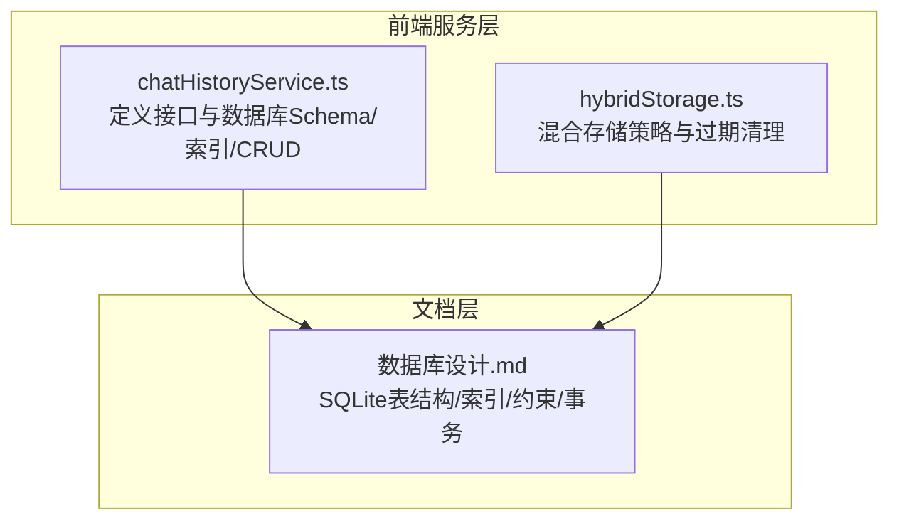
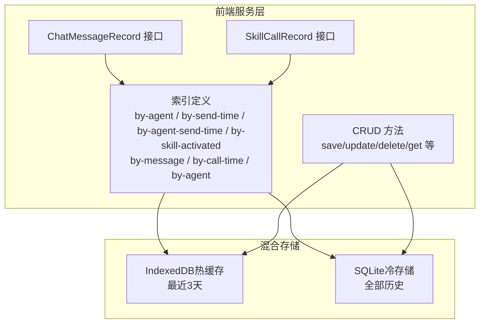
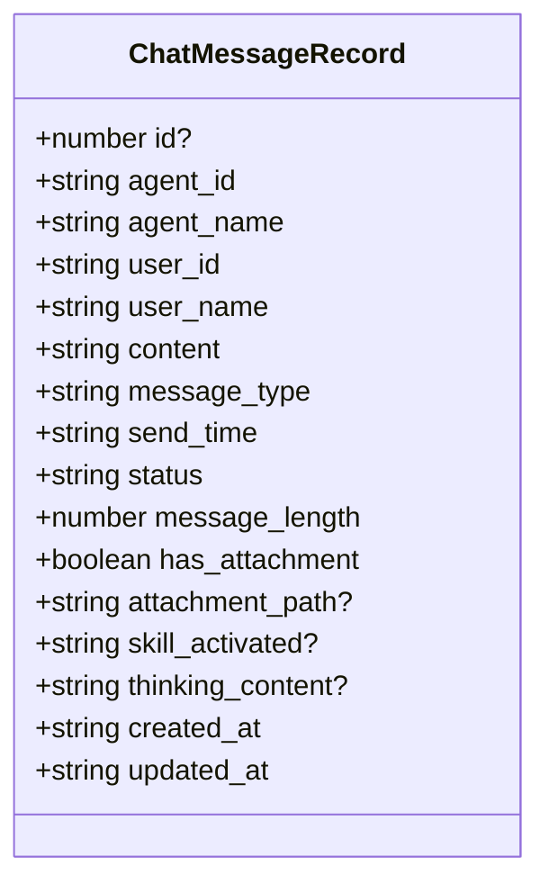
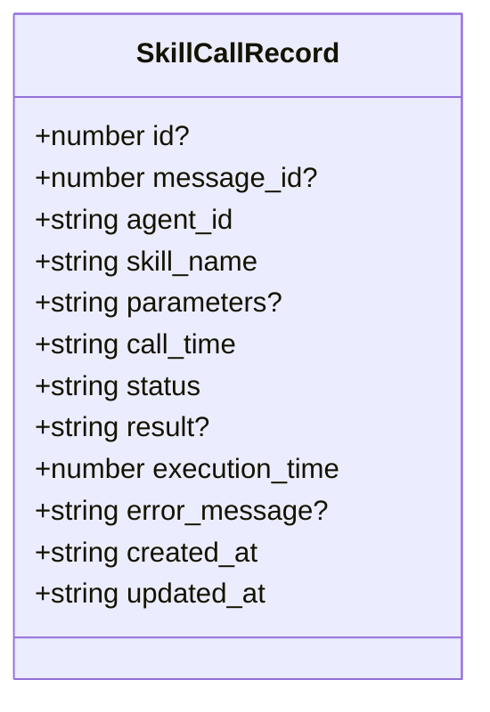
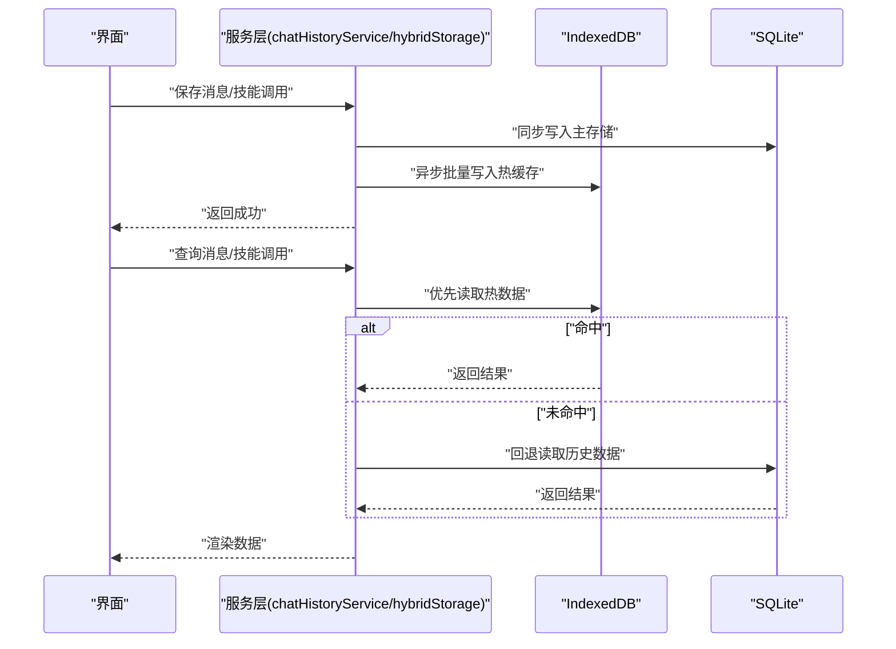
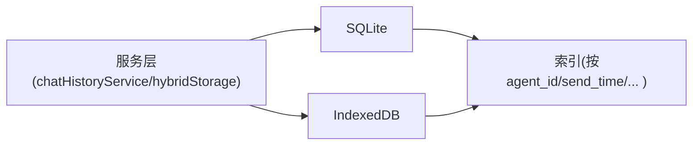

# 数据模型

<cite>
**本文引用的文件**
- [src/services/chatHistoryService.ts](file://src/services/chatHistoryService.ts)
- [src/services/hybridStorage.ts](file://src/services/hybridStorage.ts)
- [docs/数据层设计/数据库设计.md](file://docs/数据层设计/数据库设计.md)
</cite>

## 目录
1. [简介](#简介)
2. [项目结构](#项目结构)
3. [核心组件](#核心组件)
4. [架构总览](#架构总览)
5. [详细组件分析](#详细组件分析)
6. [依赖分析](#依赖分析)
7. [性能考量](#性能考量)
8. [故障排查指南](#故障排查指南)
9. [结论](#结论)
10. [附录](#附录)

## 简介
本文件聚焦于AutoMate项目中的两个核心数据模型：ChatMessageRecord（聊天消息记录）与SkillCallRecord（技能调用记录）。文档将从字段定义、数据类型、约束条件、业务含义、取值范围与默认值、时间戳与时区处理、数据验证与业务约束、以及扩展性与版本演进策略等方面进行系统化说明，并结合前端服务层与混合存储策略给出实际落地细节。

## 项目结构
本次文档涉及的数据模型主要分布在以下位置：
- 前端服务层（TypeScript）：定义了ChatMessageRecord与SkillCallRecord接口及数据库Schema、索引与CRUD方法
- 文档层（Markdown）：提供了SQLite表结构、索引、约束与事务设计等后端持久化方案
- 混合存储策略：前端同时使用IndexedDB作为热数据缓存，SQLite作为冷数据持久化

**图表来源**
- [src/services/chatHistoryService.ts](file://src/services/chatHistoryService.ts#L37-L57)
- [src/services/hybridStorage.ts](file://src/services/hybridStorage.ts#L39-L59)
- [docs/数据层设计/数据库设计.md](file://docs/数据层设计/数据库设计.md#L89-L165)

**章节来源**
- [src/services/chatHistoryService.ts](file://src/services/chatHistoryService.ts#L1-L244)
- [src/services/hybridStorage.ts](file://src/services/hybridStorage.ts#L1-L262)
- [docs/数据层设计/数据库设计.md](file://docs/数据层设计/数据库设计.md#L1-L738)

## 核心组件
本节对两个核心数据模型进行逐字段解析，涵盖字段类型、约束、默认值、业务含义、取值范围与默认值设置，并说明它们之间的关系映射。

- ChatMessageRecord（聊天消息记录）
  - 字段与类型
    - id: number（可选，主键，自增）
    - agent_id: string（非空）
    - agent_name: string（非空）
    - user_id: string（非空）
    - user_name: string（非空）
    - content: string（非空，TEXT类型）
    - message_type: 枚举 'user' | 'assistant' | 'system'（非空）
    - send_time: string（ISO 8601字符串，非空，默认当前时间）
    - status: string（非空，默认 'sent'）
    - message_length: number（非空，默认 0）
    - has_attachment: boolean（非空，默认 false）
    - attachment_path: string（可选）
    - skill_activated: string（可选，逗号分隔的技能名列表）
    - thinking_content: string（可选）
    - created_at: string（ISO 8601字符串，非空，默认当前时间）
    - updated_at: string（ISO 8601字符串，非空，默认当前时间）
  - 约束与默认值
    - 主键：id（自增）
    - 默认值：status='sent'，message_length=0，has_attachment=false，execution_time=0（注意：execution_time属于SkillCallRecord）
    - 时间戳：send_time、created_at、updated_at均为ISO 8601字符串
  - 业务含义
    - 记录一次消息的完整生命周期，包括发送方、接收方、消息内容、类型、状态、附件、思考过程、以及与技能调用的关联标记
  - 取值范围
    - message_type限定为用户、智能体、系统三类
    - status可扩展为sending/sent/delivered/read/failed等（前端默认值为sent）

- SkillCallRecord（技能调用记录）
  - 字段与类型
    - id: number（可选，主键，自增）
    - message_id: number（可选，外键，引用chat_messages.id）
    - agent_id: string（非空）
    - skill_name: string（非空）
    - parameters: string（可选，JSON字符串）
    - call_time: string（ISO 8601字符串，非空，默认当前时间）
    - status: 枚举 'pending' | 'success' | 'failed' | 'timeout'（非空，默认 'pending'）
    - result: string（可选，JSON字符串）
    - execution_time: number（非空，默认 0，单位毫秒）
    - error_message: string（可选）
    - created_at: string（ISO 8601字符串，非空，默认当前时间）
    - updated_at: string（ISO 8601字符串，非空，默认当前时间）
  - 约束与默认值
    - 主键：id（自增）
    - 外键：message_id -> chat_messages.id（删除级联）
    - 默认值：status='pending'，execution_time=0
    - 时间戳：call_time、created_at、updated_at均为ISO 8601字符串
  - 业务含义
    - 记录智能体调用某项技能的全过程，包括参数、结果、耗时、错误信息与状态
  - 取值范围
    - status限定为待执行、成功、失败、超时四类

- 模型间关系映射
  - 一对一/一对多：一条聊天消息可触发零次或多次技能调用（message_id可为空时，表示该消息未绑定技能调用）
  - 外键约束：SkillCallRecord.message_id -> chat_messages.id（删除级联），确保消息删除时相关技能调用也被清理
  - 关联查询：前端通过索引按message_id、agent_id、call_time等维度高效检索

**章节来源**
- [src/services/chatHistoryService.ts](file://src/services/chatHistoryService.ts#L3-L35)
- [src/services/hybridStorage.ts](file://src/services/hybridStorage.ts#L5-L37)
- [docs/数据层设计/数据库设计.md](file://docs/数据层设计/数据库设计.md#L49-L165)

## 架构总览
下图展示了数据模型在前端服务层与后端持久化层之间的映射关系，以及混合存储策略下的读写路径。

**图表来源**
- [src/services/chatHistoryService.ts](file://src/services/chatHistoryService.ts#L37-L57)
- [src/services/hybridStorage.ts](file://src/services/hybridStorage.ts#L39-L59)
- [docs/数据层设计/数据库设计.md](file://docs/数据层设计/数据库设计.md#L641-L666)

## 详细组件分析

### ChatMessageRecord 组件分析
- 字段设计要点
  - 多冗余字段（agent_name、user_name）用于提升查询与展示效率
  - message_length与has_attachment便于统计与UI判断
  - skill_activated以逗号分隔存储多个技能名，便于按技能维度检索
  - thinking_content用于记录推理过程，便于复盘与审计
- 时间戳与时区
  - 前端统一使用ISO 8601字符串（带时区偏移）存储时间戳，避免本地时区差异导致的排序与展示问题
  - created_at/updated_at用于审计与变更追踪
- 数据验证与业务约束
  - 非空字段：agent_id、agent_name、user_id、user_name、content、message_type、send_time、status、message_length、has_attachment、created_at、updated_at
  - 默认值：status='sent'、message_length=0、has_attachment=false
  - 类型约束：message_type与status为枚举；content为TEXT；message_length为整数
- 关系映射
  - 与SkillCallRecord：通过skill_activated标记技能调用；实际外键关联由SkillCallRecord.message_id指向chat_messages.id

**图表来源**
- [src/services/chatHistoryService.ts](file://src/services/chatHistoryService.ts#L3-L20)

**章节来源**
- [src/services/chatHistoryService.ts](file://src/services/chatHistoryService.ts#L3-L244)
- [docs/数据层设计/数据库设计.md](file://docs/数据层设计/数据库设计.md#L49-L108)

### SkillCallRecord 组件分析
- 字段设计要点
  - parameters/result以JSON字符串形式存储，便于灵活扩展参数与结果结构
  - execution_time以毫秒为单位，便于性能统计与告警
  - status枚举化，便于状态机管理与可视化
- 时间戳与时区
  - call_time、created_at、updated_at均采用ISO 8601字符串，确保跨时区一致性
- 数据验证与业务约束
  - 非空字段：agent_id、skill_name、call_time、status、execution_time、created_at、updated_at
  - 默认值：status='pending'、execution_time=0
  - 外键约束：message_id -> chat_messages.id（删除级联）
- 关系映射
  - 与ChatMessageRecord：message_id可为空，表示该技能调用不绑定具体消息；非空时建立一对一/一对多关联

**图表来源**
- [src/services/chatHistoryService.ts](file://src/services/chatHistoryService.ts#L22-L35)

**章节来源**
- [src/services/chatHistoryService.ts](file://src/services/chatHistoryService.ts#L168-L208)
- [docs/数据层设计/数据库设计.md](file://docs/数据层设计/数据库设计.md#L116-L165)

### 数据模型关系映射与序列流程
- 消息与技能调用的关联
  - 保存消息：先写入chat_messages，再根据需要写入skill_calls（message_id可为空）
  - 删除消息：通过外键级联删除对应的skill_calls
- 读取流程
  - 优先从IndexedDB（热数据）读取最近3天数据
  - 未命中时回退到SQLite（历史数据）
- 更新流程
  - 更新消息或技能调用时，统一更新updated_at为当前时间

**图表来源**
- [src/services/chatHistoryService.ts](file://src/services/chatHistoryService.ts#L87-L120)
- [src/services/hybridStorage.ts](file://src/services/hybridStorage.ts#L129-L184)
- [docs/数据层设计/数据库设计.md](file://docs/数据层设计/数据库设计.md#L615-L640)

## 依赖分析
- 前端服务层依赖
  - idb库：提供IndexedDB的类型化访问与对象存储Schema定义
  - 本地存储：localStorage用于记录上次清理日期，避免重复清理
- 后端持久化依赖
  - SQLite：提供强一致性的主存储，支持外键、索引与事务
  - better-sqlite3/sqlite3：Node.js环境下的SQLite驱动
- 关系耦合
  - ChatMessageRecord与SkillCallRecord通过message_id形成弱耦合（可为空）
  - 前端索引设计与后端索引设计需保持一致，以确保查询性能

**图表来源**
- [src/services/chatHistoryService.ts](file://src/services/chatHistoryService.ts#L37-L57)
- [src/services/hybridStorage.ts](file://src/services/hybridStorage.ts#L39-L59)
- [docs/数据层设计/数据库设计.md](file://docs/数据层设计/数据库设计.md#L266-L337)

**章节来源**
- [src/services/chatHistoryService.ts](file://src/services/chatHistoryService.ts#L1-L244)
- [src/services/hybridStorage.ts](file://src/services/hybridStorage.ts#L1-L262)
- [docs/数据层设计/数据库设计.md](file://docs/数据层设计/数据库设计.md#L1-L738)

## 性能考量
- 索引设计
  - 聊天消息：按agent_id、send_time、agent_id+send_time、skill_activated等建立索引，支持高频查询
  - 技能调用：按message_id、call_time、agent_id等建立索引，支持关联与时间维度查询
- 混合存储策略
  - 热数据（最近3天）缓存在IndexedDB，显著降低读取延迟
  - 冷数据（历史）存储在SQLite，兼顾容量与可靠性
- 清理策略
  - 每日检查并清理过期热数据，避免缓存膨胀
- 事务与并发
  - SQLite启用WAL模式与合理PRAGMA设置，提升并发与写入性能
  - 事务内尽量减少IO与锁持有时间

**章节来源**
- [docs/数据层设计/数据库设计.md](file://docs/数据层设计/数据库设计.md#L266-L337)
- [src/services/hybridStorage.ts](file://src/services/hybridStorage.ts#L89-L127)

## 故障排查指南
- 常见问题
  - 消息未显示：检查IndexedDB是否命中，必要时回退到SQLite；确认索引是否存在且有效
  - 技能调用缺失：确认message_id是否正确写入；检查外键约束是否生效
  - 时间错乱：确认前端统一使用ISO 8601字符串；避免本地时区转换导致的排序异常
  - 缓存未更新：确认混合存储的同步与清理逻辑是否正常执行
- 排查步骤
  - 查看服务层日志输出（保存/删除/查询）
  - 核对数据库索引与表结构
  - 使用EXPLAIN QUERY PLAN分析慢查询
  - 检查localStorage中的上次清理时间

**章节来源**
- [src/services/chatHistoryService.ts](file://src/services/chatHistoryService.ts#L116-L119)
- [src/services/hybridStorage.ts](file://src/services/hybridStorage.ts#L117-L127)
- [docs/数据层设计/数据库设计.md](file://docs/数据层设计/数据库设计.md#L500-L506)

## 结论
本文件系统梳理了ChatMessageRecord与SkillCallRecord两大核心数据模型，明确了字段定义、类型与约束、业务含义与取值范围，并阐述了二者的关系映射、时间戳与时区处理、数据验证与业务约束，以及混合存储策略下的读写流程与性能优化。建议在后续迭代中持续完善索引覆盖、事务边界与错误恢复机制，以进一步提升系统的稳定性与可维护性。

## 附录
- 字段与约束速查
  - ChatMessageRecord：非空字段（agent_id、agent_name、user_id、user_name、content、message_type、send_time、status、message_length、has_attachment、created_at、updated_at）；默认值（status='sent'、message_length=0、has_attachment=false）
  - SkillCallRecord：非空字段（agent_id、skill_name、call_time、status、execution_time、created_at、updated_at）；默认值（status='pending'、execution_time=0）；外键message_id -> chat_messages.id（删除级联）
- 版本演进建议
  - 引入schema_migrations表或版本号字段，记录数据结构变更
  - 对新增字段采用向后兼容策略（可选字段+默认值），避免破坏既有数据
  - 对索引变更制定灰度发布与回滚预案

**章节来源**
- [docs/数据层设计/数据库设计.md](file://docs/数据层设计/数据库设计.md#L518-L566)
- [src/services/chatHistoryService.ts](file://src/services/chatHistoryService.ts#L3-L35)
- [src/services/hybridStorage.ts](file://src/services/hybridStorage.ts#L5-L37)