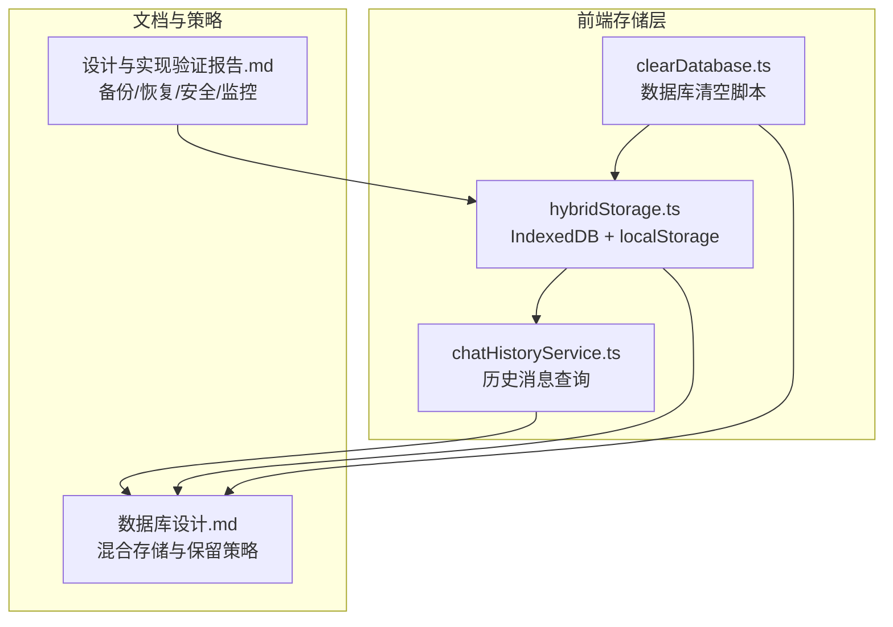
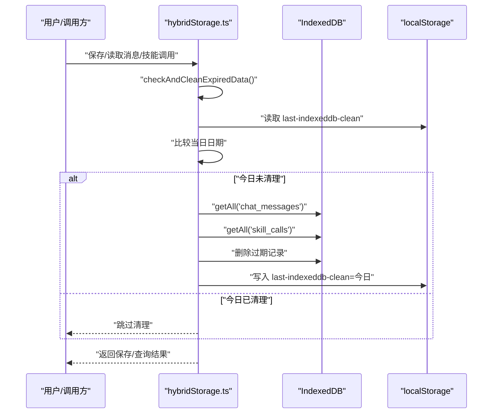
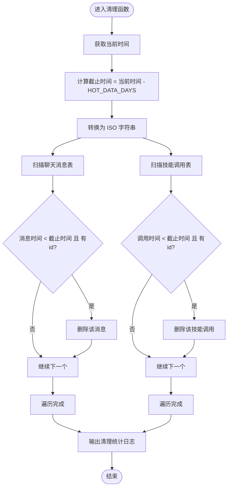
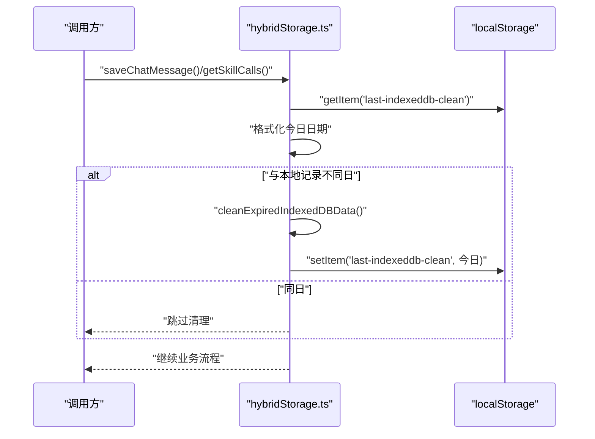
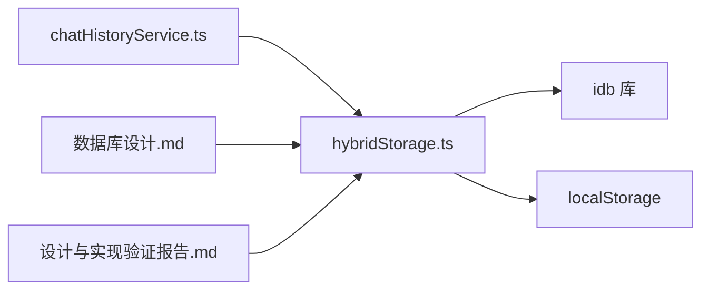

# 数据生命周期管理

<cite>
**本文引用的文件**
- [src/services/hybridStorage.ts](file://src/services/hybridStorage.ts)
- [src/scripts/clearDatabase.ts](file://src/scripts/clearDatabase.ts)
- [docs/数据层设计/数据库设计.md](file://docs/数据层设计/数据库设计.md)
- [docs/数据层设计/数据库设计与实现验证报告.md](file://docs/数据层设计/数据库设计与实现验证报告.md)
- [src/services/chatHistoryService.ts](file://src/services/chatHistoryService.ts)
</cite>

## 目录
1. [简介](#简介)
2. [项目结构](#项目结构)
3. [核心组件](#核心组件)
4. [架构总览](#架构总览)
5. [详细组件分析](#详细组件分析)
6. [依赖关系分析](#依赖关系分析)
7. [性能考量](#性能考量)
8. [故障排查指南](#故障排查指南)
9. [结论](#结论)
10. [附录](#附录)

## 简介
本文件围绕前端混合存储中的“数据生命周期管理”进行系统化技术说明，重点覆盖：
- 过期数据清理机制与 HOT_DATA_DAYS 常量的作用及策略
- cleanExpiredIndexedDBData 函数的实现逻辑（时间计算、扫描与删除）
- 定期清理任务的调度机制与 localStorage 的使用
- 数据保留策略与存储空间管理
- 数据备份与恢复机制的设计思路
- 数据归档与压缩策略的实现方案

## 项目结构
与数据生命周期相关的关键文件与职责如下：
- src/services/hybridStorage.ts：定义 IndexedDB 数据库结构、索引、消息与技能调用的增删改查，以及过期数据清理与每日调度逻辑
- src/scripts/clearDatabase.ts：提供一键清空数据库与清理标记的脚本
- docs/数据层设计/数据库设计.md：明确混合存储策略、保留策略与读写流程
- docs/数据层设计/数据库设计与实现验证报告.md：列出备份、恢复、安全与监控相关能力
- src/services/chatHistoryService.ts：提供按时间范围查询的历史消息读取接口

**图表来源**
- [src/services/hybridStorage.ts](file://src/services/hybridStorage.ts#L1-L262)
- [src/scripts/clearDatabase.ts](file://src/scripts/clearDatabase.ts#L1-L41)
- [docs/数据层设计/数据库设计.md](file://docs/数据层设计/数据库设计.md#L597-L738)
- [docs/数据层设计/数据库设计与实现验证报告.md](file://docs/数据层设计/数据库设计与实现验证报告.md#L46-L144)
- [src/services/chatHistoryService.ts](file://src/services/chatHistoryService.ts#L210-L243)

**章节来源**
- [src/services/hybridStorage.ts](file://src/services/hybridStorage.ts#L1-L262)
- [src/scripts/clearDatabase.ts](file://src/scripts/clearDatabase.ts#L1-L41)
- [docs/数据层设计/数据库设计.md](file://docs/数据层设计/数据库设计.md#L597-L738)
- [docs/数据层设计/数据库设计与实现验证报告.md](file://docs/数据层设计/数据库设计与实现验证报告.md#L46-L144)
- [src/services/chatHistoryService.ts](file://src/services/chatHistoryService.ts#L210-L243)

## 核心组件
- 热数据保留策略与常量
  - HOT_DATA_DAYS 常量定义热数据保留天数，用于计算过期截止时间
- 过期清理函数
  - cleanExpiredIndexedDBData：扫描并删除过期的聊天消息与技能调用记录
- 每日调度与标记
  - checkAndCleanExpiredData：基于 localStorage 的日期标记，确保每天仅清理一次
- 初始化与使用入口
  - initHybridStorage：初始化数据库并触发一次清理
  - saveChatMessage/getSkillCalls 等：每次读写前均触发清理检查

**章节来源**
- [src/services/hybridStorage.ts](file://src/services/hybridStorage.ts#L3-L127)
- [src/services/hybridStorage.ts](file://src/services/hybridStorage.ts#L257-L261)

## 架构总览
混合存储策略与生命周期管理的整体流程如下：

**图表来源**
- [src/services/hybridStorage.ts](file://src/services/hybridStorage.ts#L117-L127)
- [src/services/hybridStorage.ts](file://src/services/hybridStorage.ts#L89-L115)

## 详细组件分析

### 过期数据清理机制与 HOT_DATA_DAYS
- HOT_DATA_DAYS 常量
  - 作用：定义“热数据”的保留天数，决定过期判定的时间阈值
  - 影响：直接影响清理范围与频率，进而影响存储占用与查询效率
- 时间计算与过期判定
  - 截止时间 = 当前时间 - HOT_DATA_DAYS 天
  - 比较字段：聊天消息的 send_time、技能调用的 call_time
  - 删除条件：记录时间早于截止时间且具备有效 id
- 清理范围
  - 聊天消息表与技能调用表分别扫描并删除

**图表来源**
- [src/services/hybridStorage.ts](file://src/services/hybridStorage.ts#L89-L115)

**章节来源**
- [src/services/hybridStorage.ts](file://src/services/hybridStorage.ts#L3-L115)

### 定期清理任务的调度机制与 localStorage 使用
- 调度策略
  - 每次读写操作前检查是否需要清理
  - 使用 localStorage 的 last-indexeddb-clean 键记录上次清理日期
  - 仅当日期变更（跨日）时执行清理，避免重复清理
- 优点
  - 无需额外定时器，按需触发，降低开销
  - 保证每日至少清理一次，避免数据无限增长
- 注意事项
  - 若用户跨时区频繁切换或系统时间异常，可能影响清理节奏
  - localStorage 在隐私模式下不可用或受限，需考虑降级策略

**图表来源**
- [src/services/hybridStorage.ts](file://src/services/hybridStorage.ts#L117-L127)

**章节来源**
- [src/services/hybridStorage.ts](file://src/services/hybridStorage.ts#L117-L127)

### 数据保留策略与存储空间管理
- 热数据与冷数据分离
  - 热数据：最近 HOT_DATA_DAYS 天的数据，存储于 IndexedDB，便于高频读取
  - 冷数据：历史数据，长期存储于 SQLite（在混合存储文档中定义）
- 索引与查询优化
  - IndexedDB 中为聊天消息与技能调用建立多维索引，提升按时间与智能体维度的查询效率
- 存储空间管理建议
  - 结合 HOT_DATA_DAYS 与实际数据增长趋势，动态评估保留窗口
  - 对超长会话或高密度对话场景，可考虑分页加载与懒加载策略，减少一次性扫描

**章节来源**
- [docs/数据层设计/数据库设计.md](file://docs/数据层设计/数据库设计.md#L597-L738)

### 数据备份与恢复机制的设计思路
- 备份能力现状
  - 文档验证报告中明确包含数据库备份与恢复、文件备份与恢复、加密恢复等能力
- 设计思路
  - 定期导出 IndexedDB 中的热数据快照（JSON/CSV），并以 Base64 编码持久化至 localStorage，作为轻量级备份
  - 提供恢复接口：从 localStorage 读取备份并重建 IndexedDB，支持增量恢复与冲突合并
  - 对关键配置与用户偏好，单独备份至 localStorage，确保快速恢复
- 注意事项
  - 备份粒度与频率需平衡存储成本与恢复时效
  - 恢复过程应校验数据完整性与版本兼容性

**章节来源**
- [docs/数据层设计/数据库设计与实现验证报告.md](file://docs/数据层设计/数据库设计与实现验证报告.md#L97-L116)

### 数据归档与压缩策略的实现方案
- 归档策略
  - 将超出保留窗口的历史数据迁移到冷存储（如 SQLite 或外部归档库），并移除热存储中的冗余副本
  - 归档前进行去重与聚合，减少冷存储体积
- 压缩策略
  - 对文本内容进行压缩存储（如 gzip），并在读取时解压
  - 对图片/附件等二进制内容，采用内容寻址存储（如基于哈希的去重与共享）
- 与现有接口的衔接
  - 归档与压缩应在数据写入流程中异步执行，避免阻塞主线程
  - 查询接口需支持“热 + 冷”双通道回退，优先命中热数据，未命中再回退冷数据

**章节来源**
- [docs/数据层设计/数据库设计.md](file://docs/数据层设计/数据库设计.md#L597-L738)

## 依赖关系分析
- 组件耦合
  - hybridStorage.ts 依赖 idb（IndexedDB 封装）与 localStorage（每日清理标记）
  - chatHistoryService.ts 依赖 hybridStorage.ts 的数据库访问能力
- 外部依赖
  - idb：提供类型安全的 IndexedDB 访问与升级流程
  - localStorage：提供轻量级持久化与跨会话状态保持
- 潜在风险
  - localStorage 不可用或被清空，可能导致每日清理重复执行
  - IndexedDB 升级失败或索引缺失，会影响查询与清理性能

**图表来源**
- [src/services/hybridStorage.ts](file://src/services/hybridStorage.ts#L1-L262)
- [src/services/chatHistoryService.ts](file://src/services/chatHistoryService.ts#L210-L243)
- [docs/数据层设计/数据库设计.md](file://docs/数据层设计/数据库设计.md#L597-L738)
- [docs/数据层设计/数据库设计与实现验证报告.md](file://docs/数据层设计/数据库设计与实现验证报告.md#L46-L144)

**章节来源**
- [src/services/hybridStorage.ts](file://src/services/hybridStorage.ts#L1-L262)
- [src/services/chatHistoryService.ts](file://src/services/chatHistoryService.ts#L210-L243)

## 性能考量
- 清理性能
  - 当前实现对两个表进行全量扫描与逐条删除，适合中小规模数据
  - 建议在数据量增大时引入分批删除与事务封装，减少锁竞争与卡顿
- 查询性能
  - 利用 IndexedDB 索引（by-send-time、by-agent-send-time、by-call-time 等）加速过滤
  - 对高频查询场景，可在内存中维护近期热点集合，进一步缩短扫描范围
- 存储成本
  - HOT_DATA_DAYS 越小，存储占用越低；越大则查询命中率更高但占用更大
  - 建议结合业务峰值时段与用户活跃度动态调整

[本节为通用性能讨论，不直接分析具体文件]

## 故障排查指南
- 清理未生效
  - 检查 localStorage 中 last-indexeddb-clean 是否为今日；若被手动清空，清理会在下次操作时自动执行
  - 确认系统时间与时区设置正确
- 清理频繁或重复
  - 若跨时区频繁切换，可能导致日期判断异常；建议固定时区或增加时区校验
- 数据丢失或异常
  - 使用 clearDatabase.ts 脚本一键清空数据库与清理标记，便于重置与复测
  - 恢复时可参考备份机制，从 localStorage 的热数据快照重建

**章节来源**
- [src/scripts/clearDatabase.ts](file://src/scripts/clearDatabase.ts#L1-L41)
- [src/services/hybridStorage.ts](file://src/services/hybridStorage.ts#L117-L127)

## 结论
- 通过 HOT_DATA_DAYS 与每日清理机制，系统实现了对热数据的自动化生命周期管理
- cleanExpiredIndexedDBData 采用简单高效的扫描与删除策略，满足当前规模下的性能与可靠性需求
- 建议在数据规模扩大后引入分批清理、事务化删除与索引优化，并完善备份与归档策略，以进一步提升稳定性与可维护性

[本节为总结性内容，不直接分析具体文件]

## 附录
- 相关接口与数据模型
  - ChatMessageRecord/SkillCallRecord：消息与技能调用的数据结构
  - by-send-time/by-call-time 等索引：加速时间维度查询
- 历史查询辅助
  - getLast24HoursChatMessages：按最近 24 小时筛选消息
  - getChatMessages：支持按 since 参数过滤

**章节来源**
- [src/services/hybridStorage.ts](file://src/services/hybridStorage.ts#L5-L59)
- [src/services/hybridStorage.ts](file://src/services/hybridStorage.ts#L165-L184)
- [src/services/chatHistoryService.ts](file://src/services/chatHistoryService.ts#L210-L243)