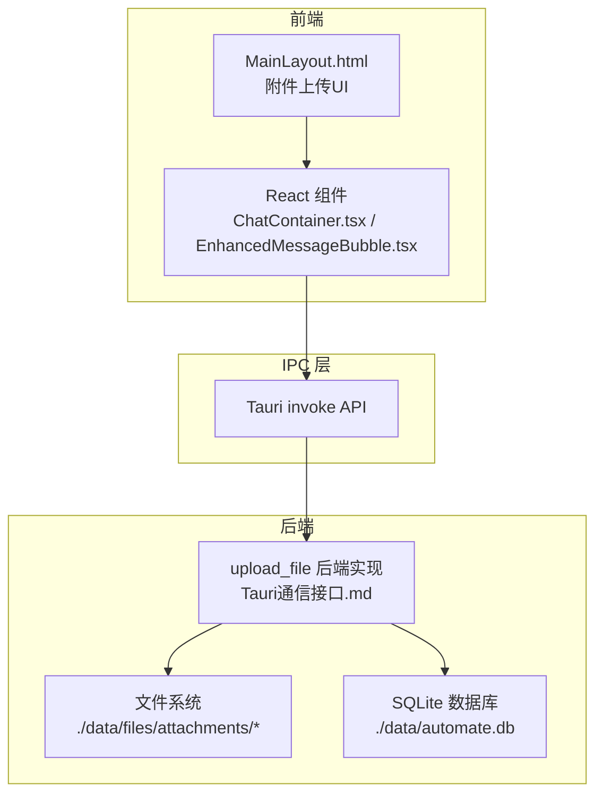
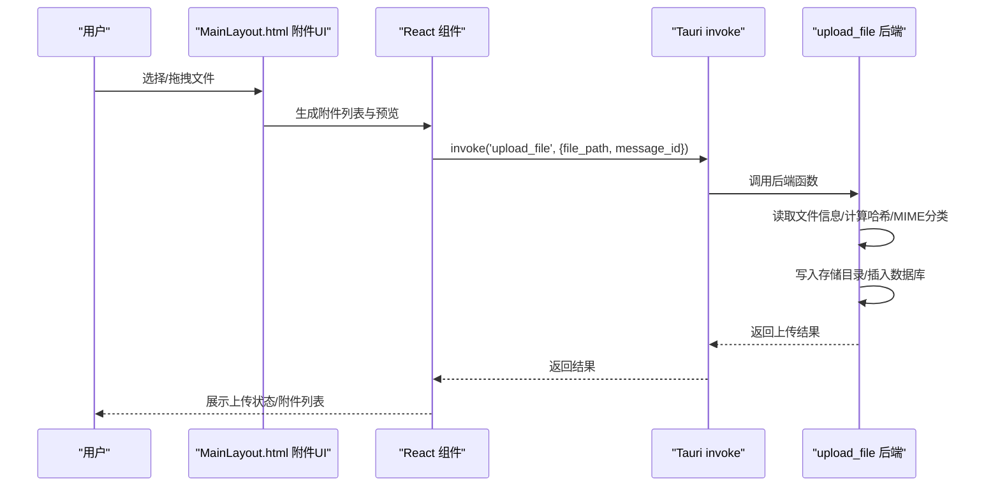
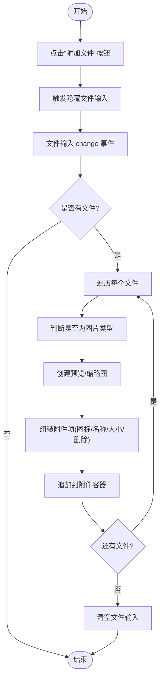
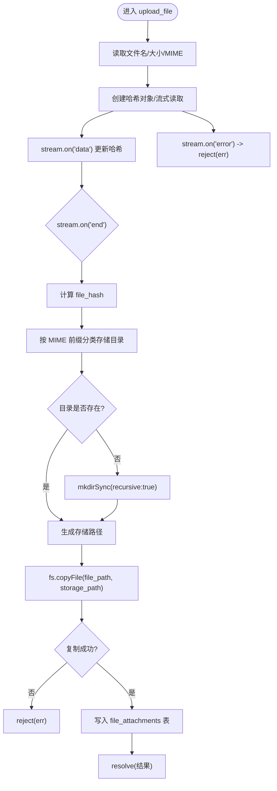
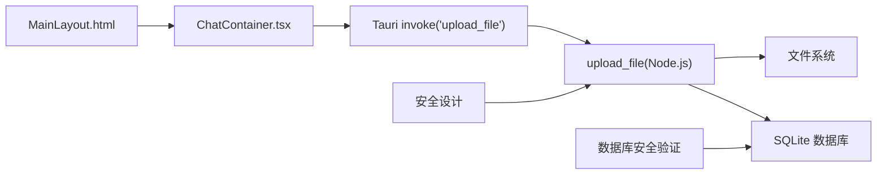

# 文件上传机制

<cite>
**本文引用的文件**
- [Tauri通信接口.md](file://docs/接口层设计/Tauri通信接口.md)
- [MainLayout.html](file://prototypes/MainLayout.html)
- [ChatContainer.tsx](file://src/components/chat/ChatContainer.tsx)
- [EnhancedMessageBubble.tsx](file://src/components/chat/EnhancedMessageBubble.tsx)
- [前端组件接口.md](file://docs/接口层设计/前端组件接口.md)
- [安全设计.md](file://docs/非功能设计/安全设计.md)
- [数据库安全验证报告.md](file://docs/数据层设计/数据库安全验证报告.md)
- [client.py](file://OpenSkills-main/openskills/sandbox/client.py)
</cite>

## 目录
1. [简介](#简介)
2. [项目结构](#项目结构)
3. [核心组件](#核心组件)
4. [架构总览](#架构总览)
5. [详细组件分析](#详细组件分析)
6. [依赖关系分析](#依赖关系分析)
7. [性能考量](#性能考量)
8. [故障排查指南](#故障排查指南)
9. [结论](#结论)
10. [附录](#附录)

## 简介
本文件围绕 AutoMate 项目的文件上传机制展开，覆盖从前端文件选择与拖拽、类型与大小校验、安全检查，到后端接收与处理（MIME 检测、临时/持久化存储、错误处理），再到 Tauri IPC 在文件传输中的角色（文件路径传递与权限验证）。同时提供用户体验优化建议（进度、取消、重试）以及安全策略与隐私保护措施。

## 项目结构
- 前端采用 React + TypeScript，文件上传 UI 由原型 HTML 中的附件上传功能与 React 组件共同构成。
- 后端通过 Tauri 的 invoke API 提供文件上传能力，核心逻辑位于文档定义的接口规范中。
- 安全策略涵盖文件访问隔离、传输加密与日志审计，数据库层面具备加密与访问控制能力。

图表来源
- [Tauri通信接口.md](file://docs/接口层设计/Tauri通信接口.md#L448-L543)
- [MainLayout.html](file://prototypes/MainLayout.html#L2164-L2303)
- [ChatContainer.tsx](file://src/components/chat/ChatContainer.tsx#L1-L200)

章节来源
- [Tauri通信接口.md](file://docs/接口层设计/Tauri通信接口.md#L1-L100)
- [MainLayout.html](file://prototypes/MainLayout.html#L2164-L2303)

## 核心组件
- 前端附件上传 UI：支持多文件选择、图片预览、删除、格式化显示文件名与大小。
- Tauri invoke API：前端通过 invoke('upload_file', { file_path, message_id }) 调用后端。
- 后端 upload_file：读取文件信息、计算哈希、按 MIME 类型分类存储、写入数据库。
- 安全与访问控制：文件路径校验、临时文件安全创建、数据库加密与访问控制。

章节来源
- [MainLayout.html](file://prototypes/MainLayout.html#L2164-L2303)
- [Tauri通信接口.md](file://docs/接口层设计/Tauri通信接口.md#L448-L543)
- [安全设计.md](file://docs/非功能设计/安全设计.md#L307-L394)
- [数据库安全验证报告.md](file://docs/数据层设计/数据库安全验证报告.md#L1-L59)

## 架构总览
文件上传从 UI 触发，经 Tauri IPC 到后端，后端完成文件信息提取、哈希计算、分类存储与元数据入库，最终返回结果。

图表来源
- [Tauri通信接口.md](file://docs/接口层设计/Tauri通信接口.md#L448-L543)
- [MainLayout.html](file://prototypes/MainLayout.html#L2164-L2303)

## 详细组件分析

### 前端文件选择与拖拽上传
- 多文件选择：隐藏的文件输入元素触发，支持 multiple=true。
- 图片预览：对 image/* 类型文件创建缩略图，并支持点击放大。
- 附件列表：展示文件名（截断）、大小（格式化）、删除按钮。
- 交互细节：清空文件输入以允许重复选择相同文件；删除附件自动隐藏容器。

图表来源
- [MainLayout.html](file://prototypes/MainLayout.html#L2164-L2303)

章节来源
- [MainLayout.html](file://prototypes/MainLayout.html#L2164-L2303)

### 文件类型验证、大小限制与安全检查
- 类型与大小：前端未见显式的 acceptedTypes 与 maxSize 校验逻辑；可在 React FileUpload 组件 Props 中扩展。
- 安全检查：后端通过 mime-types 解析 MIME，结合哈希与扩展名生成稳定存储路径，避免同名冲突。
- 访问隔离：安全设计文档提供文件路径校验与安全临时文件创建示例，建议在实际实现中引入。

章节来源
- [Tauri通信接口.md](file://docs/接口层设计/Tauri通信接口.md#L448-L543)
- [前端组件接口.md](file://docs/接口层设计/前端组件接口.md#L250-L279)
- [安全设计.md](file://docs/非功能设计/安全设计.md#L307-L394)

### 后端文件接收与处理逻辑
- 读取文件信息：文件名、大小、MIME 类型（fallback 至 application/octet-stream）。
- 哈希计算：使用 sha256 对文件流进行增量计算，确保唯一标识。
- 存储分类：按 MIME 前缀分类存储至 images/documents/others 目录。
- 目录与文件：若目录不存在则递归创建；存储路径为 {hash}{原扩展名}。
- 元数据入库：向 file_attachments 表插入 message_id、file_name、file_type、file_size、storage_path、file_hash。
- 错误处理：文件流 error 事件直接 reject；数据库写入失败时回滚/拒绝。

图表来源
- [Tauri通信接口.md](file://docs/接口层设计/Tauri通信接口.md#L462-L542)

章节来源
- [Tauri通信接口.md](file://docs/接口层设计/Tauri通信接口.md#L448-L543)

### Tauri IPC 通信在文件传输中的作用
- 前端调用：invoke('upload_file', { file_path, message_id })。
- 后端实现：Node.js 函数 upload_file，内部完成文件处理与数据库写入。
- 事件系统：文档定义了事件监听/发送机制，可用于上传进度或状态通知（可扩展）。
- 权限验证：建议在 IPC 层增加调用方鉴权与参数校验，防止越权与注入。

章节来源
- [Tauri通信接口.md](file://docs/接口层设计/Tauri通信接口.md#L25-L100)
- [Tauri通信接口.md](file://docs/接口层设计/Tauri通信接口.md#L448-L543)

### 用户体验优化方案
- 进度显示：在后端流式处理时通过事件系统向前端推送进度（已完成字节/总大小）。
- 取消操作：提供中断文件流的能力（需后端支持取消逻辑与资源释放）。
- 重试机制：在前端捕获错误后提供重试按钮，重试时保留 message_id 并重新调用 upload_file。
- 可视化反馈：在附件列表中展示上传状态（成功/失败/进行中），失败时提供重试与删除。

章节来源
- [EnhancedMessageBubble.tsx](file://src/components/chat/EnhancedMessageBubble.tsx#L1-L217)
- [ChatContainer.tsx](file://src/components/chat/ChatContainer.tsx#L1-L200)

### 安全策略、访问控制与隐私保护
- 文件访问隔离：校验文件路径必须位于允许目录内，避免路径穿越。
- 传输安全：建议启用 HTTPS/TLS，必要时对敏感数据进行传输加密。
- 数据库安全：使用 SQLCipher 对数据库加密，严格设置文件权限与备份策略。
- 日志与审计：记录安全事件（登录、权限变更、异常访问），便于追踪与审计。
- 隐私保护：对上传文件进行最小化处理，仅保留必要元数据；删除不再需要的文件与备份。

章节来源
- [安全设计.md](file://docs/非功能设计/安全设计.md#L307-L394)
- [数据库安全验证报告.md](file://docs/数据层设计/数据库安全验证报告.md#L1-L59)

## 依赖关系分析
- 前端依赖：React 组件与 Tauri invoke API；UI 依赖原型 HTML 的附件上传逻辑。
- IPC 依赖：invoke('upload_file') 与后端 upload_file 函数签名一致。
- 后端依赖：Node.js 文件系统、MIME 类型解析、SQLite 数据库。
- 安全依赖：文件路径校验、临时文件创建、数据库加密与访问控制。

图表来源
- [Tauri通信接口.md](file://docs/接口层设计/Tauri通信接口.md#L448-L543)
- [MainLayout.html](file://prototypes/MainLayout.html#L2164-L2303)
- [安全设计.md](file://docs/非功能设计/安全设计.md#L307-L394)
- [数据库安全验证报告.md](file://docs/数据层设计/数据库安全验证报告.md#L1-L59)

章节来源
- [Tauri通信接口.md](file://docs/接口层设计/Tauri通信接口.md#L448-L543)
- [MainLayout.html](file://prototypes/MainLayout.html#L2164-L2303)

## 性能考量
- 流式处理：后端使用流式读取与哈希计算，避免一次性加载大文件到内存。
- 存储策略：按 MIME 分类存储，便于后续检索与清理。
- 并发控制：建议在后端引入队列与并发限制，防止磁盘与数据库压力过大。
- 前端渲染：附件列表采用虚拟滚动与懒加载，减少 DOM 压力。

## 故障排查指南
- 上传失败：检查后端错误事件是否被正确发送与前端捕获；确认数据库连接与表结构。
- 路径问题：确保 file_path 在允许范围内，避免路径穿越。
- 权限问题：检查存储目录权限与数据库文件权限。
- 性能瓶颈：监控磁盘 IO 与数据库写入延迟，必要时拆分存储或引入缓存。

章节来源
- [Tauri通信接口.md](file://docs/接口层设计/Tauri通信接口.md#L732-L796)
- [安全设计.md](file://docs/非功能设计/安全设计.md#L307-L394)

## 结论
AutoMate 的文件上传机制以 Tauri IPC 为核心，前端负责选择与预览，后端负责安全处理与持久化。通过 MIME 分类、哈希去重与数据库元数据管理，实现了可靠的文件存储与检索基础。建议在现有基础上补充前端类型/大小校验、进度与取消能力，并强化 IPC 层的权限与参数校验，进一步提升安全性与用户体验。

## 附录
- 相关接口与组件参考：
  - [Tauri 通信接口](file://docs/接口层设计/Tauri通信接口.md#L448-L543)
  - [附件上传 UI](file://prototypes/MainLayout.html#L2164-L2303)
  - [React 聊天容器](file://src/components/chat/ChatContainer.tsx#L1-L200)
  - [React 增强消息气泡](file://src/components/chat/EnhancedMessageBubble.tsx#L1-L217)
  - [前端组件接口规范](file://docs/接口层设计/前端组件接口.md#L250-L279)
  - [安全设计](file://docs/非功能设计/安全设计.md#L307-L394)
  - [数据库安全验证](file://docs/数据层设计/数据库安全验证报告.md#L1-L59)
  - [沙箱文件读写客户端](file://OpenSkills-main/openskills/sandbox/client.py#L507-L743)