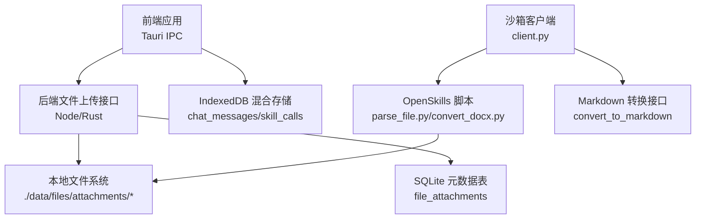
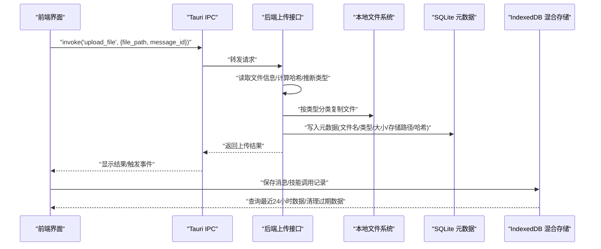
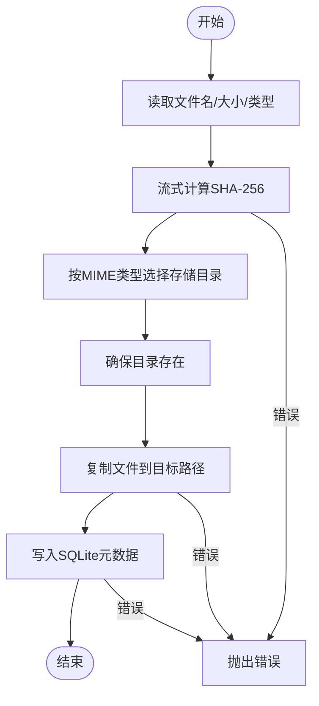
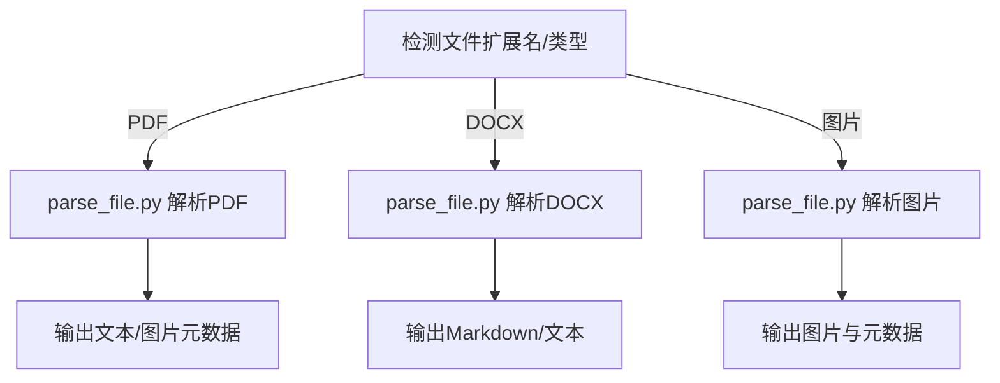
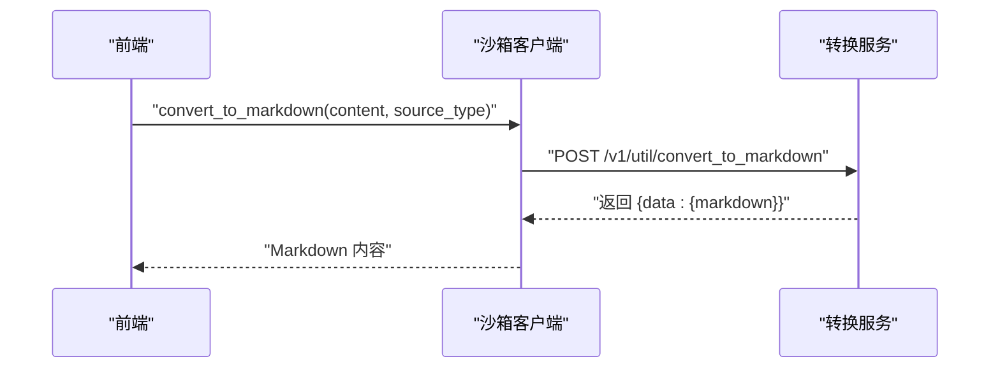
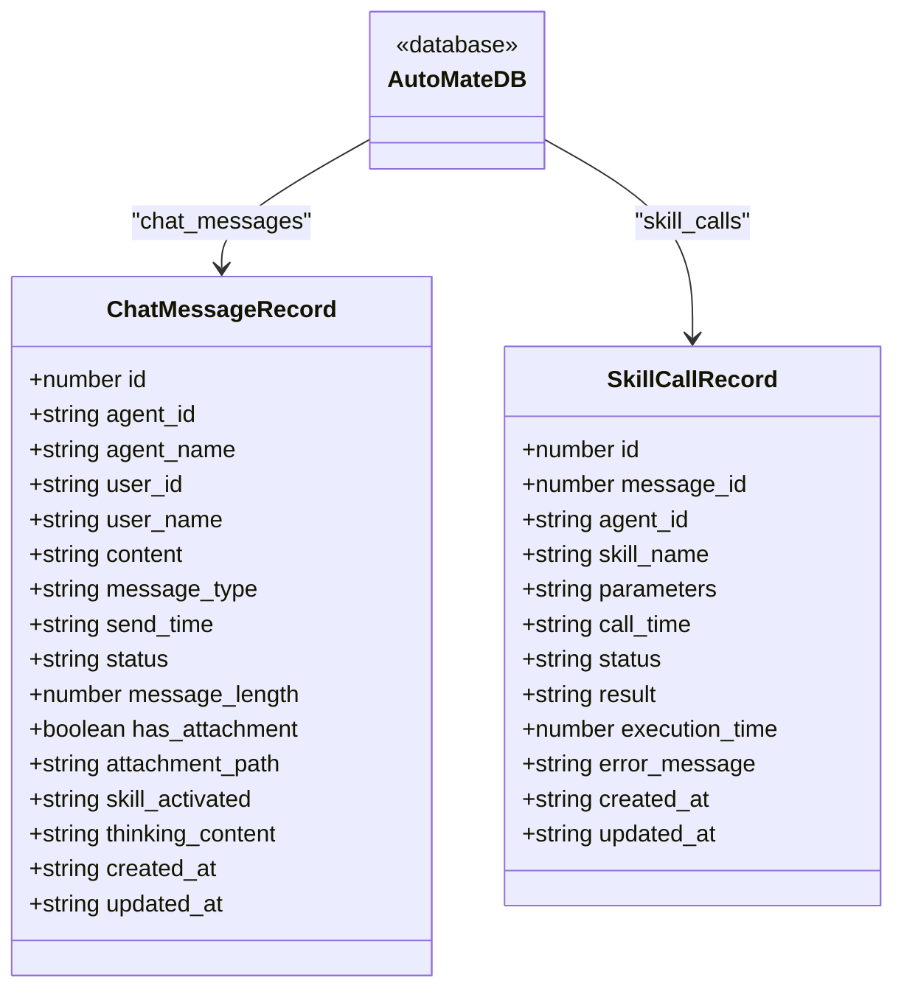
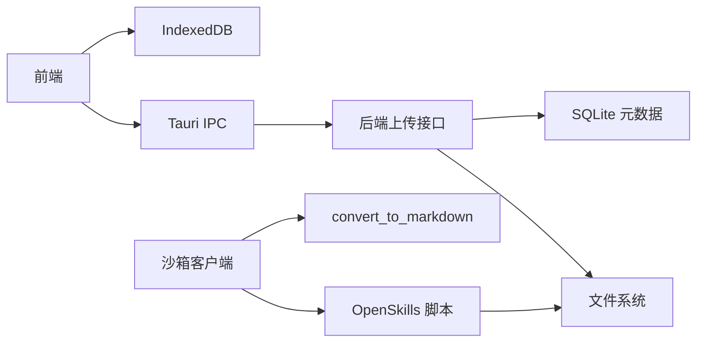

# 文件处理

<cite>
**本文档引用的文件**
- [Tauri通信接口.md](file://docs/接口层设计/Tauri通信接口.md)
- [hybridStorage.ts](file://src/services/hybridStorage.ts)
- [parse_file.py](file://OpenSkills-main/examples/file-to-article-generator/scripts/parse_file.py)
- [SKILL.md](file://OpenSkills-main/examples/file-to-article-generator/SKILL.md)
- [convert_docx.py](file://OpenSkills-main/examples/office-skills/docx-processor/scripts/convert_docx.py)
- [client.py](file://OpenSkills-main/openskills/sandbox/client.py)
</cite>

## 目录
1. [简介](#简介)
2. [项目结构](#项目结构)
3. [核心组件](#核心组件)
4. [架构总览](#架构总览)
5. [组件详解](#组件详解)
6. [依赖关系分析](#依赖关系分析)
7. [性能考量](#性能考量)
8. [故障排查指南](#故障排查指南)
9. [结论](#结论)
10. [附录](#附录)

## 简介
本文件处理系统围绕“文件上传—类型检测—安全校验—转换与解析—混合存储—进度与事件”的完整链路展开，覆盖本地与沙箱双环境协作、多格式文件解析与转换、以及基于 IndexedDB 的轻量持久化与过期清理策略。系统同时提供可扩展的技能化处理流程，便于接入自定义处理器与第三方转换服务。

## 项目结构
- 前端与后端通信通过 Tauri 的 invoke 机制对接，文件上传接口以 Rust/Node 混合实现。
- 前端侧提供混合存储（IndexedDB）封装，负责消息与技能调用记录的本地持久化与清理。
- OpenSkills 示例提供多种文件解析与转换脚本，涵盖 PDF/DOCX/图片等格式。
- 沙箱客户端提供统一的文件上传与内容转换接口，便于在受控环境中执行复杂处理。

图表来源
- [Tauri通信接口.md](file://docs/接口层设计/Tauri通信接口.md#L448-L543)
- [hybridStorage.ts](file://src/services/hybridStorage.ts#L1-L262)
- [parse_file.py](file://OpenSkills-main/examples/file-to-article-generator/scripts/parse_file.py#L1-L327)
- [convert_docx.py](file://OpenSkills-main/examples/office-skills/docx-processor/scripts/convert_docx.py#L1-L125)
- [client.py](file://OpenSkills-main/openskills/sandbox/client.py#L665-L698)

章节来源
- [Tauri通信接口.md](file://docs/接口层设计/Tauri通信接口.md#L448-L543)
- [hybridStorage.ts](file://src/services/hybridStorage.ts#L1-L262)

## 核心组件
- 文件上传与安全校验
  - 通过 Tauri invoke 调用后端上传函数，计算 SHA-256 哈希，按 MIME 类型分类存储目录，复制文件并写入 SQLite 元数据。
- 类型检测与格式支持
  - 基于 mime-types 推断类型；支持 PDF、DOCX、常见图片格式；OpenSkills 示例进一步细化为 PDF/DOCX/图片三类解析。
- 文件转换与解析
  - OpenSkills 提供 parse_file.py（PDF/DOCX/图片解析）与 convert_docx.py（DOCX 转 Markdown/纯文本）；沙箱 client.py 提供 convert_to_markdown 统一入口。
- 混合存储系统
  - 前端通过 IndexedDB 存储聊天消息与技能调用记录，按天清理过期数据，保障本地性能与容量。
- 进度与事件
  - Tauri 文档定义了事件系统，可用于上传、解析、转换过程中的状态通知与前端联动。

章节来源
- [Tauri通信接口.md](file://docs/接口层设计/Tauri通信接口.md#L448-L543)
- [parse_file.py](file://OpenSkills-main/examples/file-to-article-generator/scripts/parse_file.py#L1-L327)
- [convert_docx.py](file://OpenSkills-main/examples/office-skills/docx-processor/scripts/convert_docx.py#L1-L125)
- [client.py](file://OpenSkills-main/openskills/sandbox/client.py#L665-L698)
- [hybridStorage.ts](file://src/services/hybridStorage.ts#L1-L262)

## 架构总览
下图展示从前端到后端、再到本地存储与沙箱处理的整体流程：

图表来源
- [Tauri通信接口.md](file://docs/接口层设计/Tauri通信接口.md#L448-L543)
- [hybridStorage.ts](file://src/services/hybridStorage.ts#L129-L184)

## 组件详解

### 文件上传与安全校验
- 关键流程
  - 读取文件名、大小与类型；流式计算 SHA-256；按类型选择存储目录；复制文件；写入 SQLite 元数据。
- 安全要点
  - 采用哈希去重与目录隔离，避免同名冲突；类型判断基于扩展名映射，减少误判风险。
- 错误处理
  - 读取、复制、数据库写入均设置错误回调，保证异常可追踪。

图表来源
- [Tauri通信接口.md](file://docs/接口层设计/Tauri通信接口.md#L464-L542)

章节来源
- [Tauri通信接口.md](file://docs/接口层设计/Tauri通信接口.md#L448-L543)

### 类型检测与格式支持
- 后端类型检测
  - 使用 mime-types 推断类型，按 image/text/others 分类存储。
- OpenSkills 解析器
  - parse_file.py 支持 PDF、DOCX、常见图片格式；convert_docx.py 支持 DOCX 转 Markdown/纯文本。
- 格式支持矩阵
  - PDF：提取文本与图片，保存图片至 output/images。
  - DOCX：提取段落与表格文本，支持 Markdown/纯文本输出。
  - 图片：基础元数据与格式信息，保存副本以便后续处理。

图表来源
- [parse_file.py](file://OpenSkills-main/examples/file-to-article-generator/scripts/parse_file.py#L15-L266)
- [convert_docx.py](file://OpenSkills-main/examples/office-skills/docx-processor/scripts/convert_docx.py#L18-L107)

章节来源
- [parse_file.py](file://OpenSkills-main/examples/file-to-article-generator/scripts/parse_file.py#L1-L327)
- [convert_docx.py](file://OpenSkills-main/examples/office-skills/docx-processor/scripts/convert_docx.py#L1-L125)

### 文件转换功能与策略
- 统一转换入口
  - 沙箱 client.py 提供 convert_to_markdown，支持 HTML/PDF 等源类型，返回 Markdown 文本。
- 本地转换策略
  - DOCX 转换由 convert_docx.py 实现，支持 Markdown 与纯文本两种输出。
- 处理策略
  - 对于 PDF/图片等非结构化内容，优先提取文本与图片；对于结构化文档（DOCX），保留标题、列表与表格结构。

图表来源
- [client.py](file://OpenSkills-main/openskills/sandbox/client.py#L968-L985)

章节来源
- [client.py](file://OpenSkills-main/openskills/sandbox/client.py#L665-L698)
- [client.py](file://OpenSkills-main/openskills/sandbox/client.py#L968-L985)
- [convert_docx.py](file://OpenSkills-main/examples/office-skills/docx-processor/scripts/convert_docx.py#L18-L107)

### 混合存储系统（本地与 IndexedDB）
- 设计目标
  - 在前端侧缓存近期聊天消息与技能调用记录，降低后端压力，支持离线回放与快速查询。
- 数据模型
  - chat_messages：消息主表，包含消息类型、附件标记、技能激活信息等。
  - skill_calls：技能调用记录，包含调用时间、状态、执行耗时等。
- 清理策略
  - 每日检查并删除超过 HOT_DATA_DAYS（默认3天）的历史数据，避免无限增长。
- 查询与操作
  - 支持按 agent_id、send_time、skill_activated 等字段建立索引，提升查询效率。

图表来源
- [hybridStorage.ts](file://src/services/hybridStorage.ts#L39-L59)

章节来源
- [hybridStorage.ts](file://src/services/hybridStorage.ts#L1-L262)

### 文件管理 API、批量操作与进度跟踪
- 文件上传 API
  - 前端通过 invoke('upload_file', ...) 调用，后端返回文件名、类型、大小、存储路径与哈希。
- 批量操作
  - 可在前端循环调用上传接口实现批量上传；后端保持幂等（基于哈希去重）。
- 进度跟踪
  - 建议结合事件系统在后端处理过程中发送进度事件，前端监听并更新 UI。

章节来源
- [Tauri通信接口.md](file://docs/接口层设计/Tauri通信接口.md#L448-L543)

### 扩展开发指南：自定义处理器与性能优化
- 自定义处理器接入
  - 在 OpenSkills 脚本体系中新增解析/转换脚本，遵循 stdin 输入与 JSON 输出约定；在 SKILL 描述中声明依赖与输出目录。
- 性能优化建议
  - 流式处理大文件，避免一次性加载内存；对图片进行缩略与格式统一；缓存中间结果；合理设置超时与重试。
- 安全与合规
  - 严格校验输入路径与类型；对不可信内容进行白名单过滤；敏感信息脱敏；最小权限原则。

章节来源
- [SKILL.md](file://OpenSkills-main/examples/file-to-article-generator/SKILL.md#L1-L179)
- [parse_file.py](file://OpenSkills-main/examples/file-to-article-generator/scripts/parse_file.py#L268-L327)

## 依赖关系分析
- 组件耦合
  - 前端与后端通过 Tauri IPC 强耦合；后端与文件系统/数据库弱耦合；OpenSkills 脚本与沙箱解耦。
- 外部依赖
  - mime-types、PyMuPDF、python-docx、Pillow 等第三方库。
- 循环依赖
  - 未发现明显循环依赖；模块边界清晰。

图表来源
- [Tauri通信接口.md](file://docs/接口层设计/Tauri通信接口.md#L448-L543)
- [hybridStorage.ts](file://src/services/hybridStorage.ts#L1-L262)
- [parse_file.py](file://OpenSkills-main/examples/file-to-article-generator/scripts/parse_file.py#L1-L327)
- [client.py](file://OpenSkills-main/openskills/sandbox/client.py#L665-L698)

章节来源
- [Tauri通信接口.md](file://docs/接口层设计/Tauri通信接口.md#L448-L543)
- [hybridStorage.ts](file://src/services/hybridStorage.ts#L1-L262)
- [parse_file.py](file://OpenSkills-main/examples/file-to-article-generator/scripts/parse_file.py#L1-L327)
- [client.py](file://OpenSkills-main/openskills/sandbox/client.py#L665-L698)

## 性能考量
- IO 优化
  - 使用流式读取与复制，避免大文件占用过多内存。
- 存储策略
  - 按类型分目录存放，利于后续冷热分离与清理。
- 本地缓存
  - IndexedDB 仅保留近期数据，定期清理，降低磁盘与查询压力。
- 并发与超时
  - 对外部转换服务设置合理超时与并发上限，防止阻塞主线程。

## 故障排查指南
- 上传失败
  - 检查文件路径与权限；确认存储目录可写；查看后端错误日志。
- 类型识别异常
  - 确认 mime-types 映射是否正确；必要时补充扩展名映射。
- 解析器报错
  - 检查 OpenSkills 依赖是否安装；确认输出目录存在且可写。
- IndexedDB 异常
  - 查看浏览器控制台与日志；确认索引创建与清理逻辑正常执行。

章节来源
- [Tauri通信接口.md](file://docs/接口层设计/Tauri通信接口.md#L448-L543)
- [parse_file.py](file://OpenSkills-main/examples/file-to-article-generator/scripts/parse_file.py#L26-L31)
- [hybridStorage.ts](file://src/services/hybridStorage.ts#L89-L127)

## 结论
该文件处理系统通过 Tauri IPC 实现前后端协同，结合本地文件系统与 SQLite 元数据，提供稳定可靠的上传与管理能力；通过 IndexedDB 实现轻量级本地持久化与过期清理；借助 OpenSkills 与沙箱客户端，形成可扩展的解析与转换生态。建议在生产环境中强化安全校验、完善事件驱动的进度反馈，并持续优化大文件与高并发场景下的性能表现。

## 附录
- 术语
  - MIME：多用途互联网邮件扩展类型，用于标识文件类型。
  - SHA-256：密码学哈希算法，用于文件唯一性校验。
  - IndexedDB：浏览器内置的 NoSQL 数据库，适合前端本地存储。
- 参考
  - Tauri 事件系统与 IPC 文档
  - OpenSkills 脚本与依赖说明
  - 沙箱客户端转换接口