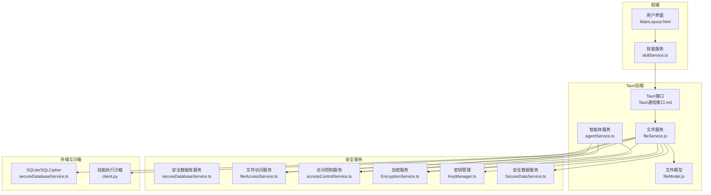
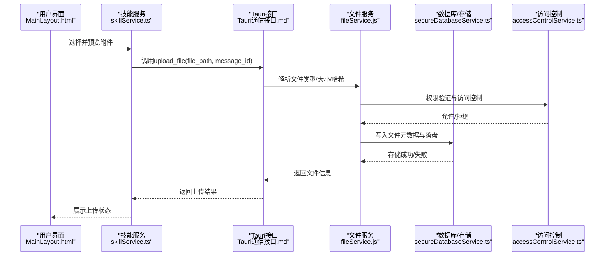
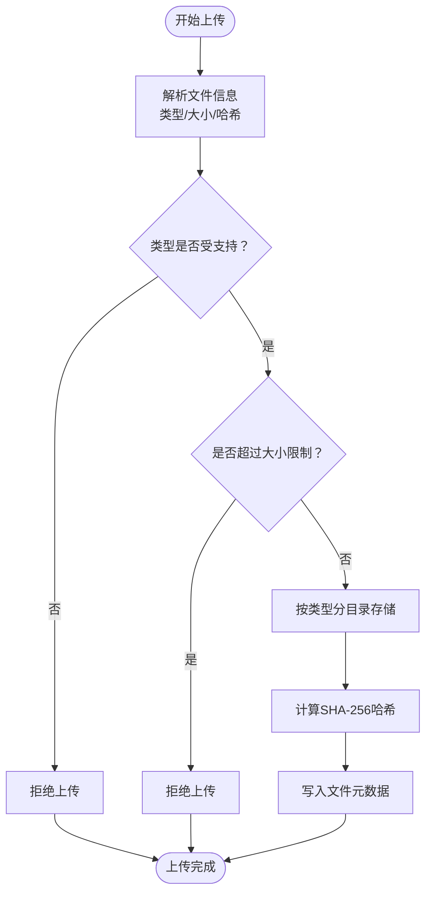
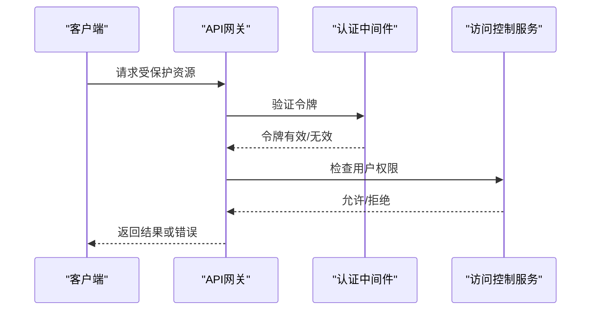
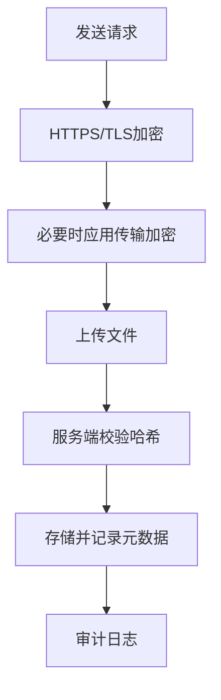
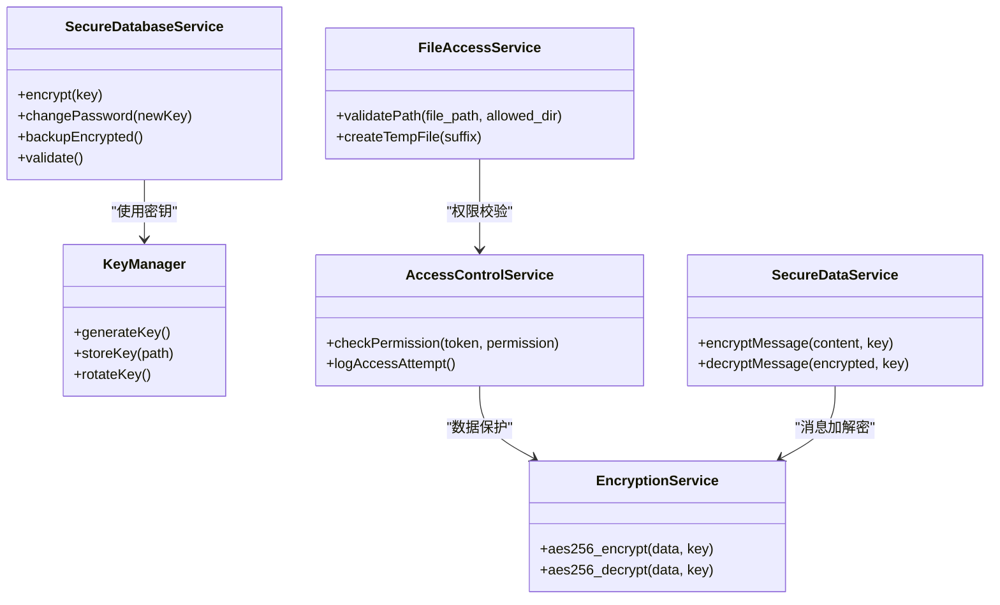
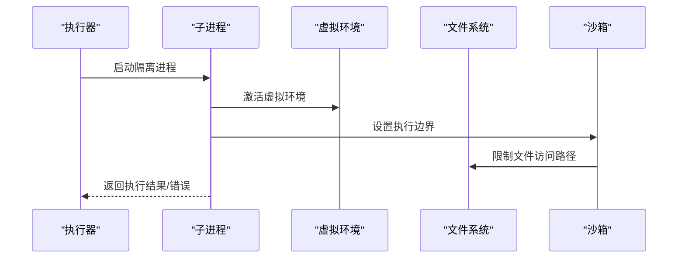
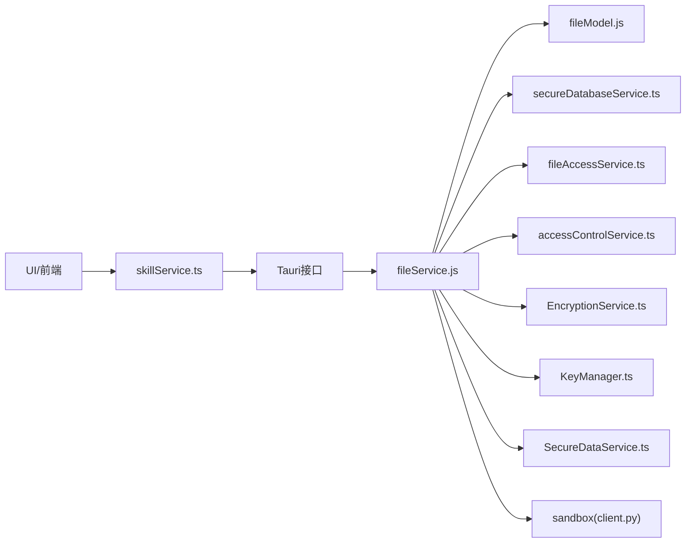

# 文件安全策略

<cite>
**本文引用的文件**
- [安全设计.md](file://docs/非功能设计/安全设计.md)
- [数据库安全验证报告.md](file://docs/数据层设计/数据库安全验证报告.md)
- [Tauri通信接口.md](file://docs/接口层设计/Tauri通信接口.md)
- [MainLayout.html](file://prototypes/MainLayout.html)
- [skillService.ts](file://src/services/skillService.ts)
- [secureDatabaseService.ts](file://src/services/secureDatabaseService.ts)
- [fileAccessService.ts](file://src/services/fileAccessService.ts)
- [accessControlService.ts](file://src/services/accessControlService.ts)
- [EncryptionService.ts](file://src/services/EncryptionService.ts)
- [KeyManager.ts](file://src/services/KeyManager.ts)
- [SecureDataService.ts](file://src/services/SecureDataService.ts)
- [fileModel.js](file://backend/models/fileModel.js)
- [fileService.js](file://backend/services/fileService.js)
- [agentService.ts](file://backend/services/agentService.ts)
- [client.py](file://OpenSkills-main/openskills/sandbox/client.py)
</cite>

## 目录
1. [引言](#引言)
2. [项目结构](#项目结构)
3. [核心组件](#核心组件)
4. [架构总览](#架构总览)
5. [详细组件分析](#详细组件分析)
6. [依赖关系分析](#依赖关系分析)
7. [性能考虑](#性能考虑)
8. [故障排查指南](#故障排查指南)
9. [结论](#结论)
10. [附录](#附录)

## 引言
本文件安全策略文档面向AutoMate项目的文件上传、访问控制、传输安全、本地存储与审计等环节，结合现有设计文档与实现代码，系统梳理并补充文件安全验证机制与合规要求。重点覆盖：
- 文件类型检查、恶意内容扫描与大小限制
- 用户权限验证、文件共享与隐私保护
- 传输过程中的加密、完整性校验与防篡改
- 本地存储的数据加密、访问日志与审计追踪
- 安全事件响应流程与威胁防护方案
- 合规性与数据保护法规遵循

## 项目结构
AutoMate采用前后端分离与Tauri桥接的架构，文件安全涉及前端界面、Tauri后端接口、后端服务层、数据库与安全服务模块。下图展示与文件安全相关的关键模块与交互：

**图表来源**
- [MainLayout.html](file://prototypes/MainLayout.html#L2206-L2303)
- [skillService.ts](file://src/services/skillService.ts#L1-L73)
- [Tauri通信接口.md](file://docs/接口层设计/Tauri通信接口.md#L448-L543)
- [fileService.js](file://backend/services/fileService.js#L1-L1)
- [fileModel.js](file://backend/models/fileModel.js#L1-L1)
- [agentService.ts](file://backend/services/agentService.ts#L1-L1)
- [secureDatabaseService.ts](file://src/services/secureDatabaseService.ts#L1-L1)
- [fileAccessService.ts](file://src/services/fileAccessService.ts#L1-L1)
- [accessControlService.ts](file://src/services/accessControlService.ts#L1-L1)
- [EncryptionService.ts](file://src/services/EncryptionService.ts#L1-L1)
- [KeyManager.ts](file://src/services/KeyManager.ts#L1-L1)
- [SecureDataService.ts](file://src/services/SecureDataService.ts#L1-L1)
- [client.py](file://OpenSkills-main/openskills/sandbox/client.py#L584-L618)

**章节来源**
- [MainLayout.html](file://prototypes/MainLayout.html#L2206-L2303)
- [skillService.ts](file://src/services/skillService.ts#L1-L73)
- [Tauri通信接口.md](file://docs/接口层设计/Tauri通信接口.md#L448-L543)
- [secureDatabaseService.ts](file://src/services/secureDatabaseService.ts#L1-L1)
- [fileAccessService.ts](file://src/services/fileAccessService.ts#L1-L1)
- [accessControlService.ts](file://src/services/accessControlService.ts#L1-L1)
- [EncryptionService.ts](file://src/services/EncryptionService.ts#L1-L1)
- [KeyManager.ts](file://src/services/KeyManager.ts#L1-L1)
- [SecureDataService.ts](file://src/services/SecureDataService.ts#L1-L1)
- [client.py](file://OpenSkills-main/openskills/sandbox/client.py#L584-L618)

## 核心组件
- 文件上传与类型检查：前端界面支持附件预览与删除；后端接口解析文件类型并按类型分目录存储，同时计算SHA-256哈希以保证完整性。
- 访问控制与权限验证：基于令牌的身份验证、权限检查、文件系统权限设置与访问规则管理。
- 传输安全：HTTPS/TLS强制与数据传输加密（Fernet/AES-256），前端输出编码与DOM API安全使用。
- 本地存储安全：SQLCipher数据库加密、密钥管理与文件权限控制、访问日志与审计。
- 沙箱隔离：技能执行进程隔离与虚拟环境，限制文件访问路径与临时文件安全操作。
- 安全事件与审计：统一的安全日志记录与审计日志格式，便于追踪与合规。

**章节来源**
- [安全设计.md](file://docs/非功能设计/安全设计.md#L90-L140)
- [安全设计.md](file://docs/非功能设计/安全设计.md#L307-L394)
- [Tauri通信接口.md](file://docs/接口层设计/Tauri通信接口.md#L448-L543)
- [数据库安全验证报告.md](file://docs/数据层设计/数据库安全验证报告.md#L1-L82)

## 架构总览
文件从用户界面进入，经由Tauri后端接口进行类型与大小检查、完整性校验与存储决策，随后写入数据库并落盘。访问控制贯穿于接口、文件系统与数据库层面，并通过加密与审计保障数据安全。

**图表来源**
- [MainLayout.html](file://prototypes/MainLayout.html#L2206-L2303)
- [skillService.ts](file://src/services/skillService.ts#L12-L61)
- [Tauri通信接口.md](file://docs/接口层设计/Tauri通信接口.md#L448-L543)
- [secureDatabaseService.ts](file://src/services/secureDatabaseService.ts#L1-L1)
- [accessControlService.ts](file://src/services/accessControlService.ts#L1-L1)

## 详细组件分析

### 文件上传安全验证机制
- 文件类型检查：后端根据文件扩展名推导MIME类型，按类型分目录存储（图像/文本/其他）。
- 恶意内容扫描：当前实现未见专用恶意内容扫描模块，建议在上传流程中集成文件内容特征检测与病毒扫描接口。
- 大小限制：前端显示文件大小并限制文件名长度；后端应增加明确的大小阈值与拒绝策略。
- 完整性校验：使用SHA-256哈希作为文件指纹，存储路径包含哈希前缀，避免同名冲突并便于重复检测。
- 防篡改：哈希与元数据入库，配合访问控制与加密存储，确保文件未被篡改且仅授权访问。

**图表来源**
- [Tauri通信接口.md](file://docs/接口层设计/Tauri通信接口.md#L448-L543)

**章节来源**
- [Tauri通信接口.md](file://docs/接口层设计/Tauri通信接口.md#L448-L543)
- [MainLayout.html](file://prototypes/MainLayout.html#L2206-L2303)

### 访问控制策略
- 用户权限验证：后端提供基于令牌的身份验证与权限检查中间件，未授权或权限不足将返回HTTP 401/403。
- 文件权限控制：配置文件与数据库文件权限设置为0o600，限制文件访问路径，使用安全临时文件操作。
- 文件共享与隐私保护：通过访问控制服务与文件访问服务实现细粒度权限管理与访问日志记录，支持动态规则管理。

**图表来源**
- [安全设计.md](file://docs/非功能设计/安全设计.md#L112-L158)
- [安全设计.md](file://docs/非功能设计/安全设计.md#L90-L111)
- [accessControlService.ts](file://src/services/accessControlService.ts#L1-L1)
- [fileAccessService.ts](file://src/services/fileAccessService.ts#L1-L1)

**章节来源**
- [安全设计.md](file://docs/非功能设计/安全设计.md#L90-L158)
- [数据库安全验证报告.md](file://docs/数据层设计/数据库安全验证报告.md#L21-L38)

### 传输安全与完整性保护
- 加密传输：启用HTTPS/TLS，强制重定向至HTTPS；数据传输阶段可使用Fernet/AES-256进行加密。
- 完整性校验：文件上传时计算SHA-256哈希，后端对哈希进行校验与去重处理。
- 防篡改：结合访问控制、加密存储与审计日志，确保数据在传输与存储过程中的机密性与完整性。

**图表来源**
- [安全设计.md](file://docs/非功能设计/安全设计.md#L334-L372)
- [Tauri通信接口.md](file://docs/接口层设计/Tauri通信接口.md#L448-L543)

**章节来源**
- [安全设计.md](file://docs/非功能设计/安全设计.md#L334-L372)
- [Tauri通信接口.md](file://docs/接口层设计/Tauri通信接口.md#L448-L543)

### 本地存储安全策略
- 数据库加密：使用SQLCipher对SQLite数据库进行加密，支持运行时密码变更与备份加密。
- 密钥管理：密钥文件权限设置为0o600，支持密钥轮换与密码派生。
- 文件权限：数据库文件与备份/数据目录权限严格限制，防止未授权访问。
- 访问日志与审计：记录登录/登出、权限变更、数据访问与异常访问事件，支持审计追踪。

**图表来源**
- [secureDatabaseService.ts](file://src/services/secureDatabaseService.ts#L1-L1)
- [KeyManager.ts](file://src/services/KeyManager.ts#L1-L1)
- [fileAccessService.ts](file://src/services/fileAccessService.ts#L1-L1)
- [accessControlService.ts](file://src/services/accessControlService.ts#L1-L1)
- [EncryptionService.ts](file://src/services/EncryptionService.ts#L1-L1)
- [SecureDataService.ts](file://src/services/SecureDataService.ts#L1-L1)

**章节来源**
- [数据库安全验证报告.md](file://docs/数据层设计/数据库安全验证报告.md#L1-L82)
- [安全设计.md](file://docs/非功能设计/安全设计.md#L24-L88)

### 沙箱隔离与技能执行
- 进程隔离：技能执行通过独立子进程运行，设置超时与错误处理，避免对宿主系统造成影响。
- 虚拟环境：为技能创建独立虚拟环境，限制依赖范围与权限。
- 文件访问限制：验证文件路径合法性，限制在允许目录内访问，使用安全临时文件操作。

**图表来源**
- [安全设计.md](file://docs/非功能设计/安全设计.md#L271-L333)
- [client.py](file://OpenSkills-main/openskills/sandbox/client.py#L584-L618)

**章节来源**
- [安全设计.md](file://docs/非功能设计/安全设计.md#L271-L333)
- [client.py](file://OpenSkills-main/openskills/sandbox/client.py#L584-L618)

## 依赖关系分析
- 前端依赖：技能服务通过HTTP调用后端接口，上传流程依赖Tauri桥接。
- 后端依赖：文件服务依赖文件模型与数据库服务，访问控制与加密服务贯穿上传与查询流程。
- 安全服务依赖：数据库加密、密钥管理、文件访问控制与加密服务相互协作，形成完整的安全闭环。

**图表来源**
- [skillService.ts](file://src/services/skillService.ts#L1-L73)
- [Tauri通信接口.md](file://docs/接口层设计/Tauri通信接口.md#L448-L543)
- [fileService.js](file://backend/services/fileService.js#L1-L1)
- [fileModel.js](file://backend/models/fileModel.js#L1-L1)
- [secureDatabaseService.ts](file://src/services/secureDatabaseService.ts#L1-L1)
- [fileAccessService.ts](file://src/services/fileAccessService.ts#L1-L1)
- [accessControlService.ts](file://src/services/accessControlService.ts#L1-L1)
- [EncryptionService.ts](file://src/services/EncryptionService.ts#L1-L1)
- [KeyManager.ts](file://src/services/KeyManager.ts#L1-L1)
- [SecureDataService.ts](file://src/services/SecureDataService.ts#L1-L1)
- [client.py](file://OpenSkills-main/openskills/sandbox/client.py#L584-L618)

**章节来源**
- [skillService.ts](file://src/services/skillService.ts#L1-L73)
- [Tauri通信接口.md](file://docs/接口层设计/Tauri通信接口.md#L448-L543)
- [fileService.js](file://backend/services/fileService.js#L1-L1)
- [fileModel.js](file://backend/models/fileModel.js#L1-L1)
- [secureDatabaseService.ts](file://src/services/secureDatabaseService.ts#L1-L1)
- [fileAccessService.ts](file://src/services/fileAccessService.ts#L1-L1)
- [accessControlService.ts](file://src/services/accessControlService.ts#L1-L1)
- [EncryptionService.ts](file://src/services/EncryptionService.ts#L1-L1)
- [KeyManager.ts](file://src/services/KeyManager.ts#L1-L1)
- [SecureDataService.ts](file://src/services/SecureDataService.ts#L1-L1)
- [client.py](file://OpenSkills-main/openskills/sandbox/client.py#L584-L618)

## 性能考虑
- 上传性能：大文件分块传输与并发处理可提升吞吐量；当前实现为单流直传，建议引入断点续传与进度回调。
- 哈希计算：SHA-256计算开销较小，但需注意I/O瓶颈；建议异步计算与缓存去重。
- 数据库性能：SQLCipher加密带来一定CPU开销，合理设置WAL与同步模式；定期维护索引与统计信息。
- 沙箱性能：进程隔离与虚拟环境会增加启动延迟，建议复用环境与进程池。

## 故障排查指南
- 上传失败：检查文件类型是否受支持、大小是否超限、存储目录是否存在与可写、数据库连接是否正常。
- 权限错误：确认令牌有效性与权限范围，检查文件系统权限与访问控制规则。
- 传输异常：验证HTTPS/TLS配置，确认客户端与服务器证书链完整。
- 审计缺失：检查安全日志与审计日志配置，确保事件记录通道可用。

**章节来源**
- [安全设计.md](file://docs/非功能设计/安全设计.md#L373-L412)
- [数据库安全验证报告.md](file://docs/数据层设计/数据库安全验证报告.md#L73-L82)

## 结论
AutoMate在文件安全方面已具备较为完善的基础设施：类型检查、哈希完整性、访问控制、数据库加密与审计日志。建议进一步强化恶意内容扫描、大小限制策略与前端展示优化，并完善安全事件响应流程与合规性审计机制，以满足更高标准的安全与合规要求。

## 附录
- 合规性与数据保护法规遵循：建议参考《网络安全法》《数据安全法》《个人信息保护法》及行业标准（如等级保护2.0），建立数据分类分级、最小化收集、数据生命周期管理与跨境传输评估机制。
- 安全检查清单：已在安全设计文档中列出关键项，建议纳入CI/CD流水线与上线前检查清单。