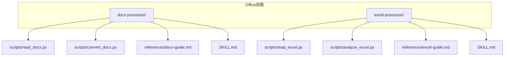
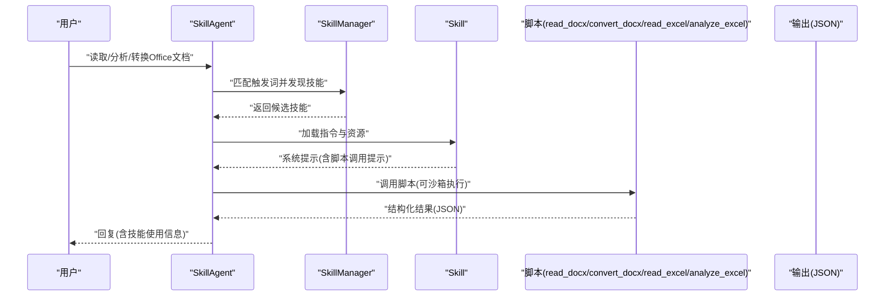
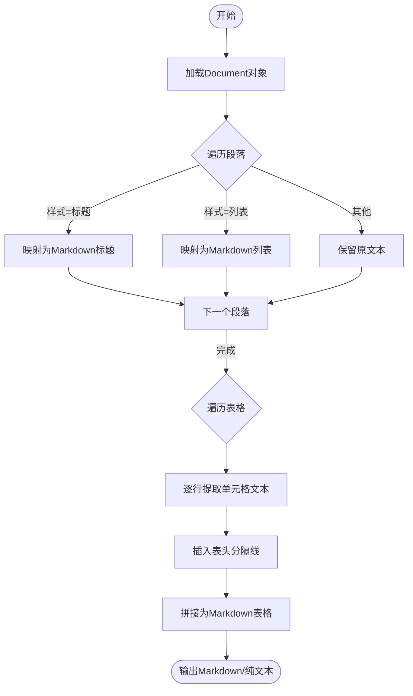
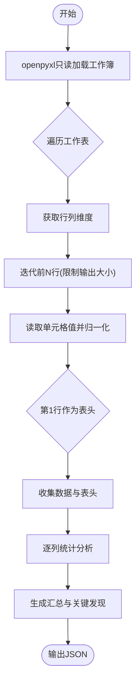
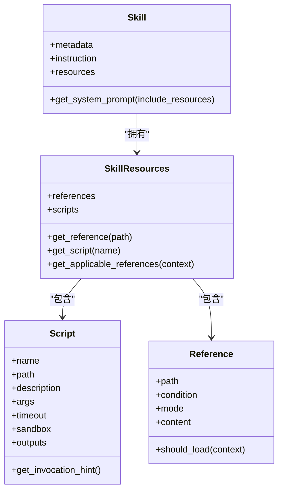
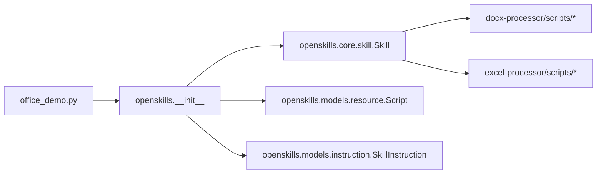

# Office文档处理

<cite>
**本文引用的文件**
- [office_demo.py](file://OpenSkills-main/examples/office-skills/office_demo.py)
- [docx-guide.md](file://OpenSkills-main/examples/office-skills/docx-processor/references/docx-guide.md)
- [excel-guide.md](file://OpenSkills-main/examples/office-skills/excel-processor/references/excel-guide.md)
- [SKILL.md（docx）](file://OpenSkills-main/examples/office-skills/docx-processor/SKILL.md)
- [SKILL.md（excel）](file://OpenSkills-main/examples/office-skills/excel-processor/SKILL.md)
- [convert_docx.py](file://OpenSkills-main/examples/office-skills/docx-processor/scripts/convert_docx.py)
- [read_docx.py](file://OpenSkills-main/examples/office-skills/docx-processor/scripts/read_docx.py)
- [read_excel.py](file://OpenSkills-main/examples/office-skills/excel-processor/scripts/read_excel.py)
- [analyze_excel.py](file://OpenSkills-main/examples/office-skills/excel-processor/scripts/analyze_excel.py)
- [__init__.py（OpenSkills）](file://OpenSkills-main/openskills/__init__.py)
- [skill.py（OpenSkills）](file://OpenSkills-main/openskills/core/skill.py)
- [resource.py（OpenSkills）](file://OpenSkills-main/openskills/models/resource.py)
- [instruction.py（OpenSkills）](file://OpenSkills-main/openskills/models/instruction.py)
</cite>

## 目录
1. [简介](#简介)
2. [项目结构](#项目结构)
3. [核心组件](#核心组件)
4. [架构总览](#架构总览)
5. [组件详解](#组件详解)
6. [依赖关系分析](#依赖关系分析)
7. [性能与内存优化](#性能与内存优化)
8. [故障排查](#故障排查)
9. [结论](#结论)
10. [附录](#附录)

## 简介
本技术文档聚焦于Office文档处理能力，围绕Word（DOCX）与Excel（XLSX）两大处理器展开，系统阐述其内部实现原理、数据流与处理逻辑，并给出转换算法细节、错误处理策略以及性能优化建议。读者将获得如何在OpenSkills框架下使用这些处理器进行文档转换与分析的实操指引。

## 项目结构
该功能位于OpenSkills示例工程中，docx与excel分别作为独立的“技能”（Skill），每个技能包含：
- 技能定义文件（SKILL.md）：声明触发词、依赖、脚本与参考文档
- 脚本目录（scripts/）：具体实现（如读取、分析、转换）
- 参考文档（references/）：处理指南与约束说明

图示来源
- [SKILL.md（docx）](file://OpenSkills-main/examples/office-skills/docx-processor/SKILL.md#L1-L74)
- [SKILL.md（excel）](file://OpenSkills-main/examples/office-skills/excel-processor/SKILL.md#L1-L85)
- [read_docx.py](file://OpenSkills-main/examples/office-skills/docx-processor/scripts/read_docx.py#L1-L105)
- [convert_docx.py](file://OpenSkills-main/examples/office-skills/docx-processor/scripts/convert_docx.py#L1-L126)
- [read_excel.py](file://OpenSkills-main/examples/office-skills/excel-processor/scripts/read_excel.py#L1-L113)
- [analyze_excel.py](file://OpenSkills-main/examples/office-skills/excel-processor/scripts/analyze_excel.py#L1-L151)

章节来源
- [SKILL.md（docx）](file://OpenSkills-main/examples/office-skills/docx-processor/SKILL.md#L1-L74)
- [SKILL.md（excel）](file://OpenSkills-main/examples/office-skills/excel-processor/SKILL.md#L1-L85)

## 核心组件
- DOCX处理器
  - 读取：提取段落、表格、基础元信息
  - 转换：Markdown与纯文本输出
- Excel处理器
  - 读取：多工作表、行列维度、前若干行数据
  - 分析：数值/文本列统计、汇总与关键发现
- OpenSkills框架
  - 技能发现与匹配
  - 脚本资源加载与执行（含沙箱）
  - 系统提示拼装与上下文注入

章节来源
- [read_docx.py](file://OpenSkills-main/examples/office-skills/docx-processor/scripts/read_docx.py#L37-L101)
- [convert_docx.py](file://OpenSkills-main/examples/office-skills/docx-processor/scripts/convert_docx.py#L62-L122)
- [read_excel.py](file://OpenSkills-main/examples/office-skills/excel-processor/scripts/read_excel.py#L19-L110)
- [analyze_excel.py](file://OpenSkills-main/examples/office-skills/excel-processor/scripts/analyze_excel.py#L58-L146)
- [__init__.py（OpenSkills）](file://OpenSkills-main/openskills/__init__.py#L21-L49)

## 架构总览
OpenSkills采用“三层渐进披露”架构：元数据层（总是加载）、指令层（按需加载）、资源层（条件加载）。技能通过SKILL.md声明脚本与参考文档；当用户消息触发某技能时，框架加载指令与必要资源，拼装系统提示，再由LLM决定是否调用脚本。脚本在本地或沙箱中执行，返回结构化JSON结果。

图示来源
- [__init__.py（OpenSkills）](file://OpenSkills-main/openskills/__init__.py#L21-L49)
- [skill.py（OpenSkills）](file://OpenSkills-main/openskills/core/skill.py#L19-L150)
- [resource.py（OpenSkills）](file://OpenSkills-main/openskills/models/resource.py#L112-L204)
- [instruction.py（OpenSkills）](file://OpenSkills-main/openskills/models/instruction.py#L11-L48)

## 组件详解

### DOCX处理器：结构解析、样式保持与内容提取
- 结构解析
  - 读取段落列表与表格集合，记录样式名称与文本
  - 通过样式名映射标题层级（如Heading 1-9）、标题、列表等
- 样式保持
  - 保留段落样式名称，用于后续Markdown/文本映射
  - 表格保持行列结构，首行作为表头分隔线
- 内容提取
  - 段落：过滤空白，保留非空文本与样式
  - 表格：逐行提取单元格文本，形成Markdown表格
- 转换输出
  - Markdown：标题、列表、表格统一转义
  - 纯文本：段落拼接，适合快速浏览

图示来源
- [convert_docx.py](file://OpenSkills-main/examples/office-skills/docx-processor/scripts/convert_docx.py#L18-L59)
- [read_docx.py](file://OpenSkills-main/examples/office-skills/docx-processor/scripts/read_docx.py#L20-L34)

章节来源
- [convert_docx.py](file://OpenSkills-main/examples/office-skills/docx-processor/scripts/convert_docx.py#L18-L122)
- [read_docx.py](file://OpenSkills-main/examples/office-skills/docx-processor/scripts/read_docx.py#L20-L101)
- [docx-guide.md](file://OpenSkills-main/examples/office-skills/docx-processor/references/docx-guide.md#L1-L31)

### Excel处理器：数据读取、统计分析与格式转换
- 数据读取
  - 以只读模式加载工作簿，按工作表顺序读取
  - 限制读取行数（如前100/1000行）以控制输出大小
  - 单元格值统一转为字符串或数值，空值转为空字符串
- 统计分析
  - 数值列：求和、均值、最值、计数
  - 文本列：唯一值数、频次Top N
  - 汇总：统计总行数、最大列数、分析时间戳
- 格式转换
  - 输出结构化JSON，便于前端渲染或二次处理

图示来源
- [read_excel.py](file://OpenSkills-main/examples/office-skills/excel-processor/scripts/read_excel.py#L50-L94)
- [analyze_excel.py](file://OpenSkills-main/examples/office-skills/excel-processor/scripts/analyze_excel.py#L84-L143)

章节来源
- [read_excel.py](file://OpenSkills-main/examples/office-skills/excel-processor/scripts/read_excel.py#L19-L110)
- [analyze_excel.py](file://OpenSkills-main/examples/office-skills/excel-processor/scripts/analyze_excel.py#L19-L146)
- [excel-guide.md](file://OpenSkills-main/examples/office-skills/excel-processor/references/excel-guide.md#L1-L47)

### OpenSkills框架集成与脚本执行
- 技能定义
  - 触发词、依赖（python-docx/openpyxl）、脚本清单与超时
- 资源与脚本
  - 脚本声明包含名称、路径、参数、超时、沙箱开关与输出同步路径
  - 参考文档按条件加载，增强上下文
- 执行流程
  - 发现→匹配→加载指令→拼装系统提示→LLM决策→脚本执行→结果回传

图示来源
- [skill.py（OpenSkills）](file://OpenSkills-main/openskills/core/skill.py#L19-L150)
- [resource.py（OpenSkills）](file://OpenSkills-main/openskills/models/resource.py#L112-L204)

章节来源
- [__init__.py（OpenSkills）](file://OpenSkills-main/openskills/__init__.py#L21-L49)
- [SKILL.md（docx）](file://OpenSkills-main/examples/office-skills/docx-processor/SKILL.md#L17-L38)
- [SKILL.md（excel）](file://OpenSkills-main/examples/office-skills/excel-processor/SKILL.md#L18-L39)

## 依赖关系分析
- 外部库
  - python-docx：DOCX文档读写与样式访问
  - openpyxl：XLSX工作簿读取、只读模式与数据提取
- 内部模块
  - Skill/Resource/Instruction：技能对象与资源层
  - OpenSkills入口：对外暴露create_agent等API

图示来源
- [office_demo.py](file://OpenSkills-main/examples/office-skills/office_demo.py#L130-L394)
- [__init__.py（OpenSkills）](file://OpenSkills-main/openskills/__init__.py#L21-L49)
- [skill.py（OpenSkills）](file://OpenSkills-main/openskills/core/skill.py#L19-L150)
- [resource.py（OpenSkills）](file://OpenSkills-main/openskills/models/resource.py#L112-L204)
- [instruction.py（OpenSkills）](file://OpenSkills-main/openskills/models/instruction.py#L11-L48)

章节来源
- [office_demo.py](file://OpenSkills-main/examples/office-skills/office_demo.py#L130-L394)
- [__init__.py（OpenSkills）](file://OpenSkills-main/openskills/__init__.py#L21-L49)

## 性能与内存优化
- DOCX
  - 分段处理：对长文档分批读取，避免一次性加载全部段落
  - 表格处理：仅提取必要行列，避免深拷贝大矩阵
  - 样式映射：缓存常用样式名到Markdown级别的映射
- Excel
  - 只读模式：load_workbook(read_only=True, data_only=True)降低内存占用
  - 限制读取：通过max_row/min/max_row控制读取范围，避免全量加载
  - 归一化：统一单元格值类型，减少后续处理分支
- 框架层面
  - 资源按需加载：仅在匹配到技能且需要时才加载指令与参考
  - 超时控制：脚本超时上限防止长时间阻塞
  - 输出裁剪：对段落与表格做数量限制，避免过大JSON

章节来源
- [read_docx.py](file://OpenSkills-main/examples/office-skills/docx-processor/scripts/read_docx.py#L68-L97)
- [convert_docx.py](file://OpenSkills-main/examples/office-skills/docx-processor/scripts/convert_docx.py#L91-L122)
- [read_excel.py](file://OpenSkills-main/examples/office-skills/excel-processor/scripts/read_excel.py#L50-L94)
- [analyze_excel.py](file://OpenSkills-main/examples/office-skills/excel-processor/scripts/analyze_excel.py#L84-L143)
- [docx-guide.md](file://OpenSkills-main/examples/office-skills/docx-processor/references/docx-guide.md#L19-L31)
- [excel-guide.md](file://OpenSkills-main/examples/office-skills/excel-processor/references/excel-guide.md#L42-L47)

## 故障排查
- 依赖缺失
  - DOCX：缺少python-docx时，脚本返回安装提示
  - Excel：缺少openpyxl时，脚本返回安装提示
- 文件不存在
  - 输入路径为空或文件不存在，返回错误信息
- 异常捕获
  - 脚本统一捕获异常并以JSON形式返回错误字符串
- 沙箱执行
  - office_demo演示了沙箱模式下的脚本执行回调与结果解析

章节来源
- [convert_docx.py](file://OpenSkills-main/examples/office-skills/docx-processor/scripts/convert_docx.py#L85-L122)
- [read_docx.py](file://OpenSkills-main/examples/office-skills/docx-processor/scripts/read_docx.py#L58-L101)
- [read_excel.py](file://OpenSkills-main/examples/office-skills/excel-processor/scripts/read_excel.py#L41-L110)
- [analyze_excel.py](file://OpenSkills-main/examples/office-skills/excel-processor/scripts/analyze_excel.py#L78-L146)
- [office_demo.py](file://OpenSkills-main/examples/office-skills/office_demo.py#L162-L212)

## 结论
本实现以OpenSkills为载体，将DOCX与XLSX处理封装为可发现、可调用的技能。DOCX侧重结构化内容与样式映射，Excel强调数据读取与统计分析。通过只读模式、限制读取范围与资源按需加载，系统在保证功能完整性的同时兼顾性能与稳定性。结合沙箱执行，可在受控环境下安全地处理本地文件并输出结构化结果。

## 附录

### 使用示例（基于仓库脚本路径）
- DOCX读取
  - 脚本路径：OpenSkills-main/examples/office-skills/docx-processor/scripts/read_docx.py
  - 功能：读取段落、表格与元信息，输出JSON
- DOCX转换
  - 脚本路径：OpenSkills-main/examples/office-skills/docx-processor/scripts/convert_docx.py
  - 功能：转为Markdown或纯文本，输出到临时目录
- Excel读取
  - 脚本路径：OpenSkills-main/examples/office-skills/excel-processor/scripts/read_excel.py
  - 功能：读取多工作表与前若干行数据，输出JSON
- Excel分析
  - 脚本路径：OpenSkills-main/examples/office-skills/excel-processor/scripts/analyze_excel.py
  - 功能：按列统计数值/文本，生成汇总与关键发现

章节来源
- [read_docx.py](file://OpenSkills-main/examples/office-skills/docx-processor/scripts/read_docx.py#L37-L101)
- [convert_docx.py](file://OpenSkills-main/examples/office-skills/docx-processor/scripts/convert_docx.py#L62-L122)
- [read_excel.py](file://OpenSkills-main/examples/office-skills/excel-processor/scripts/read_excel.py#L19-L110)
- [analyze_excel.py](file://OpenSkills-main/examples/office-skills/excel-processor/scripts/analyze_excel.py#L58-L146)