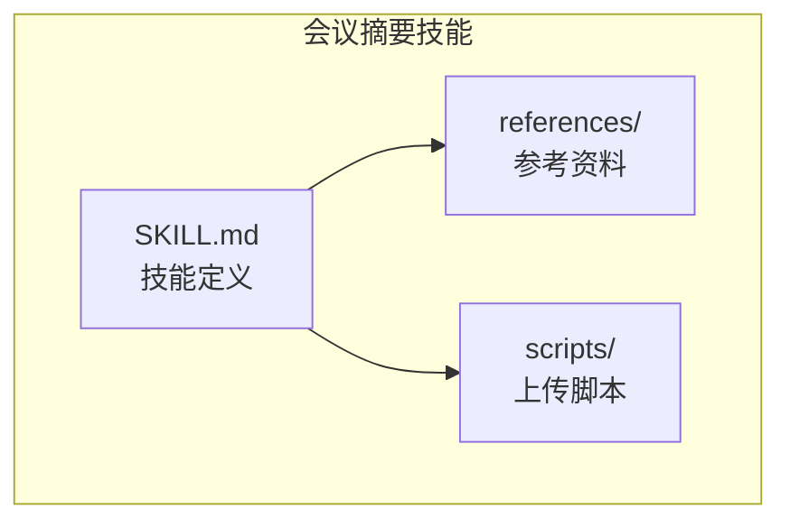
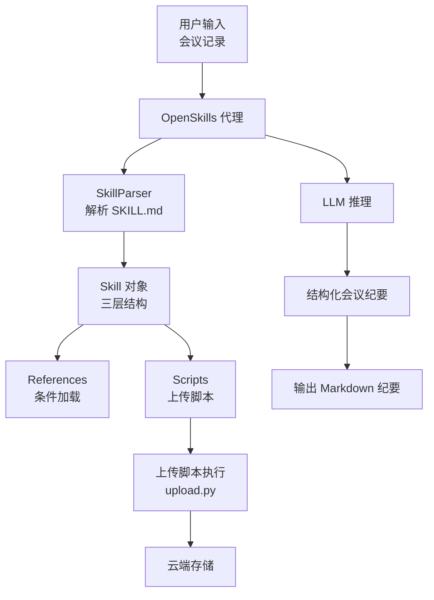
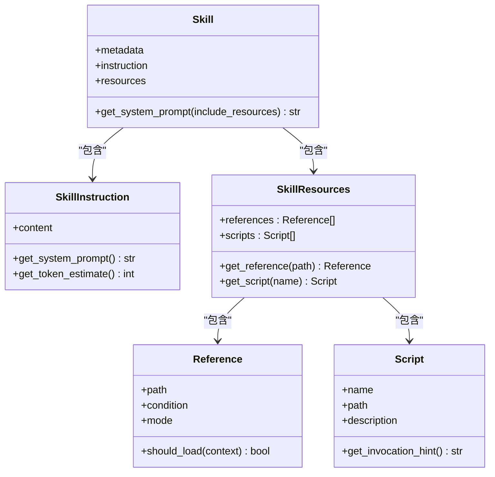
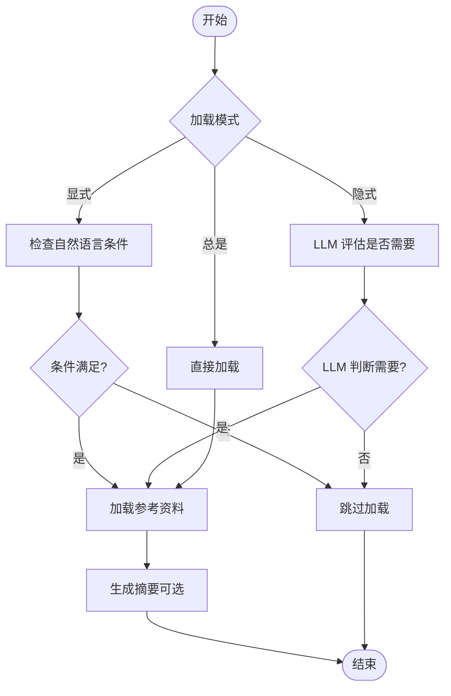
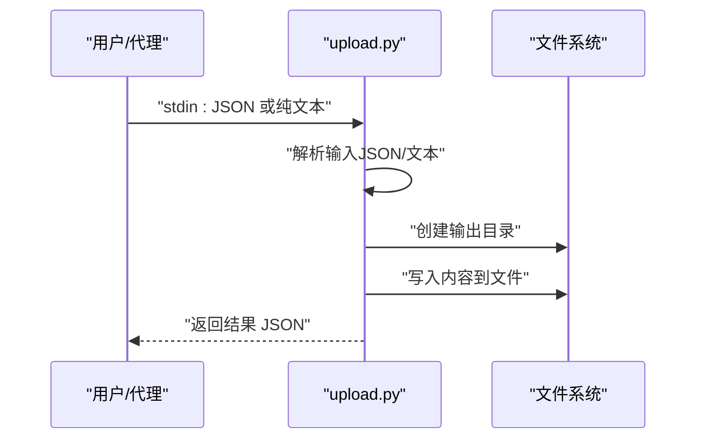
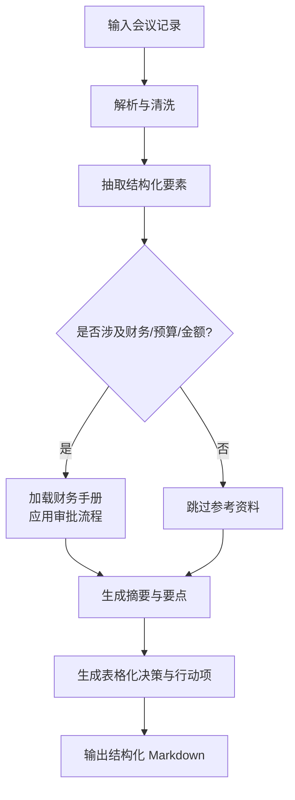
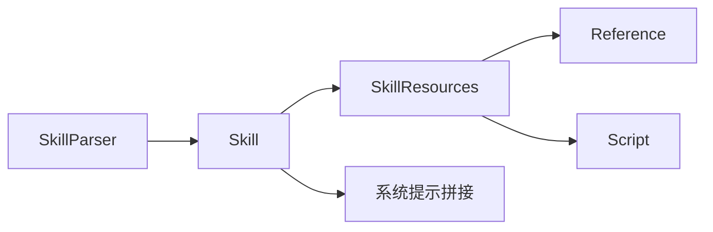

# 会议摘要转换

<cite>
**本文档引用的文件**
- [OpenSkills-main/examples/meeting-summary/SKILL.md](file://OpenSkills-main/examples/meeting-summary/SKILL.md)
- [OpenSkills-main/examples/meeting-summary/scripts/upload.py](file://OpenSkills-main/examples/meeting-summary/scripts/upload.py)
- [OpenSkills-main/examples/meeting-summary/references/finance-handbook.md](file://OpenSkills-main/examples/meeting-summary/references/finance-handbook.md)
- [OpenSkills-main/openskills/core/skill.py](file://OpenSkills-main/openskills/core/skill.py)
- [OpenSkills-main/openskills/core/parser.py](file://OpenSkills-main/openskills/core/parser.py)
- [OpenSkills-main/openskills/models/resource.py](file://OpenSkills-main/openskills/models/resource.py)
- [OpenSkills-main/openskills/models/instruction.py](file://OpenSkills-main/openskills/models/instruction.py)
- [OpenSkills-main/openskills/agent.py](file://OpenSkills-main/openskills/agent.py)
- [OpenSkills-main/tests/test_parser.py](file://OpenSkills-main/tests/test_parser.py)
- [OpenSkills-main/tests/test_matcher.py](file://OpenSkills-main/tests/test_matcher.py)
- [docs/接口层设计/Tauri通信接口.md](file://docs/接口层设计/Tauri通信接口.md)
</cite>

## 目录
1. [引言](#引言)
2. [项目结构](#项目结构)
3. [核心组件](#核心组件)
4. [架构总览](#架构总览)
5. [详细组件分析](#详细组件分析)
6. [依赖关系分析](#依赖关系分析)
7. [性能考虑](#性能考虑)
8. [故障排除指南](#故障排除指南)
9. [结论](#结论)
10. [附录](#附录)

## 引言
本文件面向需要实现“会议摘要转换”能力的技术与非技术读者，系统化阐述该功能的完整处理流程与实现原理。文档覆盖从输入会议记录到生成结构化会议纪要的全过程，包括：
- 会议记录处理流程：输入接收、内容解析、摘要生成与结构化输出
- 上传处理脚本：文件上传、格式验证与内容解析
- 摘要生成机制：关键信息抽取、语义分析与内容压缩
- 参考资料集成：与金融手册等参考资料的条件加载与引用
- 错误处理与异常应对
- 性能优化与大规模处理最佳实践

## 项目结构
会议摘要转换功能位于 OpenSkills 示例工程中，采用“技能（Skill）+ 参考资料（References）+ 脚本（Scripts）”的组织方式：
- 技能定义：通过 SKILL.md 描述技能名称、触发词、标签、依赖、参考资料与脚本
- 参考资料：references/ 目录下的文档（如财务手册），按条件加载
- 脚本：scripts/ 目录下的可执行脚本（如上传脚本）

**图表来源**
- [OpenSkills-main/examples/meeting-summary/SKILL.md](file://OpenSkills-main/examples/meeting-summary/SKILL.md#L1-L82)
- [OpenSkills-main/examples/meeting-summary/scripts/upload.py](file://OpenSkills-main/examples/meeting-summary/scripts/upload.py#L1-L49)
- [OpenSkills-main/examples/meeting-summary/references/finance-handbook.md](file://OpenSkills-main/examples/meeting-summary/references/finance-handbook.md#L1-L35)

**章节来源**
- [OpenSkills-main/examples/meeting-summary/SKILL.md](file://OpenSkills-main/examples/meeting-summary/SKILL.md#L1-L82)

## 核心组件
- 技能对象（Skill）：封装三层渐进式加载结构（元数据、指令、资源），负责生成系统提示与资源解析
- 解析器（SkillParser）：解析 SKILL.md，构建 Skill 对象，支持元数据与全文解析
- 资源模型（Reference/Script）：定义参考资料与脚本的结构、加载模式与调用提示
- 指令模型（SkillInstruction）：承载技能规则与指导内容
- 代理（Agent）：负责条件加载参考资料、生成摘要与脚本调用

**章节来源**
- [OpenSkills-main/openskills/core/skill.py](file://OpenSkills-main/openskills/core/skill.py#L1-L150)
- [OpenSkills-main/openskills/core/parser.py](file://OpenSkills-main/openskills/core/parser.py#L1-L225)
- [OpenSkills-main/openskills/models/resource.py](file://OpenSkills-main/openskills/models/resource.py#L1-L204)
- [OpenSkills-main/openskills/models/instruction.py](file://OpenSkills-main/openskills/models/instruction.py#L1-L48)
- [OpenSkills-main/openskills/agent.py](file://OpenSkills-main/openskills/agent.py#L629-L667)

## 架构总览
会议摘要转换的整体架构围绕“技能驱动 + 条件加载 + 脚本执行”的模式展开：

**图表来源**
- [OpenSkills-main/openskills/core/parser.py](file://OpenSkills-main/openskills/core/parser.py#L33-L100)
- [OpenSkills-main/openskills/core/skill.py](file://OpenSkills-main/openskills/core/skill.py#L103-L132)
- [OpenSkills-main/examples/meeting-summary/scripts/upload.py](file://OpenSkills-main/examples/meeting-summary/scripts/upload.py#L15-L44)

## 详细组件分析

### 1) 技能定义与系统提示生成
- 触发词与标签：技能通过触发词与标签进行匹配，支持中英文关键词
- 依赖声明：声明系统依赖（如创建上传目录）
- 参考资料：定义条件加载的参考资料（如财务手册）
- 脚本：声明可执行脚本（如上传）
- 系统提示：由指令内容、可用动作提示与已加载参考资料拼接而成

**图表来源**
- [OpenSkills-main/openskills/core/skill.py](file://OpenSkills-main/openskills/core/skill.py#L19-L150)
- [OpenSkills-main/openskills/models/instruction.py](file://OpenSkills-main/openskills/models/instruction.py#L11-L48)
- [OpenSkills-main/openskills/models/resource.py](file://OpenSkills-main/openskills/models/resource.py#L45-L200)

**章节来源**
- [OpenSkills-main/examples/meeting-summary/SKILL.md](file://OpenSkills-main/examples/meeting-summary/SKILL.md#L1-L82)
- [OpenSkills-main/openskills/core/skill.py](file://OpenSkills-main/openskills/core/skill.py#L103-L132)
- [OpenSkills-main/openskills/models/instruction.py](file://OpenSkills-main/openskills/models/instruction.py#L29-L47)

### 2) 参考资料加载与条件判断
- 加载模式：显式（explicit）、隐式（implicit）、总是（always）
- 条件加载：基于自然语言条件或 LLM 评估
- 回忆摘要：为已加载参考资料生成简短摘要，便于后续记忆保持

**图表来源**
- [OpenSkills-main/openskills/models/resource.py](file://OpenSkills-main/openskills/models/resource.py#L38-L109)
- [OpenSkills-main/openskills/agent.py](file://OpenSkills-main/openskills/agent.py#L634-L660)

**章节来源**
- [OpenSkills-main/openskills/models/resource.py](file://OpenSkills-main/openskills/models/resource.py#L38-L109)
- [OpenSkills-main/openskills/agent.py](file://OpenSkills-main/openskills/agent.py#L634-L660)

### 3) 上传处理脚本（upload.py）
- 输入：从标准输入读取 JSON（包含 content 与 filename），若非 JSON 则视为纯文本
- 处理：将内容写入指定输出目录（模拟云端上传）
- 输出：返回 JSON 结果，包含状态、消息、路径、大小与时间戳

**图表来源**
- [OpenSkills-main/examples/meeting-summary/scripts/upload.py](file://OpenSkills-main/examples/meeting-summary/scripts/upload.py#L15-L44)

**章节来源**
- [OpenSkills-main/examples/meeting-summary/scripts/upload.py](file://OpenSkills-main/examples/meeting-summary/scripts/upload.py#L1-L49)

### 4) 摘要生成算法工作原理
- 关键信息抽取：基于结构化输出模板，抽取会议信息、议题摘要、讨论要点、决策事项与行动项
- 语义分析：结合参考资料（如财务手册）进行条件性增强，确保财务相关内容符合审批流程
- 内容压缩：通过 LLM 生成摘要与要点，控制输出长度与可读性

**图表来源**
- [OpenSkills-main/examples/meeting-summary/SKILL.md](file://OpenSkills-main/examples/meeting-summary/SKILL.md#L33-L81)
- [OpenSkills-main/examples/meeting-summary/references/finance-handbook.md](file://OpenSkills-main/examples/meeting-summary/references/finance-handbook.md#L1-L35)

**章节来源**
- [OpenSkills-main/examples/meeting-summary/SKILL.md](file://OpenSkills-main/examples/meeting-summary/SKILL.md#L33-L81)
- [OpenSkills-main/examples/meeting-summary/references/finance-handbook.md](file://OpenSkills-main/examples/meeting-summary/references/finance-handbook.md#L1-L35)

### 5) 使用示例
- 示例1：常规会议记录
  - 输入：会议录音或文字记录
  - 处理：解析记录，生成议题摘要、讨论要点、决策事项与行动项
  - 输出：结构化 Markdown 纪要
- 示例2：涉及财务的会议
  - 输入：包含预算、金额或审批流程的会议记录
  - 处理：自动加载财务手册，校验审批流程与敏感信息处理
  - 输出：带财务合规标注的会议纪要

**章节来源**
- [OpenSkills-main/examples/meeting-summary/SKILL.md](file://OpenSkills-main/examples/meeting-summary/SKILL.md#L33-L81)

## 依赖关系分析
- 技能解析依赖：SkillParser 依赖 Frontmatter 解析与模型定义
- 资源解析依赖：Skill 对象解析相对路径，生成系统提示时合并指令与参考资料
- 脚本调用依赖：脚本通过名称在资源容器中查找并生成调用提示

**图表来源**
- [OpenSkills-main/openskills/core/parser.py](file://OpenSkills-main/openskills/core/parser.py#L33-L100)
- [OpenSkills-main/openskills/core/skill.py](file://OpenSkills-main/openskills/core/skill.py#L83-L132)
- [OpenSkills-main/openskills/models/resource.py](file://OpenSkills-main/openskills/models/resource.py#L180-L200)

**章节来源**
- [OpenSkills-main/openskills/core/parser.py](file://OpenSkills-main/openskills/core/parser.py#L1-L225)
- [OpenSkills-main/openskills/core/skill.py](file://OpenSkills-main/openskills/core/skill.py#L1-L150)
- [OpenSkills-main/openskills/models/resource.py](file://OpenSkills-main/openskills/models/resource.py#L1-L204)

## 性能考虑
- 渐进式加载：仅在需要时加载指令与参考资料，减少初始 Token 消耗
- 参考资料摘要：为已加载参考资料生成简短摘要，降低重复加载成本
- 脚本执行：脚本仅返回结果而非源码，节省 Token 并提高安全性
- 大规模处理建议：
  - 分批处理会议记录，避免一次性加载过多参考资料
  - 使用缓存机制存储已加载的参考资料摘要
  - 控制输出模板字段数量，优先保留关键信息
  - 在沙箱环境中执行脚本，确保隔离与稳定性

[本节为通用性能建议，无需特定文件来源]

## 故障排除指南
- 输入格式错误
  - 现象：上传脚本无法解析输入
  - 处理：确认 stdin 为合法 JSON；若非 JSON，脚本会将其视为纯文本内容
- 资料加载失败
  - 现象：参考资料未被加载或加载失败
  - 处理：检查条件表达式与文件路径；必要时回退至保守策略（不加载）
- 上传失败
  - 现象：脚本执行成功但输出路径不可达
  - 处理：确认系统依赖（如上传目录）已创建；检查权限与磁盘空间
- 通信与事件
  - 前端/后端错误处理：捕获调用异常、超时与数据库错误，发送事件通知

**章节来源**
- [OpenSkills-main/examples/meeting-summary/scripts/upload.py](file://OpenSkills-main/examples/meeting-summary/scripts/upload.py#L17-L23)
- [OpenSkills-main/openskills/agent.py](file://OpenSkills-main/openskills/agent.py#L631-L632)
- [docs/接口层设计/Tauri通信接口.md](file://docs/接口层设计/Tauri通信接口.md#L732-L780)

## 结论
会议摘要转换功能通过“技能 + 条件加载 + 脚本执行”的架构，实现了从会议记录到结构化纪要的自动化处理。其核心优势在于：
- 渐进式加载与条件引用，提升上下文效率与准确性
- 明确的输出模板与脚本化上传，保证产物一致性与可扩展性
- 与参考资料（如财务手册）的集成，强化合规性与专业性

在实际部署中，建议结合大规模处理的最佳实践与完善的错误处理策略，持续优化性能与稳定性。

[本节为总结性内容，无需特定文件来源]

## 附录

### A. 技能解析与匹配测试
- 测试用例覆盖：最小技能解析、仅元数据解析、含参考资料解析
- 匹配测试：中英文触发词与标签匹配，确保技能正确识别

**章节来源**
- [OpenSkills-main/tests/test_parser.py](file://OpenSkills-main/tests/test_parser.py#L58-L113)
- [OpenSkills-main/tests/test_matcher.py](file://OpenSkills-main/tests/test_matcher.py#L45-L85)