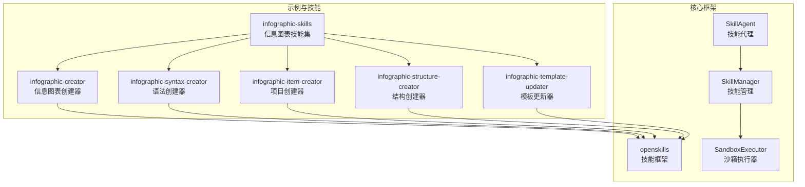
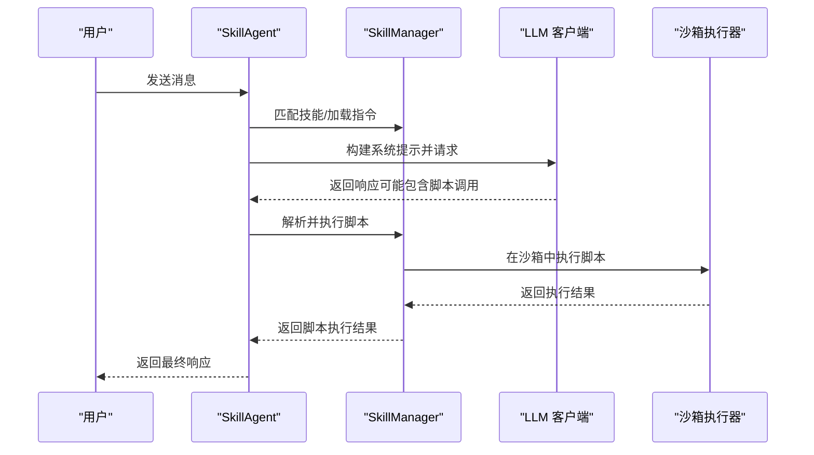
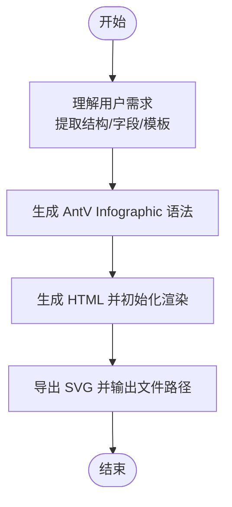
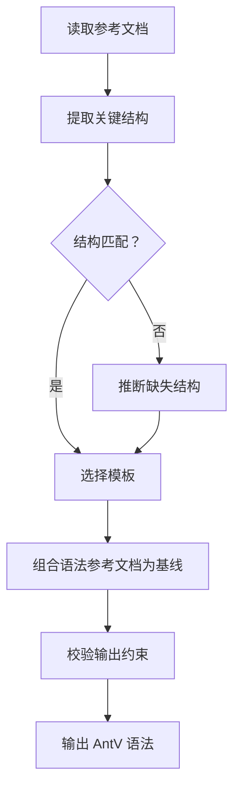
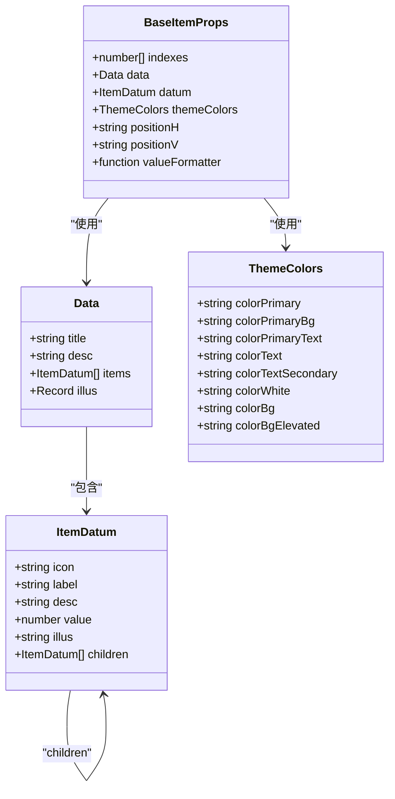
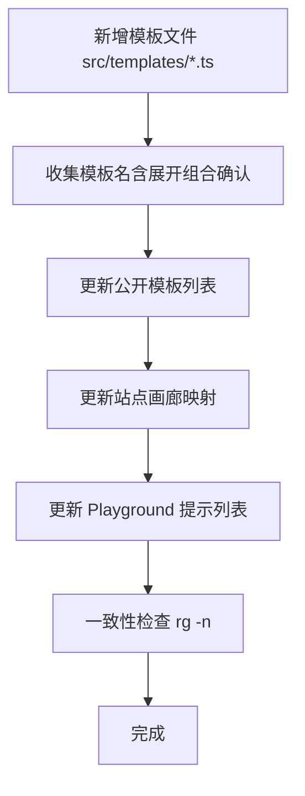
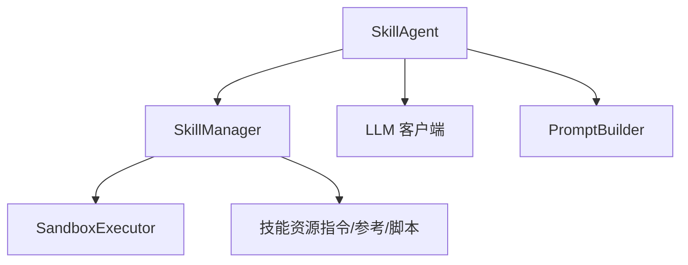

# 信息图表生成

<cite>
**本文引用的文件**
- [OpenSkills 主仓库 README](file://OpenSkills-main/README.md)
- [信息图表技能总览 SKILL.md](file://OpenSkills-main/examples/infographic-skills/infographic-creator/SKILL.md)
- [信息图表项目 SKILL.md](file://OpenSkills-main/examples/infographic-skills/infographic-item-creator/SKILL.md)
- [信息图表结构 SKILL.md](file://OpenSkills-main/examples/infographic-skills/infographic-structure-creator/SKILL.md)
- [信息图表语法 SKILL.md](file://OpenSkills-main/examples/infographic-skills/infographic-syntax-creator/SKILL.md)
- [信息图表模板更新 SKILL.md](file://OpenSkills-main/examples/infographic-skills/infographic-template-updater/SKILL.md)
- [信息图表演示脚本](file://OpenSkills-main/examples/infographic_demo.py)
- [沙箱测试脚本](file://OpenSkills-main/examples/test_sandbox.py)
- [OpenSkills 核心导出](file://OpenSkills-main/openskills/__init__.py)
- [OpenSkills 技能代理](file://OpenSkills-main/openskills/agent.py)
- [信息图表数据项组件生成规范](file://OpenSkills-main/examples/infographic-skills/infographic-item-creator/references/item-prompt.md)
</cite>

## 目录
1. [简介](#简介)
2. [项目结构](#项目结构)
3. [核心组件](#核心组件)
4. [架构总览](#架构总览)
5. [组件详解](#组件详解)
6. [依赖关系分析](#依赖关系分析)
7. [性能考量](#性能考量)
8. [故障排查指南](#故障排查指南)
9. [结论](#结论)
10. [附录](#附录)

## 简介
本项目围绕“信息图表生成系统”构建，目标是将自然语言内容结构化为可渲染的 AntV Infographic DSL，并进一步生成可在浏览器中预览与导出的 HTML 文件。系统采用“技能（Skill）+ 参考资料（Reference）+ 脚本（Script）”的组合，借助 LLM 进行技能路由与上下文感知，支持沙箱执行与模板更新自动化。

系统提供三大核心能力：
- 信息图表创建器：将用户输入转化为 AntV Infographic DSL，并生成可导出 SVG 的 HTML 文件。
- 项目创建器：生成信息图表数据项（Item）组件，遵循统一的类型、布局与注册规范。
- 结构创建器：生成信息图表结构（Structure）组件，负责布局与组合逻辑。
- 语法创建器：将用户内容映射为 AntV Infographic 语法，严格遵循模板、数据与主题规范。
- 模板更新器：在新增模板后，同步更新公开模板列表、站点画廊映射与 Playground 提示列表。

## 项目结构
该仓库采用“示例 + 核心框架”的组织方式：
- examples/infographic-skills：信息图表相关技能与参考文档
- openskills：OpenSkills 核心框架（技能发现、匹配、执行与沙箱）
- 其他示例与工具：多图表绘制、办公技能等

**图表来源**
- [信息图表技能总览 SKILL.md](file://OpenSkills-main/examples/infographic-skills/infographic-creator/SKILL.md#L1-L377)
- [OpenSkills 技能代理](file://OpenSkills-main/openskills/agent.py#L61-L858)

**章节来源**
- [OpenSkills 主仓库 README](file://OpenSkills-main/README.md)
- [信息图表技能总览 SKILL.md](file://OpenSkills-main/examples/infographic-skills/infographic-creator/SKILL.md#L1-L377)

## 核心组件
- 信息图表创建器（infographic-creator）
  - 职责：将用户输入解析为 AntV Infographic DSL，生成 HTML 并支持 SVG 导出。
  - 关键流程：需求理解 → 语法生成 → HTML 渲染 → 文件输出。
- 语法创建器（infographic-syntax-creator）
  - 职责：将用户内容映射为 AntV Infographic 语法，遵循模板、数据与主题规范。
- 项目创建器（infographic-item-creator）
  - 职责：生成数据项组件（Item），遵循类型、布局与注册规范。
- 结构创建器（infographic-structure-creator）
  - 职责：生成结构组件（Structure），负责布局与组合逻辑。
- 模板更新器（infographic-template-updater）
  - 职责：新增模板后，同步更新公开模板列表与站点映射。

**章节来源**
- [信息图表技能总览 SKILL.md](file://OpenSkills-main/examples/infographic-skills/infographic-creator/SKILL.md#L14-L377)
- [信息图表语法 SKILL.md](file://OpenSkills-main/examples/infographic-skills/infographic-syntax-creator/SKILL.md#L1-L23)
- [信息图表项目 SKILL.md](file://OpenSkills-main/examples/infographic-skills/infographic-item-creator/SKILL.md#L1-L24)
- [信息图表结构 SKILL.md](file://OpenSkills-main/examples/infographic-skills/infographic-structure-creator/SKILL.md#L1-L24)
- [信息图表模板更新 SKILL.md](file://OpenSkills-main/examples/infographic-skills/infographic-template-updater/SKILL.md#L1-L28)

## 架构总览
系统采用“技能路由 + 参考加载 + 脚本执行 + 沙箱隔离”的架构，LLM 负责技能选择与参考评估，核心框架负责资源加载与执行编排。

**图表来源**
- [OpenSkills 技能代理](file://OpenSkills-main/openskills/agent.py#L228-L403)
- [信息图表演示脚本](file://OpenSkills-main/examples/infographic_demo.py#L32-L94)

**章节来源**
- [OpenSkills 技能代理](file://OpenSkills-main/openskills/agent.py#L61-L858)
- [信息图表演示脚本](file://OpenSkills-main/examples/infographic_demo.py#L32-L94)

## 组件详解

### 信息图表创建器（DSL 生成与 HTML 渲染）
- 语法规范
  - 模板：首行固定为 infographic <template-name>，模板来自可用模板列表。
  - 数据块：data 下使用两空格缩进，键值对使用“键 值”，数组使用“-”前缀。
  - 主数据字段选择：按模板类别选择 lists/sequences/compares/items 等，避免混用。
  - 主题：theme 支持 palette、font、stylize 等。
- 数据语法示例
  - 列表类：使用 lists 字段。
  - 顺序类：使用 sequences，可选 order asc|desc。
  - 层级类：hierarchy-structure 使用 items，hierarchy-* 使用 root + children。
  - 对比类：compare-* 使用 compares，支持 children 分组。
  - 图表类：chart-* 使用 values，可选 category。
  - 关系类：relation-* 使用 nodes + relations，或简化箭头语法。
- 模板选择建议
  - 严格顺序：sequence-*（时间线、阶梯图、路线图、折线路径、环形进度、彩色蛇形步骤、金字塔）。
  - 观点列举：list-row-* 或 list-column-*。
  - 二元对比：compare-binary-*。
  - SWOT：compare-swot。
  - 层级结构：hierarchy-tree-*。
  - 数据图表：chart-*。
  - 象限分析：quadrant-*。
  - 网格列表：list-grid-*。
  - 关系展示：relation-*。
  - 词云：chart-wordcloud。
  - 思维导图：hierarchy-mindmap-*。
- 生成流程
  - 第一步：理解用户需求，提取关键信息结构，明确所需数据字段，选择合适模板。
  - 第二步：渲染信息图，生成包含容器与初始化脚本的 HTML 文件，支持 SVG 导出。

**图表来源**
- [信息图表技能总览 SKILL.md](file://OpenSkills-main/examples/infographic-skills/infographic-creator/SKILL.md#L318-L377)

**章节来源**
- [信息图表技能总览 SKILL.md](file://OpenSkills-main/examples/infographic-skills/infographic-creator/SKILL.md#L14-L377)

### 语法创建器（AntV Infographic 语法生成）
- 职责：将用户内容映射为 AntV Infographic 语法，遵循参考文档的规则与输出约束。
- 工作流：
  - 读取参考文档，明确语法规则、模板与输出限制。
  - 提取用户关键结构（title、desc、items、hierarchy、metrics），必要时推断缺失部分。
  - 选择匹配结构的模板。
  - 以参考文档为格式基线，组合语法。
  - 严格遵守输出约束：单个 plain 代码块、首行 template、两空格缩进、数组使用“-”、二元对比模板必须有两个根节点且 children。

**图表来源**
- [信息图表语法 SKILL.md](file://OpenSkills-main/examples/infographic-skills/infographic-syntax-creator/SKILL.md#L12-L23)

**章节来源**
- [信息图表语法 SKILL.md](file://OpenSkills-main/examples/infographic-skills/infographic-syntax-creator/SKILL.md#L1-L23)

### 项目创建器（数据项组件生成）
- 职责：生成信息图表数据项（Item）组件，遵循统一类型、布局与注册规范。
- 技术规范要点：
  - 类型定义：BaseItemProps、Data、ItemDatum、ThemeColors。
  - 可用组件：原子组件（Rect、Ellipse、Path、Polygon、Group、ShapesGroup、Text、Defs）、封装组件（ItemIcon、ItemIconCircle、ItemLabel、ItemDesc、ItemValue、Illus、Gap）、布局组件（FlexLayout、AlignLayout）。
  - 工具函数：getElementBounds、getItemProps、getItemKeyFromIndexes。
  - 导入模板与第三方库支持（d3、lodash-es、tinycolor2、round-polygon）。
  - composites 字段规则：根据实际使用的封装组件确定。
  - 约束规则：仅使用列出的组件与属性、图形组件使用 x/y/width/height 定位、传递 indexes、正确使用 tinycolor、避免负坐标、条件渲染可选元素、注册时提供 composites。
- 命名规范：组件名大驼峰、注册名小写连字符、Props 接口组件名+Props、常量大写下划线。
- 生成流程：理解需求 → 设计布局 → 编写代码 → 验证输出。

**图表来源**
- [信息图表数据项组件生成规范](file://OpenSkills-main/examples/infographic-skills/infographic-item-creator/references/item-prompt.md#L47-L98)

**章节来源**
- [信息图表项目 SKILL.md](file://OpenSkills-main/examples/infographic-skills/infographic-item-creator/SKILL.md#L1-L24)
- [信息图表数据项组件生成规范](file://OpenSkills-main/examples/infographic-skills/infographic-item-creator/references/item-prompt.md#L1-L800)

### 结构创建器（结构组件生成）
- 职责：生成信息图表结构（Structure）组件，负责布局与组合逻辑。
- 工作流：
  - 读取结构参考文档，明确框架规则、允许组件与输出要求。
  - 明确最小需求：结构类别、布局方向、层级深度、是否需要增删按钮。
  - 选择 Item/Items，从 getElementBounds 计算布局，在 ItemsGroup 下规划装饰元素。
  - 生成完整 TypeScript 文件：导入、Props 扩展、组件实现、registerStructure 与准确的 composites。
  - 自检：不使用未列出组件、不使用 SVG cx/cy/r、正确传递 indexes、空状态处理。

**章节来源**
- [信息图表结构 SKILL.md](file://OpenSkills-main/examples/infographic-skills/infographic-structure-creator/SKILL.md#L1-L24)

### 模板更新器（模板版本管理与自动更新）
- 职责：新增模板后，同步更新公开模板列表、站点画廊映射与 Playground 提示列表。
- 工作流：
  - 从新增的 src/templates/*.ts 收集模板名（对象键）；若通过展开组合（如 ...listZigzagTemplates），还需确认 src/templates/built-in.ts 中的最终键。
  - 更新三处模板列表：信息图表创建器 SKILL.md 的“可用模板”列表、站点 AIPlayground Prompt 列表、语法创建器参考文档模板列表；保持现有排序/分组，将新的 list-* 条目靠近其他列表模板。
  - 使用 rg -n "<template-name>" 在上述文件中进行一致性检查，确认存在。
- 注意事项：不移除或重命名现有条目；模板名保持精确的小写；若模板需要示例数据，更新或扩展站点画廊 datasets.ts 以匹配其结构。

**图表来源**
- [信息图表模板更新 SKILL.md](file://OpenSkills-main/examples/infographic-skills/infographic-template-updater/SKILL.md#L12-L28)

**章节来源**
- [信息图表模板更新 SKILL.md](file://OpenSkills-main/examples/infographic-skills/infographic-template-updater/SKILL.md#L1-L28)

### 应用示例：创建不同类型的信息图表
- 饼图示例：使用 chart-* 模板，values 字段包含 label 与 value。
- SWOT 分析：使用 compare-swot 模板，compares 字段包含 Strengths/Low Cost 等分组及其 children。
- 层级结构：使用 hierarchy-structure 或 hierarchy-*，root + children 嵌套。
- 关系图：使用 relation-* 模板，nodes + relations 或简化箭头语法。
- 列表网格：使用 list-grid-* 模板，lists 字段包含 label 与 icon。
- 时间线/路线图：使用 sequence-* 模板，sequences 字段与可选 order asc|desc。

**章节来源**
- [信息图表技能总览 SKILL.md](file://OpenSkills-main/examples/infographic-skills/infographic-creator/SKILL.md#L88-L185)

### 自定义配置与扩展开发
- 自定义主题：通过 theme 指定 palette、font-family、stylize（rough、pattern、linear-gradient、radial-gradient）等。
- 数据字段映射：根据模板类别选择 lists/sequences/compares/items 等，避免混用。
- 组件扩展：在 src/designs/items 与 src/designs/structures 下新增组件，遵循类型、布局与注册规范，确保 composites 准确。
- 模板扩展：在 src/templates 新增模板后，使用模板更新器同步更新公共列表与映射。

**章节来源**
- [信息图表技能总览 SKILL.md](file://OpenSkills-main/examples/infographic-skills/infographic-creator/SKILL.md#L58-L84)
- [信息图表数据项组件生成规范](file://OpenSkills-main/examples/infographic-skills/infographic-item-creator/references/item-prompt.md#L403-L433)
- [信息图表模板更新 SKILL.md](file://OpenSkills-main/examples/infographic-skills/infographic-template-updater/SKILL.md#L14-L21)

## 依赖关系分析
- 技能代理（SkillAgent）负责对话状态、技能选择、参考加载与脚本执行。
- 技能管理（SkillManager）负责技能发现、指令加载与脚本执行。
- 沙箱执行（SandboxExecutor）提供隔离执行环境，保障安全性。
- LLM 客户端负责聊天与流式响应，以及技能选择与参考评估。

**图表来源**
- [OpenSkills 技能代理](file://OpenSkills-main/openskills/agent.py#L131-L138)
- [OpenSkills 核心导出](file://OpenSkills-main/openskills/__init__.py#L21-L49)

**章节来源**
- [OpenSkills 技能代理](file://OpenSkills-main/openskills/agent.py#L61-L858)
- [OpenSkills 核心导出](file://OpenSkills-main/openskills/__init__.py#L1-L50)

## 性能考量
- 参考加载策略：优先加载 ALWAYS 模式的参考，其余通过 LLM 评估后按需加载，减少令牌消耗与延迟。
- 跨轮次记忆：为已加载参考生成摘要，用于后续轮次回顾，避免重复加载完整内容。
- 沙箱预热：在初始化时预安装技能依赖，减少首次执行延迟。
- 生成流程优化：在生成 HTML 前确保语法正确，避免二次回溯；使用合适的模板与数据字段，减少不必要的嵌套与复杂度。

**章节来源**
- [OpenSkills 技能代理](file://OpenSkills-main/openskills/agent.py#L471-L524)
- [OpenSkills 技能代理](file://OpenSkills-main/openskills/agent.py#L634-L661)
- [OpenSkills 技能代理](file://OpenSkills-main/openskills/agent.py#L168-L177)

## 故障排查指南
- 沙箱执行失败：检查沙箱服务地址与网络连通性，确认依赖安装与脚本权限。
- 技能选择异常：确认技能目录路径与权限，检查技能元数据与描述是否正确。
- 参考加载失败：检查参考路径与访问权限，确认 LLM 评估逻辑与返回格式。
- 语法生成错误：核对模板名、数据字段与缩进格式，确保输出为单个 plain 代码块。

**章节来源**
- [沙箱测试脚本](file://OpenSkills-main/examples/test_sandbox.py#L10-L85)
- [信息图表演示脚本](file://OpenSkills-main/examples/infographic_demo.py#L32-L94)

## 结论
本系统通过“技能 + 参考 + 脚本 + 沙箱”的组合，实现了从自然语言到信息图表的自动化生成。信息图表创建器负责 DSL 生成与 HTML 渲染，语法创建器确保输出规范，项目与结构创建器提供可扩展的组件体系，模板更新器保障模板生态的持续演进。结合 LLM 的智能路由与参考加载，系统在准确性与可维护性之间取得平衡，适合在多场景下进行批量生成与定制化扩展。

## 附录
- 快速开始：启动沙箱服务后，运行信息图表演示脚本，观察 LLM 如何自动选择技能与加载参考。
- 环境变量：OPENAI_API_KEY、OPENAI_BASE_URL、OPENAI_MODEL、SANDBOX_URL。
- 模板列表：参考信息图表创建器 SKILL.md 的“可用模板”部分，或通过模板更新器同步更新后的列表。

**章节来源**
- [信息图表演示脚本](file://OpenSkills-main/examples/infographic_demo.py#L8-L20)
- [信息图表技能总览 SKILL.md](file://OpenSkills-main/examples/infographic-skills/infographic-creator/SKILL.md#L200-L281)