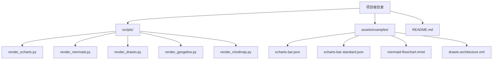
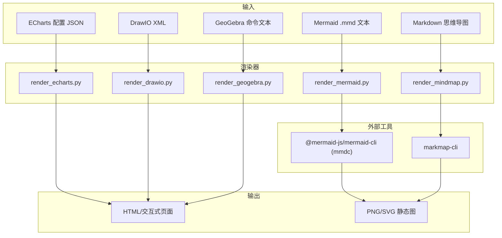
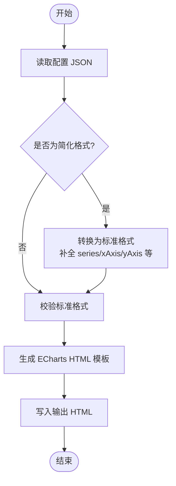
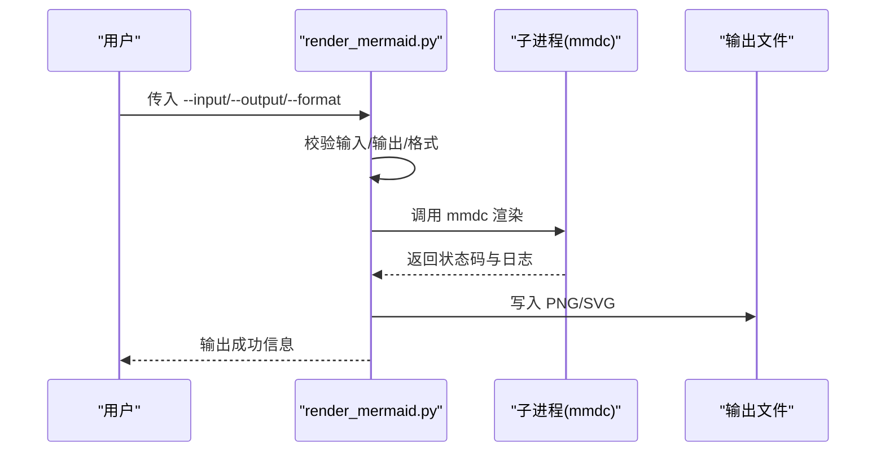
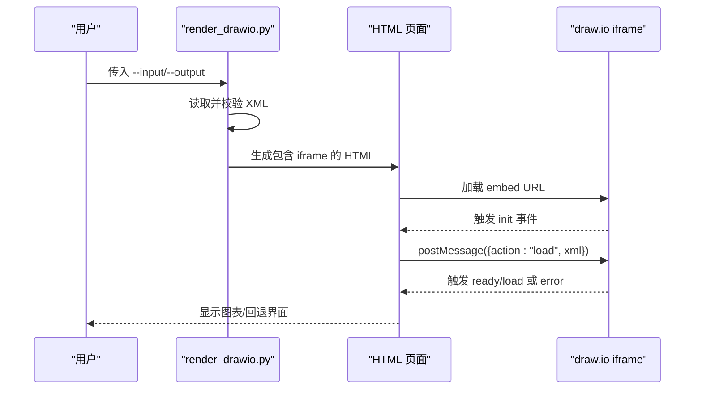
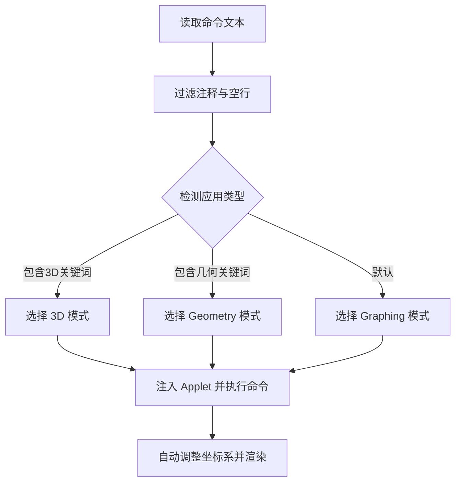
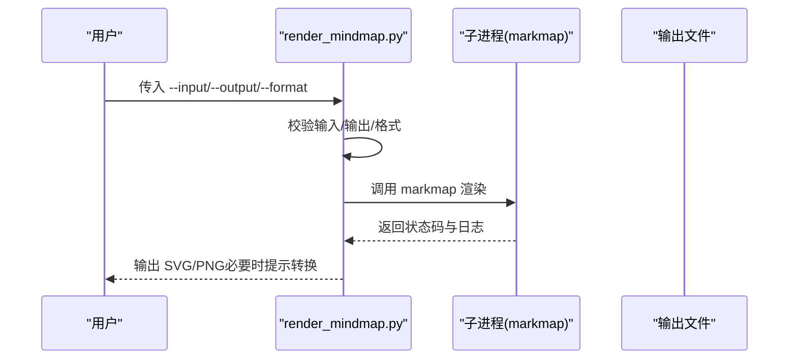
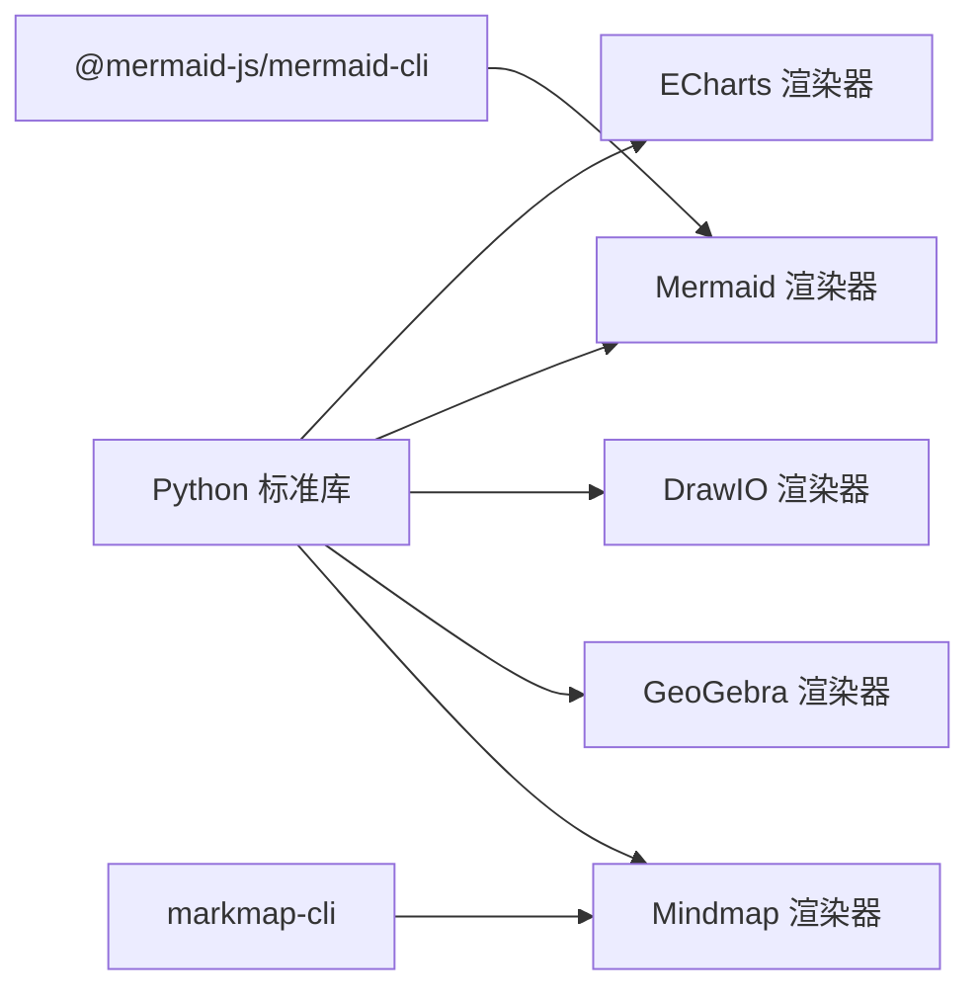

# 图表可视化转换

<cite>
**本文引用的文件**
- [render_echarts.py](file://OpenSkills-main/examples/multi-chart-draw/scripts/render_echarts.py)
- [render_mermaid.py](file://OpenSkills-main/examples/multi-chart-draw/scripts/render_mermaid.py)
- [render_drawio.py](file://OpenSkills-main/examples/multi-chart-draw/scripts/render_drawio.py)
- [render_geogebra.py](file://OpenSkills-main/examples/multi-chart-draw/scripts/render_geogebra.py)
- [render_mindmap.py](file://OpenSkills-main/examples/multi-chart-draw/scripts/render_mindmap.py)
- [echarts-bar.json](file://OpenSkills-main/examples/multi-chart-draw/assets/examples/echarts-bar.json)
- [echarts-bar-standard.json](file://OpenSkills-main/examples/multi-chart-draw/assets/examples/echarts-bar-standard.json)
- [mermaid-flowchart.mmd](file://OpenSkills-main/examples/multi-chart-draw/assets/examples/mermaid-flowchart.mmd)
- [drawio-architecture.xml](file://OpenSkills-main/examples/multi-chart-draw/assets/examples/drawio-architecture.xml)
- [README.md](file://OpenSkills-main/examples/multi-chart-draw/README.md)
</cite>

## 目录
1. [引言](#引言)
2. [项目结构](#项目结构)
3. [核心组件](#核心组件)
4. [架构总览](#架构总览)
5. [详细组件分析](#详细组件分析)
6. [依赖分析](#依赖分析)
7. [性能考虑](#性能考虑)
8. [故障排查指南](#故障排查指南)
9. [结论](#结论)
10. [附录](#附录)

## 引言
本文件面向“图表可视化转换系统”的技术文档，聚焦于多渲染器的实现与集成，包括：
- ECharts 图表引擎：支持柱状图、折线图、饼图等数据可视化，输出交互式 HTML。
- Mermaid 流程图工具：支持流程图、序列图、甘特图等，输出 PNG/SVG。
- DrawIO 架构图工具：基于官方嵌入 API，输出交互式 HTML。
- GeoGebra 数学图形：支持函数、几何、3D 等，输出交互式 HTML。
- Mindmap 思维导图：基于 Markmap CLI，输出 SVG/PNG。

文档将深入解释数据格式转换机制、语法规范、样式与交互实现、性能优化与批量处理最佳实践，并提供可溯源的代码片段路径以便进一步查阅。

## 项目结构
该系统位于 OpenSkills 示例工程中，核心为多渲染器脚本与示例资源。关键目录与文件如下：
- scripts/：各渲染器独立脚本
  - render_echarts.py
  - render_mermaid.py
  - render_drawio.py
  - render_geogebra.py
  - render_mindmap.py
- assets/examples/：示例配置与语法文件
  - echarts-bar.json
  - echarts-bar-standard.json
  - mermaid-flowchart.mmd
  - drawio-architecture.xml
- README.md：功能特性、安装与使用说明

**图表来源**
- [README.md](file://OpenSkills-main/examples/multi-chart-draw/README.md#L106-L127)

**章节来源**
- [README.md](file://OpenSkills-main/examples/multi-chart-draw/README.md#L106-L127)

## 核心组件
- ECharts 渲染器：负责将配置转换为标准格式并生成嵌入 ECharts 的 HTML 页面，支持响应式布局与加载态。
- Mermaid 渲染器：通过 mermaid-cli（mmdc）将 .mmd 文本渲染为 PNG/SVG。
- DrawIO 渲染器：生成嵌入 draw.io 的 HTML，通过 postMessage 传递 XML，支持编辑与交互。
- GeoGebra 渲染器：根据命令自动检测应用类型（graphing/geometry/3d），注入 GeoGebra Applet 并执行命令。
- Mindmap 渲染器：通过 markmap-cli 将 Markdown 渲染为 SVG；如需 PNG 需额外工具转换。

**章节来源**
- [render_echarts.py](file://OpenSkills-main/examples/multi-chart-draw/scripts/render_echarts.py#L1-L255)
- [render_mermaid.py](file://OpenSkills-main/examples/multi-chart-draw/scripts/render_mermaid.py#L1-L93)
- [render_drawio.py](file://OpenSkills-main/examples/multi-chart-draw/scripts/render_drawio.py#L1-L380)
- [render_geogebra.py](file://OpenSkills-main/examples/multi-chart-draw/scripts/render_geogebra.py#L1-L260)
- [render_mindmap.py](file://OpenSkills-main/examples/multi-chart-draw/scripts/render_mindmap.py#L1-L95)

## 架构总览
系统采用“命令行脚本 + 外部工具链”的轻量架构：
- Python 脚本负责输入校验、格式转换、模板拼装与外部进程调用。
- 外部工具链（mmdc/markmap）负责具体渲染。
- 生成物为 HTML（交互式）或位图（静态）。

**图表来源**
- [README.md](file://OpenSkills-main/examples/multi-chart-draw/README.md#L278-L284)
- [render_echarts.py](file://OpenSkills-main/examples/multi-chart-draw/scripts/render_echarts.py#L101-L191)
- [render_mermaid.py](file://OpenSkills-main/examples/multi-chart-draw/scripts/render_mermaid.py#L17-L72)
- [render_drawio.py](file://OpenSkills-main/examples/multi-chart-draw/scripts/render_drawio.py#L61-L359)
- [render_geogebra.py](file://OpenSkills-main/examples/multi-chart-draw/scripts/render_geogebra.py#L89-L240)
- [render_mindmap.py](file://OpenSkills-main/examples/multi-chart-draw/scripts/render_mindmap.py#L17-L73)

## 详细组件分析

### ECharts 渲染器
- 数据格式转换
  - 支持“简化格式”与“标准格式”互转，自动补全 xAxis/yAxis/series 结构，保留 tooltip、轴名称等常用字段。
  - 对折线图支持 smooth 选项映射。
- HTML 生成
  - 生成包含 ECharts 初始化、setOption、resize 与加载态的完整页面。
  - 支持自定义宽高与标题。
- 使用示例
  - 简化配置：参见 [echarts-bar.json](file://OpenSkills-main/examples/multi-chart-draw/assets/examples/echarts-bar.json#L1-L16)
  - 标准配置：参见 [echarts-bar-standard.json](file://OpenSkills-main/examples/multi-chart-draw/assets/examples/echarts-bar-standard.json#L1-L41)

**图表来源**
- [render_echarts.py](file://OpenSkills-main/examples/multi-chart-draw/scripts/render_echarts.py#L20-L98)
- [render_echarts.py](file://OpenSkills-main/examples/multi-chart-draw/scripts/render_echarts.py#L101-L191)

**章节来源**
- [render_echarts.py](file://OpenSkills-main/examples/multi-chart-draw/scripts/render_echarts.py#L1-L255)
- [echarts-bar.json](file://OpenSkills-main/examples/multi-chart-draw/assets/examples/echarts-bar.json#L1-L16)
- [echarts-bar-standard.json](file://OpenSkills-main/examples/multi-chart-draw/assets/examples/echarts-bar-standard.json#L1-L41)

### Mermaid 渲染器
- 依赖与校验
  - 通过子进程调用 mmdc，若未安装则抛出明确错误提示。
- 渲染流程
  - 校验输入/输出路径与格式（png/svg），构建命令并执行。
  - 输出文件扩展名由格式决定，确保与工具链一致。
- 使用示例
  - 参见 [mermaid-flowchart.mmd](file://OpenSkills-main/examples/multi-chart-draw/assets/examples/mermaid-flowchart.mmd#L1-L11)

**图表来源**
- [render_mermaid.py](file://OpenSkills-main/examples/multi-chart-draw/scripts/render_mermaid.py#L17-L72)

**章节来源**
- [render_mermaid.py](file://OpenSkills-main/examples/multi-chart-draw/scripts/render_mermaid.py#L1-L93)
- [mermaid-flowchart.mmd](file://OpenSkills-main/examples/multi-chart-draw/assets/examples/mermaid-flowchart.mmd#L1-L11)

### DrawIO 渲染器
- 核心思路
  - 生成嵌入 draw.io 的 HTML，通过 URL 参数启用 embed/ui/spin/proto 等能力。
  - 使用 postMessage 传递 XML，等待 draw.io 初始化后发送 load 消息。
- 错误处理
  - 监听 ready/load/error 等事件，超时与错误时显示回退界面与引导按钮。
- 使用示例
  - 参见 [drawio-architecture.xml](file://OpenSkills-main/examples/multi-chart-draw/assets/examples/drawio-architecture.xml#L1-L87)

**图表来源**
- [render_drawio.py](file://OpenSkills-main/examples/multi-chart-draw/scripts/render_drawio.py#L61-L359)

**章节来源**
- [render_drawio.py](file://OpenSkills-main/examples/multi-chart-draw/scripts/render_drawio.py#L1-L380)
- [drawio-architecture.xml](file://OpenSkills-main/examples/multi-chart-draw/assets/examples/drawio-architecture.xml#L1-L87)

### GeoGebra 渲染器
- 自动类型检测
  - 根据命令关键词自动判断应用类型：3D、几何、函数绘图。
- 渲染流程
  - 读取命令文本，过滤注释与空行，注入 GeoGebra Applet 并执行命令。
  - 自动计算对象边界并调整坐标系，提升可视效果。
- 使用建议
  - 命令需使用英文；支持注释行；脚本会自动选择合适的应用模式。

**图表来源**
- [render_geogebra.py](file://OpenSkills-main/examples/multi-chart-draw/scripts/render_geogebra.py#L60-L106)
- [render_geogebra.py](file://OpenSkills-main/examples/multi-chart-draw/scripts/render_geogebra.py#L89-L240)

**章节来源**
- [render_geogebra.py](file://OpenSkills-main/examples/multi-chart-draw/scripts/render_geogebra.py#L1-L260)

### Mindmap 渲染器
- 依赖与校验
  - 通过子进程调用 markmap，若未安装则抛出明确错误提示。
- 渲染流程
  - 校验输入/输出路径与格式（svg/png），构建命令并执行。
  - markmap 默认输出 SVG，如需 PNG 需额外工具转换。
- 使用建议
  - Markdown 语法遵循 Markmap 规范；输出命名建议使用语义化文件名。

**图表来源**
- [render_mindmap.py](file://OpenSkills-main/examples/multi-chart-draw/scripts/render_mindmap.py#L17-L73)

**章节来源**
- [render_mindmap.py](file://OpenSkills-main/examples/multi-chart-draw/scripts/render_mindmap.py#L1-L95)

## 依赖分析
- Python 依赖
  - 仅使用标准库（argparse/json/os/sys/subprocess/pathlib），便于跨平台部署。
- 外部工具依赖
  - Mermaid：@mermaid-js/mermaid-cli（mmdc）
  - Mindmap：markmap-cli
  - ECharts/DrawIO/GeoGebra：通过浏览器 CDN 或嵌入 API，无需本地安装额外 Python 包。

**图表来源**
- [README.md](file://OpenSkills-main/examples/multi-chart-draw/README.md#L67-L82)

**章节来源**
- [README.md](file://OpenSkills-main/examples/multi-chart-draw/README.md#L67-L82)

## 性能考虑
- 渲染器选择
  - 静态图优先：Mermaid/Mindmap 输出 PNG/SVG，体积小、加载快。
  - 交互优先：ECharts/DrawIO/GeoGebra 输出 HTML，适合演示与编辑。
- 批量处理
  - 单次渲染开销主要来自外部工具链启动与渲染，建议：
    - 合理组织输入文件命名与目录结构，便于批量化遍历。
    - 控制并发数量，避免外部工具同时占用过多系统资源。
    - 对 Mermaid/Mindmap 输出进行缓存，相同输入复用已有产物。
- 样式与交互
  - ECharts：通过标准配置项控制主题、颜色、图例、网格等，减少运行时重绘。
  - DrawIO：XML 结构越简单，加载越快；尽量合并节点与样式。
  - GeoGebra：命令越少，初始化越快；自动调整坐标系有轻微延迟，可按需关闭或手动设置视图。

[本节为通用指导，无需特定文件引用]

## 故障排查指南
- Mermaid 渲染失败
  - 症状：提示 mmdc 未安装或不在 PATH。
  - 处理：安装 @mermaid-js/mermaid-cli 并确认版本可用。
  - 参考：[render_mermaid.py](file://OpenSkills-main/examples/multi-chart-draw/scripts/render_mermaid.py#L40-L46)
- Mindmap 渲染失败
  - 症状：提示 markmap 未安装或不在 PATH。
  - 处理：安装 markmap-cli 并确认版本可用。
  - 参考：[render_mindmap.py](file://OpenSkills-main/examples/multi-chart-draw/scripts/render_mindmap.py#L40-L46)
- DrawIO 加载超时或报错
  - 症状：iframe 初始化失败、显示回退界面。
  - 处理：检查网络连通性、iframe 是否被拦截；尝试在新标签页打开编辑器。
  - 参考：[render_drawio.py](file://OpenSkills-main/examples/multi-chart-draw/scripts/render_drawio.py#L348-L354)
- ECharts 配置异常
  - 症状：JSON 解析失败或配置格式无效。
  - 处理：确认 JSON 语法正确；使用标准格式或让脚本自动转换。
  - 参考：[render_echarts.py](file://OpenSkills-main/examples/multi-chart-draw/scripts/render_echarts.py#L202-L218)
- GeoGebra 命令无效
  - 症状：命令不生效或类型检测错误。
  - 处理：确保命令为英文；添加注释行以增强可读性；必要时手动指定应用类型。
  - 参考：[render_geogebra.py](file://OpenSkills-main/examples/multi-chart-draw/scripts/render_geogebra.py#L24-L42)

**章节来源**
- [render_mermaid.py](file://OpenSkills-main/examples/multi-chart-draw/scripts/render_mermaid.py#L40-L46)
- [render_mindmap.py](file://OpenSkills-main/examples/multi-chart-draw/scripts/render_mindmap.py#L40-L46)
- [render_drawio.py](file://OpenSkills-main/examples/multi-chart-draw/scripts/render_drawio.py#L348-L354)
- [render_echarts.py](file://OpenSkills-main/examples/multi-chart-draw/scripts/render_echarts.py#L202-L218)
- [render_geogebra.py](file://OpenSkills-main/examples/multi-chart-draw/scripts/render_geogebra.py#L24-L42)

## 结论
该系统以“轻量脚本 + 外部工具链”实现了多渲染器的统一入口，具备以下优势：
- 低耦合：各渲染器独立，便于扩展与替换。
- 易用性：提供清晰的输入/输出约定与示例文件。
- 可扩展性：新增渲染器只需遵循统一的命令行接口与错误处理规范。

建议在生产环境中结合缓存、并发控制与产物归档策略，进一步提升批量处理效率与稳定性。

[本节为总结性内容，无需特定文件引用]

## 附录

### 支持的图表类型与语法规范
- ECharts
  - 类型：柱状图、折线图、饼图、散点图等。
  - 配置：支持简化格式与标准格式；可配置标题、轴、提示框、网格等。
  - 示例：参见 [echarts-bar.json](file://OpenSkills-main/examples/multi-chart-draw/assets/examples/echarts-bar.json#L1-L16)、[echarts-bar-standard.json](file://OpenSkills-main/examples/multi-chart-draw/assets/examples/echarts-bar-standard.json#L1-L41)
- Mermaid
  - 类型：流程图、序列图、甘特图、类图、ER 图等。
  - 语法：遵循 Mermaid 语法，输出 PNG/SVG。
  - 示例：参见 [mermaid-flowchart.mmd](file://OpenSkills-main/examples/multi-chart-draw/assets/examples/mermaid-flowchart.mmd#L1-L11)
- DrawIO
  - 类型：系统架构图、网络拓扑、部署图、UML 等。
  - 语法：XML 格式，通过嵌入 API 加载。
  - 示例：参见 [drawio-architecture.xml](file://OpenSkills-main/examples/multi-chart-draw/assets/examples/drawio-architecture.xml#L1-L87)
- GeoGebra
  - 类型：函数图像、几何图形、3D 场景、统计分析等。
  - 语法：命令文本，自动检测应用类型。
  - 建议：命令使用英文，支持注释行。
- Mindmap
  - 类型：思维导图、知识结构、项目规划。
  - 语法：Markdown，输出 SVG/PNG。

**章节来源**
- [README.md](file://OpenSkills-main/examples/multi-chart-draw/README.md#L51-L60)
- [README.md](file://OpenSkills-main/examples/multi-chart-draw/README.md#L173-L186)
- [README.md](file://OpenSkills-main/examples/multi-chart-draw/README.md#L202-L246)

### 使用示例（命令行）
- ECharts
  - 参考：[README.md](file://OpenSkills-main/examples/multi-chart-draw/README.md#L140-L146)
- Mermaid
  - 参考：[README.md](file://OpenSkills-main/examples/multi-chart-draw/README.md#L131-L138)
- Mindmap
  - 参考：[README.md](file://OpenSkills-main/examples/multi-chart-draw/README.md#L148-L155)
- DrawIO
  - 参考：[README.md](file://OpenSkills-main/examples/multi-chart-draw/README.md#L157-L163)
- GeoGebra
  - 参考：[README.md](file://OpenSkills-main/examples/multi-chart-draw/README.md#L165-L171)

**章节来源**
- [README.md](file://OpenSkills-main/examples/multi-chart-draw/README.md#L129-L171)