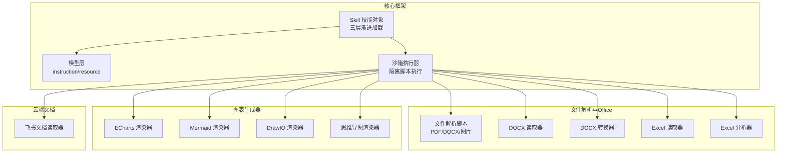
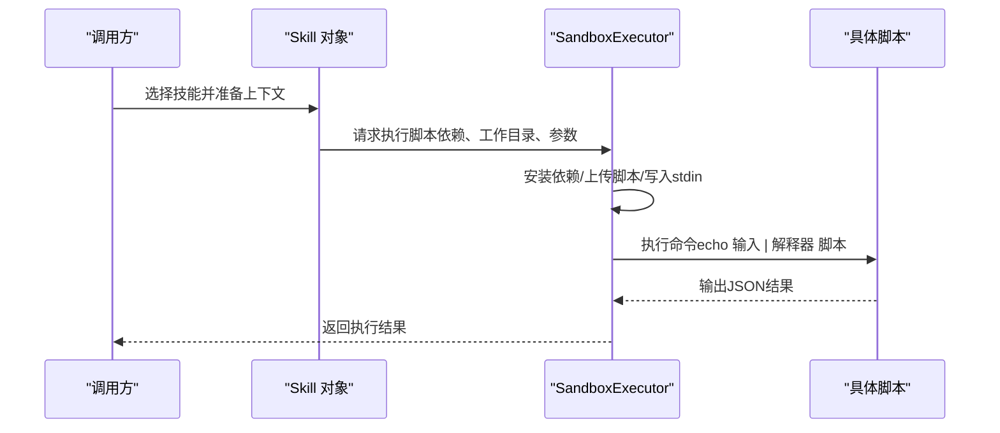
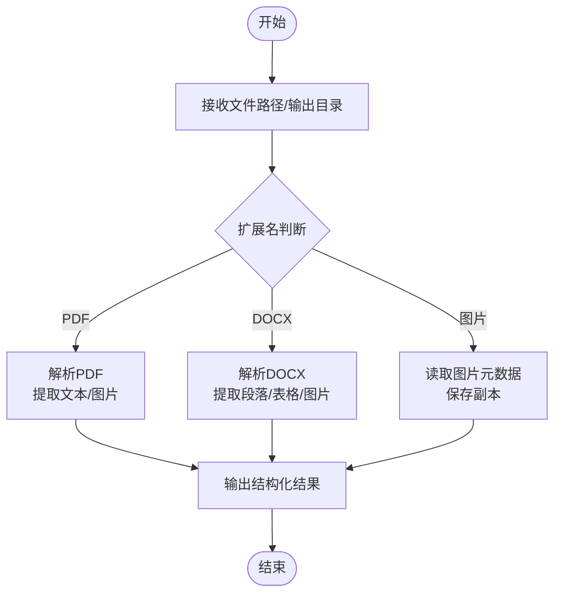
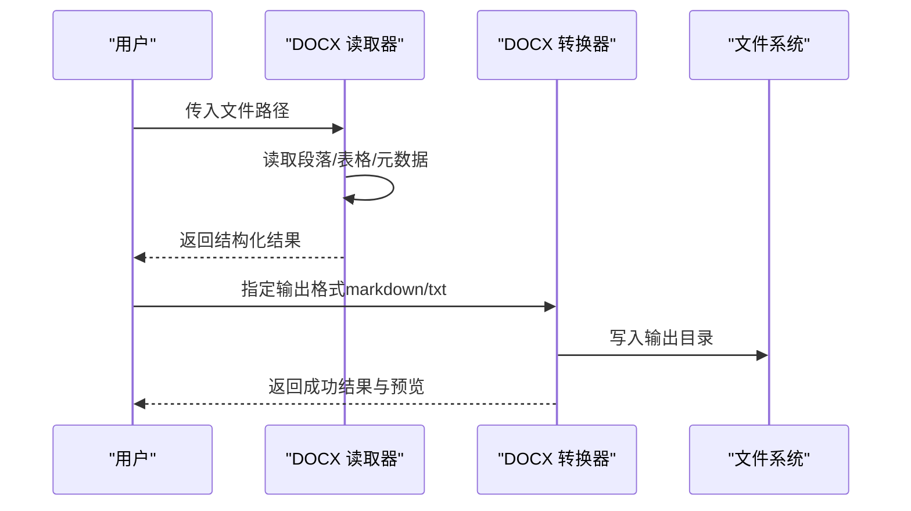
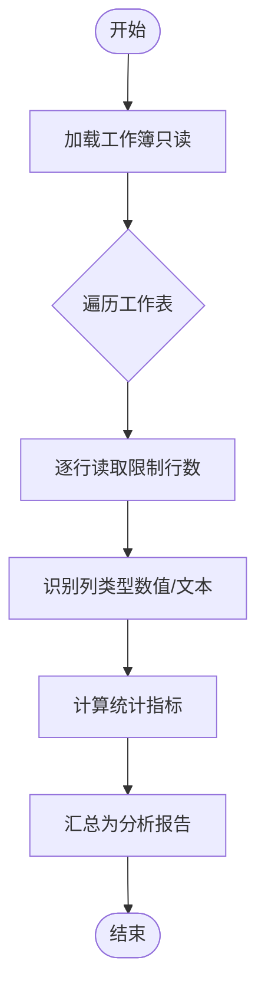
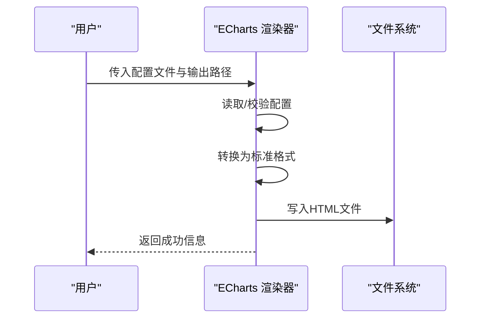
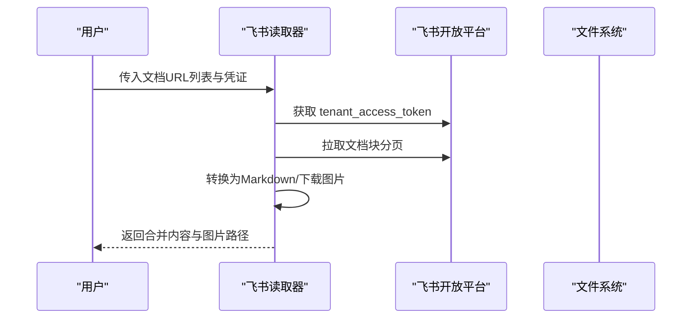
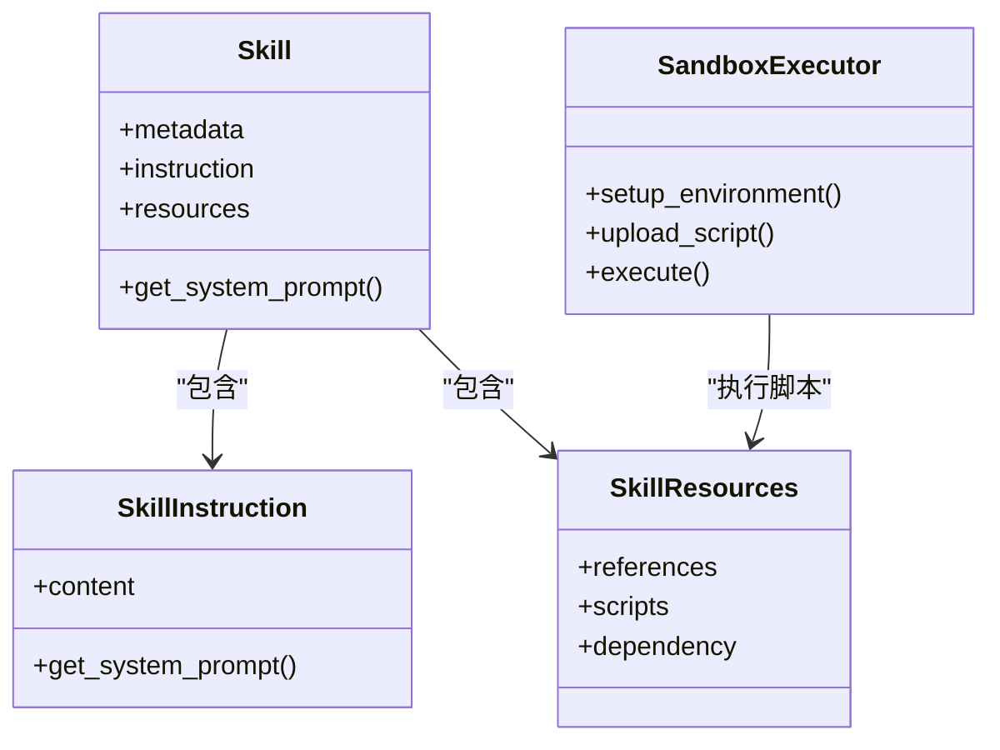

# 文件转换系统

<cite>
**本文档引用的文件**
- [OpenSkills 主项目](file://OpenSkills-main)
- [文件解析脚本](file://OpenSkills-main/examples/file-to-article-generator/scripts/parse_file.py)
- [Office 技能包](file://OpenSkills-main/examples/office-skills)
- [DOCX 转换器](file://OpenSkills-main/examples/office-skills/docx-processor/scripts/convert_docx.py)
- [DOCX 读取器](file://OpenSkills-main/examples/office-skills/docx-processor/scripts/read_docx.py)
- [Excel 读取器](file://OpenSkills-main/examples/office-skills/excel-processor/scripts/read_excel.py)
- [Excel 分析器](file://OpenSkills-main/examples/office-skills/excel-processor/scripts/analyze_excel.py)
- [多图表绘制](file://OpenSkills-main/examples/multi-chart-draw)
- [ECharts 渲染器](file://OpenSkills-main/examples/multi-chart-draw/scripts/render_echarts.py)
- [Mermaid 渲染器](file://OpenSkills-main/examples/multi-chart-draw/scripts/render_mermaid.py)
- [DrawIO 渲染器](file://OpenSkills-main/examples/multi-chart-draw/scripts/render_drawio.py)
- [思维导图渲染器](file://OpenSkills-main/examples/multi-chart-draw/scripts/render_mindmap.py)
- [飞书文档读取器](file://OpenSkills-main/examples/feishu-doc-to-dev-spec/scripts/fetch_feishu_doc.py)
- [OpenSkills 核心模型](file://OpenSkills-main/openskills/models)
- [技能对象模型](file://OpenSkills-main/openskills/models/instruction.py)
- [资源模型](file://OpenSkills-main/openskills/models/resource.py)
- [OpenSkills 执行器](file://OpenSkills-main/openskills/sandbox/executor.py)
- [OpenSkills 技能封装](file://OpenSkills-main/openskills/core/skill.py)
</cite>

## 目录
1. [简介](#简介)
2. [项目结构](#项目结构)
3. [核心组件](#核心组件)
4. [架构总览](#架构总览)
5. [详细组件分析](#详细组件分析)
6. [依赖关系分析](#依赖关系分析)
7. [性能考虑](#性能考虑)
8. [故障排查指南](#故障排查指南)
9. [结论](#结论)
10. [附录](#附录)

## 简介
本文件转换系统围绕“技能”（Skill）抽象构建，提供多格式文件的解析、Office 文档处理（docx、excel）、图表生成器集成（ECharts、Mermaid、DrawIO、思维导图）以及云端文档抓取能力。系统采用三层渐进式加载（元数据、指令、资源），并通过沙箱执行器隔离地运行外部脚本，确保安全性与可扩展性。

## 项目结构
系统以 OpenSkills 为核心框架，结合多个示例技能包：
- 文件解析与 Office 处理：file-to-article-generator、office-skills
- 图表生成器集成：multi-chart-draw
- 云端文档抓取：feishu-doc-to-dev-spec
- 核心模型与执行器：openskills/models、openskills/sandbox、openskills/core

**图表来源**
- [OpenSkills 执行器](file://OpenSkills-main/openskills/sandbox/executor.py#L22-L355)
- [技能对象模型](file://OpenSkills-main/openskills/models/instruction.py#L11-L48)
- [资源模型](file://OpenSkills-main/openskills/models/resource.py#L45-L204)
- [文件解析脚本](file://OpenSkills-main/examples/file-to-article-generator/scripts/parse_file.py#L15-L327)
- [DOCX 读取器](file://OpenSkills-main/examples/office-skills/docx-processor/scripts/read_docx.py#L37-L105)
- [DOCX 转换器](file://OpenSkills-main/examples/office-skills/docx-processor/scripts/convert_docx.py#L62-L126)
- [Excel 读取器](file://OpenSkills-main/examples/office-skills/excel-processor/scripts/read_excel.py#L19-L113)
- [Excel 分析器](file://OpenSkills-main/examples/office-skills/excel-processor/scripts/analyze_excel.py#L58-L151)
- [ECharts 渲染器](file://OpenSkills-main/examples/multi-chart-draw/scripts/render_echarts.py#L194-L255)
- [Mermaid 渲染器](file://OpenSkills-main/examples/multi-chart-draw/scripts/render_mermaid.py#L17-L93)
- [DrawIO 渲染器](file://OpenSkills-main/examples/multi-chart-draw/scripts/render_drawio.py#L18-L380)
- [思维导图渲染器](file://OpenSkills-main/examples/multi-chart-draw/scripts/render_mindmap.py#L17-L95)
- [飞书文档读取器](file://OpenSkills-main/examples/feishu-doc-to-dev-spec/scripts/fetch_feishu_doc.py#L43-L628)

**章节来源**
- [OpenSkills 执行器](file://OpenSkills-main/openskills/sandbox/executor.py#L22-L355)
- [技能对象模型](file://OpenSkills-main/openskills/models/instruction.py#L11-L48)
- [资源模型](file://OpenSkills-main/openskills/models/resource.py#L45-L204)

## 核心组件
- 技能对象（Skill）：三层渐进加载，按需加载指令与资源，支持脚本调用提示与引用内容拼接。
- 沙箱执行器（SandboxExecutor）：统一脚本执行入口，负责依赖安装、文件上传、stdin 输入、命令执行与输出捕获。
- 文件解析器：支持 PDF、DOCX、图片，提取文本、元数据与图片，输出结构化结果。
- Office 处理器：DOCX 读取与转换（Markdown/TXT），Excel 读取与统计分析。
- 图表生成器：ECharts（标准/简化配置）、Mermaid（PNG/SVG）、DrawIO（嵌入HTML）、思维导图（SVG/PNG）。
- 云端文档抓取：飞书云文档（docx/docs/wiki）解析为 Markdown 并下载图片。

**章节来源**
- [技能对象模型](file://OpenSkills-main/openskills/models/instruction.py#L11-L48)
- [资源模型](file://OpenSkills-main/openskills/models/resource.py#L45-L204)
- [OpenSkills 执行器](file://OpenSkills-main/openskills/sandbox/executor.py#L22-L355)
- [文件解析脚本](file://OpenSkills-main/examples/file-to-article-generator/scripts/parse_file.py#L15-L327)
- [DOCX 读取器](file://OpenSkills-main/examples/office-skills/docx-processor/scripts/read_docx.py#L37-L105)
- [DOCX 转换器](file://OpenSkills-main/examples/office-skills/docx-processor/scripts/convert_docx.py#L62-L126)
- [Excel 读取器](file://OpenSkills-main/examples/office-skills/excel-processor/scripts/read_excel.py#L19-L113)
- [Excel 分析器](file://OpenSkills-main/examples/office-skills/excel-processor/scripts/analyze_excel.py#L58-L151)
- [ECharts 渲染器](file://OpenSkills-main/examples/multi-chart-draw/scripts/render_echarts.py#L194-L255)
- [Mermaid 渲染器](file://OpenSkills-main/examples/multi-chart-draw/scripts/render_mermaid.py#L17-L93)
- [DrawIO 渲染器](file://OpenSkills-main/examples/multi-chart-draw/scripts/render_drawio.py#L18-L380)
- [思维导图渲染器](file://OpenSkills-main/examples/multi-chart-draw/scripts/render_mindmap.py#L17-L95)
- [飞书文档读取器](file://OpenSkills-main/examples/feishu-doc-to-dev-spec/scripts/fetch_feishu_doc.py#L43-L628)

## 架构总览
系统通过 Skill 封装指令与资源，SandboxExecutor 统一调度各类脚本执行。文件解析与 Office 处理脚本通过 stdin 接收 JSON 输入，返回结构化输出；图表生成器脚本负责将配置渲染为 HTML/PNG/SVG；飞书文档读取器对接云端 API，抓取并转换为 Markdown。

**图表来源**
- [OpenSkills 执行器](file://OpenSkills-main/openskills/sandbox/executor.py#L255-L331)
- [技能对象模型](file://OpenSkills-main/openskills/models/instruction.py#L29-L47)

**章节来源**
- [OpenSkills 执行器](file://OpenSkills-main/openskills/sandbox/executor.py#L22-L355)
- [技能对象模型](file://OpenSkills-main/openskills/models/instruction.py#L11-L48)

## 详细组件分析

### 文件解析与文本提取
- 支持格式：PDF、DOCX、JPG/PNG/GIF/BMP/WEBP
- 功能特性：
  - PDF：提取文本与图片，保存至 images 目录，返回元数据与图片描述
  - DOCX：提取段落文本、表格内容与图片，生成结构化文本
  - 图片：记录格式、尺寸、模式，保存副本
- 处理流程：命令行或 stdin JSON 输入 → 类型判断 → 调用对应解析函数 → 结构化输出

**图表来源**
- [文件解析脚本](file://OpenSkills-main/examples/file-to-article-generator/scripts/parse_file.py#L15-L327)

**章节来源**
- [文件解析脚本](file://OpenSkills-main/examples/file-to-article-generator/scripts/parse_file.py#L15-L327)

### Office 文档处理（DOCX/Excel）

#### DOCX 读取与转换
- 读取器：提取段落、表格、元数据，限制输出规模
- 转换器：支持 Markdown 与 TXT 输出，生成预览与时间戳

**图表来源**
- [DOCX 读取器](file://OpenSkills-main/examples/office-skills/docx-processor/scripts/read_docx.py#L37-L105)
- [DOCX 转换器](file://OpenSkills-main/examples/office-skills/docx-processor/scripts/convert_docx.py#L62-L126)

**章节来源**
- [DOCX 读取器](file://OpenSkills-main/examples/office-skills/docx-processor/scripts/read_docx.py#L37-L105)
- [DOCX 转换器](file://OpenSkills-main/examples/office-skills/docx-processor/scripts/convert_docx.py#L62-L126)

#### Excel 读取与分析
- 读取器：支持指定工作表，读取前 N 行，返回行列数、表头与数据预览
- 分析器：自动识别数值/文本列，计算统计量（求和、均值、极值、去重、频次）

**图表来源**
- [Excel 读取器](file://OpenSkills-main/examples/office-skills/excel-processor/scripts/read_excel.py#L50-L105)
- [Excel 分析器](file://OpenSkills-main/examples/office-skills/excel-processor/scripts/analyze_excel.py#L19-L151)

**章节来源**
- [Excel 读取器](file://OpenSkills-main/examples/office-skills/excel-processor/scripts/read_excel.py#L19-L113)
- [Excel 分析器](file://OpenSkills-main/examples/office-skills/excel-processor/scripts/analyze_excel.py#L58-L151)

### 图表生成器集成

#### ECharts 渲染
- 支持简化配置到标准配置的自动转换
- 生成内嵌 ECharts 的 HTML，动态渲染图表

**图表来源**
- [ECharts 渲染器](file://OpenSkills-main/examples/multi-chart-draw/scripts/render_echarts.py#L194-L255)

**章节来源**
- [ECharts 渲染器](file://OpenSkills-main/examples/multi-chart-draw/scripts/render_echarts.py#L194-L255)

#### Mermaid 渲染
- 依赖 mermaid-cli（mmdc），支持 PNG/SVG 输出
- 自动校验命令可用性与输出格式

**章节来源**
- [Mermaid 渲染器](file://OpenSkills-main/examples/multi-chart-draw/scripts/render_mermaid.py#L17-L93)

#### DrawIO 渲染
- 通过官方 embed API 生成 HTML，iframe + postMessage 加载 XML
- 支持加载失败回退与全屏查看

**章节来源**
- [DrawIO 渲染器](file://OpenSkills-main/examples/multi-chart-draw/scripts/render_drawio.py#L18-L380)

#### 思维导图渲染
- 依赖 markmap-cli，默认生成 SVG，提示 PNG 转换需求

**章节来源**
- [思维导图渲染器](file://OpenSkills-main/examples/multi-chart-draw/scripts/render_mindmap.py#L17-L95)

### 云端文档抓取（飞书）
- 支持 docx/docs/wiki 三种文档类型
- 自动获取 tenant_access_token，分页拉取块内容，转换为 Markdown
- 下载图片并替换为本地相对路径

**图表来源**
- [飞书文档读取器](file://OpenSkills-main/examples/feishu-doc-to-dev-spec/scripts/fetch_feishu_doc.py#L64-L575)

**章节来源**
- [飞书文档读取器](file://OpenSkills-main/examples/feishu-doc-to-dev-spec/scripts/fetch_feishu_doc.py#L43-L628)

## 依赖关系分析
- 技能对象（Skill）组合三层模型：元数据（始终加载）、指令（按需加载）、资源（条件加载）
- 沙箱执行器统一管理依赖安装、脚本上传与执行，屏蔽解释器差异
- 各脚本通过 stdin 接收 JSON，返回结构化输出，便于上层统一处理

**图表来源**
- [技能对象模型](file://OpenSkills-main/openskills/models/instruction.py#L11-L48)
- [资源模型](file://OpenSkills-main/openskills/models/resource.py#L45-L204)
- [OpenSkills 执行器](file://OpenSkills-main/openskills/sandbox/executor.py#L22-L355)

**章节来源**
- [技能对象模型](file://OpenSkills-main/openskills/models/instruction.py#L11-L48)
- [资源模型](file://OpenSkills-main/openskills/models/resource.py#L45-L204)
- [OpenSkills 执行器](file://OpenSkills-main/openskills/sandbox/executor.py#L22-L355)

## 性能考虑
- 流式与分页：Excel 读取限制行数与数据量；飞书文档分页拉取块内容
- 只读模式：Excel 使用只读与 data_only，降低内存占用
- 输出裁剪：段落/表格数量限制，避免大体积输出
- 沙箱隔离：独立进程与工作空间，减少相互影响
- 依赖缓存：首次安装后复用，避免重复安装

[本节为通用性能建议，无需特定文件引用]

## 故障排查指南
- 依赖缺失：各脚本在导入失败时返回明确提示（如 python-docx、openpyxl、Pillow、mermaid-cli、markmap）
- 文件不存在：路径解析失败或文件不存在时返回错误信息
- 网络异常：飞书读取器在 API 调用失败时抛出异常并返回错误
- 渲染失败：图表生成器对 mmdc/markmap 可用性进行检查，失败时给出安装指引

**章节来源**
- [文件解析脚本](file://OpenSkills-main/examples/file-to-article-generator/scripts/parse_file.py#L26-L32)
- [DOCX 读取器](file://OpenSkills-main/examples/office-skills/docx-processor/scripts/read_docx.py#L58-L66)
- [Excel 读取器](file://OpenSkills-main/examples/office-skills/excel-processor/scripts/read_excel.py#L41-L48)
- [Mermaid 渲染器](file://OpenSkills-main/examples/multi-chart-draw/scripts/render_mermaid.py#L40-L47)
- [思维导图渲染器](file://OpenSkills-main/examples/multi-chart-draw/scripts/render_mindmap.py#L40-L47)
- [飞书文档读取器](file://OpenSkills-main/examples/feishu-doc-to-dev-spec/scripts/fetch_feishu_doc.py#L64-L96)

## 结论
该文件转换系统以 Skill 为核心，结合沙箱执行器与多类脚本，实现了从本地文件到云端文档的全链路处理，覆盖 Office 文档、图表生成与内容提取。通过三层模型与渐进加载，系统在保证功能完整性的同时兼顾了性能与可维护性。

[本节为总结性内容，无需特定文件引用]

## 附录

### 支持的文件格式与处理能力
- PDF：文本与图片提取，元数据读取
- DOCX：段落、表格、图片提取，Markdown/TXT 转换
- Excel：多工作表读取、统计分析、列类型识别
- 图片：基础元数据与格式信息
- 图表：ECharts（标准/简化）、Mermaid（PNG/SVG）、DrawIO（HTML）、思维导图（SVG/PNG）
- 云端文档：飞书 docx/docs/wiki，Markdown 转换与图片下载

**章节来源**
- [文件解析脚本](file://OpenSkills-main/examples/file-to-article-generator/scripts/parse_file.py#L15-L327)
- [DOCX 读取器](file://OpenSkills-main/examples/office-skills/docx-processor/scripts/read_docx.py#L37-L105)
- [DOCX 转换器](file://OpenSkills-main/examples/office-skills/docx-processor/scripts/convert_docx.py#L62-L126)
- [Excel 读取器](file://OpenSkills-main/examples/office-skills/excel-processor/scripts/read_excel.py#L19-L113)
- [Excel 分析器](file://OpenSkills-main/examples/office-skills/excel-processor/scripts/analyze_excel.py#L58-L151)
- [ECharts 渲染器](file://OpenSkills-main/examples/multi-chart-draw/scripts/render_echarts.py#L194-L255)
- [Mermaid 渲染器](file://OpenSkills-main/examples/multi-chart-draw/scripts/render_mermaid.py#L17-L93)
- [DrawIO 渲染器](file://OpenSkills-main/examples/multi-chart-draw/scripts/render_drawio.py#L18-L380)
- [思维导图渲染器](file://OpenSkills-main/examples/multi-chart-draw/scripts/render_mindmap.py#L17-L95)
- [飞书文档读取器](file://OpenSkills-main/examples/feishu-doc-to-dev-spec/scripts/fetch_feishu_doc.py#L43-L628)

### 自定义转换器开发指南
- 接口约定：stdin 接收 JSON（包含 file_path 等必要字段），stdout 输出结构化 JSON
- 参数配置：支持通过 JSON 字段传递输出格式、工作表名等
- 错误处理：捕获异常并返回 error 字段，包含明确的错误信息
- 依赖声明：在 Skill 的依赖模型中声明所需包与系统命令
- 沙箱执行：通过 SandboxExecutor.setup_environment 安装依赖，execute 上传脚本并执行

**章节来源**
- [OpenSkills 执行器](file://OpenSkills-main/openskills/sandbox/executor.py#L123-L331)
- [资源模型](file://OpenSkills-main/openskills/models/resource.py#L180-L204)