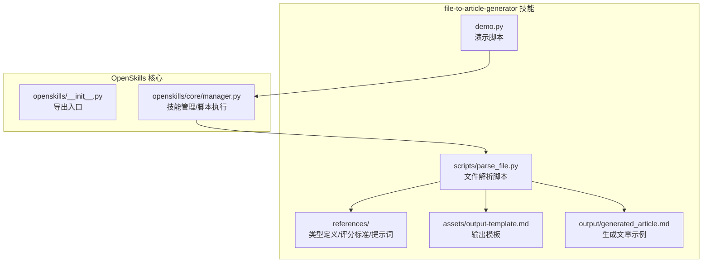
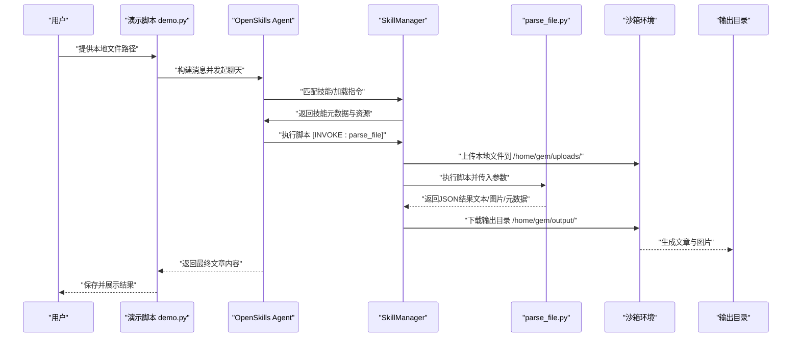
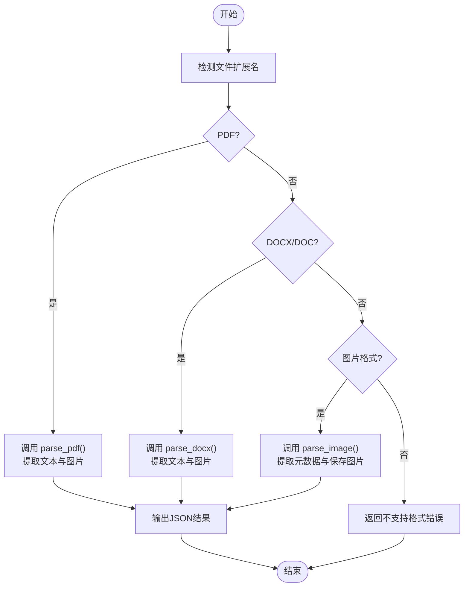
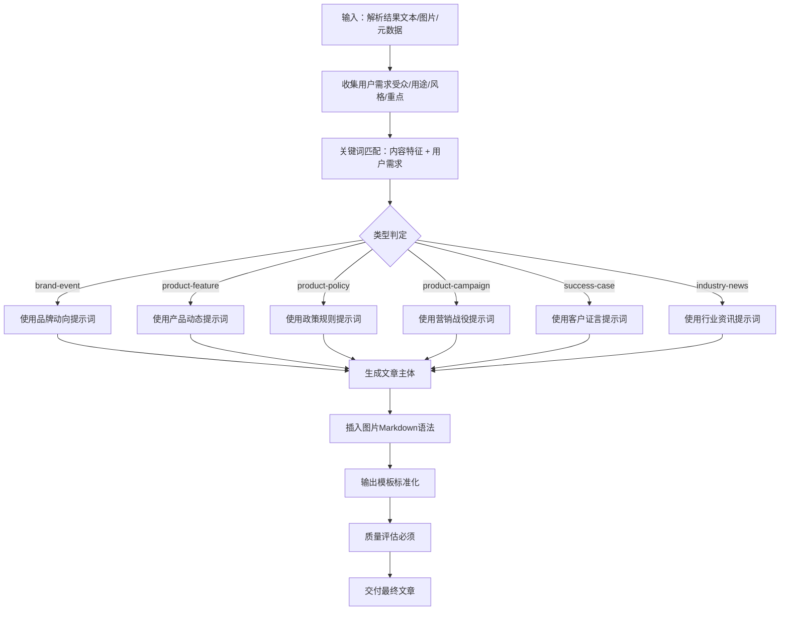
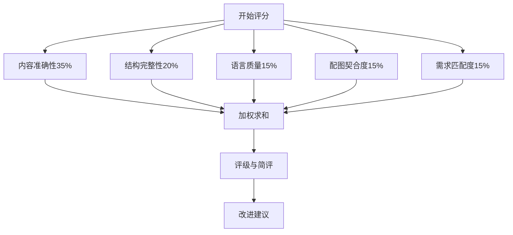
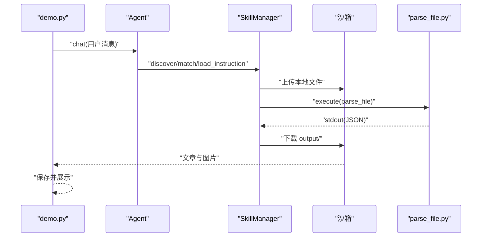
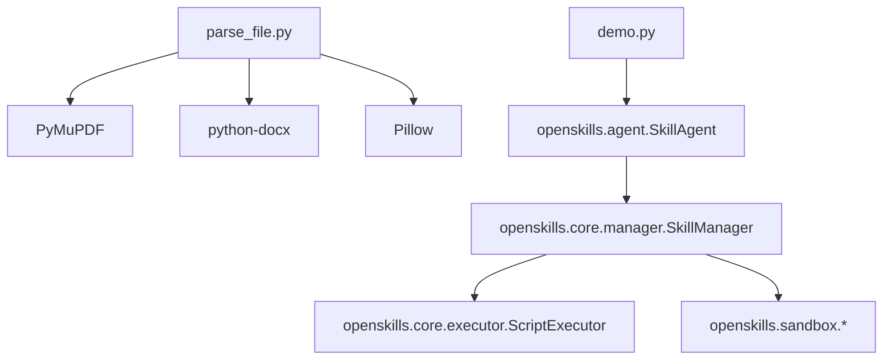

# 文本文件转换

<cite>
**本文档引用的文件**
- [OpenSkills-main/examples/file-to-article-generator/scripts/parse_file.py](file://OpenSkills-main/examples/file-to-article-generator/scripts/parse_file.py)
- [OpenSkills-main/examples/file-to-article-generator/SKILL.md](file://OpenSkills-main/examples/file-to-article-generator/SKILL.md)
- [OpenSkills-main/examples/file-to-article-generator/references/article-types.md](file://OpenSkills-main/examples/file-to-article-generator/references/article-types.md)
- [OpenSkills-main/examples/file-to-article-generator/references/scoring-criteria.md](file://OpenSkills-main/examples/file-to-article-generator/references/scoring-criteria.md)
- [OpenSkills-main/examples/file-to-article-generator/assets/output-template.md](file://OpenSkills-main/examples/file-to-article-generator/assets/output-template.md)
- [OpenSkills-main/examples/file-to-article-generator/demo.py](file://OpenSkills-main/examples/file-to-article-generator/demo.py)
- [OpenSkills-main/examples/file-to-article-generator/output/generated_article.md](file://OpenSkills-main/examples/file-to-article-generator/output/generated_article.md)
- [OpenSkills-main/openskills/__init__.py](file://OpenSkills-main/openskills/__init__.py)
- [OpenSkills-main/openskills/core/manager.py](file://OpenSkills-main/openskills/core/manager.py)
</cite>

## 目录
1. [简介](#简介)
2. [项目结构](#项目结构)
3. [核心组件](#核心组件)
4. [架构总览](#架构总览)
5. [详细组件分析](#详细组件分析)
6. [依赖分析](#依赖分析)
7. [性能考量](#性能考量)
8. [故障排查指南](#故障排查指南)
9. [结论](#结论)
10. [附录](#附录)

## 简介
本技术文档聚焦“文本文件转换”能力，系统阐述从多格式文件（PDF/Word/图片）解析、内容提取、图片处理，到文章类型智能判断、内容结构化生成与质量评分的完整流程。文档覆盖：
- 文件解析器工作原理：文件类型检测、编码识别（间接通过第三方库）、内容提取算法
- 文章生成器实现机制：内容结构化、格式标准化、质量评分系统
- 支持的文件格式与转换规则：PDF、DOCX、常见图片格式的处理策略
- 使用示例：如何将不同类型的文件转换为标准文章格式
- 数据清洗、格式统一与内容优化技术
- 自定义转换规则的配置方法与扩展指南

## 项目结构
file-to-article-generator 技能模块采用“技能 + 脚本 + 参考 + 资产”的组织方式，核心文件如下：
- 脚本：解析多格式文件并提取文本与图片
- 参考：文章类型定义、评分标准、生成与评估提示词（待引用）
- 资产：输出模板
- 示例：演示如何在沙箱中调用脚本并生成文章

图表来源
- [OpenSkills-main/examples/file-to-article-generator/scripts/parse_file.py](file://OpenSkills-main/examples/file-to-article-generator/scripts/parse_file.py#L1-L327)
- [OpenSkills-main/examples/file-to-article-generator/SKILL.md](file://OpenSkills-main/examples/file-to-article-generator/SKILL.md#L1-L179)
- [OpenSkills-main/examples/file-to-article-generator/assets/output-template.md](file://OpenSkills-main/examples/file-to-article-generator/assets/output-template.md#L1-L101)
- [OpenSkills-main/examples/file-to-article-generator/demo.py](file://OpenSkills-main/examples/file-to-article-generator/demo.py#L1-L217)
- [OpenSkills-main/openskills/core/manager.py](file://OpenSkills-main/openskills/core/manager.py#L1-L523)

章节来源
- [OpenSkills-main/examples/file-to-article-generator/SKILL.md](file://OpenSkills-main/examples/file-to-article-generator/SKILL.md#L1-L179)

## 核心组件
- 文件解析器（parse_file.py）：负责识别文件类型并调用相应解析器，提取文本与图片，保存到输出目录，返回JSON结果
- 文章类型判断与生成：依据 references 中的类型定义与关键词，结合用户需求，选择对应提示词生成文章
- 质量评分系统：依据评分维度与权重，对生成文章进行打分与改进建议
- 输出模板：标准化文章输出格式，包含摘要、正文、评估报告与图片清单
- 演示与集成：demo.py 展示如何通过 OpenSkills Agent 在沙箱中自动上传/下载文件并执行脚本

章节来源
- [OpenSkills-main/examples/file-to-article-generator/scripts/parse_file.py](file://OpenSkills-main/examples/file-to-article-generator/scripts/parse_file.py#L1-L327)
- [OpenSkills-main/examples/file-to-article-generator/references/article-types.md](file://OpenSkills-main/examples/file-to-article-generator/references/article-types.md#L1-L181)
- [OpenSkills-main/examples/file-to-article-generator/references/scoring-criteria.md](file://OpenSkills-main/examples/file-to-article-generator/references/scoring-criteria.md#L1-L186)
- [OpenSkills-main/examples/file-to-article-generator/assets/output-template.md](file://OpenSkills-main/examples/file-to-article-generator/assets/output-template.md#L1-L101)
- [OpenSkills-main/examples/file-to-article-generator/demo.py](file://OpenSkills-main/examples/file-to-article-generator/demo.py#L1-L217)

## 架构总览
下图展示从用户请求到生成文章的端到端流程，包括文件解析、脚本执行、文章生成与质量评估。

图表来源
- [OpenSkills-main/examples/file-to-article-generator/demo.py](file://OpenSkills-main/examples/file-to-article-generator/demo.py#L36-L176)
- [OpenSkills-main/openskills/core/manager.py](file://OpenSkills-main/openskills/core/manager.py#L265-L360)
- [OpenSkills-main/examples/file-to-article-generator/scripts/parse_file.py](file://OpenSkills-main/examples/file-to-article-generator/scripts/parse_file.py#L268-L327)

## 详细组件分析

### 文件解析器（parse_file.py）
- 功能职责
  - 文件类型检测：基于扩展名判断PDF、DOCX、图片三类
  - 内容提取：从PDF提取文本与图片；从DOCX提取文本与图片；对图片提取基础元数据
  - 图片保存：统一保存到输出目录 images 子目录，返回本地相对路径
  - 错误处理：捕获导入缺失、解析异常，返回结构化错误信息
- 数据结构与复杂度
  - 文本提取：线性扫描页面/段落/表格，时间复杂度近似 O(N)，N为页面/段落数
  - 图片提取：逐页/逐部件遍历，时间复杂度近似 O(M)，M为图片数量
  - 空间复杂度：与提取内容规模线性相关
- 关键实现要点
  - PDF解析：使用 PyMuPDF 提取文本与图片，保存为本地文件并记录元数据
  - DOCX解析：使用 python-docx 提取段落与表格文本，同时从部件中提取嵌入图片
  - 图片解析：使用 Pillow 获取格式、尺寸、模式等元数据
  - 命令行与stdin兼容：支持命令行参数与JSON输入两种调用方式
- 错误处理与边界情况
  - 依赖缺失：返回明确的安装指引
  - 文件不存在：返回错误信息并退出
  - 图片提取失败：跳过单张图片继续处理
  - 不支持格式：返回错误提示

图表来源
- [OpenSkills-main/examples/file-to-article-generator/scripts/parse_file.py](file://OpenSkills-main/examples/file-to-article-generator/scripts/parse_file.py#L15-L327)

章节来源
- [OpenSkills-main/examples/file-to-article-generator/scripts/parse_file.py](file://OpenSkills-main/examples/file-to-article-generator/scripts/parse_file.py#L1-L327)

### 文章类型判断与生成
- 类型定义与关键词
  - 支持六种类型：品牌动向、产品动态、政策规则、营销战役、客户证言、行业资讯
  - 基于内容特征关键词与用户需求关键词进行判断
  - 优先级：用户需求 > 内容特征；若特征不明确，建议用户选择
- 生成流程
  - 依据类型选择对应提示词模板
  - 替换模板变量：原文内容、用户需求、目标受众、图片信息
  - 使用Markdown语法插入图片，确保配图与内容契合
- 输出与交付
  - 使用输出模板标准化文章结构
  - 评估报告必须附加在文章末尾，包含标题点击欲望、全文阅读价值与总分

图表来源
- [OpenSkills-main/examples/file-to-article-generator/references/article-types.md](file://OpenSkills-main/examples/file-to-article-generator/references/article-types.md#L107-L149)
- [OpenSkills-main/examples/file-to-article-generator/SKILL.md](file://OpenSkills-main/examples/file-to-article-generator/SKILL.md#L80-L117)

章节来源
- [OpenSkills-main/examples/file-to-article-generator/references/article-types.md](file://OpenSkills-main/examples/file-to-article-generator/references/article-types.md#L1-L181)
- [OpenSkills-main/examples/file-to-article-generator/SKILL.md](file://OpenSkills-main/examples/file-to-article-generator/SKILL.md#L80-L117)

### 质量评分系统
- 评分维度与权重
  - 内容准确性（35%）、结构完整性（20%）、语言质量（15%）、配图契合度（15%）、需求匹配度（15%）
- 评分细则
  - 每维满分为100分，按权重加权计算总分
  - 提供不同区间的评级与改进建议
- 实施要点
  - 评估角色：根据文章类型选择合适角色（如老板/客服总监）
  - 评估指标：标题点击欲望（50分）、全文阅读价值（50分）
  - 输出：包含各维度得分、总分、简评与改进建议

图表来源
- [OpenSkills-main/examples/file-to-article-generator/references/scoring-criteria.md](file://OpenSkills-main/examples/file-to-article-generator/references/scoring-criteria.md#L102-L115)

章节来源
- [OpenSkills-main/examples/file-to-article-generator/references/scoring-criteria.md](file://OpenSkills-main/examples/file-to-article-generator/references/scoring-criteria.md#L1-L186)

### 输出模板与标准化
- 模板字段
  - 原文摘要：文件类型、标题、作者、页数/段落数、内容概览
  - 生成文章：文章类型、标题、正文
  - 质量评估：标题点击欲望、全文阅读价值、总分与简评
  - 图片清单：索引、本地路径、描述
  - 下载说明：输出目录结构与使用说明
- 标准化要点
  - 图片引用使用相对路径，确保跨环境可移植
  - 评估报告强制附加在文章末尾

章节来源
- [OpenSkills-main/examples/file-to-article-generator/assets/output-template.md](file://OpenSkills-main/examples/file-to-article-generator/assets/output-template.md#L1-L101)

### 演示与集成（demo.py 与 SkillManager）
- 演示流程
  - 初始化 Agent，自动处理沙箱环境、依赖安装、文件上传/下载
  - 构造用户消息，包含本地文件路径与生成要求
  - 调用 [INVOKE:parse_file] 执行脚本，随后生成文章并评分
  - 保存文章与图片，展示结果
- 技能管理
  - SkillManager 负责技能发现、注册、指令加载、脚本执行与沙箱文件同步
  - 自动上传本地文件至沙箱 /home/gem/uploads/，执行完成后下载 /home/gem/output/

图表来源
- [OpenSkills-main/examples/file-to-article-generator/demo.py](file://OpenSkills-main/examples/file-to-article-generator/demo.py#L36-L176)
- [OpenSkills-main/openskills/core/manager.py](file://OpenSkills-main/openskills/core/manager.py#L319-L360)

章节来源
- [OpenSkills-main/examples/file-to-article-generator/demo.py](file://OpenSkills-main/examples/file-to-article-generator/demo.py#L1-L217)
- [OpenSkills-main/openskills/core/manager.py](file://OpenSkills-main/openskills/core/manager.py#L1-L523)

## 依赖分析
- 外部依赖
  - PyMuPDF：PDF解析与图片提取
  - python-docx：DOCX解析与图片提取
  - Pillow：图片元数据读取与保存
- 内部依赖
  - openskills：技能框架，提供 Agent、SkillManager、脚本执行与沙箱文件同步
- 耦合与内聚
  - parse_file.py 与第三方库耦合度较高，但职责单一，内聚性好
  - SkillManager 与脚本执行、沙箱文件同步耦合，但通过接口抽象降低对上层影响

图表来源
- [OpenSkills-main/examples/file-to-article-generator/scripts/parse_file.py](file://OpenSkills-main/examples/file-to-article-generator/scripts/parse_file.py#L26-L223)
- [OpenSkills-main/examples/file-to-article-generator/demo.py](file://OpenSkills-main/examples/file-to-article-generator/demo.py#L36-L109)
- [OpenSkills-main/openskills/core/manager.py](file://OpenSkills-main/openskills/core/manager.py#L265-L360)

章节来源
- [OpenSkills-main/examples/file-to-article-generator/SKILL.md](file://OpenSkills-main/examples/file-to-article-generator/SKILL.md#L10-L16)
- [OpenSkills-main/openskills/core/manager.py](file://OpenSkills-main/openskills/core/manager.py#L1-L523)

## 性能考量
- 解析性能
  - PDF/DOCX/图片解析均为线性复杂度，受内容规模影响
  - 图片提取可能成为瓶颈，建议控制并发与缓存策略
- I/O 与存储
  - 输出目录统一管理，建议预创建并清理旧文件
  - 沙箱文件上传/下载为网络I/O，建议批量与断点续传
- 可扩展性
  - 新增格式可通过扩展 parse_file.py 的类型分支实现
  - 评估与生成流程通过提示词模板与类型映射解耦，便于扩展

## 故障排查指南
- 常见问题与处理
  - 依赖未安装：根据返回的错误信息安装对应库（PyMuPDF、python-docx、Pillow）
  - 文件不存在：确认本地路径正确，或检查沙箱上传是否成功
  - 不支持的文件格式：检查扩展名是否在支持列表中
  - 沙箱连接失败：确认 SANDBOX_URL 正确，沙箱服务已启动
- 日志与调试
  - SkillManager 在文件上传/下载过程中输出进度日志，便于定位问题
  - parse_file.py 输出JSON结果，便于前端/后端解析与调试

章节来源
- [OpenSkills-main/examples/file-to-article-generator/scripts/parse_file.py](file://OpenSkills-main/examples/file-to-article-generator/scripts/parse_file.py#L28-L320)
- [OpenSkills-main/openskills/core/manager.py](file://OpenSkills-main/openskills/core/manager.py#L440-L493)

## 结论
本技术文档系统梳理了文本文件转换从解析到生成再到评分的全流程。文件解析器以多格式适配为核心，结合沙箱执行与标准化输出模板，实现了从PDF/DOCX/图片到高质量文章的自动化转换。文章类型判断与质量评分体系保证了输出内容的结构性与可评估性。通过演示脚本与 SkillManager 的集成，用户可在本地快速验证并扩展该能力。

## 附录

### 支持的文件格式与转换规则
- PDF
  - 提取文本与图片，保存图片到 images 目录，返回元数据（页数等）
- DOCX/DOC
  - 提取段落与表格文本，提取嵌入图片，保存到 images 目录
- 图片（JPG/PNG/GIF/BMP/WEBP）
  - 读取图片元数据（格式、尺寸、模式），保存原图到 images 目录

章节来源
- [OpenSkills-main/examples/file-to-article-generator/scripts/parse_file.py](file://OpenSkills-main/examples/file-to-article-generator/scripts/parse_file.py#L15-L265)

### 使用示例
- 演示脚本运行
  - 启动沙箱服务后，设置 OPENAI_API_KEY 等环境变量
  - 运行 demo.py 并传入本地PDF路径，自动完成解析、生成与评分
- 生成文章示例
  - 输出文章包含原文摘要、生成文章主体、质量评估报告与图片清单

章节来源
- [OpenSkills-main/examples/file-to-article-generator/demo.py](file://OpenSkills-main/examples/file-to-article-generator/demo.py#L1-L217)
- [OpenSkills-main/examples/file-to-article-generator/output/generated_article.md](file://OpenSkills-main/examples/file-to-article-generator/output/generated_article.md#L1-L139)

### 数据清洗、格式统一与内容优化
- 数据清洗
  - 跳过无效/损坏图片，保留有效文本片段
  - 清理空白段落，合并连续空行
- 格式统一
  - 统一使用Markdown语法插入图片，路径相对化
  - 输出模板标准化字段与结构
- 内容优化
  - 基于类型关键词与用户需求优化结构与风格
  - 评估阶段提供改进建议，指导二次生成

章节来源
- [OpenSkills-main/examples/file-to-article-generator/scripts/parse_file.py](file://OpenSkills-main/examples/file-to-article-generator/scripts/parse_file.py#L184-L197)
- [OpenSkills-main/examples/file-to-article-generator/assets/output-template.md](file://OpenSkills-main/examples/file-to-article-generator/assets/output-template.md#L1-L101)
- [OpenSkills-main/examples/file-to-article-generator/references/scoring-criteria.md](file://OpenSkills-main/examples/file-to-article-generator/references/scoring-criteria.md#L163-L186)

### 自定义转换规则与扩展指南
- 新增文件格式
  - 在 parse_file.py 中添加新的类型分支与解析逻辑
  - 更新支持格式列表与错误提示
- 新增文章类型
  - 在 article-types.md 中新增类型定义与关键词
  - 在生成流程中映射到对应提示词模板
- 质量评分扩展
  - 在 scoring-criteria.md 中调整权重或新增维度
  - 在评估流程中实现对应评分逻辑
- 模板与提示词
  - 在 assets 与 references 中维护输出模板与提示词文件
  - 通过 SKILL.md 的资源索引进行引用

章节来源
- [OpenSkills-main/examples/file-to-article-generator/SKILL.md](file://OpenSkills-main/examples/file-to-article-generator/SKILL.md#L128-L147)
- [OpenSkills-main/examples/file-to-article-generator/references/article-types.md](file://OpenSkills-main/examples/file-to-article-generator/references/article-types.md#L1-L181)
- [OpenSkills-main/examples/file-to-article-generator/references/scoring-criteria.md](file://OpenSkills-main/examples/file-to-article-generator/references/scoring-criteria.md#L1-L186)