# 智能体分组管理

<cite>
**本文档引用的文件**
- [AgentGroup.tsx](file://src/components/Sidebar/AgentGroup.tsx)
- [AgentItem.tsx](file://src/components/Sidebar/AgentItem.tsx)
- [Sidebar.tsx](file://src/components/Sidebar/Sidebar.tsx)
- [SearchArea.tsx](file://src/components/Sidebar/SearchArea.tsx)
- [BottomSettings.tsx](file://src/components/Sidebar/BottomSettings.tsx)
- [MainLayout.tsx](file://src/components/MainLayout.tsx)
- [useAppStore.ts](file://src/store/useAppStore.ts)
- [agents.json](file://config/agents.json)
</cite>

## 目录
1. [简介](#简介)
2. [项目结构](#项目结构)
3. [核心组件](#核心组件)
4. [架构概览](#架构概览)
5. [详细组件分析](#详细组件分析)
6. [依赖关系分析](#依赖关系分析)
7. [性能考虑](#性能考虑)
8. [故障排除指南](#故障排除指南)
9. [结论](#结论)
10. [附录](#附录)

## 简介

智能体分组管理系统是AutoMate应用中的核心UI组件，负责组织和展示智能体列表。该系统实现了智能体的分组显示、展开/折叠状态管理、搜索过滤、以及用户交互等功能。系统采用React + Zustand的状态管理模式，提供了响应式的设计和良好的用户体验。

## 项目结构

智能体分组管理功能主要分布在以下目录结构中：

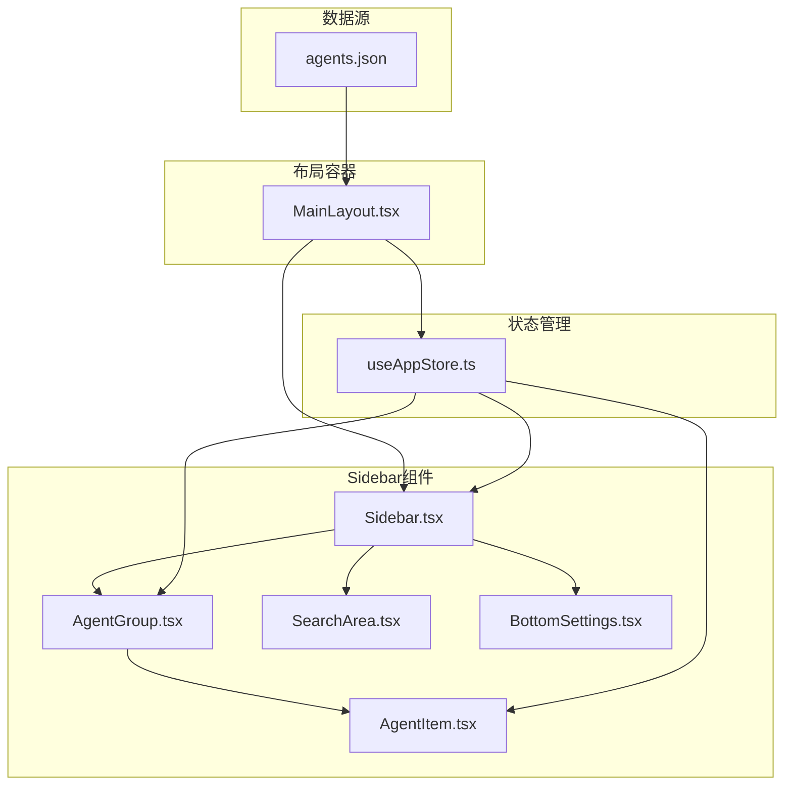

**图表来源**
- [AgentGroup.tsx](file://src/components/Sidebar/AgentGroup.tsx#L1-L54)
- [AgentItem.tsx](file://src/components/Sidebar/AgentItem.tsx#L1-L191)
- [Sidebar.tsx](file://src/components/Sidebar/Sidebar.tsx#L1-L179)
- [SearchArea.tsx](file://src/components/Sidebar/SearchArea.tsx#L1-L123)
- [BottomSettings.tsx](file://src/components/Sidebar/BottomSettings.tsx#L1-L64)
- [MainLayout.tsx](file://src/components/MainLayout.tsx#L1-L134)
- [useAppStore.ts](file://src/store/useAppStore.ts#L1-L306)
- [agents.json](file://config/agents.json#L1-L119)

**章节来源**
- [MainLayout.tsx](file://src/components/MainLayout.tsx#L1-L134)
- [useAppStore.ts](file://src/store/useAppStore.ts#L1-L306)

## 核心组件

智能体分组管理系统包含以下核心组件：

### 组件层次结构

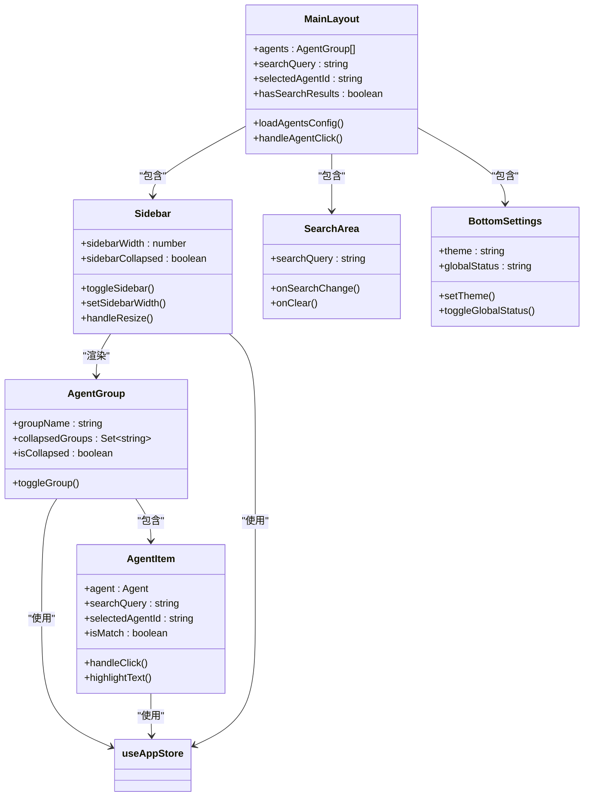

**图表来源**
- [MainLayout.tsx](file://src/components/MainLayout.tsx#L12-L134)
- [Sidebar.tsx](file://src/components/Sidebar/Sidebar.tsx#L1-L179)
- [AgentGroup.tsx](file://src/components/Sidebar/AgentGroup.tsx#L1-L54)
- [AgentItem.tsx](file://src/components/Sidebar/AgentItem.tsx#L1-L191)
- [SearchArea.tsx](file://src/components/Sidebar/SearchArea.tsx#L1-L123)
- [BottomSettings.tsx](file://src/components/Sidebar/BottomSettings.tsx#L1-L64)

**章节来源**
- [AgentGroup.tsx](file://src/components/Sidebar/AgentGroup.tsx#L1-L54)
- [AgentItem.tsx](file://src/components/Sidebar/AgentItem.tsx#L1-L191)
- [Sidebar.tsx](file://src/components/Sidebar/Sidebar.tsx#L1-L179)

## 架构概览

智能体分组管理采用分层架构设计，实现了清晰的关注点分离：

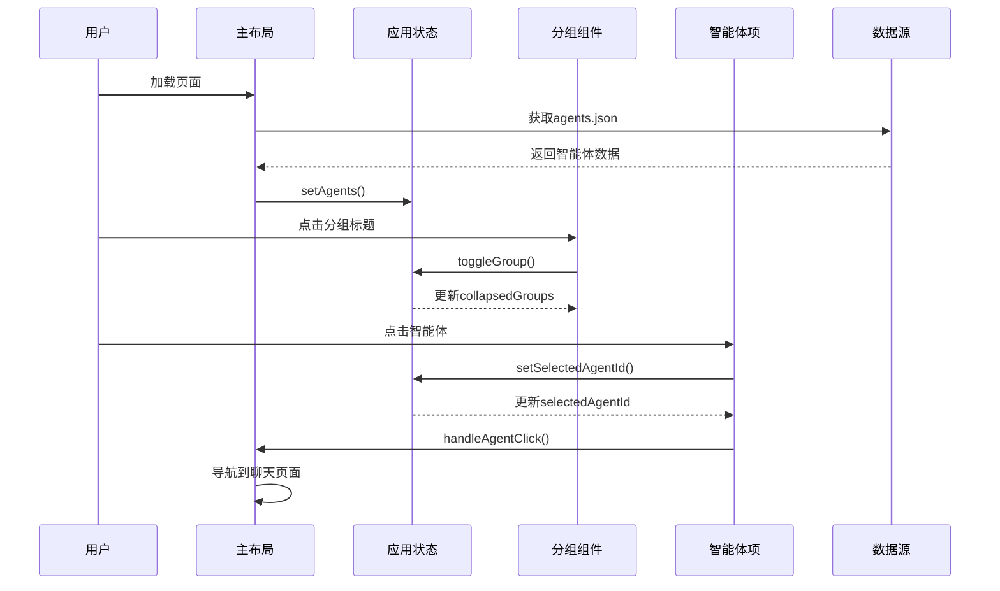

**图表来源**
- [MainLayout.tsx](file://src/components/MainLayout.tsx#L17-L49)
- [useAppStore.ts](file://src/store/useAppStore.ts#L127-L141)
- [AgentGroup.tsx](file://src/components/Sidebar/AgentGroup.tsx#L15-L17)
- [AgentItem.tsx](file://src/components/Sidebar/AgentItem.tsx#L21-L27)

系统架构特点：
- **单向数据流**：状态通过Zustand集中管理，组件只负责展示和事件触发
- **响应式设计**：支持暗色/亮色主题切换，自动适配不同屏幕尺寸
- **事件驱动**：所有用户交互都通过状态变更来驱动UI更新
- **可扩展性**：组件间松耦合，便于功能扩展和样式定制

## 详细组件分析

### AgentGroup组件分析

AgentGroup是智能体分组的核心组件，负责管理分组的展开/折叠状态和显示逻辑。

#### 组件实现细节

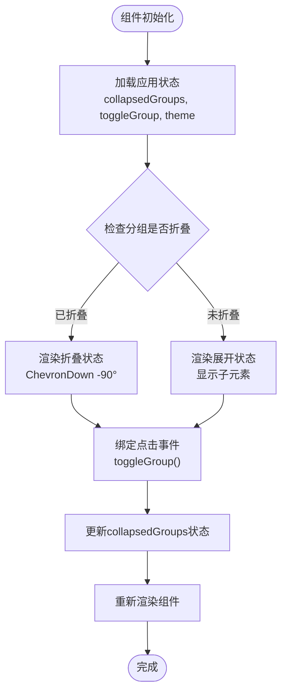

**图表来源**
- [AgentGroup.tsx](file://src/components/Sidebar/AgentGroup.tsx#L11-L52)
- [useAppStore.ts](file://src/store/useAppStore.ts#L133-L141)

#### 展开/折叠状态管理

AgentGroup使用Set数据结构来跟踪折叠状态：

| 状态类型 | 数据结构 | 操作方式 | 性能特征 |
|---------|----------|----------|----------|
| 折叠状态 | Set&lt;string&gt; | has(), add(), delete() | O(1)查找, O(1)插入/删除 |
| 分组标识 | string | groupName参数 | 唯一键值 |
| 状态同步 | 全局状态 | toggleGroup()动作 | 即时响应 |

#### 样式系统

组件支持动态主题切换，根据当前主题应用不同的样式：

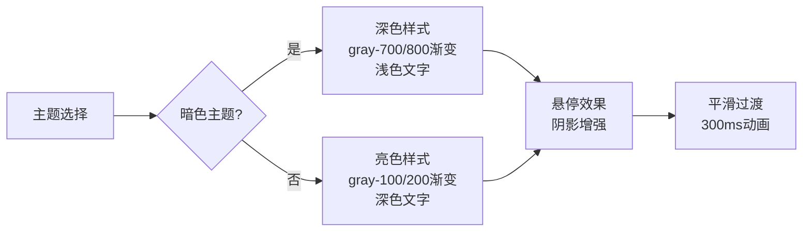

**图表来源**
- [AgentGroup.tsx](file://src/components/Sidebar/AgentGroup.tsx#L19-L29)

**章节来源**
- [AgentGroup.tsx](file://src/components/Sidebar/AgentGroup.tsx#L1-L54)
- [useAppStore.ts](file://src/store/useAppStore.ts#L133-L141)

### AgentItem组件分析

AgentItem负责单个智能体的显示和交互，实现了复杂的搜索高亮和状态管理功能。

#### 搜索匹配算法

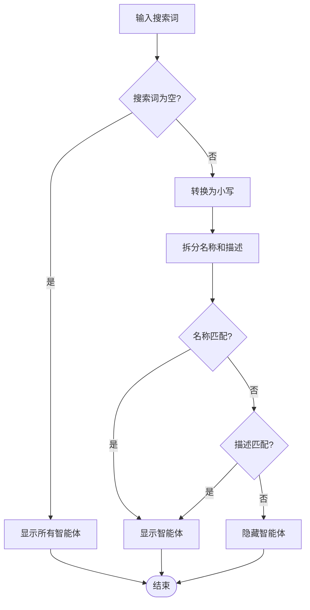

**图表来源**
- [AgentItem.tsx](file://src/components/Sidebar/AgentItem.tsx#L59-L65)

#### 选中状态管理

AgentItem实现了完整的选中状态逻辑：

| 状态条件 | 样式表现 | 动画效果 | 边界条件 |
|---------|----------|----------|----------|
| 未选中且未悬停 | 透明背景 | 无动画 | 默认状态 |
| 未选中但悬停 | 浅色背景 | 0.2s过渡 | 平滑悬停效果 |
| 已选中且未悬停 | 强调背景 | 无动画 | 突出显示 |
| 已选中且悬停 | 强调背景 + 放大 | 0.2s过渡 | 增强视觉反馈 |

#### 头像系统

智能体头像支持多种配置方式：

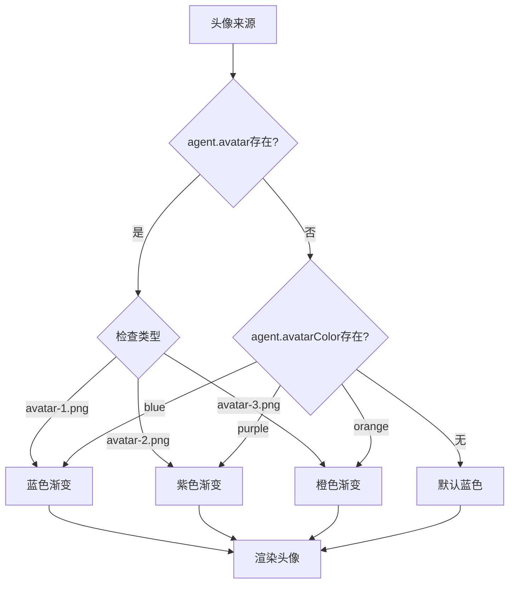

**图表来源**
- [AgentItem.tsx](file://src/components/Sidebar/AgentItem.tsx#L93-L114)

**章节来源**
- [AgentItem.tsx](file://src/components/Sidebar/AgentItem.tsx#L1-L191)

### Sidebar组件分析

Sidebar作为容器组件，提供了侧边栏的基础框架和交互功能。

#### 尺寸调整机制

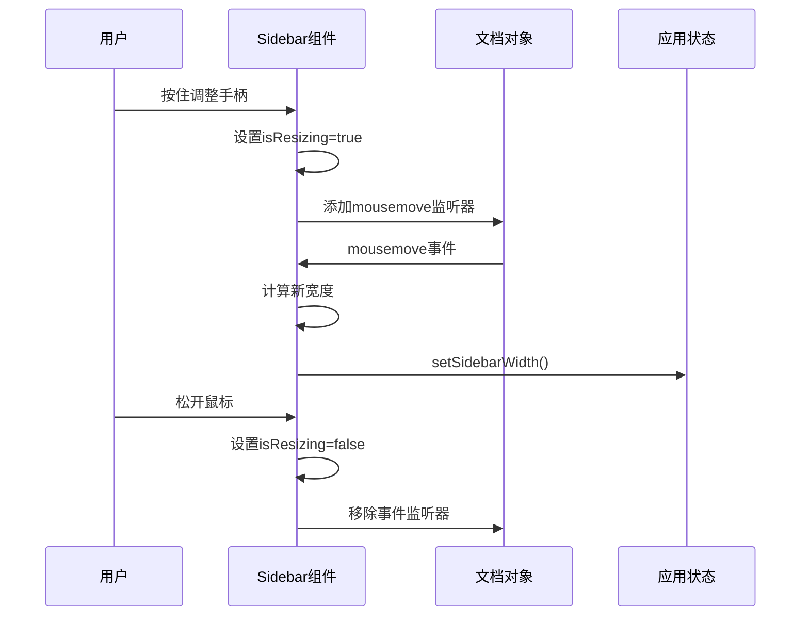

**图表来源**
- [Sidebar.tsx](file://src/components/Sidebar/Sidebar.tsx#L19-L62)
- [useAppStore.ts](file://src/store/useAppStore.ts#L293-L298)

#### 侧边栏切换逻辑

Sidebar实现了完整的折叠/展开功能：

| 触发方式 | 操作类型 | 状态变化 | 视觉反馈 |
|---------|----------|----------|----------|
| 点击切换按钮 | 用户操作 | sidebarCollapsed切换 | 旋转动画 |
| 调整宽度 | 用户操作 | sidebarWidth更新 | 宽度变化 |
| 悬停效果 | 鼠标事件 | 样式临时变化 | 高亮显示 |

**章节来源**
- [Sidebar.tsx](file://src/components/Sidebar/Sidebar.tsx#L1-L179)
- [useAppStore.ts](file://src/store/useAppStore.ts#L286-L298)

### 数据绑定关系

智能体分组系统实现了多层次的数据绑定：

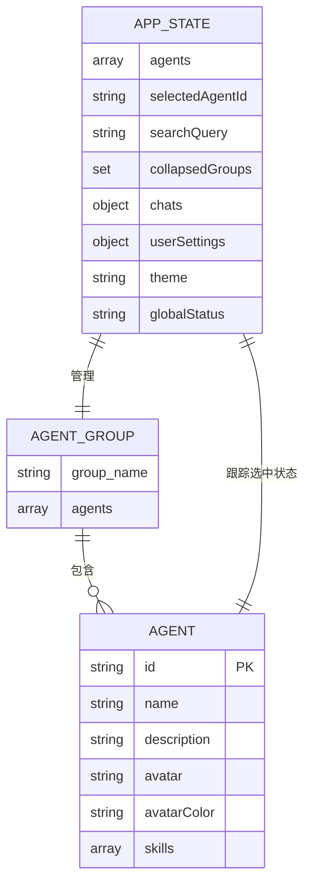

**图表来源**
- [useAppStore.ts](file://src/store/useAppStore.ts#L3-L83)
- [agents.json](file://config/agents.json#L1-L119)

**章节来源**
- [useAppStore.ts](file://src/store/useAppStore.ts#L56-L83)
- [agents.json](file://config/agents.json#L1-L119)

## 依赖关系分析

智能体分组管理系统的依赖关系呈现清晰的层次结构：

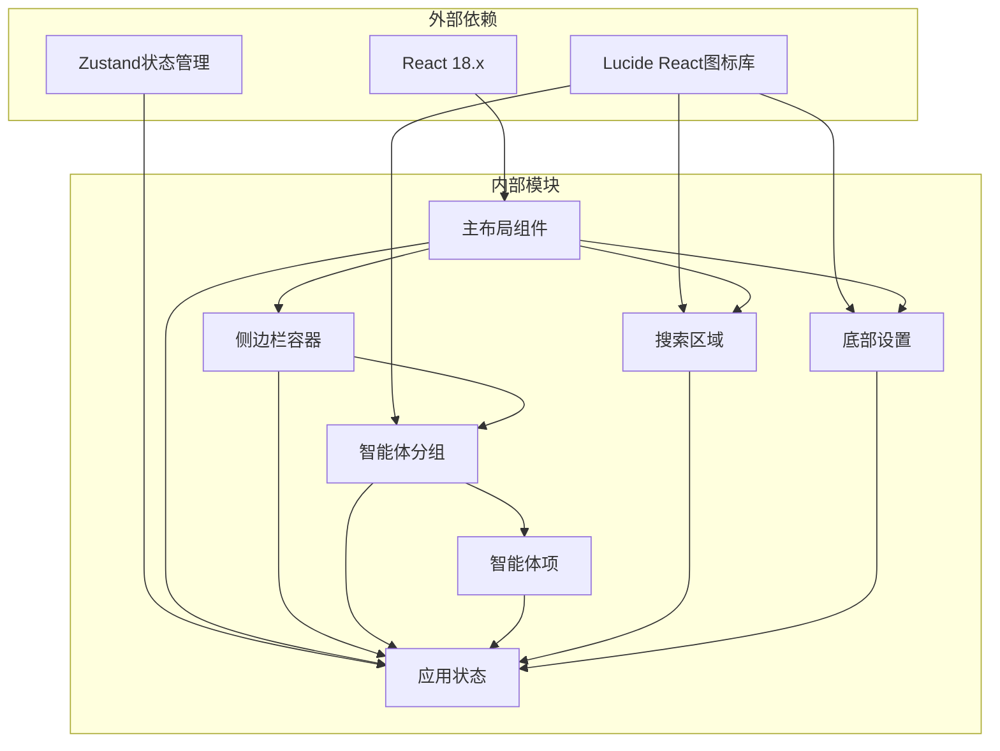

**图表来源**
- [MainLayout.tsx](file://src/components/MainLayout.tsx#L1-L10)
- [useAppStore.ts](file://src/store/useAppStore.ts#L1)

### 状态同步策略

系统采用集中式状态管理模式，确保数据一致性：

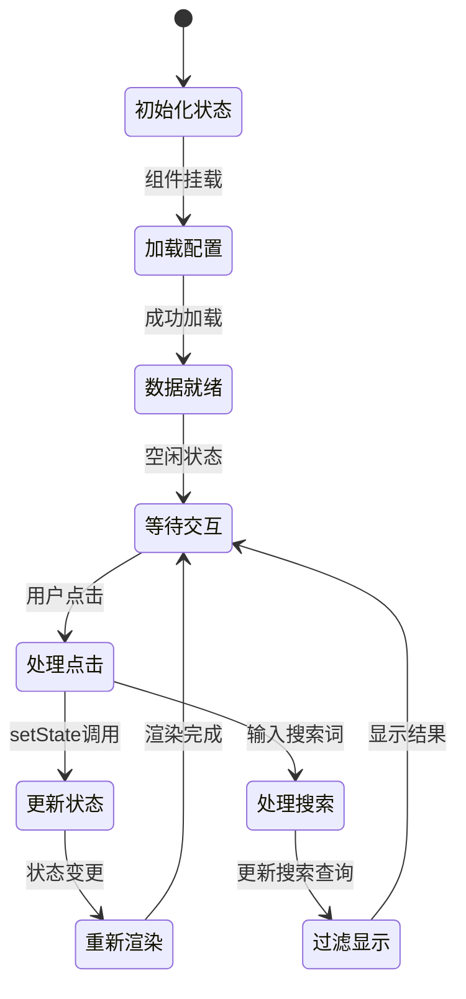

**图表来源**
- [MainLayout.tsx](file://src/components/MainLayout.tsx#L56-L65)
- [useAppStore.ts](file://src/store/useAppStore.ts#L131-L132)

**章节来源**
- [MainLayout.tsx](file://src/components/MainLayout.tsx#L1-L134)
- [useAppStore.ts](file://src/store/useAppStore.ts#L1-L306)

## 性能考虑

智能体分组管理系统在性能方面采用了多项优化策略：

### 渲染优化

1. **虚拟滚动**：对于大量智能体的情况，建议实现虚拟滚动以减少DOM节点数量
2. **记忆化计算**：使用useMemo避免不必要的重新计算
3. **条件渲染**：折叠状态下的子元素不进行渲染

### 状态管理优化

1. **局部状态**：仅在需要的地方使用局部状态，避免全局状态污染
2. **状态分割**：将不同类型的配置分离到独立的状态字段
3. **批量更新**：使用原子操作减少状态更新次数

### 内存管理

1. **事件清理**：在组件卸载时清理所有事件监听器
2. **资源释放**：及时释放不再使用的资源和缓存
3. **垃圾回收**：避免创建不必要的闭包和引用

## 故障排除指南

### 常见问题及解决方案

#### 智能体无法显示

**问题症状**：智能体列表为空或显示错误

**可能原因**：
1. agents.json文件加载失败
2. 数据格式不符合预期
3. 状态初始化问题

**解决步骤**：
1. 检查agents.json文件格式
2. 验证网络连接和文件路径
3. 查看控制台错误日志

#### 分组展开/折叠失效

**问题症状**：点击分组标题无响应

**可能原因**：
1. toggleGroup函数未正确绑定
2. collapsedGroups状态未更新
3. 事件冒泡问题

**解决步骤**：
1. 检查AgentGroup组件的事件处理
2. 验证useAppStore中的toggleGroup实现
3. 确认状态更新是否触发重新渲染

#### 搜索功能异常

**问题症状**：搜索框输入无效或结果不准确

**可能原因**：
1. 搜索查询状态未正确更新
2. 匹配算法逻辑错误
3. 字符串比较大小写问题

**解决步骤**：
1. 检查SearchArea组件的状态绑定
2. 验证AgentItem的搜索匹配逻辑
3. 确保字符串转换为小写进行比较

**章节来源**
- [MainLayout.tsx](file://src/components/MainLayout.tsx#L17-L49)
- [AgentGroup.tsx](file://src/components/Sidebar/AgentGroup.tsx#L15-L17)
- [AgentItem.tsx](file://src/components/Sidebar/AgentItem.tsx#L59-L65)

## 结论

智能体分组管理系统展现了优秀的前端架构设计，具有以下特点：

### 设计优势

1. **清晰的架构层次**：组件职责明确，数据流向单一
2. **良好的扩展性**：松耦合设计便于功能扩展
3. **优秀的用户体验**：响应式设计和流畅的动画效果
4. **完善的错误处理**：健壮的状态管理和异常处理机制

### 技术亮点

1. **状态管理**：使用Zustand实现轻量级状态管理
2. **响应式设计**：支持主题切换和自适应布局
3. **性能优化**：合理的渲染策略和内存管理
4. **可维护性**：清晰的代码结构和文档注释

### 改进建议

1. **性能监控**：添加性能指标监控和分析工具
2. **测试覆盖**：增加单元测试和集成测试
3. **国际化**：支持多语言界面
4. **无障碍访问**：增强键盘导航和屏幕阅读器支持

## 附录

### 扩展方法

#### 自定义分组样式

要自定义分组样式，可以修改AgentGroup组件的样式生成函数：

1. 修改颜色方案：在getGroupHeaderClasses函数中调整渐变色
2. 调整动画效果：修改transition-duration和ease参数
3. 改变边框样式：更新border类名和颜色

#### 添加新的交互功能

要在现有基础上添加新功能：

1. **状态扩展**：在useAppStore中添加新的状态字段
2. **组件扩展**：创建新的子组件或修改现有组件
3. **事件处理**：添加相应的事件处理器和状态更新逻辑
4. **样式定制**：根据需求调整CSS类名和样式规则

#### 性能优化实践

1. **懒加载**：对大型分组实现懒加载机制
2. **缓存策略**：实现智能缓存减少重复计算
3. **虚拟化**：对大量数据实现虚拟滚动
4. **防抖节流**：对频繁触发的操作添加防抖节流

### 最佳实践

1. **保持单一职责**：每个组件只负责一个特定功能
2. **使用不可变数据**：避免直接修改状态对象
3. **合理使用副作用**：将副作用封装在effect中
4. **错误边界处理**：为关键组件添加错误边界
5. **性能监控**：定期检查组件渲染性能