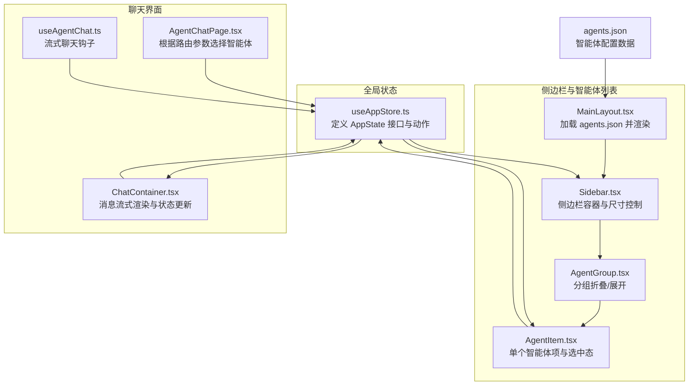
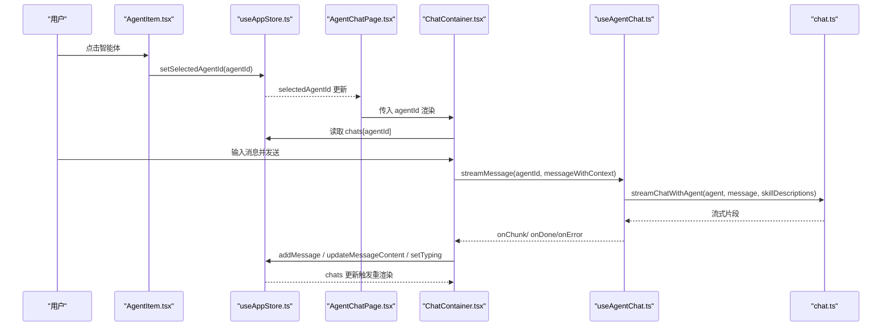
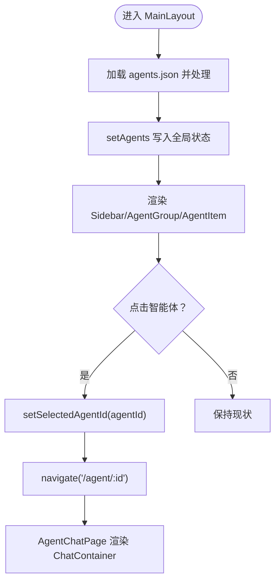
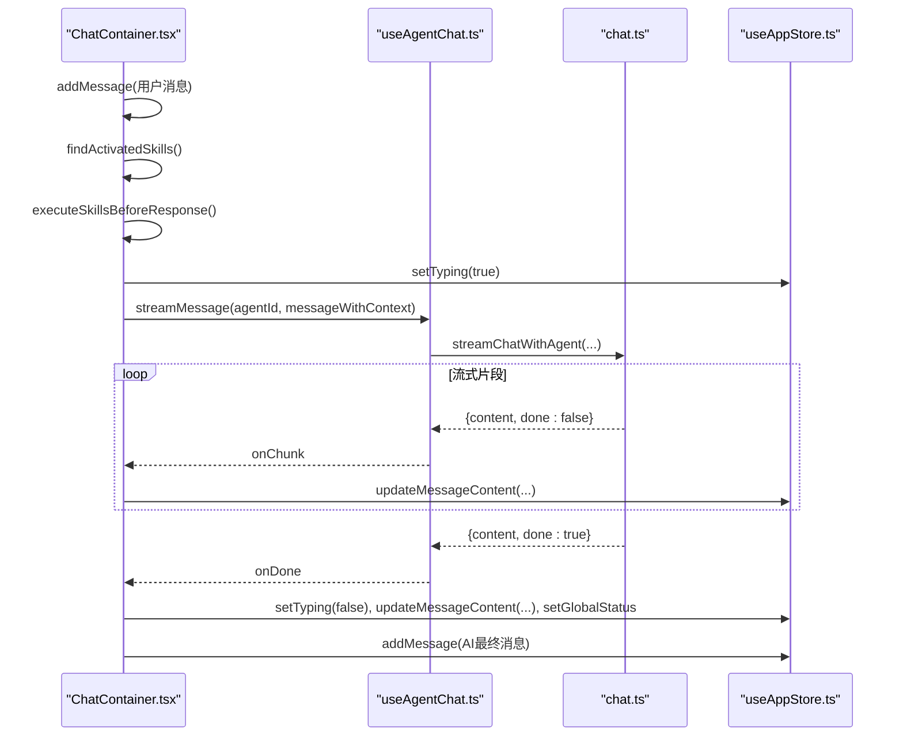
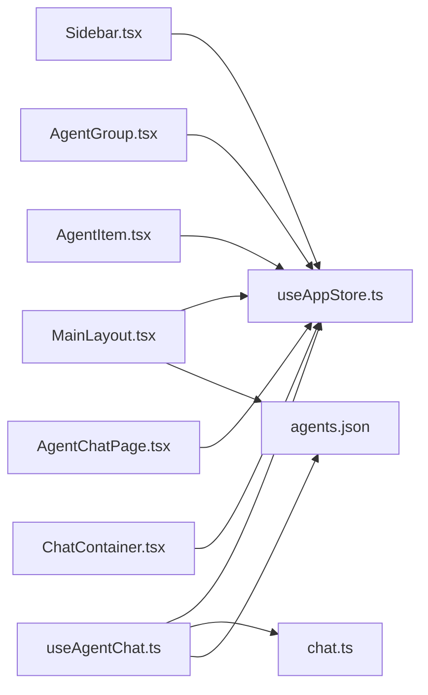

# 智能体状态管理

<cite>
**本文引用的文件**
- [useAppStore.ts](file://src/store/useAppStore.ts)
- [Sidebar.tsx](file://src/components/Sidebar/Sidebar.tsx)
- [AgentItem.tsx](file://src/components/Sidebar/AgentItem.tsx)
- [AgentGroup.tsx](file://src/components/Sidebar/AgentGroup.tsx)
- [MainLayout.tsx](file://src/components/MainLayout.tsx)
- [AgentChatPage.tsx](file://src/pages/AgentChatPage.tsx)
- [ChatContainer.tsx](file://src/components/chat/ChatContainer.tsx)
- [useAgentChat.ts](file://src/hooks/useAgentChat.ts)
- [chat.ts](file://src/types/chat.ts)
- [agents.json](file://config/agents.json)
</cite>

## 目录
1. [简介](#简介)
2. [项目结构](#项目结构)
3. [核心组件](#核心组件)
4. [架构总览](#架构总览)
5. [详细组件分析](#详细组件分析)
6. [依赖关系分析](#依赖关系分析)
7. [性能考量](#性能考量)
8. [故障排查指南](#故障排查指南)
9. [结论](#结论)
10. [附录](#附录)

## 简介
本文件聚焦于 AutoMate 的“智能体状态管理”，系统性阐述以下内容：
- 智能体状态的数据结构与生命周期：当前激活智能体、智能体列表状态、状态变更监听机制
- 全局状态管理在应用中的角色：useAppStore 的状态定义与更新方法
- 智能体切换的触发条件、状态同步过程与 UI 更新机制
- 智能体状态与聊天界面、侧边栏等组件的交互关系
- 最佳实践、性能优化策略与常见问题的解决方案

## 项目结构
AutoMate 前端采用 Zustand 全局状态管理，配合 React 组件进行状态驱动的 UI 渲染。智能体状态主要分布在以下位置：
- 全局状态：src/store/useAppStore.ts
- 侧边栏与智能体列表：src/components/Sidebar/*
- 聊天容器：src/components/chat/ChatContainer.tsx
- 页面路由与导航：src/pages/AgentChatPage.tsx
- 类型与服务：src/types/chat.ts、src/hooks/useAgentChat.ts
- 智能体配置：config/agents.json



图表来源
- [useAppStore.ts](file://src/store/useAppStore.ts#L56-L83)
- [MainLayout.tsx](file://src/components/MainLayout.tsx#L17-L49)
- [Sidebar.tsx](file://src/components/Sidebar/Sidebar.tsx#L8-L87)
- [AgentGroup.tsx](file://src/components/Sidebar/AgentGroup.tsx#L11-L51)
- [AgentItem.tsx](file://src/components/Sidebar/AgentItem.tsx#L16-L151)
- [AgentChatPage.tsx](file://src/pages/AgentChatPage.tsx#L6-L22)
- [ChatContainer.tsx](file://src/components/chat/ChatContainer.tsx#L13-L103)
- [useAgentChat.ts](file://src/hooks/useAgentChat.ts#L18-L49)
- [agents.json](file://config/agents.json#L1-L119)

章节来源
- [useAppStore.ts](file://src/store/useAppStore.ts#L1-L306)
- [MainLayout.tsx](file://src/components/MainLayout.tsx#L1-L134)
- [Sidebar.tsx](file://src/components/Sidebar/Sidebar.tsx#L1-L179)
- [AgentGroup.tsx](file://src/components/Sidebar/AgentGroup.tsx#L1-L54)
- [AgentItem.tsx](file://src/components/Sidebar/AgentItem.tsx#L1-L191)
- [AgentChatPage.tsx](file://src/pages/AgentChatPage.tsx#L1-L24)
- [ChatContainer.tsx](file://src/components/chat/ChatContainer.tsx#L1-L756)
- [useAgentChat.ts](file://src/hooks/useAgentChat.ts#L1-L128)
- [agents.json](file://config/agents.json#L1-L119)

## 核心组件
本节从数据结构、生命周期与状态更新三个维度，系统梳理智能体状态管理的核心要点。

- 数据结构
  - 智能体与分组：Agent、AgentGroup、AgentsConfig
  - 全局状态：AppState，包含 agents、selectedAgentId、searchQuery、collapsedGroups、chats、userSettings、theme、themeConfig、globalStatus
  - 聊天状态：ChatState，按 agentId 维度存储 messages 与 isTyping
  - 消息结构：Message，包含 id、content、isUser、timestamp、status、skillActivated、thinkingContent、isStreaming

- 生命周期
  - 初始化：MainLayout 在挂载时从 agents.json 加载并处理智能体配置，通过 setAgents 写入全局状态
  - 切换：AgentItem 或 AgentChatPage 触发 setSelectedAgentId，更新当前激活智能体
  - 搜索：MainLayout 通过 setSearchQuery 过滤智能体列表
  - 折叠：AgentGroup 通过 toggleGroup 控制分组展开/折叠
  - 聊天：ChatContainer 基于 selectedAgentId 读取 chats，addMessage/updateMessageContent/removeLastAiMessage/setTyping 等动作更新消息与打字态

- 状态变更监听机制
  - Zustand 订阅：组件通过 useAppStore(selector) 订阅部分状态，仅在对应字段变化时重渲染
  - 事件链路：点击智能体 -> setSelectedAgentId -> ChatContainer 读取 chats -> 渲染消息与打字指示 -> 流式更新消息内容

章节来源
- [useAppStore.ts](file://src/store/useAppStore.ts#L3-L83)
- [MainLayout.tsx](file://src/components/MainLayout.tsx#L17-L49)
- [AgentItem.tsx](file://src/components/Sidebar/AgentItem.tsx#L16-L27)
- [AgentChatPage.tsx](file://src/pages/AgentChatPage.tsx#L6-L14)
- [ChatContainer.tsx](file://src/components/chat/ChatContainer.tsx#L29-L103)

## 架构总览
下图展示智能体状态在全局状态与各组件间的流转关系，以及消息流式渲染的关键路径。



图表来源
- [AgentItem.tsx](file://src/components/Sidebar/AgentItem.tsx#L21-L27)
- [useAppStore.ts](file://src/store/useAppStore.ts#L67-L83)
- [AgentChatPage.tsx](file://src/pages/AgentChatPage.tsx#L6-L14)
- [ChatContainer.tsx](file://src/components/chat/ChatContainer.tsx#L213-L392)
- [useAgentChat.ts](file://src/hooks/useAgentChat.ts#L84-L119)
- [chat.ts](file://src/types/chat.ts#L96-L189)

## 详细组件分析

### 全局状态定义与更新（useAppStore）
- 状态模型
  - agents：智能体分组列表，由 MainLayout 从 agents.json 处理后写入
  - selectedAgentId：当前激活智能体 ID，用于路由与聊天容器渲染
  - searchQuery/collapsedGroups：侧边栏搜索与分组折叠状态
  - chats：按 agentId 维度的消息与打字态集合
  - userSettings/theme/themeConfig/globalStatus：用户设置、主题、全局状态
- 关键动作
  - setAgents：写入智能体分组
  - setSelectedAgentId：切换当前智能体
  - setSearchQuery/toggleGroup：搜索与折叠
  - addMessage/updateMessageContent/updateMessageThinkingContent/removeLastAiMessage/setTyping：消息与打字态管理
  - updateUserSettings/setTheme/setThemeConfig/toggleSidebar/setSidebarWidth：用户设置与主题
  - setGlobalStatus/toggleGlobalStatus：全局在线/离线状态

```mermaid
classDiagram
class AppState {
+AgentGroup[] agents
+string|null selectedAgentId
+string searchQuery
+Set~string~ collapsedGroups
+ChatState chats
+UserSettings userSettings
+string theme
+ThemeConfig themeConfig
+string globalStatus
+setAgents(agents)
+setSelectedAgentId(id)
+setSearchQuery(query)
+toggleGroup(name)
+addMessage(agentId, message)
+updateMessageContent(agentId, messageId, content, isStreaming)
+updateMessageThinkingContent(agentId, messageId, thinking)
+removeLastAiMessage(agentId)
+setTyping(agentId, isTyping)
+updateUserSettings(settings)
+setTheme(theme)
+setThemeConfig(config)
+toggleSidebar()
+setSidebarWidth(width)
+setGlobalStatus(status)
+toggleGlobalStatus()
}
class ChatState {
+[agentId] : { messages, isTyping }
}
class UserSettings {
+boolean sidebarCollapsed
+number sidebarWidth
+string theme
+ThemeConfig themeConfig
+string language
+boolean notifications
}
class ThemeConfig {
+string primaryColor
+string secondaryColor
+string textColor
+string backgroundColor
+string borderColor
+string fontSize
+string fontWeight
+boolean animationEnabled
+string animationDuration
}
AppState --> ChatState : "持有"
AppState --> UserSettings : "持有"
UserSettings --> ThemeConfig : "持有"
```

图表来源
- [useAppStore.ts](file://src/store/useAppStore.ts#L56-L83)
- [useAppStore.ts](file://src/store/useAppStore.ts#L28-L33)
- [useAppStore.ts](file://src/store/useAppStore.ts#L47-L54)
- [useAppStore.ts](file://src/store/useAppStore.ts#L35-L45)

章节来源
- [useAppStore.ts](file://src/store/useAppStore.ts#L1-L306)

### 侧边栏与智能体列表（MainLayout、Sidebar、AgentGroup、AgentItem）
- MainLayout
  - 从 agents.json 加载配置，处理 avatarColor 与 skills 字段，调用 setAgents 写入全局状态
  - 提供 handleAgentClick 将智能体点击转换为路由跳转与状态切换
- Sidebar
  - 管理侧边栏宽度与折叠，基于 userSettings 动态样式
  - 提供拖拽调整宽度与切换按钮
- AgentGroup
  - 基于 collapsedGroups 控制分组展开/折叠，切换时调用 toggleGroup
- AgentItem
  - 展示智能体头像、名称、描述与在线状态
  - 点击时调用 setSelectedAgentId 或外部 onClick 回调
  - 支持高亮搜索关键词



图表来源
- [MainLayout.tsx](file://src/components/MainLayout.tsx#L17-L54)
- [Sidebar.tsx](file://src/components/Sidebar/Sidebar.tsx#L8-L87)
- [AgentGroup.tsx](file://src/components/Sidebar/AgentGroup.tsx#L11-L51)
- [AgentItem.tsx](file://src/components/Sidebar/AgentItem.tsx#L16-L151)
- [AgentChatPage.tsx](file://src/pages/AgentChatPage.tsx#L6-L22)

章节来源
- [MainLayout.tsx](file://src/components/MainLayout.tsx#L1-L134)
- [Sidebar.tsx](file://src/components/Sidebar/Sidebar.tsx#L1-L179)
- [AgentGroup.tsx](file://src/components/Sidebar/AgentGroup.tsx#L1-L54)
- [AgentItem.tsx](file://src/components/Sidebar/AgentItem.tsx#L1-L191)
- [AgentChatPage.tsx](file://src/pages/AgentChatPage.tsx#L1-L24)

### 聊天容器与消息流式渲染（ChatContainer、useAgentChat、chat.ts）
- ChatContainer
  - 依据 selectedAgentId 读取 chats，首次进入时异步加载最近24小时的历史消息
  - 用户发送消息时：
    - addMessage 添加用户消息
    - findActivatedSkills 匹配技能关键词
    - executeSkillsBeforeResponse 在 AI 回复前执行技能（可选）
    - setTyping(true) 显示打字指示
    - streamMessage 发起流式请求
    - onChunk 累积内容并批量更新 updateMessageContent，滚动到底部
    - onDone 结束时清理打字态、保存消息与技能调用记录
    - onError 保存失败消息并提示
  - 支持重试：删除最后一条 AI 消息并重新发起流式请求
- useAgentChat
  - 首次加载 agents.json，构建 skillDescriptions
  - sendMessage/streamMessage 对外暴露流式与非流式聊天能力
- chat.ts
  - 定义 Agent、Skill、ChatMessage、StreamChunk、ChatResponse 等类型
  - streamChatWithAgent 实现 SSE/流式解析，逐片推送内容
  - buildSystemPrompt 自动注入技能描述，增强系统提示



图表来源
- [ChatContainer.tsx](file://src/components/chat/ChatContainer.tsx#L213-L392)
- [useAgentChat.ts](file://src/hooks/useAgentChat.ts#L84-L119)
- [chat.ts](file://src/types/chat.ts#L96-L189)
- [useAppStore.ts](file://src/store/useAppStore.ts#L67-L83)

章节来源
- [ChatContainer.tsx](file://src/components/chat/ChatContainer.tsx#L1-L756)
- [useAgentChat.ts](file://src/hooks/useAgentChat.ts#L1-L128)
- [chat.ts](file://src/types/chat.ts#L1-L280)

### 智能体配置与技能描述（agents.json、chat.ts）
- agents.json
  - 定义智能体分组与智能体详情，包含 id、name、description、avatar、config、skills
  - Avatar 与颜色映射：avatar-1.png -> blue，avatar-2.png -> purple，avatar-3.png -> orange
- chat.ts
  - loadAllSkillsDescriptions 从技能目录加载 SKILL.md 描述，构建 skillDescriptions
  - buildSystemPrompt 将技能描述注入系统提示，提升模型对技能的识别与调用能力

章节来源
- [agents.json](file://config/agents.json#L1-L119)
- [chat.ts](file://src/types/chat.ts#L262-L279)

## 依赖关系分析
- 组件耦合
  - MainLayout 依赖 useAppStore 读取 agents 与 userSettings，并通过 setSelectedAgentId 与 navigate 协作
  - AgentItem 依赖 useAppStore 的 selectedAgentId 与 theme，同时触发 setSelectedAgentId
  - ChatContainer 依赖 useAppStore 的 chats、addMessage、updateMessageContent、setTyping 等动作
  - useAgentChat 依赖 agents.json 与 skillDescriptions，向 ChatContainer 提供流式回调
- 外部依赖
  - agents.json 作为静态配置源，被 MainLayout 与 useAgentChat 加载
  - chat.ts 的流式接口封装了与 LLM 的交互细节，屏蔽底层差异



图表来源
- [MainLayout.tsx](file://src/components/MainLayout.tsx#L12-L54)
- [Sidebar.tsx](file://src/components/Sidebar/Sidebar.tsx#L8-L13)
- [AgentGroup.tsx](file://src/components/Sidebar/AgentGroup.tsx#L11-L12)
- [AgentItem.tsx](file://src/components/Sidebar/AgentItem.tsx#L16-L17)
- [AgentChatPage.tsx](file://src/pages/AgentChatPage.tsx#L6-L8)
- [ChatContainer.tsx](file://src/components/chat/ChatContainer.tsx#L29-L30)
- [useAgentChat.ts](file://src/hooks/useAgentChat.ts#L18-L49)
- [chat.ts](file://src/types/chat.ts#L96-L189)
- [agents.json](file://config/agents.json#L1-L119)

章节来源
- [MainLayout.tsx](file://src/components/MainLayout.tsx#L1-L134)
- [Sidebar.tsx](file://src/components/Sidebar/Sidebar.tsx#L1-L179)
- [AgentGroup.tsx](file://src/components/Sidebar/AgentGroup.tsx#L1-L54)
- [AgentItem.tsx](file://src/components/Sidebar/AgentItem.tsx#L1-L191)
- [AgentChatPage.tsx](file://src/pages/AgentChatPage.tsx#L1-L24)
- [ChatContainer.tsx](file://src/components/chat/ChatContainer.tsx#L1-L756)
- [useAgentChat.ts](file://src/hooks/useAgentChat.ts#L1-L128)
- [chat.ts](file://src/types/chat.ts#L1-L280)
- [agents.json](file://config/agents.json#L1-L119)

## 性能考量
- 状态粒度与订阅
  - 使用 useAppStore(selector) 仅订阅所需字段，避免无关状态导致的重渲染
  - chats 采用按 agentId 分片存储，消息更新只影响对应智能体的 UI
- 渲染优化
  - ChatContainer 中对消息列表使用稳定 key，减少 DOM 重建
  - 流式更新采用累积定时刷新，降低频繁 setState 带来的抖动
- I/O 与缓存
  - agents.json 首次加载后可在内存中复用，避免重复请求
  - skillDescriptions 通过 Map 缓存，避免重复读取 SKILL.md
- 主题与布局
  - Sidebar 的宽度与折叠状态通过 userSettings 控制，避免不必要的重排
  - 主题切换时统一更新 theme 与 themeConfig，减少多处状态分散

## 故障排查指南
- 无法切换智能体
  - 检查 agents.json 是否正确加载，MainLayout 是否调用 setAgents
  - 确认 AgentItem 的 onClick 是否调用 setSelectedAgentId
  - 章节来源
    - [MainLayout.tsx](file://src/components/MainLayout.tsx#L17-L49)
    - [AgentItem.tsx](file://src/components/Sidebar/AgentItem.tsx#L21-L27)
- 聊天消息不显示或不更新
  - 确认 selectedAgentId 是否与 agentId 一致
  - 检查 addMessage 是否被调用，updateMessageContent 是否按批更新
  - 章节来源
    - [AgentChatPage.tsx](file://src/pages/AgentChatPage.tsx#L6-L14)
    - [ChatContainer.tsx](file://src/components/chat/ChatContainer.tsx#L213-L392)
- 流式输出异常
  - 检查 useAgentChat 的 streamMessage 参数与 skillDescriptions 是否就绪
  - 确认 chat.ts 的 streamChatWithAgent 返回的 SSE 数据格式
  - 章节来源
    - [useAgentChat.ts](file://src/hooks/useAgentChat.ts#L84-L119)
    - [chat.ts](file://src/types/chat.ts#L96-L189)
- 侧边栏宽度/折叠无效
  - 确认 userSettings.sidebarCollapsed 与 userSettings.sidebarWidth 是否被正确更新
  - 章节来源
    - [Sidebar.tsx](file://src/components/Sidebar/Sidebar.tsx#L26-L62)
    - [useAppStore.ts](file://src/store/useAppStore.ts#L286-L298)

## 结论
AutoMate 的智能体状态管理以 Zustand 为核心，围绕“当前激活智能体”“智能体列表”“聊天会话”三大维度构建。通过清晰的类型定义、细粒度的动作与订阅、以及组件间明确的职责划分，实现了高内聚、低耦合的状态管理方案。结合流式渲染与技能匹配机制，系统在交互体验与性能之间取得了良好平衡。建议后续进一步引入状态持久化与更完善的错误边界，以提升稳定性与可观测性。

## 附录
- 最佳实践
  - 使用 selector 订阅最小化状态，避免全量重渲染
  - 在 ChatContainer 中对流式更新采用节流/批量刷新策略
  - 将配置类数据（agents.json）与运行时状态（chats）分离，便于缓存与持久化
- 性能优化建议
  - 对长列表启用虚拟滚动（如后续扩展）
  - 对 skillDescriptions 增加失效策略与增量更新
  - 对流式片段进行去抖与合并，减少 UI 刷新频率
- 常见问题
  - 智能体切换后聊天区域空白：确认 selectedAgentId 与 chats 的一致性
  - 流式输出卡顿：检查 onChunk 的累积与刷新逻辑
  - 主题切换不生效：确认 theme 与 themeConfig 的联动更新