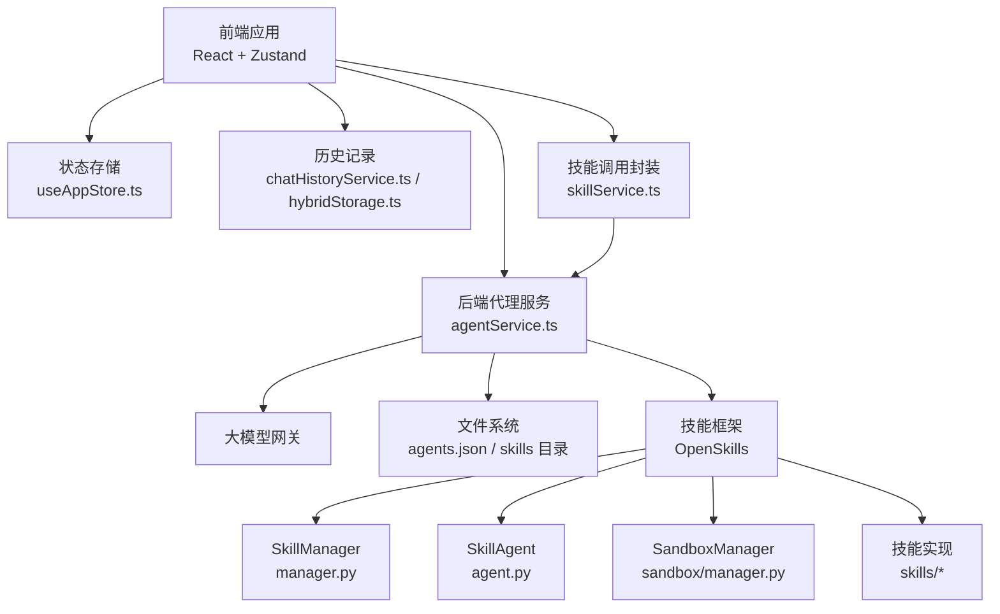
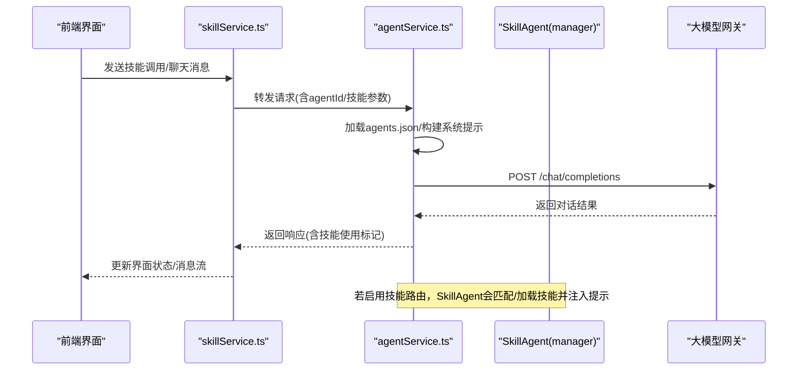
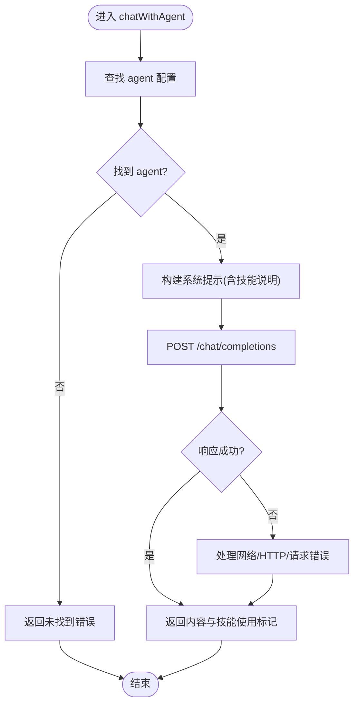
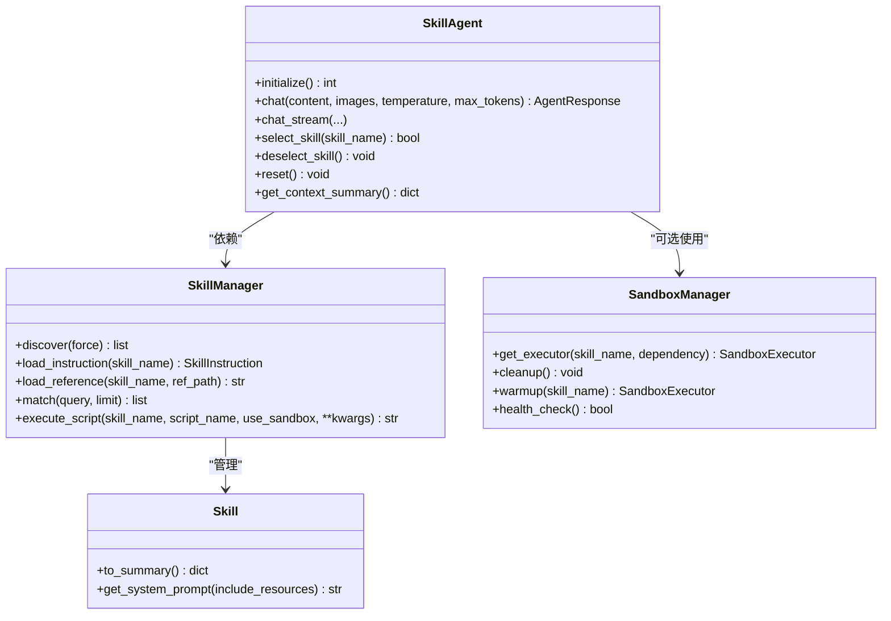
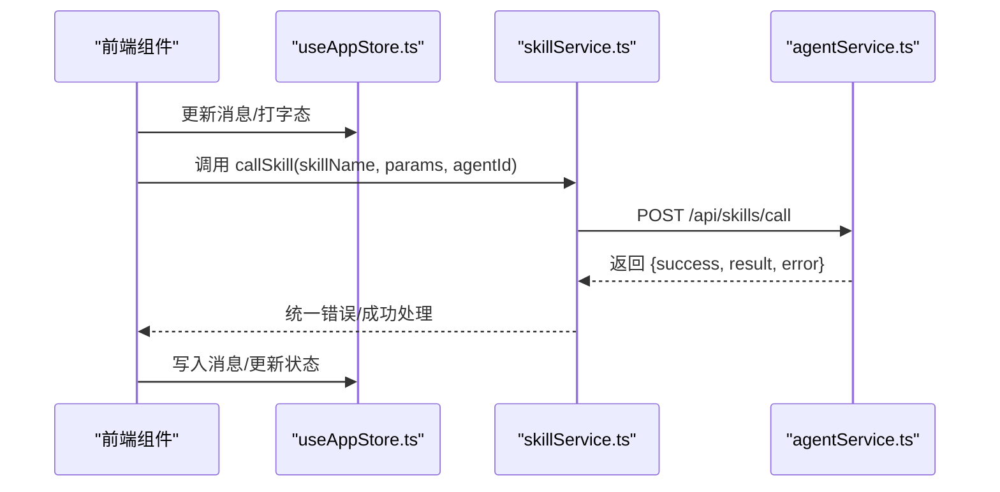
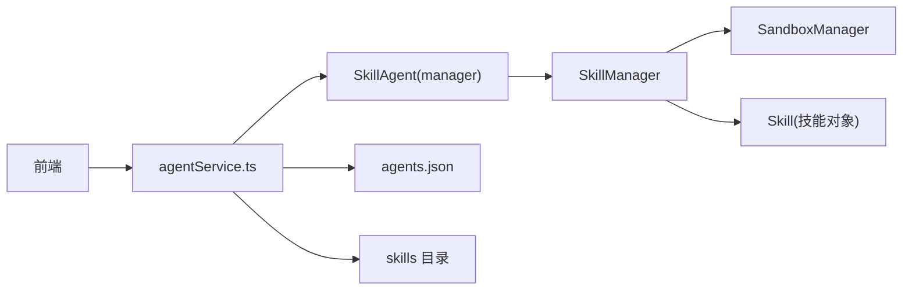

# 智能体生命周期

<cite>
**本文引用的文件**
- [backend/services/agentService.ts](file://backend/services/agentService.ts)
- [src/services/skillService.ts](file://src/services/skillService.ts)
- [config/agents.json](file://config/agents.json)
- [OpenSkills-main/openskills/agent.py](file://OpenSkills-main/openskills/agent.py)
- [OpenSkills-main/openskills/core/manager.py](file://OpenSkills-main/openskills/core/manager.py)
- [OpenSkills-main/openskills/core/skill.py](file://OpenSkills-main/openskills/core/skill.py)
- [OpenSkills-main/openskills/sandbox/manager.py](file://OpenSkills-main/openskills/sandbox/manager.py)
- [skills/official-doc-optimize/main.py](file://skills/official-doc-optimize/main.py)
- [src/store/useAppStore.ts](file://src/store/useAppStore.ts)
- [src/services/chatHistoryService.ts](file://src/services/chatHistoryService.ts)
- [src/services/hybridStorage.ts](file://src/services/hybridStorage.ts)
</cite>

## 目录
1. [引言](#引言)
2. [项目结构](#项目结构)
3. [核心组件](#核心组件)
4. [架构总览](#架构总览)
5. [详细组件分析](#详细组件分析)
6. [依赖分析](#依赖分析)
7. [性能考虑](#性能考虑)
8. [故障排查指南](#故障排查指南)
9. [结论](#结论)
10. [附录](#附录)

## 引言
本文件面向“智能体生命周期管理”的技术文档，围绕智能体从初始化到销毁的完整过程，系统阐述配置加载、实例创建、状态初始化、资源清理、内存与垃圾回收、状态持久化与重启恢复、异常处理、与技能系统的集成时机与依赖管理、监控与性能指标、以及扩展开发的最佳实践。文档以仓库中实际存在的组件为依据，结合前端状态存储、后端代理服务与技能框架，给出可操作的生命周期视图。

## 项目结构
AutoMate 采用前后端分离与技能框架并行的结构：
- 前端（React + Zustand）负责用户界面、聊天状态与本地持久化（IndexedDB）。
- 后端（Node.js）负责智能体配置加载、系统提示构建、与大模型网关的对话转发。
- 技能框架（OpenSkills）提供技能发现、匹配、按需加载与沙箱执行能力。

图表来源
- [backend/services/agentService.ts](file://backend/services/agentService.ts#L58-L185)
- [src/services/skillService.ts](file://src/services/skillService.ts#L12-L61)
- [src/store/useAppStore.ts](file://src/store/useAppStore.ts#L109-L305)
- [src/services/chatHistoryService.ts](file://src/services/chatHistoryService.ts#L59-L85)
- [src/services/hybridStorage.ts](file://src/services/hybridStorage.ts#L61-L87)
- [OpenSkills-main/openskills/agent.py](file://OpenSkills-main/openskills/agent.py#L61-L180)
- [OpenSkills-main/openskills/core/manager.py](file://OpenSkills-main/openskills/core/manager.py#L116-L144)
- [OpenSkills-main/openskills/sandbox/manager.py](file://OpenSkills-main/openskills/sandbox/manager.py#L30-L88)

章节来源
- [backend/services/agentService.ts](file://backend/services/agentService.ts#L58-L185)
- [src/services/skillService.ts](file://src/services/skillService.ts#L12-L61)
- [src/store/useAppStore.ts](file://src/store/useAppStore.ts#L109-L305)
- [src/services/chatHistoryService.ts](file://src/services/chatHistoryService.ts#L59-L85)
- [src/services/hybridStorage.ts](file://src/services/hybridStorage.ts#L61-L87)
- [OpenSkills-main/openskills/agent.py](file://OpenSkills-main/openskills/agent.py#L61-L180)
- [OpenSkills-main/openskills/core/manager.py](file://OpenSkills-main/openskills/core/manager.py#L116-L144)
- [OpenSkills-main/openskills/sandbox/manager.py](file://OpenSkills-main/openskills/sandbox/manager.py#L30-L88)

## 核心组件
- 后端代理服务：负责加载智能体配置、构建系统提示、调用大模型网关、返回结果与错误。
- 技能框架：提供 SkillAgent、SkillManager、SandboxManager，实现技能发现、匹配、按需加载与沙箱执行。
- 前端状态与持久化：Zustand 状态管理、IndexedDB 消息与技能调用记录。
- 技能实现：具体技能脚本（如官方文档优化）。

章节来源
- [backend/services/agentService.ts](file://backend/services/agentService.ts#L58-L185)
- [OpenSkills-main/openskills/agent.py](file://OpenSkills-main/openskills/agent.py#L61-L180)
- [OpenSkills-main/openskills/core/manager.py](file://OpenSkills-main/openskills/core/manager.py#L116-L144)
- [OpenSkills-main/openskills/sandbox/manager.py](file://OpenSkills-main/openskills/sandbox/manager.py#L30-L88)
- [src/store/useAppStore.ts](file://src/store/useAppStore.ts#L109-L305)
- [src/services/hybridStorage.ts](file://src/services/hybridStorage.ts#L61-L87)

## 架构总览
智能体生命周期由“前端触发 → 后端代理 → 技能框架 → 大模型网关 → 返回响应”构成，并在必要时通过沙箱执行技能脚本。

图表来源
- [src/services/skillService.ts](file://src/services/skillService.ts#L12-L61)
- [backend/services/agentService.ts](file://backend/services/agentService.ts#L118-L185)
- [OpenSkills-main/openskills/agent.py](file://OpenSkills-main/openskills/agent.py#L228-L322)

## 详细组件分析

### 后端代理服务（agentService.ts）
职责与行为
- 配置加载：从固定路径读取 agents.json，解析为智能体组与智能体列表。
- 智能体检索：按 agentId 查找对应智能体。
- 技能描述加载：读取技能目录下的 SKILL.md 并提取“何时使用”片段，构建系统提示。
- 对话与技能调用：
  - 聊天：构建系统提示（包含可用技能说明），向大模型网关发起请求，处理网络/HTTP 错误并返回统一格式。
  - 技能调用：基于系统提示与参数，调用大模型执行特定技能描述的任务。
- 错误处理：区分网络错误、HTTP 错误与请求异常，返回结构化错误信息。

关键流程图（聊天）

图表来源
- [backend/services/agentService.ts](file://backend/services/agentService.ts#L118-L185)

章节来源
- [backend/services/agentService.ts](file://backend/services/agentService.ts#L58-L185)

### 技能框架（SkillAgent/SkillManager）
职责与行为
- SkillAgent
  - 初始化：扫描技能路径，发现并注册技能元数据；可预安装沙箱依赖；支持上下文进入/退出（沙箱模式）。
  - 对话：自动选择技能、按需加载参考、构建系统提示、调用 LLM、可选脚本执行与输出回传。
  - 上下文：维护消息、活动技能、已加载参考、跨轮次摘要等。
- SkillManager
  - 发现：扫描目录，仅加载元数据；支持强制重发现。
  - 注册：索引技能元数据。
  - 指令与资源：按需加载技能指令与参考内容。
  - 匹配：基于查询匹配技能。
  - 执行：在沙箱或本地执行脚本，支持文件上传/下载。
- SandboxManager
  - 生命周期：按策略（每次执行、按技能缓存、持久）管理沙箱执行器，支持预热、健康检查与清理。

类关系图

图表来源
- [OpenSkills-main/openskills/agent.py](file://OpenSkills-main/openskills/agent.py#L61-L180)
- [OpenSkills-main/openskills/core/manager.py](file://OpenSkills-main/openskills/core/manager.py#L116-L144)
- [OpenSkills-main/openskills/sandbox/manager.py](file://OpenSkills-main/openskills/sandbox/manager.py#L30-L88)
- [OpenSkills-main/openskills/core/skill.py](file://OpenSkills-main/openskills/core/skill.py#L19-L56)

章节来源
- [OpenSkills-main/openskills/agent.py](file://OpenSkills-main/openskills/agent.py#L155-L322)
- [OpenSkills-main/openskills/core/manager.py](file://OpenSkills-main/openskills/core/manager.py#L116-L318)
- [OpenSkills-main/openskills/sandbox/manager.py](file://OpenSkills-main/openskills/sandbox/manager.py#L89-L147)
- [OpenSkills-main/openskills/core/skill.py](file://OpenSkills-main/openskills/core/skill.py#L19-L56)

### 前端状态与持久化（Zustand + IndexedDB）
职责与行为
- Zustand 状态：管理智能体列表、选中智能体、聊天消息、打字态、主题与全局状态。
- IndexedDB：持久化聊天消息与技能调用记录，提供索引查询与过期清理。
- 技能调用封装：统一发送技能调用请求，处理超时、网络错误与后端返回的错误。

序列图（技能调用）

图表来源
- [src/services/skillService.ts](file://src/services/skillService.ts#L12-L61)
- [backend/services/agentService.ts](file://backend/services/agentService.ts#L200-L245)
- [src/store/useAppStore.ts](file://src/store/useAppStore.ts#L143-L253)
- [src/services/hybridStorage.ts](file://src/services/hybridStorage.ts#L214-L228)

章节来源
- [src/store/useAppStore.ts](file://src/store/useAppStore.ts#L109-L305)
- [src/services/hybridStorage.ts](file://src/services/hybridStorage.ts#L61-L87)
- [src/services/skillService.ts](file://src/services/skillService.ts#L12-L61)
- [backend/services/agentService.ts](file://backend/services/agentService.ts#L200-L245)

### 技能实现示例（official-doc-optimize）
职责与行为
- 提供一个具体的技能函数，演示如何在技能框架下编写可被 SkillAgent 匹配与执行的逻辑。
- 该脚本可由 SkillManager 在沙箱或本地执行，作为技能系统的一部分参与智能体生命周期。

章节来源
- [skills/official-doc-optimize/main.py](file://skills/official-doc-optimize/main.py#L1-L208)

## 依赖分析
- 前端对后端的依赖：skillService.ts 依赖 axios 访问后端 API；useAppStore.ts 管理全局状态；hybridStorage.ts/IndexedDB 用于持久化。
- 后端对技能框架的依赖：agentService.ts 通过系统提示与大模型网关协作；若启用技能路由，SkillAgent 会接管技能发现与执行。
- 技能框架内部：SkillAgent 依赖 SkillManager；SkillManager 依赖 SandboxManager（可选）；SkillManager 管理 Skill 对象。

图表来源
- [backend/services/agentService.ts](file://backend/services/agentService.ts#L58-L185)
- [OpenSkills-main/openskills/agent.py](file://OpenSkills-main/openskills/agent.py#L61-L180)
- [OpenSkills-main/openskills/core/manager.py](file://OpenSkills-main/openskills/core/manager.py#L116-L144)
- [OpenSkills-main/openskills/sandbox/manager.py](file://OpenSkills-main/openskills/sandbox/manager.py#L30-L88)
- [config/agents.json](file://config/agents.json#L1-L119)

章节来源
- [backend/services/agentService.ts](file://backend/services/agentService.ts#L58-L185)
- [OpenSkills-main/openskills/agent.py](file://OpenSkills-main/openskills/agent.py#L61-L180)
- [OpenSkills-main/openskills/core/manager.py](file://OpenSkills-main/openskills/core/manager.py#L116-L144)
- [OpenSkills-main/openskills/sandbox/manager.py](file://OpenSkills-main/openskills/sandbox/manager.py#L30-L88)
- [config/agents.json](file://config/agents.json#L1-L119)

## 性能考虑
- 按需加载与懒加载：SkillManager 仅在发现阶段加载元数据，指令与参考在需要时才加载，降低初始开销。
- 沙箱复用策略：SandboxManager 支持按技能缓存或持久化策略减少沙箱创建/销毁成本。
- 前端状态与持久化：Zustand 提供轻量状态管理；IndexedDB 仅在必要时访问，避免阻塞主线程。
- 大模型调用：设置合理的超时与温度参数，避免长时间等待影响用户体验。

## 故障排查指南
常见问题与定位建议
- 后端无法加载智能体配置
  - 检查 agents.json 路径与权限；确认 JSON 格式正确。
  - 关注配置加载函数的错误日志输出。
- 技能描述加载失败
  - 确认 SKILL.md 存在且可读；检查“何时使用”段落解析逻辑。
- 大模型网关调用失败
  - 区分网络错误、HTTP 状态码与请求异常；检查鉴权头与超时设置。
- 沙箱执行异常
  - 确认 SandboxManager 已正确初始化；检查依赖安装与文件上传/下载流程。
- 前端技能调用失败
  - 检查 skillService.ts 的错误分支与超时处理；确认后端 API 正常。

章节来源
- [backend/services/agentService.ts](file://backend/services/agentService.ts#L58-L185)
- [src/services/skillService.ts](file://src/services/skillService.ts#L12-L61)
- [OpenSkills-main/openskills/sandbox/manager.py](file://OpenSkills-main/openskills/sandbox/manager.py#L177-L192)

## 结论
AutoMate 的智能体生命周期由“前端状态与持久化 + 后端代理 + 技能框架 + 大模型网关”协同完成。通过配置驱动的智能体定义、按需加载的技能体系、可选的沙箱执行与完善的错误处理，系统实现了从初始化到销毁的可控生命周期管理。扩展开发时应遵循“配置优先、按需加载、沙箱安全、状态可恢复”的原则，确保稳定性与可维护性。

## 附录

### 智能体生命周期关键节点与最佳实践
- 初始化
  - 前端：加载 agents.json，初始化 Zustand 状态与 IndexedDB。
  - 后端：加载 agents.json，准备系统提示模板。
  - 技能框架：SkillAgent.initialize 自动发现技能，必要时预装沙箱依赖。
- 实例创建与状态初始化
  - 前端：根据选中的 agentId 维护独立聊天状态与消息队列。
  - 后端：构建系统提示，注入技能说明；准备对话上下文。
  - 技能框架：ConversationContext 初始化，记录消息、活动技能与已加载参考。
- 资源清理
  - 后端：在错误或异常时返回结构化错误，避免资源泄漏。
  - 技能框架：SandboxManager 支持清理所有缓存与持久化执行器。
  - 前端：IndexedDB 定期清理过期数据，避免无限增长。
- 内存管理与垃圾回收
  - 技能框架：按需加载指令与参考，避免一次性占用过多内存。
  - 前端：Zustand 状态粒度控制，避免冗余订阅；IndexedDB 异步访问。
- 状态持久化与重启恢复
  - IndexedDB：保存聊天消息与技能调用记录，支持按 agent 与时间索引查询。
  - 前端：页面刷新后从 IndexedDB 恢复最近会话。
- 异常处理流程
  - 前端：统一捕获网络/超时错误，提示用户并允许重试。
  - 后端：区分不同错误类型，返回一致的错误结构。
  - 技能框架：沙箱执行异常隔离，清理临时资源。
- 与技能系统的集成时机
  - 后端：在构建系统提示时注入技能说明；在需要时调用技能描述驱动的大模型执行。
  - 技能框架：SkillAgent 在对话前自动匹配技能，按需加载参考与脚本。
- 监控与性能指标
  - 建议采集：LLM 调用耗时、技能命中率、沙箱执行耗时、消息持久化延迟、错误率。
  - 前端：记录消息发送/接收时间戳与技能激活事件。
  - 后端：记录系统提示长度、LLM 输出 token 数、错误码分布。
- 扩展开发注意事项
  - 新增智能体：在 agents.json 中添加条目，确保配置字段完整。
  - 新增技能：在 skills 目录下新增子目录与 SKILL.md，遵循技能描述规范。
  - 沙箱执行：谨慎开启自动脚本执行，确保依赖声明与文件同步正确。
  - 前端集成：通过 skillService.ts 统一封装调用，保证错误处理一致性。