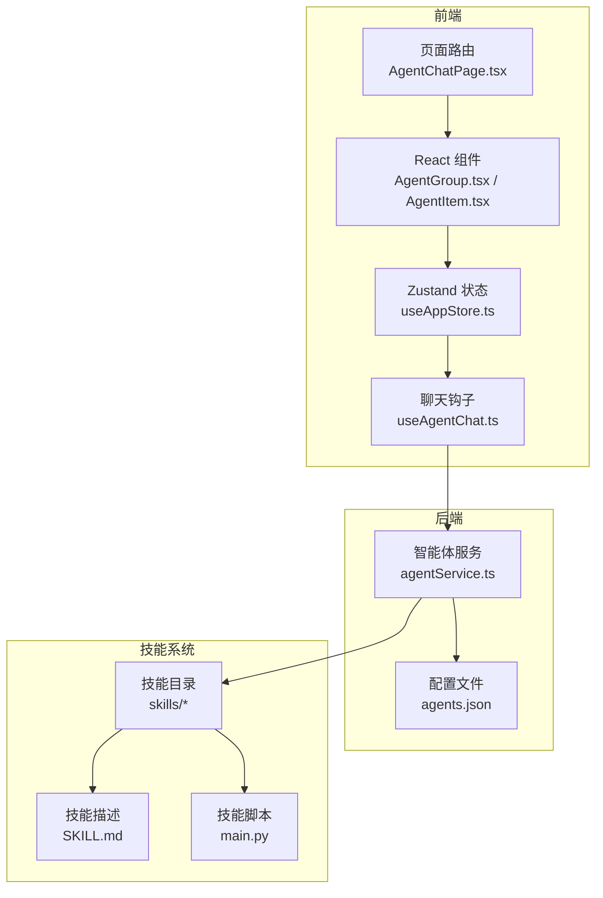
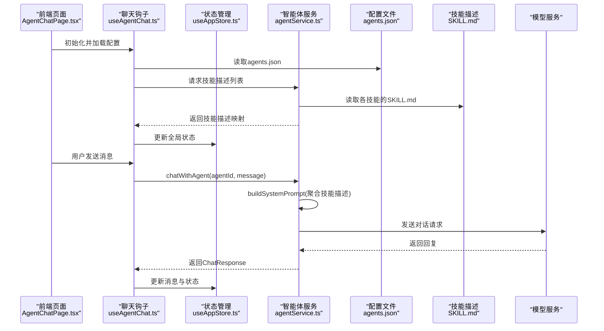
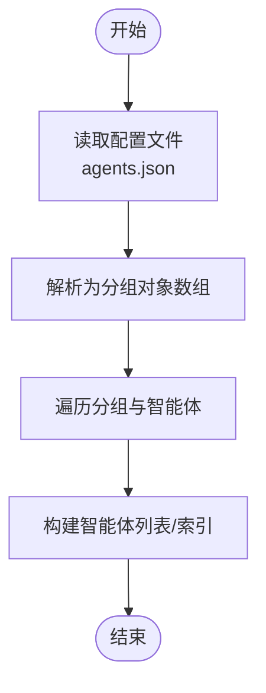
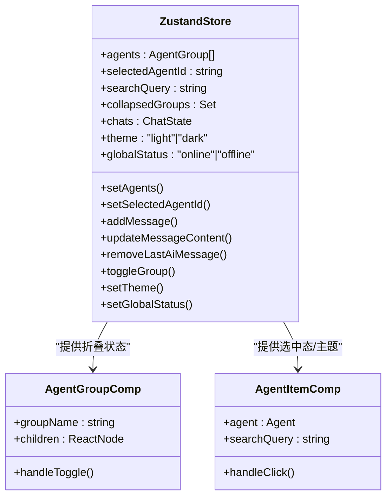
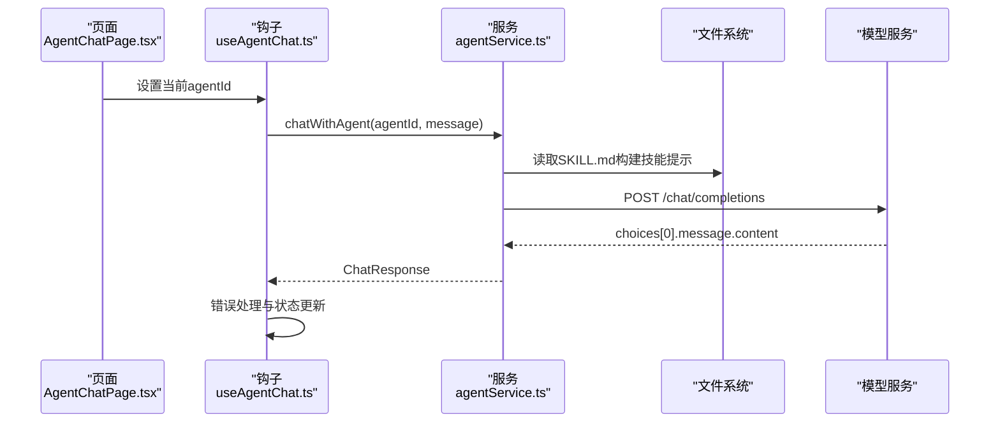
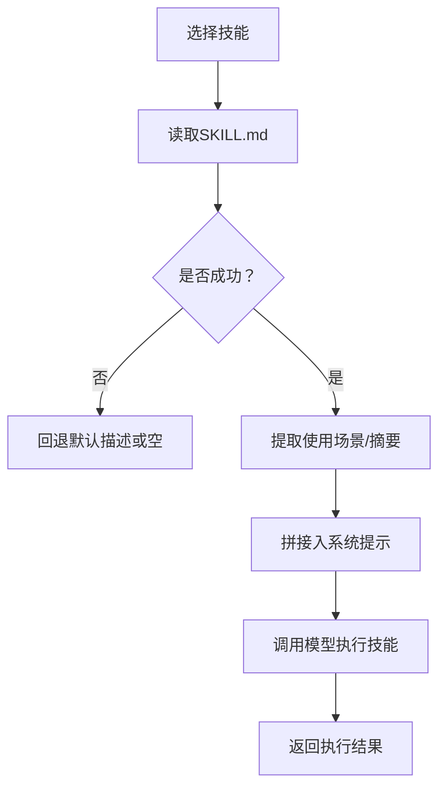
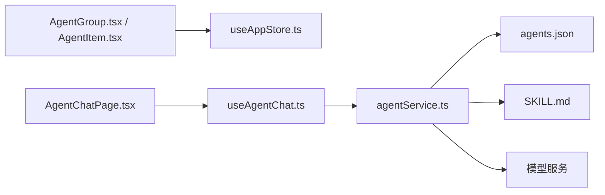

# 智能体管理

<cite>
**本文引用的文件**
- [agents.json](file://config/agents.json)
- [agentService.ts](file://backend/services/agentService.ts)
- [AgentGroup.tsx](file://src/components/Sidebar/AgentGroup.tsx)
- [AgentItem.tsx](file://src/components/Sidebar/AgentItem.tsx)
- [useAppStore.ts](file://src/store/useAppStore.ts)
- [AgentChatPage.tsx](file://src/pages/AgentChatPage.tsx)
- [useAgentChat.ts](file://src/hooks/useAgentChat.ts)
- [SKILL.md](file://skills/todo-query/SKILL.md)
- [main.py](file://skills/weather_query/main.py)
</cite>

## 目录
1. [简介](#简介)
2. [项目结构](#项目结构)
3. [核心组件](#核心组件)
4. [架构总览](#架构总览)
5. [详细组件分析](#详细组件分析)
6. [依赖关系分析](#依赖关系分析)
7. [性能考虑](#性能考虑)
8. [故障排除指南](#故障排除指南)
9. [结论](#结论)
10. [附录](#附录)

## 简介
本文件面向智能体管理系统的技术文档，围绕智能体配置文件结构、分组管理、状态控制、生命周期与动态加载、配置热更新、状态同步、消息路由与技能分配策略进行深入说明，并提供最佳实践、性能优化建议与故障排除指南。同时，解释智能体与技能系统的集成方式与交互模式，给出扩展开发与自定义配置的实现方法。

## 项目结构
系统采用前后端分离架构：
- 前端使用 React + Zustand 状态管理，负责界面渲染、用户交互与聊天会话状态管理。
- 后端使用 TypeScript + Node.js，负责智能体配置加载、系统提示构建、与外部模型服务的对话调用以及技能描述加载。
- 技能以独立目录形式存放，每个技能包含描述文件与可执行脚本，支持按需加载与调用。

图表来源
- [AgentGroup.tsx](file://src/components/Sidebar/AgentGroup.tsx#L1-L54)
- [AgentItem.tsx](file://src/components/Sidebar/AgentItem.tsx#L1-L191)
- [useAppStore.ts](file://src/store/useAppStore.ts#L1-L306)
- [AgentChatPage.tsx](file://src/pages/AgentChatPage.tsx#L1-L24)
- [useAgentChat.ts](file://src/hooks/useAgentChat.ts#L1-L128)
- [agentService.ts](file://backend/services/agentService.ts#L1-L245)
- [agents.json](file://config/agents.json#L1-L119)
- [SKILL.md](file://skills/todo-query/SKILL.md#L1-L24)
- [main.py](file://skills/weather_query/main.py#L1-L139)

章节来源
- [AgentGroup.tsx](file://src/components/Sidebar/AgentGroup.tsx#L1-L54)
- [AgentItem.tsx](file://src/components/Sidebar/AgentItem.tsx#L1-L191)
- [useAppStore.ts](file://src/store/useAppStore.ts#L1-L306)
- [AgentChatPage.tsx](file://src/pages/AgentChatPage.tsx#L1-L24)
- [useAgentChat.ts](file://src/hooks/useAgentChat.ts#L1-L128)
- [agentService.ts](file://backend/services/agentService.ts#L1-L245)
- [agents.json](file://config/agents.json#L1-L119)
- [SKILL.md](file://skills/todo-query/SKILL.md#L1-L24)
- [main.py](file://skills/weather_query/main.py#L1-L139)

## 核心组件
- 智能体配置文件：集中定义智能体分组、智能体元数据、模型配置与技能清单。
- 智能体服务：负责加载配置、构建系统提示、调用模型服务、加载技能描述与执行技能。
- 前端状态与UI：通过 Zustand 管理全局状态、聊天会话、主题与分组折叠；组件负责渲染与交互。
- 技能系统：以技能描述文件与脚本为核心，支持按需加载与调用。

章节来源
- [agents.json](file://config/agents.json#L1-L119)
- [agentService.ts](file://backend/services/agentService.ts#L58-L185)
- [useAppStore.ts](file://src/store/useAppStore.ts#L56-L305)
- [AgentGroup.tsx](file://src/components/Sidebar/AgentGroup.tsx#L11-L51)
- [AgentItem.tsx](file://src/components/Sidebar/AgentItem.tsx#L16-L189)

## 架构总览
系统采用“配置驱动 + 描述驱动”的智能体与技能架构。前端在初始化时拉取配置文件，后端在每次对话前动态拼装系统提示，结合技能描述增强智能体能力；技能以独立模块存在，通过描述文件与脚本实现可插拔扩展。

图表来源
- [AgentChatPage.tsx](file://src/pages/AgentChatPage.tsx#L6-L22)
- [useAgentChat.ts](file://src/hooks/useAgentChat.ts#L25-L82)
- [useAppStore.ts](file://src/store/useAppStore.ts#L143-L165)
- [agentService.ts](file://backend/services/agentService.ts#L58-L185)
- [agents.json](file://config/agents.json#L1-L119)
- [SKILL.md](file://skills/todo-query/SKILL.md#L1-L24)

## 详细组件分析

### 智能体配置文件结构与分组管理
- 结构要点
  - 分组字段：group_name 作为分组标识，agents 为该分组下的智能体数组。
  - 智能体字段：id、name、description、avatar、type、config（url、api_key、model）、skills（技能清单）。
  - 技能字段：name、description、type、storage_path、version。
- 加载与遍历
  - 后端服务统一从固定路径读取配置文件，解析为分组对象数组。
  - 提供查找单个智能体与列出所有智能体的方法，便于前端侧边栏渲染与路由选择。

图表来源
- [agents.json](file://config/agents.json#L1-L119)
- [agentService.ts](file://backend/services/agentService.ts#L58-L78)

章节来源
- [agents.json](file://config/agents.json#L1-L119)
- [agentService.ts](file://backend/services/agentService.ts#L58-L78)

### 智能体状态控制与UI交互
- 状态管理
  - 全局状态包括已加载的智能体分组、当前选中的智能体、搜索关键词、分组折叠状态、聊天会话状态、主题与全局状态等。
  - 提供添加消息、更新消息内容、移除最后一条AI消息、设置打字态、切换主题与全局状态等操作。
- UI组件
  - 侧边栏分组组件支持展开/折叠，点击切换折叠状态。
  - 智能体项组件支持高亮搜索、悬停效果、选中态与在线/离线状态指示。

图表来源
- [useAppStore.ts](file://src/store/useAppStore.ts#L56-L305)
- [AgentGroup.tsx](file://src/components/Sidebar/AgentGroup.tsx#L11-L51)
- [AgentItem.tsx](file://src/components/Sidebar/AgentItem.tsx#L16-L189)

章节来源
- [useAppStore.ts](file://src/store/useAppStore.ts#L56-L305)
- [AgentGroup.tsx](file://src/components/Sidebar/AgentGroup.tsx#L11-L51)
- [AgentItem.tsx](file://src/components/Sidebar/AgentItem.tsx#L16-L189)

### 消息路由与系统提示构建
- 路由流程
  - 页面加载时根据路由参数设置当前智能体。
  - 用户发送消息时，前端通过聊天钩子调用后端服务，传入智能体与用户消息。
- 系统提示构建
  - 后端根据智能体的技能清单，读取对应技能描述文件，拼接为系统提示，增强智能体的上下文能力。
  - 对话请求携带模型参数与超时设置，统一处理网络与API错误。

图表来源
- [AgentChatPage.tsx](file://src/pages/AgentChatPage.tsx#L6-L22)
- [useAgentChat.ts](file://src/hooks/useAgentChat.ts#L51-L82)
- [agentService.ts](file://backend/services/agentService.ts#L98-L185)
- [SKILL.md](file://skills/todo-query/SKILL.md#L1-L24)

章节来源
- [AgentChatPage.tsx](file://src/pages/AgentChatPage.tsx#L6-L22)
- [useAgentChat.ts](file://src/hooks/useAgentChat.ts#L51-L82)
- [agentService.ts](file://backend/services/agentService.ts#L98-L185)

### 技能分配策略与动态加载
- 技能描述加载
  - 后端在构建系统提示时，读取技能目录下的描述文件，提取“使用场景”片段或前若干字符作为技能说明。
- 技能调用
  - 支持直接调用技能执行器，传入技能名称与参数，后端构造系统提示后向模型发起请求，返回执行结果。
- 技能脚本示例
  - 天气查询技能通过脚本实现城市识别、请求天气API与格式化输出，展示技能的可执行性与错误处理。

图表来源
- [agentService.ts](file://backend/services/agentService.ts#L80-L116)
- [SKILL.md](file://skills/todo-query/SKILL.md#L1-L24)
- [main.py](file://skills/weather_query/main.py#L100-L126)

章节来源
- [agentService.ts](file://backend/services/agentService.ts#L80-L116)
- [SKILL.md](file://skills/todo-query/SKILL.md#L1-L24)
- [main.py](file://skills/weather_query/main.py#L100-L126)

### 智能体生命周期管理与动态加载
- 生命周期阶段
  - 配置加载：启动时或首次访问时加载agents.json，构建智能体与技能索引。
  - 运行期：根据用户交互与路由变化切换当前智能体，维护会话状态。
  - 动态更新：支持重新加载配置文件以应用新技能与变更。
- 动态加载
  - 前端在初始化时拉取配置文件，后端在对话前按需读取技能描述，避免一次性加载全部资源。

章节来源
- [useAgentChat.ts](file://src/hooks/useAgentChat.ts#L25-L49)
- [agentService.ts](file://backend/services/agentService.ts#L58-L78)

### 配置热更新与状态同步
- 热更新策略
  - 前端通过定时轮询或事件触发重新拉取配置文件，后端保持对本地文件的最小化读取。
- 状态同步
  - 前端Zustand状态与UI组件双向绑定，确保分组折叠、选中态与全局状态一致。
  - 聊天消息通过状态更新，保证多智能体间的会话隔离与一致性。

章节来源
- [useAppStore.ts](file://src/store/useAppStore.ts#L133-L141)
- [useAgentChat.ts](file://src/hooks/useAgentChat.ts#L25-L49)

## 依赖关系分析
- 前端依赖
  - 组件依赖状态管理，页面依赖路由与聊天钩子。
- 后端依赖
  - 服务依赖配置文件与技能描述文件，对外依赖模型服务API。
- 技能系统
  - 技能目录与描述文件构成技能元数据，脚本实现具体能力。

图表来源
- [AgentGroup.tsx](file://src/components/Sidebar/AgentGroup.tsx#L1-L54)
- [AgentItem.tsx](file://src/components/Sidebar/AgentItem.tsx#L1-L191)
- [useAppStore.ts](file://src/store/useAppStore.ts#L1-L306)
- [AgentChatPage.tsx](file://src/pages/AgentChatPage.tsx#L1-L24)
- [useAgentChat.ts](file://src/hooks/useAgentChat.ts#L1-L128)
- [agentService.ts](file://backend/services/agentService.ts#L1-L245)
- [agents.json](file://config/agents.json#L1-L119)
- [SKILL.md](file://skills/todo-query/SKILL.md#L1-L24)

章节来源
- [AgentGroup.tsx](file://src/components/Sidebar/AgentGroup.tsx#L1-L54)
- [AgentItem.tsx](file://src/components/Sidebar/AgentItem.tsx#L1-L191)
- [useAppStore.ts](file://src/store/useAppStore.ts#L1-L306)
- [AgentChatPage.tsx](file://src/pages/AgentChatPage.tsx#L1-L24)
- [useAgentChat.ts](file://src/hooks/useAgentChat.ts#L1-L128)
- [agentService.ts](file://backend/services/agentService.ts#L1-L245)
- [agents.json](file://config/agents.json#L1-L119)
- [SKILL.md](file://skills/todo-query/SKILL.md#L1-L24)

## 性能考虑
- 配置与描述缓存
  - 前端在初始化时缓存完整配置与技能描述映射，减少重复请求与解析开销。
- 异步加载与懒执行
  - 技能描述仅在需要时读取，避免一次性加载大量文件。
- 超时与重试
  - 对模型服务请求设置合理超时，出现网络异常时快速失败并提示用户。
- UI渲染优化
  - 使用记忆化与条件渲染，避免不必要的组件重绘。
- 并发与节流
  - 在高频输入场景下，对发送消息进行节流，降低后端压力。

## 故障排除指南
- 常见问题
  - 智能体未找到：检查agents.json中的id与前端路由是否一致。
  - 缺少API配置：确认智能体config字段包含url与api_key。
  - 技能描述加载失败：检查SKILL.md是否存在且格式正确。
  - 网络连接失败：检查网络连通性与模型服务地址。
- 错误处理
  - 后端对Axios错误进行分类处理，区分HTTP状态码、无响应与未知错误，并返回可读的错误信息。
  - 前端在发送消息与流式输出过程中捕获异常，设置错误状态并回调错误处理器。

章节来源
- [agentService.ts](file://backend/services/agentService.ts#L161-L184)
- [useAgentChat.ts](file://src/hooks/useAgentChat.ts#L51-L82)

## 结论
本系统通过“配置驱动 + 描述驱动”的方式实现了智能体与技能的解耦与可扩展性。前端以Zustand管理状态与UI交互，后端负责配置加载、系统提示构建与模型服务对接。技能以独立模块存在，具备良好的热更新与动态加载能力。建议在生产环境中进一步引入缓存、并发控制与可观测性监控，以提升稳定性与用户体验。

## 附录

### 智能体配置最佳实践
- 分组命名清晰：group_name 应具有语义化与唯一性，便于前端分组展示与管理。
- 技能清单明确：skills 中的 storage_path 必须指向正确的技能目录，version 用于版本追踪。
- 模型配置标准化：config 字段包含 url、api_key、model，确保后端请求的一致性。
- SKILL.md 规范化：描述文件应包含“使用场景”片段，便于系统提示构建。

章节来源
- [agents.json](file://config/agents.json#L1-L119)
- [SKILL.md](file://skills/todo-query/SKILL.md#L1-L24)

### 扩展开发与自定义配置
- 新增智能体
  - 在agents.json中新增智能体条目，填写必要字段与技能清单。
  - 如需新技能，新建技能目录并在agents.json中添加对应技能项。
- 自定义技能
  - 在技能目录下编写SKILL.md与执行脚本，遵循参数与返回约定。
  - 通过callSkill接口或系统提示触发技能执行。
- UI定制
  - 通过useAppStore的状态接口扩展主题、布局与交互行为。
  - 在AgentItem中扩展头像与状态显示逻辑。

章节来源
- [agentService.ts](file://backend/services/agentService.ts#L200-L244)
- [useAppStore.ts](file://src/store/useAppStore.ts#L67-L83)
- [AgentItem.tsx](file://src/components/Sidebar/AgentItem.tsx#L93-L114)