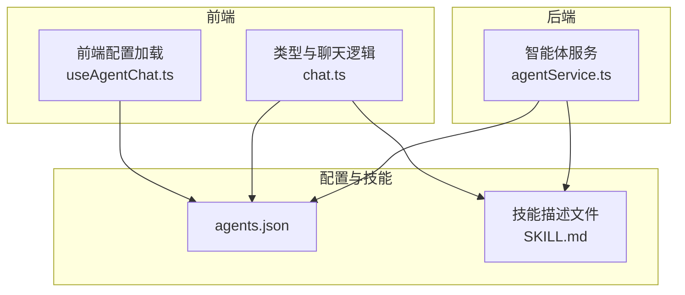
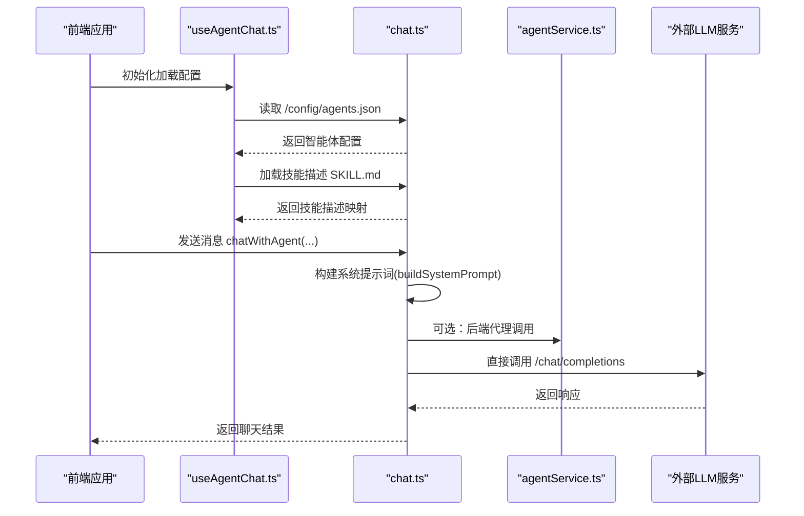
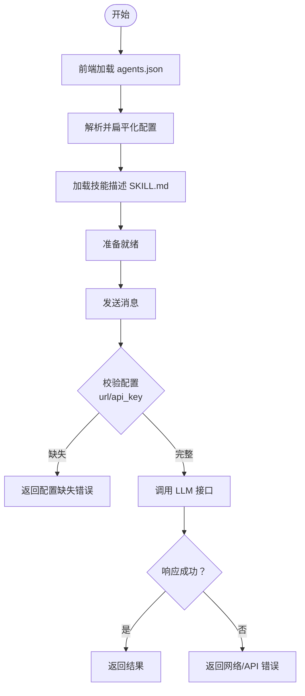
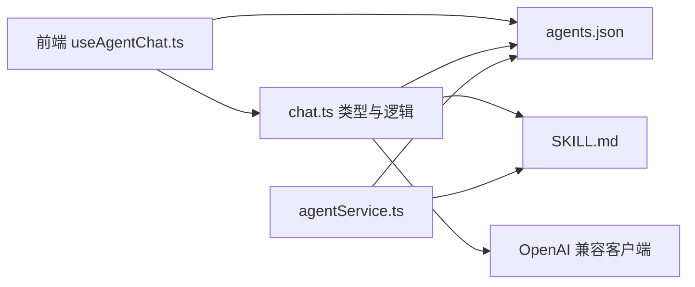

# 智能体配置管理

<cite>
**本文引用的文件**
- [agents.json](file://config/agents.json)
- [agentService.ts](file://backend/services/agentService.ts)
- [chat.ts](file://src/types/chat.ts)
- [useAgentChat.ts](file://src/hooks/useAgentChat.ts)
- [SKILL.md](file://skills/todo-query/SKILL.md)
- [安全设计.md](file://docs/非功能设计/安全设计.md)
- [开发环境配置.md](file://docs/基础规范/开发环境配置.md)
- [openai_compat.py](file://OpenSkills-main/openskills/llm/openai_compat.py)
</cite>

## 目录
1. [简介](#简介)
2. [项目结构](#项目结构)
3. [核心组件](#核心组件)
4. [架构总览](#架构总览)
5. [详细组件分析](#详细组件分析)
6. [依赖关系分析](#依赖关系分析)
7. [性能考量](#性能考量)
8. [故障排查指南](#故障排查指南)
9. [结论](#结论)
10. [附录](#附录)

## 简介
本文件面向“智能体配置管理”的技术文档，围绕 agents.json 配置文件的结构与字段定义展开，涵盖智能体 ID、名称、描述、头像、类型与配置参数；LLM 配置参数（URL、API Key、模型名称）的作用与配置方法；技能配置结构（名称、描述、类型、存储路径、版本号）；配置文件的加载机制、验证规则与错误处理；并提供最佳实践、安全考虑与性能优化建议，以及配置热更新的实现原理与使用场景。

## 项目结构
本项目采用前后端分离架构，智能体配置集中于后端的 JSON 文件，并通过前端 Hook 在应用启动时拉取与缓存，同时在后端服务中进行二次解析与调用 LLM。

图表来源
- [useAgentChat.ts](file://src/hooks/useAgentChat.ts#L25-L49)
- [chat.ts](file://src/types/chat.ts#L53-L74)
- [agentService.ts](file://backend/services/agentService.ts#L58-L67)
- [agents.json](file://config/agents.json#L1-L119)
- [SKILL.md](file://skills/todo-query/SKILL.md#L1-L24)

章节来源
- [agents.json](file://config/agents.json#L1-L119)
- [agentService.ts](file://backend/services/agentService.ts#L58-L67)
- [chat.ts](file://src/types/chat.ts#L53-L74)
- [useAgentChat.ts](file://src/hooks/useAgentChat.ts#L25-L49)

## 核心组件
- 配置文件 agents.json：定义智能体分组、智能体清单及其技能列表与 LLM 参数。
- 前端配置加载与聊天逻辑：负责从 /config/agents.json 拉取配置、构建系统提示词、调用后端或直接调用 LLM。
- 后端智能体服务：负责解析 agents.json、校验智能体与技能存在性、封装 LLM 请求与错误处理。
- 技能描述文件 SKILL.md：提供技能的简要描述，用于构建系统提示词。

章节来源
- [agents.json](file://config/agents.json#L1-L119)
- [chat.ts](file://src/types/chat.ts#L76-L94)
- [agentService.ts](file://backend/services/agentService.ts#L98-L116)
- [SKILL.md](file://skills/todo-query/SKILL.md#L1-L24)

## 架构总览
下图展示从前端到后端再到 LLM 的调用链路，以及配置加载与技能描述加载的关键节点。

图表来源
- [useAgentChat.ts](file://src/hooks/useAgentChat.ts#L25-L49)
- [chat.ts](file://src/types/chat.ts#L96-L189)
- [agentService.ts](file://backend/services/agentService.ts#L118-L185)

## 详细组件分析

### agents.json 配置文件结构与字段定义
- 结构层级
  - agents：数组，每个元素为一个智能体分组对象
    - group_name：字符串，分组名称
    - agents：数组，每个元素为一个智能体对象
      - id：字符串，智能体唯一标识
      - name：字符串，智能体显示名称
      - description：字符串，智能体描述
      - avatar：字符串，头像文件名
      - type：字符串，智能体类型
      - config：对象，LLM 配置
        - url：字符串，LLM 接口地址
        - api_key：字符串，访问令牌
        - model：字符串，模型名称
      - skills：数组，技能清单
        - name：字符串，技能名称
        - description：字符串，技能描述
        - type：字符串，技能类型
        - storage_path：字符串，技能源码存储路径
        - version：字符串，技能版本号

- 字段作用与约束
  - id：用于路由与会话识别，需全局唯一
  - config.url：支持直连 /chat/completions 或仅提供域名，前端会自动补齐
  - config.api_key：用于 Authorization 头部
  - config.model：指定调用模型
  - skills.storage_path：相对路径，指向技能目录，前端通过 /skills/<name>/SKILL.md 获取描述

章节来源
- [agents.json](file://config/agents.json#L1-L119)

### LLM 配置参数的作用与配置方法
- URL
  - 支持两种形式：完整 /chat/completions 或仅域名
  - 前端在调用前会自动补全路径
  - 对特定直连地址会走代理路径以规避跨域问题
- API Key
  - 通过 Authorization: Bearer <api_key> 注入
  - 建议通过环境变量或安全存储管理
- 模型名称
  - 作为 model 字段传入请求体
  - 不同供应商可能需要不同的模型命名

章节来源
- [chat.ts](file://src/types/chat.ts#L107-L129)
- [chat.ts](file://src/types/chat.ts#L202-L227)
- [agentService.ts](file://backend/services/agentService.ts#L136-L151)

### 技能配置结构
- 字段
  - name：技能名称，与 storage_path 下的 SKILL.md 对应
  - description：技能描述，用于系统提示词
  - type：技能类型，便于分类与匹配
  - storage_path：技能源码路径，前端通过 /skills/<name>/SKILL.md 读取
  - version：语义化版本号，便于追踪与回滚

- 描述加载机制
  - 前端优先从 /skills/<name>/SKILL.md 中提取“何时使用”片段
  - 若无则截取前若干字符作为简述
  - 后端同样支持从 SKILL.md 中提取描述，用于构建系统提示词

章节来源
- [SKILL.md](file://skills/todo-query/SKILL.md#L1-L24)
- [chat.ts](file://src/types/chat.ts#L53-L74)
- [agentService.ts](file://backend/services/agentService.ts#L80-L96)

### 配置文件加载机制、验证规则与错误处理
- 前端加载
  - 启动时通过 fetch('/config/agents.json') 拉取配置
  - 将嵌套的分组与智能体扁平化为 Agent 列表
  - 并行加载各技能的描述，构建技能描述映射
- 后端加载
  - 读取 config/agents.json，解析为 AgentGroup[]
  - 查找智能体与技能时进行存在性校验
- 运行时校验
  - 发送消息前校验 agent.config.url 与 agent.config.api_key 是否存在
  - LLM 调用统一捕获网络错误与 API 错误，返回结构化错误信息
- 错误处理
  - 前端：根据 axiosError.response/message 分类提示
  - 后端：对 API 响应错误与网络错误分别返回不同错误信息

图表来源
- [useAgentChat.ts](file://src/hooks/useAgentChat.ts#L51-L82)
- [chat.ts](file://src/types/chat.ts#L211-L260)
- [agentService.ts](file://backend/services/agentService.ts#L118-L185)

章节来源
- [useAgentChat.ts](file://src/hooks/useAgentChat.ts#L25-L49)
- [chat.ts](file://src/types/chat.ts#L53-L74)
- [agentService.ts](file://backend/services/agentService.ts#L58-L67)

### 配置热更新的实现原理与使用场景
- 实现原理
  - 当前前端在初始化时一次性拉取 agents.json 并缓存
  - 未内置监听文件变化的热更新机制
  - 如需热更新，可在前端引入文件监控（例如基于浏览器的文件监听或后端推送），在配置变更时重新拉取并更新状态
- 使用场景
  - 动态增删智能体或技能
  - 修改 LLM 参数（URL、Key、模型）
  - 更新技能描述或版本

章节来源
- [useAgentChat.ts](file://src/hooks/useAgentChat.ts#L25-L49)
- [chat.ts](file://src/types/chat.ts#L262-L279)

## 依赖关系分析
- 前端依赖
  - chat.ts：定义 Agent/Skill/ChatMessage 等类型与系统提示词构建、LLM 调用
  - useAgentChat.ts：负责首次加载配置与技能描述、错误处理
- 后端依赖
  - agentService.ts：解析 agents.json、查找智能体与技能、封装 LLM 请求
- 外部依赖
  - OpenAI 兼容客户端（OpenSkills）：提供统一的 LLM 客户端抽象，支持多种供应商与流式输出

图表来源
- [useAgentChat.ts](file://src/hooks/useAgentChat.ts#L1-L128)
- [chat.ts](file://src/types/chat.ts#L1-L280)
- [agentService.ts](file://backend/services/agentService.ts#L1-L245)
- [openai_compat.py](file://OpenSkills-main/openskills/llm/openai_compat.py#L24-L324)

章节来源
- [openai_compat.py](file://OpenSkills-main/openskills/llm/openai_compat.py#L24-L324)
- [agentService.ts](file://backend/services/agentService.ts#L1-L245)

## 性能考量
- 减少重复加载
  - 前端对已加载的技能描述进行去重与缓存，避免重复请求
- 请求超时与并发
  - 统一设置超时时间，避免长时间阻塞
- 流式输出
  - 前端支持流式输出，提升用户体验
- 缓存与刷新
  - 开发阶段建议禁用缓存，生产环境合理利用缓存

章节来源
- [chat.ts](file://src/types/chat.ts#L262-L279)
- [开发环境配置.md](file://docs/基础规范/开发环境配置.md#L226-L237)

## 故障排查指南
- 配置加载失败
  - 检查 /config/agents.json 是否存在且格式正确
  - 前端提示“加载智能体配置失败”，并给出尝试加载路径
- 网络请求失败
  - 检查 LLM 服务可达性、端口与防火墙
  - 检查代理路径是否正确（直连特定地址时）
- API 错误
  - 根据响应状态码与数据返回结构化错误信息
- 技能描述缺失
  - 确认 SKILL.md 存在且包含“何时使用”片段或标题
- 安全与权限
  - 配置文件与密钥文件权限需严格控制，避免泄露

章节来源
- [开发环境配置.md](file://docs/基础规范/开发环境配置.md#L209-L225)
- [chat.ts](file://src/types/chat.ts#L237-L260)
- [agentService.ts](file://backend/services/agentService.ts#L161-L184)
- [安全设计.md](file://docs/非功能设计/安全设计.md#L1-L78)

## 结论
本方案通过集中化的 agents.json 配置文件，结合前端与后端的协同加载与校验，实现了对智能体与技能的统一管理。LLM 参数通过统一的 URL、API Key、模型名称进行配置，技能描述通过 SKILL.md 自动注入系统提示词，提升了智能体的上下文能力。当前前端采用一次性加载策略，若需热更新，可在现有基础上增加文件监听或推送机制。安全方面，建议严格控制配置与密钥文件权限，并在生产环境启用加密与密钥轮换策略。

## 附录
- 最佳实践
  - 保持 agents.json 的结构清晰，字段齐全
  - 为每个技能提供完善的 SKILL.md 描述
  - 将 API Key 存储在安全位置，避免硬编码
- 安全考虑
  - 配置文件与密钥文件权限最小化
  - 使用 HTTPS 与代理路径规避跨域风险
  - 定期轮换密钥并记录审计日志
- 性能优化建议
  - 合理设置超时与重试
  - 使用流式输出提升交互体验
  - 在开发阶段禁用缓存，生产环境启用缓存