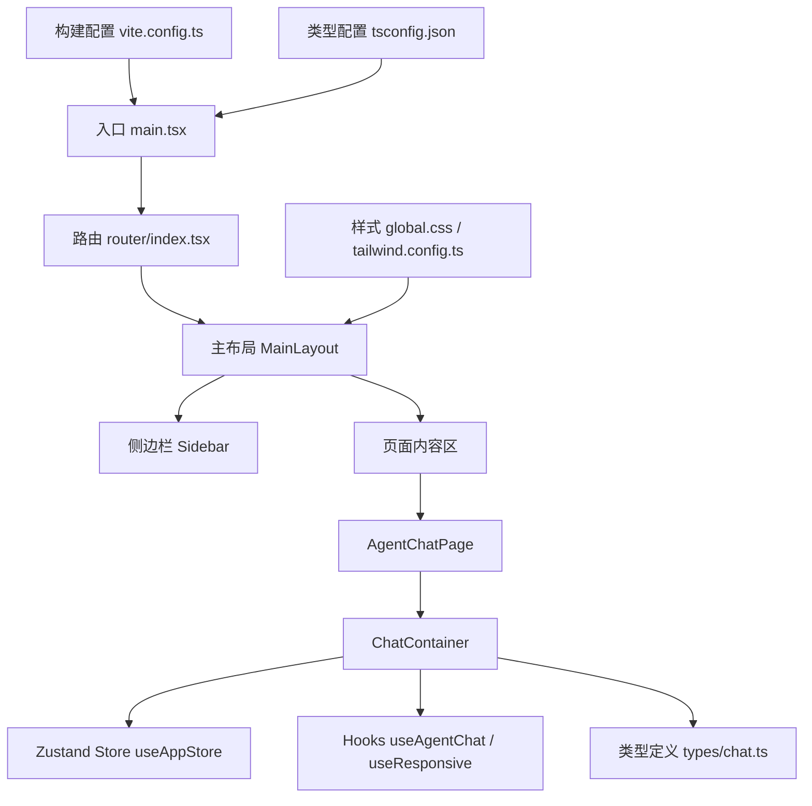
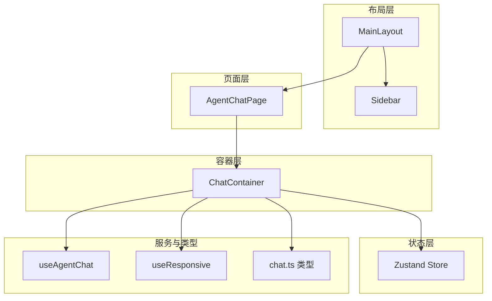
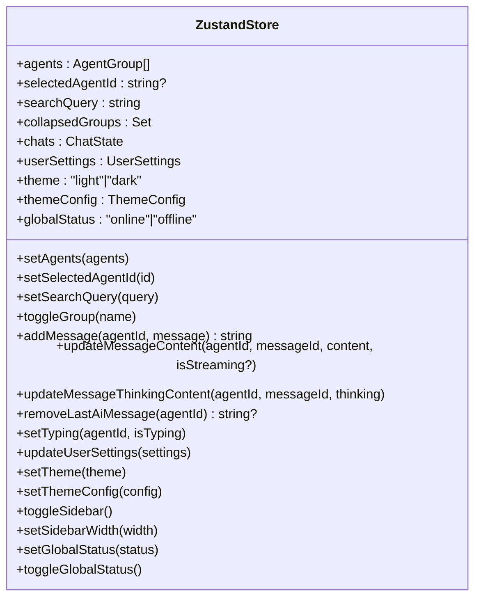
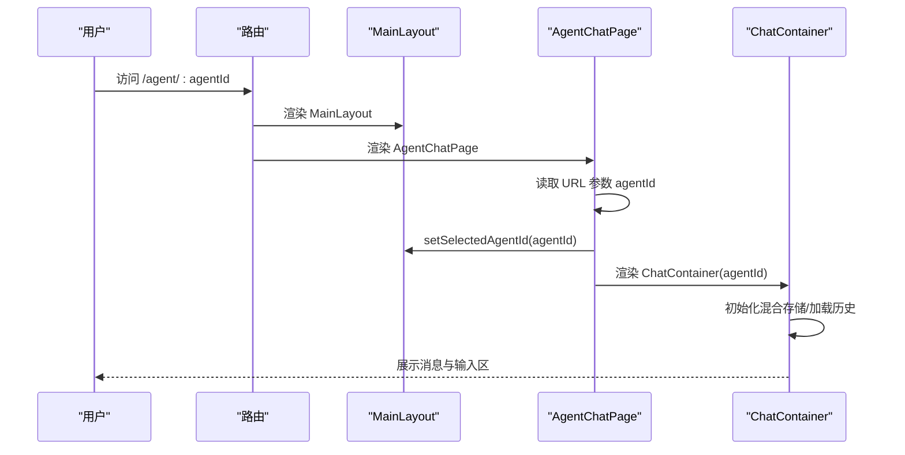
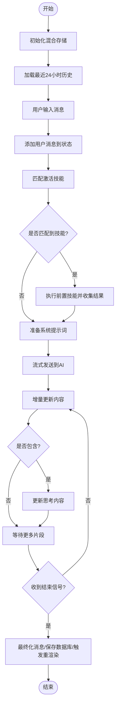
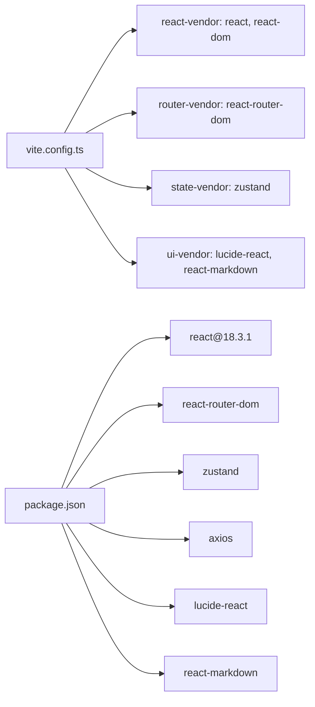

# 前端架构

<cite>
**本文引用的文件**
- [package.json](file://package.json)
- [vite.config.ts](file://vite.config.ts)
- [tsconfig.json](file://tsconfig.json)
- [src/main.tsx](file://src/main.tsx)
- [src/router/index.tsx](file://src/router/index.tsx)
- [src/store/useAppStore.ts](file://src/store/useAppStore.ts)
- [src/components/MainLayout.tsx](file://src/components/MainLayout.tsx)
- [src/hooks/useAgentChat.ts](file://src/hooks/useAgentChat.ts)
- [src/hooks/useResponsive.ts](file://src/hooks/useResponsive.ts)
- [src/pages/AgentChatPage.tsx](file://src/pages/AgentChatPage.tsx)
- [src/types/chat.ts](file://src/types/chat.ts)
- [src/components/chat/ChatContainer.tsx](file://src/components/chat/ChatContainer.tsx)
- [src/components/Sidebar/Sidebar.tsx](file://src/components/Sidebar/Sidebar.tsx)
- [src/styles/global.css](file://src/styles/global.css)
- [tailwind.config.ts](file://tailwind.config.ts)
</cite>

## 目录
1. [引言](#引言)
2. [项目结构](#项目结构)
3. [核心组件](#核心组件)
4. [架构总览](#架构总览)
5. [组件详细分析](#组件详细分析)
6. [依赖关系分析](#依赖关系分析)
7. [性能考量](#性能考量)
8. [故障排查指南](#故障排查指南)
9. [结论](#结论)
10. [附录](#附录)

## 引言
本文件面向AutoMate前端团队与技术读者，系统化梳理基于React 18.3.1的前端架构设计，重点覆盖组件化理念、状态管理模式（Zustand）、路由体系、响应式设计、Hooks模式与TypeScript类型体系，并给出性能优化策略、构建配置与开发调试建议。文档以“从MainLayout到具体页面组件”的层次为主线，辅以序列图、类图与数据流图，帮助不同背景的读者快速理解与落地。

## 项目结构
AutoMate前端采用以功能域与分层相结合的组织方式：
- 应用入口与路由：入口文件负责挂载根组件；路由定义页面级布局与导航。
- 组件层：通用布局组件（如MainLayout）与页面组件（如AgentChatPage）分离职责。
- 状态层：Zustand Store集中管理全局状态与聊天会话。
- 类型与服务：统一的聊天类型定义与服务函数，支撑消息流与技能调用。
- 样式与主题：CSS变量与Tailwind配置实现深浅主题与响应式断点。
- 构建与工具链：Vite + TypeScript + Tailwind + ESLint，按依赖拆包提升首屏性能。

图表来源
- [src/main.tsx](file://src/main.tsx#L1-L12)
- [src/router/index.tsx](file://src/router/index.tsx#L1-L43)
- [src/components/MainLayout.tsx](file://src/components/MainLayout.tsx#L1-L134)
- [src/components/Sidebar/Sidebar.tsx](file://src/components/Sidebar/Sidebar.tsx#L1-L179)
- [src/pages/AgentChatPage.tsx](file://src/pages/AgentChatPage.tsx#L1-L24)
- [src/components/chat/ChatContainer.tsx](file://src/components/chat/ChatContainer.tsx#L1-L756)
- [src/store/useAppStore.ts](file://src/store/useAppStore.ts#L1-L306)
- [src/hooks/useAgentChat.ts](file://src/hooks/useAgentChat.ts#L1-L128)
- [src/hooks/useResponsive.ts](file://src/hooks/useResponsive.ts#L1-L110)
- [src/types/chat.ts](file://src/types/chat.ts#L1-L280)
- [src/styles/global.css](file://src/styles/global.css#L1-L664)
- [tailwind.config.ts](file://tailwind.config.ts#L1-L161)
- [vite.config.ts](file://vite.config.ts#L1-L47)
- [tsconfig.json](file://tsconfig.json#L1-L26)

章节来源
- [src/main.tsx](file://src/main.tsx#L1-L12)
- [src/router/index.tsx](file://src/router/index.tsx#L1-L43)
- [vite.config.ts](file://vite.config.ts#L1-L47)
- [tsconfig.json](file://tsconfig.json#L1-L26)

## 核心组件
- 入口与路由
  - 应用通过入口文件挂载RouterProvider，路由定义了主页、智能体聊天页与设置页，并统一包裹MainLayout。
- 主布局与侧边栏
  - MainLayout负责加载智能体配置、搜索过滤、侧边栏交互与主题切换；Sidebar支持折叠与拖拽调整宽度。
- 页面与容器
  - AgentChatPage根据URL参数选择智能体并渲染ChatContainer；ChatContainer承载消息列表、输入区、流式输出与技能调用。
- 状态管理
  - Zustand Store集中管理智能体列表、聊天会话、用户设置与主题配置；提供消息增删改、打字态、设置更新等动作。
- Hooks与类型
  - useAgentChat封装消息发送与流式输出；useResponsive提供断点、媒体查询与视口信息；chat.ts定义Agent、Message、Skill与流式协议。

章节来源
- [src/router/index.tsx](file://src/router/index.tsx#L1-L43)
- [src/components/MainLayout.tsx](file://src/components/MainLayout.tsx#L1-L134)
- [src/components/Sidebar/Sidebar.tsx](file://src/components/Sidebar/Sidebar.tsx#L1-L179)
- [src/pages/AgentChatPage.tsx](file://src/pages/AgentChatPage.tsx#L1-L24)
- [src/components/chat/ChatContainer.tsx](file://src/components/chat/ChatContainer.tsx#L1-L756)
- [src/store/useAppStore.ts](file://src/store/useAppStore.ts#L1-L306)
- [src/hooks/useAgentChat.ts](file://src/hooks/useAgentChat.ts#L1-L128)
- [src/hooks/useResponsive.ts](file://src/hooks/useResponsive.ts#L1-L110)
- [src/types/chat.ts](file://src/types/chat.ts#L1-L280)

## 架构总览
整体采用“布局-页面-容器-组件-状态”的分层架构：
- 布局层：MainLayout统一承载侧边栏、搜索、头部与主内容区。
- 页面层：AgentChatPage负责路由参数解析与智能体选择。
- 容器层：ChatContainer负责消息生命周期、流式渲染、技能调用与本地持久化。
- 组件层：Sidebar、MessageBubble等可复用UI组件。
- 状态层：Zustand Store集中管理全局状态与聊天上下文。

图表来源
- [src/components/MainLayout.tsx](file://src/components/MainLayout.tsx#L1-L134)
- [src/components/Sidebar/Sidebar.tsx](file://src/components/Sidebar/Sidebar.tsx#L1-L179)
- [src/pages/AgentChatPage.tsx](file://src/pages/AgentChatPage.tsx#L1-L24)
- [src/components/chat/ChatContainer.tsx](file://src/components/chat/ChatContainer.tsx#L1-L756)
- [src/store/useAppStore.ts](file://src/store/useAppStore.ts#L1-L306)
- [src/hooks/useAgentChat.ts](file://src/hooks/useAgentChat.ts#L1-L128)
- [src/hooks/useResponsive.ts](file://src/hooks/useResponsive.ts#L1-L110)
- [src/types/chat.ts](file://src/types/chat.ts#L1-L280)

## 组件详细分析

### Zustand 状态管理
- 设计理念
  - 使用create函数创建Store，将全局状态与动作集中在一个文件中，便于追踪与测试。
  - 将聊天会话按agentId隔离，避免跨会话污染；同时提供统一的主题与用户设置。
- 关键接口
  - 智能体与聊天：setAgents、addMessage、updateMessageContent、updateMessageThinkingContent、removeLastAiMessage、setTyping。
  - 用户设置：updateUserSettings、setTheme、setThemeConfig、toggleSidebar、setSidebarWidth、setGlobalStatus、toggleGlobalStatus。
- 订阅机制
  - 组件通过useAppStore(selector)进行选择性订阅，仅在被选中的字段变化时重渲染，降低不必要的重渲染。
- 性能优化
  - 使用不可变更新与浅比较；对复杂对象使用Set与Map；在ChatContainer中对消息更新采用节流与批量flush策略。

图表来源
- [src/store/useAppStore.ts](file://src/store/useAppStore.ts#L56-L83)

章节来源
- [src/store/useAppStore.ts](file://src/store/useAppStore.ts#L1-L306)

### 路由与页面组织
- 路由定义
  - 使用createBrowserRouter定义主页、智能体聊天页与设置页，并统一包裹MainLayout。
  - 通配符路由跳转至首页，保证导航健壮性。
- 页面组件
  - AgentChatPage从URL参数读取agentId并设置到全局状态，随后渲染ChatContainer。
- 控制流
  - 从路由到布局再到容器，形成清晰的数据流向与控制流。

图表来源
- [src/router/index.tsx](file://src/router/index.tsx#L7-L36)
- [src/pages/AgentChatPage.tsx](file://src/pages/AgentChatPage.tsx#L6-L23)
- [src/components/MainLayout.tsx](file://src/components/MainLayout.tsx#L51-L54)
- [src/components/chat/ChatContainer.tsx](file://src/components/chat/ChatContainer.tsx#L16-L103)

章节来源
- [src/router/index.tsx](file://src/router/index.tsx#L1-L43)
- [src/pages/AgentChatPage.tsx](file://src/pages/AgentChatPage.tsx#L1-L24)

### ChatContainer 与消息流
- 功能要点
  - 初始化混合存储，按24小时窗口加载历史消息。
  - 支持技能关键字匹配与前置技能执行，将结果注入AI提示词。
  - 流式输出采用ReadableStream Reader逐行解析，支持<think>标记提取思考过程。
  - 提供“重试”“停止”“滚动到底部”等交互能力。
- 数据流
  - 用户输入 -> 添加用户消息 -> 前置技能执行 -> 流式发送 -> 更新AI消息 -> 保存数据库 -> 触发状态更新。

图表来源
- [src/components/chat/ChatContainer.tsx](file://src/components/chat/ChatContainer.tsx#L16-L103)
- [src/components/chat/ChatContainer.tsx](file://src/components/chat/ChatContainer.tsx#L240-L392)
- [src/types/chat.ts](file://src/types/chat.ts#L96-L189)

章节来源
- [src/components/chat/ChatContainer.tsx](file://src/components/chat/ChatContainer.tsx#L1-L756)
- [src/types/chat.ts](file://src/types/chat.ts#L1-L280)

### 响应式设计与Hooks模式
- 响应式断点
  - 自定义useBreakpoint与useMediaQuery，结合Tailwind断点实现移动端优先的布局切换。
- 主题与样式
  - CSS变量定义主题色彩与过渡；dark-theme类切换深色模式；Sidebar支持折叠与拖拽宽度。
- Hooks模式
  - useAgentChat封装网络请求与流式处理；useResponsive提供设备与视口信息；二者均通过状态选择器最小化重渲染。

章节来源
- [src/hooks/useResponsive.ts](file://src/hooks/useResponsive.ts#L1-L110)
- [src/styles/global.css](file://src/styles/global.css#L1-L664)
- [tailwind.config.ts](file://tailwind.config.ts#L1-L161)
- [src/hooks/useAgentChat.ts](file://src/hooks/useAgentChat.ts#L1-L128)

### 组件间通信与事件处理
- 事件链路
  - MainLayout处理智能体点击，导航到AgentChatPage并设置当前智能体ID。
  - ChatContainer内部通过useAppStore选择器订阅状态，事件回调直接更新状态并触发渲染。
- 错误边界
  - ChatContainer在流式过程中捕获错误并保存为“failed”状态，同时向用户展示错误消息。
  - 路由层对未知路径进行兜底跳转，避免白屏。

章节来源
- [src/components/MainLayout.tsx](file://src/components/MainLayout.tsx#L51-L54)
- [src/components/chat/ChatContainer.tsx](file://src/components/chat/ChatContainer.tsx#L377-L391)
- [src/router/index.tsx](file://src/router/index.tsx#L33-L35)

## 依赖关系分析
- 依赖拆包
  - Vite Rollup手动分包：react-vendor、router-vendor、state-vendor、ui-vendor，减少单体bundle体积。
- 运行时依赖
  - React 18.3.1、react-router-dom、zustand、lucide-react、react-markdown、axios等。
- 开发依赖
  - TypeScript、Tailwind、ESLint、Vite插件等。

图表来源
- [vite.config.ts](file://vite.config.ts#L35-L44)
- [package.json](file://package.json#L15-L26)

章节来源
- [vite.config.ts](file://vite.config.ts#L1-L47)
- [package.json](file://package.json#L1-L47)

## 性能考量
- 状态订阅优化
  - 使用选择性订阅，仅订阅必要字段，避免全局状态变更导致的全量重渲染。
- 渲染节流
  - ChatContainer对流式内容采用定时flush策略，减少频繁DOM更新。
- 资源拆包
  - 通过manualChunks将第三方库拆分为独立chunk，提升缓存命中率与并行加载效率。
- 样式与主题
  - CSS变量与Tailwind原子类减少运行时计算，dark-theme类切换开销低。
- 类型与构建
  - TypeScript严格模式与noEmit配合Vite，确保类型安全与更快的构建速度。

[本节为通用性能指导，不直接分析特定文件]

## 故障排查指南
- 路由与导航
  - 若出现空白页或404，检查通配符路由是否正确重定向至首页。
- 智能体加载
  - MainLayout加载agents.json失败时会在控制台打印错误，检查静态资源路径与权限。
- 流式输出
  - ChatContainer在流式过程中捕获异常并保存为“failed”，查看错误消息定位问题。
- 网络代理
  - Vite配置了/api/proxy与/api/skills代理，确认后端服务可达与rewrite规则正确。

章节来源
- [src/router/index.tsx](file://src/router/index.tsx#L33-L35)
- [src/components/MainLayout.tsx](file://src/components/MainLayout.tsx#L43-L46)
- [src/components/chat/ChatContainer.tsx](file://src/components/chat/ChatContainer.tsx#L377-L391)
- [vite.config.ts](file://vite.config.ts#L18-L29)

## 结论
AutoMate前端以React 18.3.1为核心，结合Zustand实现轻量高效的状态管理，配合自定义Hooks与TypeScript类型体系，构建出可维护、可扩展且高性能的聊天交互界面。通过路由与布局解耦、容器组件承载复杂逻辑、样式与主题系统化，整体架构具备良好的可演进性与工程化实践价值。

[本节为总结性内容，不直接分析特定文件]

## 附录
- 开发与构建
  - 开发：npm run dev；预览：npm run preview；类型检查：npm run typecheck；ESLint：npm run lint。
- 关键配置
  - 路径别名@指向src；端口3000；代理/api/proxy与/api/skills；产物目录dist；sourcemap开启。
- 类型与样式
  - chat.ts定义Agent、Message、Skill与流式协议；global.css与tailwind.config.ts共同提供主题与响应式能力。

章节来源
- [package.json](file://package.json#L6-L13)
- [vite.config.ts](file://vite.config.ts#L5-L46)
- [src/types/chat.ts](file://src/types/chat.ts#L1-L280)
- [src/styles/global.css](file://src/styles/global.css#L1-L664)
- [tailwind.config.ts](file://tailwind.config.ts#L1-L161)