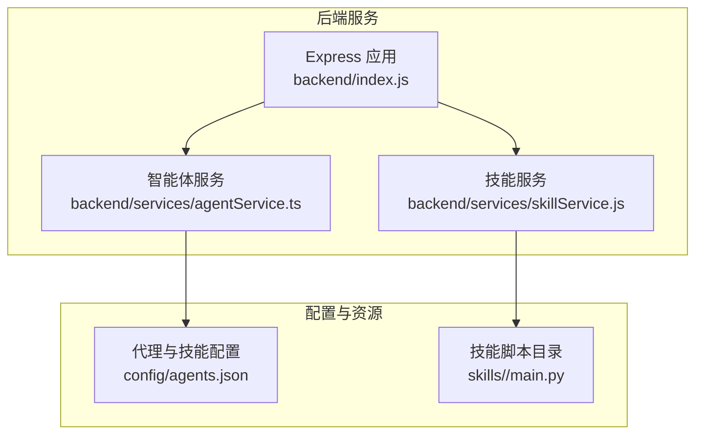
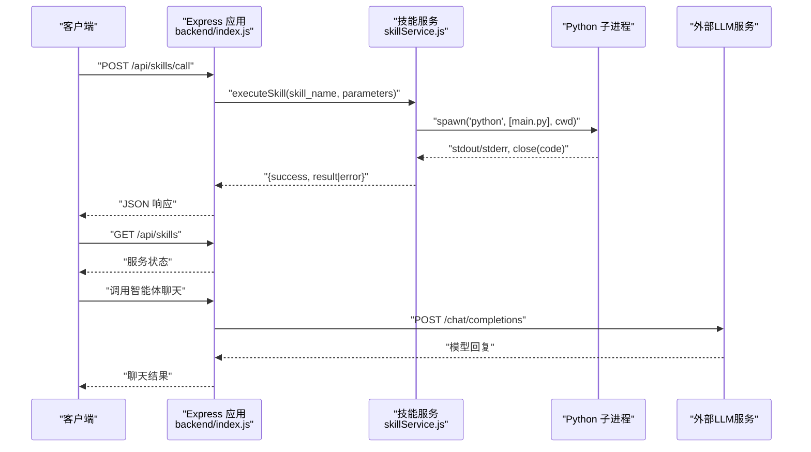
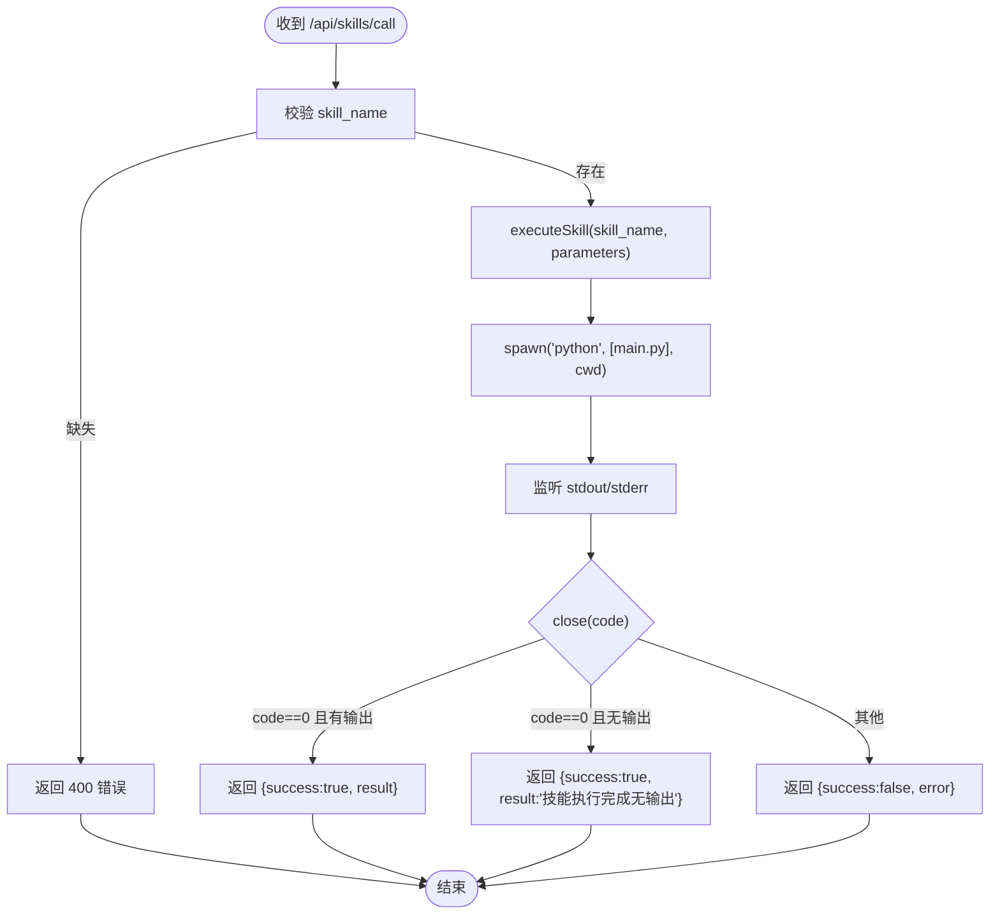
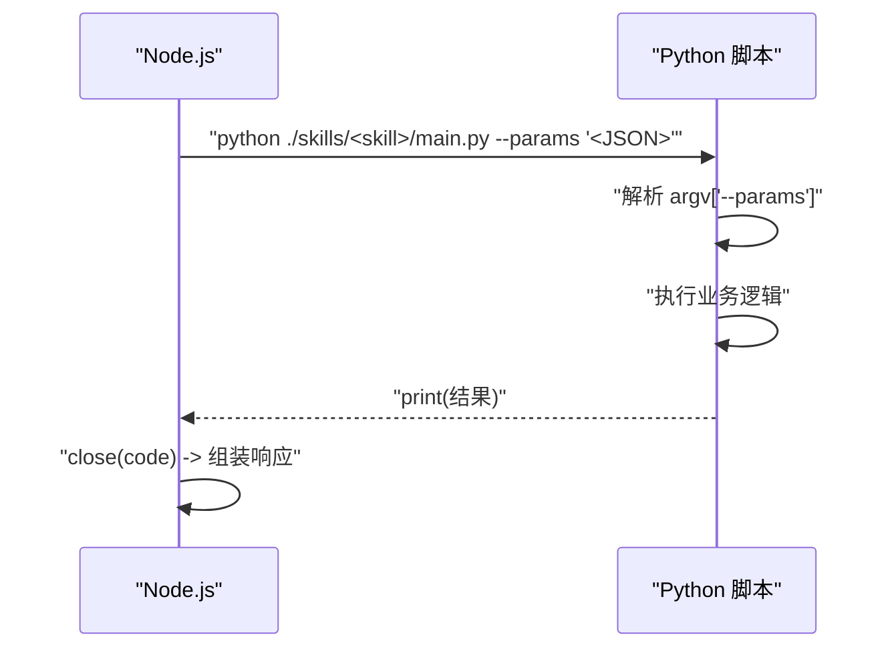
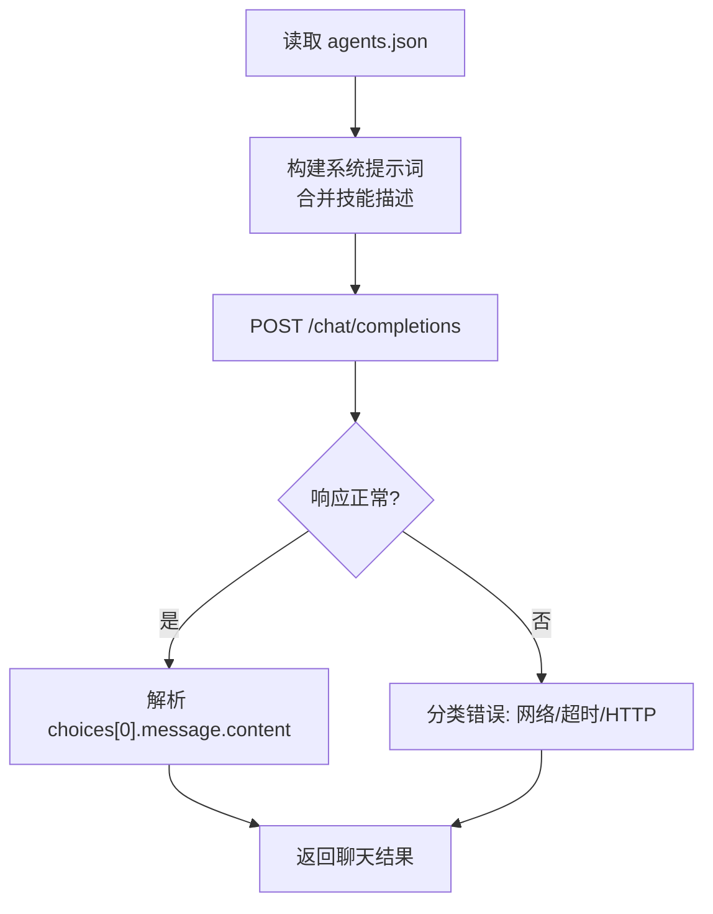
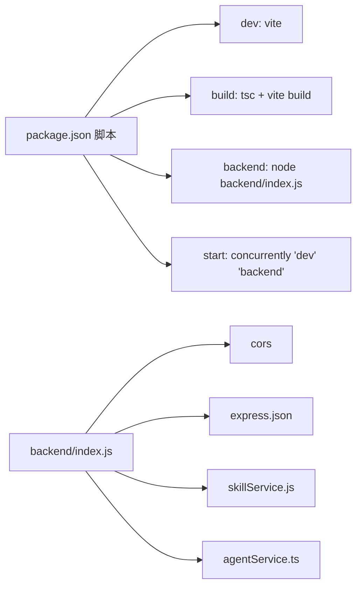

# 后端架构

<cite>
**本文引用的文件**
- [package.json](file://package.json)
- [backend/index.js](file://backend/index.js)
- [backend/services/skillService.js](file://backend/services/skillService.js)
- [backend/services/agentService.ts](file://backend/services/agentService.ts)
- [config/agents.json](file://config/agents.json)
- [skills/todo-query/main.py](file://skills/todo-query/main.py)
- [skills/weather_query/main.py](file://skills/weather_query/main.py)
</cite>

## 目录
1. [引言](#引言)
2. [项目结构](#项目结构)
3. [核心组件](#核心组件)
4. [架构总览](#架构总览)
5. [详细组件分析](#详细组件分析)
6. [依赖关系分析](#依赖关系分析)
7. [性能考虑](#性能考虑)
8. [故障排查指南](#故障排查指南)
9. [结论](#结论)
10. [附录](#附录)

## 引言
本文件面向AutoMate后端架构，围绕基于Node.js + Express 4.18.2的服务设计与实现进行系统化技术说明。重点覆盖RESTful API接口设计原则、CORS配置、中间件与请求处理流程；深入解释与Python技能脚本的集成机制（进程管理、参数传递、结果返回）；并提供启动流程、配置管理、日志记录与监控建议、性能优化策略、安全配置与部署注意事项。

## 项目结构
后端采用Express应用入口集中于单文件，核心逻辑通过服务模块拆分职责：
- 应用入口与路由：backend/index.js
- 技能执行服务：backend/services/skillService.js
- 智能体与LLM交互服务：backend/services/agentService.ts
- 全局配置：config/agents.json
- 技能脚本示例：skills/<skill>/main.py

图表来源
- [backend/index.js](file://backend/index.js#L1-L117)
- [backend/services/skillService.js](file://backend/services/skillService.js#L1-L87)
- [backend/services/agentService.ts](file://backend/services/agentService.ts#L1-L245)
- [config/agents.json](file://config/agents.json#L1-L119)

章节来源
- [package.json](file://package.json#L1-L47)
- [backend/index.js](file://backend/index.js#L1-L117)

## 核心组件
- Express应用与中间件
  - CORS启用：允许跨域访问，便于前端与后端分离开发与部署。
  - JSON解析：统一处理请求体为JSON。
- 技能调用API
  - POST /api/skills/call：接收skill_name与parameters，调用对应Python脚本，返回执行结果或错误。
- 健康检查接口
  - GET /api/skills：返回服务状态信息。
- 技能执行服务
  - 使用子进程调用Python脚本，捕获stdout/stderr，按退出码判定成功/失败，并返回标准化结果对象。
- 智能体服务
  - 加载agents.json，构建系统提示词，调用外部LLM接口进行对话与技能编排。

章节来源
- [backend/index.js](file://backend/index.js#L14-L116)
- [backend/services/skillService.js](file://backend/services/skillService.js#L16-L86)
- [backend/services/agentService.ts](file://backend/services/agentService.ts#L58-L184)

## 架构总览
下图展示从客户端到后端、再到Python技能脚本与外部LLM的整体调用链路与数据流。

图表来源
- [backend/index.js](file://backend/index.js#L81-L111)
- [backend/services/skillService.js](file://backend/services/skillService.js#L16-L86)
- [backend/services/agentService.ts](file://backend/services/agentService.ts#L118-L184)

## 详细组件分析

### Express 应用与中间件
- CORS配置
  - 默认启用，允许来自任意源的跨域请求，便于前端开发与部署灵活性。
- 中间件
  - express.json：解析application/json请求体。
- 路由
  - POST /api/skills/call：技能调用入口。
  - GET /api/skills：健康检查与状态返回。
- 进程内日志
  - 控制台打印请求、参数、输出与错误，便于本地调试。

章节来源
- [backend/index.js](file://backend/index.js#L14-L116)

### 技能调用API 设计与实现
- 请求结构
  - 必填字段：skill_name
  - 可选字段：parameters（JSON字符串）
- 参数传递机制
  - 通过命令行参数--params传入JSON字符串，Python脚本解析并使用。
- 结果返回
  - 成功：success=true，result为脚本输出文本。
  - 失败：success=false，error为stderr或错误信息。
- 错误处理
  - 捕获子进程close事件与error事件，统一返回标准化对象。
  - 对缺失参数等场景返回400。

图表来源
- [backend/index.js](file://backend/index.js#L81-L104)
- [backend/services/skillService.js](file://backend/services/skillService.js#L16-L86)

章节来源
- [backend/index.js](file://backend/index.js#L81-L104)
- [backend/services/skillService.js](file://backend/services/skillService.js#L16-L86)

### Python 技能脚本集成机制
- 进程管理
  - 使用child_process.spawn以shell模式启动Python解释器，设置工作目录为技能目录，确保脚本相对路径可用。
- 参数传递
  - Node.js侧将parameters序列化为JSON并通过命令行参数--params传递给Python脚本。
  - Python脚本解析argv，提取--params对应的JSON字符串并解析为字典。
- 结果返回
  - Python脚本将最终结果打印到标准输出，Node.js捕获stdout并在close事件中解析。
  - 若子进程非零退出码或stderr包含错误，则标记为失败。
- 示例脚本
  - 待办查询：解析参数，生成随机统计文案。
  - 天气查询：解析location参数，调用天气API并格式化输出。

图表来源
- [backend/index.js](file://backend/index.js#L19-L79)
- [skills/todo-query/main.py](file://skills/todo-query/main.py#L23-L34)
- [skills/weather_query/main.py](file://skills/weather_query/main.py#L128-L139)

章节来源
- [backend/index.js](file://backend/index.js#L19-L79)
- [skills/todo-query/main.py](file://skills/todo-query/main.py#L23-L34)
- [skills/weather_query/main.py](file://skills/weather_query/main.py#L128-L139)

### 智能体服务与LLM交互
- 配置加载
  - 从config/agents.json读取代理组、代理、技能与LLM配置。
- 系统提示词构建
  - 读取每个技能的SKILL.md片段，拼接为系统提示词，指导模型在合适时机调用技能。
- 聊天与技能调用
  - 调用外部LLM的/chat/completions接口，携带Authorization与Content-Type。
  - 对网络错误、超时、HTTP错误分别处理并返回可读错误信息。
- 技能编排
  - 提供callSkill方法，将技能描述与参数注入系统提示词，引导模型按需执行。

图表来源
- [backend/services/agentService.ts](file://backend/services/agentService.ts#L58-L184)
- [config/agents.json](file://config/agents.json#L1-L119)

章节来源
- [backend/services/agentService.ts](file://backend/services/agentService.ts#L58-L184)
- [config/agents.json](file://config/agents.json#L1-L119)

### 健康检查接口
- GET /api/skills
  - 返回服务状态与消息，便于容器编排与运维监控。

章节来源
- [backend/index.js](file://backend/index.js#L106-L111)

## 依赖关系分析
- 后端依赖
  - express：Web框架与路由。
  - cors：跨域支持。
  - child_process：调用Python脚本。
  - axios：调用外部LLM服务。
- 项目脚本
  - npm run backend：直接启动后端服务。
  - npm start：并行启动前端与后端（通过concurrently）。

图表来源
- [package.json](file://package.json#L6-L13)
- [backend/index.js](file://backend/index.js#L1-L117)

章节来源
- [package.json](file://package.json#L1-L47)
- [backend/index.js](file://backend/index.js#L1-L117)

## 性能考虑
- 子进程生命周期
  - 当前实现每次调用新建子进程，适合轻量、低频调用。若技能调用频繁，建议引入进程池或缓存机制，减少进程创建开销。
- I/O与编码
  - Python子进程stdout/stderr按UTF-8拼接，注意大输出可能造成内存压力，建议对长输出进行分块或流式处理。
- 并发与超时
  - LLM调用设置超时时间，避免阻塞；可结合队列与限流控制并发。
- 缓存与预热
  - 对常用技能或LLM响应可做缓存；对技能脚本可做“预热”以减少首次冷启动延迟。

## 故障排查指南
- 技能调用失败
  - 检查skill_name是否存在且对应skills/<skill>/main.py存在。
  - 查看stderr输出，确认Python脚本是否抛出异常或外部API调用失败。
  - 确认Node.js侧是否正确传递--params参数。
- CORS问题
  - 若浏览器报跨域错误，确认CORS中间件已启用，或在生产环境调整为白名单域名。
- LLM调用失败
  - 检查agents.json中的url、api_key、model配置是否正确。
  - 关注网络连通性与超时设置，区分网络错误、HTTP错误与解析错误。
- 日志定位
  - 后端控制台会打印请求、参数、输出与错误，结合这些日志快速定位问题。

章节来源
- [backend/index.js](file://backend/index.js#L81-L104)
- [backend/services/skillService.js](file://backend/services/skillService.js#L16-L86)
- [backend/services/agentService.ts](file://backend/services/agentService.ts#L161-L184)

## 结论
AutoMate后端以Express为核心，通过服务模块化实现了技能脚本与LLM的统一编排。技能调用API简洁明确，Python脚本通过标准输出返回结果，配合CORS与基础中间件满足前后端分离场景。后续可在进程池、缓存、超时与限流等方面进一步优化，以提升高并发下的稳定性与性能。

## 附录
- 启动流程
  - 使用npm run backend启动后端服务，监听本地端口。
  - 前端通过Vite开发服务器提供界面，后端提供REST API。
- 配置管理
  - agents.json集中管理代理、技能与LLM配置，便于动态调整。
- 日志与监控
  - 建议在生产环境接入结构化日志与指标采集，结合容器编排实现健康检查与自动重启。
- 安全配置
  - 在生产环境限制CORS白名单，妥善保管api_key，避免硬编码敏感信息。
- 部署注意事项
  - 确保宿主机安装Python解释器与所需依赖，设置合适的PATH与工作目录权限。
  - 对外暴露的端口需纳入防火墙策略，必要时前置反向代理与TLS终止。