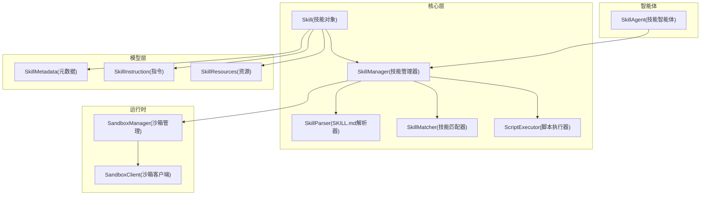
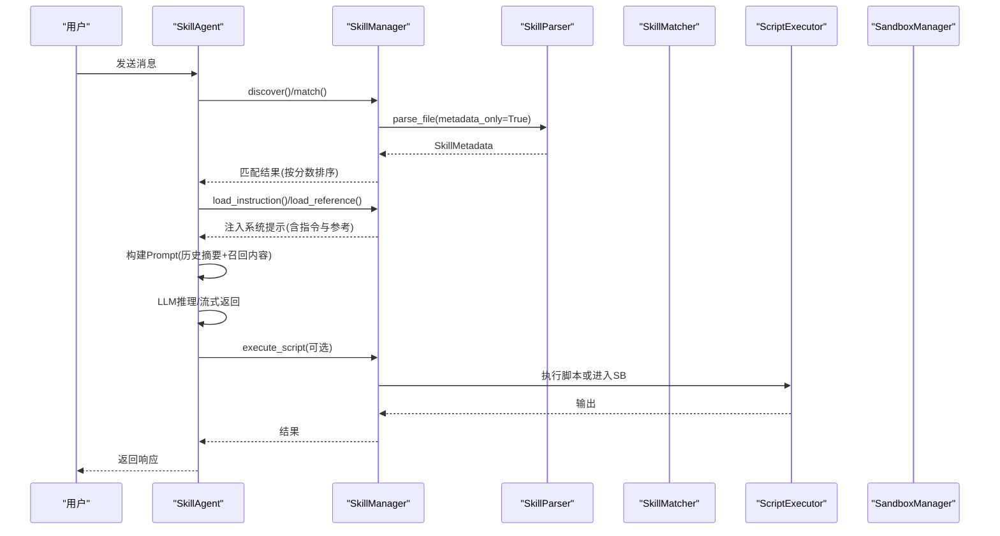
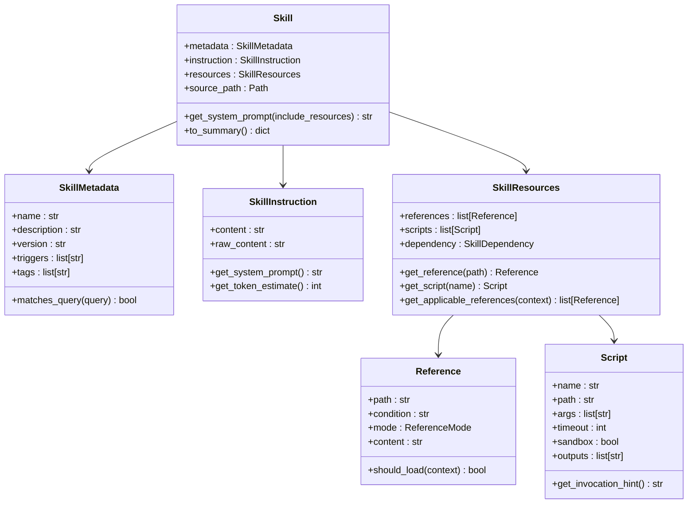
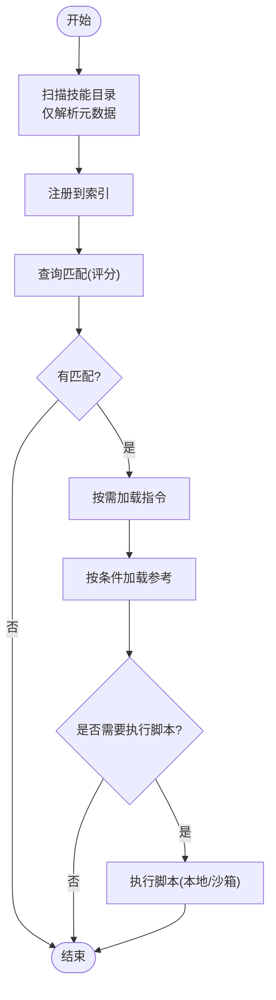
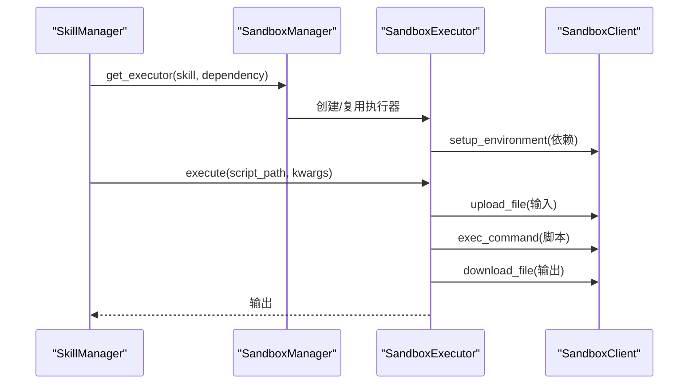
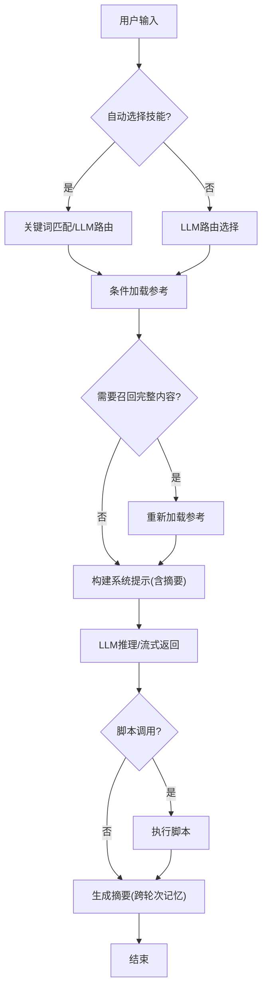
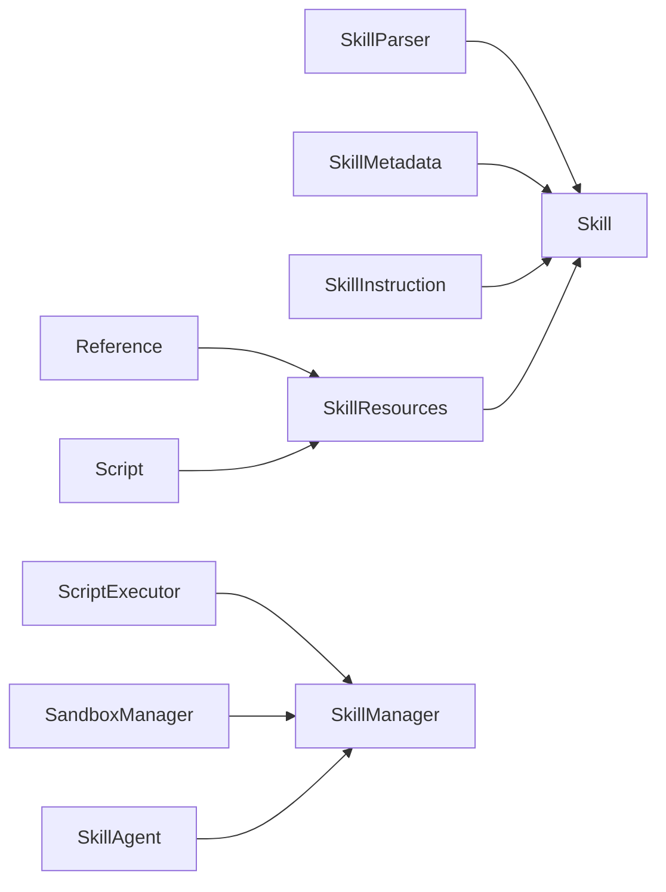

# 技能系统架构

<cite>
**本文引用的文件**
- [openskills/__init__.py](file://OpenSkills-main/openskills/__init__.py)
- [openskills/core/skill.py](file://OpenSkills-main/openskills/core/skill.py)
- [openskills/core/manager.py](file://OpenSkills-main/openskills/core/manager.py)
- [openskills/core/executor.py](file://OpenSkills-main/openskills/core/executor.py)
- [openskills/agent.py](file://OpenSkills-main/openskills/agent.py)
- [openskills/models/metadata.py](file://OpenSkills-main/openskills/models/metadata.py)
- [openskills/models/instruction.py](file://OpenSkills-main/openskills/models/instruction.py)
- [openskills/models/resource.py](file://OpenSkills-main/openskills/models/resource.py)
- [openskills/core/parser.py](file://OpenSkills-main/openskills/core/parser.py)
- [openskills/core/matcher.py](file://OpenSkills-main/openskills/core/matcher.py)
- [openskills/sandbox/manager.py](file://OpenSkills-main/openskills/sandbox/manager.py)
- [openskills/sandbox/client.py](file://OpenSkills-main/openskills/sandbox/client.py)
- [examples/meeting-summary/SKILL.md](file://OpenSkills-main/examples/meeting-summary/SKILL.md)
- [examples/infographic-skills/infographic-creator/SKILL.md](file://OpenSkills-main/examples/infographic-skills/infographic-creator/SKILL.md)
- [examples/prompt-optimizer/SKILL.md](file://OpenSkills-main/examples/prompt-optimizer/SKILL.md)
</cite>

## 目录
1. [引言](#引言)
2. [项目结构](#项目结构)
3. [核心组件](#核心组件)
4. [架构总览](#架构总览)
5. [详细组件分析](#详细组件分析)
6. [依赖分析](#依赖分析)
7. [性能考虑](#性能考虑)
8. [故障排查指南](#故障排查指南)
9. [结论](#结论)
10. [附录](#附录)

## 引言
本文件面向AutoMate的OpenSkills技能系统，系统化阐述其微服务化技能架构的设计理念与实现方式，覆盖技能定义规范、技能执行器工作原理、技能管理器调度机制、技能与智能体的绑定关系、优先级与动态加载策略、生命周期与错误处理、结果缓存与性能监控、以及扩展开发与最佳实践。目标是帮助开发者与产品人员快速理解并高效使用该技能体系。

## 项目结构
OpenSkills采用分层模块化组织，核心围绕“技能定义—解析—匹配—执行—沙箱管理—智能体集成”的闭环展开。前端与后端通过统一的技能协议协作，形成可扩展的微服务化能力。

**图表来源**
- [openskills/core/skill.py](file://OpenSkills-main/openskills/core/skill.py#L19-L150)
- [openskills/core/manager.py](file://OpenSkills-main/openskills/core/manager.py#L24-L523)
- [openskills/core/parser.py](file://OpenSkills-main/openskills/core/parser.py#L19-L225)
- [openskills/core/matcher.py](file://OpenSkills-main/openskills/core/matcher.py#L22-L221)
- [openskills/core/executor.py](file://OpenSkills-main/openskills/core/executor.py#L24-L251)
- [openskills/sandbox/manager.py](file://OpenSkills-main/openskills/sandbox/manager.py#L30-L237)
- [openskills/sandbox/client.py](file://OpenSkills-main/openskills/sandbox/client.py#L119-L986)
- [openskills/agent.py](file://OpenSkills-main/openskills/agent.py#L61-L858)

**章节来源**
- [openskills/__init__.py](file://OpenSkills-main/openskills/__init__.py#L1-L50)
- [openskills/core/manager.py](file://OpenSkills-main/openskills/core/manager.py#L24-L144)

## 核心组件
- 技能对象：封装元数据、指令与资源，支持分层加载与路径解析。
- 技能管理器：负责发现、注册、匹配、按需加载指令与资源、执行脚本、并与沙箱协同。
- 解析器：从SKILL.md提取元数据与资源定义，支持仅元数据快速扫描。
- 匹配器：基于触发词、名称、描述关键词与标签进行评分匹配。
- 执行器：安全执行脚本，支持超时、输出截断、环境隔离与错误包装。
- 沙箱管理：多策略生命周期管理（按执行、按技能、持久化），自动依赖安装与文件同步。
- 智能体：自动发现技能、注入提示、条件加载参考、执行脚本调用、流式对话与上下文记忆。

**章节来源**
- [openskills/core/skill.py](file://OpenSkills-main/openskills/core/skill.py#L19-L150)
- [openskills/core/manager.py](file://OpenSkills-main/openskills/core/manager.py#L24-L523)
- [openskills/core/parser.py](file://OpenSkills-main/openskills/core/parser.py#L19-L225)
- [openskills/core/matcher.py](file://OpenSkills-main/openskills/core/matcher.py#L22-L221)
- [openskills/core/executor.py](file://OpenSkills-main/openskills/core/executor.py#L24-L251)
- [openskills/sandbox/manager.py](file://OpenSkills-main/openskills/sandbox/manager.py#L30-L237)
- [openskills/agent.py](file://OpenSkills-main/openskills/agent.py#L61-L858)

## 架构总览
OpenSkills采用“三层渐进披露”与“按需加载”策略：
- 层1（元数据）：仅解析frontmatter，用于快速发现与匹配。
- 层2（指令）：按需加载SKILL.md正文，注入系统提示。
- 层3（资源）：仅在满足条件时加载参考与脚本，减少内存与上下文开销。

**图表来源**
- [openskills/agent.py](file://OpenSkills-main/openskills/agent.py#L228-L403)
- [openskills/core/manager.py](file://OpenSkills-main/openskills/core/manager.py#L116-L508)
- [openskills/core/parser.py](file://OpenSkills-main/openskills/core/parser.py#L33-L100)
- [openskills/core/matcher.py](file://OpenSkills-main/openskills/core/matcher.py#L53-L81)
- [openskills/core/executor.py](file://OpenSkills-main/openskills/core/executor.py#L61-L159)
- [openskills/sandbox/manager.py](file://OpenSkills-main/openskills/sandbox/manager.py#L89-L147)

## 详细组件分析

### 技能对象与分层模型
- 元数据层：name/description/version/triggers/tags等，用于发现与匹配。
- 指令层：SKILL.md正文，注入系统提示，限制token占用。
- 资源层：Reference与Script定义，按模式加载；支持依赖声明与输出文件同步。

**图表来源**
- [openskills/core/skill.py](file://OpenSkills-main/openskills/core/skill.py#L19-L150)
- [openskills/models/metadata.py](file://OpenSkills-main/openskills/models/metadata.py#L11-L83)
- [openskills/models/instruction.py](file://OpenSkills-main/openskills/models/instruction.py#L11-L48)
- [openskills/models/resource.py](file://OpenSkills-main/openskills/models/resource.py#L45-L204)

**章节来源**
- [openskills/core/skill.py](file://OpenSkills-main/openskills/core/skill.py#L19-L150)
- [openskills/models/metadata.py](file://OpenSkills-main/openskills/models/metadata.py#L11-L83)
- [openskills/models/instruction.py](file://OpenSkills-main/openskills/models/instruction.py#L11-L48)
- [openskills/models/resource.py](file://OpenSkills-main/openskills/models/resource.py#L45-L204)

### 技能管理器与调度机制
- 发现与注册：扫描目录，仅解析元数据，建立索引。
- 匹配：基于触发词、名称、描述关键词与标签评分，返回Top-N。
- 指令与资源加载：按需加载指令与适用参考，避免不必要的IO。
- 脚本执行：支持本地执行与沙箱执行，自动文件上传/下载与依赖安装。
- 生命周期：支持异步上下文，沙箱预热与清理。

**图表来源**
- [openskills/core/manager.py](file://OpenSkills-main/openskills/core/manager.py#L116-L508)
- [openskills/core/matcher.py](file://OpenSkills-main/openskills/core/matcher.py#L53-L81)
- [openskills/core/executor.py](file://OpenSkills-main/openskills/core/executor.py#L61-L159)

**章节来源**
- [openskills/core/manager.py](file://OpenSkills-main/openskills/core/manager.py#L24-L523)
- [openskills/core/matcher.py](file://OpenSkills-main/openskills/core/matcher.py#L22-L221)

### 脚本执行器与沙箱协同
- 支持Python/Shell/JS/TS等脚本类型，统一超时与输出截断。
- 环境变量清理与沙箱标记，降低敏感信息泄露风险。
- 沙箱策略：按执行、按技能、持久化三种策略，LRU缓存与依赖预装。
- 文件同步：自动上传输入文件、下载输出文件，支持递归目录。

**图表来源**
- [openskills/core/manager.py](file://OpenSkills-main/openskills/core/manager.py#L319-L361)
- [openskills/sandbox/manager.py](file://OpenSkills-main/openskills/sandbox/manager.py#L89-L147)
- [openskills/sandbox/client.py](file://OpenSkills-main/openskills/sandbox/client.py#L665-L740)

**章节来源**
- [openskills/core/executor.py](file://OpenSkills-main/openskills/core/executor.py#L24-L251)
- [openskills/sandbox/manager.py](file://OpenSkills-main/openskills/sandbox/manager.py#L30-L237)
- [openskills/sandbox/client.py](file://OpenSkills-main/openskills/sandbox/client.py#L119-L986)

### 智能体与上下文记忆
- 自动技能选择：关键词命中优先，否则由LLM路由选择。
- 条件参考加载：显式条件与隐式条件由LLM评估，避免无谓加载。
- 上下文记忆：跨轮次保留参考摘要，必要时召回完整内容。
- 流式输出：支持流式对话，逐步拼接与记录。

**图表来源**
- [openskills/agent.py](file://OpenSkills-main/openskills/agent.py#L228-L403)
- [openskills/agent.py](file://OpenSkills-main/openskills/agent.py#L471-L761)

**章节来源**
- [openskills/agent.py](file://OpenSkills-main/openskills/agent.py#L61-L858)

## 依赖分析
- 组件耦合：SkillManager聚合Parser/Meta/Matcher/Executor/Resource，职责清晰。
- 外部依赖：SandboxClient依赖AIO Sandbox服务；执行器依赖系统解释器与包管理工具。
- 循环依赖：未发现循环导入；模块间通过接口契约解耦。
- 可扩展点：可替换Parser/Meta/Matcher/Executor，支持多LLM后端。

**图表来源**
- [openskills/core/parser.py](file://OpenSkills-main/openskills/core/parser.py#L19-L225)
- [openskills/core/skill.py](file://OpenSkills-main/openskills/core/skill.py#L19-L150)
- [openskills/core/manager.py](file://OpenSkills-main/openskills/core/manager.py#L24-L523)
- [openskills/agent.py](file://OpenSkills-main/openskills/agent.py#L61-L858)

**章节来源**
- [openskills/core/manager.py](file://OpenSkills-main/openskills/core/manager.py#L24-L523)
- [openskills/core/parser.py](file://OpenSkills-main/openskills/core/parser.py#L19-L225)

## 性能考虑
- 渐进披露与按需加载：仅在匹配与激活时加载指令与参考，显著降低启动与上下文成本。
- 缓存与复用：沙箱执行器按策略缓存，避免重复初始化与依赖安装。
- 输出截断与超时：防止大输出与长时间阻塞影响体验。
- LLM路由优化：关键词命中优先，减少不必要的LLM调用。
- 并发控制：沙箱管理器使用锁与缓存，避免资源竞争；脚本执行统一超时与输出上限。

[本节为通用指导，无需特定文件引用]

## 故障排查指南
- 脚本执行失败：检查脚本类型、路径存在性、解释器可用性与权限；查看错误码与stderr。
- 沙箱连接异常：确认AIO Sandbox服务健康状态，网络连通性与端口开放。
- 依赖安装失败：确认依赖声明正确，沙箱环境具备联网能力；必要时预热安装。
- 匹配不准确：检查triggers、tags与描述关键词，提升语义相关性。
- 参考未加载：核对条件表达式与上下文匹配逻辑，必要时改为显式加载。

**章节来源**
- [openskills/core/executor.py](file://OpenSkills-main/openskills/core/executor.py#L16-L251)
- [openskills/sandbox/client.py](file://OpenSkills-main/openskills/sandbox/client.py#L203-L219)
- [openskills/sandbox/manager.py](file://OpenSkills-main/openskills/sandbox/manager.py#L177-L207)

## 结论
OpenSkills以“渐进披露+按需加载+多策略沙箱”为核心，实现了高性能、可扩展、可维护的微服务化技能系统。通过标准化的SKILL.md定义与统一的执行协议，系统既保证了灵活性，又确保了安全性与可观测性。配合智能体的上下文记忆与LLM路由，能够稳定支撑复杂业务场景下的技能编排与自动化执行。

## 附录

### 技能定义规范与模板
- 必填字段：name、description；可选：version、triggers、tags、author、license等。
- 资源定义：references与scripts在frontmatter中声明，支持auto-discover；Reference支持ALWAYS/IMPLICIT/EXPLICIT三种模式。
- 依赖声明：在dependency中声明系统命令或包管理指令，沙箱按需安装。
- 示例参考：
  - 会议纪要：包含依赖声明与引用条件。
  - 信息图创建：详尽的语法规范与模板列表。
  - Prompt优化：框架选择与参考文件组织。

**章节来源**
- [examples/meeting-summary/SKILL.md](file://OpenSkills-main/examples/meeting-summary/SKILL.md#L1-L82)
- [examples/infographic-skills/infographic-creator/SKILL.md](file://OpenSkills-main/examples/infographic-skills/infographic-creator/SKILL.md#L1-L377)
- [examples/prompt-optimizer/SKILL.md](file://OpenSkills-main/examples/prompt-optimizer/SKILL.md#L1-L131)
- [openskills/models/resource.py](file://OpenSkills-main/openskills/models/resource.py#L45-L204)

### 扩展开发指南与最佳实践
- 新增技能：遵循SKILL.md规范，合理设置triggers与tags；将引用与脚本置于references/scripts目录。
- 脚本编写：控制输出大小与执行时间，设置合理timeout；必要时开启沙箱并声明outputs。
- 参考加载：优先使用条件明确的EXPLICIT模式，避免无谓加载；隐式模式交由LLM评估。
- 沙箱策略：生产环境建议PER_SKILL或PERSISTENT，结合LRU与依赖预热；开发调试可用PER_EXECUTION。
- 安全与审计：避免在脚本中读取敏感环境变量；启用日志与错误上报，定期巡检沙箱健康。

**章节来源**
- [openskills/core/manager.py](file://OpenSkills-main/openskills/core/manager.py#L319-L361)
- [openskills/sandbox/manager.py](file://OpenSkills-main/openskills/sandbox/manager.py#L17-L28)