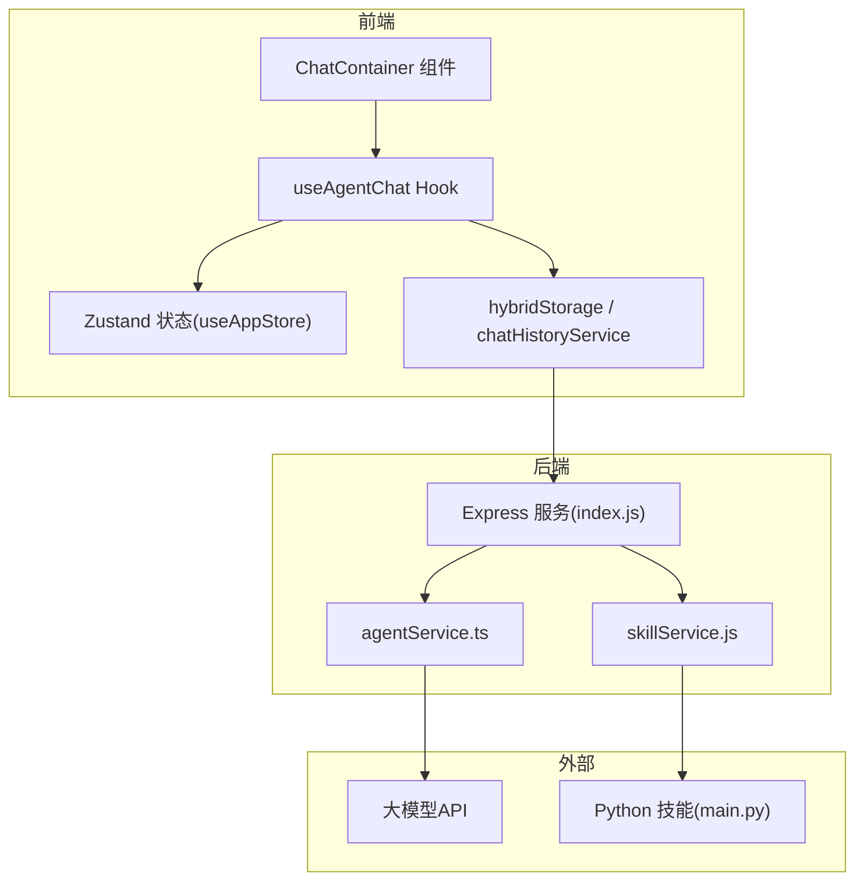
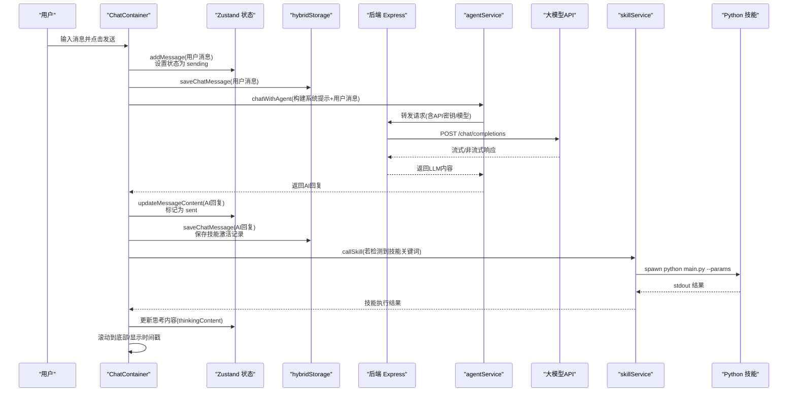
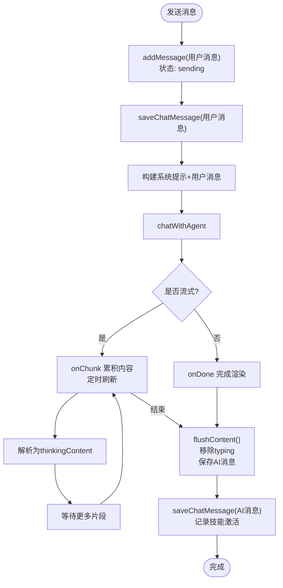
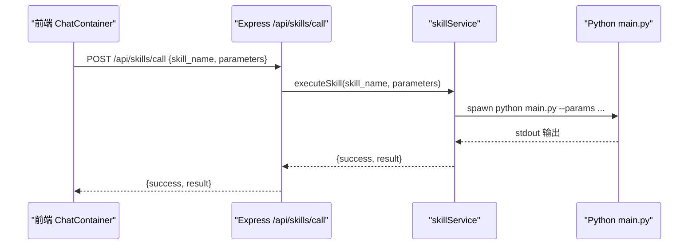
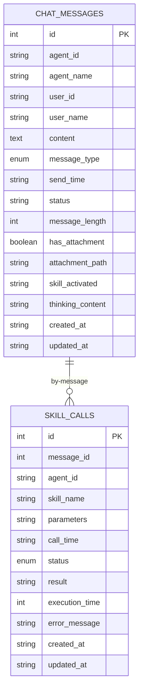
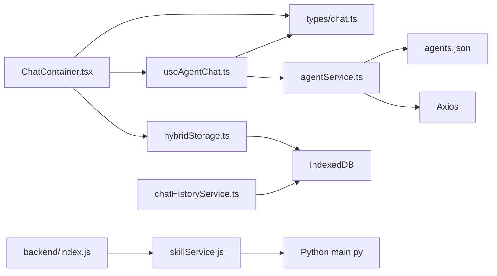
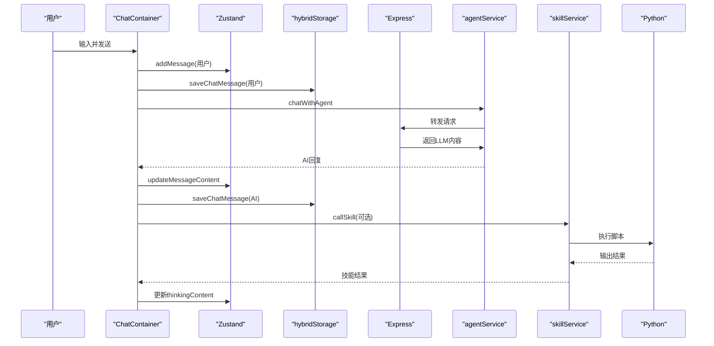

# 数据流设计

<cite>
**本文引用的文件**
- [src/store/useAppStore.ts](file://src/store/useAppStore.ts)
- [src/services/hybridStorage.ts](file://src/services/hybridStorage.ts)
- [src/services/chatHistoryService.ts](file://src/services/chatHistoryService.ts)
- [src/hooks/useAgentChat.ts](file://src/hooks/useAgentChat.ts)
- [src/types/chat.ts](file://src/types/chat.ts)
- [src/components/chat/ChatContainer.tsx](file://src/components/chat/ChatContainer.tsx)
- [src/pages/AgentChatPage.tsx](file://src/pages/AgentChatPage.tsx)
- [backend/index.js](file://backend/index.js)
- [backend/services/agentService.ts](file://backend/services/agentService.ts)
- [backend/services/skillService.js](file://backend/services/skillService.js)
- [config/agents.json](file://config/agents.json)
- [skills/weather_query/main.py](file://skills/weather_query/main.py)
</cite>

## 目录
1. [引言](#引言)
2. [项目结构](#项目结构)
3. [核心组件](#核心组件)
4. [架构总览](#架构总览)
5. [详细组件分析](#详细组件分析)
6. [依赖关系分析](#依赖关系分析)
7. [性能考量](#性能考量)
8. [故障排查指南](#故障排查指南)
9. [结论](#结论)
10. [附录](#附录)

## 引言
本文件面向AutoMate数据流设计，系统性梳理从用户输入到最终展示的完整数据链路，覆盖前端状态管理、后端服务与Python脚本之间的数据交换、实时数据同步、消息状态跟踪、聊天历史管理以及混合存储策略（内存、本地与数据库）。同时给出一致性保障、并发控制与错误恢复策略，并提供优化技巧、缓存策略与性能监控建议。

## 项目结构
AutoMate采用前后端分离与多语言协作的架构：
- 前端基于React + Zustand进行状态管理，通过自研服务封装与后端交互。
- 后端使用Node.js提供技能调用代理与静态资源服务。
- Python技能以独立脚本形式存在，由后端或前端服务统一调度执行。
- 数据层采用IndexedDB持久化，结合短期内存态与长期历史检索。

图表来源
- [src/components/chat/ChatContainer.tsx](file://src/components/chat/ChatContainer.tsx#L1-L756)
- [src/store/useAppStore.ts](file://src/store/useAppStore.ts#L1-L306)
- [src/hooks/useAgentChat.ts](file://src/hooks/useAgentChat.ts#L1-L128)
- [src/services/hybridStorage.ts](file://src/services/hybridStorage.ts#L1-L262)
- [backend/index.js](file://backend/index.js#L1-L117)
- [backend/services/agentService.ts](file://backend/services/agentService.ts#L1-L245)
- [backend/services/skillService.js](file://backend/services/skillService.js#L1-L87)

章节来源
- [src/components/chat/ChatContainer.tsx](file://src/components/chat/ChatContainer.tsx#L1-L756)
- [src/store/useAppStore.ts](file://src/store/useAppStore.ts#L1-L306)
- [src/hooks/useAgentChat.ts](file://src/hooks/useAgentChat.ts#L1-L128)
- [src/services/hybridStorage.ts](file://src/services/hybridStorage.ts#L1-L262)
- [backend/index.js](file://backend/index.js#L1-L117)
- [backend/services/agentService.ts](file://backend/services/agentService.ts#L1-L245)
- [backend/services/skillService.js](file://backend/services/skillService.js#L1-L87)

## 核心组件
- 前端状态与UI
  - Zustand状态：管理智能体列表、当前选中智能体、聊天会话、消息列表、输入框状态、主题与全局状态等。
  - ChatContainer：负责渲染消息、输入、发送/停止、重试、滚动、时间戳分隔、流式输出处理与历史加载。
  - useAgentChat：封装与LLM的聊天流程，支持普通与流式两种模式。
  - hybridStorage/chatHistoryService：封装IndexedDB的聊天消息与技能调用记录的增删改查与索引查询。
- 后端服务
  - Express服务：提供技能调用代理、健康检查。
  - agentService：加载agents.json，拼装系统提示词，转发至大模型API；封装技能描述加载与调用。
  - skillService：通过子进程执行Python技能脚本，收集stdout/stderr，返回执行结果。
- 配置与技能
  - agents.json：定义智能体组、智能体、技能清单与API配置。
  - Python技能：按约定接收参数，打印结果供后端捕获。

章节来源
- [src/store/useAppStore.ts](file://src/store/useAppStore.ts#L1-L306)
- [src/components/chat/ChatContainer.tsx](file://src/components/chat/ChatContainer.tsx#L1-L756)
- [src/hooks/useAgentChat.ts](file://src/hooks/useAgentChat.ts#L1-L128)
- [src/services/hybridStorage.ts](file://src/services/hybridStorage.ts#L1-L262)
- [src/services/chatHistoryService.ts](file://src/services/chatHistoryService.ts#L1-L244)
- [backend/index.js](file://backend/index.js#L1-L117)
- [backend/services/agentService.ts](file://backend/services/agentService.ts#L1-L245)
- [backend/services/skillService.js](file://backend/services/skillService.js#L1-L87)
- [config/agents.json](file://config/agents.json#L1-L119)
- [skills/weather_query/main.py](file://skills/weather_query/main.py#L1-L139)

## 架构总览
下图展示从用户输入到最终展示的端到端数据流，涵盖前端状态更新、后端代理、LLM调用、Python技能执行与数据库持久化。

图表来源
- [src/components/chat/ChatContainer.tsx](file://src/components/chat/ChatContainer.tsx#L213-L392)
- [src/store/useAppStore.ts](file://src/store/useAppStore.ts#L143-L187)
- [src/services/hybridStorage.ts](file://src/services/hybridStorage.ts#L129-L163)
- [backend/services/agentService.ts](file://backend/services/agentService.ts#L118-L185)
- [backend/services/skillService.js](file://backend/services/skillService.js#L16-L86)
- [skills/weather_query/main.py](file://skills/weather_query/main.py#L116-L139)

## 详细组件分析

### 前端状态管理与消息流
- 状态模型
  - Agent/AgentGroup/Message/ChatState/UserSettings/ThemeConfig等接口定义了完整的消息与会话结构。
  - Zustand提供addMessage/updateMessageContent/updateMessageThinkingContent/removeLastAiMessage/setTyping等原子操作，确保状态变更可追踪且不可变。
- 实时流式更新
  - ChatContainer在onChunk回调中累积内容，定时刷新以降低渲染压力；支持<think>标记解析为thinkingContent。
  - onDone阶段清理计时器、移除typing、持久化消息并记录技能调用。
- 历史加载
  - 首次进入会话时，若内存无消息则从IndexedDB加载最近24小时消息并回填到状态。

图表来源
- [src/components/chat/ChatContainer.tsx](file://src/components/chat/ChatContainer.tsx#L240-L392)
- [src/store/useAppStore.ts](file://src/store/useAppStore.ts#L143-L187)
- [src/services/hybridStorage.ts](file://src/services/hybridStorage.ts#L129-L163)

章节来源
- [src/store/useAppStore.ts](file://src/store/useAppStore.ts#L1-L306)
- [src/components/chat/ChatContainer.tsx](file://src/components/chat/ChatContainer.tsx#L1-L756)

### 后端服务与LLM集成
- agentService
  - 从agents.json加载智能体配置与技能描述，动态拼接系统提示词。
  - 通过Axios向第三方大模型API发起请求，支持超时与错误分类返回。
- skillService
  - 使用child_process以守护进程方式执行Python脚本，捕获stdout/stderr，返回success/result/error。
- Express代理
  - 提供/api/skills/call接口，接收skill_name与parameters，转发给skillService执行。

图表来源
- [backend/index.js](file://backend/index.js#L81-L104)
- [backend/services/skillService.js](file://backend/services/skillService.js#L16-L86)
- [skills/weather_query/main.py](file://skills/weather_query/main.py#L116-L139)

章节来源
- [backend/services/agentService.ts](file://backend/services/agentService.ts#L1-L245)
- [backend/services/skillService.js](file://backend/services/skillService.js#L1-L87)
- [backend/index.js](file://backend/index.js#L1-L117)

### Python技能数据交换
- 参数传递
  - 后端通过命令行参数传入JSON字符串(--params)，Python脚本解析后提取input/location等字段。
- 输出约定
  - Python脚本打印最终结果字符串，后端捕获stdout作为技能执行结果。
- 错误处理
  - stdout为空但退出码为0时，返回“技能执行完成（无输出）”；非0或stderr包含错误信息时，返回error。

章节来源
- [backend/index.js](file://backend/index.js#L19-L79)
- [skills/weather_query/main.py](file://skills/weather_query/main.py#L116-L139)

### 混合存储策略与聊天历史
- 存储结构
  - IndexedDB包含chat_messages与skill_calls两张表，分别记录消息与技能调用，带多维索引便于查询。
- 生命周期
  - 热数据保留3天，每日首次访问触发过期清理；最近24小时消息用于首次加载。
- 一致性
  - 内存态优先，首次进入时从IndexedDB回填；所有新增消息均落库，保证离线可恢复与跨会话可见。

图表来源
- [src/services/hybridStorage.ts](file://src/services/hybridStorage.ts#L39-L59)
- [src/services/chatHistoryService.ts](file://src/services/chatHistoryService.ts#L37-L57)

章节来源
- [src/services/hybridStorage.ts](file://src/services/hybridStorage.ts#L1-L262)
- [src/services/chatHistoryService.ts](file://src/services/chatHistoryService.ts#L1-L244)

### 实时数据同步与消息状态跟踪
- 状态枚举
  - 消息状态包含sending/sent/delivered/read/failed，typing标志位用于指示对方正在输入。
- 同步策略
  - 前端通过Zustand集中更新；后端仅作为代理转发，不持有业务状态。
  - IndexedDB作为最终一致性的数据锚点，避免重复渲染与丢失。

章节来源
- [src/store/useAppStore.ts](file://src/store/useAppStore.ts#L17-L26)
- [src/components/chat/ChatContainer.tsx](file://src/components/chat/ChatContainer.tsx#L308-L392)

### 聊天历史管理与重试机制
- 历史加载
  - 首次进入会话且内存为空时，按agentId与时间窗口查询IndexedDB并回填。
- 重试逻辑
  - 用户点击重试时，删除最后一条AI消息及其关联技能调用记录，重新触发一次完整对话流程。

章节来源
- [src/components/chat/ChatContainer.tsx](file://src/components/chat/ChatContainer.tsx#L74-L103)
- [src/services/hybridStorage.ts](file://src/services/hybridStorage.ts#L186-L200)

## 依赖关系分析
- 前端依赖
  - ChatContainer依赖useAgentChat与hybridStorage；useAgentChat依赖agentService与chat类型定义。
- 后端依赖
  - Express依赖skillService；agentService依赖agents.json与Axios。
- 数据依赖
  - hybridStorage与chatHistoryService共享同一DB Schema，前者提供过期清理与高频操作，后者提供更细粒度的更新/删除能力。

图表来源
- [src/components/chat/ChatContainer.tsx](file://src/components/chat/ChatContainer.tsx#L1-L756)
- [src/hooks/useAgentChat.ts](file://src/hooks/useAgentChat.ts#L1-L128)
- [src/services/hybridStorage.ts](file://src/services/hybridStorage.ts#L1-L262)
- [src/services/chatHistoryService.ts](file://src/services/chatHistoryService.ts#L1-L244)
- [src/types/chat.ts](file://src/types/chat.ts#L1-L280)
- [backend/services/agentService.ts](file://backend/services/agentService.ts#L1-L245)
- [backend/index.js](file://backend/index.js#L1-L117)
- [backend/services/skillService.js](file://backend/services/skillService.js#L1-L87)
- [config/agents.json](file://config/agents.json#L1-L119)

章节来源
- [src/components/chat/ChatContainer.tsx](file://src/components/chat/ChatContainer.tsx#L1-L756)
- [src/hooks/useAgentChat.ts](file://src/hooks/useAgentChat.ts#L1-L128)
- [src/services/hybridStorage.ts](file://src/services/hybridStorage.ts#L1-L262)
- [src/services/chatHistoryService.ts](file://src/services/chatHistoryService.ts#L1-L244)
- [src/types/chat.ts](file://src/types/chat.ts#L1-L280)
- [backend/services/agentService.ts](file://backend/services/agentService.ts#L1-L245)
- [backend/index.js](file://backend/index.js#L1-L117)
- [backend/services/skillService.js](file://backend/services/skillService.js#L1-L87)
- [config/agents.json](file://config/agents.json#L1-L119)

## 性能考量
- 渲染优化
  - ChatContainer在onChunk中使用定时器批量更新，减少频繁setState导致的重渲染。
  - 通过固定最大高度与自适应高度，避免布局抖动。
- 数据库优化
  - 为chat_messages与skill_calls建立复合索引，按agent_id/send_time/skill_activated等维度查询，提升历史加载与技能关联查询效率。
  - 热数据保留策略与每日清理，避免DB膨胀。
- 网络与并发
  - 流式响应按块解码，避免一次性解析大对象；对LLM请求设置合理超时。
  - 并发发送时通过isSending与typing状态互斥，防止重复触发。
- 缓存策略
  - 前端内存态作为“热缓存”，首次加载时回填IndexedDB；技能描述在useAgentChat中缓存于Map，避免重复拉取。
- 监控建议
  - 记录每条消息的send_time、status、skill_activated与execution_time，便于统计延迟与成功率。
  - 对Python技能执行时间与错误率建立指标，定期告警。

[本节为通用指导，无需列出具体文件来源]

## 故障排查指南
- 常见问题定位
  - 网络错误：检查agents.json中的url/api_key/model配置；确认代理地址与直连地址切换逻辑。
  - 技能执行失败：查看后端日志与stderr输出；确认Python脚本路径与参数格式。
  - 历史消息缺失：确认IndexedDB初始化与过期清理逻辑；检查agentId与时间窗口过滤条件。
- 错误恢复
  - 重试：删除最后一条AI消息与其技能调用记录，重新发起对话。
  - 降级：若LLM不可用，可暂时禁用流式，改为非流式；或回退到本地缓存消息。
- 日志与可观测性
  - 在ChatContainer与useAgentChat中增加关键节点的日志；在后端记录请求/响应体摘要与执行耗时。

章节来源
- [src/components/chat/ChatContainer.tsx](file://src/components/chat/ChatContainer.tsx#L400-L433)
- [src/hooks/useAgentChat.ts](file://src/hooks/useAgentChat.ts#L51-L82)
- [backend/services/agentService.ts](file://backend/services/agentService.ts#L161-L184)
- [backend/services/skillService.js](file://backend/services/skillService.js#L58-L70)

## 结论
AutoMate通过“前端Zustand状态 + 后端代理 + Python技能脚本”的组合，实现了灵活、可扩展的数据流。前端负责实时渲染与状态收敛，后端负责协议转换与外部调用，Python技能提供领域能力扩展。混合存储策略在保证一致性的同时兼顾性能与可维护性。后续可在指标埋点、缓存预热与错误域隔离方面进一步增强。

[本节为总结性内容，无需列出具体文件来源]

## 附录
- 关键流程时序（端到端）

图表来源
- [src/components/chat/ChatContainer.tsx](file://src/components/chat/ChatContainer.tsx#L213-L392)
- [src/store/useAppStore.ts](file://src/store/useAppStore.ts#L143-L187)
- [src/services/hybridStorage.ts](file://src/services/hybridStorage.ts#L129-L163)
- [backend/services/agentService.ts](file://backend/services/agentService.ts#L118-L185)
- [backend/services/skillService.js](file://backend/services/skillService.js#L16-L86)
- [skills/weather_query/main.py](file://skills/weather_query/main.py#L116-L139)