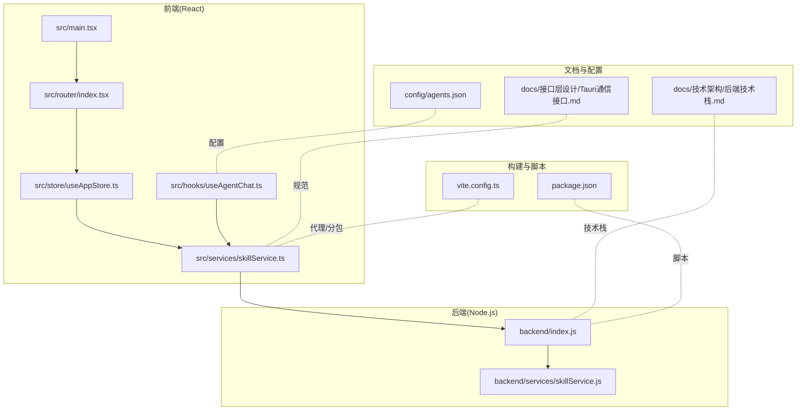
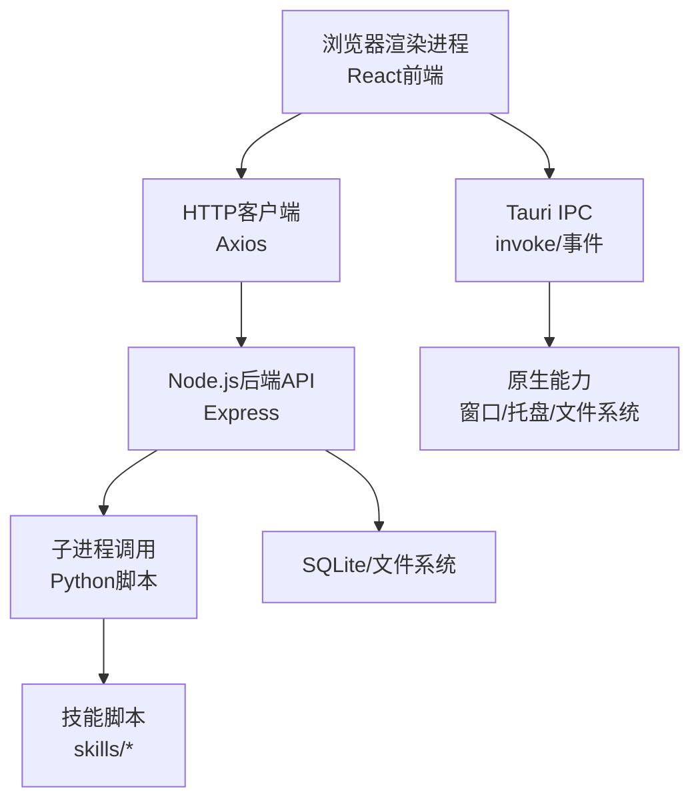
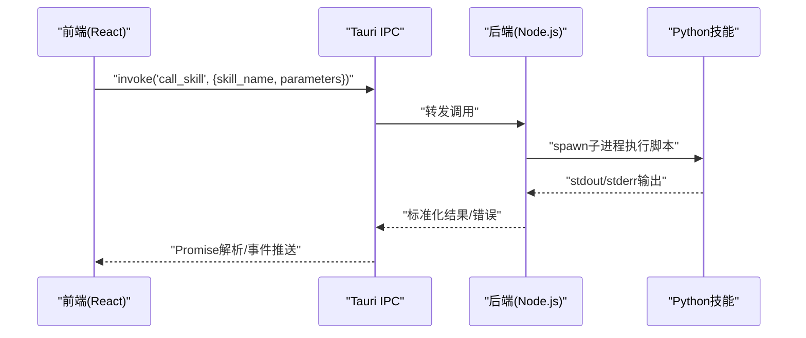
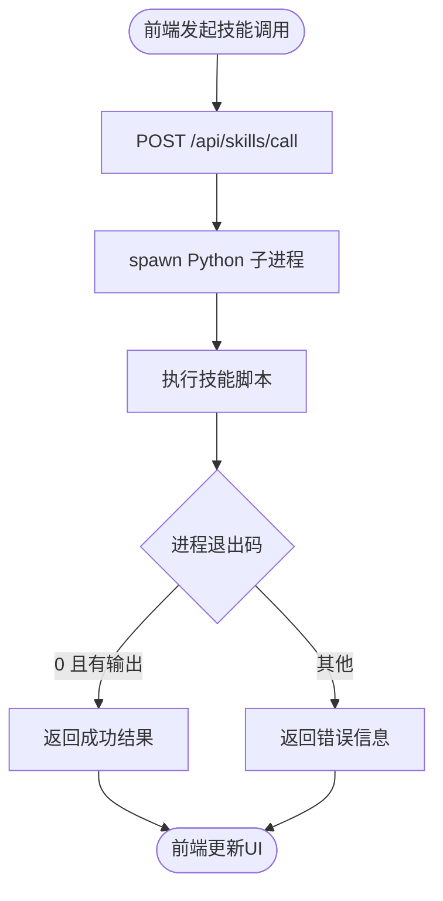
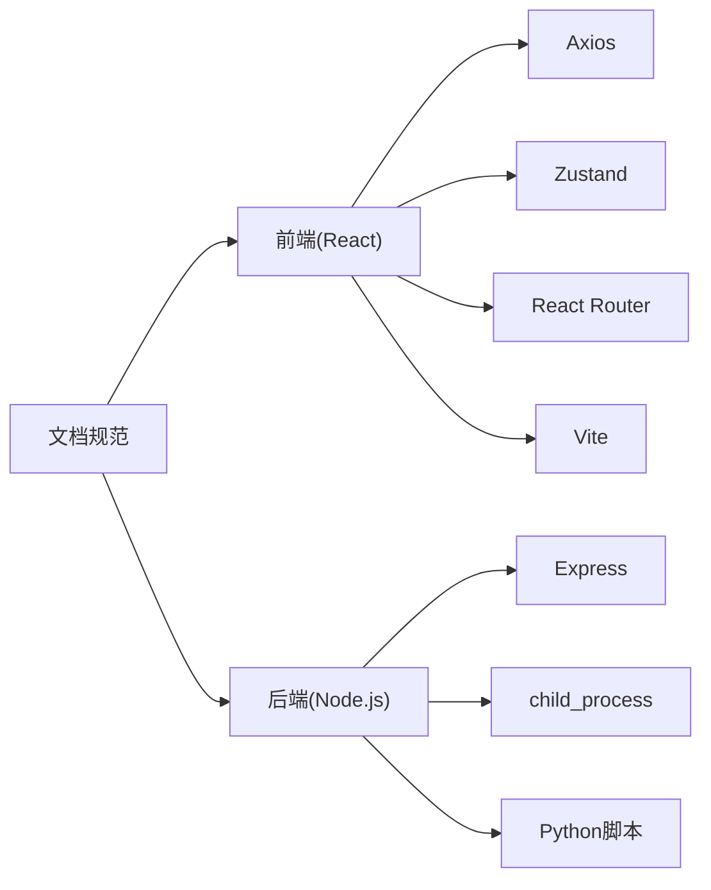

# 桌面框架集成

<cite>
**本文引用的文件**
- [package.json](file://package.json)
- [vite.config.ts](file://vite.config.ts)
- [backend/index.js](file://backend/index.js)
- [src/main.tsx](file://src/main.tsx)
- [docs/技术架构/后端技术栈.md](file://docs/技术架构/后端技术栈.md)
- [docs/接口层设计/Tauri通信接口.md](file://docs/接口层设计/Tauri通信接口.md)
- [src/services/skillService.ts](file://src/services/skillService.ts)
- [backend/services/skillService.js](file://backend/services/skillService.js)
- [src/store/useAppStore.ts](file://src/store/useAppStore.ts)
- [src/router/index.tsx](file://src/router/index.tsx)
- [src/hooks/useAgentChat.ts](file://src/hooks/useAgentChat.ts)
- [config/agents.json](file://config/agents.json)
</cite>

## 目录
1. [引言](#引言)
2. [项目结构](#项目结构)
3. [核心组件](#核心组件)
4. [架构总览](#架构总览)
5. [组件详解](#组件详解)
6. [依赖关系分析](#依赖关系分析)
7. [性能考量](#性能考量)
8. [故障排查指南](#故障排查指南)
9. [结论](#结论)
10. [附录](#附录)

## 引言
本文件面向AutoMate桌面框架集成场景，围绕Tauri框架的选择与集成策略展开，系统阐述Web技术栈与原生桌面应用的融合方式；深入解析Tauri IPC通信机制（前端与后端的双向通信、异步消息处理与数据序列化）；覆盖窗口管理、系统托盘集成与文件系统访问权限的设计要点；给出构建流程、打包策略与跨平台兼容性处理建议；并总结安全模型、沙箱机制与权限控制实践，最后提供开发调试技巧、性能优化与用户体验设计建议。

## 项目结构
AutoMate采用前后端分离的混合架构：前端基于React + TypeScript，借助Vite进行开发与构建；后端以Node.js提供REST风格API与技能执行能力；同时通过Tauri桥接原生能力（窗口、系统托盘、文件系统等）。核心目录与职责如下：
- 前端（src/）：页面、组件、路由、状态管理、服务层
- 后端（backend/）：技能服务、API网关、Python子进程调用
- 文档（docs/）：技术架构与接口设计规范
- 配置（config/）：智能体配置与技能清单
- 构建（package.json、vite.config.ts）：脚本、代理、分包与产物输出

图表来源
- [src/main.tsx](file://src/main.tsx#L1-L12)
- [src/router/index.tsx](file://src/router/index.tsx#L1-L43)
- [src/store/useAppStore.ts](file://src/store/useAppStore.ts#L1-L306)
- [src/services/skillService.ts](file://src/services/skillService.ts#L1-L73)
- [src/hooks/useAgentChat.ts](file://src/hooks/useAgentChat.ts#L1-L128)
- [backend/index.js](file://backend/index.js#L1-L117)
- [backend/services/skillService.js](file://backend/services/skillService.js#L1-L87)
- [docs/技术架构/后端技术栈.md](file://docs/技术架构/后端技术栈.md#L1-L380)
- [docs/接口层设计/Tauri通信接口.md](file://docs/接口层设计/Tauri通信接口.md#L1-L1013)
- [config/agents.json](file://config/agents.json#L1-L119)
- [package.json](file://package.json#L1-L47)
- [vite.config.ts](file://vite.config.ts#L1-L47)

章节来源
- [package.json](file://package.json#L1-L47)
- [vite.config.ts](file://vite.config.ts#L1-L47)
- [backend/index.js](file://backend/index.js#L1-L117)
- [src/main.tsx](file://src/main.tsx#L1-L12)
- [docs/技术架构/后端技术栈.md](file://docs/技术架构/后端技术栈.md#L1-L380)
- [docs/接口层设计/Tauri通信接口.md](file://docs/接口层设计/Tauri通信接口.md#L1-L1013)
- [src/services/skillService.ts](file://src/services/skillService.ts#L1-L73)
- [backend/services/skillService.js](file://backend/services/skillService.js#L1-L87)
- [src/store/useAppStore.ts](file://src/store/useAppStore.ts#L1-L306)
- [src/router/index.tsx](file://src/router/index.tsx#L1-L43)
- [src/hooks/useAgentChat.ts](file://src/hooks/useAgentChat.ts#L1-L128)
- [config/agents.json](file://config/agents.json#L1-L119)

## 核心组件
- 前端应用入口与路由
  - 入口文件负责挂载根组件与全局样式
  - 路由系统承载主布局与页面切换
- 状态管理
  - Zustand Store集中管理智能体、聊天会话、主题与用户设置
- 技能服务
  - 前端封装HTTP调用，统一错误处理与超时控制
  - 后端通过子进程调用Python脚本执行技能，并返回结果
- 智能体聊天钩子
  - 负责加载配置、校验API参数、发起消息与流式输出
- 后端API网关
  - 提供技能调用接口，转发至技能服务并返回标准化结果
- 文档规范
  - 明确Tauri IPC接口、事件系统与错误处理策略

章节来源
- [src/main.tsx](file://src/main.tsx#L1-L12)
- [src/router/index.tsx](file://src/router/index.tsx#L1-L43)
- [src/store/useAppStore.ts](file://src/store/useAppStore.ts#L1-L306)
- [src/services/skillService.ts](file://src/services/skillService.ts#L1-L73)
- [backend/services/skillService.js](file://backend/services/skillService.js#L1-L87)
- [src/hooks/useAgentChat.ts](file://src/hooks/useAgentChat.ts#L1-L128)
- [backend/index.js](file://backend/index.js#L1-L117)
- [docs/接口层设计/Tauri通信接口.md](file://docs/接口层设计/Tauri通信接口.md#L1-L1013)

## 架构总览
AutoMate的桌面集成采用“Web前端 + Node.js后端 + Python技能执行”的三层架构。前端通过HTTP与后端交互，后端通过子进程调用Python脚本执行具体技能。Tauri作为原生桥接层，负责窗口、系统托盘与文件系统等原生能力的暴露与安全控制。

图表来源
- [src/services/skillService.ts](file://src/services/skillService.ts#L1-L73)
- [backend/index.js](file://backend/index.js#L1-L117)
- [backend/services/skillService.js](file://backend/services/skillService.js#L1-L87)
- [docs/接口层设计/Tauri通信接口.md](file://docs/接口层设计/Tauri通信接口.md#L1-L1013)

## 组件详解

### Tauri IPC通信机制
- 调用方式
  - 前端通过invoke API调用后端函数
  - 后端通过事件系统向前端推送消息
  - 支持双向通信与异步消息处理
- 数据序列化
  - 参数与返回值遵循JSON序列化约定
  - 错误类型涵盖调用失败、超时、参数验证失败、数据库操作失败等
- 事件系统
  - 前端监听特定事件（如智能体状态变化、新消息、技能调用完成/失败）
  - 后端在关键节点触发事件，实现解耦的消息传递

图表来源
- [docs/接口层设计/Tauri通信接口.md](file://docs/接口层设计/Tauri通信接口.md#L1-L1013)
- [src/services/skillService.ts](file://src/services/skillService.ts#L1-L73)
- [backend/services/skillService.js](file://backend/services/skillService.js#L1-L87)

章节来源
- [docs/接口层设计/Tauri通信接口.md](file://docs/接口层设计/Tauri通信接口.md#L1-L1013)

### 技能调用流程
- 前端调用
  - 封装POST /api/skills/call，携带技能名称与参数
  - 统一超时与网络错误处理
- 后端执行
  - 子进程调用Python脚本，收集标准输出与错误输出
  - 标准化返回结构，区分成功与失败
- 结果回传
  - 前端接收结果并更新UI状态

图表来源
- [src/services/skillService.ts](file://src/services/skillService.ts#L1-L73)
- [backend/index.js](file://backend/index.js#L1-L117)
- [backend/services/skillService.js](file://backend/services/skillService.js#L1-L87)

章节来源
- [src/services/skillService.ts](file://src/services/skillService.ts#L1-L73)
- [backend/index.js](file://backend/index.js#L1-L117)
- [backend/services/skillService.js](file://backend/services/skillService.js#L1-L87)

### 窗口管理、系统托盘与文件系统
- 窗口管理
  - 通过Tauri窗口API实现最小化、隐藏到托盘、恢复显示等行为
  - 结合前端路由与状态管理，控制界面展示与交互
- 系统托盘集成
  - 注册托盘图标与菜单项，支持点击显示/隐藏窗口
  - 通过事件系统向前端推送托盘交互状态
- 文件系统访问
  - 通过Tauri文件系统API进行受限访问（如读写配置、缓存）
  - 对外HTTP接口仅暴露必要能力，避免直接暴露系统路径

章节来源
- [docs/接口层设计/Tauri通信接口.md](file://docs/接口层设计/Tauri通信接口.md#L1-L1013)

### 构建流程、打包策略与跨平台兼容性
- 构建流程
  - 开发：Vite热更新与代理（/api/proxy、/api/skills）
  - 生产：TypeScript编译与Rollup打包，手动分包优化
- 打包策略
  - 将React相关依赖拆分为独立chunk，提升缓存命中率
  - 保留Source Map便于调试
- 跨平台兼容性
  - Tauri统一编译为Windows/macOS/Linux可执行程序
  - 通过条件编译与运行时检测适配不同平台差异

章节来源
- [vite.config.ts](file://vite.config.ts#L1-L47)
- [package.json](file://package.json#L1-L47)

### 安全模型、沙箱机制与权限控制
- 安全模型
  - 前端仅通过HTTP与后端交互，不直接访问系统资源
  - 后端通过子进程隔离技能执行，限制输入与输出
- 沙箱机制
  - 技能脚本在受限工作目录内执行，避免越权访问
  - 对外部API调用进行参数校验与超时控制
- 权限控制
  - 后端对敏感操作进行权限检查
  - Tauri原生能力通过权限声明与白名单控制

章节来源
- [docs/接口层设计/Tauri通信接口.md](file://docs/接口层设计/Tauri通信接口.md#L1-L1013)
- [backend/index.js](file://backend/index.js#L1-L117)

## 依赖关系分析
- 前端依赖
  - React生态与状态管理（Zustand）、路由（React Router）、UI库（Lucide、React Markdown）
  - 构建工具链（Vite、TailwindCSS、TypeScript）
- 后端依赖
  - Express提供HTTP服务，CORS允许跨域
  - 子进程调用Python脚本执行技能
- 文档与规范
  - 技术架构文档定义Node.js与Playwright使用
  - IPC接口文档定义Tauri通信规范

图表来源
- [src/services/skillService.ts](file://src/services/skillService.ts#L1-L73)
- [src/store/useAppStore.ts](file://src/store/useAppStore.ts#L1-L306)
- [src/router/index.tsx](file://src/router/index.tsx#L1-L43)
- [backend/index.js](file://backend/index.js#L1-L117)
- [docs/技术架构/后端技术栈.md](file://docs/技术架构/后端技术栈.md#L1-L380)
- [docs/接口层设计/Tauri通信接口.md](file://docs/接口层设计/Tauri通信接口.md#L1-L1013)

章节来源
- [src/services/skillService.ts](file://src/services/skillService.ts#L1-L73)
- [src/store/useAppStore.ts](file://src/store/useAppStore.ts#L1-L306)
- [src/router/index.tsx](file://src/router/index.tsx#L1-L43)
- [backend/index.js](file://backend/index.js#L1-L117)
- [docs/技术架构/后端技术栈.md](file://docs/技术架构/后端技术栈.md#L1-L380)
- [docs/接口层设计/Tauri通信接口.md](file://docs/接口层设计/Tauri通信接口.md#L1-L1013)

## 性能考量
- 前端性能
  - 使用Zustand替代重型状态库，减少不必要的重渲染
  - 路由懒加载与代码分割，降低首屏体积
- 后端性能
  - 子进程池化与并发控制，避免过多技能同时执行导致资源争用
  - 对外部API调用设置合理超时与重试策略
- 构建性能
  - Rollup手动分包策略提升缓存利用率
  - Source Map开启便于定位问题但影响构建时间

## 故障排查指南
- 技能调用失败
  - 检查后端日志与子进程输出，确认Python脚本路径与参数
  - 前端捕获Axios错误并提示“请确保后端服务正在运行”
- IPC调用异常
  - 校验invoke函数名与参数结构，参考IPC接口文档
  - 捕获超时与验证错误，记录堆栈信息
- 事件未到达
  - 确认事件监听是否注册与取消时机
  - 检查后端事件触发逻辑与命名空间

章节来源
- [src/services/skillService.ts](file://src/services/skillService.ts#L1-L73)
- [docs/接口层设计/Tauri通信接口.md](file://docs/接口层设计/Tauri通信接口.md#L1-L1013)

## 结论
AutoMate通过Tauri实现了Web技术栈与原生桌面能力的深度融合：前端负责交互与状态管理，后端提供技能执行与API服务，Tauri桥接原生窗口、托盘与文件系统。IPC机制保证了前后端的高效通信与事件驱动的解耦设计。配合完善的构建与安全策略，项目具备良好的可维护性与跨平台兼容性。

## 附录
- 开发调试建议
  - 使用Vite代理快速对接后端服务
  - 在前端与后端分别记录调用前后的上下文信息
  - 利用Source Map与断点调试定位问题
- 用户体验设计
  - 通过状态管理统一控制加载态与错误态
  - 为技能调用提供进度反馈与取消机制
  - 保持托盘交互的一致性与可恢复性