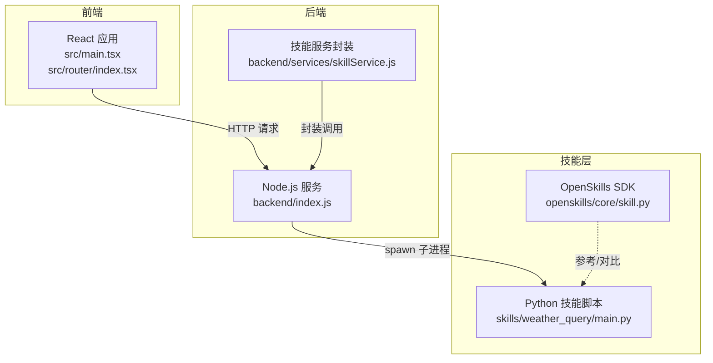
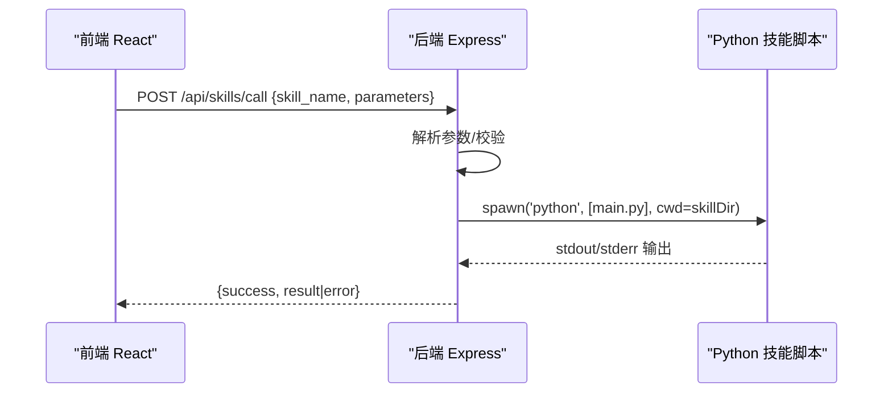
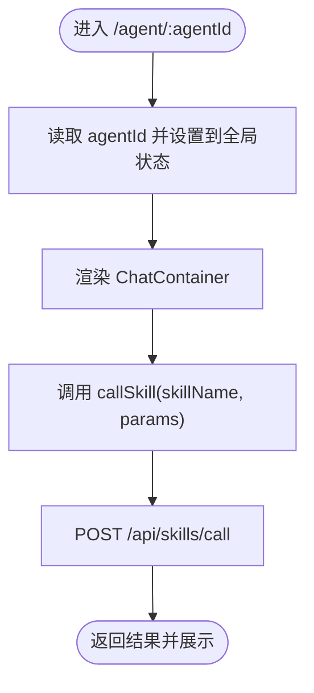
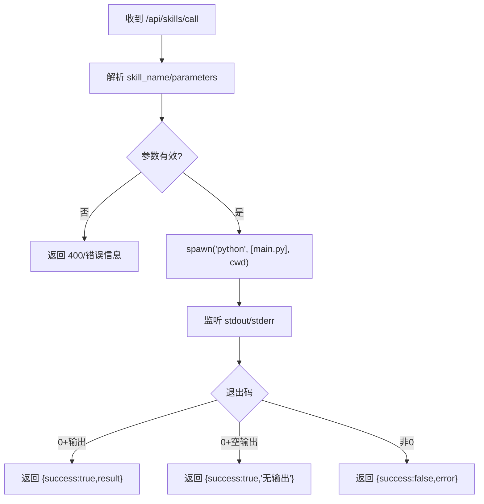
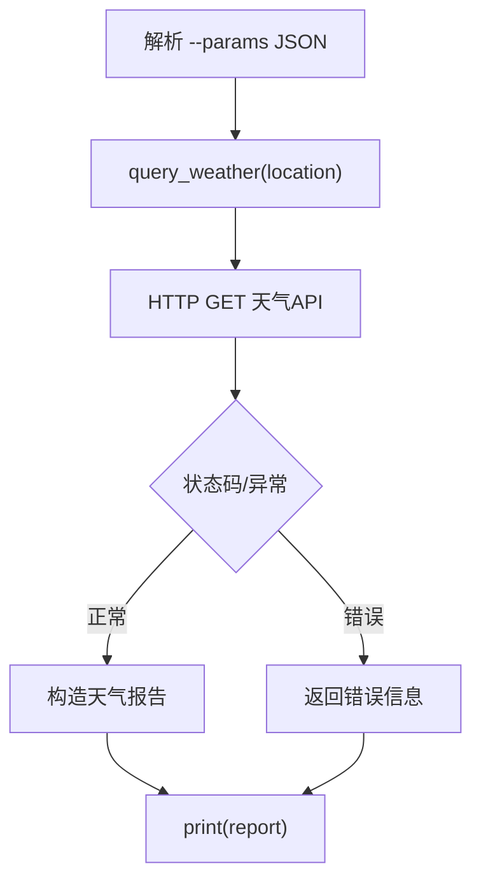
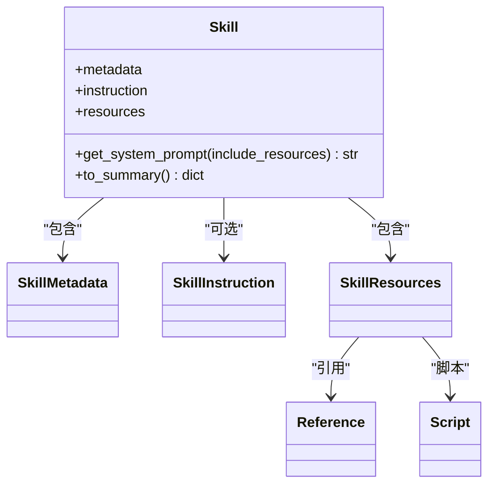
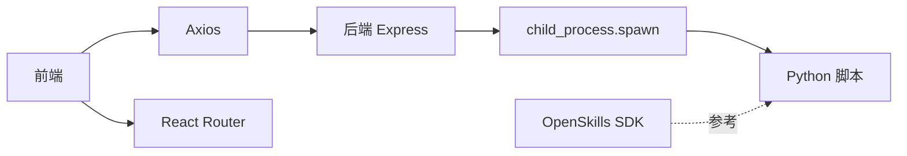

# 系统架构

<cite>
**本文引用的文件**
- [package.json](file://package.json)
- [backend/index.js](file://backend/index.js)
- [backend/services/skillService.js](file://backend/services/skillService.js)
- [src/main.tsx](file://src/main.tsx)
- [src/router/index.tsx](file://src/router/index.tsx)
- [src/pages/AgentChatPage.tsx](file://src/pages/AgentChatPage.tsx)
- [src/services/skillService.ts](file://src/services/skillService.ts)
- [skills/weather_query/main.py](file://skills/weather_query/main.py)
- [OpenSkills-main/pyproject.toml](file://OpenSkills-main/pyproject.toml)
- [OpenSkills-main/openskills/core/skill.py](file://OpenSkills-main/openskills/core/skill.py)
- [config/agents.json](file://config/agents.json)
- [docs/技术架构/后端技术栈.md](file://docs/技术架构/后端技术栈.md)
- [docs/非功能设计/可扩展性设计.md](file://docs/非功能设计/可扩展性设计.md)
</cite>

## 目录
1. [引言](#引言)
2. [项目结构](#项目结构)
3. [核心组件](#核心组件)
4. [架构总览](#架构总览)
5. [详细组件分析](#详细组件分析)
6. [依赖分析](#依赖分析)
7. [性能考量](#性能考量)
8. [故障排查指南](#故障排查指南)
9. [结论](#结论)
10. [附录](#附录)

## 引言
本文件面向AutoMate系统的架构设计与实现，聚焦于前端React应用、后端Node.js服务、Python技能脚本以及OpenSkills SDK之间的交互关系，阐述微服务化技能架构的设计理念与落地方式，并给出系统组件关系图、数据流向图、集成模式说明、技术决策权衡、性能与可扩展性设计建议，以及基础设施与部署拓扑要点。

## 项目结构
AutoMate采用“前端React + 后端Node.js + Python技能脚本”的分层架构。前端通过Axios调用后端REST API；后端以Express承载HTTP服务，动态调用skills目录下的Python脚本；Python技能脚本通过命令行参数接收参数并输出结构化结果；OpenSkills SDK提供技能建模与渐进式加载能力（仓库内包含SDK源码与示例技能）。

图表来源
- [src/main.tsx](file://src/main.tsx#L1-L12)
- [src/router/index.tsx](file://src/router/index.tsx#L1-L43)
- [backend/index.js](file://backend/index.js#L1-L117)
- [backend/services/skillService.js](file://backend/services/skillService.js#L1-L87)
- [skills/weather_query/main.py](file://skills/weather_query/main.py#L1-L139)
- [OpenSkills-main/openskills/core/skill.py](file://OpenSkills-main/openskills/core/skill.py#L1-L150)

章节来源
- [package.json](file://package.json#L1-L47)
- [backend/index.js](file://backend/index.js#L1-L117)
- [backend/services/skillService.js](file://backend/services/skillService.js#L1-L87)
- [src/main.tsx](file://src/main.tsx#L1-L12)
- [src/router/index.tsx](file://src/router/index.tsx#L1-L43)
- [skills/weather_query/main.py](file://skills/weather_query/main.py#L1-L139)
- [OpenSkills-main/openskills/core/skill.py](file://OpenSkills-main/openskills/core/skill.py#L1-L150)

## 核心组件
- 前端React应用：负责用户界面、路由与状态管理，通过Axios向后端发起技能调用请求。
- 后端Node.js服务：提供REST API，接收前端请求，解析参数，动态调用Python技能脚本，收集输出并返回结果。
- 技能脚本（Python）：以独立脚本形式存在，接收参数，执行具体任务，输出结构化结果。
- OpenSkills SDK：提供技能对象的三层渐进式加载（元数据/指令/资源），便于统一管理与扩展。

章节来源
- [src/services/skillService.ts](file://src/services/skillService.ts#L1-L73)
- [backend/index.js](file://backend/index.js#L1-L117)
- [backend/services/skillService.js](file://backend/services/skillService.js#L1-L87)
- [skills/weather_query/main.py](file://skills/weather_query/main.py#L1-L139)
- [OpenSkills-main/openskills/core/skill.py](file://OpenSkills-main/openskills/core/skill.py#L1-L150)

## 架构总览
系统采用“前端-后端-技能脚本”三层协作模式。前端通过统一API触发后端执行对应技能；后端以子进程方式调用Python脚本，传递参数并收集输出；技能脚本完成外部服务调用或本地计算后返回结果，由后端封装为统一响应返回前端。

图表来源
- [src/services/skillService.ts](file://src/services/skillService.ts#L1-L73)
- [backend/index.js](file://backend/index.js#L81-L104)
- [skills/weather_query/main.py](file://skills/weather_query/main.py#L128-L139)

章节来源
- [src/services/skillService.ts](file://src/services/skillService.ts#L1-L73)
- [backend/index.js](file://backend/index.js#L1-L117)
- [skills/weather_query/main.py](file://skills/weather_query/main.py#L1-L139)

## 详细组件分析

### 前端组件与路由
- 应用入口：创建根节点并挂载路由。
- 路由：定义首页、智能体聊天页、设置页等路由，聊天页根据URL参数选择当前智能体。
- 技能调用：封装callSkill方法，统一处理超时、网络错误与后端返回错误。

图表来源
- [src/pages/AgentChatPage.tsx](file://src/pages/AgentChatPage.tsx#L1-L24)
- [src/router/index.tsx](file://src/router/index.tsx#L1-L43)
- [src/services/skillService.ts](file://src/services/skillService.ts#L12-L61)

章节来源
- [src/main.tsx](file://src/main.tsx#L1-L12)
- [src/router/index.tsx](file://src/router/index.tsx#L1-L43)
- [src/pages/AgentChatPage.tsx](file://src/pages/AgentChatPage.tsx#L1-L24)
- [src/services/skillService.ts](file://src/services/skillService.ts#L1-L73)

### 后端服务与技能执行
- REST接口：提供技能调用与健康检查接口。
- 子进程执行：定位技能脚本路径，拼接参数，以UTF-8编码启动Python进程，监听stdout/stderr与退出码，组装响应。
- 错误处理：区分无输出成功、失败与异常三类场景，保证返回结构一致。

图表来源
- [backend/index.js](file://backend/index.js#L19-L79)
- [backend/index.js](file://backend/index.js#L81-L104)

章节来源
- [backend/index.js](file://backend/index.js#L1-L117)
- [backend/services/skillService.js](file://backend/services/skillService.js#L1-L87)

### 技能脚本（Python）
- 输入参数：通过命令行参数接收JSON字符串，解析出输入内容或位置等。
- 外部服务：示例脚本调用天气API，处理HTTP错误、网络异常与数据解析异常。
- 输出格式：统一返回结构化结果，便于后端直接透传给前端。

图表来源
- [skills/weather_query/main.py](file://skills/weather_query/main.py#L100-L139)

章节来源
- [skills/weather_query/main.py](file://skills/weather_query/main.py#L1-L139)

### OpenSkills SDK（参考与对比）
- 技能对象：三层渐进式加载（元数据/指令/资源），支持系统提示拼装与脚本调用提示。
- 资源解析：支持相对路径解析与引用内容条件加载，便于复杂技能的模块化组织。
- 对比意义：AutoMate当前以“脚本即技能”的轻量模式实现，OpenSkills提供了更规范的技能建模与扩展点，可作为未来演进方向参考。

图表来源
- [OpenSkills-main/openskills/core/skill.py](file://OpenSkills-main/openskills/core/skill.py#L1-L150)

章节来源
- [OpenSkills-main/openskills/core/skill.py](file://OpenSkills-main/openskills/core/skill.py#L1-L150)
- [OpenSkills-main/pyproject.toml](file://OpenSkills-main/pyproject.toml#L1-L75)

## 依赖分析
- 前端依赖：React、React Router、Axios、Zustand、TailwindCSS等，支撑UI与状态管理。
- 后端依赖：Express、CORS、child_process（用于spawn子进程）、path等，支撑HTTP服务与技能执行。
- 技能脚本：依赖requests等标准库，按需调用外部API。
- OpenSkills SDK：Pydantic、Typer、HTTPX等，提供技能建模与CLI能力。

图表来源
- [package.json](file://package.json#L15-L44)
- [backend/index.js](file://backend/index.js#L1-L117)
- [skills/weather_query/main.py](file://skills/weather_query/main.py#L1-L139)
- [OpenSkills-main/pyproject.toml](file://OpenSkills-main/pyproject.toml#L22-L28)

章节来源
- [package.json](file://package.json#L1-L47)
- [backend/index.js](file://backend/index.js#L1-L117)
- [OpenSkills-main/pyproject.toml](file://OpenSkills-main/pyproject.toml#L1-L75)

## 性能考量
- I/O与并发：后端以异步方式处理请求，技能执行通过子进程隔离，避免阻塞主进程；建议限制并发执行数量并增加队列/限流。
- 超时与健壮性：前端调用设置超时，后端spawn设置合理超时与错误回退；对外部API调用增加重试与熔断。
- 资源隔离：Python脚本在独立进程中运行，建议限制内存/CPU配额，防止资源耗尽。
- 缓存与复用：对重复技能调用结果进行缓存，减少重复外部请求；对常用脚本进行预热。
- 日志与可观测性：完善日志分级与追踪ID，记录技能执行耗时与错误，便于性能分析。

## 故障排查指南
- 前端常见问题
  - 网络错误：确认后端服务是否启动（npm run backend），检查跨域与代理配置。
  - 超时：适当增大超时时间，检查后端技能执行耗时。
- 后端常见问题
  - 缺少参数：skill_name缺失将返回400，检查前端请求体。
  - 子进程异常：查看stderr输出与退出码，确认Python环境与脚本路径。
- 技能脚本常见问题
  - 外部API失败：检查网络连通性、鉴权与配额；对异常进行分类处理并返回明确错误。
  - 参数解析失败：确认前端传参结构与脚本解析逻辑一致。

章节来源
- [src/services/skillService.ts](file://src/services/skillService.ts#L34-L61)
- [backend/index.js](file://backend/index.js#L81-L104)
- [skills/weather_query/main.py](file://skills/weather_query/main.py#L83-L97)

## 结论
AutoMate采用“前端-后端-技能脚本”的轻量微服务化架构，通过统一API与子进程执行实现技能解耦与扩展。前端负责交互与状态，后端负责编排与执行，技能脚本专注领域任务。OpenSkills SDK提供了更规范的技能建模思路，可作为后续演进方向。整体设计具备良好的可扩展性与可维护性，建议在生产环境中完善限流、缓存、可观测性与资源隔离机制。

## 附录

### 系统边界与集成模式
- 系统边界
  - 前端：仅负责UI与API调用，不直接执行业务逻辑。
  - 后端：负责API、参数校验、子进程调度与结果聚合。
  - 技能脚本：独立可执行单元，专注外部服务或本地计算。
- 集成模式
  - REST API：统一入口，参数标准化。
  - 子进程：隔离执行，便于扩展不同语言/框架的技能。
  - 配置驱动：通过agents.json声明智能体与技能映射，便于动态扩展。

章节来源
- [config/agents.json](file://config/agents.json#L1-L119)
- [docs/技术架构/后端技术栈.md](file://docs/技术架构/后端技术栈.md#L1-L380)
- [docs/非功能设计/可扩展性设计.md](file://docs/非功能设计/可扩展性设计.md#L1-L624)