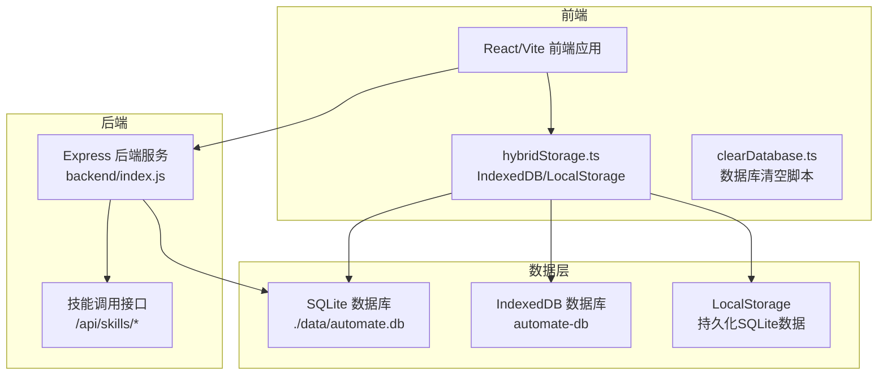
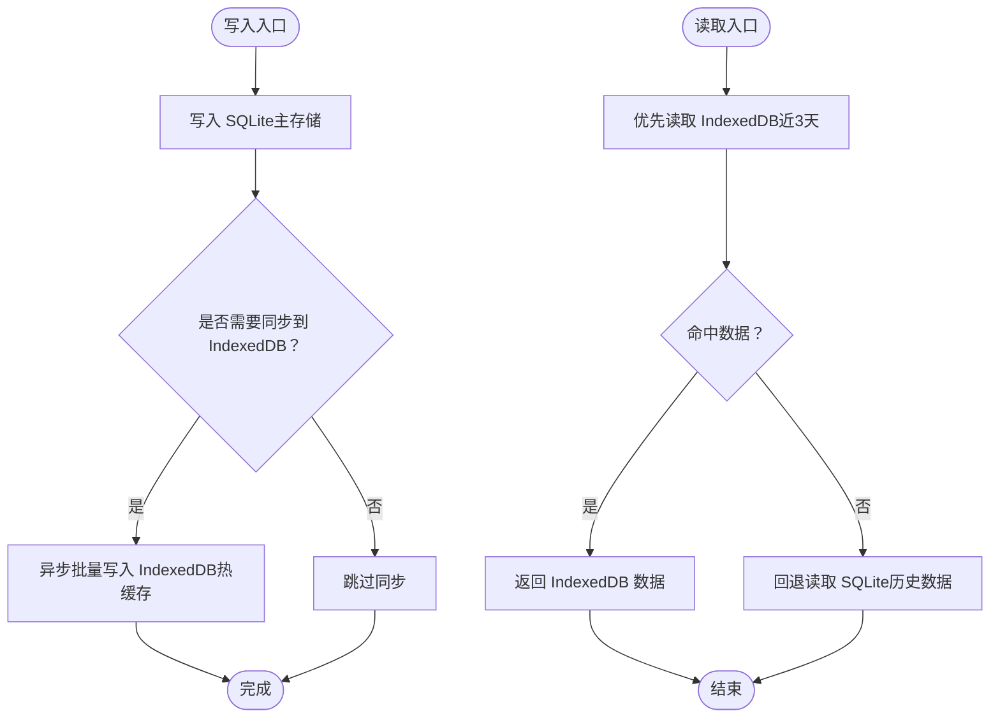
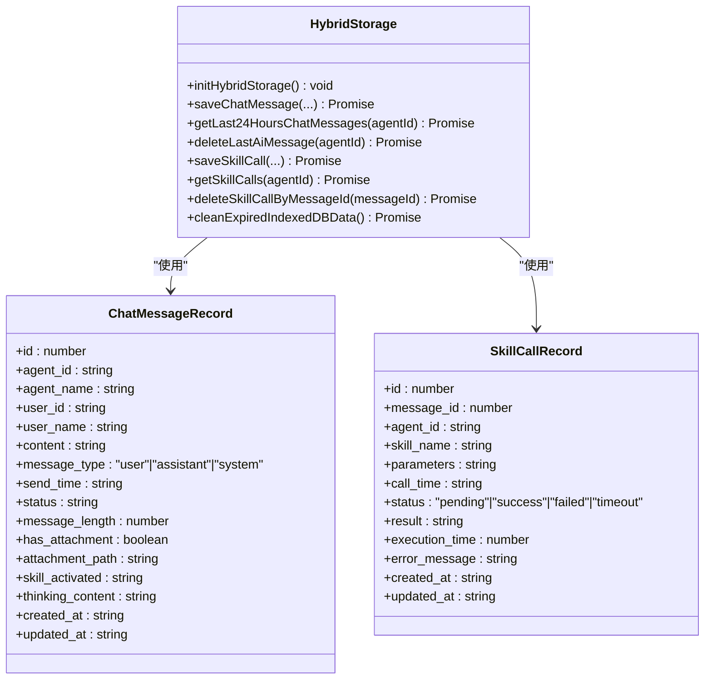
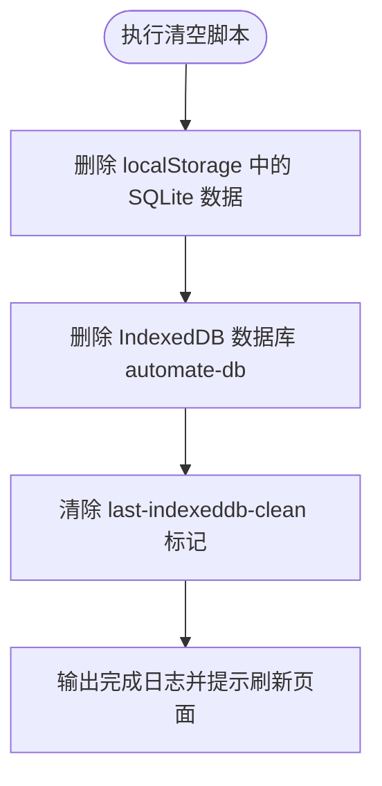
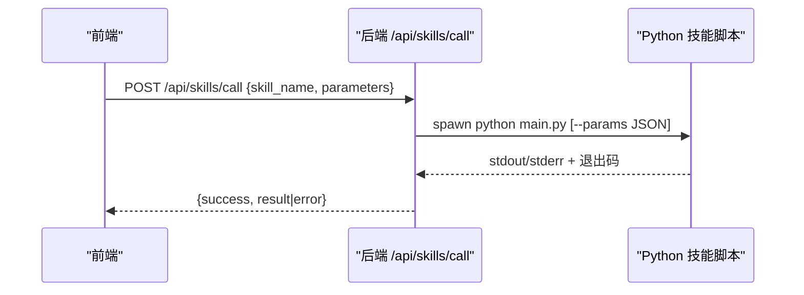
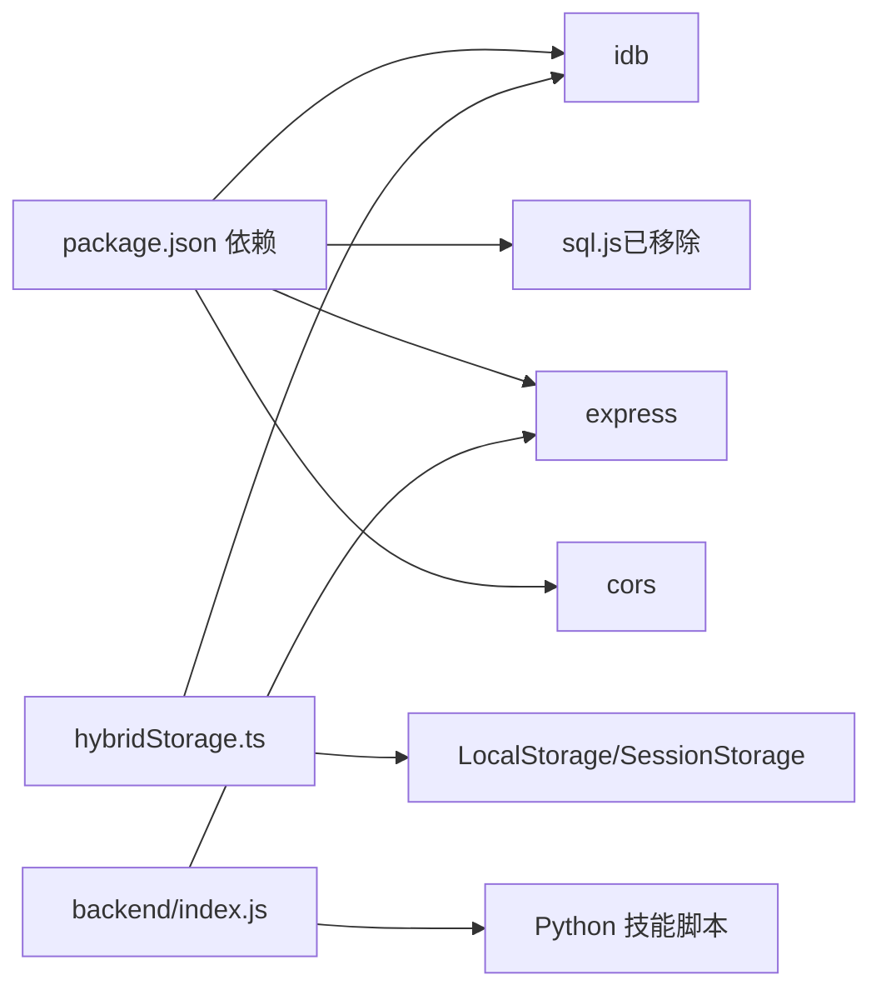

# 备份与恢复

<cite>
**本文引用的文件**
- [hybridStorage.ts](file://src/services/hybridStorage.ts)
- [clearDatabase.ts](file://src/scripts/clearDatabase.ts)
- [数据库设计.md](file://docs/数据层设计/数据库设计.md)
- [数据库安全验证报告.md](file://docs/数据层设计/数据库安全验证报告.md)
- [index.js](file://backend/index.js)
- [package.json](file://package.json)
- [修复sql.js加载错误计划.md](file://.trae/documents/修复sql.js加载错误计划.md)
</cite>

## 目录
1. [简介](#简介)
2. [项目结构](#项目结构)
3. [核心组件](#核心组件)
4. [架构总览](#架构总览)
5. [详细组件分析](#详细组件分析)
6. [依赖关系分析](#依赖关系分析)
7. [性能考量](#性能考量)
8. [故障排查指南](#故障排查指南)
9. [结论](#结论)
10. [附录](#附录)

## 简介
本文件面向AutoMate项目的备份与恢复策略，围绕混合存储系统（SQLite + IndexedDB）构建完整的备份方案、恢复流程与灾难恢复计划。内容涵盖：
- 数据备份方案与存储位置管理
- 备份频率与触发机制
- 数据完整性验证与备份验证流程
- 灾难恢复计划、数据恢复步骤与故障应急处理
- 备份脚本使用方法、自动备份配置与监控告警建议
- 恢复测试流程、数据一致性检查与恢复验证方法

## 项目结构
AutoMate采用前端React/Vite + 后端Node/Express的双端架构，数据层采用SQLite（主存储/冷数据）与IndexedDB（热缓存）混合存储策略。前端通过hybridStorage.ts统一管理本地数据持久化与清理；后端提供技能调用服务；数据库设计与安全策略由文档集中定义。

图表来源
- [hybridStorage.ts](file://src/services/hybridStorage.ts#L1-L262)
- [clearDatabase.ts](file://src/scripts/clearDatabase.ts#L1-L41)
- [index.js](file://backend/index.js#L1-L117)
- [数据库设计.md](file://docs/数据层设计/数据库设计.md#L1-L738)

章节来源
- [hybridStorage.ts](file://src/services/hybridStorage.ts#L1-L262)
- [clearDatabase.ts](file://src/scripts/clearDatabase.ts#L1-L41)
- [index.js](file://backend/index.js#L1-L117)
- [数据库设计.md](file://docs/数据层设计/数据库设计.md#L1-L738)

## 核心组件
- 混合存储服务：负责IndexedDB初始化、消息与技能调用的读写、过期数据清理与每日检查。
- 数据库清空脚本：一键清空SQLite与IndexedDB数据，辅助恢复与调试。
- 后端技能服务：提供技能调用接口，支撑数据产生与恢复验证。
- 数据库设计与安全：定义SQLite表结构、索引、事务、加密与访问控制策略。

章节来源
- [hybridStorage.ts](file://src/services/hybridStorage.ts#L1-L262)
- [clearDatabase.ts](file://src/scripts/clearDatabase.ts#L1-L41)
- [index.js](file://backend/index.js#L1-L117)
- [数据库设计.md](file://docs/数据层设计/数据库设计.md#L1-L738)

## 架构总览
混合存储架构将“历史数据”与“热数据”分离：
- 历史数据（冷数据）：永久存储于SQLite，适合长期保留与跨会话检索。
- 热数据（近期数据）：缓存在IndexedDB，保留最近3天，提升读写性能。
- 用户配置与会话状态：使用LocalStorage与SessionStorage，满足不同生命周期需求。

图表来源
- [hybridStorage.ts](file://src/services/hybridStorage.ts#L89-L127)
- [数据库设计.md](file://docs/数据层设计/数据库设计.md#L597-L728)

## 详细组件分析

### 混合存储服务（hybridStorage.ts）
- 数据模型与索引：定义聊天消息与技能调用的数据结构，并在IndexedDB中建立多维索引以支持高效查询。
- 初始化与升级：首次打开数据库时创建对象仓库与索引。
- 过期清理：每日检查并清理超过3天的历史消息与技能调用记录，减少IndexedDB膨胀。
- 读写接口：提供消息保存、最近24小时消息查询、AI消息删除、技能调用保存与查询等接口。
- 初始化入口：提供初始化函数，确保数据库可用。

图表来源
- [hybridStorage.ts](file://src/services/hybridStorage.ts#L5-L59)

章节来源
- [hybridStorage.ts](file://src/services/hybridStorage.ts#L1-L262)

### 数据库清空脚本（clearDatabase.ts）
- 功能：清空LocalStorage中的SQLite数据、删除IndexedDB数据库、清除清理标记，便于完全重置环境。
- 使用场景：开发调试、恢复出厂设置、紧急故障处理后的重建。

图表来源
- [clearDatabase.ts](file://src/scripts/clearDatabase.ts#L4-L34)

章节来源
- [clearDatabase.ts](file://src/scripts/clearDatabase.ts#L1-L41)

### 后端技能服务（backend/index.js）
- 提供技能调用接口，支持参数传递与标准输出/错误输出解析。
- 用于验证数据产生与恢复后的功能一致性。

图表来源
- [index.js](file://backend/index.js#L19-L79)

章节来源
- [index.js](file://backend/index.js#L1-L117)

### 数据库设计与安全（文档）
- 数据库类型与文件路径：SQLite 3.40.0+，数据库文件位于 ./data/automate.db。
- 表结构与索引：聊天消息、技能调用、智能体状态、文件附件等表及相应索引。
- 事务与性能：WAL模式、同步模式、缓存大小、VACUUM/ANALYZE维护。
- 混合存储策略：SQLite为主存储，IndexedDB为热缓存，3天热数据淘汰。
- 安全与加密：SQLCipher加密、文件权限设置、访问控制与审计日志。

章节来源
- [数据库设计.md](file://docs/数据层设计/数据库设计.md#L1-L738)
- [数据库安全验证报告.md](file://docs/数据层设计/数据库安全验证报告.md#L1-L82)

## 依赖关系分析
- 前端依赖：idb（IndexedDB封装）、sql.js（早期依赖，已通过纯IndexedDB方案替代）。
- 后端依赖：express、cors、child_process（调用Python技能脚本）。
- 混合存储依赖：IndexedDB与LocalStorage，实现热数据与配置数据的持久化。

图表来源
- [package.json](file://package.json#L15-L26)
- [hybridStorage.ts](file://src/services/hybridStorage.ts#L1-L1)
- [index.js](file://backend/index.js#L1-L9)

章节来源
- [package.json](file://package.json#L1-L47)
- [hybridStorage.ts](file://src/services/hybridStorage.ts#L1-L262)
- [index.js](file://backend/index.js#L1-L117)

## 性能考量
- 热数据保留窗口：仅保留最近3天，降低IndexedDB体积与查询成本。
- 索引优化：为高频查询字段建立单列与复合索引，减少全表扫描。
- 维护操作：定期执行VACUUM与ANALYZE，保持数据库健康状态。
- 并发与一致性：WAL模式提升并发读写性能，事务保证写入原子性。

章节来源
- [hybridStorage.ts](file://src/services/hybridStorage.ts#L3-L127)
- [数据库设计.md](file://docs/数据层设计/数据库设计.md#L266-L516)

## 故障排查指南
- IndexedDB加载错误：sql.js Wasm加载问题导致的TypeError。解决方案为纯IndexedDB方案，移除sql.js依赖并使用LocalStorage持久化。
- 数据丢失或损坏：使用清空脚本重置后，通过混合存储策略从SQLite恢复历史数据。
- 技能调用失败：检查后端日志与Python脚本输出，确认参数传递与环境配置。

章节来源
- [修复sql.js加载错误计划.md](file://.trae/documents/修复sql.js加载错误计划.md#L1-L34)
- [clearDatabase.ts](file://src/scripts/clearDatabase.ts#L1-L41)
- [index.js](file://backend/index.js#L19-L79)

## 结论
AutoMate的备份与恢复策略以“SQLite主存储 + IndexedDB热缓存”为核心，结合定期清理与索引优化，实现高性能与高可靠性的数据管理。通过文档化的安全策略与可验证的恢复流程，能够有效应对数据丢失、系统故障与灾难场景，保障业务连续性。

## 附录

### A. 备份与恢复策略清单
- 备份方案
  - SQLite数据库文件备份：周期性复制 ./data/automate.db 至安全位置。
  - IndexedDB数据备份：将automate-db数据库导出为可移植格式（如JSON），并持久化至LocalStorage或外部存储。
  - 用户配置与会话状态：备份LocalStorage与SessionStorage关键键值。
- 存储位置管理
  - 本地备份：使用受控目录存放备份文件，设置访问权限（如0o700）。
  - 远程备份：将备份文件加密后上传至安全云存储或NAS。
- 备份频率
  - 实时/准实时：关键写入完成后触发增量备份。
  - 每日：全量备份与数据库维护（VACUUM/ANALYZE）。
  - 每周：交叉验证与异地容灾演练。
- 数据完整性验证
  - 校验和：对备份文件计算哈希，对比恢复后文件哈希。
  - 结构验证：检查表结构与索引是否存在。
  - 业务验证：随机抽样消息与技能调用，核对内容与时间戳。
- 备份验证流程
  - 自动化脚本：执行备份、恢复、验证三步流程，记录日志与结果。
  - 人工巡检：定期抽查备份文件可用性与完整性。
- 灾难恢复计划
  - 快速恢复：优先恢复SQLite主数据库，再重建IndexedDB热缓存。
  - 逐步恢复：先恢复关键表，再恢复索引与配置。
  - 回滚策略：记录备份时间点，必要时回滚到最近一次健康状态。
- 数据恢复步骤
  - 停止服务：避免写入冲突。
  - 恢复SQLite：替换或覆盖 ./data/automate.db。
  - 重建IndexedDB：从SQLite导入最近3天数据。
  - 启动服务：验证功能与数据一致性。
- 故障应急处理
  - 紧急清空：使用清空脚本重置环境，快速止损。
  - 日志定位：检查前端与后端日志，定位异常原因。
  - 回滚恢复：依据备份时间点进行回滚与验证。
- 备份脚本使用方法
  - 手动备份：复制数据库文件与IndexedDB导出数据。
  - 自动备份：定时任务执行备份脚本，推送告警。
- 自动备份配置
  - 定时器：使用系统计划任务或容器内定时器。
  - 触发器：写入完成后触发增量备份。
  - 存储：本地+远程双备份，启用压缩与加密。
- 备份监控告警
  - 健康检查：监控备份文件大小、时间戳、哈希变化。
  - 失败告警：备份失败、恢复失败、完整性校验失败均需告警。
- 恢复测试流程
  - 环境准备：准备隔离测试环境。
  - 数据注入：模拟生产数据，执行恢复。
  - 一致性检查：比对消息数量、索引完整性、关键字段。
  - 功能验证：调用技能接口，验证消息与调用记录。
- 恢复验证方法
  - 结构校验：执行数据库结构与索引检查。
  - 业务校验：随机抽样消息与技能调用，核对时间线与内容。
  - 性能回归：执行典型查询，评估索引与性能指标。

章节来源
- [数据库设计.md](file://docs/数据层设计/数据库设计.md#L487-L516)
- [数据库安全验证报告.md](file://docs/数据层设计/数据库安全验证报告.md#L53-L82)
- [clearDatabase.ts](file://src/scripts/clearDatabase.ts#L1-L41)
- [index.js](file://backend/index.js#L81-L111)