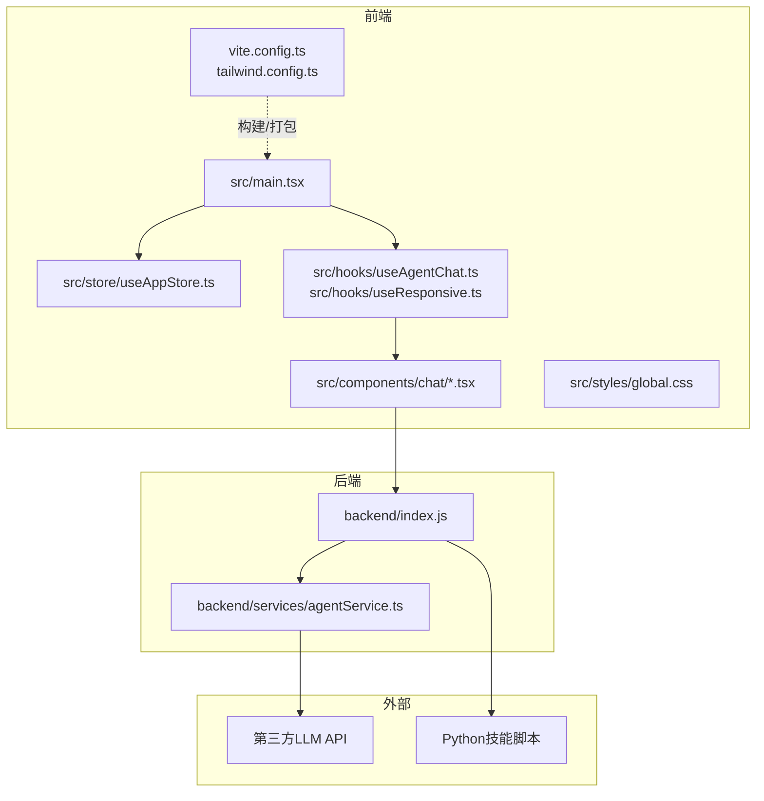
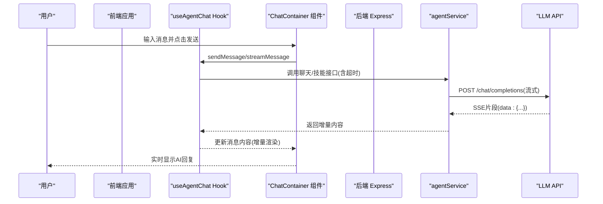
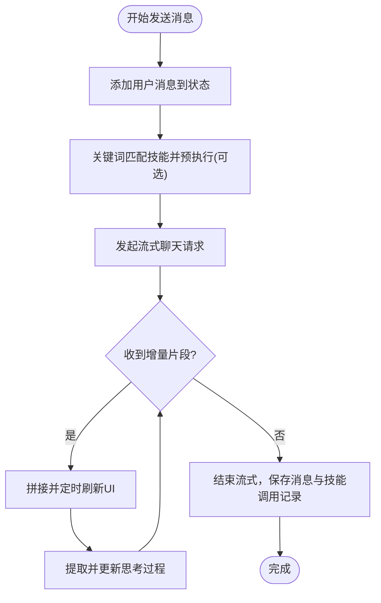
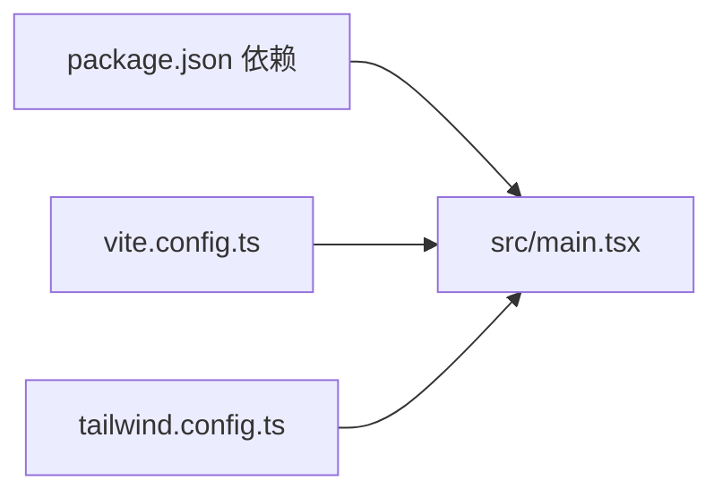

# 性能优化

<cite>
**本文引用的文件**
- [package.json](file://package.json)
- [vite.config.ts](file://vite.config.ts)
- [tailwind.config.ts](file://tailwind.config.ts)
- [backend/index.js](file://backend/index.js)
- [backend/services/agentService.ts](file://backend/services/agentService.ts)
- [src/main.tsx](file://src/main.tsx)
- [src/store/useAppStore.ts](file://src/store/useAppStore.ts)
- [src/hooks/useAgentChat.ts](file://src/hooks/useAgentChat.ts)
- [src/hooks/useResponsive.ts](file://src/hooks/useResponsive.ts)
- [src/components/chat/ChatContainer.tsx](file://src/components/chat/ChatContainer.tsx)
- [src/components/chat/EnhancedMessageBubble.tsx](file://src/components/chat/EnhancedMessageBubble.tsx)
- [src/styles/global.css](file://src/styles/global.css)
- [src/types/chat.ts](file://src/types/chat.ts)
- [docs/非功能设计/性能设计.md](file://docs/非功能设计/性能设计.md)
</cite>

## 目录
1. [简介](#简介)
2. [项目结构](#项目结构)
3. [核心组件](#核心组件)
4. [架构总览](#架构总览)
5. [详细组件分析](#详细组件分析)
6. [依赖关系分析](#依赖关系分析)
7. [性能考量与优化策略](#性能考量与优化策略)
8. [故障排查指南](#故障排查指南)
9. [结论](#结论)
10. [附录](#附录)

## 简介
本指南面向AutoMate项目，系统化梳理前端与后端性能优化路径，覆盖性能瓶颈识别、性能测试方法、优化策略、缓存与CDN、监控与回归检测、构建与代码分割、懒加载等关键主题。文档以仓库现有实现为基础，结合性能设计文档中的指标与方案，给出可落地的改进建议。

## 项目结构
AutoMate采用前后端分离架构：
- 前端基于React + TypeScript，使用Vite进行开发与构建；Tailwind用于样式；Zustand管理全局状态；Axios与原生fetch用于网络请求。
- 后端基于Node.js + Express，提供技能调用代理与基础API；技能执行通过子进程调用Python脚本。
- 文档中提供了明确的性能指标与优化方案，指导前端渲染、内存、网络与数据库优化。

**图表来源**
- [src/main.tsx](file://src/main.tsx#L1-L12)
- [vite.config.ts](file://vite.config.ts#L1-L47)
- [tailwind.config.ts](file://tailwind.config.ts#L1-L161)
- [backend/index.js](file://backend/index.js#L1-L117)
- [backend/services/agentService.ts](file://backend/services/agentService.ts#L1-L245)

**章节来源**
- [package.json](file://package.json#L1-L47)
- [vite.config.ts](file://vite.config.ts#L1-L47)
- [tailwind.config.ts](file://tailwind.config.ts#L1-L161)
- [backend/index.js](file://backend/index.js#L1-L117)
- [backend/services/agentService.ts](file://backend/services/agentService.ts#L1-L245)
- [src/main.tsx](file://src/main.tsx#L1-L12)
- [src/store/useAppStore.ts](file://src/store/useAppStore.ts#L1-L306)
- [src/hooks/useAgentChat.ts](file://src/hooks/useAgentChat.ts#L1-L128)
- [src/hooks/useResponsive.ts](file://src/hooks/useResponsive.ts#L1-L110)
- [src/components/chat/ChatContainer.tsx](file://src/components/chat/ChatContainer.tsx#L1-L756)
- [src/components/chat/EnhancedMessageBubble.tsx](file://src/components/chat/EnhancedMessageBubble.tsx#L1-L217)
- [src/styles/global.css](file://src/styles/global.css#L1-L664)
- [src/types/chat.ts](file://src/types/chat.ts#L1-L280)
- [docs/非功能设计/性能设计.md](file://docs/非功能设计/性能设计.md#L1-L292)

## 核心组件
- 构建与打包：Vite配置启用别名、代理、代码分割与产物目录，支持Source Map便于调试。
- 样式与主题：Tailwind配置主题变量、动画与断点，CSS中定义过渡与动画常量，统一视觉反馈。
- 状态管理：Zustand Store集中管理聊天状态、用户设置、主题与全局状态，避免重复渲染。
- 聊天与流式响应：前端通过fetch流式读取LLM响应，支持增量渲染与“思考过程”展示；后端封装代理与超时控制。
- 技能执行：后端通过子进程调用Python脚本执行技能，前端在发送前可按关键词预执行技能并注入上下文。
- 响应式与断点：自定义Hook提供断点、媒体查询、视口尺寸监听，辅助移动端体验优化。

**章节来源**
- [vite.config.ts](file://vite.config.ts#L1-L47)
- [tailwind.config.ts](file://tailwind.config.ts#L1-L161)
- [src/store/useAppStore.ts](file://src/store/useAppStore.ts#L1-L306)
- [src/hooks/useAgentChat.ts](file://src/hooks/useAgentChat.ts#L1-L128)
- [src/types/chat.ts](file://src/types/chat.ts#L96-L189)
- [backend/index.js](file://backend/index.js#L19-L79)
- [src/hooks/useResponsive.ts](file://src/hooks/useResponsive.ts#L1-L110)

## 架构总览
前端通过Vite开发服务器与代理访问后端API；后端Express提供技能调用与代理转发；LLM API与Python技能脚本构成外部依赖。聊天流程采用流式响应，前端增量更新UI，后端负责超时与错误处理。

**图表来源**
- [src/hooks/useAgentChat.ts](file://src/hooks/useAgentChat.ts#L51-L82)
- [src/components/chat/ChatContainer.tsx](file://src/components/chat/ChatContainer.tsx#L240-L392)
- [src/types/chat.ts](file://src/types/chat.ts#L96-L189)
- [backend/services/agentService.ts](file://backend/services/agentService.ts#L118-L185)

## 详细组件分析

### 前端渲染与状态管理
- 渲染优化要点
  - 使用Zustand集中状态，避免深层组件重渲染；对消息数组采用不可变更新策略，减少无关组件刷新。
  - 增量更新：流式响应时按块更新，降低单次渲染开销。
  - 动画与过渡：通过Tailwind变量与CSS动画，统一过渡时间，避免过长动画影响首屏与交互响应。
- 关键实现位置
  - 状态更新与消息追加：[useAppStore.ts](file://src/store/useAppStore.ts#L143-L165)
  - 流式渲染与定时刷新：[ChatContainer.tsx](file://src/components/chat/ChatContainer.tsx#L279-L312)
  - Markdown渲染与代码块样式：[EnhancedMessageBubble.tsx](file://src/components/chat/EnhancedMessageBubble.tsx#L162-L189)

**图表来源**
- [src/components/chat/ChatContainer.tsx](file://src/components/chat/ChatContainer.tsx#L240-L392)
- [src/hooks/useAgentChat.ts](file://src/hooks/useAgentChat.ts#L84-L119)
- [src/types/chat.ts](file://src/types/chat.ts#L96-L189)

**章节来源**
- [src/store/useAppStore.ts](file://src/store/useAppStore.ts#L143-L165)
- [src/components/chat/ChatContainer.tsx](file://src/components/chat/ChatContainer.tsx#L279-L312)
- [src/components/chat/EnhancedMessageBubble.tsx](file://src/components/chat/EnhancedMessageBubble.tsx#L162-L189)

### 网络与代理
- 代理与跨域
  - Vite开发服务器配置代理，将特定路径转发至后端或第三方API，减少跨域与CORS问题。
- 请求与超时
  - 前端对LLM请求设置合理超时；后端封装代理与错误处理，保证稳定性。
- 关键实现位置
  - 代理配置：[vite.config.ts](file://vite.config.ts#L18-L29)
  - 流式请求与超时：[src/types/chat.ts](file://src/types/chat.ts#L116-L129)
  - 后端技能调用与超时：[backend/services/agentService.ts](file://backend/services/agentService.ts#L149-L149)

**章节来源**
- [vite.config.ts](file://vite.config.ts#L18-L29)
- [src/types/chat.ts](file://src/types/chat.ts#L116-L129)
- [backend/services/agentService.ts](file://backend/services/agentService.ts#L149-L149)

### 后端服务与技能执行
- 子进程执行Python技能脚本，标准输出/错误收集与退出码判断，确保健壮性。
- 关键实现位置
  - 子进程调用与输出处理：[backend/index.js](file://backend/index.js#L19-L79)
  - 技能描述加载与系统提示构建：[backend/services/agentService.ts](file://backend/services/agentService.ts#L80-L116)

**章节来源**
- [backend/index.js](file://backend/index.js#L19-L79)
- [backend/services/agentService.ts](file://backend/services/agentService.ts#L80-L116)

### 样式与主题
- Tailwind主题变量与动画配置，统一颜色、字体、圆角与过渡时间，提升一致性与可维护性。
- CSS中定义过渡与动画常量，便于在组件中复用。
- 关键实现位置
  - 主题与动画配置：[tailwind.config.ts](file://tailwind.config.ts#L9-L108)
  - 动画类与过渡常量：[src/styles/global.css](file://src/styles/global.css#L287-L314)

**章节来源**
- [tailwind.config.ts](file://tailwind.config.ts#L9-L108)
- [src/styles/global.css](file://src/styles/global.css#L287-L314)

## 依赖关系分析
- 前端依赖
  - React生态与工具链：React、React DOM、React Router、Zustand、Lucide React、React Markdown、Axios、Tailwind等。
  - 构建工具：Vite、TypeScript、PostCSS、Tailwind CSS。
- 后端依赖
  - Express、CORS、Axios、子进程调用Python脚本。
- 关键依赖位置
  - 依赖声明与脚本：[package.json](file://package.json#L15-L44)
  - 构建配置与代码分割：[vite.config.ts](file://vite.config.ts#L32-L44)

**图表来源**
- [package.json](file://package.json#L15-L44)
- [vite.config.ts](file://vite.config.ts#L1-L47)
- [tailwind.config.ts](file://tailwind.config.ts#L1-L161)
- [src/main.tsx](file://src/main.tsx#L1-L12)

**章节来源**
- [package.json](file://package.json#L15-L44)
- [vite.config.ts](file://vite.config.ts#L1-L47)
- [tailwind.config.ts](file://tailwind.config.ts#L1-L161)
- [src/main.tsx](file://src/main.tsx#L1-L12)

## 性能考量与优化策略

### 前端性能优化
- 启动与首屏
  - 目标：应用启动时间 < 3秒，首屏渲染时间 < 1秒，资源加载时间 < 2秒。
  - 建议：利用Vite的代码分割与动态导入；延迟加载非关键资源；预加载关键字体与图标。
  - 参考：[性能设计.md](file://docs/非功能设计/性能设计.md#L7-L13)
- 界面响应
  - 目标：界面操作响应时间 < 300ms，按钮点击响应时间 < 100ms。
  - 建议：使用React.memo/useCallback/useMemo减少重渲染；避免在渲染阶段做昂贵计算。
  - 参考：[性能设计.md](file://docs/非功能设计/性能设计.md#L15-L21)
- 渲染优化
  - 目标：消息发送延迟 < 500ms，聊天记录加载时间（100条） < 500ms。
  - 建议：长列表采用虚拟滚动；消息气泡组件按需渲染；增量更新UI。
  - 参考：[性能设计.md](file://docs/非功能设计/性能设计.md#L23-L29)
- 内存与对象池
  - 建议：及时清理事件监听与定时器；避免闭包持有大对象；对频繁创建的对象使用对象池思想。
  - 参考：[性能设计.md](file://docs/非功能设计/性能设计.md#L136-L152)
- 网络与缓存
  - 建议：启用HTTP缓存与压缩；CDN加速静态资源；合并请求与减少请求数。
  - 参考：[性能设计.md](file://docs/非功能设计/性能设计.md#L154-L172)
- 构建与代码分割
  - 现状：已配置manualChunks按依赖库拆分。
  - 建议：按路由拆分；对第三方库进行二次拆分；开启产物压缩与去重。
  - 参考：[vite.config.ts](file://vite.config.ts#L37-L42)

**章节来源**
- [docs/非功能设计/性能设计.md](file://docs/非功能设计/性能设计.md#L7-L13)
- [docs/非功能设计/性能设计.md](file://docs/非功能设计/性能设计.md#L15-L21)
- [docs/非功能设计/性能设计.md](file://docs/非功能设计/性能设计.md#L23-L29)
- [docs/非功能设计/性能设计.md](file://docs/非功能设计/性能设计.md#L136-L152)
- [docs/非功能设计/性能设计.md](file://docs/非功能设计/性能设计.md#L154-L172)
- [vite.config.ts](file://vite.config.ts#L37-L42)

### 后端性能调优
- 技能执行与代理
  - 建议：对技能执行结果进行缓存；对频繁调用的技能进行预热；限制并发执行数量。
  - 参考：[backend/index.js](file://backend/index.js#L19-L79)
- LLM调用
  - 建议：设置合理的超时与重试；对慢响应接口增加降级策略；聚合相似请求。
  - 参考：[backend/services/agentService.ts](file://backend/services/agentService.ts#L149-L149)
- 数据库与存储
  - 建议：为常用查询字段建立索引；使用连接池；批量写入与分页查询。
  - 参考：[性能设计.md](file://docs/非功能设计/性能设计.md#L116-L135)

**章节来源**
- [backend/index.js](file://backend/index.js#L19-L79)
- [backend/services/agentService.ts](file://backend/services/agentService.ts#L149-L149)
- [docs/非功能设计/性能设计.md](file://docs/非功能设计/性能设计.md#L116-L135)

### 缓存策略与CDN
- 前端缓存
  - 建议：内存缓存常用技能描述；本地持久化缓存配置；对图片与字体使用浏览器缓存。
  - 参考：[性能设计.md](file://docs/非功能设计/性能设计.md#L104-L108)
- CDN
  - 建议：静态资源走CDN；对第三方API通过代理缓存热点数据。
  - 参考：[性能设计.md](file://docs/非功能设计/性能设计.md#L159-L160)

**章节来源**
- [docs/非功能设计/性能设计.md](file://docs/非功能设计/性能设计.md#L104-L108)
- [docs/非功能设计/性能设计.md](file://docs/非功能设计/性能设计.md#L159-L160)

### 性能监控与测试
- 监控指标
  - 前端：使用Performance API采集导航与渲染时间；React DevTools Profiler分析组件渲染。
  - 后端：记录函数执行时间与错误日志。
  - 参考：[性能设计.md](file://docs/非功能设计/性能设计.md#L174-L201)
- 测试方法
  - 前端：Lighthouse、WebPageTest、Chrome DevTools。
  - 后端：Locust、Apache Bench、JMeter。
  - 参考：[性能设计.md](file://docs/非功能设计/性能设计.md#L231-L246)
- 基准与回归
  - 建议：建立自动化基准测试流水线；对关键指标设置阈值告警。
  - 参考：[性能设计.md](file://docs/非功能设计/性能设计.md#L217-L229)

**章节来源**
- [docs/非功能设计/性能设计.md](file://docs/非功能设计/性能设计.md#L174-L201)
- [docs/非功能设计/性能设计.md](file://docs/非功能设计/性能设计.md#L231-L246)
- [docs/非功能设计/性能设计.md](file://docs/非功能设计/性能设计.md#L217-L229)

### 构建优化、代码分割与懒加载
- 代码分割
  - 现状：按vendor库拆分。
  - 建议：按路由拆分；对大型组件使用动态导入；启用Tree Shaking。
  - 参考：[vite.config.ts](file://vite.config.ts#L37-L42)
- 懒加载
  - 建议：对非关键页面与组件使用React.lazy + Suspense；对图片与富文本内容懒加载。
  - 参考：[性能设计.md](file://docs/非功能设计/性能设计.md#L83-L94)

**章节来源**
- [vite.config.ts](file://vite.config.ts#L37-L42)
- [docs/非功能设计/性能设计.md](file://docs/非功能设计/性能设计.md#L83-L94)

## 故障排查指南
- 常见问题定位
  - 流式响应卡顿：检查前端增量刷新频率与渲染开销；确认后端SSE是否稳定。
  - 技能执行失败：查看子进程输出与错误码；确认Python脚本路径与参数。
  - LLM超时：调整超时时间与重试策略；检查代理配置与网络连通性。
- 日志与追踪
  - 前端：在消息发送与流式更新处增加日志；捕获Axios错误信息。
  - 后端：记录技能执行耗时、退出码与错误输出。
- 参考实现位置
  - 子进程错误处理与输出：[backend/index.js](file://backend/index.js#L71-L77)
  - Axios错误分支：[backend/services/agentService.ts](file://backend/services/agentService.ts#L161-L184)

**章节来源**
- [backend/index.js](file://backend/index.js#L71-L77)
- [backend/services/agentService.ts](file://backend/services/agentService.ts#L161-L184)

## 结论
AutoMate在前端构建、状态管理与流式渲染方面具备良好基础；后端通过代理与子进程执行提升了灵活性。结合性能设计文档的目标与方案，建议优先落实代码分割、缓存策略、网络优化与监控体系，持续迭代以达成更优的用户体验与工程效率。

## 附录
- 性能指标对照表（节选）
  - 应用启动时间 < 3秒，首屏渲染时间 < 1秒，资源加载时间 < 2秒
  - 界面操作响应时间 < 300ms，按钮点击响应时间 < 100ms
  - 消息发送延迟 < 500ms，聊天记录加载时间（100条） < 500ms
  - 数据库查询/写入/批量操作响应时间 < 100ms/<50ms/<500ms
- 参考资源
  - Web性能优化指南、React性能优化、Python性能优化

**章节来源**
- [docs/非功能设计/性能设计.md](file://docs/非功能设计/性能设计.md#L5-L46)
- [docs/非功能设计/性能设计.md](file://docs/非功能设计/性能设计.md#L287-L292)