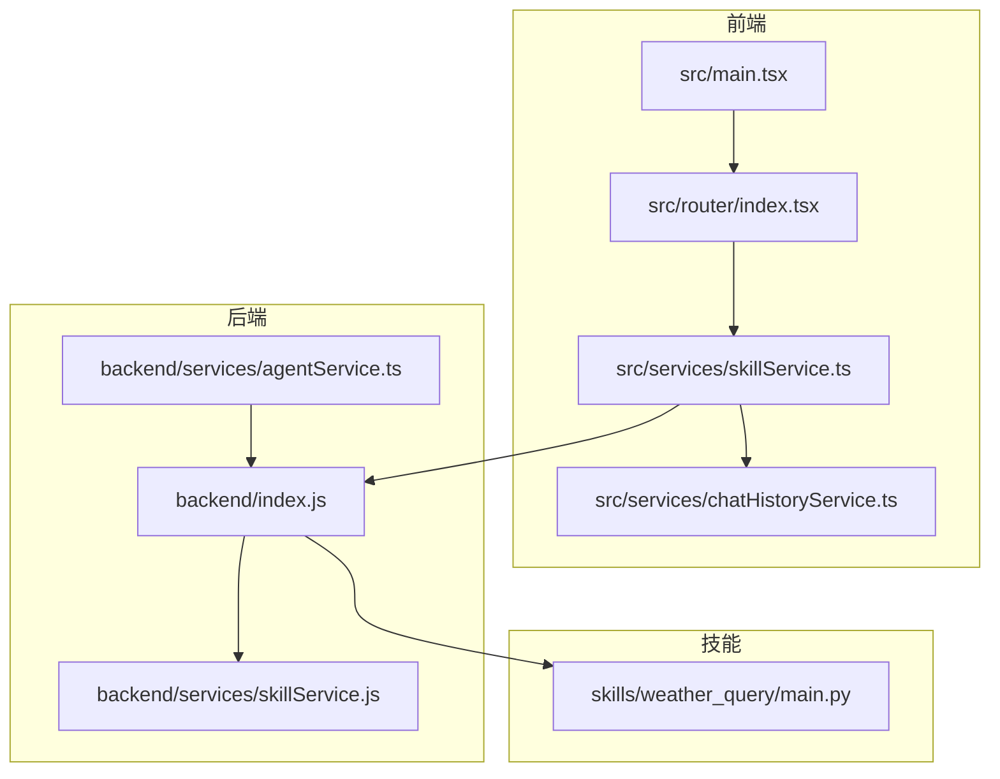
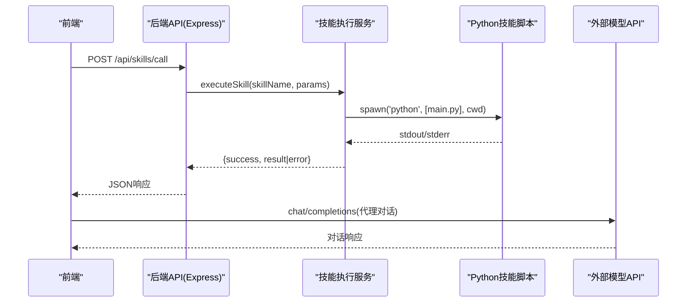
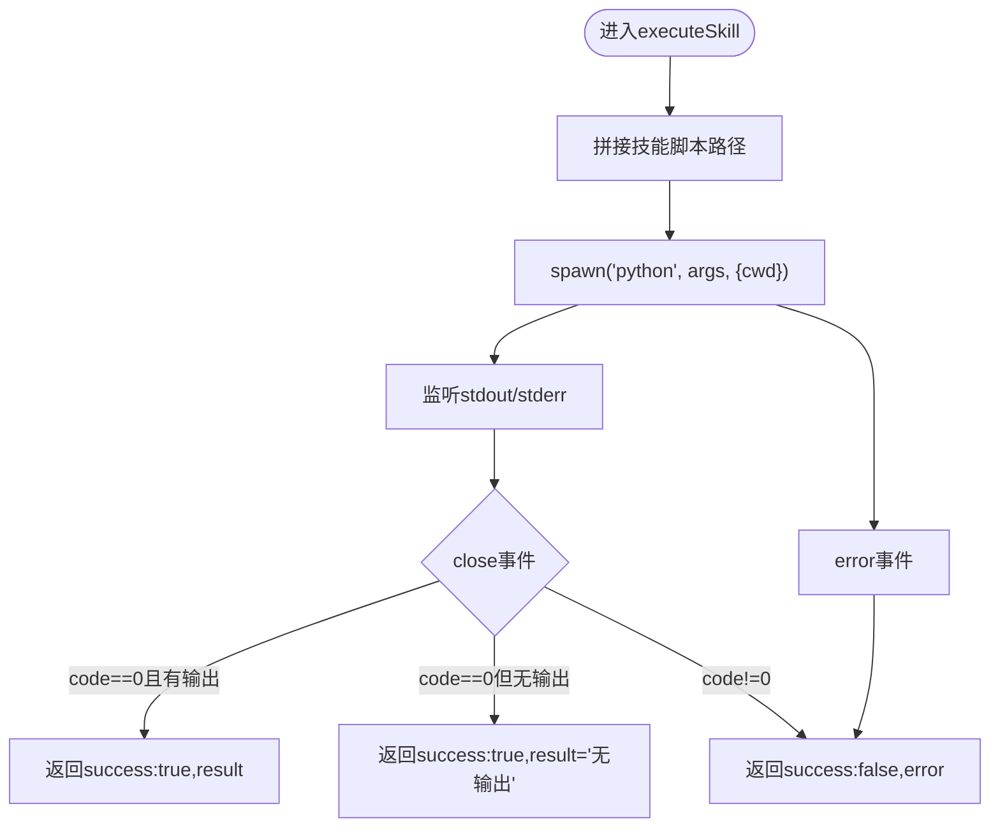
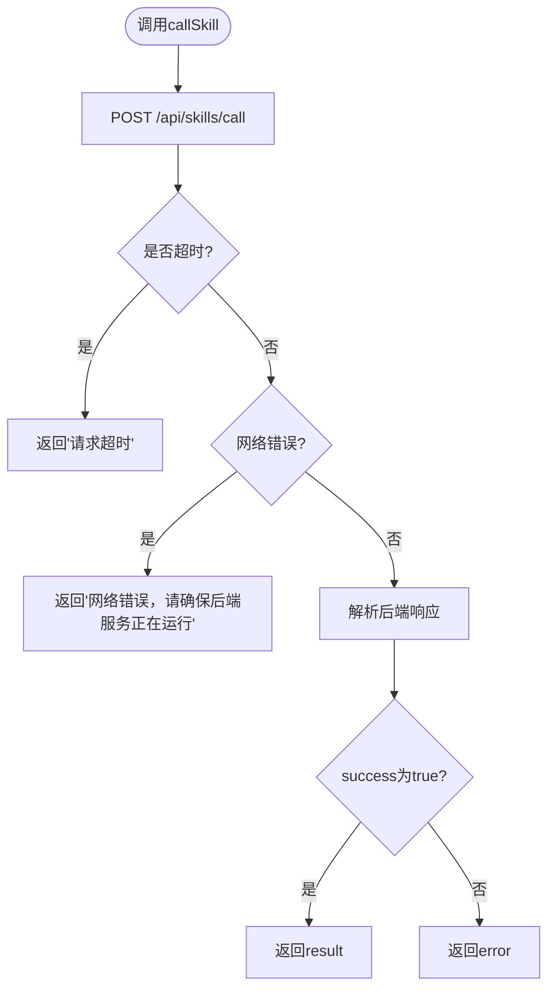
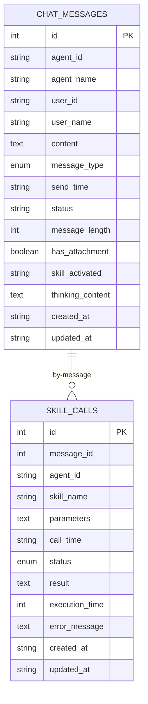
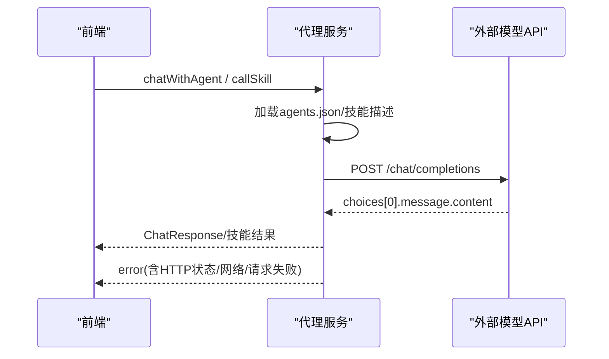
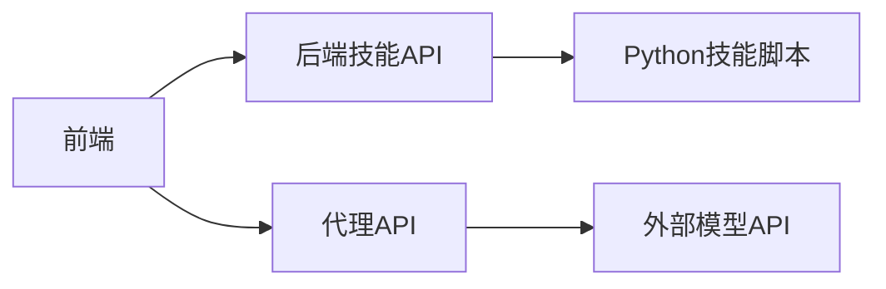
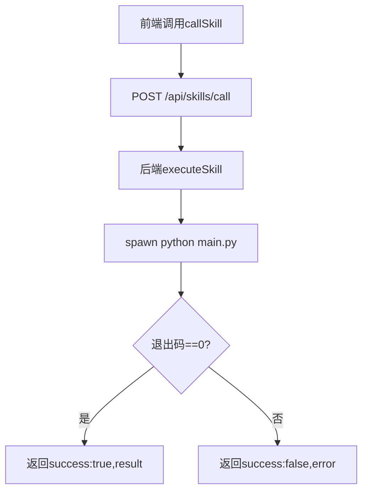

# 故障排查

<cite>
**本文引用的文件**
- [backend/index.js](file://backend/index.js)
- [backend/services/skillService.js](file://backend/services/skillService.js)
- [backend/services/agentService.ts](file://backend/services/agentService.ts)
- [src/services/skillService.ts](file://src/services/skillService.ts)
- [src/services/chatHistoryService.ts](file://src/services/chatHistoryService.ts)
- [src/router/index.tsx](file://src/router/index.tsx)
- [src/main.tsx](file://src/main.tsx)
- [package.json](file://package.json)
- [config/agents.json](file://config/agents.json)
- [skills/weather_query/main.py](file://skills/weather_query/main.py)
- [docs/基础规范/编码规范.md](file://docs/基础规范/编码规范.md)
- [docs/非功能设计/可维护性设计.md](file://docs/非功能设计/可维护性设计.md)
- [OpenSkills-main/openskills/sandbox/logger.py](file://OpenSkills-main/openskills/sandbox/logger.py)
</cite>

## 目录
1. [简介](#简介)
2. [项目结构](#项目结构)
3. [核心组件](#核心组件)
4. [架构总览](#架构总览)
5. [详细组件分析](#详细组件分析)
6. [依赖关系分析](#依赖关系分析)
7. [性能考虑](#性能考虑)
8. [故障排查指南](#故障排查指南)
9. [结论](#结论)
10. [附录](#附录)

## 简介
本手册面向AutoMate项目的运维与开发人员，提供系统化的故障排查方法与实践指南。内容覆盖错误分类与代码、日志分析技巧、根因定位方法、性能问题排查、内存泄漏检测、资源耗尽处理、网络连接与API调用失败、技能执行异常排查、调试工具使用、问题复现与修复验证，以及故障预防、风险评估与应急预案。

## 项目结构
AutoMate采用前后端分离架构：前端基于React + Vite，后端基于Node.js + Express，技能执行通过子进程调用Python脚本，聊天与技能调用通过REST API交互；本地历史消息使用IndexedDB持久化。

图表来源
- [src/main.tsx](file://src/main.tsx#L1-L12)
- [src/router/index.tsx](file://src/router/index.tsx#L1-L43)
- [src/services/skillService.ts](file://src/services/skillService.ts#L1-L73)
- [src/services/chatHistoryService.ts](file://src/services/chatHistoryService.ts#L1-L244)
- [backend/index.js](file://backend/index.js#L1-L117)
- [backend/services/skillService.js](file://backend/services/skillService.js#L1-L87)
- [backend/services/agentService.ts](file://backend/services/agentService.ts#L1-L245)
- [skills/weather_query/main.py](file://skills/weather_query/main.py#L1-L139)

章节来源
- [package.json](file://package.json#L1-L47)
- [src/main.tsx](file://src/main.tsx#L1-L12)
- [src/router/index.tsx](file://src/router/index.tsx#L1-L43)

## 核心组件
- 前端路由与入口：负责页面导航与应用初始化。
- 技能服务：封装对后端技能API的调用，统一错误处理与超时控制。
- 后端技能执行：接收前端请求，通过子进程调用对应Python技能脚本，收集stdout/stderr并返回结果。
- 聊天历史服务：基于IndexedDB进行消息与技能调用记录的增删改查与索引查询。
- 代理服务：加载agents.json配置，构建系统提示词，调用外部模型API进行对话与技能执行。

章节来源
- [src/router/index.tsx](file://src/router/index.tsx#L1-L43)
- [src/services/skillService.ts](file://src/services/skillService.ts#L1-L73)
- [backend/index.js](file://backend/index.js#L1-L117)
- [backend/services/skillService.js](file://backend/services/skillService.js#L1-L87)
- [src/services/chatHistoryService.ts](file://src/services/chatHistoryService.ts#L1-L244)
- [backend/services/agentService.ts](file://backend/services/agentService.ts#L1-L245)

## 架构总览
下图展示从前端到后端、再到技能脚本与外部模型API的完整调用链路。

图表来源
- [backend/index.js](file://backend/index.js#L19-L104)
- [backend/services/skillService.js](file://backend/services/skillService.js#L16-L86)
- [skills/weather_query/main.py](file://skills/weather_query/main.py#L116-L139)
- [backend/services/agentService.ts](file://backend/services/agentService.ts#L118-L184)

## 详细组件分析

### 技能服务（后端）
- 功能职责：接收技能调用请求，拼装参数，通过子进程执行对应Python脚本，收集输出与错误，返回统一结构。
- 关键点：
  - 子进程工作目录设置为技能目录，便于脚本内相对路径访问。
  - stdout/stderr分别累积，close事件中根据退出码判断成功/失败。
  - error事件捕获spawn失败场景。
- 典型错误类型：脚本不存在、权限不足、依赖缺失、超时、异常抛出等。

图表来源
- [backend/index.js](file://backend/index.js#L19-L79)
- [backend/services/skillService.js](file://backend/services/skillService.js#L16-L71)

章节来源
- [backend/index.js](file://backend/index.js#L19-L104)
- [backend/services/skillService.js](file://backend/services/skillService.js#L16-L86)

### 技能服务（前端）
- 功能职责：封装对后端技能API的调用，统一超时、网络错误与业务错误处理。
- 关键点：
  - 统一超时时间，区分ECONNABORTED与ERR_NETWORK等错误类别。
  - 对后端返回的error字段进行兜底显示。
- 典型错误类型：后端未启动、网络不通、跨域、请求超时、后端异常。

图表来源
- [src/services/skillService.ts](file://src/services/skillService.ts#L12-L61)

章节来源
- [src/services/skillService.ts](file://src/services/skillService.ts#L1-L73)

### 聊天历史服务（前端）
- 功能职责：基于IndexedDB存储聊天消息与技能调用记录，提供增删改查与索引查询。
- 关键点：
  - 对消息表与技能调用表建立多维索引，支持按agent、时间、消息ID等维度检索。
  - 提供最近24小时消息查询、删除最后一条AI消息等便捷方法。
- 典型问题：数据库升级失败、索引缺失、并发写入冲突、存储空间耗尽。

图表来源
- [src/services/chatHistoryService.ts](file://src/services/chatHistoryService.ts#L37-L85)

章节来源
- [src/services/chatHistoryService.ts](file://src/services/chatHistoryService.ts#L1-L244)

### 代理服务（后端）
- 功能职责：加载agents.json，构建系统提示词，调用外部模型API进行对话与技能执行。
- 关键点：
  - 统一超时30秒，区分HTTP响应错误、网络请求错误与未知错误。
  - 技能执行时构造系统提示词，将技能描述与参数注入上下文。
- 典型错误类型：配置缺失、API密钥无效、网络不可达、模型返回错误。

图表来源
- [backend/services/agentService.ts](file://backend/services/agentService.ts#L118-L184)
- [backend/services/agentService.ts](file://backend/services/agentService.ts#L200-L244)

章节来源
- [backend/services/agentService.ts](file://backend/services/agentService.ts#L1-L245)
- [config/agents.json](file://config/agents.json#L1-L119)

### 路由与入口（前端）
- 功能职责：定义页面路由，挂载应用根节点。
- 典型问题：路由死循环、页面空白、样式未生效。

章节来源
- [src/main.tsx](file://src/main.tsx#L1-L12)
- [src/router/index.tsx](file://src/router/index.tsx#L1-L43)

## 依赖关系分析
- 前端依赖后端提供的技能API与代理API；后端依赖技能脚本与外部模型网关。
- package.json中定义了并发启动前端与后端的脚本，便于联调。

图表来源
- [package.json](file://package.json#L6-L13)
- [backend/index.js](file://backend/index.js#L81-L104)
- [backend/services/agentService.ts](file://backend/services/agentService.ts#L135-L151)

章节来源
- [package.json](file://package.json#L1-L47)

## 性能考虑
- 子进程与I/O：技能执行通过子进程进行，建议限制并发数量，避免CPU与I/O争用。
- 超时控制：前端与后端均设置了超时，防止长时间阻塞影响用户体验。
- 数据库写入：IndexedDB写入应避免高频小事务，批量合并更新可降低开销。
- 网络请求：代理服务统一超时与重试策略，避免长连接占用资源。

## 故障排查指南

### 一、错误分类与代码解释
- 技能执行错误
  - 无输出但退出码为0：视为成功，但需关注业务逻辑是否为空结果。
  - 退出码非0：技能脚本内部异常或外部依赖失败。
  - spawn error：子进程创建失败，检查脚本路径、权限、Python环境。
- 前端调用错误
  - ECONNABORTED：请求超时，检查后端健康与网络延迟。
  - ERR_NETWORK：网络不通，确认后端服务已启动与端口开放。
  - 后端返回error：业务异常，查看后端日志与stderr。
- 代理API错误
  - HTTP响应错误：检查鉴权头、模型名、请求体。
  - 网络请求错误：检查外网连通性与DNS解析。
  - 请求失败：其他Axios异常，打印message辅助定位。

章节来源
- [backend/index.js](file://backend/index.js#L49-L77)
- [backend/services/skillService.js](file://backend/services/skillService.js#L42-L64)
- [src/services/skillService.ts](file://src/services/skillService.ts#L37-L60)
- [backend/services/agentService.ts](file://backend/services/agentService.ts#L161-L184)

### 二、日志分析技巧与根因定位
- 前端日志
  - 统一使用console记录请求开始、响应与错误，便于串联问题链路。
  - 参考编码规范中的日志级别与记录位置，确保关键路径均有日志。
- 后端日志
  - 技能执行过程记录脚本路径、参数、stdout与stderr，close事件输出退出码。
  - 代理服务在调用外部API前后记录请求与响应摘要，便于快速定位。
- 日志格式与文件
  - 可参考可维护性设计中的日志格式与轮转配置，便于长期留存与分析。

章节来源
- [src/services/skillService.ts](file://src/services/skillService.ts#L18-L35)
- [backend/index.js](file://backend/index.js#L23-L51)
- [backend/services/agentService.ts](file://backend/services/agentService.ts#L135-L151)
- [docs/基础规范/编码规范.md](file://docs/基础规范/编码规范.md#L576-L607)
- [docs/非功能设计/可维护性设计.md](file://docs/非功能设计/可维护性设计.md#L209-L292)

### 三、性能问题排查
- CPU与I/O瓶颈
  - 观察技能执行耗时与并发数，必要时引入队列与限流。
  - Python脚本内部可能有慢API调用或大对象处理，结合脚本日志定位。
- 内存泄漏检测
  - 前端：使用浏览器性能面板监控内存增长曲线，定位未释放的定时器、事件监听与闭包。
  - 后端：Node.js启用heapdump，对比不同阶段快照，定位大对象与泄漏点。
- 资源耗尽处理
  - 子进程过多导致系统负载升高，限制并发并增加排队机制。
  - IndexedDB存储空间接近上限时，定期清理旧消息与过期技能调用记录。

章节来源
- [src/services/chatHistoryService.ts](file://src/services/chatHistoryService.ts#L168-L208)

### 四、网络连接问题
- 症状：ERR_NETWORK、请求超时、代理API无响应。
- 排查步骤：
  - 检查后端服务是否启动（端口3001），确认跨域配置。
  - 浏览器开发者工具Network面板观察请求与响应。
  - 代理服务超时设置为30秒，若频繁超时，检查上游模型网关稳定性。
  - 使用curl或Postman直连后端API验证连通性。

章节来源
- [src/services/skillService.ts](file://src/services/skillService.ts#L37-L54)
- [backend/index.js](file://backend/index.js#L113-L116)
- [backend/services/agentService.ts](file://backend/services/agentService.ts#L149-L151)

### 五、API调用失败
- 技能API失败
  - 检查skill_name是否存在，技能目录结构是否正确。
  - 查看stderr输出与退出码，定位脚本异常。
- 代理API失败
  - 校验agents.json中的url、api_key、model配置。
  - 检查外部模型网关的鉴权与配额限制。

章节来源
- [backend/index.js](file://backend/index.js#L81-L104)
- [config/agents.json](file://config/agents.json#L12-L16)
- [backend/services/agentService.ts](file://backend/services/agentService.ts#L135-L151)

### 六、技能执行异常
- 常见原因
  - 脚本路径错误或权限不足。
  - 依赖库缺失或版本不兼容。
  - 输入参数不符合脚本预期。
- 排查步骤
  - 在后端工作目录直接运行python脚本，观察stderr与返回值。
  - 检查脚本argv解析逻辑与参数传递。
  - 参考OpenSkills沙箱日志风格，增强脚本内部日志输出。

章节来源
- [backend/index.js](file://backend/index.js#L20-L36)
- [skills/weather_query/main.py](file://skills/weather_query/main.py#L116-L139)
- [OpenSkills-main/openskills/sandbox/logger.py](file://OpenSkills-main/openskills/sandbox/logger.py#L149-L170)

### 七、调试工具使用
- 前端
  - 浏览器开发者工具：Network、Console、Performance。
  - React DevTools：检查组件渲染与状态变化。
- 后端
  - Node.js调试：使用inspect模式或IDE断点。
  - 日志：结合后端console输出与stderr，定位异常。
- 技能脚本
  - 在脚本内添加关键路径日志，便于回溯。
  - 使用最小化输入复现实例，逐步缩小范围。

章节来源
- [src/services/skillService.ts](file://src/services/skillService.ts#L18-L35)
- [backend/index.js](file://backend/index.js#L23-L51)
- [OpenSkills-main/openskills/sandbox/logger.py](file://OpenSkills-main/openskills/sandbox/logger.py#L149-L170)

### 八、问题复现与修复验证
- 复现步骤
  - 明确前置条件（环境变量、配置文件、网络状态）。
  - 以最小化输入触发问题，记录前后端日志。
  - 逐步变更参数与环境，验证修复点。
- 修复验证
  - 单元测试：针对关键函数编写测试用例。
  - 集成测试：端到端调用技能与代理API，验证返回一致性。
  - 回归测试：在修复后重复原有复现场景，确保不再出现。

章节来源
- [src/services/skillService.ts](file://src/services/skillService.ts#L12-L61)
- [backend/services/agentService.ts](file://backend/services/agentService.ts#L118-L184)

### 九、故障预防、风险评估与应急预案
- 预防措施
  - 配置校验：启动时校验agents.json与技能目录完整性。
  - 超时与重试：对外部API设置合理超时与指数退避重试。
  - 日志与监控：统一日志格式与落盘，接入告警。
- 风险评估
  - 外部API可用性与SLA；脚本依赖变更；前端缓存与IndexedDB容量。
- 应急预案
  - 降级策略：禁用部分技能或切换备用模型网关。
  - 快速回滚：版本化发布，保留上一稳定版本镜像。
  - 紧急恢复：清理数据库垃圾数据、重启后端服务、刷新DNS。

章节来源
- [config/agents.json](file://config/agents.json#L1-L119)
- [docs/非功能设计/可维护性设计.md](file://docs/非功能设计/可维护性设计.md#L272-L292)

## 结论
本手册提供了AutoMate从前端到后端、从技能执行到代理调用的全链路故障排查方法。通过统一的日志格式、明确的错误分类、完善的性能与资源管理策略，以及标准化的复现与验证流程，能够有效提升问题定位效率与系统稳定性。

## 附录

### A. 常见错误对照表
- 前端
  - ECONNABORTED：请求超时
  - ERR_NETWORK：网络错误
  - 后端返回error：业务异常
- 后端
  - 退出码非0：技能执行失败
  - spawn error：子进程创建失败
- 代理服务
  - HTTP响应错误：鉴权/模型/请求体问题
  - 网络请求错误：外网不可达
  - 请求失败：Axios异常

章节来源
- [src/services/skillService.ts](file://src/services/skillService.ts#L37-L60)
- [backend/index.js](file://backend/index.js#L49-L77)
- [backend/services/agentService.ts](file://backend/services/agentService.ts#L161-L184)

### B. 关键流程图（技能执行）

图表来源
- [src/services/skillService.ts](file://src/services/skillService.ts#L12-L34)
- [backend/index.js](file://backend/index.js#L81-L104)
- [backend/services/skillService.js](file://backend/services/skillService.js#L16-L71)