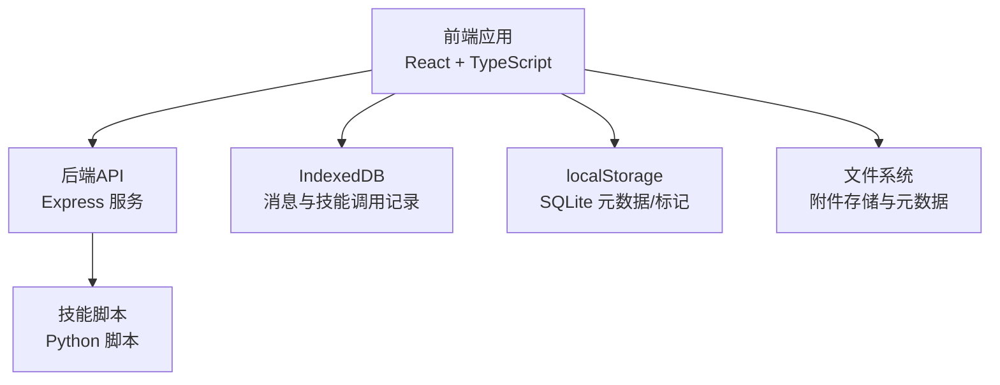
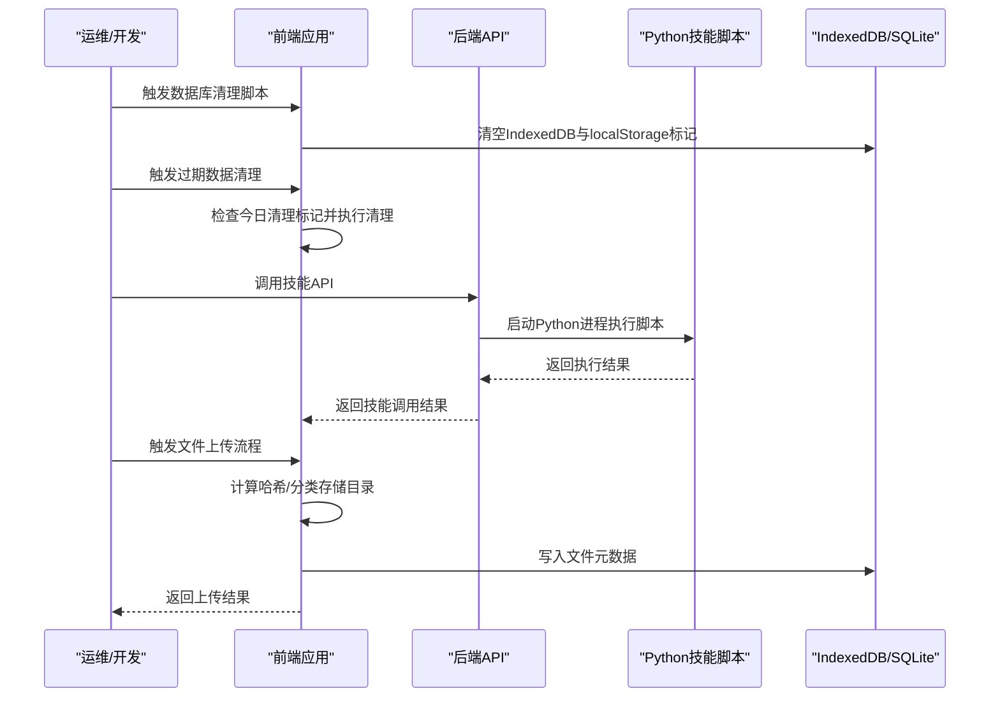
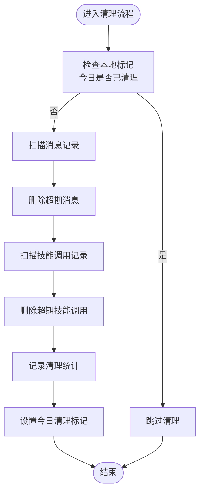
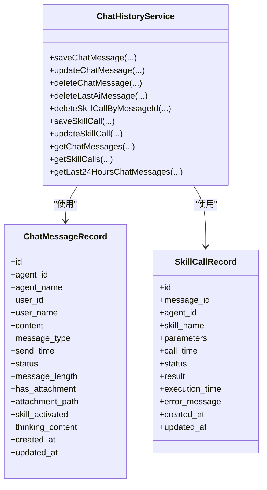
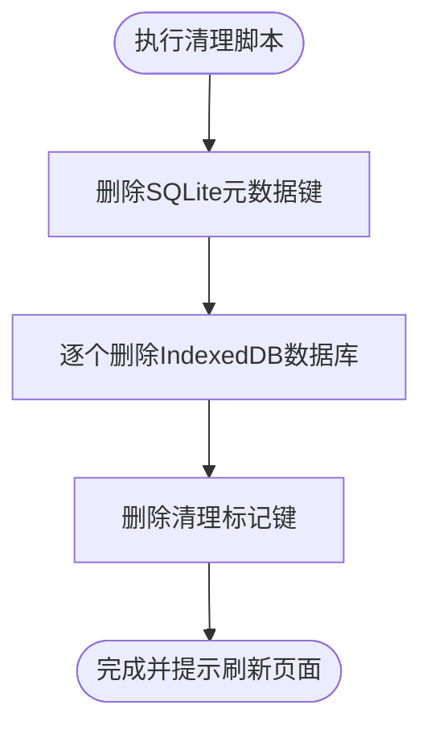
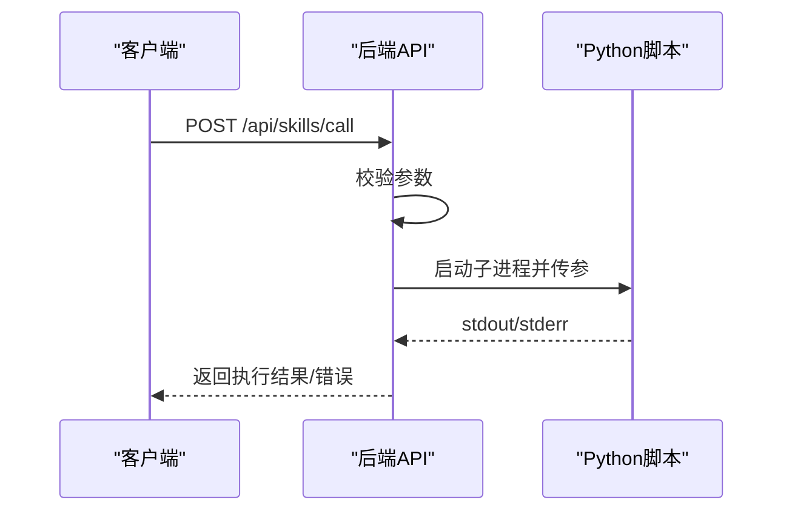
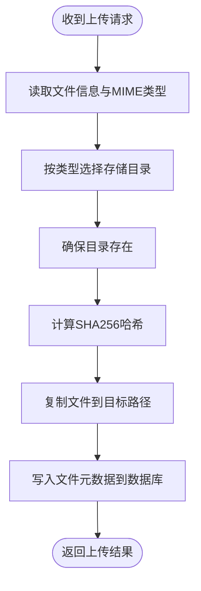
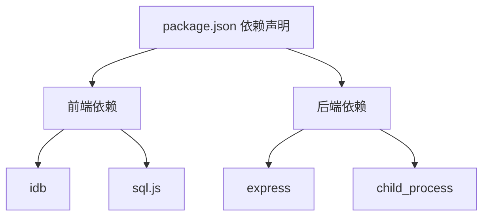

# 日常维护

<cite>
**本文引用的文件**
- [package.json](file://package.json)
- [backend/index.js](file://backend/index.js)
- [src/services/hybridStorage.ts](file://src/services/hybridStorage.ts)
- [src/scripts/clearDatabase.ts](file://src/scripts/clearDatabase.ts)
- [src/services/chatHistoryService.ts](file://src/services/chatHistoryService.ts)
- [docs/非功能设计/可维护性设计.md](file://docs/非功能设计/可维护性设计.md)
- [docs/非功能设计/性能设计.md](file://docs/非功能设计/性能设计.md)
- [docs/数据层设计/数据库设计.md](file://docs/数据层设计/数据库设计.md)
- [docs/接口层设计/Tauri通信接口.md](file://docs/接口层设计/Tauri通信接口.md)
</cite>

## 目录
1. [简介](#简介)
2. [项目结构](#项目结构)
3. [核心组件](#核心组件)
4. [架构总览](#架构总览)
5. [详细组件分析](#详细组件分析)
6. [依赖分析](#依赖分析)
7. [性能考量](#性能考量)
8. [故障排查指南](#故障排查指南)
9. [结论](#结论)
10. [附录](#附录)

## 简介
本指南面向AutoMate项目的运维与开发人员，提供一套系统化的日常维护流程，覆盖日常检查任务、系统健康监控、常规维护操作、数据库清理与存储空间监控、性能指标检查、缓存与临时文件管理、服务状态检查、维护日志记录与问题发现机制，以及自动化维护脚本与定时任务配置建议。内容基于仓库现有实现与文档，确保可操作、可追踪、可审计。

## 项目结构
AutoMate采用前后端分离架构：前端使用React + TypeScript，后端通过Express提供技能调用API；数据层结合IndexedDB与SQLite（通过sql.js），并在接口层设计中明确了文件附件的存储与元数据管理。关键维护相关文件分布如下：
- 前端服务与存储：hybridStorage.ts、chatHistoryService.ts、clearDatabase.ts
- 后端服务：backend/index.js（技能调用API）
- 维护与性能文档：可维护性设计、性能设计、数据库设计、Tauri通信接口

图表来源
- [backend/index.js](file://backend/index.js#L1-L117)
- [src/services/hybridStorage.ts](file://src/services/hybridStorage.ts#L1-L138)
- [src/services/chatHistoryService.ts](file://src/services/chatHistoryService.ts#L1-L244)
- [docs/接口层设计/Tauri通信接口.md](file://docs/接口层设计/Tauri通信接口.md#L462-L543)

章节来源
- [package.json](file://package.json#L1-L47)
- [backend/index.js](file://backend/index.js#L1-L117)
- [src/services/hybridStorage.ts](file://src/services/hybridStorage.ts#L1-L138)
- [src/services/chatHistoryService.ts](file://src/services/chatHistoryService.ts#L1-L244)
- [docs/接口层设计/Tauri通信接口.md](file://docs/接口层设计/Tauri通信接口.md#L462-L543)

## 核心组件
- 前端混合存储与过期清理：hybridStorage.ts提供IndexedDB数据库初始化、索引、过期数据清理与每日自动清理标记。
- 聊天历史服务：chatHistoryService.ts封装消息与技能调用的增删改查、索引查询与最近24小时数据查询。
- 数据库清理脚本：clearDatabase.ts提供一键清空IndexedDB与localStorage标记的控制台脚本。
- 后端技能服务：backend/index.js提供技能调用API，负责调用Python脚本并返回结果。
- 接口与文件存储：Tauri通信接口文档描述了文件上传、类型判定、存储路径与元数据入库流程。

章节来源
- [src/services/hybridStorage.ts](file://src/services/hybridStorage.ts#L1-L138)
- [src/services/chatHistoryService.ts](file://src/services/chatHistoryService.ts#L1-L244)
- [src/scripts/clearDatabase.ts](file://src/scripts/clearDatabase.ts#L1-L41)
- [backend/index.js](file://backend/index.js#L1-L117)
- [docs/接口层设计/Tauri通信接口.md](file://docs/接口层设计/Tauri通信接口.md#L462-L543)

## 架构总览
下图展示日常维护涉及的关键组件与交互路径，包括数据清理、服务调用与文件处理。

图表来源
- [src/scripts/clearDatabase.ts](file://src/scripts/clearDatabase.ts#L1-L41)
- [src/services/hybridStorage.ts](file://src/services/hybridStorage.ts#L89-L127)
- [backend/index.js](file://backend/index.js#L19-L79)
- [docs/接口层设计/Tauri通信接口.md](file://docs/接口层设计/Tauri通信接口.md#L462-L543)

## 详细组件分析

### 混合存储与过期清理（hybridStorage.ts）
- 数据库初始化：首次访问时创建IndexedDB，建立chat_messages与skill_calls对象仓库及索引。
- 过期清理策略：默认保留热数据（当前时间之前的固定天数），每日仅执行一次清理。
- 清理触发：通过localStorage中的“最后清理日期”标记控制每日执行频率。
- 清理逻辑：遍历消息与技能调用记录，删除超出保留期限的数据，并输出统计日志。

图表来源
- [src/services/hybridStorage.ts](file://src/services/hybridStorage.ts#L89-L127)

章节来源
- [src/services/hybridStorage.ts](file://src/services/hybridStorage.ts#L1-L138)

### 聊天历史服务（chatHistoryService.ts）
- 数据模型：消息与技能调用记录的字段定义与索引设计。
- 增删改查：保存消息、更新消息、删除消息、按代理ID与时间范围查询、获取最近24小时消息等。
- 关联操作：根据消息ID删除关联的技能调用记录。

图表来源
- [src/services/chatHistoryService.ts](file://src/services/chatHistoryService.ts#L3-L57)

章节来源
- [src/services/chatHistoryService.ts](file://src/services/chatHistoryService.ts#L1-L244)

### 数据库清理脚本（clearDatabase.ts）
- 功能：清空localStorage中的SQLite元数据、删除IndexedDB数据库、清除清理标记。
- 使用：在浏览器控制台执行导出函数，支持自动执行模式。
- 注意：清空后需刷新页面以重新初始化数据库。

图表来源
- [src/scripts/clearDatabase.ts](file://src/scripts/clearDatabase.ts#L1-L41)

章节来源
- [src/scripts/clearDatabase.ts](file://src/scripts/clearDatabase.ts#L1-L41)

### 后端技能服务（backend/index.js）
- 技能调用：接收POST请求，拼装参数，调用Python脚本，捕获标准输出与错误输出，返回统一结果。
- 错误处理：进程错误与非零退出码均作为失败处理，保证接口稳定性。
- 健康检查：提供GET接口返回服务状态信息。

图表来源
- [backend/index.js](file://backend/index.js#L81-L111)

章节来源
- [backend/index.js](file://backend/index.js#L1-L117)

### 文件上传与存储（Tauri通信接口）
- 文件类型判定与存储目录选择：根据MIME类型将图片、文本、其他文件分别存放至不同目录。
- 哈希计算与去重：对文件内容计算哈希，生成唯一存储路径，避免重复。
- 元数据入库：将文件名、类型、大小、存储路径、哈希等写入SQLite数据库。

图表来源
- [docs/接口层设计/Tauri通信接口.md](file://docs/接口层设计/Tauri通信接口.md#L462-L543)

章节来源
- [docs/接口层设计/Tauri通信接口.md](file://docs/接口层设计/Tauri通信接口.md#L462-L543)

## 依赖分析
- 前端依赖：React、TypeScript、idb（IndexedDB封装）、sql.js（SQLite Web版）、cors、express（后端）等。
- 后端依赖：Express、Python子进程调用、文件系统与路径处理。
- 组件耦合：前端服务通过API与后端交互；文件上传流程与数据库元数据写入强耦合；过期清理依赖localStorage标记。

图表来源
- [package.json](file://package.json#L15-L26)
- [backend/index.js](file://backend/index.js#L1-L117)

章节来源
- [package.json](file://package.json#L1-L47)
- [backend/index.js](file://backend/index.js#L1-L117)

## 性能考量
- 前端性能：使用虚拟滚动、组件记忆化、代码分割、缓存策略降低渲染与网络开销。
- 数据库性能：为常用查询字段建立索引，避免SELECT *，使用LIMIT限制结果集，定期执行VACUUM与ANALYZE。
- 后端性能：保持事务短小、避免长时间阻塞、启用日志与性能分析工具。
- 文件处理：上传速度与预览加载时间为目标，确保大文件上传不影响界面响应。

章节来源
- [docs/非功能设计/性能设计.md](file://docs/非功能设计/性能设计.md#L1-L292)
- [docs/数据层设计/数据库设计.md](file://docs/数据层设计/数据库设计.md#L473-L496)

## 故障排查指南
- 技能调用失败
  - 检查后端日志与错误输出，确认Python脚本路径与参数传递。
  - 若退出码非0，优先查看stderr输出。
- 数据库异常
  - 使用清理脚本重置数据库与标记，观察IndexedDB是否存在残留。
  - 如需手动清理，确保在浏览器控制台执行清理脚本并刷新页面。
- 文件上传失败
  - 核对MIME类型判定与存储目录权限。
  - 检查哈希计算与数据库元数据写入是否成功。
- 过期数据未清理
  - 检查localStorage中的清理标记是否为今日日期。
  - 确认清理函数在消息保存前被调用。

章节来源
- [backend/index.js](file://backend/index.js#L19-L79)
- [src/scripts/clearDatabase.ts](file://src/scripts/clearDatabase.ts#L1-L41)
- [src/services/hybridStorage.ts](file://src/services/hybridStorage.ts#L117-L127)
- [docs/接口层设计/Tauri通信接口.md](file://docs/接口层设计/Tauri通信接口.md#L462-L543)

## 结论
通过明确的日常检查任务、系统健康监控与常规维护流程，结合数据库清理脚本、存储空间监控与性能指标检查，可以有效保障AutoMate系统的稳定性与可维护性。建议将关键维护动作纳入自动化脚本与定时任务，配合日志记录与问题发现机制，形成闭环的运维体系。

## 附录

### 日常检查任务清单
- 检查后端服务状态与技能调用API可用性
- 检查前端IndexedDB与localStorage占用情况
- 检查文件上传目录空间与元数据一致性
- 检查过期数据清理标记与执行日志

### 系统健康监控要点
- 前端：页面加载时间、消息渲染延迟、组件响应时间
- 后端：技能执行时间、进程状态、错误日志
- 数据库：查询与写入延迟、索引使用情况、碎片整理

### 常规维护操作
- 定期执行数据库过期清理
- 定期备份SQLite数据库与重要配置
- 清理过期文件与无用附件
- 优化索引与执行ANALYZE/VACUUM

### 数据库清理脚本使用方法
- 在浏览器控制台执行导出的清理函数，或直接运行自动执行模式
- 清理完成后刷新页面以重新初始化数据库

章节来源
- [src/scripts/clearDatabase.ts](file://src/scripts/clearDatabase.ts#L1-L41)
- [src/services/hybridStorage.ts](file://src/services/hybridStorage.ts#L89-L127)
- [docs/数据层设计/数据库设计.md](file://docs/数据层设计/数据库设计.md#L473-L496)

### 存储空间监控与性能指标检查
- 存储监控：定期检查文件上传目录大小、数据库文件大小、IndexedDB占用
- 性能指标：页面加载时间、消息发送延迟、技能调用响应时间、数据库查询/写入延迟

章节来源
- [docs/非功能设计/性能设计.md](file://docs/非功能设计/性能设计.md#L1-L292)

### 缓存清理与临时文件管理
- 前端缓存：IndexedDB与localStorage中的临时数据与清理标记
- 临时文件：上传目录中的临时文件与过期附件清理

章节来源
- [src/services/hybridStorage.ts](file://src/services/hybridStorage.ts#L1-L138)
- [docs/接口层设计/Tauri通信接口.md](file://docs/接口层设计/Tauri通信接口.md#L462-L543)

### 服务状态检查流程
- 后端API健康检查：调用GET接口确认服务状态
- 技能服务可用性：发送简单技能调用请求验证Python环境与脚本路径

章节来源
- [backend/index.js](file://backend/index.js#L106-L111)

### 维护日志记录与问题发现机制
- 前端：在关键操作处输出日志，如消息保存、技能调用、清理统计
- 后端：记录技能执行输入、输出与错误，便于问题定位
- 文档：参考可维护性设计中的日志级别与格式规范

章节来源
- [src/services/chatHistoryService.ts](file://src/services/chatHistoryService.ts#L96-L119)
- [backend/index.js](file://backend/index.js#L23-L78)
- [docs/非功能设计/可维护性设计.md](file://docs/非功能设计/可维护性设计.md#L197-L292)

### 自动化维护脚本配置与定时任务设置
- 建议：将数据库清理脚本与过期数据清理逻辑封装为独立脚本，结合系统定时任务（如cron）按日执行
- 注意：确保脚本在浏览器控制台或Node环境中具备相应权限与上下文

章节来源
- [src/scripts/clearDatabase.ts](file://src/scripts/clearDatabase.ts#L1-L41)
- [src/services/hybridStorage.ts](file://src/services/hybridStorage.ts#L117-L127)