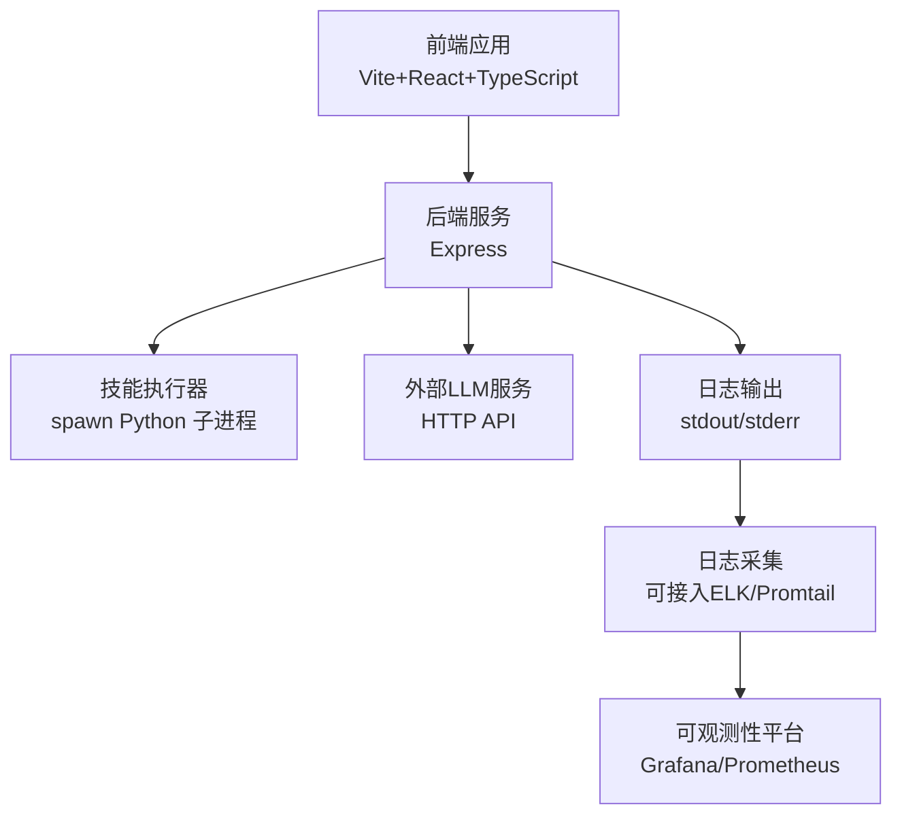
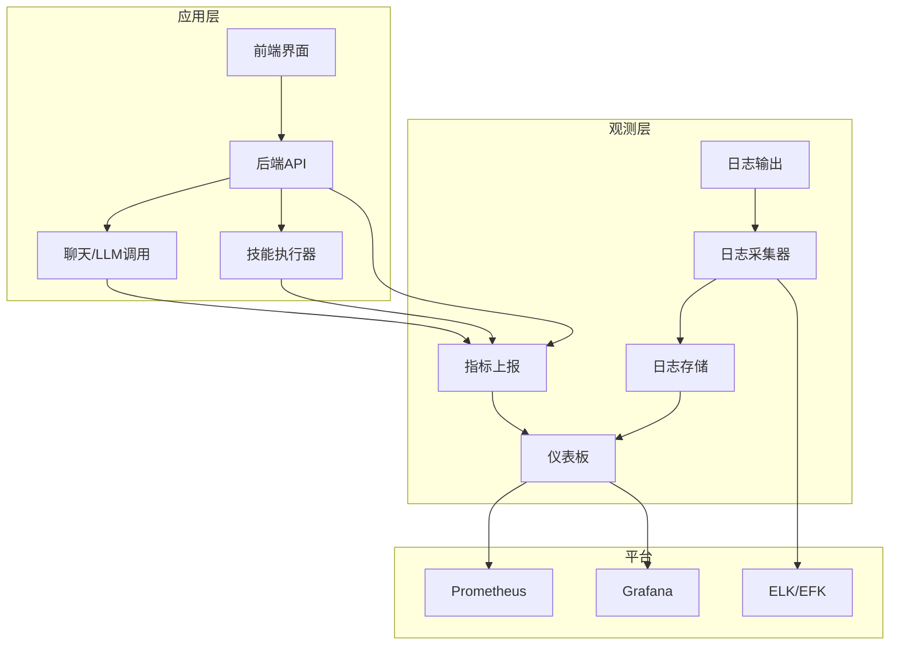
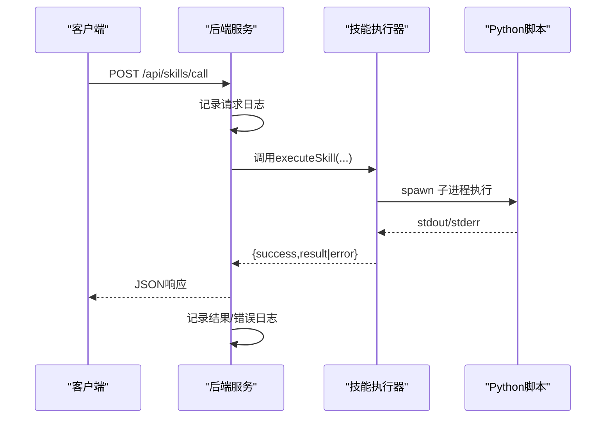
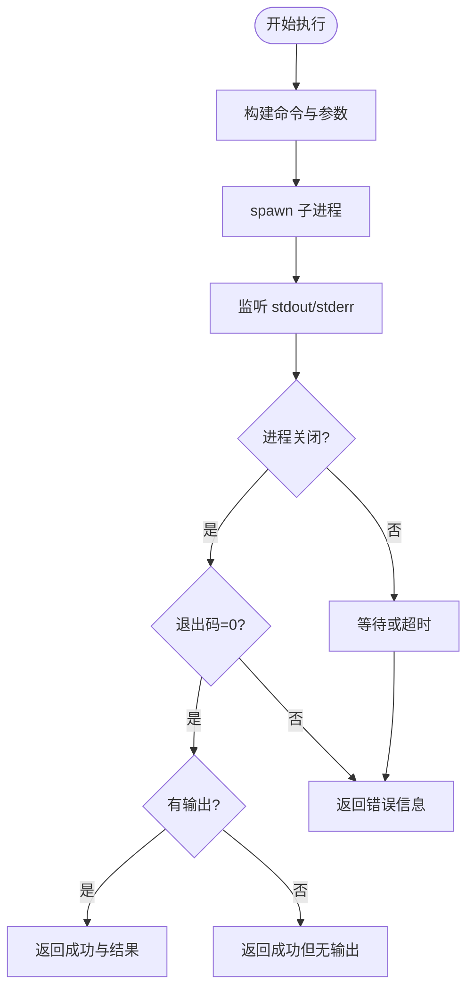
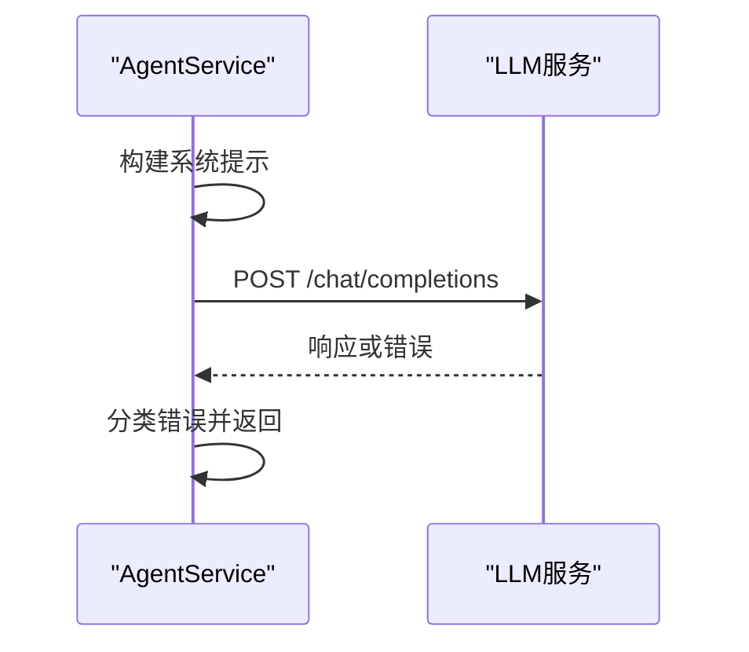
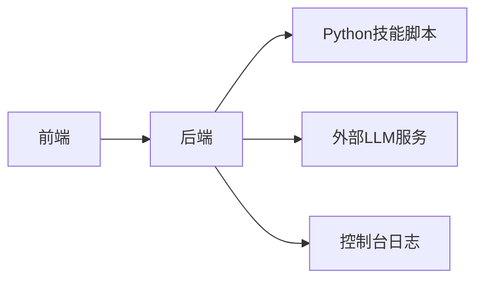

# 监控与告警

<cite>
**本文引用的文件**
- [package.json](file://package.json)
- [backend/index.js](file://backend/index.js)
- [backend/services/agentService.ts](file://backend/services/agentService.ts)
- [backend/services/skillService.js](file://backend/services/skillService.js)
- [docs/非功能设计/可维护性设计.md](file://docs/非功能设计/可维护性设计.md)
- [docs/基础规范/编码规范.md](file://docs/基础规范/编码规范.md)
- [OpenSkills-main/examples/multi-chart-draw/assets/examples/ecommerce-architecture.xml](file://OpenSkills-main/examples/multi-chart-draw/assets/examples/ecommerce-architecture.xml)
</cite>

## 目录
1. [简介](#简介)
2. [项目结构](#项目结构)
3. [核心组件](#核心组件)
4. [架构总览](#架构总览)
5. [详细组件分析](#详细组件分析)
6. [依赖关系分析](#依赖关系分析)
7. [性能考量](#性能考量)
8. [故障排查指南](#故障排查指南)
9. [结论](#结论)
10. [附录](#附录)

## 简介
本文件面向AutoMate项目的监控与告警体系，结合现有代码与文档，给出系统监控指标、性能监控与健康检查机制、日志采集与错误分析、告警阈值与通知机制、仪表板与历史分析、性能基准与优化建议，以及监控工具集成与自动化脚本思路。由于当前仓库未内置Prometheus/Grafana/ELK等监控栈配置，本文提供可落地的实施建议与对接方案。

## 项目结构
AutoMate采用前后端分离架构：前端基于Vite+React+TypeScript，后端基于Node.js+Express；技能执行通过子进程调用Python脚本。监控与告警应覆盖后端API、技能执行器、外部LLM服务调用链路，并结合日志与错误处理进行统一观测。

图表来源
- [backend/index.js](file://backend/index.js#L1-L117)
- [backend/services/skillService.js](file://backend/services/skillService.js#L1-L87)
- [backend/services/agentService.ts](file://backend/services/agentService.ts#L1-L245)
- [package.json](file://package.json#L1-L47)

章节来源
- [package.json](file://package.json#L1-L47)
- [backend/index.js](file://backend/index.js#L1-L117)

## 核心组件
- 后端API服务：提供技能调用与健康检查接口，具备基本日志输出。
- 技能执行器：通过子进程调用Python脚本，捕获标准输出与错误输出。
- LLM服务适配：封装外部模型服务调用，包含超时与错误分类处理。
- 日志与错误处理：统一使用console输出，便于后续接入日志采集。

章节来源
- [backend/index.js](file://backend/index.js#L1-L117)
- [backend/services/skillService.js](file://backend/services/skillService.js#L1-L87)
- [backend/services/agentService.ts](file://backend/services/agentService.ts#L1-L245)
- [docs/非功能设计/可维护性设计.md](file://docs/非功能设计/可维护性设计.md#L197-L292)
- [docs/基础规范/编码规范.md](file://docs/基础规范/编码规范.md#L576-L607)

## 架构总览
下图展示监控与告警在系统中的位置与交互关系：后端服务承载监控数据采集点，技能执行器与LLM调用作为关键观测对象，日志作为统一入口接入采集与分析。

图表来源
- [backend/index.js](file://backend/index.js#L1-L117)
- [backend/services/skillService.js](file://backend/services/skillService.js#L1-L87)
- [backend/services/agentService.ts](file://backend/services/agentService.ts#L1-L245)
- [OpenSkills-main/examples/multi-chart-draw/assets/examples/ecommerce-architecture.xml](file://OpenSkills-main/examples/multi-chart-draw/assets/examples/ecommerce-architecture.xml#L165-L185)

## 详细组件分析

### 后端API服务监控
- 健康检查：提供存活探针接口，返回服务状态。
- 请求追踪：对技能调用请求进行日志记录，包含请求体与结果。
- 错误处理：捕获异常并返回结构化错误信息，便于日志聚合与告警。

图表来源
- [backend/index.js](file://backend/index.js#L81-L104)
- [backend/services/skillService.js](file://backend/services/skillService.js#L16-L71)

章节来源
- [backend/index.js](file://backend/index.js#L81-L111)

### 技能执行器监控
- 执行状态：捕获子进程退出码、标准输出与错误输出。
- 输入输出：支持将输入字符串写入stdin，结束stdin。
- 错误分类：区分正常失败与异常错误，统一返回结构化结果。

图表来源
- [backend/services/skillService.js](file://backend/services/skillService.js#L16-L71)

章节来源
- [backend/services/skillService.js](file://backend/services/skillService.js#L1-L87)

### LLM调用监控
- 系统提示构建：从技能描述生成系统提示，作为调用上下文。
- 调用参数：封装模型、温度、最大token等参数。
- 错误分类：区分HTTP响应错误、网络请求失败与未知错误，统一返回。

图表来源
- [backend/services/agentService.ts](file://backend/services/agentService.ts#L98-L185)

章节来源
- [backend/services/agentService.ts](file://backend/services/agentService.ts#L118-L185)

## 依赖关系分析
- 前端与后端通过HTTP通信，后端通过子进程调用Python技能脚本。
- 后端依赖外部LLM服务，需关注网络延迟与可用性。
- 日志统一输出至控制台，便于接入日志采集器。

图表来源
- [backend/index.js](file://backend/index.js#L1-L117)
- [backend/services/skillService.js](file://backend/services/skillService.js#L1-L87)
- [backend/services/agentService.ts](file://backend/services/agentService.ts#L1-L245)

章节来源
- [package.json](file://package.json#L1-L47)

## 性能考量
- 健康检查：后端提供简单健康探针，可用于存活/就绪探测。
- 超时与重试：LLM调用设置超时，技能执行设置超时，避免阻塞。
- 日志级别：生产环境建议使用INFO/WARNING级别，减少DEBUG噪声。
- 指标建议：请求QPS、P95/P99延迟、错误率、子进程执行耗时、外部服务RTT。

章节来源
- [backend/index.js](file://backend/index.js#L106-L111)
- [backend/services/agentService.ts](file://backend/services/agentService.ts#L149-L149)
- [backend/services/skillService.js](file://backend/services/skillService.js#L26-L29)
- [docs/非功能设计/可维护性设计.md](file://docs/非功能设计/可维护性设计.md#L201-L207)

## 故障排查指南
- 后端异常：查看后端控制台日志，确认请求体、响应与错误信息。
- 技能执行失败：检查子进程退出码、stderr内容与工作目录权限。
- LLM调用失败：区分HTTP状态码、网络错误与请求参数问题。
- 日志分析：统一使用ERROR/WARNING级别，便于筛选与告警。

章节来源
- [backend/index.js](file://backend/index.js#L94-L103)
- [backend/services/skillService.js](file://backend/services/skillService.js#L42-L64)
- [backend/services/agentService.ts](file://backend/services/agentService.ts#L161-L184)
- [docs/基础规范/编码规范.md](file://docs/基础规范/编码规范.md#L576-L607)

## 结论
当前仓库已具备可观测性的基础能力（日志输出、错误处理），建议尽快引入日志采集与指标上报，建立健康检查、告警阈值与通知机制，并配套仪表板进行实时与历史分析，形成闭环的监控与告警体系。

## 附录

### 监控指标清单（建议）
- 后端API
  - 请求总量、QPS、成功率、错误率
  - 响应时间分布（P50/P90/P95/P99）、超时率
  - 并发连接数、线程池状态
- 技能执行
  - 执行次数、成功率、平均耗时、超时次数
  - 子进程退出码分布
- LLM调用
  - 调用次数、成功率、平均耗时、错误分类占比
  - 4xx/5xx错误率、网络错误率
- 健康检查
  - /api/skills 响应状态
  - 关键依赖可用性（如外部服务连通性）

章节来源
- [backend/index.js](file://backend/index.js#L106-L111)
- [backend/services/skillService.js](file://backend/services/skillService.js#L16-L71)
- [backend/services/agentService.ts](file://backend/services/agentService.ts#L135-L184)

### 告警阈值与通知机制（建议）
- 阈值
  - API错误率>5%（5分钟滚动窗口）
  - 响应时间P95>2s（5分钟滚动窗口）
  - 技能执行失败率>10%
  - LLM调用超时率>15%
- 通知
  - 多级告警：预警/严重/致命
  - 通知渠道：邮件/IM/Webhook
  - 告警抑制：同类型告警去抖与静默周期

章节来源
- [docs/非功能设计/可维护性设计.md](file://docs/非功能设计/可维护性设计.md#L201-L207)

### 仪表板与历史分析（建议）
- 实时监控
  - API QPS/错误率、响应时间、技能执行耗时
  - LLM调用成功率与错误分类
- 历史分析
  - 趋势对比、容量规划、回归分析
  - 日志检索与错误根因分析

章节来源
- [OpenSkills-main/examples/multi-chart-draw/assets/examples/ecommerce-architecture.xml](file://OpenSkills-main/examples/multi-chart-draw/assets/examples/ecommerce-architecture.xml#L170-L185)

### 监控工具集成与自动化脚本
- 日志采集
  - 使用Promtail/Filebeat采集控制台日志，发送至Loki/ELK
- 指标上报
  - 在后端与技能执行器埋点，上报至Prometheus
- 自动化
  - 健康检查脚本、告警演练脚本、报表生成脚本

章节来源
- [OpenSkills-main/examples/multi-chart-draw/assets/examples/ecommerce-architecture.xml](file://OpenSkills-main/examples/multi-chart-draw/assets/examples/ecommerce-architecture.xml#L165-L185)