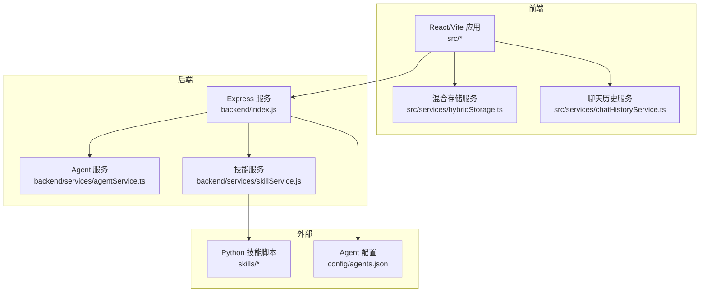
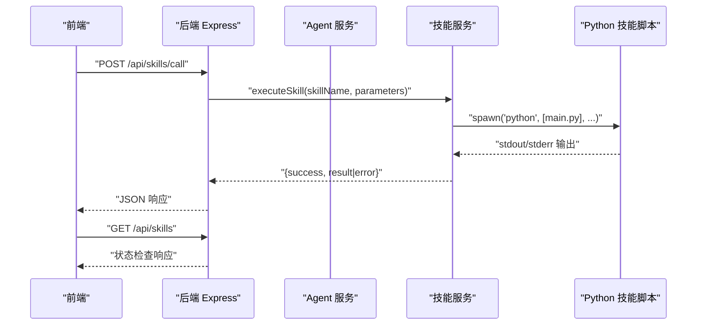
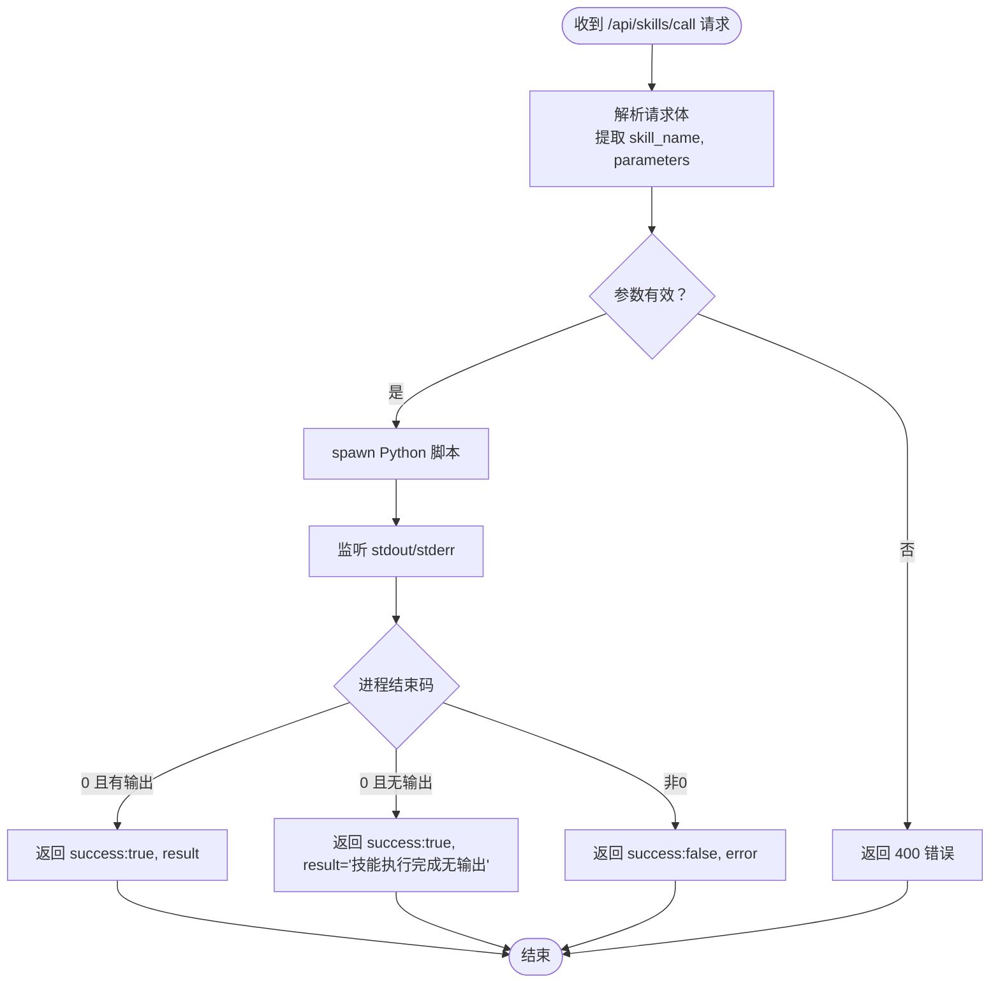
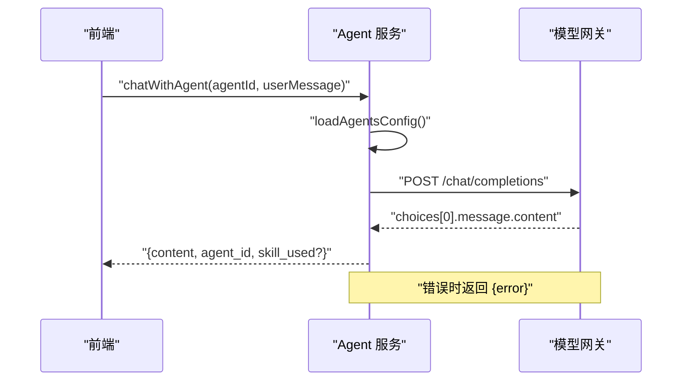
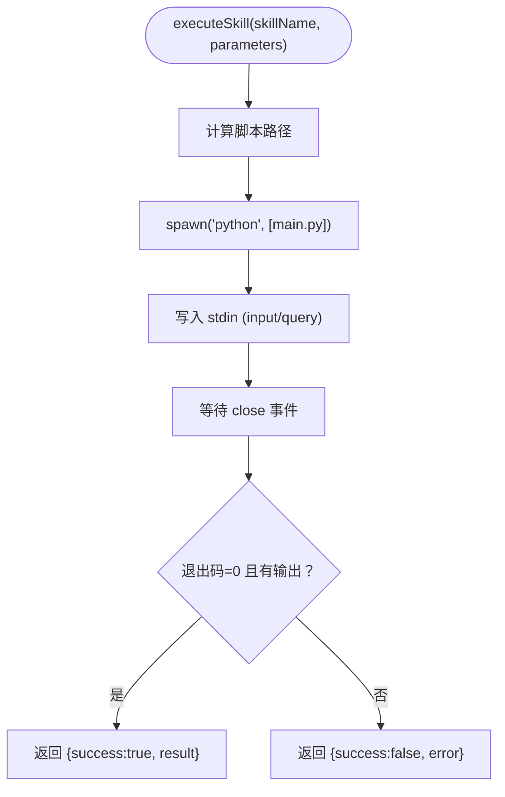
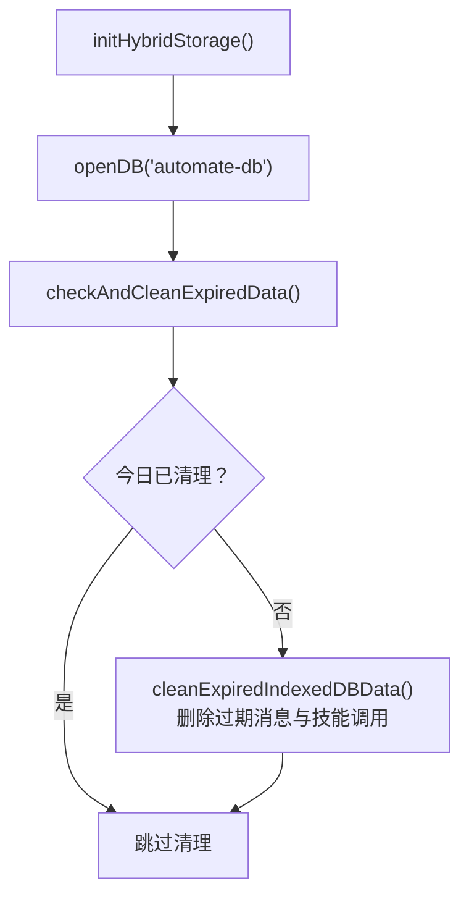
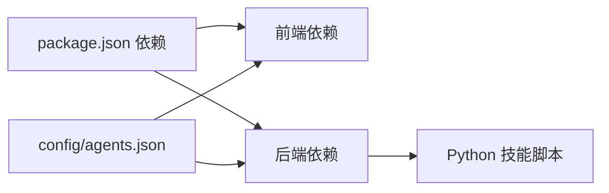

# 维护手册

<cite>
**本文引用的文件**
- [package.json](file://package.json)
- [backend/index.js](file://backend/index.js)
- [backend/services/agentService.ts](file://backend/services/agentService.ts)
- [backend/services/skillService.js](file://backend/services/skillService.js)
- [src/services/hybridStorage.ts](file://src/services/hybridStorage.ts)
- [src/services/chatHistoryService.ts](file://src/services/chatHistoryService.ts)
- [src/scripts/clearDatabase.ts](file://src/scripts/clearDatabase.ts)
- [config/agents.json](file://config/agents.json)
- [docs/非功能设计/可维护性设计.md](file://docs/非功能设计/可维护性设计.md)
- [docs/非功能设计/可扩展性设计.md](file://docs/非功能设计/可扩展性设计.md)
- [docs/非功能设计/性能设计.md](file://docs/非功能设计/性能设计.md)
- [docs/数据层设计/数据库设计.md](file://docs/数据层设计/数据库设计.md)
- [docs/数据层设计/数据库设计与实现验证报告.md](file://docs/数据层设计/数据库设计与实现验证报告.md)
</cite>

## 目录
1. [简介](#简介)
2. [项目结构](#项目结构)
3. [核心组件](#核心组件)
4. [架构总览](#架构总览)
5. [详细组件分析](#详细组件分析)
6. [依赖关系分析](#依赖关系分析)
7. [性能考量](#性能考量)
8. [故障排查指南](#故障排查指南)
9. [结论](#结论)
10. [附录](#附录)

## 简介
本维护手册面向AutoMate系统的运维与平台工程团队，提供系统维护流程、数据备份与恢复、版本升级策略、监控告警配置、日志管理与性能分析方法、故障预防与健康检查机制、数据清理与存储优化、维护计划与变更管理、风险评估以及运维工具与自动化脚本的使用指导。内容基于仓库中的实际代码与文档，确保可操作、可落地。

## 项目结构
AutoMate采用前后端分离架构：前端为React/Vite应用，后端为Node.js + Express服务；技能执行通过子进程调用Python脚本实现；前端使用IndexedDB作为本地混合存储，配合SQLite.js进行离线数据持久化。

**图表来源**
- [backend/index.js](file://backend/index.js#L1-L117)
- [backend/services/agentService.ts](file://backend/services/agentService.ts#L1-L245)
- [backend/services/skillService.js](file://backend/services/skillService.js#L1-L87)
- [src/services/hybridStorage.ts](file://src/services/hybridStorage.ts#L1-L262)
- [src/services/chatHistoryService.ts](file://src/services/chatHistoryService.ts#L1-L244)
- [config/agents.json](file://config/agents.json#L1-L119)

**章节来源**
- [package.json](file://package.json#L1-L47)
- [backend/index.js](file://backend/index.js#L1-L117)
- [config/agents.json](file://config/agents.json#L1-L119)

## 核心组件
- 后端服务与API
  - Express后端提供技能调用与状态查询接口，负责与外部模型网关通信，并通过子进程调用Python技能脚本。
- Agent与技能服务
  - Agent服务负责加载配置、构建系统提示、调用模型网关；技能服务封装技能执行逻辑与参数传递。
- 前端混合存储
  - 使用IndexedDB与SQLite.js实现本地持久化，提供消息与技能调用记录的增删改查与过期清理。
- 配置中心
  - 通过JSON配置文件集中管理Agent与技能信息，便于统一维护与动态扩展。

**章节来源**
- [backend/index.js](file://backend/index.js#L81-L111)
- [backend/services/agentService.ts](file://backend/services/agentService.ts#L118-L185)
- [backend/services/skillService.js](file://backend/services/skillService.js#L16-L87)
- [src/services/hybridStorage.ts](file://src/services/hybridStorage.ts#L63-L87)
- [config/agents.json](file://config/agents.json#L1-L119)

## 架构总览
后端作为统一入口，接收前端请求，解析并转发至Agent服务或技能服务；Agent服务与外部模型网关交互获取回复；技能服务通过子进程执行Python脚本并返回结果；前端通过混合存储服务进行本地数据管理。

**图表来源**
- [backend/index.js](file://backend/index.js#L81-L111)
- [backend/services/skillService.js](file://backend/services/skillService.js#L16-L87)

**章节来源**
- [backend/index.js](file://backend/index.js#L1-L117)
- [backend/services/skillService.js](file://backend/services/skillService.js#L1-L87)

## 详细组件分析

### 后端服务与API
- 技能调用接口
  - 提供POST /api/skills/call用于调用指定技能，参数校验与错误处理完善。
- 健康检查接口
  - 提供GET /api/skills用于服务可用性检查。
- 子进程执行
  - 通过child_process.spawn启动Python脚本，捕获标准输出与错误输出，统一返回结构。

**图表来源**
- [backend/index.js](file://backend/index.js#L19-L79)

**章节来源**
- [backend/index.js](file://backend/index.js#L81-L111)

### Agent服务
- 配置加载
  - 从config/agents.json读取Agent分组、配置与技能列表。
- 系统提示构建
  - 读取技能描述文件，拼接系统提示，指导模型选择合适技能。
- 模型网关调用
  - 通过HTTP POST调用外部模型网关，设置超时与认证头，处理Axios错误。

**图表来源**
- [backend/services/agentService.ts](file://backend/services/agentService.ts#L118-L185)

**章节来源**
- [backend/services/agentService.ts](file://backend/services/agentService.ts#L58-L185)
- [config/agents.json](file://config/agents.json#L1-L119)

### 技能服务（Python）
- 执行流程
  - 解析参数，构造输入字符串，spawn Python脚本，读取输出与错误，返回统一结构。
- 参数传递
  - 支持从parameters中提取input或query作为stdin输入。

**图表来源**
- [backend/services/skillService.js](file://backend/services/skillService.js#L16-L87)

**章节来源**
- [backend/services/skillService.js](file://backend/services/skillService.js#L1-L87)

### 前端混合存储
- 数据模型
  - IndexedDB存储聊天消息与技能调用记录，定义索引以支持按agent、时间等维度查询。
- 过期清理
  - 默认保留最近3天热数据，每日首次访问时清理过期数据。
- 常用操作
  - 保存消息、按agent查询最近24小时消息、删除最后一条AI消息、保存/查询技能调用等。

**图表来源**
- [src/services/hybridStorage.ts](file://src/services/hybridStorage.ts#L117-L127)
- [src/services/hybridStorage.ts](file://src/services/hybridStorage.ts#L89-L115)

**章节来源**
- [src/services/hybridStorage.ts](file://src/services/hybridStorage.ts#L1-L262)

### 聊天历史服务（对比）
- 与混合存储服务类似的数据模型与操作接口，但未实现过期清理逻辑。
- 适合需要完整历史查询的场景，注意数据量增长带来的性能与存储压力。

**章节来源**
- [src/services/chatHistoryService.ts](file://src/services/chatHistoryService.ts#L1-L244)

### 数据库清理脚本
- 一键清空SQLite与IndexedDB数据，清除清理标记，便于重置开发环境或修复存储异常。
- 通过浏览器控制台调用window.clearAllDatabase()执行。

**章节来源**
- [src/scripts/clearDatabase.ts](file://src/scripts/clearDatabase.ts#L1-L41)

## 依赖关系分析
- 前端依赖
  - React、Zustand、idb、sql.js等，支撑UI、状态管理与本地数据库。
- 后端依赖
  - Express、cors、child_process（用于调用Python）、axios（调用模型网关）。
- 配置依赖
  - config/agents.json集中管理Agent与技能配置，后端与前端均依赖该配置。

**图表来源**
- [package.json](file://package.json#L15-L44)
- [config/agents.json](file://config/agents.json#L1-L119)

**章节来源**
- [package.json](file://package.json#L1-L47)
- [config/agents.json](file://config/agents.json#L1-L119)

## 性能考量
- 前端性能
  - 使用Performance API监控启动与交互延迟；合理使用对象池与内存管理减少GC压力。
- 后端性能
  - 通过日志记录与超时控制保障稳定性；避免阻塞式I/O，合理使用异步。
- 数据库性能
  - 为常用查询建立索引；限制单次批量操作规模；定期监控查询响应时间。
- 文件处理
  - 小文件上传优先；大文件上传时保证界面响应。

**章节来源**
- [docs/非功能设计/性能设计.md](file://docs/非功能设计/性能设计.md#L1-L229)
- [docs/数据层设计/数据库设计.md](file://docs/数据层设计/数据库设计.md#L498-L566)

## 故障排查指南
- 技能执行失败
  - 检查后端日志与stderr输出；确认Python脚本路径与参数；验证环境变量与编码设置。
- Agent调用异常
  - 检查模型网关连通性、认证头与超时设置；查看Axios错误类型与响应状态。
- 存储异常
  - 使用清理脚本重置数据库；检查IndexedDB版本升级与索引一致性；关注过期清理是否按日执行。
- 配置错误
  - 校验config/agents.json格式与字段完整性；确认技能描述文件存在且可读。

**章节来源**
- [backend/index.js](file://backend/index.js#L32-L78)
- [backend/services/agentService.ts](file://backend/services/agentService.ts#L161-L184)
- [src/scripts/clearDatabase.ts](file://src/scripts/clearDatabase.ts#L1-L41)
- [config/agents.json](file://config/agents.json#L1-L119)

## 结论
本维护手册基于AutoMate的实际代码与文档，给出了可操作的维护流程与最佳实践。通过规范化的监控告警、日志管理、性能分析、故障预防与健康检查机制，结合数据备份恢复与存储优化策略，可显著提升系统的稳定性与可维护性。建议在生产环境中持续完善自动化脚本与变更管理流程，确保版本升级与配置变更的安全可控。

## 附录

### 维护流程与标准化
- 代码注释与格式化
  - 前端使用Prettier，后端使用Black；函数与类具备完整文档字符串。
- 日志记录
  - 明确日志级别与格式；前后端分别记录关键操作与错误信息。
- 测试
  - 单元测试与集成测试覆盖核心模块；持续集成保障质量。

**章节来源**
- [docs/非功能设计/可维护性设计.md](file://docs/非功能设计/可维护性设计.md#L125-L292)

### 数据备份与恢复
- 数据库备份
  - 建议定期导出IndexedDB快照或使用SQLite.js的备份能力；对关键数据进行周期性归档。
- 文件备份
  - 对用户上传的文件与配置进行独立备份，确保可快速恢复。
- 恢复流程
  - 制定恢复演练计划，验证备份数据的完整性与可恢复性。

**章节来源**
- [docs/数据层设计/数据库设计与实现验证报告.md](file://docs/数据层设计/数据库设计与实现验证报告.md#L97-L116)

### 版本升级策略
- Git工作流
  - 使用feature/、bugfix/、hotfix/分支；遵循语义化版本规范。
- 升级步骤
  - 在测试环境验证；记录变更点；灰度发布；回滚预案准备。

**章节来源**
- [docs/非功能设计/可维护性设计.md](file://docs/非功能设计/可维护性设计.md#L380-L432)

### 监控告警配置
- 指标建议
  - 后端接口响应时间、错误率；前端首屏渲染时间、交互延迟；数据库查询与写入延迟。
- 告警阈值
  - 基于性能设计目标设定阈值；区分警告与严重级别。
- 工具建议
  - 前端使用Performance API与Lighthouse；后端使用日志与APM工具。

**章节来源**
- [docs/非功能设计/性能设计.md](file://docs/非功能设计/性能设计.md#L174-L229)

### 日志管理
- 日志级别与格式
  - 统一格式与时间戳；按模块分类；区分DEBUG/INFO/WARNING/ERROR/CRITICAL。
- 日志轮转
  - 建议使用轮转策略控制日志文件大小与数量。

**章节来源**
- [docs/非功能设计/可维护性设计.md](file://docs/非功能设计/可维护性设计.md#L197-L292)

### 性能分析方法
- 前端
  - 使用Chrome DevTools、React Profiler、Lighthouse进行性能分析。
- 后端
  - 使用cProfile、Py-Spy、Memory Profiler定位热点与内存问题。
- 数据库
  - EXPLAIN QUERY PLAN分析慢查询；监控数据库大小与增长趋势。

**章节来源**
- [docs/非功能设计/性能设计.md](file://docs/非功能设计/性能设计.md#L203-L229)
- [docs/数据层设计/数据库设计.md](file://docs/数据层设计/数据库设计.md#L498-L566)

### 故障预防与健康检查
- 健康检查
  - 定期调用GET /api/skills；监控Agent网关连通性与响应时间。
- 预防措施
  - 实施过期数据清理、索引维护、日志轮转与容量预警。

**章节来源**
- [backend/index.js](file://backend/index.js#L106-L111)
- [src/services/hybridStorage.ts](file://src/services/hybridStorage.ts#L117-L127)

### 数据清理与存储优化
- 清理脚本
  - 一键清空SQLite与IndexedDB；清除清理标记。
- 存储优化
  - 控制热数据窗口（默认3天）；定期清理过期数据；限制单次批量操作规模。

**章节来源**
- [src/scripts/clearDatabase.ts](file://src/scripts/clearDatabase.ts#L1-L41)
- [src/services/hybridStorage.ts](file://src/services/hybridStorage.ts#L89-L127)

### 维护计划与变更管理
- 维护计划
  - 制定周/月度检查清单，涵盖配置校验、日志巡检、容量与性能监控。
- 变更管理
  - 变更前评审、测试、灰度与回滚预案；记录变更影响范围与风险等级。

**章节来源**
- [docs/非功能设计/可维护性设计.md](file://docs/非功能设计/可维护性设计.md#L470-L484)

### 运维工具与自动化脚本
- 前端
  - Vite开发与构建；ESLint类型检查；Tailwind样式。
- 后端
  - Node脚本启动后端；并发启动前端与后端；Python技能脚本执行。
- 自动化
  - 建议编写部署与巡检脚本，集成到CI/CD流水线。

**章节来源**
- [package.json](file://package.json#L6-L13)