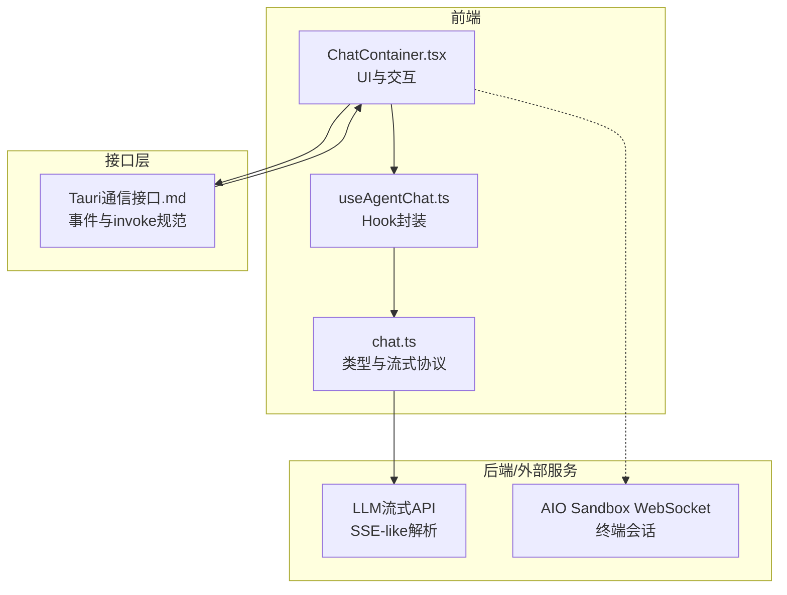
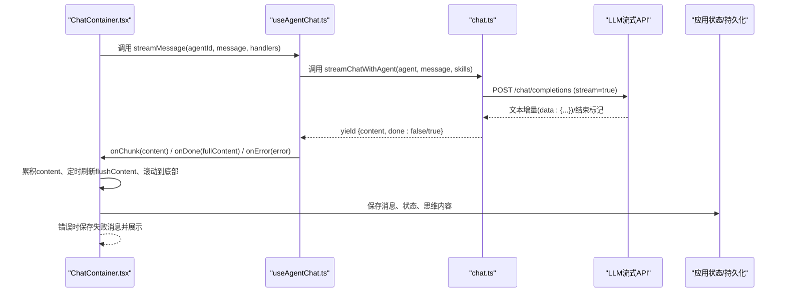
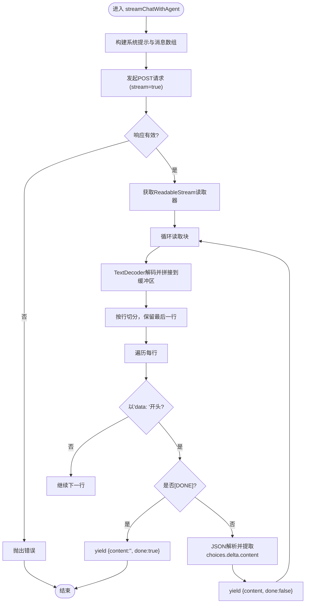
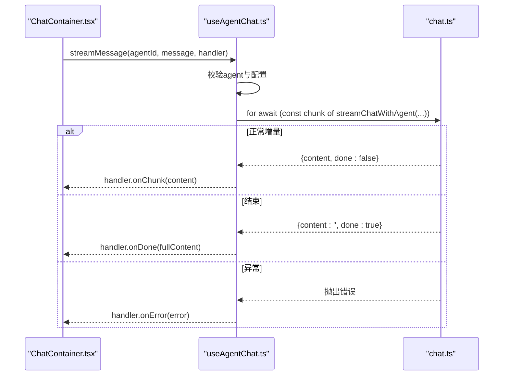
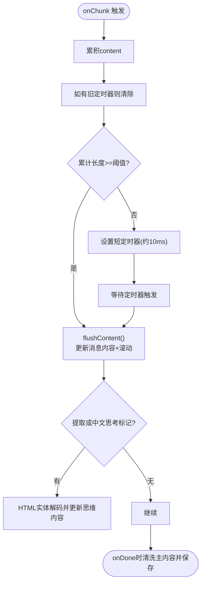
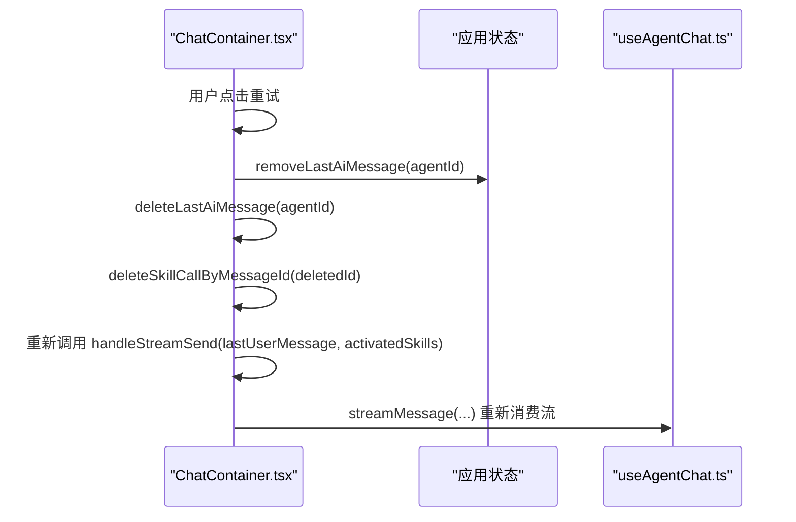
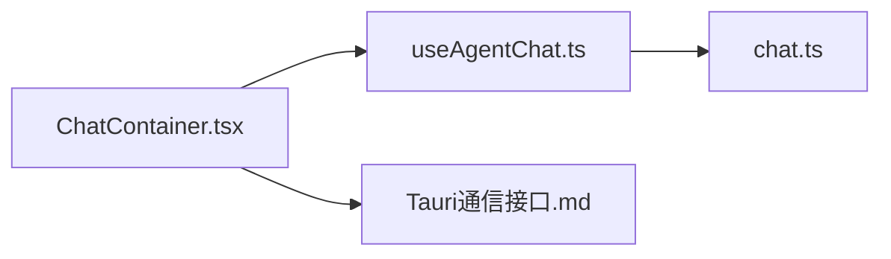

# 流式通信实现

<cite>
**本文引用的文件**
- [src/types/chat.ts](file://src/types/chat.ts)
- [src/hooks/useAgentChat.ts](file://src/hooks/useAgentChat.ts)
- [src/components/chat/ChatContainer.tsx](file://src/components/chat/ChatContainer.tsx)
- [docs/接口层设计/Tauri通信接口.md](file://docs/接口层设计/Tauri通信接口.md)
- [docs/非功能设计/性能设计.md](file://docs/非功能设计/性能设计.md)
- [.trae/documents/AutoMate前端页面开发实施计划.md](file://.trae/documents/AutoMate前端页面开发实施计划.md)
- [todo_list.md](file://todo_list.md)
- [OpenSkills-main/openskills/sandbox/client.py](file://OpenSkills-main/openskills/sandbox/client.py)
</cite>

## 目录
1. [简介](#简介)
2. [项目结构](#项目结构)
3. [核心组件](#核心组件)
4. [架构总览](#架构总览)
5. [详细组件分析](#详细组件分析)
6. [依赖关系分析](#依赖关系分析)
7. [性能考量](#性能考量)
8. [故障排查指南](#故障排查指南)
9. [结论](#结论)
10. [附录](#附录)

## 简介
本文件系统化梳理 AutoMate 项目中的流式通信实现，覆盖实时消息流处理、增量内容更新、流式输出机制、onChunk 回调处理、内容累积与清洗、定时刷新策略、思维内容提取与 HTML 标签解析、错误处理与重试、WebSocket 连接管理与实时交互优化等主题。文档面向不同技术背景读者，既提供高层架构视图，也给出代码级的可视化与流程图，帮助开发者快速理解与扩展。

## 项目结构
围绕流式通信的关键文件与职责如下：
- 类型与流式协议：定义流式 Chunk 结构、构建系统提示、封装 fetch 流式读取与 SSE-like 解析。
- Hook 层：统一暴露 sendMessage 与 streamMessage，封装异步迭代器与错误处理。
- 组件层：负责 onChunk 累积、定时刷新、思维内容提取与内容清洗、状态切换与持久化。
- 接口层：Tauri 事件系统用于前后端消息事件推送。
- 性能与扩展：性能设计文档与前端实施计划，指导渲染优化、懒加载、缓存与虚拟滚动等。

图表来源
- [src/components/chat/ChatContainer.tsx](file://src/components/chat/ChatContainer.tsx#L254-L392)
- [src/hooks/useAgentChat.ts](file://src/hooks/useAgentChat.ts#L84-L119)
- [src/types/chat.ts](file://src/types/chat.ts#L96-L189)
- [docs/接口层设计/Tauri通信接口.md](file://docs/接口层设计/Tauri通信接口.md#L623-L697)
- [OpenSkills-main/openskills/sandbox/client.py](file://OpenSkills-main/openskills/sandbox/client.py#L411-L432)

章节来源
- [src/types/chat.ts](file://src/types/chat.ts#L1-L280)
- [src/hooks/useAgentChat.ts](file://src/hooks/useAgentChat.ts#L1-L128)
- [src/components/chat/ChatContainer.tsx](file://src/components/chat/ChatContainer.tsx#L254-L392)
- [docs/接口层设计/Tauri通信接口.md](file://docs/接口层设计/Tauri通信接口.md#L1-L200)

## 核心组件
- 流式协议与解析
  - AsyncGenerator<StreamChunk>：统一的流式输出抽象，包含 content 与 done 标志。
  - fetch + ReadableStream + TextDecoder：逐块读取响应体，按行切分，过滤 data: 前缀，解析 JSON，提取 choices.delta.content。
- Hook 封装
  - streamMessage：消费流式迭代器，分发 onChunk/onDone/onError。
  - sendMessage：一次性非流式请求，便于对比与回退。
- 组件层处理
  - onChunk：累积 content，基于定时器与阈值触发 flushContent，滚动到底部。
  - 思维内容提取：支持 <think> 标签与中文“思考/分析/推理”标记，HTML 实体解码，主内容清洗。
  - 错误处理：onError 保存失败消息并展示，支持重试与停止。

章节来源
- [src/types/chat.ts](file://src/types/chat.ts#L48-L51)
- [src/types/chat.ts](file://src/types/chat.ts#L96-L189)
- [src/hooks/useAgentChat.ts](file://src/hooks/useAgentChat.ts#L84-L119)
- [src/components/chat/ChatContainer.tsx](file://src/components/chat/ChatContainer.tsx#L254-L392)

## 架构总览
下图展示从前端到 LLM 流式接口，再到组件层的完整链路，以及错误与事件推送路径。

图表来源
- [src/components/chat/ChatContainer.tsx](file://src/components/chat/ChatContainer.tsx#L254-L392)
- [src/hooks/useAgentChat.ts](file://src/hooks/useAgentChat.ts#L84-L119)
- [src/types/chat.ts](file://src/types/chat.ts#L96-L189)

## 详细组件分析

### 流式协议与解析（chat.ts）
- 协议要点
  - 请求：向 /chat/completions 发起 POST，开启 stream=true。
  - 响应：ReadableStream，逐块读取，TextDecoder 解码，按行拼接，过滤非 data: 行，遇到 [DONE] 结束。
  - 数据：从 JSON 中提取 choices[0].delta.content 作为增量内容。
- 错误处理
  - 响应非 ok 或响应体为空时抛错。
  - 读取 finally 中释放 reader lock，避免资源泄漏。
- 与 Hook 的对接
  - useAgentChat.ts 通过 for-await-of 遍历流，分发 onChunk/onDone/onError。

图表来源
- [src/types/chat.ts](file://src/types/chat.ts#L96-L189)

章节来源
- [src/types/chat.ts](file://src/types/chat.ts#L96-L189)

### Hook 封装（useAgentChat.ts）
- 职责
  - 校验 agent 配置，加载技能描述，统一对外暴露 sendMessage 与 streamMessage。
  - 在 streamMessage 中消费流式迭代器，分发 onChunk/onDone/onError。
- 错误处理
  - 捕获异常并设置 error，同时调用 handler.onError，保持 UI 与业务解耦。

图表来源
- [src/hooks/useAgentChat.ts](file://src/hooks/useAgentChat.ts#L84-L119)
- [src/types/chat.ts](file://src/types/chat.ts#L96-L189)

章节来源
- [src/hooks/useAgentChat.ts](file://src/hooks/useAgentChat.ts#L84-L119)

### 组件层处理（ChatContainer.tsx）
- onChunk 累积与定时刷新
  - 累积 content，若累计长度达到阈值立即刷新；否则设置短定时器（约 10ms）延迟刷新，避免频繁重绘。
  - 刷新时调用 updateMessageContent 并滚动到底部。
- 思维内容提取与清洗
  - 支持 <think> 标签与中文“思考/分析/推理”标记，HTML 实体解码（&lt;、&gt;、&amp;）。
  - 主内容清洗：移除技能标签、think 标签、中文思考标记、多余段落与空白。
- 完成与错误处理
  - onDone：合并最终内容，提取思维内容，更新消息状态为 sent，持久化保存，并记录技能调用。
  - onError：保存失败消息并展示，便于用户感知与重试。

图表来源
- [src/components/chat/ChatContainer.tsx](file://src/components/chat/ChatContainer.tsx#L254-L392)

章节来源
- [src/components/chat/ChatContainer.tsx](file://src/components/chat/ChatContainer.tsx#L254-L392)

### 错误处理与重试机制
- 错误处理
  - chat.ts：axios 请求捕获 Network Error 与响应错误，返回标准化 error 字段。
  - useAgentChat.ts：流式过程中异常统一转换为错误字符串并回调 onError。
  - ChatContainer.tsx：onError 保存失败消息并展示，支持停止与重试。
- 重试策略
  - handleRetry：定位最后一条用户消息，移除最后一条 AI 回复及其技能调用记录，重新触发流式发送。
  - 适用场景：网络抖动、模型返回异常片段、部分输出导致的不完整思维内容。

图表来源
- [src/components/chat/ChatContainer.tsx](file://src/components/chat/ChatContainer.tsx#L400-L433)
- [src/hooks/useAgentChat.ts](file://src/hooks/useAgentChat.ts#L84-L119)

章节来源
- [src/components/chat/ChatContainer.tsx](file://src/components/chat/ChatContainer.tsx#L378-L433)
- [src/hooks/useAgentChat.ts](file://src/hooks/useAgentChat.ts#L112-L118)

### WebSocket 连接管理与实时交互
- AIO Sandbox 终端会话
  - 通过 get_terminal_url 获取 WebSocket 终端 URL，支持复用 session_id。
  - 提供 shell_write 与 shell_view 等能力，适合实时终端交互场景。
- 与流式通信的关系
  - 流式通信侧重 LLM 的增量输出；WebSocket 更偏向交互式终端会话。
  - 可借鉴 WebSocket 的连接管理、URL 参数与会话复用模式，用于未来扩展实时终端流式交互。

章节来源
- [OpenSkills-main/openskills/sandbox/client.py](file://OpenSkills-main/openskills/sandbox/client.py#L411-L432)
- [OpenSkills-main/openskills/sandbox/client.py](file://OpenSkills-main/openskills/sandbox/client.py#L434-L467)

## 依赖关系分析
- 组件与 Hook 的依赖
  - ChatContainer.tsx 依赖 useAgentChat.ts 的 streamMessage 与状态管理。
  - useAgentChat.ts 依赖 chat.ts 的 streamChatWithAgent 与工具方法。
- Hook 与类型层
  - useAgentChat.ts 通过类型约束 StreamHandler，保证 onChunk/onDone/onError 的契约一致。
- 接口层事件
  - Tauri 事件系统用于前后端消息事件推送，与流式通信解耦，适合状态同步与通知。

图表来源
- [src/components/chat/ChatContainer.tsx](file://src/components/chat/ChatContainer.tsx#L254-L392)
- [src/hooks/useAgentChat.ts](file://src/hooks/useAgentChat.ts#L84-L119)
- [src/types/chat.ts](file://src/types/chat.ts#L96-L189)
- [docs/接口层设计/Tauri通信接口.md](file://docs/接口层设计/Tauri通信接口.md#L623-L697)

章节来源
- [src/components/chat/ChatContainer.tsx](file://src/components/chat/ChatContainer.tsx#L254-L392)
- [src/hooks/useAgentChat.ts](file://src/hooks/useAgentChat.ts#L84-L119)
- [src/types/chat.ts](file://src/types/chat.ts#L96-L189)
- [docs/接口层设计/Tauri通信接口.md](file://docs/接口层设计/Tauri通信接口.md#L623-L697)

## 性能考量
- 渲染与更新优化
  - 定时刷新与阈值控制：onChunk 累积达到阈值立即刷新，否则短定时器延迟刷新，降低频繁重绘成本。
  - 内容清洗与去噪：在主内容中移除 think 标签与技能标记，减少渲染负担。
- 前端实施计划与性能设计
  - 代码分割、懒加载、缓存优化、渲染优化（memo/useMemo/useCallback）、虚拟滚动、资源优化。
  - 目标指标：应用启动时间<3秒，界面操作响应时间<300ms，消息发送延迟<500ms。
- 存储与持久化
  - 成功与失败消息均持久化，便于重试与审计。

章节来源
- [docs/非功能设计/性能设计.md](file://docs/非功能设计/性能设计.md#L47-L134)
- [.trae/documents/AutoMate前端页面开发实施计划.md](file://.trae/documents/AutoMate前端页面开发实施计划.md#L205-L247)
- [todo_list.md](file://todo_list.md#L239-L250)

## 故障排查指南
- 常见问题与定位
  - 响应体为空或非 ok：检查代理路径与鉴权头，确认 isDirectApi 与 requestUrl 选择。
  - SSE-like 行解析失败：确认每行以 data: 开头，注意 [DONE] 结束标记。
  - 思维内容未分离：确认正则同时支持 <think> 标签与中文标记，并进行 HTML 实体解码。
  - 网络错误：axios 捕获 Network Error，返回统一错误字符串。
- 重试与回滚
  - handleRetry：移除最后一条 AI 消息及其技能调用记录，重新触发流式发送。
  - 停止：handleStop 设置发送状态为 false，清理当前消息 ID。

章节来源
- [src/types/chat.ts](file://src/types/chat.ts#L131-L137)
- [src/types/chat.ts](file://src/types/chat.ts#L237-L259)
- [src/components/chat/ChatContainer.tsx](file://src/components/chat/ChatContainer.tsx#L378-L433)

## 结论
本实现以 AsyncGenerator 为核心，结合前端 Hook 与组件层的 onChunk 累积、定时刷新与内容清洗，提供了稳定、可扩展的流式通信能力。配合 Tauri 事件系统与 AIO Sandbox 的 WebSocket 能力，可进一步拓展为更丰富的实时交互场景。性能设计与前端实施计划为大规模消息与长列表渲染提供了保障。

## 附录
- 扩展指南
  - 自定义处理器：在 StreamHandler 中扩展 onChunk/onDone/onError 的业务处理逻辑。
  - 定时刷新策略：根据消息长度与渲染压力动态调整阈值与定时器时长。
  - 内容清洗规则：新增标签或标记时，同步更新正则与清洗逻辑。
  - 错误与重试：在 onError 中增加指数退避与最大重试次数，提升鲁棒性。
- WebSocket 实时交互
  - 参考 AIO Sandbox 的 get_terminal_url 与会话复用模式，设计统一的连接管理与断线重连策略。