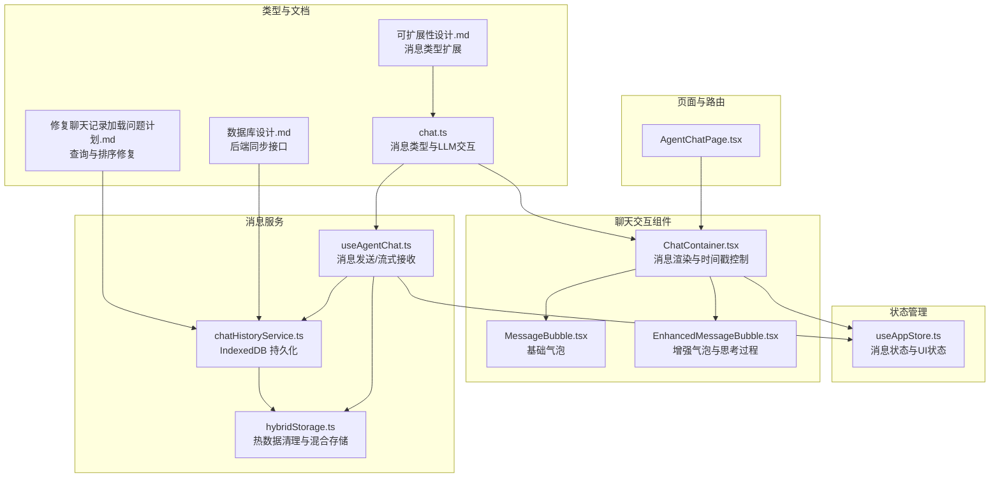
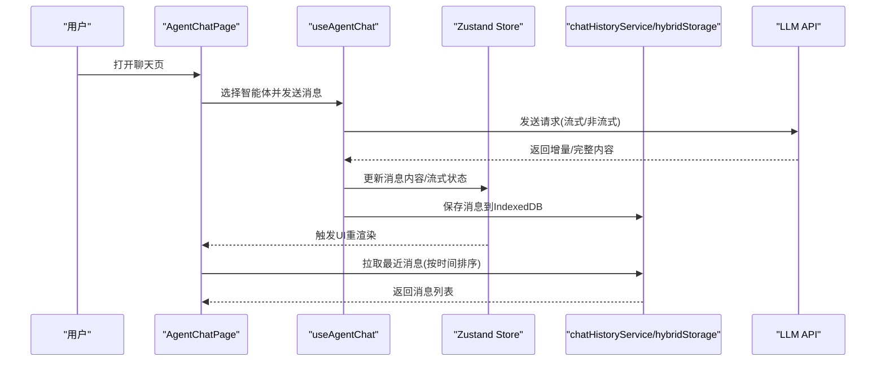
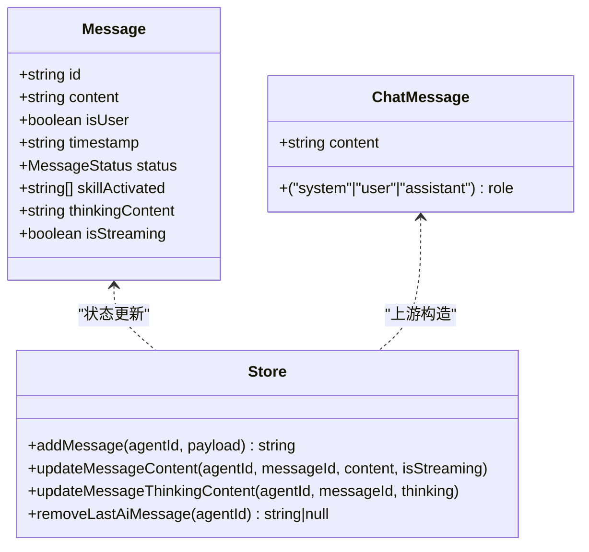
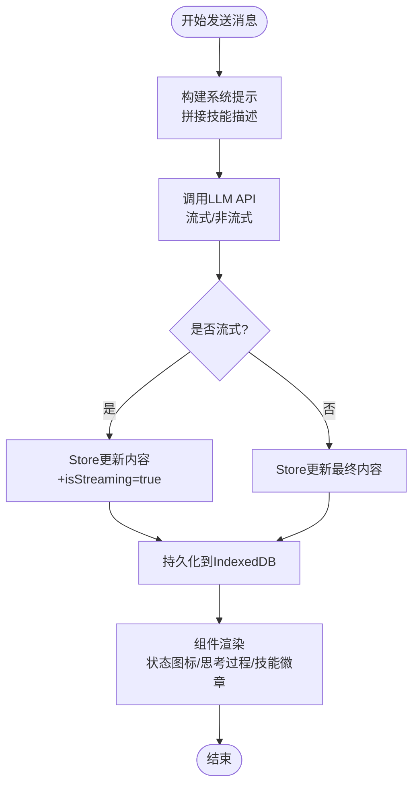
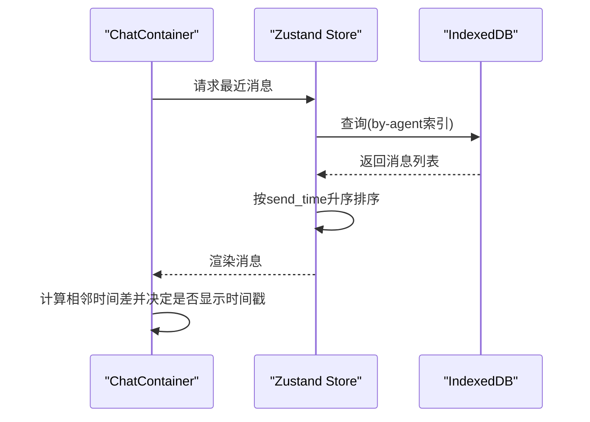
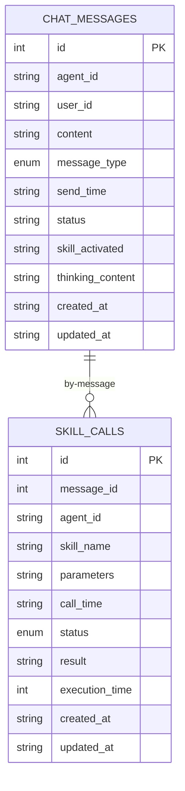
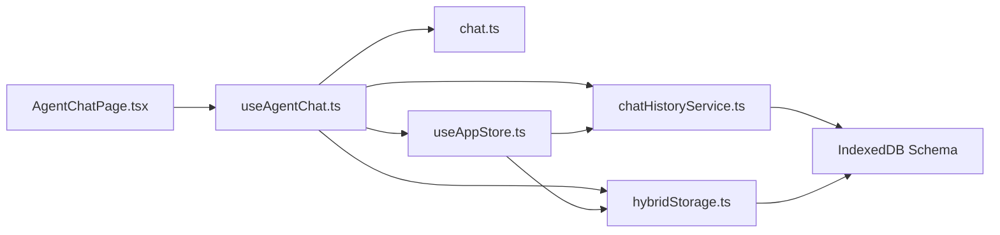

# 消息管理机制

<cite>
**本文引用的文件**
- [src/types/chat.ts](file://src/types/chat.ts)
- [src/services/chatHistoryService.ts](file://src/services/chatHistoryService.ts)
- [src/services/hybridStorage.ts](file://src/services/hybridStorage.ts)
- [src/components/chat/MessageBubble.tsx](file://src/components/chat/MessageBubble.tsx)
- [src/components/chat/EnhancedMessageBubble.tsx](file://src/components/chat/EnhancedMessageBubble.tsx)
- [src/components/chat/ChatContainer.tsx](file://src/components/chat/ChatContainer.tsx)
- [src/hooks/useAgentChat.ts](file://src/hooks/useAgentChat.ts)
- [src/store/useAppStore.ts](file://src/store/useAppStore.ts)
- [src/pages/AgentChatPage.tsx](file://src/pages/AgentChatPage.tsx)
- [docs/非功能设计/可扩展性设计.md](file://docs/非功能设计/可扩展性设计.md)
- [docs/数据层设计/数据库设计.md](file://docs/数据层设计/数据库设计.md)
- [.trae/documents/修复聊天记录加载问题计划.md](file://.trae/documents/修复聊天记录加载问题计划.md)
</cite>

## 目录
1. [简介](#简介)
2. [项目结构](#项目结构)
3. [核心组件](#核心组件)
4. [架构总览](#架构总览)
5. [详细组件分析](#详细组件分析)
6. [依赖关系分析](#依赖关系分析)
7. [性能考虑](#性能考虑)
8. [故障排查指南](#故障排查指南)
9. [结论](#结论)
10. [附录](#附录)

## 简介
本文件系统化梳理 AutoMate 项目的“消息管理机制”，覆盖消息状态管理、消息类型定义与生命周期、内容处理与状态更新、实时消息同步、存储策略与历史记录管理、时间戳处理与排序、去重与扩展开发指南、缓存策略与性能优化等方面。目标是帮助开发者快速理解并高效扩展消息相关能力。

## 项目结构
消息管理相关代码主要分布在前端页面、组件、服务与状态管理模块，并通过统一的类型定义与服务封装形成清晰的职责边界。

图表来源
- [src/pages/AgentChatPage.tsx](file://src/pages/AgentChatPage.tsx#L1-L24)
- [src/store/useAppStore.ts](file://src/store/useAppStore.ts#L17-L33)
- [src/components/chat/ChatContainer.tsx](file://src/components/chat/ChatContainer.tsx#L478-L670)
- [src/components/chat/MessageBubble.tsx](file://src/components/chat/MessageBubble.tsx#L1-L90)
- [src/components/chat/EnhancedMessageBubble.tsx](file://src/components/chat/EnhancedMessageBubble.tsx#L1-L217)
- [src/hooks/useAgentChat.ts](file://src/hooks/useAgentChat.ts#L1-L128)
- [src/services/chatHistoryService.ts](file://src/services/chatHistoryService.ts#L1-L244)
- [src/services/hybridStorage.ts](file://src/services/hybridStorage.ts#L1-L262)
- [src/types/chat.ts](file://src/types/chat.ts#L36-L51)
- [docs/非功能设计/可扩展性设计.md](file://docs/非功能设计/可扩展性设计.md#L191-L265)
- [docs/数据层设计/数据库设计.md](file://docs/数据层设计/数据库设计.md#L681-L728)
- [.trae/documents/修复聊天记录加载问题计划.md](file://.trae/documents/修复聊天记录加载问题计划.md#L57-L94)

章节来源
- [src/pages/AgentChatPage.tsx](file://src/pages/AgentChatPage.tsx#L1-L24)
- [src/store/useAppStore.ts](file://src/store/useAppStore.ts#L17-L33)
- [src/components/chat/ChatContainer.tsx](file://src/components/chat/ChatContainer.tsx#L478-L670)
- [src/components/chat/MessageBubble.tsx](file://src/components/chat/MessageBubble.tsx#L1-L90)
- [src/components/chat/EnhancedMessageBubble.tsx](file://src/components/chat/EnhancedMessageBubble.tsx#L1-L217)
- [src/hooks/useAgentChat.ts](file://src/hooks/useAgentChat.ts#L1-L128)
- [src/services/chatHistoryService.ts](file://src/services/chatHistoryService.ts#L1-L244)
- [src/services/hybridStorage.ts](file://src/services/hybridStorage.ts#L1-L262)
- [src/types/chat.ts](file://src/types/chat.ts#L36-L51)
- [docs/非功能设计/可扩展性设计.md](file://docs/非功能设计/可扩展性设计.md#L191-L265)
- [docs/数据层设计/数据库设计.md](file://docs/数据层设计/数据库设计.md#L681-L728)
- [.trae/documents/修复聊天记录加载问题计划.md](file://.trae/documents/修复聊天记录加载问题计划.md#L57-L94)

## 核心组件
- 消息类型与LLM交互：定义消息结构、系统提示构建、流式与非流式对话接口。
- 状态管理：Zustand Store 维护每智能体的消息列表、状态、时间戳与流式状态。
- 组件层：基础与增强消息气泡负责渲染、状态图标、思考过程与技能徽章。
- 服务层：IndexedDB 封装用于消息与技能调用的增删改查；混合存储负责热数据清理。
- 页面与Hook：页面路由选择智能体，Hook 负责消息发送与流式接收。

章节来源
- [src/types/chat.ts](file://src/types/chat.ts#L36-L51)
- [src/store/useAppStore.ts](file://src/store/useAppStore.ts#L17-L33)
- [src/components/chat/MessageBubble.tsx](file://src/components/chat/MessageBubble.tsx#L1-L90)
- [src/components/chat/EnhancedMessageBubble.tsx](file://src/components/chat/EnhancedMessageBubble.tsx#L1-L217)
- [src/services/chatHistoryService.ts](file://src/services/chatHistoryService.ts#L1-L244)
- [src/services/hybridStorage.ts](file://src/services/hybridStorage.ts#L1-L262)
- [src/hooks/useAgentChat.ts](file://src/hooks/useAgentChat.ts#L1-L128)
- [src/pages/AgentChatPage.tsx](file://src/pages/AgentChatPage.tsx#L1-L24)

## 架构总览
消息从用户输入开始，经由 Hook 发送到 LLM，流式或一次性返回内容，写入状态与IndexedDB，组件渲染并展示状态与时间戳，同时支持热数据清理与历史查询。

图表来源
- [src/pages/AgentChatPage.tsx](file://src/pages/AgentChatPage.tsx#L1-L24)
- [src/hooks/useAgentChat.ts](file://src/hooks/useAgentChat.ts#L51-L127)
- [src/store/useAppStore.ts](file://src/store/useAppStore.ts#L143-L209)
- [src/services/chatHistoryService.ts](file://src/services/chatHistoryService.ts#L87-L120)
- [src/services/hybridStorage.ts](file://src/services/hybridStorage.ts#L129-L163)

## 详细组件分析

### 消息类型与生命周期
- 类型定义：消息包含角色(system/user/assistant)、内容、时间戳等；状态枚举包括 sending/sent/delivered/read/failed。
- 生命周期：发送前生成临时ID与时间戳；流式过程中逐步更新内容与状态；完成后持久化到IndexedDB；支持删除最后一条AI消息等操作。
- 系统提示：根据智能体技能动态拼接系统提示，影响消息上下文构建。

图表来源
- [src/store/useAppStore.ts](file://src/store/useAppStore.ts#L17-L33)
- [src/types/chat.ts](file://src/types/chat.ts#L36-L51)

章节来源
- [src/store/useAppStore.ts](file://src/store/useAppStore.ts#L17-L33)
- [src/types/chat.ts](file://src/types/chat.ts#L36-L51)
- [src/hooks/useAgentChat.ts](file://src/hooks/useAgentChat.ts#L51-L127)

### 内容处理与状态更新机制
- 流式处理：Hook 使用异步迭代器逐块推送内容，Store 以不可变方式更新消息内容与流式标记。
- 非流式处理：一次返回后直接更新最终内容。
- 状态图标：用户侧显示发送中/已送达/已读/失败等状态图标，便于反馈。
- 思考过程与技能徽章：增强气泡支持展示思考过程与已激活技能，提升可观测性。

图表来源
- [src/hooks/useAgentChat.ts](file://src/hooks/useAgentChat.ts#L84-L119)
- [src/store/useAppStore.ts](file://src/store/useAppStore.ts#L167-L209)
- [src/services/chatHistoryService.ts](file://src/services/chatHistoryService.ts#L87-L120)
- [src/components/chat/EnhancedMessageBubble.tsx](file://src/components/chat/EnhancedMessageBubble.tsx#L62-L96)

章节来源
- [src/hooks/useAgentChat.ts](file://src/hooks/useAgentChat.ts#L84-L119)
- [src/store/useAppStore.ts](file://src/store/useAppStore.ts#L167-L209)
- [src/components/chat/EnhancedMessageBubble.tsx](file://src/components/chat/EnhancedMessageBubble.tsx#L62-L96)

### 实时消息同步与时间戳处理
- 时间戳：消息创建时写入ISO字符串；组件层按需格式化为“今天/日期”显示。
- 时间戳分隔：相邻消息超过一定分钟数才显示时间戳，避免冗余。
- 排序：按 send_time 升序排列，保证时间线正确。

图表来源
- [src/components/chat/ChatContainer.tsx](file://src/components/chat/ChatContainer.tsx#L478-L508)
- [src/services/chatHistoryService.ts](file://src/services/chatHistoryService.ts#L210-L229)
- [src/services/hybridStorage.ts](file://src/services/hybridStorage.ts#L165-L184)

章节来源
- [src/components/chat/ChatContainer.tsx](file://src/components/chat/ChatContainer.tsx#L478-L508)
- [src/services/chatHistoryService.ts](file://src/services/chatHistoryService.ts#L210-L229)
- [src/services/hybridStorage.ts](file://src/services/hybridStorage.ts#L165-L184)

### 消息存储策略、历史记录管理与数据持久化
- IndexedDB 设计：chat_messages 与 skill_calls 两张表，分别建立 by-agent、by-send-time、by-agent-send-time 等索引。
- 写入：保存消息时写入 content、message_type、send_time、status、skill_activated、thinking_content 等字段。
- 读取：支持按 agentId 查询，支持 since 过滤与时间排序；提供最近24小时查询。
- 删除：支持删除指定消息、删除最后一条AI消息、按消息ID删除技能调用记录。
- 混合存储：每日检查并清理过期热数据（默认3天），避免无限增长。

图表来源
- [src/services/chatHistoryService.ts](file://src/services/chatHistoryService.ts#L3-L57)
- [src/services/hybridStorage.ts](file://src/services/hybridStorage.ts#L39-L59)

章节来源
- [src/services/chatHistoryService.ts](file://src/services/chatHistoryService.ts#L3-L57)
- [src/services/chatHistoryService.ts](file://src/services/chatHistoryService.ts#L87-L120)
- [src/services/chatHistoryService.ts](file://src/services/chatHistoryService.ts#L210-L243)
- [src/services/hybridStorage.ts](file://src/services/hybridStorage.ts#L89-L127)
- [src/services/hybridStorage.ts](file://src/services/hybridStorage.ts#L129-L200)

### 消息时间戳处理、去重与排序算法
- 时间戳处理：统一使用 ISO 字符串存储；渲染时按“今天/日期”格式化。
- 时间戳分隔：相邻消息时间差超过阈值才显示时间戳，减少视觉噪音。
- 排序算法：按 send_time 升序排序，确保时间线一致。
- 去重策略：当前未见显式去重逻辑，建议在写入前基于 content+send_time+agent_id 做幂等键校验（扩展建议）。

章节来源
- [src/components/chat/ChatContainer.tsx](file://src/components/chat/ChatContainer.tsx#L478-L508)
- [src/services/chatHistoryService.ts](file://src/services/chatHistoryService.ts#L226-L228)
- [src/services/hybridStorage.ts](file://src/services/hybridStorage.ts#L177-L178)

### 消息扩展开发指南
- 自定义消息类型：参考可扩展性设计中的消息类型接口，新增类型并在渲染层适配。
- 消息处理器：参考消息处理器注册模式，为新类型实现处理器并注册到调度器。
- 新增字段：在 IndexedDB Schema 中增加字段索引，迁移已有数据；在消息类型中补充字段定义。

章节来源
- [docs/非功能设计/可扩展性设计.md](file://docs/非功能设计/可扩展性设计.md#L191-L265)

### 缓存策略、内存管理与性能优化
- 内存缓存：Store 中维护每智能体的消息数组，按需更新；组件使用 React.memo 与 useMemo 降低重渲染。
- 本地缓存：IndexedDB 作为持久化缓存；混合存储定期清理热数据，避免无限增长。
- 渲染优化：聊天容器支持时间戳分隔与状态图标；组件层对 Markdown 渲染做轻量优化。
- 数据库优化：为高频查询字段建立索引；分页加载与时间范围过滤。

章节来源
- [src/store/useAppStore.ts](file://src/store/useAppStore.ts#L143-L209)
- [src/components/chat/EnhancedMessageBubble.tsx](file://src/components/chat/EnhancedMessageBubble.tsx#L162-L189)
- [src/services/hybridStorage.ts](file://src/services/hybridStorage.ts#L89-L127)
- [docs/数据层设计/数据库设计.md](file://docs/数据层设计/数据库设计.md#L681-L728)

## 依赖关系分析
- 页面依赖组件与Hook；组件依赖Store与服务；Hook依赖类型定义与服务；服务依赖IndexedDB。
- 查询与排序修复：针对聊天记录加载问题，简化了按 agentId 查询后再内存过滤的逻辑，并添加调试日志。

图表来源
- [src/pages/AgentChatPage.tsx](file://src/pages/AgentChatPage.tsx#L1-L24)
- [src/hooks/useAgentChat.ts](file://src/hooks/useAgentChat.ts#L1-L128)
- [src/types/chat.ts](file://src/types/chat.ts#L1-L280)
- [src/store/useAppStore.ts](file://src/store/useAppStore.ts#L1-L306)
- [src/services/chatHistoryService.ts](file://src/services/chatHistoryService.ts#L1-L244)
- [src/services/hybridStorage.ts](file://src/services/hybridStorage.ts#L1-L262)

章节来源
- [src/pages/AgentChatPage.tsx](file://src/pages/AgentChatPage.tsx#L1-L24)
- [src/hooks/useAgentChat.ts](file://src/hooks/useAgentChat.ts#L1-L128)
- [src/types/chat.ts](file://src/types/chat.ts#L1-L280)
- [src/store/useAppStore.ts](file://src/store/useAppStore.ts#L1-L306)
- [src/services/chatHistoryService.ts](file://src/services/chatHistoryService.ts#L1-L244)
- [src/services/hybridStorage.ts](file://src/services/hybridStorage.ts#L1-L262)
- [.trae/documents/修复聊天记录加载问题计划.md](file://.trae/documents/修复聊天记录加载问题计划.md#L57-L94)

## 性能考虑
- 虚拟滚动：长消息列表建议采用虚拟滚动减少DOM节点。
- 组件优化：使用 React.memo、useCallback、useMemo 控制重渲染。
- 数据库索引：确保按 agent_id、send_time、agent_send_time 等字段建立索引。
- 分页与范围查询：按时间范围过滤，限制返回数量，避免全表扫描。
- 热数据清理：定期清理过期数据，保持数据库规模可控。

章节来源
- [docs/数据层设计/数据库设计.md](file://docs/数据层设计/数据库设计.md#L681-L728)
- [src/services/hybridStorage.ts](file://src/services/hybridStorage.ts#L89-L127)

## 故障排查指南
- 聊天记录加载异常：检查 IndexedDB 查询逻辑与索引使用；确认按 agentId 查询后再按时间过滤；添加调试日志定位问题。
- 消息未显示时间戳：检查相邻消息的时间差阈值与格式化逻辑。
- 状态图标不更新：确认 Store 更新路径与组件订阅；检查 isStreaming 标记与状态枚举。
- 后端同步失败：核对同步接口签名与参数；检查数据库连接与事务提交。

章节来源
- [.trae/documents/修复聊天记录加载问题计划.md](file://.trae/documents/修复聊天记录加载问题计划.md#L57-L94)
- [src/components/chat/ChatContainer.tsx](file://src/components/chat/ChatContainer.tsx#L478-L508)
- [src/services/chatHistoryService.ts](file://src/services/chatHistoryService.ts#L210-L229)
- [docs/数据层设计/数据库设计.md](file://docs/数据层设计/数据库设计.md#L681-L728)

## 结论
本消息管理机制以类型安全的前端状态与服务层为核心，结合 IndexedDB 的持久化能力与混合存储的热数据清理策略，实现了稳定的消息生命周期管理。通过可扩展的消息类型与处理器模式，以及完善的性能优化与故障排查流程，为后续功能扩展提供了坚实基础。

## 附录
- 后端同步接口示例：提供消息同步与查询接口，支持按天数过滤与分页。
- 可扩展性设计：定义消息类型与处理器接口，便于新增消息类型与处理逻辑。

章节来源
- [docs/数据层设计/数据库设计.md](file://docs/数据层设计/数据库设计.md#L681-L728)
- [docs/非功能设计/可扩展性设计.md](file://docs/非功能设计/可扩展性设计.md#L191-L265)