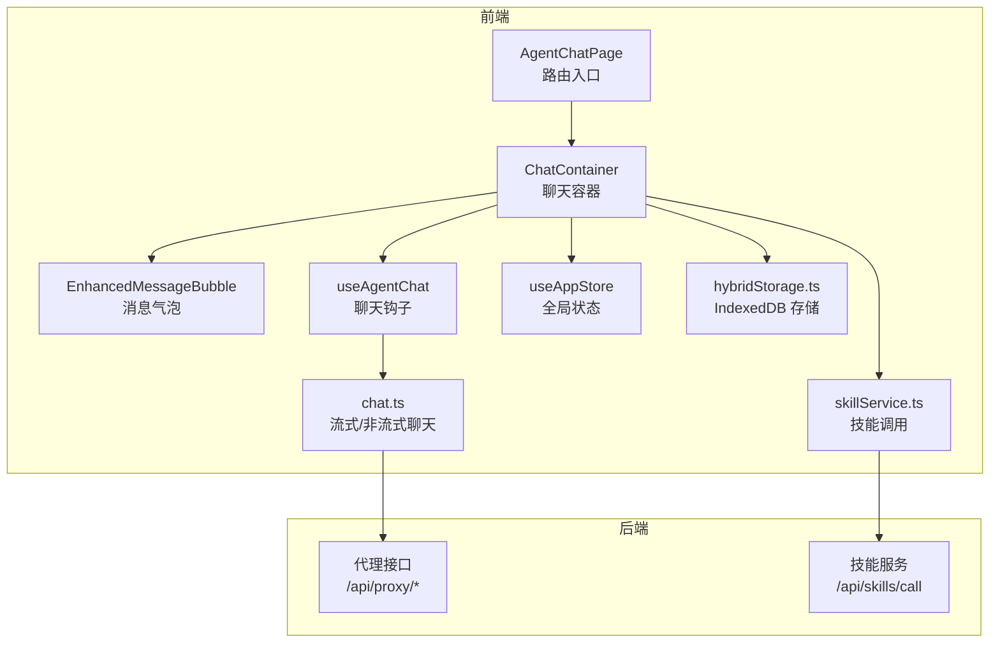
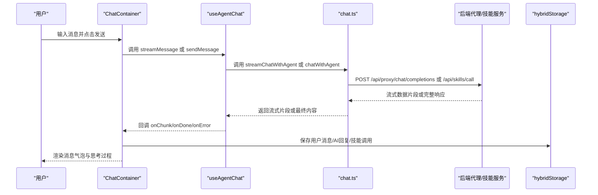
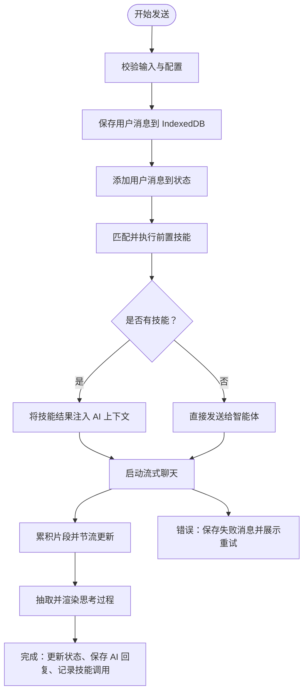
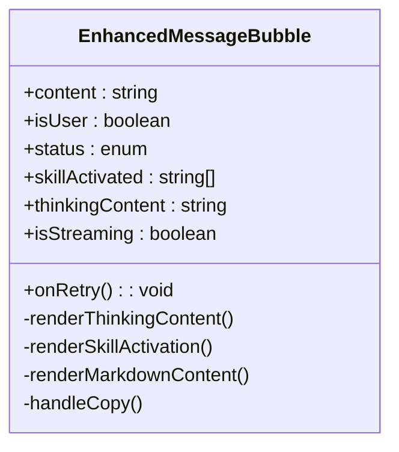
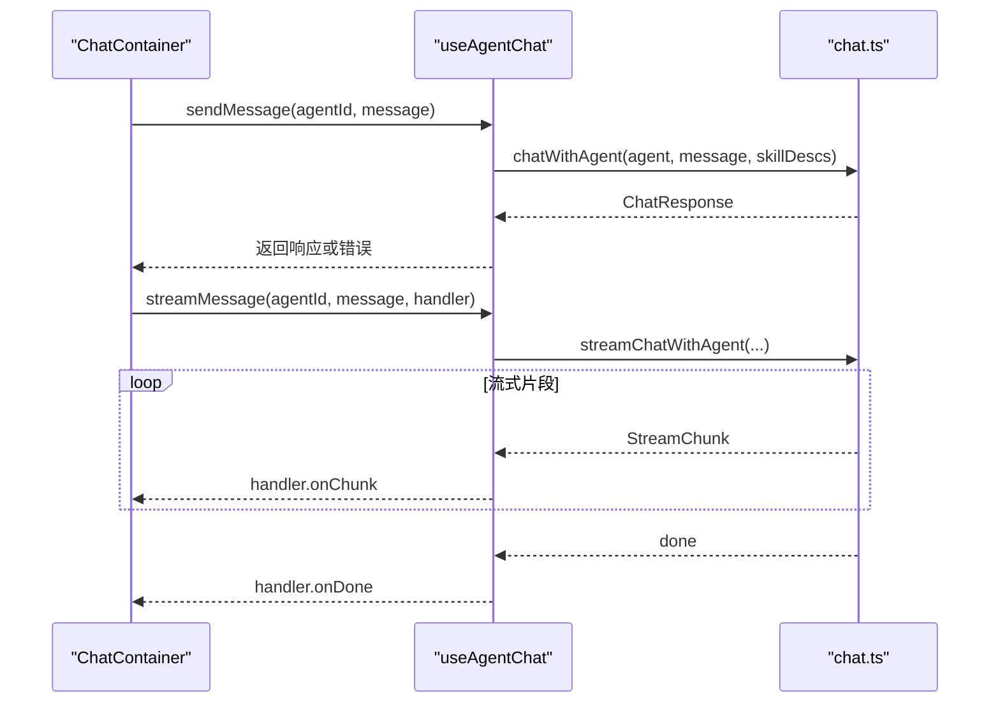
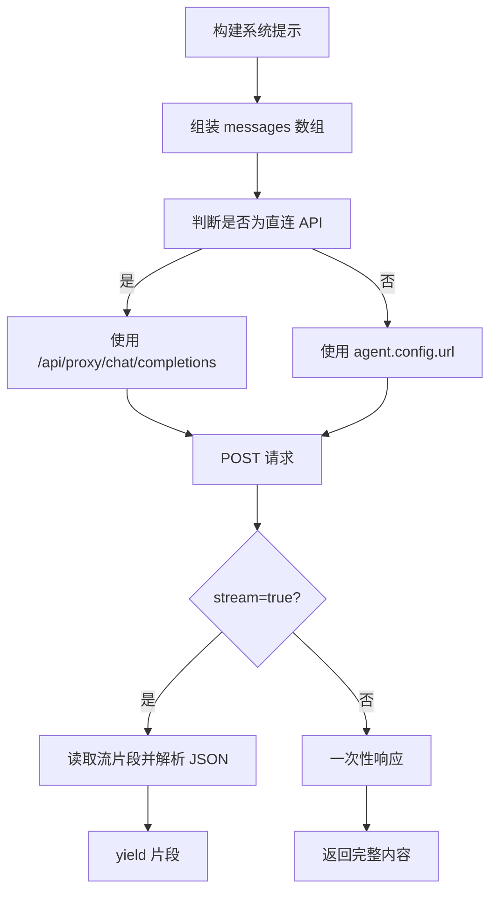
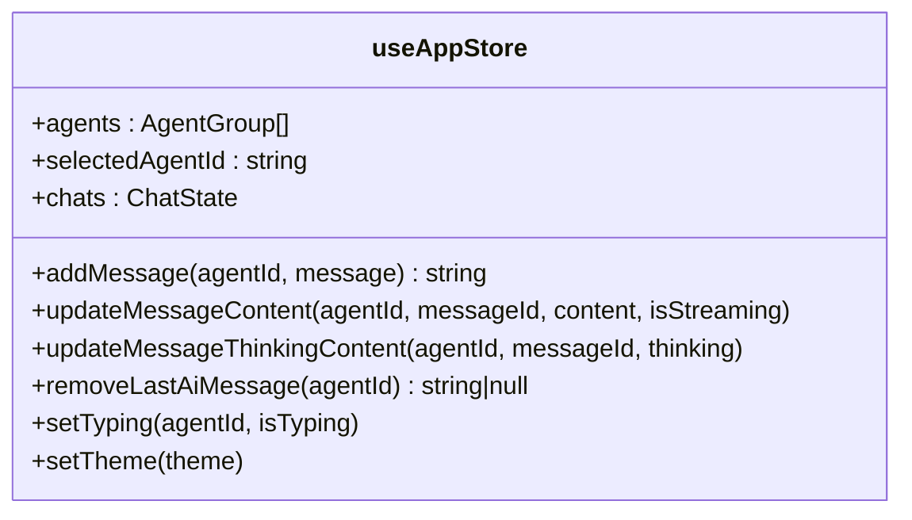
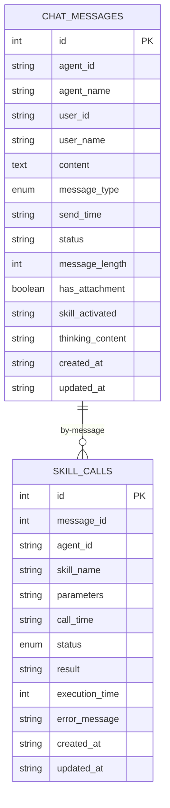
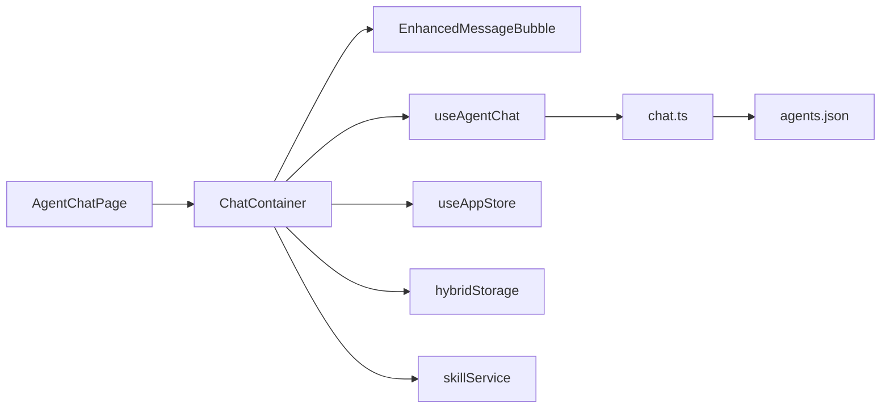

# 聊天交互

<cite>
**本文引用的文件**
- [src/types/chat.ts](file://src/types/chat.ts)
- [src/services/chatHistoryService.ts](file://src/services/chatHistoryService.ts)
- [src/hooks/useAgentChat.ts](file://src/hooks/useAgentChat.ts)
- [src/components/chat/ChatContainer.tsx](file://src/components/chat/ChatContainer.tsx)
- [src/components/chat/EnhancedMessageBubble.tsx](file://src/components/chat/EnhancedMessageBubble.tsx)
- [src/store/useAppStore.ts](file://src/store/useAppStore.ts)
- [src/services/hybridStorage.ts](file://src/services/hybridStorage.ts)
- [src/services/skillService.ts](file://src/services/skillService.ts)
- [config/agents.json](file://config/agents.json)
- [src/pages/AgentChatPage.tsx](file://src/pages/AgentChatPage.tsx)
- [docs/业务功能模块/聊天交互模块.md](file://docs/业务功能模块/聊天交互模块.md)
- [package.json](file://package.json)
- [skills/todo-query/SKILL.md](file://skills/todo-query/SKILL.md)
- [skills/weather_query/main.py](file://skills/weather_query/main.py)
</cite>

## 目录
1. [引言](#引言)
2. [项目结构](#项目结构)
3. [核心组件](#核心组件)
4. [架构总览](#架构总览)
5. [详细组件分析](#详细组件分析)
6. [依赖关系分析](#依赖关系分析)
7. [性能考虑](#性能考虑)
8. [故障排查指南](#故障排查指南)
9. [结论](#结论)
10. [附录](#附录)

## 引言
本文件面向希望深入理解并扩展 AutoMate 聊天交互系统的开发者与产品人员。文档围绕聊天界面设计、消息管理机制、实时通信实现、消息状态跟踪、流式输出处理、历史记录存储策略、消息类型与状态管理、UI 渲染优化、与后端 API 的数据交换与错误处理、网络异常恢复机制，以及性能优化与用户体验改进策略进行系统化说明，并提供扩展开发指南与自定义消息类型的实践建议。

## 项目结构
AutoMate 前端采用 React + TypeScript + Zustand 状态管理，结合浏览器 IndexedDB 实现本地混合存储；聊天交互模块由页面路由、聊天容器、消息气泡组件、Zustand store、聊天服务与技能服务等组成。后端通过代理接口与第三方模型网关对接，同时提供技能调用能力。

图表来源
- [src/pages/AgentChatPage.tsx](file://src/pages/AgentChatPage.tsx#L1-L24)
- [src/components/chat/ChatContainer.tsx](file://src/components/chat/ChatContainer.tsx#L1-L756)
- [src/components/chat/EnhancedMessageBubble.tsx](file://src/components/chat/EnhancedMessageBubble.tsx#L1-L217)
- [src/hooks/useAgentChat.ts](file://src/hooks/useAgentChat.ts#L1-L128)
- [src/types/chat.ts](file://src/types/chat.ts#L1-L280)
- [src/store/useAppStore.ts](file://src/store/useAppStore.ts#L1-L306)
- [src/services/hybridStorage.ts](file://src/services/hybridStorage.ts#L1-L262)
- [src/services/skillService.ts](file://src/services/skillService.ts#L1-L73)

章节来源
- [package.json](file://package.json#L1-L47)
- [docs/业务功能模块/聊天交互模块.md](file://docs/业务功能模块/聊天交互模块.md#L1-L269)

## 核心组件
- 聊天容器 ChatContainer：负责输入、发送、流式渲染、技能激活、历史加载、重试与错误处理。
- 消息气泡 EnhancedMessageBubble：渲染 Markdown 内容、思考过程折叠、技能徽章、复制与重试按钮。
- 聊天钩子 useAgentChat：封装与智能体的聊天交互，包括流式与非流式两种模式。
- 类型与聊天服务 chat.ts：定义消息与响应类型、构建系统提示、流式/非流式聊天、错误映射。
- 全局状态 useAppStore：统一管理 agents、selectedAgentId、聊天会话、消息列表、打字态与主题。
- 混合存储 hybridStorage.ts：IndexedDB 存储聊天消息与技能调用记录，带过期清理。
- 技能服务 skillService.ts：调用后端技能接口，封装超时与网络错误处理。
- 配置 agents.json：定义智能体分组、配置与技能清单。

章节来源
- [src/components/chat/ChatContainer.tsx](file://src/components/chat/ChatContainer.tsx#L1-L756)
- [src/components/chat/EnhancedMessageBubble.tsx](file://src/components/chat/EnhancedMessageBubble.tsx#L1-L217)
- [src/hooks/useAgentChat.ts](file://src/hooks/useAgentChat.ts#L1-L128)
- [src/types/chat.ts](file://src/types/chat.ts#L1-L280)
- [src/store/useAppStore.ts](file://src/store/useAppStore.ts#L1-L306)
- [src/services/hybridStorage.ts](file://src/services/hybridStorage.ts#L1-L262)
- [src/services/skillService.ts](file://src/services/skillService.ts#L1-L73)
- [config/agents.json](file://config/agents.json#L1-L119)

## 架构总览
聊天交互系统采用“前端状态驱动 + 浏览器本地存储 + 后端代理”的架构。用户输入经 ChatContainer 统一处理，通过 useAgentChat 与 chat.ts 的流式/非流式接口与后端通信；消息与技能调用记录持久化至 IndexedDB；EnhancedMessageBubble 负责 UI 展示与交互。

图表来源
- [src/components/chat/ChatContainer.tsx](file://src/components/chat/ChatContainer.tsx#L213-L392)
- [src/hooks/useAgentChat.ts](file://src/hooks/useAgentChat.ts#L84-L119)
- [src/types/chat.ts](file://src/types/chat.ts#L96-L189)
- [src/services/skillService.ts](file://src/services/skillService.ts#L12-L61)
- [src/services/hybridStorage.ts](file://src/services/hybridStorage.ts#L129-L184)

## 详细组件分析

### 聊天容器 ChatContainer
职责与特性
- 初始化混合存储，加载最近 24 小时的历史消息。
- 技能关键字匹配与前置执行：根据用户输入匹配技能，先行调用技能并把结果注入 AI 上下文。
- 流式输出：累积片段，节流更新，支持思考过程抽取与渲染。
- 错误处理：保存失败消息，展示错误并允许重试。
- 重试机制：删除最后一条 AI 消息及其技能调用记录，重新发起对话。
- UI 优化：滚动控制、时间戳分隔、主题适配、输入框自适应高度。

图表来源
- [src/components/chat/ChatContainer.tsx](file://src/components/chat/ChatContainer.tsx#L213-L392)
- [src/services/hybridStorage.ts](file://src/services/hybridStorage.ts#L129-L184)
- [src/services/skillService.ts](file://src/services/skillService.ts#L12-L61)

章节来源
- [src/components/chat/ChatContainer.tsx](file://src/components/chat/ChatContainer.tsx#L1-L756)

### 消息气泡 EnhancedMessageBubble
职责与特性
- 渲染 Markdown 内容，支持代码块高亮与行内代码样式。
- 展示技能激活徽章与“思考过程”折叠面板，支持展开/收起。
- 提供复制与重试按钮，重试仅对 AI 消息生效。
- 主题适配：深浅色下不同的气泡与边框样式。

图表来源
- [src/components/chat/EnhancedMessageBubble.tsx](file://src/components/chat/EnhancedMessageBubble.tsx#L1-L217)

章节来源
- [src/components/chat/EnhancedMessageBubble.tsx](file://src/components/chat/EnhancedMessageBubble.tsx#L1-L217)

### 聊天钩子 useAgentChat
职责与特性
- 在组件挂载时加载 agents.json 并预取技能描述，构建系统提示。
- 提供 sendMessage 与 streamMessage 两个接口，分别对应非流式与流式聊天。
- 统一错误处理与加载状态管理，避免重复请求。

图表来源
- [src/hooks/useAgentChat.ts](file://src/hooks/useAgentChat.ts#L1-L128)
- [src/types/chat.ts](file://src/types/chat.ts#L96-L189)

章节来源
- [src/hooks/useAgentChat.ts](file://src/hooks/useAgentChat.ts#L1-L128)

### 类型与聊天服务 chat.ts
职责与特性
- 定义 Agent、Skill、ChatMessage、ChatResponse、StreamChunk 等核心类型。
- 构建系统提示：从技能描述集合拼接技能说明，注入智能体系统角色。
- 流式聊天：基于 Fetch Streams 解析 SSE 风格数据，逐片产出。
- 非流式聊天：基于 axios 发送一次性请求，等待完整响应。
- 错误映射：区分网络错误、HTTP 错误与超时，返回标准化错误信息。

图表来源
- [src/types/chat.ts](file://src/types/chat.ts#L76-L189)

章节来源
- [src/types/chat.ts](file://src/types/chat.ts#L1-L280)

### 全局状态 useAppStore
职责与特性
- 统一管理 agents、selectedAgentId、搜索与侧边栏状态。
- 维护每个 agentId 对应的聊天状态（messages、isTyping）。
- 提供添加消息、更新内容、更新思考内容、移除最后一条 AI 消息、设置打字态等方法。
- 主题与全局状态管理。

图表来源
- [src/store/useAppStore.ts](file://src/store/useAppStore.ts#L1-L306)

章节来源
- [src/store/useAppStore.ts](file://src/store/useAppStore.ts#L1-L306)

### 混合存储 hybridStorage.ts 与 chatHistoryService.ts
职责与特性
- hybridStorage.ts：以 IndexedDB 为核心，提供消息与技能调用的增删改查、过期清理（默认 3 天热数据）。
- chatHistoryService.ts：与 hybridStorage 功能一致，但使用 idb 的 DBSchema 定义更严格的索引与类型约束。
- 两者均提供最近 24 小时消息查询、删除最后一条 AI 消息、删除某消息关联的技能调用记录等能力。

图表来源
- [src/services/hybridStorage.ts](file://src/services/hybridStorage.ts#L3-L59)
- [src/services/chatHistoryService.ts](file://src/services/chatHistoryService.ts#L3-L57)

章节来源
- [src/services/hybridStorage.ts](file://src/services/hybridStorage.ts#L1-L262)
- [src/services/chatHistoryService.ts](file://src/services/chatHistoryService.ts#L1-L244)

### 技能服务 skillService.ts
职责与特性
- 调用后端 /api/skills/call 接口执行技能，支持超时与网络错误处理。
- 返回统一的 SkillResult 结构，便于 ChatContainer 注入上下文或展示结果。

章节来源
- [src/services/skillService.ts](file://src/services/skillService.ts#L1-L73)

### 配置 agents.json
职责与特性
- 定义智能体分组、智能体基础信息、模型网关地址、API Key、模型名称与技能清单。
- ChatContainer 与 useAgentChat 在初始化时加载该配置，构建系统提示与技能描述。

章节来源
- [config/agents.json](file://config/agents.json#L1-L119)

### 路由与页面 AgentChatPage
职责与特性
- 从 URL 中解析 agentId，设置全局选中智能体，并渲染 ChatContainer。

章节来源
- [src/pages/AgentChatPage.tsx](file://src/pages/AgentChatPage.tsx#L1-L24)

## 依赖关系分析
- 组件依赖：AgentChatPage -> ChatContainer -> EnhancedMessageBubble。
- 状态依赖：ChatContainer 依赖 useAppStore 管理消息与打字态。
- 服务依赖：ChatContainer 依赖 hybridStorage 与 skillService；useAgentChat 依赖 chat.ts；chat.ts 依赖 axios/fetch 与后端代理。
- 配置依赖：agents.json 为智能体与技能配置来源。

图表来源
- [src/pages/AgentChatPage.tsx](file://src/pages/AgentChatPage.tsx#L1-L24)
- [src/components/chat/ChatContainer.tsx](file://src/components/chat/ChatContainer.tsx#L1-L756)
- [src/hooks/useAgentChat.ts](file://src/hooks/useAgentChat.ts#L1-L128)
- [src/types/chat.ts](file://src/types/chat.ts#L1-L280)
- [config/agents.json](file://config/agents.json#L1-L119)

章节来源
- [package.json](file://package.json#L1-L47)

## 性能考虑
- 流式渲染节流：ChatContainer 使用定时器合并片段更新，减少频繁重渲染。
- 本地存储热数据清理：hybridStorage 默认保留 3 天热数据，每日首次访问清理过期数据，降低索引扫描成本。
- 消息分页与时间范围：最近 24 小时加载策略，避免一次性加载大量历史消息。
- UI 自适应：输入框高度自适应、滚动到最新消息、时间戳分隔减少 DOM 节点密度。
- 状态集中管理：Zustand 避免深层 props 传递，提升渲染性能。

[本节为通用性能指导，无需特定文件引用]

## 故障排查指南
常见问题与定位
- 流式输出异常：检查 chat.ts 的流式解析逻辑与后端代理返回格式；确认代理接口可达与鉴权头正确。
- 技能调用失败：查看 skillService 的错误映射，确认 /api/skills/call 是否正常；检查技能脚本返回结构。
- 历史消息缺失：确认 hybridStorage 初始化与最近 24 小时查询逻辑；检查 IndexedDB 索引是否存在。
- 重试无效：确认 removeLastAiMessage 与 deleteSkillCallByMessageId 的消息 ID 一致性。

章节来源
- [src/types/chat.ts](file://src/types/chat.ts#L211-L260)
- [src/services/skillService.ts](file://src/services/skillService.ts#L34-L61)
- [src/services/hybridStorage.ts](file://src/services/hybridStorage.ts#L165-L184)
- [src/components/chat/ChatContainer.tsx](file://src/components/chat/ChatContainer.tsx#L400-L433)

## 结论
AutoMate 聊天交互模块通过清晰的组件边界、完善的流式渲染与本地存储策略、以及统一的错误处理与主题适配，实现了稳定且可扩展的聊天体验。借助技能前置执行与系统提示构建，系统具备良好的上下文感知能力。后续可在消息类型扩展、多模态内容渲染、离线同步与更细粒度的性能优化方面持续演进。

[本节为总结性内容，无需特定文件引用]

## 附录

### 消息类型与状态管理
- 消息类型：用户消息、智能体消息、系统消息。
- 状态流转：sending → sent → delivered → read（可扩展为 failed）。
- 状态更新：通过 useAppStore 的方法集中更新，保证 UI 与存储一致性。

章节来源
- [src/store/useAppStore.ts](file://src/store/useAppStore.ts#L17-L33)
- [src/components/chat/EnhancedMessageBubble.tsx](file://src/components/chat/EnhancedMessageBubble.tsx#L19-L23)

### 实时通信与后端 API
- 流式聊天：基于 Fetch Streams，解析 data: 行并逐片产出。
- 非流式聊天：基于 axios，等待完整响应。
- 代理接口：对特定网关使用 /api/proxy/chat/completions，统一鉴权头与请求体。

章节来源
- [src/types/chat.ts](file://src/types/chat.ts#L96-L189)

### 历史记录存储策略
- 热数据保留：默认 3 天，每日首次访问清理过期数据。
- 最近 24 小时加载：按 agentId 与时间索引查询，排序展示。
- 关联删除：删除 AI 消息时同步删除其技能调用记录。

章节来源
- [src/services/hybridStorage.ts](file://src/services/hybridStorage.ts#L89-L115)
- [src/services/hybridStorage.ts](file://src/services/hybridStorage.ts#L165-L184)
- [src/services/hybridStorage.ts](file://src/services/hybridStorage.ts#L246-L255)

### 扩展开发指南
- 自定义消息类型：在 chat.ts 新增类型并在 UI 中渲染；在 useAppStore 中扩展状态字段。
- 交互增强：在 ChatContainer 中增加新的技能关键字映射或规则引擎；在 EnhancedMessageBubble 中新增渲染组件。
- 技能集成：在 agents.json 中注册新技能；在 skillService 中处理返回结构；在 ChatContainer 中决定是否前置执行。
- 后端对接：遵循 /api/skills/call 协议，确保超时与错误码规范化。

章节来源
- [src/types/chat.ts](file://src/types/chat.ts#L36-L51)
- [config/agents.json](file://config/agents.json#L17-L39)
- [src/services/skillService.ts](file://src/services/skillService.ts#L12-L61)
- [src/components/chat/ChatContainer.tsx](file://src/components/chat/ChatContainer.tsx#L105-L172)

### 示例技能参考
- 待办查询技能：通过 SKILL.md 描述入口与参数，Python 脚本实现查询逻辑。
- 天气查询技能：通过 OpenWeatherMap API 获取天气数据并格式化输出。

章节来源
- [skills/todo-query/SKILL.md](file://skills/todo-query/SKILL.md#L1-L24)
- [skills/weather_query/main.py](file://skills/weather_query/main.py#L1-L139)