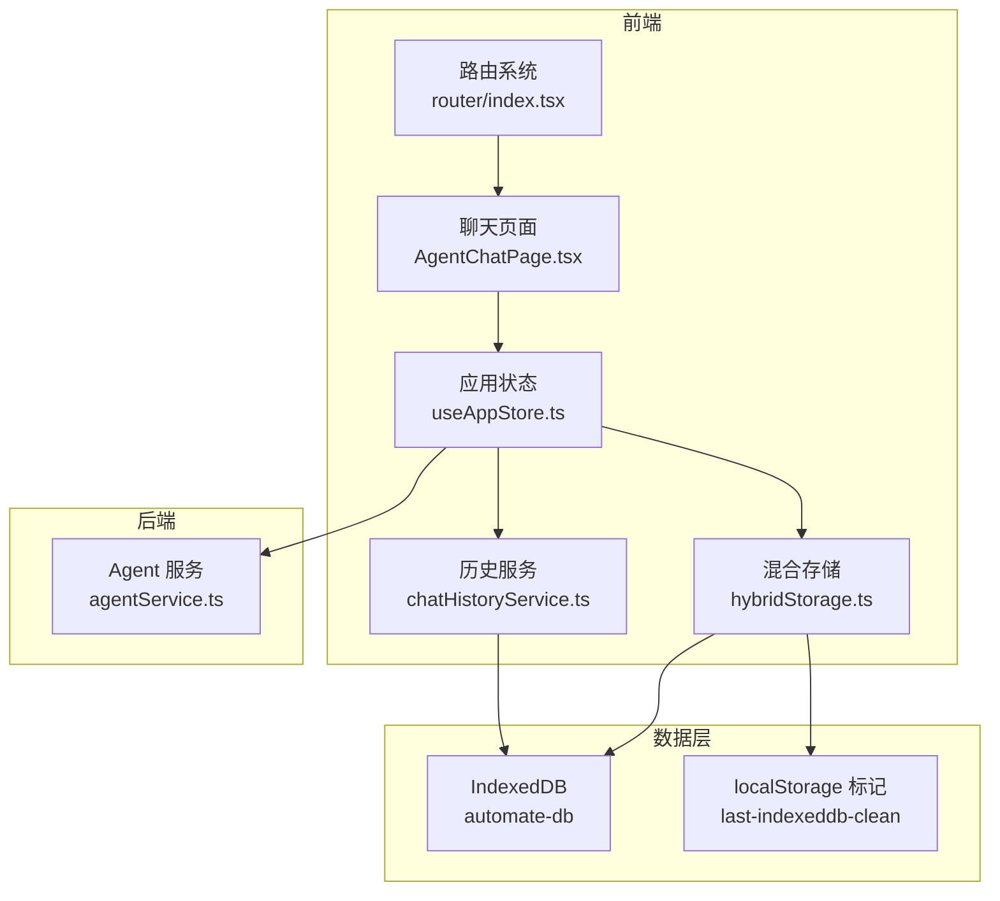
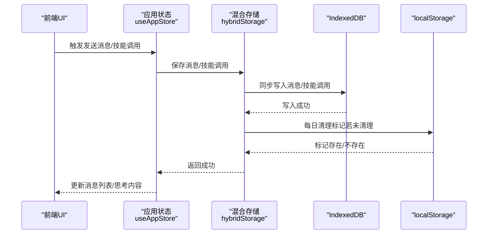
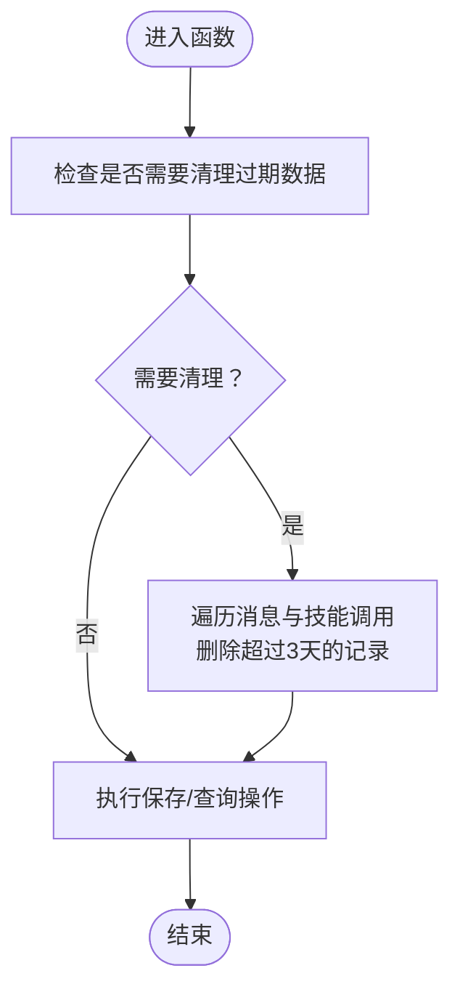
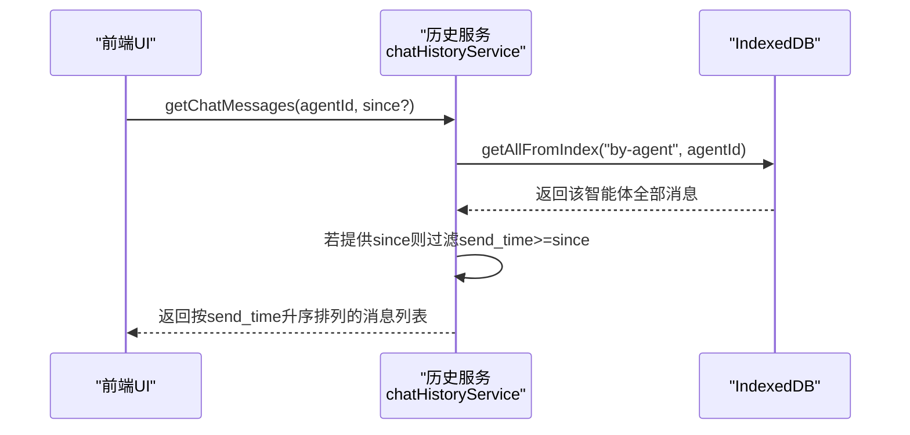
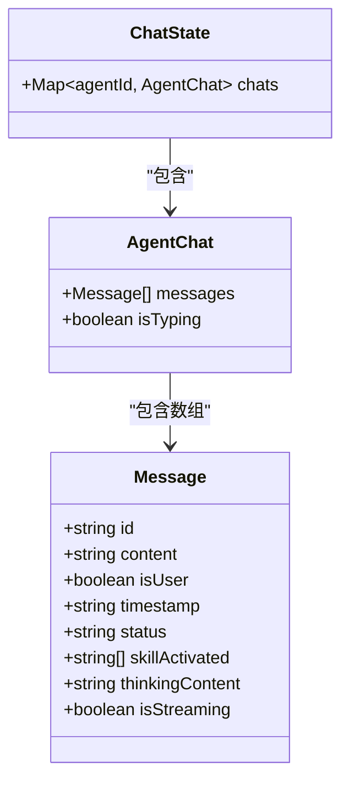
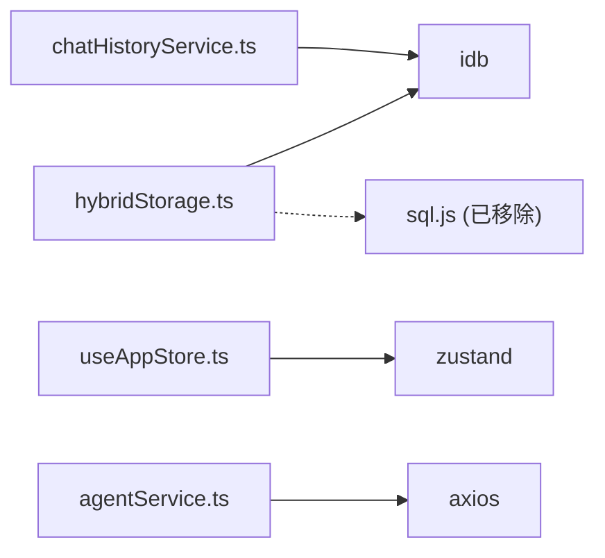

# 聊天历史存储

<cite>
**本文引用的文件**
- [src/services/chatHistoryService.ts](file://src/services/chatHistoryService.ts)
- [src/services/hybridStorage.ts](file://src/services/hybridStorage.ts)
- [src/scripts/clearDatabase.ts](file://src/scripts/clearDatabase.ts)
- [src/types/chat.ts](file://src/types/chat.ts)
- [src/store/useAppStore.ts](file://src/store/useAppStore.ts)
- [src/pages/AgentChatPage.tsx](file://src/pages/AgentChatPage.tsx)
- [src/router/index.tsx](file://src/router/index.tsx)
- [package.json](file://package.json)
- [docs/数据层设计/数据库设计.md](file://docs/数据层设计/数据库设计.md)
- [.trae/documents/修复sql.js加载错误计划.md](file://.trae/documents/修复sql.js加载错误计划.md)
- [backend/services/agentService.ts](file://backend/services/agentService.ts)
</cite>

## 目录
1. [简介](#简介)
2. [项目结构](#项目结构)
3. [核心组件](#核心组件)
4. [架构总览](#架构总览)
5. [详细组件分析](#详细组件分析)
6. [依赖关系分析](#依赖关系分析)
7. [性能考量](#性能考量)
8. [故障排查指南](#故障排查指南)
9. [结论](#结论)
10. [附录](#附录)

## 简介
本文件面向“聊天历史存储”主题，系统化阐述 AutoMate 项目的混合存储架构、数据持久化策略与数据库设计，覆盖消息历史加载、存储优化、数据迁移机制、本地存储管理与数据同步策略，并提供历史记录清理、存储空间管理、性能优化建议、存储扩展指南、自定义存储后端与数据备份恢复方案，以及数据完整性保证、并发访问控制与错误恢复机制。

## 项目结构
围绕聊天历史存储的关键文件与职责如下：
- 前端存储与服务
  - 混合存储服务：统一管理 IndexedDB 的消息与技能调用记录，负责过期清理与基础 CRUD。
  - 历史记录服务：提供更丰富的查询接口，支持按智能体与时间范围检索。
  - 应用状态管理：Zustand store 维护聊天界面消息流与 UI 状态。
  - 页面与路由：AgentChatPage 与路由系统承载聊天容器渲染与智能体选择。
- 后端服务
  - Agent 服务：封装外部模型调用，为聊天提供响应来源。
- 文档与脚本
  - 数据库设计文档：定义混合存储策略、索引与同步接口。
  - 清理脚本：一键清空 IndexedDB 与相关标记，便于调试与重置。
  - 修复计划文档：明确 sql.js 加载问题的解决方案，最终采用纯 IndexedDB 方案。

图表来源
- [src/router/index.tsx](file://src/router/index.tsx#L1-L43)
- [src/pages/AgentChatPage.tsx](file://src/pages/AgentChatPage.tsx#L1-L24)
- [src/store/useAppStore.ts](file://src/store/useAppStore.ts#L1-L306)
- [src/services/hybridStorage.ts](file://src/services/hybridStorage.ts#L1-L262)
- [src/services/chatHistoryService.ts](file://src/services/chatHistoryService.ts#L1-L244)
- [backend/services/agentService.ts](file://backend/services/agentService.ts#L1-L245)

章节来源
- [src/router/index.tsx](file://src/router/index.tsx#L1-L43)
- [src/pages/AgentChatPage.tsx](file://src/pages/AgentChatPage.tsx#L1-L24)
- [src/store/useAppStore.ts](file://src/store/useAppStore.ts#L1-L306)
- [src/services/hybridStorage.ts](file://src/services/hybridStorage.ts#L1-L262)
- [src/services/chatHistoryService.ts](file://src/services/chatHistoryService.ts#L1-L244)
- [backend/services/agentService.ts](file://backend/services/agentService.ts#L1-L245)

## 核心组件
- 混合存储服务（hybridStorage.ts）
  - 提供 IndexedDB 数据库初始化、消息与技能调用的增删改查。
  - 实现“热数据（最近3天）+ 过期清理”的策略，结合 localStorage 标记确保每日清理。
  - 对外暴露：保存消息、获取最近24小时消息、删除最后一条AI消息、保存技能调用、获取技能调用等。
- 历史记录服务（chatHistoryService.ts）
  - 在混合存储基础上提供更丰富的查询能力，如按 agentId 与 since 时间过滤。
  - 对外暴露：保存消息、更新消息、删除消息、删除最后一条AI消息、按 agentId 获取消息、按 agentId 获取技能调用、获取最近24小时消息等。
- 应用状态管理（useAppStore.ts）
  - 维护每个智能体的消息数组、输入状态、打字态、主题与全局状态。
  - 提供消息增删改与思考内容更新等操作，支撑 UI 展示与交互。
- 页面与路由（AgentChatPage.tsx、router/index.tsx）
  - 路由系统承载页面导航；聊天页面负责选择当前智能体并渲染聊天容器。
- 后端服务（agentService.ts）
  - 代理外部模型调用，返回聊天响应，为前端提供数据源。

章节来源
- [src/services/hybridStorage.ts](file://src/services/hybridStorage.ts#L1-L262)
- [src/services/chatHistoryService.ts](file://src/services/chatHistoryService.ts#L1-L244)
- [src/store/useAppStore.ts](file://src/store/useAppStore.ts#L1-L306)
- [src/pages/AgentChatPage.tsx](file://src/pages/AgentChatPage.tsx#L1-L24)
- [src/router/index.tsx](file://src/router/index.tsx#L1-L43)
- [backend/services/agentService.ts](file://backend/services/agentService.ts#L1-L245)

## 架构总览
混合存储架构采用“主存储（SQLite）+ 热缓存（IndexedDB）”的分层缓存策略。当前仓库已采用纯 IndexedDB 方案，结合 localStorage 标记实现过期清理与数据持久化备份。整体读写流程如下：

图表来源
- [src/store/useAppStore.ts](file://src/store/useAppStore.ts#L143-L165)
- [src/services/hybridStorage.ts](file://src/services/hybridStorage.ts#L129-L163)
- [src/services/hybridStorage.ts](file://src/services/hybridStorage.ts#L117-L127)

章节来源
- [src/services/hybridStorage.ts](file://src/services/hybridStorage.ts#L89-L127)
- [src/services/hybridStorage.ts](file://src/services/hybridStorage.ts#L129-L163)
- [src/store/useAppStore.ts](file://src/store/useAppStore.ts#L143-L165)

## 详细组件分析

### 混合存储服务（hybridStorage.ts）
- 数据模型与索引
  - 聊天消息表：包含 agent_id、send_time、skill_activated 等字段，建立 by-agent、by-send-time、by-agent-send-time、by-skill-activated 等索引。
  - 技能调用表：包含 message_id、agent_id、call_time、status 等字段，建立 by-message、by-call-time、by-agent 等索引。
- 初始化与升级
  - 使用 idb.openDB 初始化数据库，首次打开时创建对象存储与索引。
- 过期清理策略
  - 通过 localStorage 记录上次清理日期，每日首次调用时清理超过 HOT_DATA_DAYS（3天）的历史数据。
- 关键接口
  - 保存消息/技能调用：写入 IndexedDB 并记录时间戳。
  - 获取最近24小时消息：基于索引查询并按时间排序。
  - 删除最后一条AI消息：按类型筛选并删除最新一条。
  - 获取技能调用：按 agent_id 排序返回。
  - 初始化：打开数据库并触发过期清理。

图表来源
- [src/services/hybridStorage.ts](file://src/services/hybridStorage.ts#L89-L127)
- [src/services/hybridStorage.ts](file://src/services/hybridStorage.ts#L129-L163)

章节来源
- [src/services/hybridStorage.ts](file://src/services/hybridStorage.ts#L39-L87)
- [src/services/hybridStorage.ts](file://src/services/hybridStorage.ts#L89-L127)
- [src/services/hybridStorage.ts](file://src/services/hybridStorage.ts#L129-L262)

### 历史记录服务（chatHistoryService.ts）
- 数据模型与索引
  - 与混合存储一致，提供更丰富的查询接口。
- 关键接口
  - 保存消息：填充时间戳与长度，写入 IndexedDB。
  - 更新/删除消息：按 id 获取并更新或删除。
  - 按 agentId 获取消息：可选 since 参数进行时间过滤。
  - 获取技能调用：按 agentId 排序返回。
  - 最近24小时消息：内部构造 since=now-1day 后复用通用查询。

图表来源
- [src/services/chatHistoryService.ts](file://src/services/chatHistoryService.ts#L210-L229)

章节来源
- [src/services/chatHistoryService.ts](file://src/services/chatHistoryService.ts#L37-L57)
- [src/services/chatHistoryService.ts](file://src/services/chatHistoryService.ts#L210-L243)

### 应用状态管理（useAppStore.ts）
- 聊天状态结构
  - 每个 agentId 对应一个消息数组，包含 id、content、isUser、timestamp、status、skillActivated、thinkingContent、isStreaming 等字段。
- 关键动作
  - addMessage：生成唯一 messageId，追加新消息。
  - updateMessageContent：按 id 更新内容与流式状态。
  - updateMessageThinkingContent：按 id 更新思考内容。
  - removeLastAiMessage：从尾部查找并移除最后一条非用户消息。
  - setTyping：切换智能体的打字态。
- 与存储的关系
  - store 仅维护 UI 状态与消息流；实际持久化由 hybridStorage 或历史服务负责。

图表来源
- [src/store/useAppStore.ts](file://src/store/useAppStore.ts#L17-L33)

章节来源
- [src/store/useAppStore.ts](file://src/store/useAppStore.ts#L17-L33)
- [src/store/useAppStore.ts](file://src/store/useAppStore.ts#L143-L240)

### 页面与路由（AgentChatPage.tsx、router/index.tsx）
- 路由系统
  - 定义根路径、智能体聊天页与设置页，支持通配符重定向。
- 聊天页面
  - 从 URL 参数提取 agentId，设置到全局状态，随后渲染 ChatContainer。

章节来源
- [src/router/index.tsx](file://src/router/index.tsx#L1-L43)
- [src/pages/AgentChatPage.tsx](file://src/pages/AgentChatPage.tsx#L1-L24)

### 后端服务（agentService.ts）
- 功能概述
  - 加载智能体配置与技能描述，构建系统提示词，调用外部模型接口获取响应。
- 与前端交互
  - 前端通过 store 与服务层协作，store 负责 UI 状态，agentService 负责外部调用。

章节来源
- [backend/services/agentService.ts](file://backend/services/agentService.ts#L58-L185)

### 数据库设计与混合存储策略
- 混合存储策略
  - 主存储：SQLite（冷数据，全部历史）。
  - 热缓存：IndexedDB（热数据，最近3天）。
- 存储策略与淘汰
  - 聊天消息与技能调用均遵循“全部历史进 SQLite，最近3天进 IndexedDB”的原则。
  - 每日首次调用时清理过期热数据，确保缓存容量可控。
- 索引设计
  - 聊天消息：by-agent、by-send-time、by-agent-send-time、by-skill-activated。
  - 技能调用：by-message、by-call-time、by-agent。
- 同步与一致性
  - 写入：先写 SQLite，再异步批量写入 IndexedDB。
  - 读取：优先从 IndexedDB 读取，未命中则回退到 SQLite。
  - 冲突处理：以 SQLite 为准，定期从 SQLite 同步最新数据到 IndexedDB。

章节来源
- [docs/数据层设计/数据库设计.md](file://docs/数据层设计/数据库设计.md#L597-L738)

### SQL.js 集成与纯 IndexedDB 方案
- 问题背景
  - sql.js 在 Vite 打包环境下默认导出与 wasm 加载存在兼容性问题。
- 解决策略
  - 采用“纯 IndexedDB 方案”：移除 sql.js 依赖，使用 IndexedDB 作为唯一存储，并将 SQLite 数据持久化到 localStorage（Base64 编码）作为备份。
- 影响范围
  - hybridStorage.ts 移除对 sqlStorage.ts 的依赖，将 SQLite 相关调用改为纯 IndexedDB 操作。
  - ChatContainer.tsx 简化初始化逻辑或移除相关调用。

章节来源
- [.trae/documents/修复sql.js加载错误计划.md](file://.trae/documents/修复sql.js加载错误计划.md#L1-L34)
- [src/services/hybridStorage.ts](file://src/services/hybridStorage.ts#L1-L262)

## 依赖关系分析
- 前端依赖
  - idb：IndexedDB 封装，提供 openDB、DBSchema 等能力。
  - zustand：轻量状态管理。
  - axios：HTTP 请求（后端服务）。
  - sql.js：原计划用于 SQLite 存储，现已移除。
- 包管理
  - package.json 中声明了上述依赖，确保运行时可用。

图表来源
- [package.json](file://package.json#L15-L26)
- [src/services/hybridStorage.ts](file://src/services/hybridStorage.ts#L1)
- [src/services/chatHistoryService.ts](file://src/services/chatHistoryService.ts#L1)
- [src/store/useAppStore.ts](file://src/store/useAppStore.ts#L1)
- [backend/services/agentService.ts](file://backend/services/agentService.ts#L1)

章节来源
- [package.json](file://package.json#L15-L26)

## 性能考量
- 索引与查询
  - 为聊天消息与技能调用建立复合索引，支持按 agent_id、send_time、message_id 等字段高效查询。
- 缓存策略
  - 热数据（最近3天）驻留 IndexedDB，显著降低高频查询延迟。
- 清理与容量
  - 每日清理过期数据，避免缓存无限增长；localStorage 标记确保幂等执行。
- 异步写入
  - 写入流程中，SQLite 同步写入成功后再进行异步批量写入，保证一致性与用户体验。

章节来源
- [src/services/hybridStorage.ts](file://src/services/hybridStorage.ts#L89-L127)
- [docs/数据层设计/数据库设计.md](file://docs/数据层设计/数据库设计.md#L641-L666)

## 故障排查指南
- 清理数据库
  - 使用内置脚本一键清空 SQLite 数据（localStorage）、IndexedDB 数据与清理标记，便于重置与调试。
- sql.js 加载错误
  - 若仍出现 sql.js 相关报错，确认已移除相关依赖与引用，采用纯 IndexedDB 方案。
- 数据加载异常
  - 检查 localStorage 中的清理标记是否正确更新；确认混合存储初始化是否完成。
- 后端调用失败
  - 检查 agentService 的外部接口地址、鉴权头与超时配置，查看错误返回信息。

章节来源
- [src/scripts/clearDatabase.ts](file://src/scripts/clearDatabase.ts#L1-L41)
- [.trae/documents/修复sql.js加载错误计划.md](file://.trae/documents/修复sql.js加载错误计划.md#L1-L34)
- [backend/services/agentService.ts](file://backend/services/agentService.ts#L135-L184)

## 结论
本项目采用“纯 IndexedDB + localStorage 标记”的混合存储策略，兼顾性能与可靠性。通过合理的索引设计、每日过期清理与严格的初始化流程，确保聊天历史的高效加载与稳定持久化。同时，文档化的同步策略与错误恢复机制为后续扩展与维护提供了清晰路径。

## 附录

### 数据模型与索引（概要）
- 聊天消息表
  - 字段：agent_id、agent_name、user_id、user_name、content、message_type、send_time、status、message_length、has_attachment、attachment_path、skill_activated、thinking_content、created_at、updated_at。
  - 索引：by-agent、by-send-time、by-agent-send-time、by-skill-activated。
- 技能调用表
  - 字段：message_id、agent_id、skill_name、parameters、call_time、status、result、execution_time、error_message、created_at、updated_at。
  - 索引：by-message、by-call-time、by-agent。

章节来源
- [src/services/hybridStorage.ts](file://src/services/hybridStorage.ts#L39-L59)
- [src/services/chatHistoryService.ts](file://src/services/chatHistoryService.ts#L37-L57)
- [docs/数据层设计/数据库设计.md](file://docs/数据层设计/数据库设计.md#L641-L666)

### 存储扩展指南
- 新增存储后端
  - 在 hybridStorage.ts 中新增适配层，保持对外接口一致，内部路由至新后端。
- 数据迁移
  - 基于现有索引与查询模式，编写迁移脚本，确保数据结构与索引同步变更。
- 备份与恢复
  - 利用 localStorage 备份 IndexedDB 数据（Base64 编码），提供导入导出接口。

章节来源
- [docs/数据层设计/数据库设计.md](file://docs/数据层设计/数据库设计.md#L597-L738)

### 数据完整性、并发与错误恢复
- 完整性
  - 写入顺序与回退策略：先写 SQLite，再异步写入 IndexedDB；读取优先 IndexedDB，未命中回退 SQLite。
- 并发
  - IndexedDB 事务与串行化写入，避免竞态条件；UI 状态通过 store 单向数据流管理。
- 错误恢复
  - 清理脚本一键重置；sql.js 问题采用纯 IndexedDB 方案规避；后端调用失败提供明确错误信息。

章节来源
- [src/services/hybridStorage.ts](file://src/services/hybridStorage.ts#L129-L163)
- [src/scripts/clearDatabase.ts](file://src/scripts/clearDatabase.ts#L1-L41)
- [backend/services/agentService.ts](file://backend/services/agentService.ts#L161-L184)