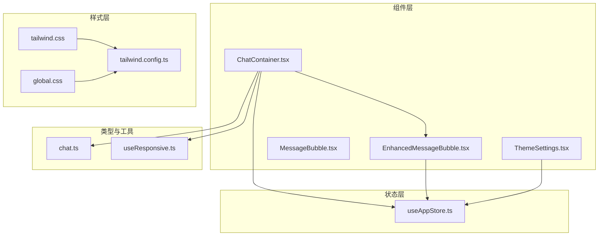
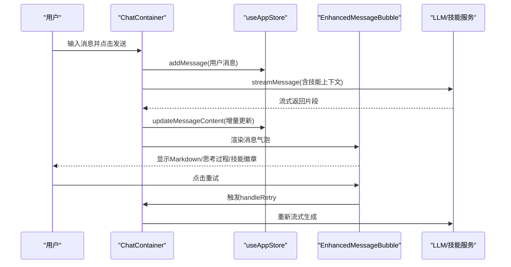
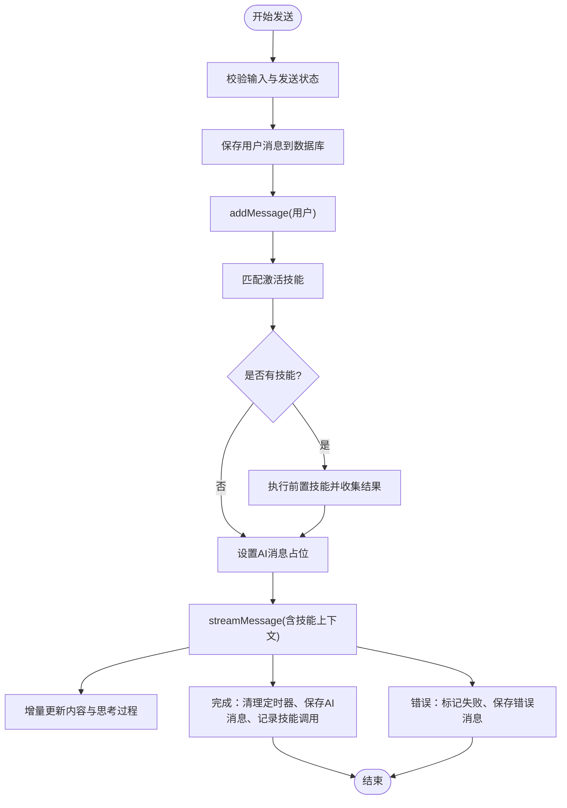
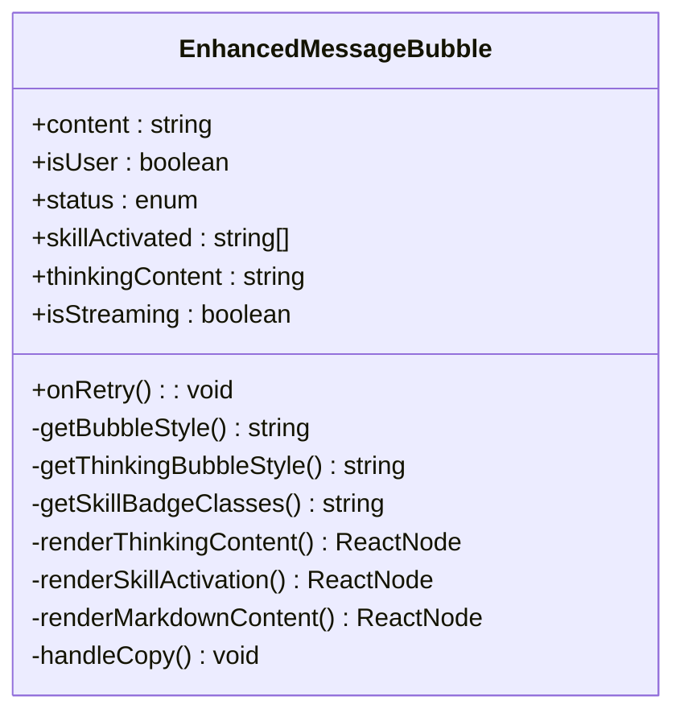
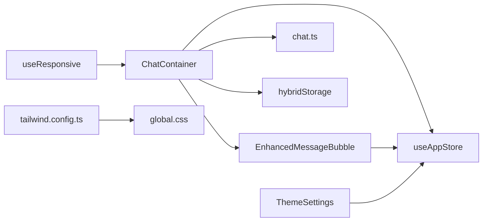

# 聊天界面设计

<cite>
**本文档引用的文件**
- [ChatContainer.tsx](file://src/components/chat/ChatContainer.tsx)
- [EnhancedMessageBubble.tsx](file://src/components/chat/EnhancedMessageBubble.tsx)
- [MessageBubble.tsx](file://src/components/chat/MessageBubble.tsx)
- [useResponsive.ts](file://src/hooks/useResponsive.ts)
- [tailwind.css](file://src/styles/tailwind.css)
- [useAppStore.ts](file://src/store/useAppStore.ts)
- [ThemeSettings.tsx](file://src/components/theme/ThemeSettings.tsx)
- [tailwind.config.ts](file://tailwind.config.ts)
- [global.css](file://src/styles/global.css)
- [chat.ts](file://src/types/chat.ts)
- [package.json](file://package.json)
- [postcss.config.js](file://postcss.config.js)
</cite>

## 目录
1. [引言](#引言)
2. [项目结构](#项目结构)
3. [核心组件](#核心组件)
4. [架构总览](#架构总览)
5. [详细组件分析](#详细组件分析)
6. [依赖关系分析](#依赖关系分析)
7. [性能考虑](#性能考虑)
8. [故障排除指南](#故障排除指南)
9. [结论](#结论)
10. [附录](#附录)

## 引言
本文件面向前端开发者与UI/UX设计师，系统化阐述 AutoMate 聊天界面的设计与实现，重点覆盖 ChatContainer 组件的整体架构、布局结构与样式系统；消息气泡组件的设计原理、用户头像与智能体头像的视觉设计；响应式布局、主题适配与动画效果；类名系统、CSS 变量与 Tailwind CSS 的集成方式；以及界面定制、颜色主题配置与组件样式扩展方案。同时提供滚动行为、自动定位与交互优化策略，帮助读者快速理解并高效扩展聊天界面。

## 项目结构
聊天界面位于前端源码的组件目录中，采用按功能分层组织：
- 组件层：聊天容器、消息气泡、主题设置等
- 样式层：Tailwind CSS 集成、全局 CSS 变量与暗色主题适配
- 状态层：Zustand 应用状态管理，统一维护聊天会话与主题配置
- 类型层：聊天相关类型定义与流式接口
- 工具钩子：响应式断点与媒体查询工具

**图表来源**
- [ChatContainer.tsx](file://src/components/chat/ChatContainer.tsx#L1-L756)
- [EnhancedMessageBubble.tsx](file://src/components/chat/EnhancedMessageBubble.tsx#L1-L217)
- [MessageBubble.tsx](file://src/components/chat/MessageBubble.tsx#L1-L90)
- [ThemeSettings.tsx](file://src/components/theme/ThemeSettings.tsx#L1-L262)
- [tailwind.css](file://src/styles/tailwind.css#L1-L4)
- [tailwind.config.ts](file://tailwind.config.ts#L1-L161)
- [global.css](file://src/styles/global.css#L1-L664)
- [useAppStore.ts](file://src/store/useAppStore.ts#L1-L306)
- [chat.ts](file://src/types/chat.ts#L1-L280)
- [useResponsive.ts](file://src/hooks/useResponsive.ts#L1-L110)

**章节来源**
- [ChatContainer.tsx](file://src/components/chat/ChatContainer.tsx#L1-L756)
- [tailwind.css](file://src/styles/tailwind.css#L1-L4)
- [tailwind.config.ts](file://tailwind.config.ts#L1-L161)
- [global.css](file://src/styles/global.css#L1-L664)
- [useAppStore.ts](file://src/store/useAppStore.ts#L1-L306)
- [chat.ts](file://src/types/chat.ts#L1-L280)
- [useResponsive.ts](file://src/hooks/useResponsive.ts#L1-L110)

## 核心组件
- ChatContainer：聊天主容器，负责消息渲染、输入处理、滚动控制、技能激活与流式响应、重试与停止等交互逻辑。
- EnhancedMessageBubble：增强消息气泡，支持 Markdown 渲染、思考过程展开/折叠、技能徽章展示、复制与重试操作。
- MessageBubble：基础消息气泡（当前版本以 EnhancedMessageBubble 为主）。
- ThemeSettings：主题配置面板，支持明/暗主题切换、颜色与字体参数调整、导出/导入主题。
- useAppStore：应用状态中心，统一管理 agents、chats、主题与用户设置。
- useResponsive：响应式断点与设备方向检测工具。

**章节来源**
- [ChatContainer.tsx](file://src/components/chat/ChatContainer.tsx#L13-L756)
- [EnhancedMessageBubble.tsx](file://src/components/chat/EnhancedMessageBubble.tsx#L16-L217)
- [MessageBubble.tsx](file://src/components/chat/MessageBubble.tsx#L11-L90)
- [ThemeSettings.tsx](file://src/components/theme/ThemeSettings.tsx#L4-L262)
- [useAppStore.ts](file://src/store/useAppStore.ts#L56-L306)
- [useResponsive.ts](file://src/hooks/useResponsive.ts#L14-L110)

## 架构总览
聊天界面采用“容器-展示”分层设计：
- ChatContainer 作为容器组件，聚合状态、事件与渲染逻辑，向下传递 props 到消息气泡组件。
- EnhancedMessageBubble 专注单条消息的展示与交互，内部通过 Zustand 读取主题状态，动态计算样式类名。
- 主题系统由 useAppStore 提供，ThemeSettings 支持用户自定义主题参数并通过 Tailwind CSS 与 CSS 变量生效。
- 响应式系统通过 useResponsive 与 Tailwind 断点配合，确保多端一致体验。

**图表来源**
- [ChatContainer.tsx](file://src/components/chat/ChatContainer.tsx#L213-L392)
- [EnhancedMessageBubble.tsx](file://src/components/chat/EnhancedMessageBubble.tsx#L16-L217)
- [useAppStore.ts](file://src/store/useAppStore.ts#L143-L210)

**章节来源**
- [ChatContainer.tsx](file://src/components/chat/ChatContainer.tsx#L213-L392)
- [EnhancedMessageBubble.tsx](file://src/components/chat/EnhancedMessageBubble.tsx#L16-L217)
- [useAppStore.ts](file://src/store/useAppStore.ts#L143-L210)

## 详细组件分析

### ChatContainer 组件分析
- 整体架构
  - 使用 Zustand 管理 agents、chats、主题与用户设置。
  - 通过 useAgentChat 提供流式消息能力，结合 hybridStorage 实现本地持久化。
  - 内置技能关键词匹配与前置技能执行，将结果注入 AI 上下文。
- 布局结构
  - 顶部栏：智能体头像、名称与描述。
  - 聊天区域：消息列表、时间戳分隔、打字指示器、空态提示。
  - 输入区域：文本域、附件按钮、发送/停止按钮。
- 样式系统
  - 通过 get*Classes 方法根据 theme 返回不同类名，实现明/暗主题切换。
  - 头像颜色通过 getAvatarGradient 与 getAvatarIcon 动态选择。
  - 输入区与按钮区采用统一的圆角、阴影与过渡动画。
- 交互与滚动
  - 自动滚动至底部，监听滚动位置显示“回到底部”按钮。
  - 支持键盘快捷键（回车发送）、文本域自适应高度。
- 错误处理与重试
  - 错误消息保存并标记为失败状态。
  - 重试逻辑移除最后一条 AI 消息并重新发起流式生成。

**图表来源**
- [ChatContainer.tsx](file://src/components/chat/ChatContainer.tsx#L213-L392)

**章节来源**
- [ChatContainer.tsx](file://src/components/chat/ChatContainer.tsx#L13-L756)

### 消息气泡组件分析
- 设计原理
  - 用户消息：绿色渐变气泡，右侧圆角收尾，突出用户立场。
  - 智能体消息：深色/浅色背景，左侧圆角收尾，区分来源。
  - 支持 Markdown 渲染，代码块高亮与行内代码样式。
- 交互功能
  - 思考过程：可展开/折叠，流式更新时自动展开。
  - 技能徽章：展示本次对话激活的技能名称与状态。
  - 操作按钮：复制内容、重试生成（仅智能体消息）。
- 样式系统
  - 通过 getBubbleStyle、getThinkingBubbleStyle、getSkillBadgeClasses 动态计算类名。
  - 与主题状态联动，实现明/暗主题下的色彩与边框适配。

**图表来源**
- [EnhancedMessageBubble.tsx](file://src/components/chat/EnhancedMessageBubble.tsx#L6-L24)

**章节来源**
- [EnhancedMessageBubble.tsx](file://src/components/chat/EnhancedMessageBubble.tsx#L16-L217)

### 头像与视觉设计
- 用户头像
  - 固定蓝色渐变背景，带阴影与图标，尺寸固定。
- 智能体头像
  - 支持三种颜色（默认蓝色、紫色、橙色），通过 avatarColor 选择渐变与图标。
  - 头像容器具备悬停缩放、发光与科技环等动画效果（来自全局样式）。
- 时间戳与打字指示器
  - 时间戳分隔线与气泡样式随主题变化。
  - 打字指示器三点弹跳动画，延迟错开形成节奏感。

**章节来源**
- [ChatContainer.tsx](file://src/components/chat/ChatContainer.tsx#L530-L598)
- [global.css](file://src/styles/global.css#L531-L594)

### 响应式布局与主题适配
- 响应式断点
  - 使用自定义断点常量与 useBreakpoint/useMediaQuery 检测设备尺寸与方向。
  - 在小屏设备上优化输入区域与消息最大宽度，保证可读性。
- 主题适配
  - 明/暗主题通过 CSS 变量与 Tailwind 配置实现无缝切换。
  - ThemeSettings 提供颜色、字体、动画等参数的可视化配置与导入导出。

**章节来源**
- [useResponsive.ts](file://src/hooks/useResponsive.ts#L3-L41)
- [ThemeSettings.tsx](file://src/components/theme/ThemeSettings.tsx#L34-L106)
- [tailwind.config.ts](file://tailwind.config.ts#L147-L154)

### 动画效果与交互优化
- 动画系统
  - Tailwind 配置内置多种动画（淡入、滑入、脉冲、旋转、浮动、打字弹跳）。
  - 打字指示器使用 typing-bounce 关键帧，三点延迟错开。
- 交互优化
  - 文本域自适应高度，限制最小/最大高度。
  - 滚动到底部按钮仅在接近顶部时显示，避免遮挡内容。
  - Markdown 渲染优化：代码块与行内代码样式分离，提升可读性。

**章节来源**
- [tailwind.config.ts](file://tailwind.config.ts#L98-L146)
- [ChatContainer.tsx](file://src/components/chat/ChatContainer.tsx#L42-L713)
- [EnhancedMessageBubble.tsx](file://src/components/chat/EnhancedMessageBubble.tsx#L162-L189)

### 类名系统、CSS 变量与 Tailwind 集成
- 类名系统
  - ChatContainer 通过 get*Classes 方法集中生成类名，便于主题切换与样式复用。
  - 消息气泡内部通过条件判断与主题状态动态拼接类名。
- CSS 变量
  - :root 定义主色、辅色、文本/背景/边框、字体、间距、圆角、过渡时间等。
  - .dark-theme 通过覆盖变量实现暗色主题。
- Tailwind 集成
  - tailwind.css 引入基础、组件与工具类。
  - tailwind.config.ts 扩展颜色、字体、间距、圆角、动画与断点。
  - PostCSS 自动前缀与 Tailwind 处理链路完整。

**章节来源**
- [global.css](file://src/styles/global.css#L1-L129)
- [tailwind.css](file://src/styles/tailwind.css#L1-L4)
- [tailwind.config.ts](file://tailwind.config.ts#L9-L155)
- [postcss.config.js](file://postcss.config.js#L1-L7)

### 界面定制指南与扩展方案
- 主题定制
  - 通过 ThemeSettings 调整主/辅色、文本/背景/边框色、字体大小/粗细、动画开关与时长。
  - 导出/导入主题配置，便于团队共享与版本化管理。
- 组件样式扩展
  - ChatContainer：新增 get*Classes 方法或引入新的条件分支，适配新主题或布局需求。
  - EnhancedMessageBubble：扩展 Markdown 渲染组件映射，增加表格、链接等样式。
- 动画与交互
  - 在 tailwind.config.ts 中新增 keyframes 与动画类，复用动画时长与缓动函数。
  - 通过 CSS 变量统一管理过渡时间，保持全局一致性。

**章节来源**
- [ThemeSettings.tsx](file://src/components/theme/ThemeSettings.tsx#L108-L260)
- [tailwind.config.ts](file://tailwind.config.ts#L109-L146)
- [global.css](file://src/styles/global.css#L81-L84)

## 依赖关系分析
- 组件依赖
  - ChatContainer 依赖 useAppStore、useAgentChat、EnhancedMessageBubble、hybridStorage。
  - EnhancedMessageBubble 依赖 useAppStore 读取主题状态。
- 样式依赖
  - Tailwind CSS 与全局 CSS 变量共同驱动主题与动画。
  - 响应式依赖 useResponsive 与 Tailwind 断点。
- 类型与服务
  - chat.ts 定义流式接口与系统提示构建，支撑 ChatContainer 的消息流处理。

**图表来源**
- [ChatContainer.tsx](file://src/components/chat/ChatContainer.tsx#L1-L30)
- [EnhancedMessageBubble.tsx](file://src/components/chat/EnhancedMessageBubble.tsx#L25-L26)
- [ThemeSettings.tsx](file://src/components/theme/ThemeSettings.tsx#L5-L6)
- [tailwind.config.ts](file://tailwind.config.ts#L1-L161)
- [global.css](file://src/styles/global.css#L1-L664)
- [useResponsive.ts](file://src/hooks/useResponsive.ts#L14-L41)
- [chat.ts](file://src/types/chat.ts#L96-L189)

**章节来源**
- [ChatContainer.tsx](file://src/components/chat/ChatContainer.tsx#L1-L30)
- [EnhancedMessageBubble.tsx](file://src/components/chat/EnhancedMessageBubble.tsx#L25-L26)
- [ThemeSettings.tsx](file://src/components/theme/ThemeSettings.tsx#L5-L6)
- [tailwind.config.ts](file://tailwind.config.ts#L1-L161)
- [global.css](file://src/styles/global.css#L1-L664)
- [useResponsive.ts](file://src/hooks/useResponsive.ts#L14-L41)
- [chat.ts](file://src/types/chat.ts#L96-L189)

## 性能考虑
- 流式渲染优化
  - ChatContainer 对增量内容使用定时器合并更新，减少频繁重渲染。
  - Markdown 渲染使用轻量组件映射，避免复杂 DOM 结构。
- 存储与历史加载
  - hybridStorage 仅在首次进入页面加载最近 24 小时消息，避免一次性渲染大量数据。
- 主题切换
  - 通过 CSS 变量与 Tailwind 类名切换，避免重绘与布局抖动。
- 响应式与滚动
  - 滚动监听节流与“回到底部”按钮的条件显示，降低不必要的计算。

[本节为通用性能建议，无需特定文件引用]

## 故障排除指南
- 发送按钮不可用
  - 检查 isSending 与 chat.isTyping 状态，确认输入是否为空。
  - 查看 handleSend 与 getSendButtonClasses 的状态分支。
- 流式响应无输出
  - 确认 streamMessage 的 onChunk/onDone/onError 回调是否触发。
  - 检查 hybridStorage 保存与数据库连接状态。
- 主题切换异常
  - 确认 CSS 变量与 Tailwind 配置是否正确加载。
  - 检查 ThemeSettings 的 setTheme 与 setThemeConfig 是否同步更新。
- 滚动位置异常
  - 确认 scrollToBottom 与 handleScroll 的调用时机。
  - 检查 showScrollButton 的显示逻辑与 ref 的正确性。

**章节来源**
- [ChatContainer.tsx](file://src/components/chat/ChatContainer.tsx#L213-L392)
- [EnhancedMessageBubble.tsx](file://src/components/chat/EnhancedMessageBubble.tsx#L125-L133)
- [ThemeSettings.tsx](file://src/components/theme/ThemeSettings.tsx#L34-L106)
- [tailwind.config.ts](file://tailwind.config.ts#L8-L155)
- [global.css](file://src/styles/global.css#L106-L129)

## 结论
AutoMate 聊天界面以 ChatContainer 为核心，结合 EnhancedMessageBubble 实现了高可定制的消息展示与交互体验。通过 Zustand 管理状态、Tailwind CSS 与 CSS 变量实现主题与响应式适配，并以流式渲染与本地存储优化性能。整体架构清晰、扩展性强，适合在多智能体场景下进行二次开发与主题定制。

[本节为总结性内容，无需特定文件引用]

## 附录
- 相关依赖
  - React、Lucide Icons、React Markdown、Axios、Zustand、Tailwind CSS、PostCSS
- 构建与运行
  - 使用 Vite 开发服务器，PostCSS 自动处理 Tailwind 与前缀。

**章节来源**
- [package.json](file://package.json#L15-L45)
- [postcss.config.js](file://postcss.config.js#L1-L7)