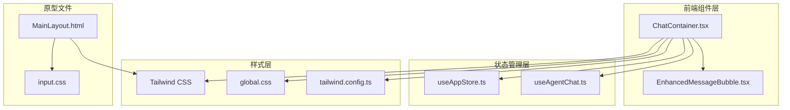
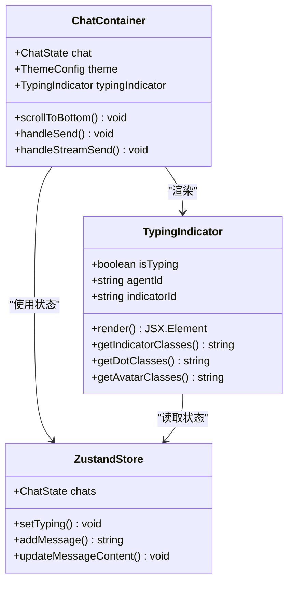
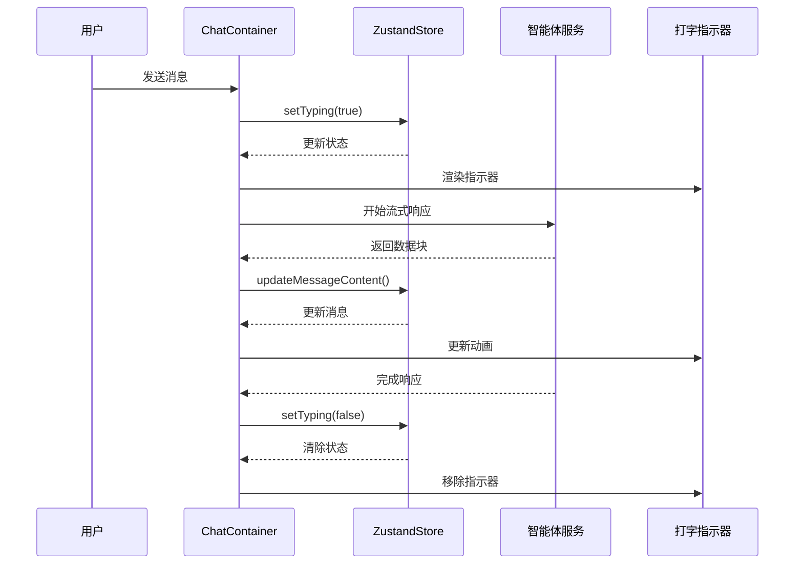
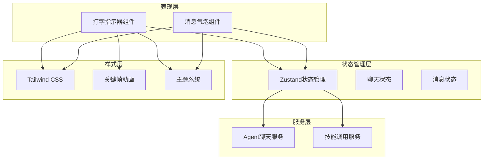
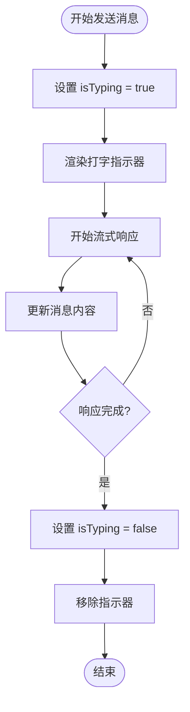
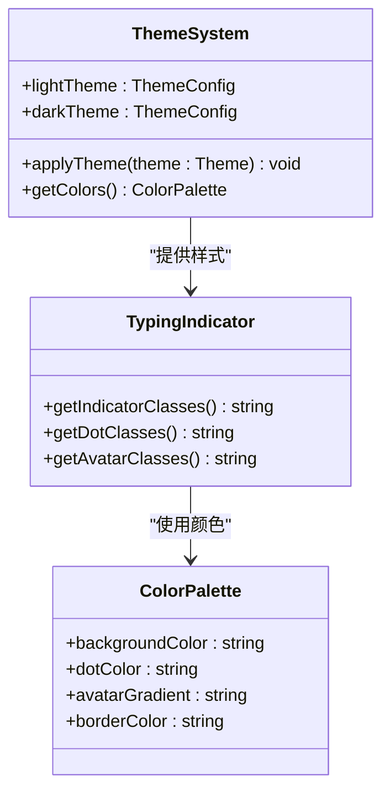
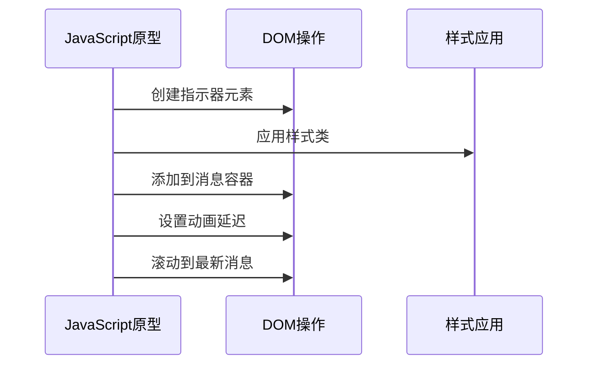
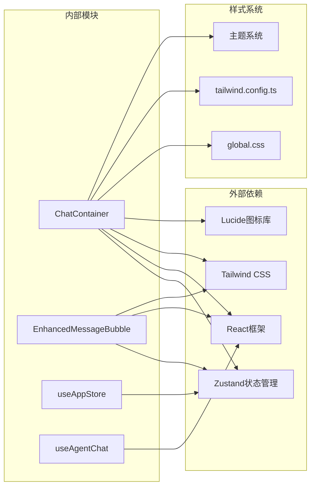
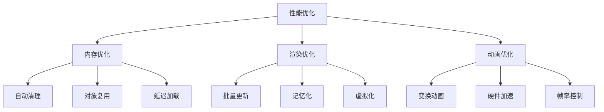

# 输入指示器系统

<cite>
**本文档引用的文件**
- [ChatContainer.tsx](file://src/components/chat/ChatContainer.tsx)
- [EnhancedMessageBubble.tsx](file://src/components/chat/EnhancedMessageBubble.tsx)
- [useAppStore.ts](file://src/store/useAppStore.ts)
- [useAgentChat.ts](file://src/hooks/useAgentChat.ts)
- [tailwind.config.ts](file://tailwind.config.ts)
- [global.css](file://src/styles/global.css)
- [tailwind.css](file://src/styles/tailwind.css)
- [input.css](file://prototypes/css/input.css)
- [MainLayout.html](file://prototypes/MainLayout.html)
</cite>

## 目录
1. [简介](#简介)
2. [项目结构](#项目结构)
3. [核心组件](#核心组件)
4. [架构概览](#架构概览)
5. [详细组件分析](#详细组件分析)
6. [依赖关系分析](#依赖关系分析)
7. [性能考虑](#性能考虑)
8. [故障排除指南](#故障排除指南)
9. [结论](#结论)

## 简介

输入指示器系统是AutoMate聊天界面中的重要交互组件，负责向用户显示智能体正在处理消息的状态。该系统实现了完整的打字指示器功能，包括视觉反馈、动画效果和状态管理，为用户提供清晰的交互体验。

系统的核心功能包括：
- 实时显示智能体输入状态
- 流畅的打字动画效果
- 主题兼容性和响应式设计
- 智能体状态跟踪和管理
- 性能优化和用户体验改进

## 项目结构

输入指示器系统主要分布在以下文件中：



**图表来源**
- [ChatContainer.tsx](file://src/components/chat/ChatContainer.tsx#L1-L756)
- [useAppStore.ts](file://src/store/useAppStore.ts#L1-L306)
- [tailwind.config.ts](file://tailwind.config.ts#L104-L160)

**章节来源**
- [ChatContainer.tsx](file://src/components/chat/ChatContainer.tsx#L1-L756)
- [useAppStore.ts](file://src/store/useAppStore.ts#L1-L306)

## 核心组件

### 打字指示器组件

打字指示器系统的核心组件是位于聊天容器中的指示器显示逻辑：



**图表来源**
- [ChatContainer.tsx](file://src/components/chat/ChatContainer.tsx#L687-L697)
- [useAppStore.ts](file://src/store/useAppStore.ts#L242-L253)

### 动画系统

系统使用自定义的打字动画效果：



**图表来源**
- [ChatContainer.tsx](file://src/components/chat/ChatContainer.tsx#L254-L392)
- [useAppStore.ts](file://src/store/useAppStore.ts#L242-L253)

**章节来源**
- [ChatContainer.tsx](file://src/components/chat/ChatContainer.tsx#L510-L516)
- [tailwind.config.ts](file://tailwind.config.ts#L142-L145)

## 架构概览

输入指示器系统采用分层架构设计，确保组件间的松耦合和高内聚：



**图表来源**
- [useAppStore.ts](file://src/store/useAppStore.ts#L28-L33)
- [useAgentChat.ts](file://src/hooks/useAgentChat.ts#L84-L119)

## 详细组件分析

### 打字指示器实现

#### 状态管理机制

打字指示器通过Zustand状态管理系统进行状态跟踪：



**图表来源**
- [ChatContainer.tsx](file://src/components/chat/ChatContainer.tsx#L254-L392)
- [useAppStore.ts](file://src/store/useAppStore.ts#L242-L253)

#### 动画实现细节

系统使用CSS关键帧实现流畅的打字动画效果：

| 动画属性 | 值 | 描述 |
|---------|----|------|
| 动画名称 | typingBounce | 自定义打字弹跳动画 |
| 持续时间 | 1.4s | 动画循环周期 |
| 缓动函数 | ease-in-out | 平滑的加速减速效果 |
| 动画填充 | both | 保持起始和结束状态 |

#### 主题兼容性设计

系统支持深色和浅色主题的自动适配：



**图表来源**
- [ChatContainer.tsx](file://src/components/chat/ChatContainer.tsx#L510-L539)
- [useAppStore.ts](file://src/store/useAppStore.ts#L85-L107)

**章节来源**
- [ChatContainer.tsx](file://src/components/chat/ChatContainer.tsx#L687-L697)
- [global.css](file://src/styles/global.css#L260-L285)

### 消息气泡集成

打字指示器与消息气泡系统无缝集成：

| 组件 | 功能 | 样式类 | 动画效果 |
|------|------|--------|----------|
| 指示器容器 | 显示打字状态 | `bg-gray-200/90` | 无 |
| 点状元素 | 动画指示器 | `w-2 h-2 bg-gray-400` | `animate-typing-bounce` |
| 头像容器 | 智能体头像 | `bg-gradient-to-br` | 无 |
| 时间戳 | 消息时间显示 | `text-xs text-gray-500` | 无 |

**章节来源**
- [EnhancedMessageBubble.tsx](file://src/components/chat/EnhancedMessageBubble.tsx#L1-L217)

### 原型系统对比

早期原型系统提供了基础的JavaScript实现：



**图表来源**
- [MainLayout.html](file://prototypes/MainLayout.html#L2471-L2487)

**章节来源**
- [MainLayout.html](file://prototypes/MainLayout.html#L2447-L2497)

## 依赖关系分析

输入指示器系统的依赖关系如下：



**图表来源**
- [useAppStore.ts](file://src/store/useAppStore.ts#L1-L83)
- [ChatContainer.tsx](file://src/components/chat/ChatContainer.tsx#L1-L11)

**章节来源**
- [useAgentChat.ts](file://src/hooks/useAgentChat.ts#L1-L128)

## 性能考虑

### 内存管理优化

系统采用多种策略确保内存使用效率：

1. **指示器生命周期管理**
   - 自动清理已完成的指示器元素
   - 防止重复创建多个指示器实例
   - 及时释放DOM节点引用

2. **状态更新优化**
   - 使用批量状态更新减少重渲染
   - 避免不必要的组件重新挂载
   - 合理的定时器管理

3. **动画性能优化**
   - 使用transform属性替代布局属性
   - 启用硬件加速的动画
   - 控制动画频率避免过度重绘

### 渲染性能优化



**章节来源**
- [ChatContainer.tsx](file://src/components/chat/ChatContainer.tsx#L267-L293)

## 故障排除指南

### 常见问题及解决方案

| 问题类型 | 症状 | 可能原因 | 解决方案 |
|----------|------|----------|----------|
| 指示器不显示 | 打字状态正常但无动画 | 状态更新失败 | 检查setTyping调用 |
| 动画卡顿 | 动画不流畅或掉帧 | 性能问题 | 优化渲染频率 |
| 样式错乱 | 指示器样式异常 | 主题切换问题 | 检查主题配置 |
| 内存泄漏 | 页面加载后内存持续增长 | DOM节点未清理 | 确认清理逻辑 |

### 调试技巧

1. **状态检查**
   ```javascript
   // 在浏览器控制台检查状态
   console.log('当前聊天状态:', useAppStore.getState().chats);
   console.log('智能体状态:', useAppStore.getState().chats[agentId]);
   ```

2. **性能监控**
   - 使用浏览器性能面板监控动画帧率
   - 检查内存使用情况
   - 监控组件重渲染次数

3. **网络调试**
   - 检查流式响应的网络请求
   - 监控API响应时间
   - 验证错误处理机制

**章节来源**
- [useAppStore.ts](file://src/store/useAppStore.ts#L242-L253)

## 结论

输入指示器系统通过精心设计的架构和实现，为用户提供了流畅、直观的交互体验。系统的主要优势包括：

1. **完整的功能实现** - 支持智能体状态跟踪、动画效果和主题适配
2. **优秀的性能表现** - 通过多种优化策略确保流畅的用户体验
3. **良好的可维护性** - 清晰的组件分离和状态管理
4. **灵活的扩展性** - 易于定制和扩展新的功能特性

未来可以考虑的改进方向包括：
- 增加更多的动画效果选项
- 支持自定义指示器样式
- 优化移动端的触摸交互
- 增强无障碍访问支持